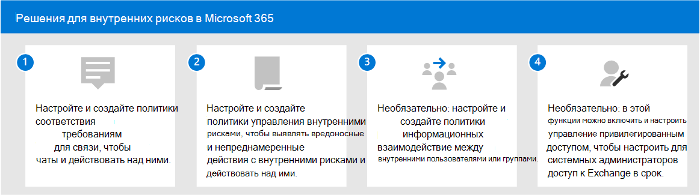

# Решения для внутренних рисков в Microsoft 365

Риски внутри системы безопасности — одна из главных проблем специалистов по безопасности и обеспечению соответствия требованиям на современном рабочем месте. Отраслевые исследования показали, что внутренние риски часто связаны с определенными событиями или действиями пользователей. Защитить организацию от этих рисков может быть сложно определить и устранить. Риски, связанные с организацией, включают уязвимости в различных областях и могут вызывать серьезные проблемы в организации, начиная с потери интеллектуальной собственности и до устранения на рабочем месте и других. На следующем рисунке описаны распространенные внутренние риски:

Функции предотвращения рисков в Microsoft 365 разработаны и встроены в наши внутренние продукты и решения по рискам. Эти решения работают вместе и используют расширенные службы и сторонние индикаторы для быстрого определения, оценки и действий над действиями с рисками. Большинство решений предлагают комплексный рабочий процесс обнаружения, оповещения и устранения проблем, с помощью который аналитики данных и исследователи могут быстро реагировать на эти риски и свести к минимуму их.

| Значок риска | Риски | Соответствие требованиям к обмену данными | Управление внутренними рисками | Информационные барьеры | Управление привилегированным доступом |
| :---- | :-------- | :--------------------------- | :-------------------------- |:-------------------------| :--------------------------------|
| | Утечка данных |  |  |  |  |
| | Нарушения конфиденциальности |  |  |  |  |
| | Кража IP-адресов |  |  |  |  |
| | Местная неугомя |  |  |  |  |
| | Мошенничество |  |  |  |  |
| | Нарушения политики |  |  |  |  |
| | Insider trading |  |  |  |  |
| | Конфликты интересов |  |  |  |  |
| | Утечки конфиденциальных данных |  |  |  |  |
| | Рабочая угона |  |  |  |  |
| | Нарушения безопасности |  |  |  |  |
| | Нарушения нормативных требований |  |  |  |  |

## Решения для внутренних рисков в Microsoft 365

Чтобы защитить организацию от рисков, связанных с внутренней оценкой, используйте эти возможности и функции Microsoft 365.

### Соответствие требованиям к обмену данными

Соответствие требованиям к коммуникациям помогает свести к минимуму риски для связи, помогая обнаруживать, захватывать и действовать над недопустимыми сообщениями в организации. Соответствие требованиям к коммуникациям доступно в следующих подписках:

- Подписка microsoft 365 E5 (платная или пробная версия)
- Подписка microsoft 365 E3 + надстройка соответствия требованиям Microsoft 365 E5
- Подписка microsoft 365 E3 + надстройка Microsoft 365 E5 Insider Risk Management
- Подписка на Microsoft 365 A5 (платная или пробная версия)
- Подписка на Microsoft 365 A3 + надстройка соответствия требованиям Microsoft 365 A5
- Подписка на Microsoft 365 A3 + надстройка microsoft 365 A5 Insider Risk Management
- Подписка на Microsoft 365 G5 (платная или пробная версия)
- Подписка на Microsoft 365 G5 + надстройка соответствия требованиям Microsoft 365 G5
- Подписка на Microsoft 365 G5 + надстройка Microsoft 365 G5 Insider Risk Management
- Подписка на Office 365 корпоративный E5 (платная или пробная версия)
- Подписка на Office 365 A5 (платная или пробная версия)
- Подписка на Office 365 корпоративный E3 + надстройка Office 365 Advanced Compliance (больше недоступна для новых подписок)

### Управление внутренними рисками

Управление внутренними рисками помогает свести к минимуму внутренние риски, позволяя обнаруживать, исследовать и действовать над вредоносными и случайными действиями в организации.

Управление рисками внутри организации доступно в следующих подписках:

- Подписка microsoft 365 E5 (платная или пробная версия)
- Подписка microsoft 365 E3 + надстройка соответствия требованиям Microsoft 365 E5
- Подписка microsoft 365 E3 + надстройка Microsoft 365 E5 Insider Risk Management
- Подписка на Microsoft 365 A5 (платная или пробная версия)
- Подписка на Microsoft 365 A3 + надстройка соответствия требованиям Microsoft 365 A5
- Подписка на Microsoft 365 A3 + надстройка microsoft 365 A5 Insider Risk Management
- Подписка на Microsoft 365 G5 (платная или пробная версия)
- Подписка на Microsoft 365 G3 + надстройка соответствия требованиям Microsoft 365 G5
- Подписка на Microsoft 365 G3 + надстройка Microsoft 365 G5 Insider Risk Management

### Информационные барьеры

Информационные барьеры позволяют ограничить взаимодействие и совместную работу между двумя внутренними группами, чтобы избежать конфликта интересов в организации.

Информационные барьеры доступны в следующих подписках:

- Подписка microsoft 365 E5 (платная или пробная версия)
- Подписка на Microsoft 365 A5 (платная или пробная версия)
- Подписка на Office 365 корпоративный E5 (платная или пробная версия)
- Подписка на Office 365 A5 (платная или пробная версия)
- Надстройка Office 365 Advanced Compliance (больше недоступна для новых подписок)
- Подписка microsoft 365 E3 + надстройка соответствия требованиям Microsoft 365 E5
- Подписка microsoft 365 E3 + надстройка Microsoft 365 E5 Insider Risk Management
- Подписка на Microsoft 365 A3 + надстройка соответствия требованиям Microsoft 365 A5
- Подписка на Microsoft 365 A3 + надстройка microsoft 365 A5 Insider Risk Management

### Управление привилегированным доступом

Управление привилегированным доступом позволяет детально контролировать доступ к привилегированным задачам администратора Exchange Online в Office 365. Она помогает защитить организацию от нарушений безопасности, в которых используются существующие привилегированные учетные записи администраторов с постоянным доступом к конфиденциальным данным или доступом к критически важным настройкам конфигурации.

Управление привилегированным доступом доступно в следующих подписках:

- Подписка microsoft 365 E5 (платная или пробная версия)
- Подписка на Microsoft 365 A5 (платная или пробная версия)
- Подписка на Office 365 корпоративный E5 (платная или пробная версия)
- Подписка на Office 365 A5 (платная или пробная версия)
- Подписка microsoft 365 E3 + надстройка соответствия требованиям Microsoft 365 E5
- Подписка microsoft 365 E3 + надстройка Microsoft 365 E5 Information Protection и управление
- Подписка на Microsoft 365 A3 + надстройка соответствия требованиям Microsoft 365 A5
- Подписка на Microsoft 365 A3 + надстройка Microsoft 365 A5 Information Protection и управление

## Развертывание решений, связанных с insider risk, в Microsoft 365

Чтобы защитить организацию от рисков, связанных с внутренней оценкой, необходимо настроить и развернуть следующие решения Microsoft 365:

1. Настройте и создайте [политики соответствия коммуникациям.](communication-compliance-solution-overview.md)
2. Настройте и создайте [политики управления рисками внутри организации.](insider-risk-management-solution-overview.md)
3. Необязательно: настройте и создайте [политики информационных барьеров.](information-barriers-solution-overview.md)
4. Необязательно: в включить и настроить управление [привилегированным доступом.](privileged-access-management-solution-overview.md)

## Иллюстрации с примерами

Чтобы спланировать интегрированную стратегию для реализации возможностей встроенных рисков Microsoft 365, скачайте набор иллюстраций к возможностям защиты информации и соответствия требованиям *Microsoft 365.* О возможностях insider risk см. на иллюстрациях архитектуры 5–7. Вы можете адаптировать эти изображения для собственного применения.

| Элемент | Описание |
|:-----|:------------|
|   [Скачивание в формате PDF](https://download.microsoft.com/download/3/a/6/3a6ab1a3-feb0-4ee2-8e77-62415a772e53/m365-compliance-illustrations.pdf) \| [Скачивание в качестве Visio](https://download.microsoft.com/download/3/a/6/3a6ab1a3-feb0-4ee2-8e77-62415a772e53/m365-compliance-illustrations.vsdx)     Обновлено в октябре 2020 г.|Содержимое: <ul><li>  Защита информации (Майкрософт) и защита от потери данных</li><li>Политики и метки хранения </li><li>Информационные барьеры</li><li>Соответствие требованиям к обмену данными</li><li>Управление внутренними рисками</li><li>Внедрение сторонних данных</li>|

## Учебные курсы

Обучение администраторов и специалистов по обеспечению соответствия требованиям основам каждого решения для оценки риска внутри организации поможет вашей организации быстрее при развертывании и внедрении. 

Microsoft 365 предоставляет следующие ресурсы для информирования и обучения этих пользователей в организации:

| Решение или область | Ресурсы |
|:------------------|:--------------|
| Управление рисками внутри компании в Microsoft 365 |[Полный путь обучения](/learn/paths/m365-compliance-insider)   Этот путь обучения включает все отдельные модули решения для обеспечения соответствия коммуникации, управления внутри организации рисками, информационных барьеров и управления привилегированным доступом. Выберите этот путь обучения, чтобы завершить все модули. |
| Соответствие требованиям к обмену данными | [Модуль обучения: подготовка соответствия коммуникации требованиям в Microsoft 365](/learn/modules/m365-compliance-insider-prepare-communication-compliance)   Этот модуль поможет вам изучить основы выявления и устранения нарушений политики поведения с соблюдением требований к коммуникациям, определить необходимые условия перед созданием политик соответствия коммуникации, а также узнать о типах встроенных, предварительно определенных шаблонов политики в соответствии с коммуникацией. |
| Управление внутренними рисками | [Модуль обучения: управление рисками внутри организации в Microsoft 365](/learn/modules/m365-compliance-insider-manage-insider-risk)   Этот модуль помогает узнать, как управление внутренними рисками в Microsoft 365 помогает предотвратить, обнаруживать и содержать внутренние риски в организации, узнать о типах встроенных, предварительно определенных шаблонов политики, изучить основные предварительные условия, необходимые перед созданием политик внутренних рисков, и поясняет типы действий, которые можно принять в случае управления внутренними рисками. |
| Информационные барьеры | [Модуль обучения: планирование информационных барьеров](/learn/modules/m365-compliance-insider-plan-information-barriers)   Этот модуль помогает узнать, как политики информационных барьеров могут помочь вашей организации обеспечить соответствие соответствующим отраслевым стандартам и нормативным требованиям, перечислены типы ситуаций, в которые могут применяться информационные барьеры, объясняется процесс создания политики информационных барьеров и объясняется, как устранять непредвиденные проблемы после создания информационных барьеров. |
| Управление привилегированным доступом | [Модуль обучения: реализация управления привилегированным доступом](/learn/modules/m365-compliance-insider-implement-privileged-access-management)   Этот модуль помогает понять разницу между управлением привилегированным доступом и привилегированным управлением удостоверениями, понять поток процесса управления привилегированным доступом и понять основы настройки и обеспечения управления привилегированным доступом. |
