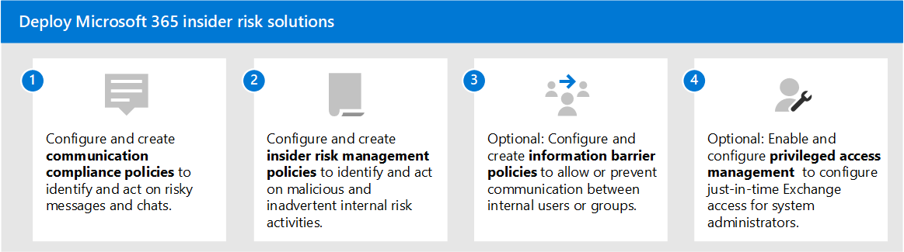

# Решения для внутренних рисков в Microsoft 365

Риски, связанные с инсайдерской деятельностью, являются одной из главных проблем специалистов по обеспечению безопасности и соответствия требованиям на современном рабочем месте. Отраслевые исследования показали, что риски, связанные с инсайдерской деятельностью, часто связаны с определенными событиями или действиями пользователей. Защита организации от этих рисков может быть сложной задачей для выявления и смягчения. Риски, связанные с инсайдерской деятельностью, включают уязвимости в различных областях и могут вызывать серьезные проблемы для организации, начиная от потери интеллектуальной собственности и до преследования на рабочем месте и других. На следующем рисунке описаны общие риски для инсайдеров:

Функции предотвращения рисков Microsoft 365 разработаны и встроены в наши продукты и решения для инсайдерского риска. Эти решения работают вместе и используют расширенные службы и индикаторы 3rd-party, чтобы помочь вам быстро определить, обработать и действовать в области активности риска. Большинство решений предлагают комплексный рабочий процесс обнаружения, оповещения и устранения для аналитиков данных и исследователей, чтобы быстро действовать и минимизировать эти риски.

| Значок риска | Риски | Соответствие требованиям к обмену данными | Управление внутренними рисками | Информационные барьеры | Управление привилегированным доступом |
| :---- | :-------- | :--------------------------- | :-------------------------- |:-------------------------| :--------------------------------|
| | Утечка данных |  |  |  |  |
| | Нарушения конфиденциальности |  |  |  |  |
| | Кража IP |  |  |  |  |
| | Насилие на рабочем месте |  |  |  |  |
| | Мошенничество |  |  |  |  |
| | Нарушения политики |  |  |  |  |
| | Инсайдерской торговли |  |  |  |  |
| | Конфликты интересов |  |  |  |  |
| | Утечки конфиденциальных данных |  |  |  |  |
| | Домогательства на рабочем месте |  |  |  |  |
| | Нарушения безопасности |  |  |  |  |
| | Нарушения нормативных требований |  |  |  |  |

## Решения для внутренних рисков в Microsoft 365

Чтобы защитить организацию от рисков, связанных с инсайдерской деятельностью, используйте эти возможности и функции Microsoft 365.

### Соответствие требованиям к обмену данными

Соответствие требованиям к коммуникации позволяет свести к минимуму риски для связи, помогая обнаруживать, фиксировать и действовать при ненадлежащих сообщениях в организации. Соответствие требованиям связи доступно в следующих подписках:

- Подписка на Microsoft 365 E5 (платная или пробная версия)
- Подписка microsoft 365 E3 + надстройка соответствия требованиям Microsoft 365 E5
- Подписка microsoft 365 E3 + надстройка для управления рисками для инсайдеров Microsoft 365 E5
- Подписка microsoft 365 A5 (платная или пробная версия)
- Подписка microsoft 365 A3 + надстройка соответствия требованиям Microsoft 365 A5
- Подписка microsoft 365 A3 + надстройка microsoft 365 A5 Для управления рисками
- Подписка microsoft 365 G5 (платная или пробная версия)
- Подписка microsoft 365 G5 + надстройка соответствия требованиям Microsoft 365 G5
- Подписка microsoft 365 G5 + надстройка microsoft 365 G5 Insider Risk Management
- Подписка на Office 365 Enterprise E5 (платная или пробная версия)
- Подписка на Office 365 A5 (платная или пробная версия)
- Подписка на Office 365 Enterprise E3 + надстройка Office 365 Advanced Compliance (больше недоступна для новых подписок)

### Управление внутренними рисками

Управление рисками изнутри позволяет минимизировать внутренние риски, позволяя обнаруживать, исследовать и действовать при вредоносных и непреднамеренных действиях в организации.

Управление рисками изнутри доступно в следующих подписках:

- Подписка на Microsoft 365 E5 (платная или пробная версия)
- Подписка microsoft 365 E3 + надстройка соответствия требованиям Microsoft 365 E5
- Подписка microsoft 365 E3 + надстройка для управления рисками для инсайдеров Microsoft 365 E5
- Подписка microsoft 365 A5 (платная или пробная версия)
- Подписка microsoft 365 A3 + надстройка соответствия требованиям Microsoft 365 A5
- Подписка microsoft 365 A3 + надстройка microsoft 365 A5 Для управления рисками
- Подписка microsoft 365 G5 (платная или пробная версия)
- Подписка microsoft 365 G3 + надстройка соответствия требованиям Microsoft 365 G5
- Подписка microsoft 365 G3 + надстройка microsoft 365 G5 Insider Risk Management
- Подписка на Office 365 E3 + корпоративная мобильность и безопасность E3 + надстройка соответствия требованиям Microsoft 365 E5

### Информационные барьеры

Информационные барьеры позволяют ограничить общение и совместную работу между двумя внутренними группами, чтобы избежать конфликта интересов в организации.

Информационные барьеры доступны в следующих подписках:

- Подписка на Microsoft 365 E5 (платная или пробная версия)
- Подписка microsoft 365 A5 (платная или пробная версия)
- Подписка на Office 365 Enterprise E5 (платная или пробная версия)
- Подписка на Office 365 A5 (платная или пробная версия)
- Надстройка Office 365 Advanced Compliance (больше недоступна для новых подписок)
- Подписка microsoft 365 E3 + надстройка соответствия требованиям Microsoft 365 E5
- Подписка microsoft 365 E3 + надстройка для управления рисками для инсайдеров Microsoft 365 E5
- Подписка microsoft 365 A3 + надстройка соответствия требованиям Microsoft 365 A5
- Подписка microsoft 365 A3 + надстройка microsoft 365 A5 Для управления рисками

### Управление привилегированным доступом

Управление привилегированным доступом позволяет контролировать доступ к привилегированным задачам администрирования Exchange Online в Office 365. Она может защитить организацию от нарушений, которые используют существующие привилегированные учетные записи администратора с постоянным доступом к конфиденциальным данным или доступом к критически важным настройкам конфигурации.

Управление привилегированным доступом доступно в следующих подписках:

- Подписка на Microsoft 365 E5 (платная или пробная версия)
- Подписка microsoft 365 A5 (платная или пробная версия)
- Подписка на Office 365 Enterprise E5 (платная или пробная версия)
- Подписка на Office 365 A5 (платная или пробная версия)
- Подписка microsoft 365 E3 + надстройка соответствия требованиям Microsoft 365 E5
- Подписка microsoft 365 E3 + надстройка Microsoft 365 E5 по защите информации и управлению
- Подписка microsoft 365 A3 + надстройка соответствия требованиям Microsoft 365 A5
- Подписка microsoft 365 A3 + надстройка Microsoft 365 A5 по защите информации и управлению

## Развертывание решений по инсайдерской опасности Microsoft 365

Чтобы защитить организацию от рисков, связанных с инсайдерской деятельностью, настройка и развертывание следующих решений Microsoft 365:

1. Настройка и создание [политик соответствия требованиям к коммуникациям.](communication-compliance-solution-overview.md)
2. Настройка и создание [политик управления рисками изнутри.](insider-risk-management-solution-overview.md)
3. Необязательный: настройка и создание [политик информационного барьера.](information-barriers-solution-overview.md)
4. Необязательный: включить и настроить [управление привилегированным доступом.](privileged-access-management-solution-overview.md)

## Иллюстрации с примерами

Чтобы помочь вам спланировать интегрированную стратегию для реализации возможностей инсайдерского риска Microsoft 365, скачайте набор иллюстраций для защиты информации и соответствия требованиям *Microsoft 365.* Для возможностей инсайдерского риска см. страницы иллюстрации архитектуры 5-7. Вы можете адаптировать эти изображения для собственного применения.

| Элемент | Описание |
|:-----|:------------|
|   [Скачивание в формате PDF](https://download.microsoft.com/download/3/a/6/3a6ab1a3-feb0-4ee2-8e77-62415a772e53/m365-compliance-illustrations.pdf) \| [Скачать в качестве visio](https://download.microsoft.com/download/3/a/6/3a6ab1a3-feb0-4ee2-8e77-62415a772e53/m365-compliance-illustrations.vsdx)     Обновленный октябрь 2020 г.|Содержимое: <ul><li>  Защита информации (Майкрософт) и защита от потери данных</li><li>Политики и метки хранения </li><li>Информационные барьеры</li><li>Соответствие требованиям к обмену данными</li><li>Управление внутренними рисками</li><li>Внедрение сторонних данных</li>|

## Учебные курсы

Обучение администраторов и группы соответствия требованиям основам для каждого решения для инсайдерской угрозы поможет вашей организации быстрее начать работу с развертыванием и реализацией. 

Microsoft 365 предоставляет следующие ресурсы, которые помогут информировать и обучать этих пользователей в вашей организации:

| Решение/область | Ресурсы |
|:------------------|:--------------|
| Управление инсайдерской угрозой в Microsoft 365 |[Полный путь обучения](/learn/paths/m365-compliance-insider)   Этот путь обучения включает все отдельные модули решений для соответствия требованиям к коммуникации, управления рисками, информационных барьеров и управления привилегированным доступом. Выберите этот путь обучения для завершения всех модулей. |
| Соответствие требованиям к обмену данными | [Модуль обучения: подготовка соответствия требованиям к общению в Microsoft 365](/learn/modules/m365-compliance-insider-prepare-communication-compliance)   Этот модуль поможет вам узнать основы выявления и устранения нарушений политики кода поведения с соблюдением правил связи, охватить необходимые условия перед созданием политик соответствия требованиям связи, а также узнать о типах встроенных, заранее определенных шаблонов политики в соответствии с коммуникацией. |
| Управление внутренними рисками | [Модуль обучения: управление рисками для инсайдеров в Microsoft 365](/learn/modules/m365-compliance-insider-manage-insider-risk)   Этот модуль поможет вам узнать, как управление рисками изнутри в Microsoft 365 может помочь предотвратить, обнаружить и содержать внутренние риски в организации, узнать о типах встроенных, заранее определенных шаблонов политики, понять основные предпосылки, необходимые перед созданием инсайдерской политики риска, и объясняет типы действий, которые можно принять в случаях управления внутренними рисками. |
| Информационные барьеры | [Модуль обучения: планирование информационных барьеров](/learn/modules/m365-compliance-insider-plan-information-barriers)   Этот модуль поможет вам узнать, как политики информационного барьера могут помочь вашей организации поддерживать соблюдение соответствующих отраслевых стандартов и нормативных актов, перечисляет типы ситуаций, когда будут применяться информационные барьеры, помогает объяснить процесс создания политики информационного барьера и помогает объяснить, как устранить непредвиденные проблемы после создания информационных барьеров. |
| Управление привилегированным доступом | [Модуль обучения: реализация управления привилегированным доступом](/learn/modules/m365-compliance-insider-implement-privileged-access-management)   Этот модуль поможет вам понять разницу между управлением привилегированным доступом и привилегированным управлением удостоверениями, понять поток процесса управления привилегированным доступом и понять основы настройки и включить управление привилегированным доступом. |
