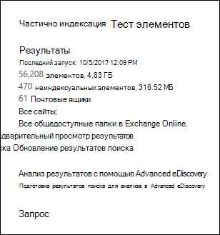

# <a name="investigating-partially-indexed-items-in-ediscovery"></a>Исследование частично индексированных элементов в eDiscovery

Поиск eDiscovery, который вы запускаете из центра соответствия требованиям Microsoft 365, автоматически включает частично индексированные элементы в оценочные результаты поиска при выполнении поиска. Частично индексированные элементы — это элементы почтовых ящиков Exchange и документы на сайтах SharePoint и OneDrive для бизнеса, по которым по какой-либо причине не удалось выполнить индексирование для поиска. Большинство сообщений электронной почты и документов сайта успешно индексированы, так как они попадают в [пределы индексации сообщений электронной почты](limits-for-content-search.md#indexing-limits-for-email-messages). Однако некоторые элементы могут превысить эти ограничения индексации и будут частично индексироваться. Ниже приведены причины, по которым не удается индексировать элементы для поиска и возвращаются в виде частично индексированных элементов при выполнении поиска обнаружения электронных данных.
  
- Сообщения электронной почты имеют вложенный файл без допустимого обработчика, например файлов изображений; Это наиболее распространенная причина частично индексированных элементов электронной почты

- Слишком много файлов, вложенных в сообщение электронной почты

- Слишком большой файл, вложенный в сообщение электронной почты

- Тип файла поддерживается для индексирования, но для определенного файла возникла ошибка индексирования

Несмотря на то, что это зависит от большинства организаций, большинство организаций имеют менее 1% содержимого по объему и менее 12% содержимого по размеру, частично индексируемому. Причина разницы между Томом и размером состоит в том, что большие файлы имеют большую вероятность того, что содержимое не может быть полностью индексировано.
  
## <a name="why-does-the-partially-indexed-item-count-change-for-a-search"></a>Почему изменяется количество элементов с частичным индексированием для поиска?

После выполнения поиска обнаружения электронных данных общее число и размер частично индексированных элементов в найденных расположениях перечислены в статистике результатов поиска, которая отображается в подробных статистических данных для поиска. Обратите внимание на то, что в статистике поиска называются  *неиндексированные элементы*  . Ниже приведены некоторые моменты, которые влияют на количество частично индексированных элементов, возвращенных в результатах поиска.
  
- Если элемент частично индексируется и соответствует поисковому запросу, он включается в число (и размер) элементов результатов поиска и частично индексированных элементов. Однако при экспорте результатов поиска элемент включается только с набором результатов поиска; Он не входит в состав частично индексированного элемента.

- Если указать диапазон дат для поискового запроса (включив его в запрос ключевых слов или с помощью условия), то все частично индексированные элементы, которые не совпадают с диапазоном дат, не включаются в число частично индексированных элементов. Количество частично индексированных элементов включает только частично индексированные элементы, которые попадают в диапазон дат.

> [!NOTE]
> Частично индексированные элементы, расположенные в сайтах SharePoint и OneDrive, *не* включаются в оценку частично индексированных элементов, отображаемых в подробных статистике поиска. Однако при экспорте результатов поиска с обнаружением электронных данных можно экспортировать частично индексированные элементы. Например, если вы ищете только сайты, то оценочное количество частично индексированных элементов будет равно нулю.
  
## <a name="calculating-the-ratio-of-partially-indexed-items-in-your-organization"></a>Вычисление соотношения частично индексированных элементов в Организации

Чтобы получить представление о выпуске частично индексированных элементов в Организации, можно выполнить поиск всего контента во всех почтовых ящиках (с помощью запроса с пустым ключевым словом). В следующем примере ниже представлено 56 208 (4 830 МБ) полных индексированных элементов и 470 (316 МБ) частично индексированных элементов.
  

  
Вы можете определить процент частично индексированных элементов с помощью следующих вычислений.
  
 **Чтобы вычислить отношение частично индексированных элементов в Организации:**

`(Total number of partially indexed items/Total number of items) x 100`

`(470/56,208) x 100 = 0.84%`

С помощью результатов поиска из предыдущего примера. 84% всех элементов почтовых ящиков частично индексируются.
  
 **Чтобы вычислить процент от размера частично индексированных элементов в Организации, выполните указанные ниже действия.**

`(Size of all partially indexed items/Size of all items) x 100`

`(316 MB/4830 MB) x 100 = 6.54%`

Таким образом, в предыдущем примере 6,54% общего размера элементов почтового ящика из частично индексированных элементов. Как отмечалось ранее, большинство организаций содержит менее 1% контента по объему и менее 12% содержимого по размеру, частично индексируемому.

## <a name="working-with-partially-indexed-items"></a>Работа с частично индексированными элементами

В случаях, когда необходимо изучить частичные элементы, чтобы убедиться, что они не содержат релевантных сведений, можно [экспортировать отчет о поиске контента](export-a-content-search-report.md) , содержащий сведения об частично индексированных элементах. При экспорте отчета по поиску контента обязательно Выбирайте один из вариантов экспорта, включающий частично индексированные элементы.
  

  
При экспорте результатов поиска с обнаружением электронных данных или отчета поиска с помощью одного из этих параметров экспорт включает отчет с именем "неиндексируемый Items.csv". Этот отчет включает большинство тех же сведений, что и файл ResultsLog.csv; Однако неиндексируемый файл Items.csv также содержит два поля, связанные с частично индексированными элементами: **теги ошибок** и **свойства ошибок**. В этих полях содержатся сведения об ошибке индексирования для каждого элемента с частичным индексированием. Использование информации в этих двух полях поможет определить, может ли ошибка индексирования отявляться на конкретном проходе расследования. Если это так, можно выполнить целевой поиск и извлечь и экспортировать определенные сообщения электронной почты, а также документы SharePoint или OneDrive, чтобы проверить, важны ли они для вашего расследования. Пошаговые инструкции приведены [в разделе Подготовка CSV-файла для целевого поиска в Office 365](csv-file-for-an-id-list-content-search.md).

> [!NOTE]
> Неиндексированный файл Items.csv также содержит поля с именами " **тип ошибки** " и " **сообщение об ошибке** ". Это устаревшие поля, содержащие сведения, аналогичные сведениям в полях **ошибки** и **свойствах ошибок** , но с меньшими сведениями. Вы можете спокойно проигнорировать эти устаревшие поля.
  
## <a name="errors-related-to-partially-indexed-items"></a>Ошибки, связанные с частично индексированными элементами

Теги ошибок состоят из двух частей информации, ошибки и типа файла. Например, в этой ошибке или указанном сочетании:

```text
 parseroutputsize_xls
```

 `parseroutputsize` — Это ошибка и `xls` Тип файла, в котором произошла ошибка. В случаях, когда тип файла не распознан или тип файла не применен к ошибке, вы увидите значение `noformat` на месте типа файла.
  
Ниже приведен список ошибок индексирования и описание возможных причин ошибки.
  
|**Тег Error**|**Описание**|
|:-----|:-----|
| `attachmentcount` <br/> |В сообщении электронной почты слишком много вложений, и некоторые из этих вложений не были обработаны.  <br/> |
| `attachmentdepth` <br/> |Средство извлечения контента и средство синтаксического анализа документов обнаружили слишком много уровней вложений, вложенных в другие вложения. Некоторые из этих вложений не были обработаны.  <br/> |
| `attachmentrms` <br/> |Не удалось декодировать вложение, так как оно защищено службой управления правами.  <br/> |
| `attachmentsize` <br/> |Файл, вложенный в сообщение электронной почты, имеет слишком большой размер и не может быть обработан.  <br/> |
| `indexingtruncated` <br/> |При записи обработанного сообщения электронной почты в индекс одно из индексируемых свойств было слишком большим и усечено. Усеченные свойства перечислены в поле свойства ошибки.  <br/> |
| `invalidunicode` <br/> |Сообщение электронной почты содержит текст, который не удалось обработать как допустимый Юникод. Индексирование этого элемента может быть неполным.  <br/> |
| `parserencrypted` <br/> |Содержимое вложения или сообщения электронной почты зашифровано, а Microsoft 365 не удалось расшифровать содержимое.  <br/> |
| `parsererror` <br/> |Во время синтаксического анализа произошла неизвестная ошибка. Это обычно приводит к ошибке программного обеспечения или сбой службы.  <br/> |
| `parserinputsize` <br/> |Вложение слишком велико для обработки синтаксическим анализатором, и анализ этого вложения не выполнялся или не был завершен.  <br/> |
| `parsermalformed` <br/> |Вложение было неправильно сформировано и не может быть обработано средством синтаксического анализа. Это может быть вызвано устаревшими форматами файлов, файлами, созданными несовместимым программным обеспечением, или вирусами, которые не являются заявленными.  <br/> |
| `parseroutputsize` <br/> |Выходные данные синтаксического анализа вложения слишком велики и были усечены.  <br/> |
| `parserunknowntype` <br/> |Для вложения имелся тип файлов, который не удалось обнаружить в Microsoft 365.  <br/> |
| `parserunsupportedtype` <br/> |Для вложения имелся тип файлов, который Office 365 может обнаружить, но анализ этого типа файлов не поддерживается.  <br/> |
| `propertytoobig` <br/> |Значение свойства электронной почты в хранилище Exchange слишком велико для получения, и сообщение не удалось обработать. Обычно это происходит только для свойства Body сообщения электронной почты.  <br/> |
| `retrieverrms` <br/> |Полученному содержимому не удалось декодировать сообщение, защищенное службой управления правами.  <br/> |
| `wordbreakertruncated` <br/> |Во время индексирования обнаружено слишком много слов в документе. Обработка свойства остановлена по достижении ограничения, а свойство усекается.  <br/> |

Поля ошибок описывают поля, на которые влияет ошибка обработки, указанная в поле "теги ошибок". Если вы ищете свойство  `subject` , например или  `participants` , ошибки в тексте сообщения, не повлияют на результаты поиска. Это может быть полезно, если вы точно определяет, какие частично индексированные элементы могут потребоваться для дальнейшего изучения.
  
## <a name="using-a-powershell-script-to-determine-your-organizations-exposure-to-partially-indexed-email-items"></a>Использование скрипта PowerShell для определения экспозиции Организации для частично индексированных элементов электронной почты

В следующих шагах показано, как запустить сценарий PowerShell, который выполняет поиск всех элементов во всех почтовых ящиках Exchange, а затем создает отчет о соотношении соотношения элементов электронной почты с частичным индексированием (по размеру и по размеру) и отображает количество элементов (и их тип) для каждой произошедшей ошибки индексирования. Чтобы определить ошибку индексирования, используйте описания тегов ошибок в предыдущем разделе.
  
1. Сохраните приведенный ниже текст в файле скрипта Windows PowerShell, используя суффикс имени файла PS1; Пример: `PartiallyIndexedItems.ps1` .

```powershell
  write-host "**************************************************"
  write-host "     Security & Compliance Center      " -foregroundColor yellow -backgroundcolor darkgreen
  write-host "   eDiscovery Partially Indexed Item Statistics   " -foregroundColor yellow -backgroundcolor darkgreen
  write-host "**************************************************"
  " " 
  # Create a search with Error Tags Refinders enabled
  Remove-ComplianceSearch "RefinerTest" -Confirm:$false -ErrorAction 'SilentlyContinue'
  New-ComplianceSearch -Name "RefinerTest" -ContentMatchQuery "size>0" -RefinerNames ErrorTags -ExchangeLocation ALL
  Start-ComplianceSearch "RefinerTest"
  # Loop while search is in progress
  do{
      Write-host "Waiting for search to complete..."
      Start-Sleep -s 5
      $complianceSearch = Get-ComplianceSearch "RefinerTest"
  }while ($complianceSearch.Status -ne 'Completed')
  $refiners = $complianceSearch.Refiners | ConvertFrom-Json
  $errorTagProperties = $refiners.Entries | Get-Member -MemberType NoteProperty
  $partiallyIndexedRatio = $complianceSearch.UnindexedItems / $complianceSearch.Items
  $partiallyIndexedSizeRatio = $complianceSearch.UnindexedSize / $complianceSearch.Size
  " "
  "===== Partially indexed items ====="
  "         Total          Ratio"
  "Count    {0:N0}{1:P2}" -f $complianceSearch.Items.ToString("N0").PadRight(15, " "), $partiallyIndexedRatio
  "Size(GB) {0:N2}{1:P2}" -f ($complianceSearch.Size / 1GB).ToString("N2").PadRight(15, " "), $partiallyIndexedSizeRatio
  " "
  Write-Host ===== Reasons for partially indexed items =====
  foreach($errorTagProperty in $errorTagProperties)
  {
      $name = $refiners.Entries.($errorTagProperty.Name).Name
      $count = $refiners.Entries.($errorTagProperty.Name).TotalCount
      $frag = $name.Split("{_}")
      $errorTag = $frag[0]
      $fileType = $frag[1]
      if ($errorTag -ne $lastErrorTag)
      {
          $errorTag
      }
      "    " + $fileType + " => " + $count
      $lastErrorTag = $errorTag
  }
```

2. [Подключение к интерфейсу PowerShell Центра безопасности и соответствия требованиям](https://go.microsoft.com/fwlink/p/?linkid=627084).

3. В PowerShell центра безопасности & соответствия требованиям перейдите в папку, в которой сохранен сценарий на шаге 1, а затем запустите сценарий. Например:

    ```powershell
    .\PartiallyIndexedItems.ps1
    ```

Ниже приведен пример выходных данных, возвращаемых сценарием.
  

  
Обратите внимание на следующее:
  
1. Общее количество и размер элементов электронной почты, а также степень проиндексированных элементов электронной почты в Организации (по количеству и по размеру)

2. Теги ошибок списка и соответствующие типы файлов, для которых возникла ошибка.
  
## <a name="see-also"></a>См. также

[Частично индексированные элементы в eDiscovery](partially-indexed-items-in-content-search.md)
