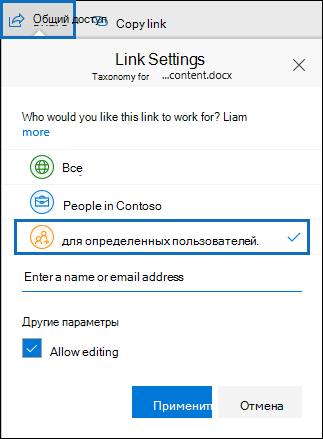

# <a name="keyword-queries-and-search-conditions-for-ediscovery"></a>Запросы по ключевым словам и условия поиска для поиска электронной почты

В этом разделе описываются свойства электронной почты и документов, которые можно искать в пунктах электронной почты и Microsoft Teams беседах в Exchange Online, а также документы, хранимые на SharePoint и OneDrive для бизнеса сайтах с помощью средств поиска по электронной почте в Центр соответствия требованиям Microsoft 365. Это включает поиск контента, основные электронные поиски и Advanced eDiscovery (поиски электронных данных в Advanced eDiscovery *называются коллекциями).* Кроме того, **\*** для поиска этих свойств можно использовать & Центра обеспечения безопасности в центре & ComplianceShell. В этой статье также описаны:
  
- Использование операторов поиска Boolean, условий поиска и других методов поиска для уточнения результатов поиска.

- Поиск типов конфиденциальных данных и настраиваемые типы конфиденциальных данных в SharePoint и OneDrive для бизнеса.

- Поиск контента сайта, который совместно с пользователями за пределами организации

Пошаговые инструкции по созданию различных поисков по электронным данным см. в этой инструкции.

- [Поиск контента](content-search.md)

- [Поиск контента в core eDiscovery](search-for-content-in-core-ediscovery.md)

- [Создание коллекции черновиков в Advanced eDiscovery](create-draft-collection.md)

> [!NOTE]
> Поиск по обнаружению электронных данных в Центр соответствия требованиям Microsoft 365 и соответствующие **\* cmdlets -ComplianceSearch** в центре обеспечения безопасности & PowerShell используют язык запросов ключевых слов (KQL). Дополнительные сведения см. в статье [Ссылка на синтаксис языка запросов](/sharepoint/dev/general-development/keyword-query-language-kql-syntax-reference)по ключевым словам.
  
## <a name="searchable-email-properties"></a>Доступные для поиска свойства электронного сообщения

В следующей таблице перечислены свойства сообщений электронной почты, которые можно искать с помощью средств поиска электронной почты в Центр соответствия требованиям Microsoft 365 или с помощью **cmdlet New-ComplianceSearch или Set-ComplianceSearch.**  Таблица включает пример синтаксиса  _property:value_ и описание результатов поиска, возвращаемых этими примерами. Эти пары можно  `property:value` ввести в поле ключевых слов для поиска электронных данных. 

> [!NOTE]
> При поиске свойств электронной почты невозможно найти элементы, в которых указанное свойство пусто или пусто. Например, с помощью *свойства:value* pair of **subject:""** для поиска сообщений электронной почты с пустой строкой темы возвращаются нулевые результаты. Это также применяется при поиске свойств сайта и контактов.
  
| Свойство | Описание свойства | Примеры | Результаты поиска, возвращаемые примерами |
|:-----|:-----|:-----|:-----|
|Имена вложений|Имена файлов, вложенных в сообщение электронной почты.|`attachmentnames:annualreport.ppt`  <br/> `attachmentnames:annual*` <br/> `attachmentnames:.pptx` |Сообщения, в которые вложен файл annualreport.ppt. Во втором примере с помощью символа под диктовки (* ) возвращаются сообщения со словом "annual" в имени файла вложения. В третьем примере возвращаются все вложения с расширением файла pptx.|
|СК|Поле Bcc сообщения электронной почты. <sup>1</sup>|`bcc:pilarp@contoso.com`  <br/> `bcc:pilarp`  <br/> `bcc:"Pilar Pinilla"`|Все примеры возвращают сообщения, в поле "Скрытая копия" которых добавлен пользователь "Pilar Pinilla".|
|Category| Категории поиска. Категории могут быть определены пользователями с помощью Outlook или Outlook в Интернете (ранее известный как Outlook Web App). Возможные значения:  <br/><br/>  blue  <br/>  green  <br/>  orange  <br/>  purple  <br/>  red  <br/>  yellow|`category:"Red Category"`|Сообщения, которым в исходных почтовых ящиках назначена красная категория.|
|Cc|Поле Cc сообщения электронной почты. <sup>1</sup>|`cc:pilarp@contoso.com`  <br/> `cc:"Pilar Pinilla"`|В обоих примерах сообщения с Pilar Pinilla указаны в поле Cc.|
|Folderid|ID папки (GUID) определенной папки почтовых ящиков. Если вы используете это свойство, не забудьте найти почтовый ящик, в который расположена указанная папка. Поиск будет только в указанной папке. Любые подкладки в папке не будут искаться. Для поиска подвещений необходимо использовать свойство Folderid для подвласти, для поиска.  <br/> Дополнительные сведения о поиске свойства Folderid и использовании скрипта для получения папок для определенного почтового ящика см. в тексте [Use Content search for targeted collections.](use-content-search-for-targeted-collections.md)|`folderid:4D6DD7F943C29041A65787E30F02AD1F00000000013A0000`  <br/> `folderid:2370FB455F82FC44BE31397F47B632A70000000001160000 AND participants:garthf@contoso.com`|В первом примере возвращаются все элементы в указанной папке почтовых ящиков. Во втором примере возвращаются все элементы в указанной папке почтовых ящиков, отправленные или полученные garthf@contoso.com.|
|From|Отправитель электронного письма.<sup>1</sup>|`from:pilarp@contoso.com`  <br/> `from:contoso.com`|Сообщения, отправленные указанным пользователем или с указанного домена.|
|HasAttachment|Указывает, есть ли у сообщения вложение. Используйте значения true **или** **false**.|`from:pilar@contoso.com AND hasattachment:true`|Сообщения, отправленные указанным пользователем с вложениями.|
|Importance|Важность сообщения, которую отправитель может указать при отправке. По умолчанию сообщения отправляются с обычной важностью, если отправитель не укажет **высокую** или **низкую** важность.  |`importance:high`  <br/> `importance:medium`  <br/> `importance:low`|Сообщения, которым назначена высокая, средняя или низкая важность.|
|IsRead|Указывает, читали ли сообщения. Используйте значения true **или** **false**.|`isread:true`  <br/> `isread:false`|В первом примере возвращаются сообщения с свойством IsRead, за **набором** True. Второй пример возвращает сообщения с свойством IsRead, за **набором** False.|
|ItemClass|Используйте это свойство для поиска определенных типов сторонних данных, импортируемых в Office 365. Для этого свойства используйте следующий синтаксис:  `itemclass:ipm.externaldata.<third-party data type>*`|`itemclass:ipm.externaldata.Facebook* AND subject:contoso`  <br/> `itemclass:ipm.externaldata.Twitter* AND from:"Ann Beebe" AND "Northwind Traders"`|В первом примере возвращаются элементы Facebook, содержащие слово "contoso" в свойстве Subject. Второй пример возвращает элементы Twitter, которые были размещены Ann Beebe и содержат ключевое словосочетание "Northwind Traders".  <br/> Полный список значений, которые можно использовать для типов сторонних данных для свойства ItemClass, см. в статье Использование поиска контента для поиска сторонних данных, импортируемых [в Office 365.](use-content-search-to-search-third-party-data-that-was-imported.md)|
|Kind| Тип сообщения электронной почты для поиска. Возможные значения:  <br/>  contacts  <br/>  docs  <br/>  email  <br/>  externaldata  <br/>  faxes  <br/>  im  <br/>  journals  <br/>  meetings  <br/>  microsoftteams (возвращает элементы из чатов, собраний и звонков в Microsoft Teams)  <br/>  notes  <br/>  posts  <br/>  rssfeeds  <br/>  tasks  <br/>  voicemail|`kind:email`  <br/> `kind:email OR kind:im OR kind:voicemail`  <br/> `kind:externaldata`|В первом примере возвращаются сообщения электронной почты, которые соответствуют критериям поиска. Во втором примере возвращаются сообщения электронной почты, беседы с мгновенными сообщениями (включая Skype для бизнеса беседы и чаты в Microsoft Teams) и голосовые сообщения, которые соответствуют критериям поиска. В третьем примере возвращаются элементы, импортируемые в почтовые ящики в Microsoft 365 из сторонних источников данных, таких как Twitter, Facebook и Cisco Jabber, которые соответствуют критериям поиска. Дополнительные сведения см. в сводке сторонних данных [в Office 365.](https://www.microsoft.com/?ref=go)|
|Участники|Все поля людей в сообщении электронной почты. Эти поля: From, To, Cc и Bcc.<sup>1</sup>|`participants:garthf@contoso.com`  <br/> `participants:contoso.com`|Сообщения, отправленные с адреса garthf@contoso.com или на него. Второй пример возвращает все сообщения, отправленные или полученные пользователем домена contoso.com.|
|Received|Дата получения сообщения адресатом.|`received:04/15/2016`  <br/> `received>=01/01/2016 AND received<=03/31/2016`|Сообщения, полученные 15 апреля 2016 г. Второй пример возвращает все сообщения, полученные в период с 1 января 2016 г. по 31 марта 2016 г.|
|Получатели|Все поля получателей в сообщении электронной почты. Эти поля: To, Cc и Bcc.<sup>1</sup>|`recipients:garthf@contoso.com`  <br/> `recipients:contoso.com`|Сообщения, отправленные по адресу garthf@contoso.com. Второй пример возвращает все сообщения, адресованные любому получателю в домене contoso.com.|
|Sent|Дата отправки сообщения отправителем.|`sent:07/01/2016`  <br/> `sent>=06/01/2016 AND sent<=07/01/2016`|Сообщения, отправленные в указанный день или диапазон дат.|
|Size|Размер элемента в байтах.|`size>26214400`  <br/> `size:1..1048567`|Сообщения больше 25 МБ. Второй пример возвращает сообщения размером от 1 до 1 048 567 байт (1 МБ).|
|Subject|Текст в строке темы сообщения электронной почты.  <br/> **Примечание:** При использовании свойства Subject в запросе поиск возвращает все сообщения, в которых строка темы содержит текст, который вы ищете. Другими словами, запрос не возвращает только те сообщения, которые имеют точное соответствие. Например, при поиске результаты будут включать сообщения с темой "Квартальные финансовые  `subject:"Quarterly Financials"` показатели 2018".|`subject:"Quarterly Financials"`  <br/> `subject:northwind`|Сообщения, содержащие фразу "Квартальные финансы" в любом месте текста строки темы. Второй пример возвращает все сообщения, которые содержат слово northwind в строке темы.|
|Кому|Поле "Кому" электронного письма.<sup>1</sup>|`to:annb@contoso.com`  <br/> `to:annb ` <br/> `to:"Ann Beebe"`|Все примеры возвращают сообщения, в поле "Кому" которых указано имя "Анна Ермолаева".|
|||||
   
> [!NOTE]
> <sup>1</sup> Для значения свойства получателя для указания пользователя  можно использовать адрес электронной почты (также называемый главным именем пользователя или UPN), отображаемое имя или псевдоним. Например, можно использовать значения annaye@contoso.com, annaye или "Анна Ермолаева".

### <a name="recipient-expansion"></a>Расширение получателей

При поиске любого из свойств получателей (From, To, Cc, Bcc, Participants и Recipients) Microsoft 365 расширить удостоверение каждого пользователя, подсмотрев их в Azure Active Directory (Azure AD).  Если пользователь найден в Azure AD, запрос расширяется, чтобы включить адрес электронной почты пользователя (или UPN), псевдоним, имя отображения и LegacyExchangeDN. Например, запрос, `participants:ronnie@contoso.com` например, расширяется до `participants:ronnie@contoso.com OR participants:ronnie OR participants:"Ronald Nelson" OR participants:"<LegacyExchangeDN>"` .

Чтобы предотвратить расширение получателей, добавьте символ wild card (звездочка) в конец адреса электронной почты и используйте сокращенное доменное имя; например, обязательно `participants:"ronnie@contoso*"` окружить адрес электронной почты двойными кавычками.

Однако следует помнить, что предотвращение расширения получателей в поисковом запросе может привести к неотвращению соответствующих элементов в результатах поиска. Сообщения электронной почты в Exchange можно сохранить с помощью различных текстовых форматов в полях получателей. Расширение получателей предназначено для смягчения этого факта путем возврата сообщений, которые могут содержать различные текстовые форматы. Поэтому предотвращение расширения получателей может привести к возвращению поисковым запросом всех элементов, которые могут иметь отношение к вашему расследованию.

> [!NOTE]
> Если требуется просмотреть или уменьшить количество элементов, возвращенных поисковым запросом в связи с расширением получателей, рассмотрите возможность Advanced eDiscovery. Вы можете искать сообщения (воспользовавшись расширением получателей), добавлять их в набор отзывов, а затем использовать запросы или фильтры набора отзывов, чтобы просмотреть или сузить результаты. Дополнительные сведения см. в [примере Сбор](collecting-data-for-ediscovery.md) данных для дела и [запрос данных в наборе обзоров.](review-set-search.md)

## <a name="searchable-site-properties"></a>Свойства сайтов, доступные для поиска

В следующей таблице перечислены некоторые свойства SharePoint и OneDrive для бизнеса, которые можно искать с помощью средств поиска по электронным данным в центре соответствия требованиям Microsoft 365 или с помощью **cmdlet New-ComplianceSearch** или **Set-ComplianceSearch.** Таблица включает пример синтаксиса  _property:value_ и описание результатов поиска, возвращаемых этими примерами. 
  
Полный список свойств SharePoint, которые можно искать, см. в обзоре поползли и управляемые свойства [в SharePoint](/SharePoint/technical-reference/crawled-and-managed-properties-overview). Свойства, отмеченные столбцом **Да,** можно искать в столбце Запросимый. 
  
| Свойство | Описание свойства | Пример | Результаты поиска, возвращаемые примерами |
|:-----|:-----|:-----|:-----|
|Автор|Поле автора в документах Microsoft Office, которое сохраняется при копировании документа. Например, если пользователь создает документ и передает его другому пользователю, который затем загружает его в SharePoint, документ по-прежнему сохраняет исходный автор. Обязательно используйте имя отображения пользователя для этого свойства.|`author:"Garth Fort"`|Все документы, созданные пользователем Garth Fort.|
|ContentType|Тип SharePoint контента, например Item, Document или Video.|`contenttype:document`|Возвращаются все документы.|
|Created|Дата создания элемента.|`created>=06/01/2016`|Все элементы, созданные после 1 июня 2016 г.|
|CreatedBy|Пользователь, создавший или загрузивший элемент. Обязательно используйте имя отображения пользователя для этого свойства.|`createdby:"Garth Fort"`|Все элементы, созданные или отправленные пользователем Garth Fort.|
|DetectedLanguage|Язык элемента.|`detectedlanguage:english`|Все элементы на английском языке.|
|DocumentLink|Путь (URL-адрес) определенной папки на SharePoint или OneDrive для бизнеса сайте. Если вы используете это свойство, обязательно поиск на сайте, на который расположена указанная папка.  <br/> Чтобы вернуть элементы, расположенные в подмостках папки, указанной для свойства documentlink, необходимо добавить /в URL-адрес указанной \* папки; например,  `documentlink: "https://contoso.sharepoint.com/Shared Documents/*"`  <br/> <br/>Дополнительные сведения о поиске свойства documentlink и использовании скрипта для получения URL-адресов documentlink для папок на определенном сайте см. в материалах [Use Content search for targeted collections.](use-content-search-for-targeted-collections.md)|`documentlink:"https://contoso-my.sharepoint.com/personal/garthf_contoso_com/Documents/Private"`  <br/> `documentlink:"https://contoso-my.sharepoint.com/personal/garthf_contoso_com/Documents/Shared with Everyone/*" AND filename:confidential`|В первом примере возвращаются все элементы в указанной OneDrive для бизнеса папке. Во втором примере возвращаются документы в указанной папке сайта (и все подмостки), содержащие слово "конфиденциальный" в имени файла.|
|FileExtension|Расширение файла; например, docx, one, pptx или xlsx.|`fileextension:xlsx`|Все Excel (Excel 2007 г. и более поздней|
|FileName|Имя файла.|`filename:"marketing plan"`  <br/> `filename:estimate`|Первый пример возвращает файлы с фразой "marketing plan" в заголовке. Второй пример возвращает файлы со словом "estimate" в имени файла.|
|LastModifiedTime|Дата последнего изменения элемента.|`lastmodifiedtime>=05/01/2016`  <br/> `lastmodifiedtime>=05/10/2016 AND lastmodifiedtime<=06/1/2016`|В первом примере возвращаются элементы, которые были изменены 1 мая 2016 г. или после нее. Второй пример возвращает элементы, измененные в период с 1 мая 2016 г. по 1 июня 2016 г.|
|ModifiedBy|Пользователь, который последним изменил элемент. Обязательно используйте имя отображения пользователя для этого свойства.|`modifiedby:"Garth Fort"`|Все элементы, которые последним изменил пользователь Garth Fort.|
|Путь|Путь (URL-адрес) определенного сайта в SharePoint или OneDrive для бизнеса сайте.<br/><br/>Чтобы возвращать элементы только с указанного сайта, необходимо добавить след в конец `/` URL-адреса; например, `path: "https://contoso.sharepoint.com/sites/international/"` <br/><br/> Чтобы вернуть элементы, расположенные в папках на сайте, указываемом в свойстве пути, необходимо добавить в конец `/*` URL-адреса; например,  `path: "https://contoso.sharepoint.com/Shared Documents/*"`  <br/><br/> **Примечание:** Использование свойства для поиска OneDrive не возвращает медиафайлы, такие как `Path` .png, .tiff или .wav-файлы, в результатах поиска. Используйте другое свойство сайта в поисковом запросе для поиска файлов мультимедиа в OneDrive папках. <br/>|`path:"https://contoso-my.sharepoint.com/personal/garthf_contoso_com/"`  <br/> `path:"https://contoso-my.sharepoint.com/personal/garthf_contoso_com/*" AND filename:confidential`|В первом примере возвращаются все элементы в указанном OneDrive для бизнеса сайте. Второй пример возвращает документы на указанном сайте (и папки на сайте), содержащие слово "конфиденциальный" в имени файла.|
|SharedWithUsersOWSUser|Документы, которые были совместно представлены указанному пользователю и отображаются на странице **Общий** со мной на OneDrive для бизнеса пользователя. Это документы, которые были явно общими для указанного пользователя другими людьми в вашей организации. При экспорте документов, совпадающих с поисковым запросом, использующим свойство SharedWithUsersOWSUser, документы экспортируются из исходного расположения контента пользователя, который поделился документом с указанным пользователем. Дополнительные сведения см. в [раздел Поиск контента сайта в организации.](#searching-for-site-content-shared-within-your-organization)|`sharedwithusersowsuser:garthf`  <br/> `sharedwithusersowsuser:"garthf@contoso.com"`|В обоих примерах возвращаются все внутренние документы, явно общие с Garth Fort, которые отображаются на странице **Общий** со мной в OneDrive для бизнеса учетной записи Garth Fort.|
|Сайт|URL-адрес сайта или группы сайтов в организации.|`site:"https://contoso-my.sharepoint.com"`  <br/> `site:"https://contoso.sharepoint.com/sites/teams"`|В первом примере возвращаются элементы OneDrive для бизнеса сайтов для всех пользователей организации. Второй пример возвращает элементы из всех сайтов группы.|
|Size|Размер элемента в байтах.|`size>=1`  <br/> `size:1..10000`|Первый пример возвращает элементы, размер которых больше 1 байта. Второй пример возвращает элементы размером от 1 до 10 000 байт.|
|Название|Заголовок документа. Свойство Title — это метаданные, указанные в Microsoft Office документах. Оно отличается от имени файла документа.|`title:"communication plan"`|Любой документ, который содержит фразу "communication plan" в свойстве метаданных Title документа Office.|
|||||

## <a name="searchable-contact-properties"></a>Свойства контактов, которые можно найти

В следующей таблице перечислены индексные свойства контактов, которые можно искать с помощью средств поиска eDiscovery. Это свойства, которые можно настроить для контактов (также называемых личными контактами), расположенных в личной адресной книге почтового ящика пользователя. Для поиска контактов можно выбрать почтовые ящики для поиска, а затем использовать одно или несколько свойств контакта в запросе ключевого слова.
  
> [!TIP]
> Для поиска значений, содержащих пробелы или специальные символы, используйте двойные кавычка ("") для сдерживания фразы; например, `businessaddress:"123 Main Street"` .
  
|Свойство |Описание свойства |
|:-----|:-----|
|BusinessAddress|Адрес в **свойстве Бизнес-адрес.** Свойство также называется **адресом Work** на странице свойства контактов.|
|BusinessPhone|Номер телефона в любом из свойств **Телефон** номеров.|
|CompanyName|Имя в **свойстве** компании.|
|Отдел|Имя в **свойстве Department.**|
|DisplayName|Отображает имя контакта. Это имя в свойстве **Полное имя** контакта.|
|EmailAddress|Адрес любого свойства адреса электронной почты для контакта. Пользователи могут добавлять несколько адресов электронной почты для контакта. С помощью этого свойства будут возвращены контакты, которые соответствуют любому из адресов электронной почты контакта.|
|FileAs|Файл **как** свойство. Это свойство используется для указания того, как контакт указан в списке контактов пользователя. Например, контакт может быть указан как  *FirstName, LastName*  или  *LastName,FirstName*.|
|GivenName|Имя в **свойстве Имя.**|
|HomeAddress|Адрес в любом из **свойств домашнего** адреса.|
|HomePhone|Номер телефона в любом из свойств **домашнего** номера телефона.|
|IMAddress|Свойство адресов обмена мгновенными сообщениями, которое обычно является адресом электронной почты, используемым для обмена мгновенными сообщениями.|
|MiddleName|Имя в **свойстве "Среднее** имя".|
|MobilePhone|Номер телефона в **свойстве номера мобильного** телефона.|
|Nickname|Имя в **свойстве Nickname.**|
|OfficeLocation|Значение в **свойстве Office** **или Office расположения.**|
|OtherAddress|Значение для **свойства Другой** адрес.|
|Surname|Имя в **свойстве Фамилия.**|
|Название|Название в **свойстве заголовок задания.**|
|||||

## <a name="searchable-sensitive-data-types"></a>Конфиденциальные типы данных, доступные для поиска

Средства поиска электронных данных можно использовать в Центр соответствия требованиям Microsoft 365 для поиска конфиденциальных данных, таких как номера кредитных карт или номера социального страхования, хранимые в документах на SharePoint и OneDrive для бизнеса сайтах. Это можно сделать с помощью свойства и имени (или ID) типа конфиденциальной информации в `SensitiveType` запросе ключевого слова. Например, запрос возвращает `SensitiveType:"Credit Card Number"` документы, содержащие номер кредитной карты. Запрос возвращает документы, содержащие номер  `SensitiveType:"U.S. Social Security Number (SSN)"` социального обеспечения США.

Чтобы увидеть список типов конфиденциальных сведений, которые  можно найти, перейдите в классификаторы данных Типы конфиденциальной информации в \>  Центр соответствия требованиям Microsoft 365. Или вы можете использовать для отображения списка типов конфиденциальной информации список типов конфиденциальной информации с помощью cmdlet **Get-DlpSensitiveInformationType** в центре безопасности & PowerShell.
  
Дополнительные сведения о создании запросов с помощью свойства см. в виде запроса для поиска конфиденциальных данных, `SensitiveType` [хранимых на сайтах.](form-a-query-to-find-sensitive-data-stored-on-sites.md)

### <a name="limitations-for-searching-sensitive-data-types"></a>Ограничения для поиска типов конфиденциальных данных

- Чтобы найти настраиваемые типы конфиденциальной информации, необходимо указать ID типа конфиденциальной информации в `SensitiveType` свойстве. Использование имени настраиваемого типа конфиденциальной информации (как показано в примере встроенных типов конфиденциальной информации в предыдущем разделе) не даст результатов. Используйте **столбец Publisher** на  странице Типы конфиденциальной информации в центре соответствия требованиям (или свойство **Publisher** PowerShell), чтобы различать встроенные и настраиваемые типы конфиденциальной информации. Встроенные типы конфиденциальных данных имеют значение для `Microsoft Corporation` **свойства Publisher.**

  Чтобы отобразить имя и ID для настраиваемого типа конфиденциальных данных в организации, запустите следующую команду в центре & PowerShell:

  ```powershell
  Get-DlpSensitiveInformationType | Where-Object {$_.Publisher -ne "Microsoft Corporation"} | FT Name,Id
  ```

  Затем вы можете использовать ID в свойстве поиска для возврата документов, содержащих настраиваемый тип конфиденциальных `SensitiveType` данных; например, `SensitiveType:7e13277e-6b04-3b68-94ed-1aeb9d47de37`
  
- Вы не можете использовать типы конфиденциальной информации и свойство поиска для поиска конфиденциальных данных в Exchange Online `SensitiveType` почтовых ящиках. Это включает сообщения чата 1:1, сообщения группового чата 1:N и разговоры о канале группы в командах Майкрософт, так как все это содержимое хранится в почтовых ящиках. Однако политики предотвращения потери данных (DLP) можно использовать для защиты конфиденциальных данных электронной почты при транзите. Дополнительные сведения см. [в дополнительных](dlp-learn-about-dlp.md) сведениях о предотвращении потери данных и [поиске и поиске персональных данных.](/compliance/regulatory/gdpr)
  
## <a name="search-operators"></a>Операторы поиска

Операторы поиска Boolean, такие как **AND,** **OR** и **NOT,** помогают определить более точные поиски, включив или исключив конкретные слова в поисковый запрос. Другие методы, такие как использование операторов свойств (например, или), кавычка, скобки и подкарды, помогают уточнить `>=` `..` поисковый запрос. В следующей таблице перечислены операторы, позволяющие сократить или расширить область результатов поиска. 
  
|Оператор |Usage |Описание |
|:-----|:-----|:-----|
|AND|keyword1 AND keyword2|Возвращает элементы, которые включают все указанные ключевые слова или  `property:value` выражения. Например, будут возвращены все сообщения, отправленные Ann Beebe, содержащие слово  `from:"Ann Beebe" AND subject:northwind` northwind в строке темы. <sup>2</sup>|
|+|keyword1 + keyword2 + keyword3|Возвращает элементы, которые содержат  *либо*  `keyword2` , либо  `keyword3`,  *а также*  `keyword1`. Следовательно, этот пример аналогичен запросу  `(keyword2 OR keyword3) AND keyword1`.  <br/> Запрос `keyword1 + keyword2` (с пробелом после символа) не то же самое, что с **+** помощью **оператора AND.** This query would be equivalent to  `"keyword1 + keyword2"` and return items with the exact phase  `"keyword1 + keyword2"`.|
|OR|keyword1 OR keyword2|Возвращает элементы, которые включают одно или несколько указанных ключевых слов или  `property:value` выражений. <sup>2</sup>|
|NOT|keyword1 NOT keyword2  <br/> NOT from:"Анна Ермолаева"  <br/> NOT kind:im|Исключает элементы, указанные ключевым словом или  `property:value` выражением. Во втором примере исключены сообщения, отправленные Ann Beebe. Третий пример исключает любые беседы с мгновенными сообщениями, например Skype для бизнеса, которые сохраняются в папке почтовых ящиков "История разговоров". <sup>2</sup>|
|-|keyword1 -keyword2|Аналогичен оператору **NOT**. Таким образом, этот запрос возвращает элементы, содержащие  `keyword1` и исключающий элементы, содержащие  `keyword2` .|
|NEAR|ключевое_слово1 NEAR(n) ключевое_слово2|Возвращает элементы, в которых слова располагаются рядом друг с другом, где n — расстояние между ними. Например, `best NEAR(5) worst` возвращает любой элемент, где слово "худший" находится в пяти словах "best". Если число не указано, расстояние по умолчанию — восемь слов. <sup>2</sup>|
|:|свойство:значение|Двоеточие (:) в синтаксис указывается, что значение разыскиваемого свойства  `property:value` содержит указанное значение. Например, выражение  `recipients:garthf@contoso.com` возвращает все сообщения, отправленные по адресу garthf@contoso.com.|
|=|property=value|То же самое, что **и оператор.**|
|\<|свойство\<значение|Указывает, что значение искомого свойства меньше указанного значения.<sup>1</sup>|
|\>|свойство\>значение|Указывает, что значение искомого свойства больше указанного значения.<sup>1</sup>|
|\<=|свойство\<=значение|Указывает, что значение искомого свойства меньше или равно указанному значению.<sup>1</sup>|
|\>=|свойство\>=значение|Указывает, что значение искомого свойства больше или равно указанному значению.<sup>1</sup>|
|..|property:value1.. value2|Указывает, что значение искомого свойства больше или равно значению 1 и меньше или равно значению 2.<sup>1</sup>|
|"  "|"реальная стоимость"  <br/> subject:"Квартальное финансирование"|Используйте двойные кавычные знаки ("") для поиска точной фразы или термина в ключевом слове и  `property:value` поисковых запросах.|
|\*|cat\*  <br/> subject:set\*|Поиск префикса (также называемый соответствием префикса), где в конце слова в ключевые слова или запросы помещается символ подмастерье (* `property:value` ). При поиске префикса результаты поиска возвращаются с терминами, которые содержат слово, за которым следуют ноль или несколько символов. Например, возвращает документы, содержащие слово "set", "setup" и "setting" (и другие слова, которые начинаются с `title:set*` "set") в заголовке документа.  <br/><br/> **Примечание:** Вы можете использовать только поиск префикса; например, **cat \* *_ или _set* \* *_. Поиск суффикса_* \* (cat),** поиски infix **(c \* t)** и поиски подстройки **\* (cat) \*** не поддерживаются.<br/><br/>Кроме того, добавление периода (\. ) поиск префикса изменит возвращаемые результаты. Это потому, что период рассматривается как стоп-слово. Например, поиск **\* *кота _ и* поиск \* _cat. возвращает** различные результаты. Рекомендуется не использовать период в поиске префикса. |
|(  )| (реальная OR бесплатная) AND (from:contoso.com)  <br/> (IPO OR первичное) AND (биржа OR акции)  <br/> (квартальное финансирование)|Скобки объединяют логические фразы, элементы  `property:value` и ключевые слова. Например, выражение  `(quarterly financials)` возвращает элементы, которые содержат слова "quarterly" и "financials".  |
|||||
   
> [!NOTE]
> <sup>1</sup> Этот оператор используется для свойств, значения которых являются числами или датами.<br/> <sup>2</sup> Логические операторы поиска необходимо указывать прописными буквами, например **AND**. Если вы используете оператора нижнего регистра, например и **,** он будет рассматриваться как ключевое слово в запросе поиска. 
  
## <a name="search-conditions"></a>Условия поиска

Можно добавить условия в поисковый запрос, чтобы сузить поиск и вернуть более уточненный набор результатов. Каждое условие добавляет предложение к поисковому KQL-запросу, которое создается и запускается в начале поиска.
  
[Условия для общих свойств ](#conditions-for-common-properties)

[Условия для свойств почты](#conditions-for-mail-properties)

[Условия для свойств документов](#conditions-for-document-properties)

[Операторы, используемые с условиями](#operators-used-with-conditions)

[Рекомендации по использованию условий](#guidelines-for-using-conditions)

[Примеры](#examples-of-using-conditions-in-search-queries)
  
### <a name="conditions-for-common-properties"></a>Условия для общих свойств

Создайте условие с помощью общих свойств при поиске в почтовых ящиках и на сайтах. В следующей таблице перечислены доступные свойства, которые можно использовать при добавлении условия.
  
| Condition | Описание |
|:-----|:-----|
|Date|Для электронной почты: дата получения сообщения адресатом или его отправки отправителем. Для документов дата последнего изменения документа.|
|Отправитель/автор|Для электронной почты: отправитель сообщения. Для документов: пользователь, указанный в поле автора в документах Office. Можно ввести несколько имен, разделенных запятой. Два или более значений, логически соединенных с помощью оператора **OR**.|
|Размер (в bytes)|Для электронной почты и документов: размер элемента (в байтах).|
|Subject/Title|Для электронной почты: текст в строке темы сообщения. Для документов: заголовок документа. Как объяснялось ранее, свойство Title — это метаданные, указанные в Microsoft Office документах. Вы можете ввести имя более чем одного субъекта или названия, разделенных запятой. Два или более значений, логически соединенных с помощью оператора **OR**.|
|Метка хранения|Для электронной почты и документов метки хранения, которые автоматически назначены для сообщений и документов политиками автоматической метки или метки хранения, которые вручную назначены пользователями. Метки хранения используются для классификации электронной почты и документов для управления информацией и применения правил хранения в зависимости от параметров, определенных меткой. Вы можете ввести часть имени метки хранения и использовать под диктовку или ввести полное имя метки. Дополнительные сведения о метки хранения см. в дополнительных сведениях о политиках [хранения и метки хранения.](retention.md)|
|||
  
### <a name="conditions-for-mail-properties"></a>Условия для свойств почты

Создайте условие с помощью свойств почты при поиске почтовых ящиков или общедоступных папок. В следующей таблице перечислены свойства электронной почты, которые можно использовать для условия. Эти свойства являются подмножество свойств электронной почты, которые были описаны ранее. Эти описания повторяются для вашего удобства.
  
| Condition | Описание |
|:-----|:-----|
|Тип сообщения| Тип сообщений для поиска. Это свойство совпадает со свойством Kind электронного сообщения. Возможные значения:  <br/><br/>  contacts  <br/>  docs  <br/>  email  <br/>  externaldata  <br/>  faxes  <br/>  im  <br/>  journals  <br/>  meetings  <br/>  microsoftteams  <br/>  notes  <br/>  posts  <br/>  rssfeeds  <br/>  tasks  <br/>  voicemail|
|Участники|Все поля людей в сообщении электронной почты. Это поля From, To, Cc и Bcc.|
|Тип|Свойство класса сообщения для элемента электронной почты. Это то же свойство, что и свойство электронной почты ItemClass. Это также условие с несколькими значениями. Чтобы выбрать несколько классов сообщений, удерживайте клавишу **CTRL** и щелкните два или несколько классов сообщений в выпадаемом списке, который необходимо добавить в условие. Каждый класс сообщений, выбранный в списке, будет логически подключен оператором **or** в соответствующем запросе поиска.  <br/> Список классов сообщений (и их соответствующий ID класса сообщений), которые используются Exchange и  которые можно выбрать в списке классов сообщения, см. в статье [Типы](/office/vba/outlook/Concepts/Forms/item-types-and-message-classes)элементов и классы сообщений.|
|ПОЛУЧЕНО|Дата получения сообщения адресатом. Это свойство совпадает со свойством Received электронного сообщения.|
|Получатели|Все поля получателей в сообщении электронной почты. Эти поля : To, Cc и Bcc.|
|Sender|Отправитель сообщения электронной почты.|
|Sent|Дата отправки сообщения отправителем. Это свойство совпадает со свойством Sent электронного сообщения.|
|Subject|Текст в строке темы сообщения электронной почты.|
|To|Получатель сообщения электронной почты в поле To.|
|||
  
### <a name="conditions-for-document-properties"></a>Условия для свойств документов

Создайте условие с использованием свойств документов при поиске документов на SharePoint OneDrive для бизнеса сайтах. В следующей таблице перечислены свойства документа, которые можно использовать для условия. Эти свойства являются подмножество свойств сайта, которые были описаны ранее. Эти описания повторяются для вашего удобства.
  
| Condition | Описание |
|:-----|:-----|
|Автор|Поле автора в документах Microsoft Office, которое сохраняется при копировании документа. Например, если пользователь создает документ и передает его другому пользователю, который затем загружает его в SharePoint, документ по-прежнему сохраняет исходный автор.|
|Название|Заголовок документа. Свойство Title — это метаданные, указанные в документах Office. Оно отличается от имени файла документа.|
|Created|Дата создания документа.|
|Дата последнего изменения|Дата последнего изменения документа.|
|Тип файла|Расширение файла; например, docx, one, pptx или xlsx. Это свойство совпадает со свойством FileExtension сайта. <br/><br/> **Примечание:** Если в поисковом запросе вы включаете условие типа File с помощью оператора **Equals** или **Equals,** вы не можете использовать поиск префикса (включив символ подтекста ( * ) в конце типа файла), чтобы вернуть все версии типа файла. Если вы это сделаете, под диктовка будет проигнорирована. Например, если вы включаете условие, будут возвращены только файлы `Equals any of doc*` с `.doc` расширением. Файлы с расширением `.docx` не будут возвращены. Чтобы вернуть все версии типа файла, в запросе ключевого слова используется пара *свойств:значение;* например, `filetype:doc*` .|
|||
  
### <a name="operators-used-with-conditions"></a>Операторы, используемые с условиями

При добавлении условия вы можете выбрать оператор, относящийся к типу свойства для этого условия. В следующей таблице описаны операторы, используемые с условиями, и перечислены эквиваленты, используемые в поисковых запросах.
  
| Оператор | Эквивалент запроса | Описание |
|:-----|:-----|:-----|
|After|`property>date`|Используется с условиями даты. Возвращает элементы, отправленные, полученные или измененные после указанной даты. |
|До|`property<date`|Используется с условиями даты. Возвращает элементы, отправленные, полученные или измененные до указанной даты.|
|Между|`date..date`|Используется с условиями даты и размера. При использовании с условием даты возвращает элементы, отправленные, полученные или измененные в указанный временной период. При использовании с условием размера возвращает элементы, размер которых находится в заданном диапазоне.|
|Contains any of|`(property:value) OR (property:value)`|Используется с условиями для свойств, определяющих строковые значения. Возвращает элементы, которые содержат любую часть одного или нескольких указанных строковых значений.|
|Doesn't contain any of|`-property:value`  <br/> `NOT property:value`|Используется с условиями для свойств, определяющих строковые значения. Возвращает элементы, которые не содержат ни одной части указанного строкового значения.|
|Doesn't equal any of|`-property=value`  <br/> `NOT property=value`|Используется с условиями для свойств, определяющих строковые значения. Возвращает элементы, которые не содержат определенную строку.|
|Равно|`size=value`|Возвращает элементы, равные указанному размеру. <sup>1</sup>|
|Equals any of|`(property=value) OR (property=value)`|Используется с условиями для свойств, определяющих строковые значения. Возвращает элементы, которые полностью совпадают с одним или несколькими указанными строковыми значениями.|
|Больше|`size>value`|Возвращает элементы, в которых указанное свойство больше указанного значения. <sup>1</sup>|
|Greater or equal|`size>=value`|Возвращает элементы, в которых указанное свойство больше или равно указанному значению. <sup>1</sup>|
|Less|`size<value`|Возвращает элементы, которые больше или равны определенному значению. <sup>1</sup>|
|Less or equal|`size<=value`|Возвращает элементы, которые больше или равны определенному значению. <sup>1</sup>|
|Not equal|`size<>value`|Возвращает элементы, не равные указанному размеру. <sup>1</sup>|
|||
   
> [!NOTE]
> <sup>1</sup> Этот оператор доступен только для условий, в которых используется свойство Size. 
  
### <a name="guidelines-for-using-conditions"></a>Рекомендации по использованию условий

При использовании условий поиска необходимо учитывать следующее:
  
- Условие логически соединяется с запросом по ключевому слову (указанному в соответствующем поле) оператором **AND**. Это означает, что элементы попадают в результаты поиска, если соответствуют как запросу по ключевому слову, так и условию. Таким образом условия помогают сузить область результатов поиска.
  
- При добавлении двух или более уникальных (определяющих различные свойства) условий к поисковому запросу эти условия логически соединяются оператором **AND**. Это означает, что возвращаются только те элементы, которые удовлетворяют всем условиям (в дополнение к любым запросам по ключевому слову).
  
- При добавлении более одного условия для одного свойства эти условия логически соединяются с помощью оператора **OR**. Это означает, что возвращаются элементы, которые удовлетворяют запросу по ключевому слову и любому одному условию. Таким образом, группы одинаковых условий соединяются друг с другом оператором **OR**, а группы уникальных условий затем соединяются оператором **AND**. 
  
- При добавлении нескольких значений (разделенных запятыми или точками с запятой) к одному условию эти значения соединяются оператором **OR**. Это означает, что элементы возвращаются, если они содержат любое из значений, указанных для свойства в условии. 
  
- Поисковый запрос, созданный с помощью поле ключевых слов  и условий, отображается на странице Поиск в области сведений для выбранного поиска. В запросе все справа от нотации указывает  `(c:c)` условия, добавленные в запрос.
  
- Условия добавляют к поисковому запросу только свойства и не добавляют операторы. Поэтому в запросе, отображаемом в области детализации, операторы не отображаются справа от  `(c:c)` нотации. Язык KQL добавляет логические операторы (в соответствии с ранее разъясненными правилами) при выполнении запроса.
  
- Вы можете использовать управление перетаскивания и сброса для повторного порядок условий. Щелкните кнопку управления для состояния и переместите его вверх или вниз.
  
- Как уже объяснялось ранее, некоторые свойства состояния позволяют ввести несколько значений (разделенных полу-двоеточиями). Каждое значение логически подключено оператором **OR** и приводит к `(filetype=docx) OR (filetype=pptx) OR (filetype=xlsx)` запросу. На следующем рисунке показан пример состояния с несколькими значениями.

    
  
  > [!NOTE]
  > Вы не можете добавить несколько условий (щелкнув **условие Добавить** для того же свойства. Вместо этого необходимо уделить несколько значений для состояния (разделенного полу-двоеточиями), как показано в предыдущем примере.
  
### <a name="examples-of-using-conditions-in-search-queries"></a>Примеры

В следующих примерах показана версия запроса поиска на основе GUI с условиями, синтаксис запроса поиска, отображаемого в области сведений выбранного поиска (который также возвращается в **cmdlet Get-ComplianceSearch)** и логика соответствующего запроса KQL.
  
#### <a name="example-1"></a>Пример 1

В этом примере возвращаются документы SharePoint и OneDrive для бизнеса с номером кредитной карты, которые в последний раз были изменены до 1 января 2021 г.
  
 **Графический пользовательский интерфейс**
  

  
 **Синтаксис поисковых запросов**
  
 `SensitiveType:"Credit Card Number"(c:c)(lastmodifiedtime<2021-01-01)`
  
 **Логика поисковых запросов**
  
 `SensitiveType:"Credit Card Number" AND (lastmodifiedtime<2021-01-01)`
  
Обратите внимание на предыдущем скриншоте, что пользовательский интерфейс поиска подтверждает, что запрос и условие ключевого слова подключены **оператором AND.**

#### <a name="example-2"></a>Пример 2

В этом примере возвращаются элементы электронной почты или документы, содержащие ключевое слово "отчет", отправленные или созданные до 1 апреля 2021 г. и содержащие слово "northwind" в поле темы сообщений электронной почты или в свойстве заголовка документов. Этот запрос исключает веб-страницы, которые соответствуют другим условиям поиска.
  
 **Графический пользовательский интерфейс**
  

  
 **Синтаксис поисковых запросов**
  
 `report(c:c)(date<2021-04-01)(subjecttitle:"northwind")(-filetype:aspx)`
  
 **Логика поисковых запросов**
  
 `report AND (date<2021-04-01) AND (subjecttitle:"northwind") NOT (filetype:aspx)`
  
#### <a name="example-3"></a>Пример 3

В этом примере возвращаются сообщения электронной почты или собрания календаря, отправленные в период с 12.01.2019 по 11.30.2020 и содержащие слова, которые начинаются с "телефон" или "смартфон".
  
 **Графический пользовательский интерфейс**
  

  
 **Синтаксис поисковых запросов**
  
 `phone* OR smartphone*(c:c)(sent=2019-12-01..2020-11-30)(kind="email")(kind="meetings")`
  
 **Логика поисковых запросов**
  
 `phone* OR smartphone* AND (sent=2029-12-01..2020-11-30) AND ((kind="email") OR (kind="meetings"))`
  
## <a name="special-characters"></a>Специальные символы

Некоторые специальные символы не включаются в индекс поиска и поэтому не являются поисковими. Это также включает специальные символы, которые представляют операторов поиска в запросе поиска. Вот список специальных символов, которые либо заменяются пустым пространством в фактическом запросе поиска, либо вызывают ошибку поиска.

`+ - = : ! @ # % ^ & ; _ / ? ( ) [ ] { }`

## <a name="searching-for-site-content-shared-with-external-users"></a>Поиск контента сайта, который доступен внешним пользователям

Вы также можете использовать средства поиска электронных данных в центре соответствия требованиям для поиска документов, SharePoint и OneDrive для бизнеса сайтов, которые были совместно с людьми за пределами вашей организации. Это позволяет определить конфиденциальные или личные данные, доступные за пределами организации. Это можно сделать с помощью свойства  `ViewableByExternalUsers` в запросе по ключевому слову. Это свойство возвращает документы или сайты, которые были совместно с внешними пользователями, используя один из следующих методов обмена: 
  
- Приглашение общего доступа, которое требует, чтобы пользователи зарегистрировались в организации в качестве пользователя с проверкой подлинности.

- Анонимная гостевая ссылка, которая позволяет всем, кто имеет эту ссылку, получить доступ к ресурсу без проверки подлинности.

Ниже приводятся примеры:
  
- Запрос возвращает все элементы, которые были общими для пользователей, не в вашей организации, и  `ViewableByExternalUsers:true AND SensitiveType:"Credit Card Number"` содержит номер кредитной карты.
  
- Запрос возвращает список документов на всех сайтах группы в организации,  `ViewableByExternalUsers:true AND ContentType:document AND site:"https://contoso.sharepoint.com/Sites/Teams"` которые были совместно с внешними пользователями.

> [!TIP]
> Запрос поиска, например, может возвращать много  `ViewableByExternalUsers:true AND ContentType:document` файлов aspx в результатах поиска. Чтобы устранить эти (или другие типы файлов), свойство можно использовать для исключения определенных типов  `FileExtension` файлов; например  `ViewableByExternalUsers:true AND ContentType:document NOT FileExtension:aspx` .
  
Какой контент доступен пользователям не из вашей организации? Документы в веб-сайтах SharePoint и OneDrive для бизнеса, которые делятся путем отправки приглашения общего доступа или общего доступа в общедоступных местах. Например, следующие действия пользователей приводят к тому, что контент будет доступным для внешних пользователей:
  
- пользователь предоставляет общий доступ к файлу или папке для определенного пользователя за пределами вашей организации;
  
- пользователь создает и отправляет ссылку на общий файл пользователю за пределами вашей организации. Эта ссылка позволяет внешнему пользователю просмотреть или изменить файл;
  
- пользователь отправляет приглашение на доступ или гостевую ссылку пользователю за пределами организации для просмотра или редактирования файла.
  
### <a name="issues-using-the-viewablebyexternalusers-property"></a>Проблемы с использованием свойства ViewableByExternalUsers

Несмотря на то, что свойство представляет состояние того, является ли документ или сайт общим для внешних пользователей, существуют некоторые оговорки о том, что это свойство делает и  `ViewableByExternalUsers` не отражает. В следующих сценариях значение свойства не обновляется, а результаты запроса поиска, использующего это свойство, могут быть  `ViewableByExternalUsers` неточными. 
  
- Изменения в политике общего доступа, например отключение внешнего общего доступа для сайта или организации. Свойство по-прежнему будет показывать ранее общие документы как внешне доступные, даже если внешний доступ мог быть отозван.
    
- Изменения в составе группы, например добавление или удаление внешних пользователей в Microsoft 365 группы или Microsoft 365 группы безопасности. Свойство не будет автоматически обновляться для элементов, к которые группа имеет доступ.
    
- Отправка приглашений для внешних пользователей, в которых получатель не принял приглашение, и, следовательно, не имеет доступа к содержимому.
    
В этих сценариях свойство не будет отражать текущее состояние общего доступа до тех пор, пока веб-сайт или библиотека документов не будут повторно  `ViewableByExternalUsers` закравлены и не будут реиндексироваться. 

## <a name="searching-for-site-content-shared-within-your-organization"></a>Поиск контента сайта, общего в организации

Как было объяснено ранее, вы можете использовать свойство, чтобы искать документы, которые были общими между  `SharedWithUsersOWSUser` людьми в вашей организации. Когда пользователь делится файлом (или папкой) с другим пользователем внутри организации, на странице **Общий** со мной в OneDrive для бизнеса учетной записи пользователя, с которым был общий файл. Например, для поиска документов, которые были совместно с Сарой Дэвис, можно использовать запрос  `SharedWithUsersOWSUser:"sarad@contoso.com"` . При экспорте результатов этого поиска будут загружены исходные документы (расположенные в расположении контента человека, который поделился документами с Sara).
  
Документы должны быть явно общими для определенного пользователя, которые будут возвращены в результатах поиска при использовании  `SharedWithUsersOWSUser` свойства. Например, если человек разделяет документ в своей OneDrive учетной записи, у него есть возможность поделиться им с кем-либо (внутри или за пределами организации), поделиться им только с людьми внутри организации или поделиться им с определенным лицом. Ниже показан снимок экрана окна **Share** в OneDrive, на который показаны три параметра совместного доступа. 
  

  
Только документы, общие с помощью третьего параметра (совместно с конкретными **людьми),** будут возвращены поисковым запросом, использующим  `SharedWithUsersOWSUser` свойство. 

## <a name="searching-for-skype-for-business-conversations"></a>Поиск Skype для бизнеса бесед

Вы можете использовать следующий ключевой запрос для поиска контента в Skype для бизнеса беседах:

```powershell
kind:im
```

Предыдущий поисковый запрос также возвращает чаты из Microsoft Teams. Чтобы предотвратить это, можно сузить результаты поиска, чтобы включить только Skype для бизнеса беседы с помощью следующего запроса ключевых слов:

```powershell
kind:im AND subject:conversation
```

Предыдущий запрос по ключевым словам исключает чаты в Microsoft Teams, так как Skype для бизнеса сохраняются в качестве сообщений электронной почты с строки Subject, которая начинается со слова "Conversation".

Чтобы найти Skype для бизнеса беседы, которые произошли в определенном диапазоне дат, используйте следующий запрос по ключевым словам:

```powershell
kind:im AND subject:conversation AND (received=startdate..enddate)
```

## <a name="character-limits-for-searches"></a>Ограничения символов для поиска

Существует ограничение в 4000 символов для поисковых запросов при поиске контента в SharePoint и OneDrive учетных записей.  
Вот как вычисляется общее число символов в запросе поиска:

- Символы в запросе поиска по ключевым словам (включая пользовательские и фильтровые поля) считаются с этим ограничением.

- Символы в любом свойстве расположения (например, URL-адреса для всех SharePoint или OneDrive, в которых ведется поиск), считаются с этим ограничением.

- Символы во всех фильтрах разрешений поиска, которые применяются к пользователю, который работает с учетом поиска по ограничению.

Дополнительные сведения об ограничениях символов см. в [интернете.](limits-for-content-search.md#search-limits)

> [!NOTE]
> Ограничение в 4000 символов применяется к поиску контента, основным электронным данным и Advanced eDiscovery.

## <a name="search-tips-and-tricks"></a>Советы по поиску

- Поиск по ключевым словам не является чувствительным к делу. Например, результаты поиска по словам **кот** и **КОТ** будут одинаковыми.

- Операторы Boolean **и**, **ИЛИ**, **НЕ**, и **NEAR** должны быть uppercase. 

- A space between two keywords or two  `property:value` expressions is the same as using **AND**. Например, возвращает все сообщения, отправленные Сарой Дэвис, содержащие слово  `from:"Sara Davis" subject:reorganization` реорганизация в строке темы. 

- Используйте синтаксис, который соответствует `property:value` формату. В значениях регистр не учитывается, а после оператора нельзя ставить пробел. Если имеется пробел, вашим предполагаемым значением будет полно текстовой поиск. Например, поиск "pilarp" в качестве ключевого слова, а не для сообщений, `to: pilarp` отправленных в pilarp. 

- При поиске свойства получателя, например To, From, Cc или Recipients, можно использовать SMTP-адрес, псевдоним или отображаемое имя получателя. Например, можно указать значение pilarp@contoso.com, pilarp или "Pilar Pinilla".

- Вы можете использовать только поиск префикса; например, **cat \* *_ или _set* \* *_. Поиск суффикса_* \* (cat),** поиски infix **(c \* t)** и поиски подстройки **\* (cat) \*** не поддерживаются.

- При поиске свойства используйте двойные кавычка ("") если значение поиска состоит из нескольких слов. Например, возвращает сообщения, содержащие бюджет в строке темы и содержащие Q1 в любом месте сообщения или в любом из `subject:budget Q1` свойств сообщения.   Использование `subject:"budget Q1"` возвращает все сообщения, содержащие бюджет **Q1** в любом месте темы.

- Чтобы исключить из результатов поиска контент с определенным значением свойства, поставьте знак минус (-) перед именем свойства. Например, `-from:"Sara Davis"` исключает сообщения, отправленные Сарой Дэвис.

- Можно экспортировать элементы в зависимости от типа сообщения. Например, чтобы экспортировать Skype беседы и чаты в Microsoft Teams, используйте синтаксис `kind:im` . Чтобы возвращать только сообщения электронной почты, необходимо использовать `kind:email` . Чтобы возвращать чаты, собрания и вызовы в Microsoft Teams, используйте `kind:microsoftteams` .

- Как объяснялось ранее, при поиске сайтов необходимо добавить след в конец URL-адреса при использовании свойства для возврата только элементов на `/` `path` указанном сайте. Если вы не включаете след, элементы с сайта с похожим именем пути также `/` будут возвращены. Например, если вы используете элементы с сайтов с именем `path:sites/HelloWorld` `sites/HelloWorld_East` или также будут `sites/HelloWorld_West` возвращены. Чтобы возвращать элементы только с сайта HelloWorld, необходимо использовать `path:sites/HelloWorld/` .
