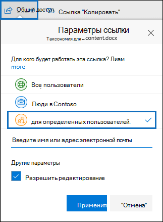

# <a name="keyword-queries-and-search-conditions-for-content-search-and-ediscovery"></a><span data-ttu-id="b3567-103">Запросы ключевых слов и условия поиска для поиска контента и eDiscovery</span><span class="sxs-lookup"><span data-stu-id="b3567-103">Keyword queries and search conditions for Content Search and eDiscovery</span></span>

<span data-ttu-id="b3567-104">В этом разделе описаны свойства электронной почты и документов, которые можно искать в сообщениях электронной почты в Exchange Online, а также документы, хранимые на сайтах SharePoint и OneDrive для бизнеса, с помощью функции поиска контента в Центре соответствия требованиям Microsoft 365.</span><span class="sxs-lookup"><span data-stu-id="b3567-104">This topic describes the email and document properties that you can search for in email items in Exchange Online and documents stored on SharePoint and OneDrive for Business sites by using the Content Search feature in the Microsoft 365 compliance center.</span></span> <span data-ttu-id="b3567-105">Для поиска этих **\*** свойств также можно использовать & PowerShell Центра безопасности и соответствия требованиям .</span><span class="sxs-lookup"><span data-stu-id="b3567-105">You can also use the **\*-ComplianceSearch** cmdlets in Security & Compliance Center PowerShell to search for these properties.</span></span> <span data-ttu-id="b3567-106">В этом разделе также описываются:</span><span class="sxs-lookup"><span data-stu-id="b3567-106">The topic also describes:</span></span>
  
- <span data-ttu-id="b3567-107">Использование boolean поисковых операторов, условий поиска и других методов поисковых запросов для уточнения результатов поиска.</span><span class="sxs-lookup"><span data-stu-id="b3567-107">Using Boolean search operators, search conditions, and other search query techniques to refine your search results.</span></span>

- <span data-ttu-id="b3567-108">Поиск типов конфиденциальных и пользовательских конфиденциальных данных в SharePoint и OneDrive для бизнеса.</span><span class="sxs-lookup"><span data-stu-id="b3567-108">Searching for sensitive data types and custom sensitive data types in SharePoint and OneDrive for Business.</span></span>

- <span data-ttu-id="b3567-109">Поиск контента сайта, доступного пользователям за пределами организации</span><span class="sxs-lookup"><span data-stu-id="b3567-109">Searching for site content that's shared with users outside of your organization</span></span>

<span data-ttu-id="b3567-110">Пошаговая инструкция по созданию поиска контента см. в [этой теме.](content-search.md)</span><span class="sxs-lookup"><span data-stu-id="b3567-110">For step-by-step instructions on how to create a Content Search, see [Content Search](content-search.md).</span></span>

> [!NOTE]
> <span data-ttu-id="b3567-111">Поиск контента в Центре соответствия требованиям Microsoft 365 и соответствующие **\* cmdlets -ComplianceSearch** в PowerShell Центра безопасности и & соответствия требованиям используют язык запросов по ключевым словам (KQL).</span><span class="sxs-lookup"><span data-stu-id="b3567-111">Content Search in the Microsoft 365 compliance center and the corresponding **\*-ComplianceSearch** cmdlets in Security & Compliance Center PowerShell use the Keyword Query Language (KQL).</span></span> <span data-ttu-id="b3567-112">Дополнительные сведения см. в справочнике по [синтаксишу](https://go.microsoft.com/fwlink/?LinkId=269603)языка запросов по ключевым словам.</span><span class="sxs-lookup"><span data-stu-id="b3567-112">For more detailed information, see [Keyword Query Language syntax reference](https://go.microsoft.com/fwlink/?LinkId=269603).</span></span> 
  
## <a name="searchable-email-properties"></a><span data-ttu-id="b3567-113">Доступные для поиска свойства электронного сообщения</span><span class="sxs-lookup"><span data-stu-id="b3567-113">Searchable email properties</span></span>

<span data-ttu-id="b3567-114">В следующей таблице перечислены свойства сообщений электронной почты, которые можно искать с помощью функции поиска контента в Центре соответствия требованиям Microsoft 365 или с помощью **New-ComplianceSearch** или с помощью cmdlet **Set-ComplianceSearch.**</span><span class="sxs-lookup"><span data-stu-id="b3567-114">The following table lists email message properties that can be searched by using the Content Search feature in the Microsoft 365 compliance center or by using the **New-ComplianceSearch** or the **Set-ComplianceSearch** cmdlet.</span></span> <span data-ttu-id="b3567-115">Таблица включает пример синтаксиса  _property:value_ и описание результатов поиска, возвращаемых этими примерами.</span><span class="sxs-lookup"><span data-stu-id="b3567-115">The table includes an example of the  _property:value_ syntax for each property and a description of the search results returned by the examples.</span></span> <span data-ttu-id="b3567-116">Эти пары можно  `property:value` ввести в поле ключевых слов для поиска контента.</span><span class="sxs-lookup"><span data-stu-id="b3567-116">You can type these  `property:value` pairs in the keywords box for a Content Search.</span></span> 

> [!NOTE]
> <span data-ttu-id="b3567-117">При поиске свойств электронной почты невозможно найти элементы, в которых указанное свойство пустое или пустое.</span><span class="sxs-lookup"><span data-stu-id="b3567-117">When searching email properties, it's not possible to search for items in which the specified property is empty or blank.</span></span> <span data-ttu-id="b3567-118">Например, использование пары *"свойство:значение"* для поиска сообщений электронной почты с пустой строкой темы возвращает нулевые результаты. </span><span class="sxs-lookup"><span data-stu-id="b3567-118">For example, using the *property:value* pair of **subject:""** to search for email messages with an empty subject line will return zero results.</span></span> <span data-ttu-id="b3567-119">Это также применяется при поиске свойств сайта и контактов.</span><span class="sxs-lookup"><span data-stu-id="b3567-119">This also applies when searching site and contact properties.</span></span>
  
| <span data-ttu-id="b3567-120">Свойство</span><span class="sxs-lookup"><span data-stu-id="b3567-120">Property</span></span> | <span data-ttu-id="b3567-121">Описание свойства</span><span class="sxs-lookup"><span data-stu-id="b3567-121">Property description</span></span> | <span data-ttu-id="b3567-122">Примеры</span><span class="sxs-lookup"><span data-stu-id="b3567-122">Examples</span></span> | <span data-ttu-id="b3567-123">Результаты поиска, возвращаемые примерами</span><span class="sxs-lookup"><span data-stu-id="b3567-123">Search results returned by the examples</span></span> |
|:-----|:-----|:-----|:-----|
|<span data-ttu-id="b3567-124">AttachmentNames</span><span class="sxs-lookup"><span data-stu-id="b3567-124">AttachmentNames</span></span>|<span data-ttu-id="b3567-125">Имена файлов, вложенных в сообщение электронной почты.</span><span class="sxs-lookup"><span data-stu-id="b3567-125">The names of files attached to an email message.</span></span>|`attachmentnames:annualreport.ppt`  <br/> `attachmentnames:annual*` <br/> `attachmentnames:.pptx` |<span data-ttu-id="b3567-126">Сообщения, в которые вложен файл annualreport.ppt.</span><span class="sxs-lookup"><span data-stu-id="b3567-126">Messages that have an attached file named annualreport.ppt.</span></span> <span data-ttu-id="b3567-127">Во втором примере при использовании подстановочного знака возвращаются сообщения со вложениями, в названиях которых есть слово "annual".</span><span class="sxs-lookup"><span data-stu-id="b3567-127">In the second example, using the wildcard returns messages with the word "annual" in the file name of an attachment.</span></span> <span data-ttu-id="b3567-128">В третьем примере возвращаются все вложения с расширением PPTX.</span><span class="sxs-lookup"><span data-stu-id="b3567-128">The third example returns all attachments with the pptx file extension.</span></span>|
|<span data-ttu-id="b3567-129">СК</span><span class="sxs-lookup"><span data-stu-id="b3567-129">Bcc</span></span>|<span data-ttu-id="b3567-130">Поле "Ск" сообщения электронной почты. <sup>1</sup></span><span class="sxs-lookup"><span data-stu-id="b3567-130">The Bcc field of an email message.<sup>1</sup></span></span>|`bcc:pilarp@contoso.com`  <br/> `bcc:pilarp`  <br/> `bcc:"Pilar Pinilla"`|<span data-ttu-id="b3567-131">Все примеры возвращают сообщения, в поле "Скрытая копия" которых добавлен пользователь "Pilar Pinilla".</span><span class="sxs-lookup"><span data-stu-id="b3567-131">All examples return messages with Pilar Pinilla included in the Bcc field.</span></span>|
|<span data-ttu-id="b3567-132">Category</span><span class="sxs-lookup"><span data-stu-id="b3567-132">Category</span></span>| <span data-ttu-id="b3567-133">Категории поиска.</span><span class="sxs-lookup"><span data-stu-id="b3567-133">The categories to search.</span></span> <span data-ttu-id="b3567-134">Категории могут определяться пользователями с помощью Outlook или Outlook в Интернете (прежнее название — Outlook Web App).</span><span class="sxs-lookup"><span data-stu-id="b3567-134">Categories can be defined by users by using Outlook or Outlook on the web (formerly known as Outlook Web App).</span></span> <span data-ttu-id="b3567-135">Возможные значения:</span><span class="sxs-lookup"><span data-stu-id="b3567-135">The possible values are:</span></span>  <br/><br/>  <span data-ttu-id="b3567-136">blue</span><span class="sxs-lookup"><span data-stu-id="b3567-136">blue</span></span>  <br/>  <span data-ttu-id="b3567-137">green</span><span class="sxs-lookup"><span data-stu-id="b3567-137">green</span></span>  <br/>  <span data-ttu-id="b3567-138">orange</span><span class="sxs-lookup"><span data-stu-id="b3567-138">orange</span></span>  <br/>  <span data-ttu-id="b3567-139">purple</span><span class="sxs-lookup"><span data-stu-id="b3567-139">purple</span></span>  <br/>  <span data-ttu-id="b3567-140">red</span><span class="sxs-lookup"><span data-stu-id="b3567-140">red</span></span>  <br/>  <span data-ttu-id="b3567-141">yellow</span><span class="sxs-lookup"><span data-stu-id="b3567-141">yellow</span></span>|`category:"Red Category"`|<span data-ttu-id="b3567-142">Сообщения, которым в исходных почтовых ящиках назначена красная категория.</span><span class="sxs-lookup"><span data-stu-id="b3567-142">Messages that have been assigned the red category in the source mailboxes.</span></span>|
|<span data-ttu-id="b3567-143">Cc</span><span class="sxs-lookup"><span data-stu-id="b3567-143">Cc</span></span>|<span data-ttu-id="b3567-144">Поле "Ск" сообщения электронной почты. <sup>1</sup></span><span class="sxs-lookup"><span data-stu-id="b3567-144">The Cc field of an email message.<sup>1</sup></span></span>|`cc:pilarp@contoso.com`  <br/> `cc:"Pilar Pinilla"`|<span data-ttu-id="b3567-145">В обоих примерах сообщения с Pilar Pinilla, указанными в поле "Ск".</span><span class="sxs-lookup"><span data-stu-id="b3567-145">In both examples, messages with Pilar Pinilla specified in the Cc field.</span></span>|
|<span data-ttu-id="b3567-146">Folderid</span><span class="sxs-lookup"><span data-stu-id="b3567-146">Folderid</span></span>|<span data-ttu-id="b3567-147">ИД (GUID) определенной папки почтового ящика.</span><span class="sxs-lookup"><span data-stu-id="b3567-147">The folder ID (GUID) of a specific mailbox folder.</span></span> <span data-ttu-id="b3567-148">Если вы используете это свойство, не забудьте найти почтовый ящик, в который находится указанная папка.</span><span class="sxs-lookup"><span data-stu-id="b3567-148">If you use this property, be sure to search the mailbox that the specified folder is located in.</span></span> <span data-ttu-id="b3567-149">Поиск будет только в указанной папке.</span><span class="sxs-lookup"><span data-stu-id="b3567-149">Only the specified folder will be searched.</span></span> <span data-ttu-id="b3567-150">Поиск во вложенных папках в папке не будет.</span><span class="sxs-lookup"><span data-stu-id="b3567-150">Any subfolders in the folder won't be searched.</span></span> <span data-ttu-id="b3567-151">Для поиска вложенных папок необходимо использовать свойство Folderid для вложенной папки, в которая требуется найти.</span><span class="sxs-lookup"><span data-stu-id="b3567-151">To search subfolders, you need to use the Folderid property for the subfolder you want to search.</span></span>  <br/> <span data-ttu-id="b3567-152">Дополнительные сведения о поиске свойства Folderid и использовании сценария для получения ИД папок для определенного почтового ящика см. в поддомене "Использование поиска контента для целевых [коллекций".](use-content-search-for-targeted-collections.md)</span><span class="sxs-lookup"><span data-stu-id="b3567-152">For more information about searching for the Folderid property and using a script to obtain the folder IDs for a specific mailbox, see [Use Content Search for targeted collections](use-content-search-for-targeted-collections.md).</span></span>|`folderid:4D6DD7F943C29041A65787E30F02AD1F00000000013A0000`  <br/> `folderid:2370FB455F82FC44BE31397F47B632A70000000001160000 AND participants:garthf@contoso.com`|<span data-ttu-id="b3567-153">В первом примере возвращаются все элементы в указанной папке почтового ящика.</span><span class="sxs-lookup"><span data-stu-id="b3567-153">The first example returns all items in the specified mailbox folder.</span></span> <span data-ttu-id="b3567-154">Во втором примере возвращаются все элементы в указанной папке почтового ящика, отправленные или полученные garthf@contoso.com.</span><span class="sxs-lookup"><span data-stu-id="b3567-154">The second example returns all items in the specified mailbox folder that were sent or received by garthf@contoso.com.</span></span>|
|<span data-ttu-id="b3567-155">From</span><span class="sxs-lookup"><span data-stu-id="b3567-155">From</span></span>|<span data-ttu-id="b3567-156">Отправитель электронного письма.<sup>1</sup></span><span class="sxs-lookup"><span data-stu-id="b3567-156">The sender of an email message.<sup>1</sup></span></span>|`from:pilarp@contoso.com`  <br/> `from:contoso.com`|<span data-ttu-id="b3567-157">Сообщения, отправленные указанным пользователем или с указанного домена.</span><span class="sxs-lookup"><span data-stu-id="b3567-157">Messages sent by the specified user or sent from a specified domain.</span></span>|
|<span data-ttu-id="b3567-158">HasAttachment</span><span class="sxs-lookup"><span data-stu-id="b3567-158">HasAttachment</span></span>|<span data-ttu-id="b3567-159">Указывает, есть ли у сообщения вложение.</span><span class="sxs-lookup"><span data-stu-id="b3567-159">Indicates whether a message has an attachment.</span></span> <span data-ttu-id="b3567-160">Используйте значения **true или** **false.**</span><span class="sxs-lookup"><span data-stu-id="b3567-160">Use the values **true** or **false**.</span></span>|`from:pilar@contoso.com AND hasattachment:true`|<span data-ttu-id="b3567-161">Сообщения, отправленные указанным пользователем с вложениями.</span><span class="sxs-lookup"><span data-stu-id="b3567-161">Messages sent by the specified user that have attachments.</span></span>|
|<span data-ttu-id="b3567-162">Importance</span><span class="sxs-lookup"><span data-stu-id="b3567-162">Importance</span></span>|<span data-ttu-id="b3567-p110">Важность сообщения, которую отправитель может указать при отправке. По умолчанию сообщения отправляются с обычной важностью, если отправитель не укажет **высокую** или **низкую** важность.  </span><span class="sxs-lookup"><span data-stu-id="b3567-p110">The importance of an email message, which a sender can specify when sending a message. By default, messages are sent with normal importance, unless the sender sets the importance as **high** or **low**.</span></span>|`importance:high`  <br/> `importance:medium`  <br/> `importance:low`|<span data-ttu-id="b3567-165">Сообщения, которым назначена высокая, средняя или низкая важность.</span><span class="sxs-lookup"><span data-stu-id="b3567-165">Messages that are marked as high importance, medium importance, or low importance.</span></span>|
|<span data-ttu-id="b3567-166">IsRead</span><span class="sxs-lookup"><span data-stu-id="b3567-166">IsRead</span></span>|<span data-ttu-id="b3567-167">Указывает, прочитано ли сообщение.</span><span class="sxs-lookup"><span data-stu-id="b3567-167">Indicates whether messages have been read.</span></span> <span data-ttu-id="b3567-168">Используйте значения **true или** **false.**</span><span class="sxs-lookup"><span data-stu-id="b3567-168">Use the values **true** or **false**.</span></span>|`isread:true`  <br/> `isread:false`|<span data-ttu-id="b3567-169">В первом примере возвращаются сообщения со свойством IsRead со свойством **True.**</span><span class="sxs-lookup"><span data-stu-id="b3567-169">The first example returns messages with the IsRead property set to **True**.</span></span> <span data-ttu-id="b3567-170">Во втором примере возвращаются сообщения со свойством IsRead со свойством **False.**</span><span class="sxs-lookup"><span data-stu-id="b3567-170">The second example returns messages with the IsRead property set to **False**.</span></span>|
|<span data-ttu-id="b3567-171">ItemClass</span><span class="sxs-lookup"><span data-stu-id="b3567-171">ItemClass</span></span>|<span data-ttu-id="b3567-172">Это свойство используется для поиска определенных типов сторонних данных, импортируемых организацией в Office 365.</span><span class="sxs-lookup"><span data-stu-id="b3567-172">Use this property to search specific third-party data types that your organization imported to Office 365.</span></span> <span data-ttu-id="b3567-173">Используйте следующий синтаксис для этого свойства:  `itemclass:ipm.externaldata.<third-party data type>*`</span><span class="sxs-lookup"><span data-stu-id="b3567-173">Use the following syntax for this property:  `itemclass:ipm.externaldata.<third-party data type>*`</span></span>|`itemclass:ipm.externaldata.Facebook* AND subject:contoso`  <br/> `itemclass:ipm.externaldata.Twitter* AND from:"Ann Beebe" AND "Northwind Traders"`|<span data-ttu-id="b3567-174">В первом примере возвращаются элементы Facebook, содержащие слово "contoso" в свойстве Subject.</span><span class="sxs-lookup"><span data-stu-id="b3567-174">The first example returns Facebook items that contain the word "contoso" in the Subject property.</span></span> <span data-ttu-id="b3567-175">Во втором примере возвращаются элементы Twitter, которые были опубликованы Анной Beebe и содержат ключевое слово "Northwind Traders".</span><span class="sxs-lookup"><span data-stu-id="b3567-175">The second example returns Twitter items that were posted by Ann Beebe and that contain the keyword phrase "Northwind Traders".</span></span>  <br/> <span data-ttu-id="b3567-176">Полный список значений, которые можно использовать для типов сторонних данных для свойства ItemClass, см. в статье "Использование поиска контента для поиска сторонних данных, импортируемых в [Office 365".](use-content-search-to-search-third-party-data-that-was-imported.md)</span><span class="sxs-lookup"><span data-stu-id="b3567-176">For a complete list of values to use for third-party data types for the ItemClass property, see [Use Content Search to search third-party data that was imported to Office 365](use-content-search-to-search-third-party-data-that-was-imported.md).</span></span>|
|<span data-ttu-id="b3567-177">Kind</span><span class="sxs-lookup"><span data-stu-id="b3567-177">Kind</span></span>| <span data-ttu-id="b3567-178">Тип сообщения электронной почты для поиска.</span><span class="sxs-lookup"><span data-stu-id="b3567-178">The type of email message to search for.</span></span> <span data-ttu-id="b3567-179">Возможные значения:</span><span class="sxs-lookup"><span data-stu-id="b3567-179">Possible values:</span></span>  <br/>  <span data-ttu-id="b3567-180">contacts</span><span class="sxs-lookup"><span data-stu-id="b3567-180">contacts</span></span>  <br/>  <span data-ttu-id="b3567-181">docs</span><span class="sxs-lookup"><span data-stu-id="b3567-181">docs</span></span>  <br/>  <span data-ttu-id="b3567-182">email</span><span class="sxs-lookup"><span data-stu-id="b3567-182">email</span></span>  <br/>  <span data-ttu-id="b3567-183">externaldata</span><span class="sxs-lookup"><span data-stu-id="b3567-183">externaldata</span></span>  <br/>  <span data-ttu-id="b3567-184">faxes</span><span class="sxs-lookup"><span data-stu-id="b3567-184">faxes</span></span>  <br/>  <span data-ttu-id="b3567-185">im</span><span class="sxs-lookup"><span data-stu-id="b3567-185">im</span></span>  <br/>  <span data-ttu-id="b3567-186">journals</span><span class="sxs-lookup"><span data-stu-id="b3567-186">journals</span></span>  <br/>  <span data-ttu-id="b3567-187">meetings</span><span class="sxs-lookup"><span data-stu-id="b3567-187">meetings</span></span>  <br/>  <span data-ttu-id="b3567-188">microsoftteams (возвращает элементы из чатов, собраний и звонков в Microsoft Teams)</span><span class="sxs-lookup"><span data-stu-id="b3567-188">microsoftteams (returns items from chats, meetings, and calls in Microsoft Teams)</span></span>  <br/>  <span data-ttu-id="b3567-189">notes</span><span class="sxs-lookup"><span data-stu-id="b3567-189">notes</span></span>  <br/>  <span data-ttu-id="b3567-190">posts</span><span class="sxs-lookup"><span data-stu-id="b3567-190">posts</span></span>  <br/>  <span data-ttu-id="b3567-191">rssfeeds</span><span class="sxs-lookup"><span data-stu-id="b3567-191">rssfeeds</span></span>  <br/>  <span data-ttu-id="b3567-192">tasks</span><span class="sxs-lookup"><span data-stu-id="b3567-192">tasks</span></span>  <br/>  <span data-ttu-id="b3567-193">voicemail</span><span class="sxs-lookup"><span data-stu-id="b3567-193">voicemail</span></span>|`kind:email`  <br/> `kind:email OR kind:im OR kind:voicemail`  <br/> `kind:externaldata`|<span data-ttu-id="b3567-194">В первом примере возвращаются сообщения электронной почты, которые соответствуют условиям поиска.</span><span class="sxs-lookup"><span data-stu-id="b3567-194">The first example returns email messages that meet the search criteria.</span></span> <span data-ttu-id="b3567-195">Во втором примере возвращаются сообщения электронной почты, мгновенные сообщения (включая беседы и чаты Skype для бизнеса в Microsoft Teams) и голосовые сообщения, которые соответствуют условиям поиска.</span><span class="sxs-lookup"><span data-stu-id="b3567-195">The second example returns email messages, instant messaging conversations (including Skype for Business conversations and chats in Microsoft Teams), and voice messages that meet the search criteria.</span></span> <span data-ttu-id="b3567-196">В третьем примере возвращаются элементы, импортируемые в почтовые ящики в Microsoft 365, из сторонних источников данных, таких как Twitter, Facebook и Cisco Jabber, которые соответствуют условиям поиска.</span><span class="sxs-lookup"><span data-stu-id="b3567-196">The third example returns items that were imported to mailboxes in Microsoft 365 from third-party data sources, such as Twitter, Facebook, and Cisco Jabber, that meet the search criteria.</span></span> <span data-ttu-id="b3567-197">Дополнительные сведения см. в архиве сторонних данных [в Office 365.](https://www.microsoft.com/?ref=go)</span><span class="sxs-lookup"><span data-stu-id="b3567-197">For more information, see [Archiving third-party data in Office 365](https://www.microsoft.com/?ref=go).</span></span>|
|<span data-ttu-id="b3567-198">Участники</span><span class="sxs-lookup"><span data-stu-id="b3567-198">Participants</span></span>|<span data-ttu-id="b3567-199">Все поля людей в сообщении электронной почты.</span><span class="sxs-lookup"><span data-stu-id="b3567-199">All the people fields in an email message.</span></span> <span data-ttu-id="b3567-200">Эти поля: From, To, Cc и Bcc.<sup>1</sup></span><span class="sxs-lookup"><span data-stu-id="b3567-200">These fields are From, To, Cc, and Bcc.<sup>1</sup></span></span>|`participants:garthf@contoso.com`  <br/> `participants:contoso.com`|<span data-ttu-id="b3567-p118">Сообщения, отправленные с адреса garthf@contoso.com или на него. Второй пример возвращает все сообщения, отправленные или полученные пользователем домена contoso.com.</span><span class="sxs-lookup"><span data-stu-id="b3567-p118">Messages sent by or sent to garthf@contoso.com. The second example returns all messages sent by or sent to a user in the contoso.com domain.</span></span>|
|<span data-ttu-id="b3567-203">Received</span><span class="sxs-lookup"><span data-stu-id="b3567-203">Received</span></span>|<span data-ttu-id="b3567-204">Дата получения сообщения адресатом.</span><span class="sxs-lookup"><span data-stu-id="b3567-204">The date that an email message was received by a recipient.</span></span>|`received:04/15/2016`  <br/> `received>=01/01/2016 AND received<=03/31/2016`|<span data-ttu-id="b3567-205">Сообщения, полученные 15 апреля 2016 г.</span><span class="sxs-lookup"><span data-stu-id="b3567-205">Messages that were received on April 15, 2016.</span></span> <span data-ttu-id="b3567-206">Во втором примере возвращаются все сообщения, полученные с 1 января 2016 г. по 31 марта 2016 г.</span><span class="sxs-lookup"><span data-stu-id="b3567-206">The second example returns all messages received between January 1, 2016 and March 31, 2016.</span></span>|
|<span data-ttu-id="b3567-207">Получатели</span><span class="sxs-lookup"><span data-stu-id="b3567-207">Recipients</span></span>|<span data-ttu-id="b3567-208">Все поля получателей в сообщении электронной почты.</span><span class="sxs-lookup"><span data-stu-id="b3567-208">All recipient fields in an email message.</span></span> <span data-ttu-id="b3567-209">Эти поля: "To", "Cc" и<sup>"СК". 1</sup></span><span class="sxs-lookup"><span data-stu-id="b3567-209">These fields are To, Cc, and Bcc.<sup>1</sup></span></span>|`recipients:garthf@contoso.com`  <br/> `recipients:contoso.com`|<span data-ttu-id="b3567-p121">Сообщения, отправленные по адресу garthf@contoso.com. Второй пример возвращает все сообщения, адресованные любому получателю в домене contoso.com.</span><span class="sxs-lookup"><span data-stu-id="b3567-p121">Messages sent to garthf@contoso.com. The second example returns messages sent to any recipient in the contoso.com domain.</span></span>|
|<span data-ttu-id="b3567-212">Sent</span><span class="sxs-lookup"><span data-stu-id="b3567-212">Sent</span></span>|<span data-ttu-id="b3567-213">Дата отправки сообщения отправителем.</span><span class="sxs-lookup"><span data-stu-id="b3567-213">The date that an email message was sent by the sender.</span></span>|`sent:07/01/2016`  <br/> `sent>=06/01/2016 AND sent<=07/01/2016`|<span data-ttu-id="b3567-214">Сообщения, отправленные в указанный день или диапазон дат.</span><span class="sxs-lookup"><span data-stu-id="b3567-214">Messages that were sent on the specified date or sent within the specified date range.</span></span>|
|<span data-ttu-id="b3567-215">Size</span><span class="sxs-lookup"><span data-stu-id="b3567-215">Size</span></span>|<span data-ttu-id="b3567-216">Размер элемента в байтах.</span><span class="sxs-lookup"><span data-stu-id="b3567-216">The size of an item, in bytes.</span></span>|`size>26214400`  <br/> `size:1..1048567`|<span data-ttu-id="b3567-217">Сообщения больше 25? МБ.</span><span class="sxs-lookup"><span data-stu-id="b3567-217">Messages larger than 25??MB.</span></span> <span data-ttu-id="b3567-218">Второй пример возвращает сообщения размером от 1 до 1 048 567 байт (1 МБ).</span><span class="sxs-lookup"><span data-stu-id="b3567-218">The second example returns messages from 1 through 1,048,567 bytes (1 MB) in size.</span></span>|
|<span data-ttu-id="b3567-219">Subject</span><span class="sxs-lookup"><span data-stu-id="b3567-219">Subject</span></span>|<span data-ttu-id="b3567-220">Текст в строке темы сообщения электронной почты.</span><span class="sxs-lookup"><span data-stu-id="b3567-220">The text in the subject line of an email message.</span></span>  <br/> <span data-ttu-id="b3567-221">**Примечание.** При использовании свойства Subject в запросе поиск возвращает все сообщения, в которых строка темы содержит текст, который вы ищете.</span><span class="sxs-lookup"><span data-stu-id="b3567-221">**Note:** When you use the Subject property in a query, the search returns all messages in which the subject line contains the text you're searching for.</span></span> <span data-ttu-id="b3567-222">Другими словами, запрос возвращает не только сообщения с точным совпадением.</span><span class="sxs-lookup"><span data-stu-id="b3567-222">In other words, the query doesn't return only those messages that have an exact match.</span></span> <span data-ttu-id="b3567-223">Например, при поиске результаты будут включать сообщения с темой  `subject:"Quarterly Financials"` "Quarterly Financials 2018".</span><span class="sxs-lookup"><span data-stu-id="b3567-223">For example, if you search for  `subject:"Quarterly Financials"`, your results will include messages with the subject "Quarterly Financials 2018".</span></span>|`subject:"Quarterly Financials"`  <br/> `subject:northwind`|<span data-ttu-id="b3567-224">Сообщения, содержащие фразу "Quarterly Financials" в любом месте текста темы.</span><span class="sxs-lookup"><span data-stu-id="b3567-224">Messages that contain the phrase "Quarterly Financials" anywhere in the text of the subject line.</span></span> <span data-ttu-id="b3567-225">Второй пример возвращает все сообщения, которые содержат слово northwind в строке темы.</span><span class="sxs-lookup"><span data-stu-id="b3567-225">The second example returns all messages that contain the word northwind in the subject line.</span></span>|
|<span data-ttu-id="b3567-226">Кому</span><span class="sxs-lookup"><span data-stu-id="b3567-226">To</span></span>|<span data-ttu-id="b3567-227">Поле "Кому" электронного письма.<sup>1</sup></span><span class="sxs-lookup"><span data-stu-id="b3567-227">The To field of an email message.<sup>1</sup></span></span>|`to:annb@contoso.com`  <br/> `to:annb ` <br/> `to:"Ann Beebe"`|<span data-ttu-id="b3567-228">Все примеры возвращают сообщения, в поле "Кому" которых указано имя "Анна Ермолаева".</span><span class="sxs-lookup"><span data-stu-id="b3567-228">All examples return messages where Ann Beebe is specified in the To: line.</span></span>|
|||||
   
> [!NOTE]
> <span data-ttu-id="b3567-229"><sup>1</sup> В качестве значения свойства получателя можно использовать адрес электронной почты (также называемое именем *пользователя-пользователя* или upN), отображаемое имя или псевдоним, чтобы указать пользователя.</span><span class="sxs-lookup"><span data-stu-id="b3567-229"><sup>1</sup> For the value of a recipient property, you can use email address (also called *user principal name* or UPN), display name, or alias to specify a user.</span></span> <span data-ttu-id="b3567-230">Например, можно использовать значения annaye@contoso.com, annaye или "Анна Ермолаева".</span><span class="sxs-lookup"><span data-stu-id="b3567-230">For example, you can use annb@contoso.com, annb, or "Ann Beebe" to specify the user Ann Beebe.</span></span>

### <a name="recipient-expansion"></a><span data-ttu-id="b3567-231">Расширение получателей</span><span class="sxs-lookup"><span data-stu-id="b3567-231">Recipient expansion</span></span>

<span data-ttu-id="b3567-232">При поиске любых свойств получателей (From, To, Cc, Bcc, Participants и Recipients) Microsoft 365 пытается расширить удостоверение каждого пользователя, насмотрев их в Azure Active Directory (Azure AD).</span><span class="sxs-lookup"><span data-stu-id="b3567-232">When searching any of the recipient properties (From, To, Cc, Bcc, Participants, and Recipients), Microsoft 365 attempts to expand the identity of each user by looking them up in Azure Active Directory (Azure AD).</span></span>  <span data-ttu-id="b3567-233">Если пользователь найден в Azure AD, запрос будет расширен, включив адрес электронной почты (или upN) пользователя, псевдоним, отображаемое имя и LegacyExchangeDN.</span><span class="sxs-lookup"><span data-stu-id="b3567-233">If the user is found in Azure AD, the query is expanded to include the user's email address (or UPN), alias, display name, and LegacyExchangeDN.</span></span> <span data-ttu-id="b3567-234">Например, запрос, `participants:ronnie@contoso.com` например, расширяется до `participants:ronnie@contoso.com OR participants:ronnie OR participants:"Ronald Nelson" OR participants:"<LegacyExchangeDN>"` .</span><span class="sxs-lookup"><span data-stu-id="b3567-234">For example, a query such as `participants:ronnie@contoso.com` expands to `participants:ronnie@contoso.com OR participants:ronnie OR participants:"Ronald Nelson" OR participants:"<LegacyExchangeDN>"`.</span></span>

<span data-ttu-id="b3567-235">Чтобы предотвратить расширение получателей, добавьте под wild card (звездочка) в конец адреса электронной почты и используйте сокращенное доменное имя; например, обязательно `participants:"ronnie@contoso*"` заблокируете адрес электронной почты двойными кавычками.</span><span class="sxs-lookup"><span data-stu-id="b3567-235">To prevent recipient expansion, add a wild card character (asterisk) to the end of the email address and use a reduced domain name; for example, `participants:"ronnie@contoso*"` Be sure to surround the email address with double quotation marks.</span></span>

<span data-ttu-id="b3567-236">Однако следует помнить, что предотвращение расширения получателей в поисковом запросе может привести к неотвращению соответствующих элементов в результатах поиска.</span><span class="sxs-lookup"><span data-stu-id="b3567-236">However, be aware that preventing recipient expansion in the search query may result in relevant items not being returned in the search results.</span></span> <span data-ttu-id="b3567-237">Сообщения электронной почты в Exchange можно сохранить с разными текстовыми форматами в полях получателей.</span><span class="sxs-lookup"><span data-stu-id="b3567-237">Email messages in Exchange can be saved with different text formats in the recipient fields.</span></span> <span data-ttu-id="b3567-238">Расширение получателей призвано помочь устранить эту проблему, возвращая сообщения, которые могут содержать различные текстовые форматы.</span><span class="sxs-lookup"><span data-stu-id="b3567-238">Recipient expansion is intended to help mitigate this fact by returning messages that may contain different text formats.</span></span> <span data-ttu-id="b3567-239">Поэтому предотвращение расширения получателей может привести к возвращению поискового запроса не всех элементов, которые могут быть релевантны для вашего исследования.</span><span class="sxs-lookup"><span data-stu-id="b3567-239">So preventing recipient expansion may result in the search query not returning all items that may be relevant to your investigation.</span></span>

> [!NOTE]
> <span data-ttu-id="b3567-240">Если вам нужно просмотреть или уменьшить количество элементов, возвращенных поисковым запросом из-за расширения получателей, рассмотрите возможность использования Advanced eDiscovery.</span><span class="sxs-lookup"><span data-stu-id="b3567-240">If you need to review or reduce the items returned by a search query due to recipient expansion, consider using Advanced eDiscovery.</span></span> <span data-ttu-id="b3567-241">Вы можете искать сообщения (с помощью расширения получателей), добавлять их в набор для проверки, а затем использовать запросы или фильтры набора для проверки или сужение результатов.</span><span class="sxs-lookup"><span data-stu-id="b3567-241">You can search for messages (taking advantage of recipient expansion), add them to a review set, and then use review set queries or filters to review or narrow the results.</span></span> <span data-ttu-id="b3567-242">Дополнительные сведения [см. в подстройки "Сбор](collecting-data-for-ediscovery.md) данных для дела" и "Запрос данных [в наборе для проверки".](review-set-search.md)</span><span class="sxs-lookup"><span data-stu-id="b3567-242">For more information, see [Collect data for a case](collecting-data-for-ediscovery.md) and [Query the data in a review set](review-set-search.md).</span></span>

## <a name="searchable-site-properties"></a><span data-ttu-id="b3567-243">Свойства сайтов, доступные для поиска</span><span class="sxs-lookup"><span data-stu-id="b3567-243">Searchable site properties</span></span>

<span data-ttu-id="b3567-244">В следующей таблице перечислены некоторые свойства SharePoint и OneDrive для бизнеса, которые можно искать с помощью функции поиска контента в Центре безопасности и соответствия требованиям & или с помощью **New-ComplianceSearch** или с помощью cmdlet **Set-ComplianceSearch.**</span><span class="sxs-lookup"><span data-stu-id="b3567-244">The following table lists some of the SharePoint and OneDrive for Business properties that can be searched by using the Content Search feature in the Security & Compliance Center or by using the **New-ComplianceSearch** or the **Set-ComplianceSearch** cmdlet.</span></span> <span data-ttu-id="b3567-245">Таблица включает пример синтаксиса  _property:value_ и описание результатов поиска, возвращаемых этими примерами.</span><span class="sxs-lookup"><span data-stu-id="b3567-245">The table includes an example of the  _property:value_ syntax for each property and a description of the search results returned by the examples.</span></span> 
  
<span data-ttu-id="b3567-246">Полный список свойств SharePoint, которые можно искать, см. в обзоре свойств для обхода и управляемых [свойств в SharePoint.](https://go.microsoft.com/fwlink/p/?LinkId=331599)</span><span class="sxs-lookup"><span data-stu-id="b3567-246">For a complete list of SharePoint properties that can be searched, see [Overview of crawled and managed properties in SharePoint](https://go.microsoft.com/fwlink/p/?LinkId=331599).</span></span> <span data-ttu-id="b3567-247">Можно искать свойства, помеченные в столбце **"Да"** в столбце "Запросимый". </span><span class="sxs-lookup"><span data-stu-id="b3567-247">Properties marked with a **Yes** in the **Queryable** column can be searched.</span></span> 
  
| <span data-ttu-id="b3567-248">Свойство</span><span class="sxs-lookup"><span data-stu-id="b3567-248">Property</span></span> | <span data-ttu-id="b3567-249">Описание свойства</span><span class="sxs-lookup"><span data-stu-id="b3567-249">Property description</span></span> | <span data-ttu-id="b3567-250">Пример</span><span class="sxs-lookup"><span data-stu-id="b3567-250">Example</span></span> | <span data-ttu-id="b3567-251">Результаты поиска, возвращаемые примерами</span><span class="sxs-lookup"><span data-stu-id="b3567-251">Search results returned by the examples</span></span> |
|:-----|:-----|:-----|:-----|
|<span data-ttu-id="b3567-252">Автор</span><span class="sxs-lookup"><span data-stu-id="b3567-252">Author</span></span>|<span data-ttu-id="b3567-253">Поле автора в документах Microsoft Office, которое сохраняется при копировании документа.</span><span class="sxs-lookup"><span data-stu-id="b3567-253">The author field from Office documents, which persists if a document is copied.</span></span> <span data-ttu-id="b3567-254">Например, если пользователь создает документ и передает его по электронной почте другому пользователю, который затем загружает его в SharePoint, в документе останется исходный автор.</span><span class="sxs-lookup"><span data-stu-id="b3567-254">For example, if a user creates a document and the emails it to someone else who then uploads it to SharePoint, the document will still retain the original author.</span></span> <span data-ttu-id="b3567-255">Обязательно используйте отображаемую имя пользователя для этого свойства.</span><span class="sxs-lookup"><span data-stu-id="b3567-255">Be sure to use the user's display name for this property.</span></span>|`author:"Garth Fort"`|<span data-ttu-id="b3567-256">Все документы, созданные пользователем Garth Fort.</span><span class="sxs-lookup"><span data-stu-id="b3567-256">All documents that are authored by Garth Fort.</span></span>|
|<span data-ttu-id="b3567-257">ContentType</span><span class="sxs-lookup"><span data-stu-id="b3567-257">ContentType</span></span>|<span data-ttu-id="b3567-258">Тип контента SharePoint для элемента, например "Элемент", "Документ" или "Видео".</span><span class="sxs-lookup"><span data-stu-id="b3567-258">The SharePoint content type of an item, such as Item, Document, or Video.</span></span>|`contenttype:document`|<span data-ttu-id="b3567-259">Возвращаются все документы.</span><span class="sxs-lookup"><span data-stu-id="b3567-259">All documents would be returned.</span></span>|
|<span data-ttu-id="b3567-260">Created</span><span class="sxs-lookup"><span data-stu-id="b3567-260">Created</span></span>|<span data-ttu-id="b3567-261">Дата создания элемента.</span><span class="sxs-lookup"><span data-stu-id="b3567-261">The date that an item is created.</span></span>|`created>=06/01/2016`|<span data-ttu-id="b3567-262">Все элементы, созданные 1 июня 2016 г. или после нее.</span><span class="sxs-lookup"><span data-stu-id="b3567-262">All items created on or after June 1, 2016.</span></span>|
|<span data-ttu-id="b3567-263">CreatedBy</span><span class="sxs-lookup"><span data-stu-id="b3567-263">CreatedBy</span></span>|<span data-ttu-id="b3567-264">Пользователь, создавший или загрузивший элемент.</span><span class="sxs-lookup"><span data-stu-id="b3567-264">The person that created or uploaded an item.</span></span> <span data-ttu-id="b3567-265">Обязательно используйте отображаемую имя пользователя для этого свойства.</span><span class="sxs-lookup"><span data-stu-id="b3567-265">Be sure to use the user's display name for this property.</span></span>|`createdby:"Garth Fort"`|<span data-ttu-id="b3567-266">Все элементы, созданные или отправленные пользователем Garth Fort.</span><span class="sxs-lookup"><span data-stu-id="b3567-266">All items created or uploaded by Garth Fort.</span></span>|
|<span data-ttu-id="b3567-267">DetectedLanguage</span><span class="sxs-lookup"><span data-stu-id="b3567-267">DetectedLanguage</span></span>|<span data-ttu-id="b3567-268">Язык элемента.</span><span class="sxs-lookup"><span data-stu-id="b3567-268">The language of an item.</span></span>|`detectedlanguage:english`|<span data-ttu-id="b3567-269">Все элементы на английском языке.</span><span class="sxs-lookup"><span data-stu-id="b3567-269">All items in English.</span></span>|
|<span data-ttu-id="b3567-270">DocumentLink</span><span class="sxs-lookup"><span data-stu-id="b3567-270">DocumentLink</span></span>|<span data-ttu-id="b3567-271">Путь (URL-адрес) определенной папки на сайте SharePoint или OneDrive для бизнеса.</span><span class="sxs-lookup"><span data-stu-id="b3567-271">The path (URL) of a specific folder on a SharePoint or OneDrive for Business site.</span></span> <span data-ttu-id="b3567-272">При использовании этого свойства обязательно вы можете найти сайт, на который расположена указанная папка.</span><span class="sxs-lookup"><span data-stu-id="b3567-272">If you use this property, be sure to search the site that the specified folder is located in.</span></span>  <br/> <span data-ttu-id="b3567-273">Чтобы вернуть элементы, расположенные во вложенных папках папки, указанной для свойства documentlink, необходимо добавить /в URL-адрес указанной \* папки; например,  `documentlink: "https://contoso.sharepoint.com/Shared Documents/*"`</span><span class="sxs-lookup"><span data-stu-id="b3567-273">To return items located in subfolders of the folder that you specify for the documentlink property, you have to add /\* to the URL of the specified folder; for example,  `documentlink: "https://contoso.sharepoint.com/Shared Documents/*"`</span></span>  <br/> <br/><span data-ttu-id="b3567-274">Дополнительные сведения о поиске свойства documentlink и использовании сценария для получения URL-адресов ссылок на документы для папок на определенном сайте см. в документе "Использование поиска контента для целевых [коллекций".](use-content-search-for-targeted-collections.md)</span><span class="sxs-lookup"><span data-stu-id="b3567-274">For more information about searching for the documentlink property and using a script to obtain the documentlink URLs for folders on a specific site, see [Use Content Search for targeted collections](use-content-search-for-targeted-collections.md).</span></span>|`documentlink:"https://contoso-my.sharepoint.com/personal/garthf_contoso_com/Documents/Private"`  <br/> `documentlink:"https://contoso-my.sharepoint.com/personal/garthf_contoso_com/Documents/Shared with Everyone/*" AND filename:confidential`|<span data-ttu-id="b3567-275">В первом примере возвращаются все элементы в указанной папке OneDrive для бизнеса.</span><span class="sxs-lookup"><span data-stu-id="b3567-275">The first example returns all items in the specified OneDrive for Business folder.</span></span> <span data-ttu-id="b3567-276">Во втором примере возвращаются документы в указанной папке сайта (и все вложенные папки), содержащие слово "confidential" в имени файла.</span><span class="sxs-lookup"><span data-stu-id="b3567-276">The second example returns documents in the specified site folder (and all subfolders) that contain the word "confidential" in the file name.</span></span>|
|<span data-ttu-id="b3567-277">FileExtension</span><span class="sxs-lookup"><span data-stu-id="b3567-277">FileExtension</span></span>|<span data-ttu-id="b3567-278">Расширение файла; например, docx, one, pptx или xlsx.</span><span class="sxs-lookup"><span data-stu-id="b3567-278">The extension of a file; for example, docx, one, pptx, or xlsx.</span></span>|`fileextension:xlsx`|<span data-ttu-id="b3567-279">Все файлы Excel (Excel 2007 и более поздних)</span><span class="sxs-lookup"><span data-stu-id="b3567-279">All Excel files (Excel 2007 and later)</span></span>|
|<span data-ttu-id="b3567-280">FileName</span><span class="sxs-lookup"><span data-stu-id="b3567-280">FileName</span></span>|<span data-ttu-id="b3567-281">Имя файла.</span><span class="sxs-lookup"><span data-stu-id="b3567-281">The name of a file.</span></span>|`filename:"marketing plan"`  <br/> `filename:estimate`|<span data-ttu-id="b3567-p135">Первый пример возвращает файлы с фразой "marketing plan" в заголовке. Второй пример возвращает файлы со словом "estimate" в имени файла.</span><span class="sxs-lookup"><span data-stu-id="b3567-p135">The first example returns files with the exact phrase "marketing plan" in the title. The second example returns files with the word "estimate" in the file name.</span></span>|
|<span data-ttu-id="b3567-284">LastModifiedTime</span><span class="sxs-lookup"><span data-stu-id="b3567-284">LastModifiedTime</span></span>|<span data-ttu-id="b3567-285">Дата последнего изменения элемента.</span><span class="sxs-lookup"><span data-stu-id="b3567-285">The date that an item was last changed.</span></span>|`lastmodifiedtime>=05/01/2016`  <br/> `lastmodifiedtime>=05/10/2016 AND lastmodifiedtime<=06/1/2016`|<span data-ttu-id="b3567-286">В первом примере возвращаются элементы, которые были изменены 1 мая 2016 г. или после нее.</span><span class="sxs-lookup"><span data-stu-id="b3567-286">The first example returns items that were changed on or after May 1, 2016.</span></span> <span data-ttu-id="b3567-287">Второй пример возвращает элементы, измененные с 1 мая 2016 г. по 1 июня 2016 г.</span><span class="sxs-lookup"><span data-stu-id="b3567-287">The second example returns items changed between May 1, 2016 and June 1, 2016.</span></span>|
|<span data-ttu-id="b3567-288">ModifiedBy</span><span class="sxs-lookup"><span data-stu-id="b3567-288">ModifiedBy</span></span>|<span data-ttu-id="b3567-289">Пользователь, который последним изменил элемент.</span><span class="sxs-lookup"><span data-stu-id="b3567-289">The person who last changed an item.</span></span> <span data-ttu-id="b3567-290">Обязательно используйте отображаемую имя пользователя для этого свойства.</span><span class="sxs-lookup"><span data-stu-id="b3567-290">Be sure to use the user's display name for this property.</span></span>|`modifiedby:"Garth Fort"`|<span data-ttu-id="b3567-291">Все элементы, которые последним изменил пользователь Garth Fort.</span><span class="sxs-lookup"><span data-stu-id="b3567-291">All items that were last changed by Garth Fort.</span></span>|
|<span data-ttu-id="b3567-292">Path</span><span class="sxs-lookup"><span data-stu-id="b3567-292">Path</span></span>|<span data-ttu-id="b3567-293">Путь (URL-адрес) определенного сайта на сайте SharePoint или OneDrive для бизнеса.</span><span class="sxs-lookup"><span data-stu-id="b3567-293">The path (URL) of a specific site in a SharePoint or OneDrive for Business site.</span></span>  <br/> <span data-ttu-id="b3567-294">Чтобы вернуть элементы, расположенные в папках на сайте, указанном для свойства path, необходимо добавить /в URL-адрес указанного \* сайта; например,  `path: "https://contoso.sharepoint.com/Shared Documents/*"`</span><span class="sxs-lookup"><span data-stu-id="b3567-294">To return items located in folders in the site that you specify for the path property, you have to add /\* to the URL of the specified site; for example,  `path: "https://contoso.sharepoint.com/Shared Documents/*"`</span></span>  <br/> <br/> <span data-ttu-id="b3567-295">**Примечание.** Использование свойства для поиска в расположениях OneDrive не возвращает файлы мультимедиа, такие как  `Path` PNG-, TIFF- или WAV-файлы, в результатах поиска.</span><span class="sxs-lookup"><span data-stu-id="b3567-295">**Note:** Using the  `Path` property to search OneDrive locations won't return media files, such as .png, .tiff, or .wav files, in the search results.</span></span> <span data-ttu-id="b3567-296">Используйте другое свойство сайта в поисковом запросе для поиска файлов мультимедиа в папках OneDrive.</span><span class="sxs-lookup"><span data-stu-id="b3567-296">Use a different site property in your search query to search for media files in OneDrive folders.</span></span> <br/>|`path:"https://contoso-my.sharepoint.com/personal/garthf_contoso_com/"`  <br/> `path:"https://contoso-my.sharepoint.com/personal/garthf_contoso_com/*" AND filename:confidential`|<span data-ttu-id="b3567-297">В первом примере возвращаются все элементы на указанном сайте OneDrive для бизнеса.</span><span class="sxs-lookup"><span data-stu-id="b3567-297">The first example returns all items in the specified OneDrive for Business site.</span></span> <span data-ttu-id="b3567-298">Во втором примере возвращаются документы на указанном сайте (и папки на сайте), содержащие слово "confidential" в имени файла.</span><span class="sxs-lookup"><span data-stu-id="b3567-298">The second example returns documents in the specified site (and folders in the site) that contain the word "confidential" in the file name.</span></span>|
|<span data-ttu-id="b3567-299">SharedWithUsersOWSUser</span><span class="sxs-lookup"><span data-stu-id="b3567-299">SharedWithUsersOWSUser</span></span>|<span data-ttu-id="b3567-300">Документы, доступ к которые были представлены указанному  пользователю и отображаются на странице "Мне в общем доступе" на сайте OneDrive для бизнеса пользователя.</span><span class="sxs-lookup"><span data-stu-id="b3567-300">Documents that have been shared with the specified user and displayed on the **Shared with me** page in the user's OneDrive for Business site.</span></span> <span data-ttu-id="b3567-301">Это документы, к ним явным образом поделились с указанным пользователем другие пользователи в вашей организации.</span><span class="sxs-lookup"><span data-stu-id="b3567-301">These are documents that have been explicitly shared with the specified user by other people in your organization.</span></span> <span data-ttu-id="b3567-302">При экспорте документов, которые соответствуют поисковому запросу, использующему свойство SharedWithUsersOWSUser, документы экспортируются из исходного расположения контента пользователя, который поделился документом с указанным пользователем.</span><span class="sxs-lookup"><span data-stu-id="b3567-302">When you export documents that match a search query that uses the SharedWithUsersOWSUser property, the documents are exported from the original content location of the person who shared the document with the specified user.</span></span> <span data-ttu-id="b3567-303">Дополнительные сведения см. в [поиске контента сайта, доступного в организации.](#searching-for-site-content-shared-within-your-organization)</span><span class="sxs-lookup"><span data-stu-id="b3567-303">For more information, see [Searching for site content shared within your organization](#searching-for-site-content-shared-within-your-organization).</span></span>|`sharedwithusersowsuser:garthf`  <br/> `sharedwithusersowsuser:"garthf@contoso.com"`|<span data-ttu-id="b3567-304">В обоих примерах возвращаются все внутренние документы, которые были явно  делиться с Garth Fort и которые отображаются на странице "Мне поделились" в учетной записи OneDrive для бизнеса пользователя Garth Fort.</span><span class="sxs-lookup"><span data-stu-id="b3567-304">Both examples return all internal documents that have been explicitly shared with Garth Fort and that appear on the **Shared with me** page in Garth Fort's OneDrive for Business account.</span></span>|
|<span data-ttu-id="b3567-305">Site</span><span class="sxs-lookup"><span data-stu-id="b3567-305">Site</span></span>|<span data-ttu-id="b3567-306">URL-адрес сайта или группы сайтов в организации.</span><span class="sxs-lookup"><span data-stu-id="b3567-306">The URL of a site or group of sites in your organization.</span></span>|`site:"https://contoso-my.sharepoint.com"`  <br/> `site:"https://contoso.sharepoint.com/sites/teams"`|<span data-ttu-id="b3567-307">В первом примере возвращаются элементы с сайтов OneDrive для бизнеса для всех пользователей в организации.</span><span class="sxs-lookup"><span data-stu-id="b3567-307">The first example returns items from the OneDrive for Business sites for all users in the organization.</span></span> <span data-ttu-id="b3567-308">Второй пример возвращает элементы из всех сайтов группы.</span><span class="sxs-lookup"><span data-stu-id="b3567-308">The second example returns items from all team sites.</span></span>|
|<span data-ttu-id="b3567-309">Size</span><span class="sxs-lookup"><span data-stu-id="b3567-309">Size</span></span>|<span data-ttu-id="b3567-310">Размер элемента в байтах.</span><span class="sxs-lookup"><span data-stu-id="b3567-310">The size of an item, in bytes.</span></span>|`size>=1`  <br/> `size:1..10000`|<span data-ttu-id="b3567-p142">Первый пример возвращает элементы, размер которых больше 1 байта. Второй пример возвращает элементы размером от 1 до 10 000 байт.</span><span class="sxs-lookup"><span data-stu-id="b3567-p142">The first example returns items larger than 1 byte. The second example returns items from 1 through 10,000 bytes in size.</span></span>|
|<span data-ttu-id="b3567-313">Название</span><span class="sxs-lookup"><span data-stu-id="b3567-313">Title</span></span>|<span data-ttu-id="b3567-314">Заголовок документа.</span><span class="sxs-lookup"><span data-stu-id="b3567-314">The title of the document.</span></span> <span data-ttu-id="b3567-315">Свойство Title — это метаданные, указанные в Microsoft Office документах.</span><span class="sxs-lookup"><span data-stu-id="b3567-315">The Title property is metadata that's specified in Microsoft Office documents.</span></span> <span data-ttu-id="b3567-316">Он отличается от имени файла документа.</span><span class="sxs-lookup"><span data-stu-id="b3567-316">It's different from the file name of the document.</span></span>|`title:"communication plan"`|<span data-ttu-id="b3567-317">Любой документ, который содержит фразу "communication plan" в свойстве метаданных Title документа Office.</span><span class="sxs-lookup"><span data-stu-id="b3567-317">Any document that contains the phrase "communication plan" in the Title metadata property of an Office document.</span></span>|
|||||

## <a name="searchable-contact-properties"></a><span data-ttu-id="b3567-318">Свойства контактов, которые можно найти</span><span class="sxs-lookup"><span data-stu-id="b3567-318">Searchable contact properties</span></span>

<span data-ttu-id="b3567-319">В следующей таблице перечислены индексные свойства контактов, которые можно искать с помощью поиска контента.</span><span class="sxs-lookup"><span data-stu-id="b3567-319">The following table lists the contact properties that are indexed and that you can search for using Content Search.</span></span> <span data-ttu-id="b3567-320">Это свойства, которые пользователи могут настраивать для контактов (также называемых личными контактами), расположенных в личной адресной книге почтового ящика пользователя.</span><span class="sxs-lookup"><span data-stu-id="b3567-320">These are the properties that are available for users to configure for the contacts (also called personal contacts) that are located in the personal address book of a user's mailbox.</span></span> <span data-ttu-id="b3567-321">Для поиска контактов можно выбрать почтовые ящики для поиска, а затем использовать одно или несколько свойств контакта в запросе по ключевому слову.</span><span class="sxs-lookup"><span data-stu-id="b3567-321">To search for contacts, you can select the mailboxes to search and then use one or more contact properties in the keyword query.</span></span>
  
> [!TIP]
> <span data-ttu-id="b3567-322">Для поиска значений, содержащих пробелы или специальные символы, используйте двойные кавычка (" ") для содержащие фразу; например, `businessaddress:"123 Main Street"` .</span><span class="sxs-lookup"><span data-stu-id="b3567-322">To search for values that contain spaces or special characters, use double quotation marks ("  ") to contain the phrase; for example, `businessaddress:"123 Main Street"`.</span></span>
  
| <span data-ttu-id="b3567-323">Свойство</span><span class="sxs-lookup"><span data-stu-id="b3567-323">Property</span></span> | <span data-ttu-id="b3567-324">Описание свойства</span><span class="sxs-lookup"><span data-stu-id="b3567-324">Property description</span></span> |
|:-----|:-----|
|<span data-ttu-id="b3567-325">BusinessAddress</span><span class="sxs-lookup"><span data-stu-id="b3567-325">BusinessAddress</span></span>|<span data-ttu-id="b3567-326">Адрес в свойстве **Business Address.**</span><span class="sxs-lookup"><span data-stu-id="b3567-326">The address in the **Business Address** property.</span></span> <span data-ttu-id="b3567-327">Это свойство также называется рабочий **адрес** на странице свойств контакта.</span><span class="sxs-lookup"><span data-stu-id="b3567-327">The property is also called the **Work** address on the contact properties page.</span></span>|
|<span data-ttu-id="b3567-328">BusinessPhone</span><span class="sxs-lookup"><span data-stu-id="b3567-328">BusinessPhone</span></span>|<span data-ttu-id="b3567-329">Номер телефона в любом из свойств **номера** бизнес-телефона.</span><span class="sxs-lookup"><span data-stu-id="b3567-329">The phone number in any of the **Business Phone** number properties.</span></span>|
|<span data-ttu-id="b3567-330">CompanyName</span><span class="sxs-lookup"><span data-stu-id="b3567-330">CompanyName</span></span>|<span data-ttu-id="b3567-331">Имя в **свойстве Company.**</span><span class="sxs-lookup"><span data-stu-id="b3567-331">The name in the **Company** property.</span></span>|
|<span data-ttu-id="b3567-332">Department</span><span class="sxs-lookup"><span data-stu-id="b3567-332">Department</span></span>|<span data-ttu-id="b3567-333">Имя в **свойстве Department.**</span><span class="sxs-lookup"><span data-stu-id="b3567-333">The name in the **Department** property.</span></span>|
|<span data-ttu-id="b3567-334">DisplayName</span><span class="sxs-lookup"><span data-stu-id="b3567-334">DisplayName</span></span>|<span data-ttu-id="b3567-335">Отображаемого имени контакта.</span><span class="sxs-lookup"><span data-stu-id="b3567-335">The display name of the contact.</span></span> <span data-ttu-id="b3567-336">Это имя в свойстве **"Полное имя"** контакта.</span><span class="sxs-lookup"><span data-stu-id="b3567-336">This is the name in the **Full Name** property of the contact.</span></span>|
|<span data-ttu-id="b3567-337">EmailAddress</span><span class="sxs-lookup"><span data-stu-id="b3567-337">EmailAddress</span></span>|<span data-ttu-id="b3567-338">Адрес любого свойства адреса электронной почты для контакта.</span><span class="sxs-lookup"><span data-stu-id="b3567-338">The address for any email address property for the contact.</span></span> <span data-ttu-id="b3567-339">Пользователи могут добавлять несколько адресов электронной почты для контакта.</span><span class="sxs-lookup"><span data-stu-id="b3567-339">Users can add multiple email addresses for a contact.</span></span> <span data-ttu-id="b3567-340">Использование этого свойства возвратит контакты, которые соответствуют любому из адресов электронной почты контакта.</span><span class="sxs-lookup"><span data-stu-id="b3567-340">Using this property would return contacts that match any of the contact's email addresses.</span></span>|
|<span data-ttu-id="b3567-341">FileAs</span><span class="sxs-lookup"><span data-stu-id="b3567-341">FileAs</span></span>|<span data-ttu-id="b3567-342">Свойство **"Файл как".**</span><span class="sxs-lookup"><span data-stu-id="b3567-342">The **File as** property.</span></span> <span data-ttu-id="b3567-343">Это свойство используется для указания того, как контакт указан в списке контактов пользователя.</span><span class="sxs-lookup"><span data-stu-id="b3567-343">This property is used to specify how the contact is listed in the user's contact list.</span></span> <span data-ttu-id="b3567-344">Например, контакт может быть указан как  *FirstName, LastName*  или  *LastName,FirstName*.</span><span class="sxs-lookup"><span data-stu-id="b3567-344">For example, a contact could be listed as  *FirstName,LastName*  or  *LastName,FirstName*.</span></span>|
|<span data-ttu-id="b3567-345">GivenName</span><span class="sxs-lookup"><span data-stu-id="b3567-345">GivenName</span></span>|<span data-ttu-id="b3567-346">Имя в **свойстве "Имя".**</span><span class="sxs-lookup"><span data-stu-id="b3567-346">The name in the **First Name** property.</span></span>|
|<span data-ttu-id="b3567-347">HomeAddress</span><span class="sxs-lookup"><span data-stu-id="b3567-347">HomeAddress</span></span>|<span data-ttu-id="b3567-348">Адрес в любом из свойств **домашнего** адреса.</span><span class="sxs-lookup"><span data-stu-id="b3567-348">The address in any of the **Home** address properties.</span></span>|
|<span data-ttu-id="b3567-349">HomePhone</span><span class="sxs-lookup"><span data-stu-id="b3567-349">HomePhone</span></span>|<span data-ttu-id="b3567-350">Номер телефона в любом из свойств **номера** домашнего телефона.</span><span class="sxs-lookup"><span data-stu-id="b3567-350">The phone number in any of the **Home** phone number properties.</span></span>|
|<span data-ttu-id="b3567-351">IMAddress</span><span class="sxs-lookup"><span data-stu-id="b3567-351">IMAddress</span></span>|<span data-ttu-id="b3567-352">Свойство IM-адреса, которое обычно является адресом электронной почты, используемым для обмена мгновенными сообщениями.</span><span class="sxs-lookup"><span data-stu-id="b3567-352">The IM address property, which is typically an email address used for instant messaging.</span></span>|
|<span data-ttu-id="b3567-353">MiddleName</span><span class="sxs-lookup"><span data-stu-id="b3567-353">MiddleName</span></span>|<span data-ttu-id="b3567-354">Имя в **свойстве "От** имени".</span><span class="sxs-lookup"><span data-stu-id="b3567-354">The name in the **Middle** name property.</span></span>|
|<span data-ttu-id="b3567-355">MobilePhone</span><span class="sxs-lookup"><span data-stu-id="b3567-355">MobilePhone</span></span>|<span data-ttu-id="b3567-356">Номер телефона в свойстве **номера** мобильного телефона.</span><span class="sxs-lookup"><span data-stu-id="b3567-356">The phone number in the **Mobile** phone number property.</span></span>|
|<span data-ttu-id="b3567-357">Nickname</span><span class="sxs-lookup"><span data-stu-id="b3567-357">Nickname</span></span>|<span data-ttu-id="b3567-358">Имя в **свойстве Nickname.**</span><span class="sxs-lookup"><span data-stu-id="b3567-358">The name in the **Nickname** property.</span></span>|
|<span data-ttu-id="b3567-359">OfficeLocation</span><span class="sxs-lookup"><span data-stu-id="b3567-359">OfficeLocation</span></span>|<span data-ttu-id="b3567-360">Значение в **свойстве расположения Office** или **Office.**</span><span class="sxs-lookup"><span data-stu-id="b3567-360">The value in **Office** or **Office location** property.</span></span>|
|<span data-ttu-id="b3567-361">OtherAddress</span><span class="sxs-lookup"><span data-stu-id="b3567-361">OtherAddress</span></span>|<span data-ttu-id="b3567-362">Значение свойства **Other** address.</span><span class="sxs-lookup"><span data-stu-id="b3567-362">The value for the **Other** address property.</span></span>|
|<span data-ttu-id="b3567-363">Surname</span><span class="sxs-lookup"><span data-stu-id="b3567-363">Surname</span></span>|<span data-ttu-id="b3567-364">Имя в свойстве **Last** name.</span><span class="sxs-lookup"><span data-stu-id="b3567-364">The name in the **Last** name property.</span></span>|
|<span data-ttu-id="b3567-365">Название</span><span class="sxs-lookup"><span data-stu-id="b3567-365">Title</span></span>|<span data-ttu-id="b3567-366">Заголовок в **свойстве "Заголовок** задания".</span><span class="sxs-lookup"><span data-stu-id="b3567-366">The title in the **Job title** property.</span></span>|
|||||

## <a name="searchable-sensitive-data-types"></a><span data-ttu-id="b3567-367">Конфиденциальные типы данных, доступные для поиска</span><span class="sxs-lookup"><span data-stu-id="b3567-367">Searchable sensitive data types</span></span>

<span data-ttu-id="b3567-368">Вы можете использовать средства поиска eDiscovery в Центре соответствия требованиям Microsoft 365 для поиска конфиденциальных данных, например номеров кредитных карт или номеров социального страхования, которые хранятся в документах на сайтах SharePoint и OneDrive для бизнеса.</span><span class="sxs-lookup"><span data-stu-id="b3567-368">You can use eDiscovery search tools in the Microsoft 365 compliance center to search for sensitive data, such as credit card numbers or social security numbers, that is stored in documents on SharePoint and OneDrive for Business sites.</span></span> <span data-ttu-id="b3567-369">Это можно сделать с помощью свойства и имени (или ИД) типа конфиденциальной информации в `SensitiveType` запросе ключевого слова.</span><span class="sxs-lookup"><span data-stu-id="b3567-369">You can do this by using the `SensitiveType` property and the name (or ID) of a sensitive information type in a keyword query.</span></span> <span data-ttu-id="b3567-370">Например, запрос возвращает `SensitiveType:"Credit Card Number"` документы, содержащие номер кредитной карты.</span><span class="sxs-lookup"><span data-stu-id="b3567-370">For example, the query `SensitiveType:"Credit Card Number"` returns documents that contain a credit card number.</span></span> <span data-ttu-id="b3567-371">Запрос возвращает документы, содержащие номер социального  `SensitiveType:"U.S. Social Security Number (SSN)"` обеспечения в США.</span><span class="sxs-lookup"><span data-stu-id="b3567-371">The query  `SensitiveType:"U.S. Social Security Number (SSN)"` returns documents that contain a U.S. social security number.</span></span>

<span data-ttu-id="b3567-372">Чтобы увидеть список типов конфиденциальной информации, которые можно  искать, перейдите к типам конфиденциальной информации классификации данных в Центре соответствия требованиям \>  Microsoft 365.</span><span class="sxs-lookup"><span data-stu-id="b3567-372">To see a list of the sensitive information types that you can search for, go to **Data classifications** \> **Sensitive info types** in the Microsoft 365 compliance center.</span></span> <span data-ttu-id="b3567-373">Кроме того, для отображения списка типов конфиденциальной информации можно использовать в PowerShell Центра безопасности и соответствия требованиям & **get-DlpSensitiveInformationType.**</span><span class="sxs-lookup"><span data-stu-id="b3567-373">Or you can use the **Get-DlpSensitiveInformationType** cmdlet in Security & Compliance Center PowerShell to display a list of sensitive information types.</span></span>
  
<span data-ttu-id="b3567-374">Дополнительные сведения о создании запросов с помощью свойства см. в форме запроса для поиска конфиденциальных данных, `SensitiveType` [хранимых на сайтах.](form-a-query-to-find-sensitive-data-stored-on-sites.md)</span><span class="sxs-lookup"><span data-stu-id="b3567-374">For more information about creating queries using the `SensitiveType` property, see [Form a query to find sensitive data stored on sites](form-a-query-to-find-sensitive-data-stored-on-sites.md).</span></span>

### <a name="limitations-for-searching-sensitive-data-types"></a><span data-ttu-id="b3567-375">Ограничения для поиска типов конфиденциальных данных</span><span class="sxs-lookup"><span data-stu-id="b3567-375">Limitations for searching sensitive data types</span></span>

- <span data-ttu-id="b3567-376">Для поиска пользовательских типов конфиденциальной информации необходимо указать в свойстве ИД типа конфиденциальной `SensitiveType` информации.</span><span class="sxs-lookup"><span data-stu-id="b3567-376">To search for custom sensitive information types, you have to specify the ID of the sensitive information type in the `SensitiveType` property.</span></span> <span data-ttu-id="b3567-377">Использование имени пользовательского типа конфиденциальной информации (как показано в примере для встроенных типов конфиденциальной информации в предыдущем разделе) не даст результатов.</span><span class="sxs-lookup"><span data-stu-id="b3567-377">Using the name of a custom sensitive information type (as shown in the example for built-in sensitive information types in the previous section) will return no results.</span></span> <span data-ttu-id="b3567-378">Используйте **столбец** Publisher  на странице "Типы конфиденциальной информации" в Центре соответствия требованиям (или свойство **Publisher** в PowerShell), чтобы различать встроенные и пользовательские типы конфиденциальной информации.</span><span class="sxs-lookup"><span data-stu-id="b3567-378">Use the **Publisher** column on the **Sensitive info types** page in the compliance center (or the **Publisher** property in PowerShell) to differentiate between built-in and custom sensitive information types.</span></span> <span data-ttu-id="b3567-379">Встроенные типы конфиденциальных данных имеют значение свойства `Microsoft Corporation` **Publisher.**</span><span class="sxs-lookup"><span data-stu-id="b3567-379">Built-in sensitive data types have a value of `Microsoft Corporation` for the **Publisher** property.</span></span>

  <span data-ttu-id="b3567-380">Чтобы отобразить имя и ИД для пользовательских типов конфиденциальных данных в организации &, в PowerShell Центра безопасности и соответствия требованиям запустите следующую команду:</span><span class="sxs-lookup"><span data-stu-id="b3567-380">To display the name and ID for the custom sensitive data types in your organization, run the following command in Security & Compliance Center PowerShell:</span></span>

  ```powershell
  Get-DlpSensitiveInformationType | Where-Object {$_.Publisher -ne "Microsoft Corporation"} | FT Name,Id
  ```

  <span data-ttu-id="b3567-381">Затем можно использовать ИД в свойстве поиска для возврата документов, содержащих пользовательский тип конфиденциальных `SensitiveType` данных, например `SensitiveType:7e13277e-6b04-3b68-94ed-1aeb9d47de37`</span><span class="sxs-lookup"><span data-stu-id="b3567-381">Then you can use the ID in the `SensitiveType` search property to return documents that contain the custom sensitive data type; for example, `SensitiveType:7e13277e-6b04-3b68-94ed-1aeb9d47de37`</span></span>
  
- <span data-ttu-id="b3567-382">Для поиска конфиденциальных данных в почтовых ящиках Exchange Online нельзя использовать типы конфиденциальной информации и свойство `SensitiveType` поиска.</span><span class="sxs-lookup"><span data-stu-id="b3567-382">You can't use sensitive information types and the `SensitiveType` search property to search for sensitive data at-rest in Exchange Online mailboxes.</span></span> <span data-ttu-id="b3567-383">Однако вы можете использовать политики защиты от потери данных (DLP) для защиты конфиденциальных данных электронной почты при их передаче.</span><span class="sxs-lookup"><span data-stu-id="b3567-383">However, you can use data loss prevention (DLP) policies to protect sensitive email data in transit.</span></span> <span data-ttu-id="b3567-384">Дополнительные сведения [см. в обзоре политик защиты](data-loss-prevention-policies.md) от потери данных и [поиске персональных данных.](search-for-and-find-personal-data.md)</span><span class="sxs-lookup"><span data-stu-id="b3567-384">For more information, see [Overview of data loss prevention policies](data-loss-prevention-policies.md) and [Search for and find personal data](search-for-and-find-personal-data.md).</span></span>
  
## <a name="search-operators"></a><span data-ttu-id="b3567-385">Операторы поиска</span><span class="sxs-lookup"><span data-stu-id="b3567-385">Search operators</span></span>

<span data-ttu-id="b3567-386">Boolean search operators, such as **AND**, **OR**, and **NOT**, help you define more-precise searches by including or excluding specific words in the search query.</span><span class="sxs-lookup"><span data-stu-id="b3567-386">Boolean search operators, such as **AND**, **OR**, and **NOT**, help you define more-precise searches by including or excluding specific words in the search query.</span></span> <span data-ttu-id="b3567-387">Другие методы, такие как использование операторов свойств (например, или), кавычках, скобок и поддиансов, помогают уточнить `>=` `..` поисковый запрос.</span><span class="sxs-lookup"><span data-stu-id="b3567-387">Other techniques, such as using property operators (such as `>=` or `..`), quotation marks, parentheses, and wildcards, help you refine a search query.</span></span> <span data-ttu-id="b3567-388">В следующей таблице перечислены операторы, позволяющие сократить или расширить область результатов поиска.</span><span class="sxs-lookup"><span data-stu-id="b3567-388">The following table lists the operators that you can use to narrow or broaden search results.</span></span> 
  
| <span data-ttu-id="b3567-389">Оператор</span><span class="sxs-lookup"><span data-stu-id="b3567-389">Operator</span></span> | <span data-ttu-id="b3567-390">Использование</span><span class="sxs-lookup"><span data-stu-id="b3567-390">Usage</span></span> | <span data-ttu-id="b3567-391">Описание</span><span class="sxs-lookup"><span data-stu-id="b3567-391">Description</span></span> |
|:-----|:-----|:-----|
|<span data-ttu-id="b3567-392">AND</span><span class="sxs-lookup"><span data-stu-id="b3567-392">AND</span></span>|<span data-ttu-id="b3567-393">keyword1 AND keyword2</span><span class="sxs-lookup"><span data-stu-id="b3567-393">keyword1 AND keyword2</span></span>|<span data-ttu-id="b3567-394">Возвращает элементы, которые включают все указанные ключевые слова  `property:value` или выражения.</span><span class="sxs-lookup"><span data-stu-id="b3567-394">Returns items that include all of the specified keywords or  `property:value` expressions.</span></span> <span data-ttu-id="b3567-395">Например, возвратит все сообщения, отправленные Анной Beebe, которые содержали слово  `from:"Ann Beebe" AND subject:northwind` northwind в строке темы.</span><span class="sxs-lookup"><span data-stu-id="b3567-395">For example,  `from:"Ann Beebe" AND subject:northwind` would return all messages sent by Ann Beebe that contained the word northwind in the subject line.</span></span> <span data-ttu-id="b3567-396"><sup>2</sup></span><span class="sxs-lookup"><span data-stu-id="b3567-396"><sup>2</sup></span></span>|
|+|<span data-ttu-id="b3567-397">keyword1 + keyword2 + keyword3</span><span class="sxs-lookup"><span data-stu-id="b3567-397">keyword1 + keyword2 + keyword3</span></span>|<span data-ttu-id="b3567-p155">Возвращает элементы, которые содержат  *либо*  `keyword2` , либо  `keyword3`,  *а также*  `keyword1`. Следовательно, этот пример аналогичен запросу  `(keyword2 OR keyword3) AND keyword1`.  </span><span class="sxs-lookup"><span data-stu-id="b3567-p155">Returns items that contain  *either*  `keyword2` or  `keyword3` *and*  that also contain  `keyword1`. Therefore, this example is equivalent to the query  `(keyword2 OR keyword3) AND keyword1`.  </span></span><br/> <span data-ttu-id="b3567-400">Запрос `keyword1 + keyword2` (с пробелом после символа) не такой, как при использовании **+** оператора **AND.**</span><span class="sxs-lookup"><span data-stu-id="b3567-400">The query  `keyword1 + keyword2` (with a space after the **+** symbol) isn't the same as using the **AND** operator.</span></span> <span data-ttu-id="b3567-401">This query would be equivalent to  `"keyword1 + keyword2"` and return items with the exact phase  `"keyword1 + keyword2"`.</span><span class="sxs-lookup"><span data-stu-id="b3567-401">This query would be equivalent to  `"keyword1 + keyword2"` and return items with the exact phase  `"keyword1 + keyword2"`.</span></span>|
|<span data-ttu-id="b3567-402">OR</span><span class="sxs-lookup"><span data-stu-id="b3567-402">OR</span></span>|<span data-ttu-id="b3567-403">keyword1 OR keyword2</span><span class="sxs-lookup"><span data-stu-id="b3567-403">keyword1 OR keyword2</span></span>|<span data-ttu-id="b3567-404">Возвращает элементы, которые включают одно или несколько указанных ключевых слов или  `property:value` выражений.</span><span class="sxs-lookup"><span data-stu-id="b3567-404">Returns items that include one or more of the specified keywords or  `property:value` expressions.</span></span> <span data-ttu-id="b3567-405"><sup>2</sup></span><span class="sxs-lookup"><span data-stu-id="b3567-405"><sup>2</sup></span></span>|
|<span data-ttu-id="b3567-406">NOT</span><span class="sxs-lookup"><span data-stu-id="b3567-406">NOT</span></span>|<span data-ttu-id="b3567-407">keyword1 NOT keyword2</span><span class="sxs-lookup"><span data-stu-id="b3567-407">keyword1 NOT keyword2</span></span>  <br/> <span data-ttu-id="b3567-408">NOT from:"Анна Ермолаева"</span><span class="sxs-lookup"><span data-stu-id="b3567-408">NOT from:"Ann Beebe"</span></span>  <br/> <span data-ttu-id="b3567-409">NOT kind:im</span><span class="sxs-lookup"><span data-stu-id="b3567-409">NOT kind:im</span></span>|<span data-ttu-id="b3567-410">Исключает элементы, указанные ключевым словом или  `property:value` выражением.</span><span class="sxs-lookup"><span data-stu-id="b3567-410">Excludes items specified by a keyword or a  `property:value` expression.</span></span> <span data-ttu-id="b3567-411">Во втором примере исключаются сообщения, отправленные анной Beebe.</span><span class="sxs-lookup"><span data-stu-id="b3567-411">In the second example excludes messages sent by Ann Beebe.</span></span> <span data-ttu-id="b3567-412">В третьем примере исключаются все сеансы обмена мгновенными сообщениями, например беседы Skype для бизнеса, сохраненные в папке почтового ящика "История бесед".</span><span class="sxs-lookup"><span data-stu-id="b3567-412">The third example excludes any instant messaging conversations, such as Skype for Business conversations that are saved to the Conversation History mailbox folder.</span></span> <span data-ttu-id="b3567-413"><sup>2</sup></span><span class="sxs-lookup"><span data-stu-id="b3567-413"><sup>2</sup></span></span>|
|-|<span data-ttu-id="b3567-414">keyword1 -keyword2</span><span class="sxs-lookup"><span data-stu-id="b3567-414">keyword1 -keyword2</span></span>|<span data-ttu-id="b3567-415">Аналогичен оператору **NOT**.</span><span class="sxs-lookup"><span data-stu-id="b3567-415">The same as the **NOT** operator.</span></span> <span data-ttu-id="b3567-416">Поэтому этот запрос возвращает элементы, содержащие и  `keyword1` исключающий элементы, содержащие  `keyword2` .</span><span class="sxs-lookup"><span data-stu-id="b3567-416">So this query returns items that contain  `keyword1` and would exclude items that contain  `keyword2`.</span></span>|
|<span data-ttu-id="b3567-417">NEAR</span><span class="sxs-lookup"><span data-stu-id="b3567-417">NEAR</span></span>|<span data-ttu-id="b3567-418">ключевое_слово1 NEAR(n) ключевое_слово2</span><span class="sxs-lookup"><span data-stu-id="b3567-418">keyword1 NEAR(n) keyword2</span></span>|<span data-ttu-id="b3567-419">Возвращает элементы, в которых слова располагаются рядом друг с другом, где n — расстояние между ними.</span><span class="sxs-lookup"><span data-stu-id="b3567-419">Returns items with words that are near each other, where n equals the number of words apart.</span></span> <span data-ttu-id="b3567-420">Например, возвращает любой элемент, где слово `best NEAR(5) worst` "worst" находится в пяти словах от "best".</span><span class="sxs-lookup"><span data-stu-id="b3567-420">For example, `best NEAR(5) worst` returns any item where the word "worst" is within five words of "best".</span></span> <span data-ttu-id="b3567-421">Если число не указано, расстояние по умолчанию — восемь слов.</span><span class="sxs-lookup"><span data-stu-id="b3567-421">If no number is specified, the default distance is eight words.</span></span> <span data-ttu-id="b3567-422"><sup>2</sup></span><span class="sxs-lookup"><span data-stu-id="b3567-422"><sup>2</sup></span></span>|
|<span data-ttu-id="b3567-423">:</span><span class="sxs-lookup"><span data-stu-id="b3567-423">:</span></span>|<span data-ttu-id="b3567-424">свойство:значение</span><span class="sxs-lookup"><span data-stu-id="b3567-424">property:value</span></span>|<span data-ttu-id="b3567-425">Двоеточие (:) в синтаксис указывает, что значение искомого свойства содержит  `property:value` указанное значение.</span><span class="sxs-lookup"><span data-stu-id="b3567-425">The colon (:) in the  `property:value` syntax specifies that the value of the property being searched for contains the specified value.</span></span> <span data-ttu-id="b3567-426">Например, выражение  `recipients:garthf@contoso.com` возвращает все сообщения, отправленные по адресу garthf@contoso.com.</span><span class="sxs-lookup"><span data-stu-id="b3567-426">For example,  `recipients:garthf@contoso.com` returns any message sent to garthf@contoso.com.</span></span>|
|=|<span data-ttu-id="b3567-427">property=value</span><span class="sxs-lookup"><span data-stu-id="b3567-427">property=value</span></span>|<span data-ttu-id="b3567-428">То же, что и **оператор :.**</span><span class="sxs-lookup"><span data-stu-id="b3567-428">The same as the **:** operator.</span></span>|
|\<|<span data-ttu-id="b3567-429">свойство\<значение</span><span class="sxs-lookup"><span data-stu-id="b3567-429">property\<value</span></span>|<span data-ttu-id="b3567-p162">Указывает, что значение искомого свойства меньше указанного значения.<sup>1</sup></span><span class="sxs-lookup"><span data-stu-id="b3567-p162">Denotes that the property being searched is less than the specified value. <sup>1</sup></span></span>|
|\>|<span data-ttu-id="b3567-432">свойство\>значение</span><span class="sxs-lookup"><span data-stu-id="b3567-432">property\>value</span></span>|<span data-ttu-id="b3567-433">Указывает, что значение искомого свойства больше указанного значения.<sup>1</sup></span><span class="sxs-lookup"><span data-stu-id="b3567-433">Denotes that the property being searched is greater than the specified value.<sup>1</sup></span></span>|
|\<=|<span data-ttu-id="b3567-434">свойство\<=значение</span><span class="sxs-lookup"><span data-stu-id="b3567-434">property\<=value</span></span>|<span data-ttu-id="b3567-435">Указывает, что значение искомого свойства меньше или равно указанному значению.<sup>1</sup></span><span class="sxs-lookup"><span data-stu-id="b3567-435">Denotes that the property being searched is less than or equal to a specific value.<sup>1</sup></span></span>|
|\>=|<span data-ttu-id="b3567-436">свойство\>=значение</span><span class="sxs-lookup"><span data-stu-id="b3567-436">property\>=value</span></span>|<span data-ttu-id="b3567-437">Указывает, что значение искомого свойства больше или равно указанному значению.<sup>1</sup></span><span class="sxs-lookup"><span data-stu-id="b3567-437">Denotes that the property being searched is greater than or equal to a specific value.<sup>1</sup></span></span>|
|<span data-ttu-id="b3567-438">..</span><span class="sxs-lookup"><span data-stu-id="b3567-438">..</span></span>|<span data-ttu-id="b3567-439">property:value1.. value2</span><span class="sxs-lookup"><span data-stu-id="b3567-439">property:value1..value2</span></span>|<span data-ttu-id="b3567-440">Указывает, что значение искомого свойства больше или равно значению 1 и меньше или равно значению 2.<sup>1</sup></span><span class="sxs-lookup"><span data-stu-id="b3567-440">Denotes that the property being searched is greater than or equal to value1 and less than or equal to value2.<sup>1</sup></span></span>|
|<span data-ttu-id="b3567-441">"  "</span><span class="sxs-lookup"><span data-stu-id="b3567-441">"  "</span></span>|<span data-ttu-id="b3567-442">"реальная стоимость"</span><span class="sxs-lookup"><span data-stu-id="b3567-442">"fair value"</span></span>  <br/> <span data-ttu-id="b3567-443">subject:"Квартальное финансирование"</span><span class="sxs-lookup"><span data-stu-id="b3567-443">subject:"Quarterly Financials"</span></span>|<span data-ttu-id="b3567-444">Используйте двойные кавычка (" ") для поиска точной фразы или термина в ключевых словах и  `property:value` поисковых запросах.</span><span class="sxs-lookup"><span data-stu-id="b3567-444">Use double quotation marks ("  ") to search for an exact phrase or term in keyword and  `property:value` search queries.</span></span>|
|\*|<span data-ttu-id="b3567-445">cat\*</span><span class="sxs-lookup"><span data-stu-id="b3567-445">cat\*</span></span>  <br/> <span data-ttu-id="b3567-446">subject:set\*</span><span class="sxs-lookup"><span data-stu-id="b3567-446">subject:set\*</span></span>|<span data-ttu-id="b3567-447">Поиск со знаками подстановки в конце слова ищет некоторое количество символов в ключевых словах или запросах  `property:value`.</span><span class="sxs-lookup"><span data-stu-id="b3567-447">Prefix wildcard searches (where the asterisk is placed at the end of a word) match for zero or more characters in keywords or  `property:value` queries.</span></span> <span data-ttu-id="b3567-448">Например, возвращает документы, содержащие набор слов, настройку и параметр (и другие слова, которые начинаются со  `title:set*` слова "set") в заголовке документа.</span><span class="sxs-lookup"><span data-stu-id="b3567-448">For example,  `title:set*` returns documents that contain the word set, setup, and setting (and other words that start with "set") in the document title.</span></span>  <br/><br/> <span data-ttu-id="b3567-449">**Примечание.** Можно использовать только поиск с поддиапазоном с префиксом; например, **cat \* *_ или _set* \* *_. Поиск суффиксов_* \* (cat),** поиск по infix (**c \* t)** и поиск подстроки **\* (cat) \*** не поддерживаются.</span><span class="sxs-lookup"><span data-stu-id="b3567-449">**Note:** You can use only prefix wildcard searches; for example, **cat\**_ or _\* set\**_. Suffix searches (_*\*cat*\* ), infix searches (**c\*t**), and substring searches (**\*cat\***) are not supported.</span></span>|
|<span data-ttu-id="b3567-450">(  )</span><span class="sxs-lookup"><span data-stu-id="b3567-450">(  )</span></span>|<span data-ttu-id="b3567-451"> (реальная OR бесплатная) AND (from:contoso.com)</span><span class="sxs-lookup"><span data-stu-id="b3567-451">(fair OR free) AND (from:contoso.com)</span></span>  <br/> <span data-ttu-id="b3567-452">(IPO OR первичное) AND (биржа OR акции)</span><span class="sxs-lookup"><span data-stu-id="b3567-452">(IPO OR initial) AND (stock OR shares)</span></span>  <br/> <span data-ttu-id="b3567-453">(квартальное финансирование)</span><span class="sxs-lookup"><span data-stu-id="b3567-453">(quarterly financials)</span></span>|<span data-ttu-id="b3567-p164">Скобки объединяют логические фразы, элементы  `property:value` и ключевые слова. Например, выражение  `(quarterly financials)` возвращает элементы, которые содержат слова "quarterly" и "financials".  </span><span class="sxs-lookup"><span data-stu-id="b3567-p164">Parentheses group together Boolean phrases,  `property:value` items, and keywords. For example,  `(quarterly financials)` returns items that contain the words quarterly and financials.</span></span>|
|||||
   
> [!NOTE]
> <span data-ttu-id="b3567-456"><sup>1</sup> Этот оператор используется для свойств, значения которых являются числами или датами.</span><span class="sxs-lookup"><span data-stu-id="b3567-456"><sup>1</sup> Use this operator for properties that have date or numeric values.</span></span><br/> <span data-ttu-id="b3567-457"><sup>2</sup> Логические операторы поиска необходимо указывать прописными буквами, например **AND**.</span><span class="sxs-lookup"><span data-stu-id="b3567-457"><sup>2</sup> Boolean search operators must be uppercase; for example, **AND**.</span></span> <span data-ttu-id="b3567-458">Если вы используете оператор нижнего регистра, например и **,** он будет рассматриваться как ключевое слово в поисковом запросе.</span><span class="sxs-lookup"><span data-stu-id="b3567-458">If you use a lowercase operator, such as **and**, it will be treated as a keyword in the search query.</span></span> 
  
## <a name="search-conditions"></a><span data-ttu-id="b3567-459">Условия поиска</span><span class="sxs-lookup"><span data-stu-id="b3567-459">Search conditions</span></span>

<span data-ttu-id="b3567-460">Вы можете добавить условия в поисковый запрос, чтобы сузить поиск и получить более уточненный набор результатов.</span><span class="sxs-lookup"><span data-stu-id="b3567-460">You can add conditions to a search query to narrow a search and return a more refined set of results.</span></span> <span data-ttu-id="b3567-461">Каждое условие добавляет предложение к поисковому KQL-запросу, которое создается и запускается в начале поиска.</span><span class="sxs-lookup"><span data-stu-id="b3567-461">Each condition adds a clause to the KQL search query that is created and run when you start the search.</span></span>
  
[<span data-ttu-id="b3567-462">Условия для общих свойств </span><span class="sxs-lookup"><span data-stu-id="b3567-462">Conditions for common properties</span></span>](#conditions-for-common-properties)

[<span data-ttu-id="b3567-463">Условия для свойств почты</span><span class="sxs-lookup"><span data-stu-id="b3567-463">Conditions for mail properties</span></span>](#conditions-for-mail-properties)

[<span data-ttu-id="b3567-464">Условия для свойств документов</span><span class="sxs-lookup"><span data-stu-id="b3567-464">Conditions for document properties</span></span>](#conditions-for-document-properties)

[<span data-ttu-id="b3567-465">Операторы, используемые с условиями</span><span class="sxs-lookup"><span data-stu-id="b3567-465">Operators used with conditions</span></span>](#operators-used-with-conditions)

[<span data-ttu-id="b3567-466">Рекомендации по использованию условий</span><span class="sxs-lookup"><span data-stu-id="b3567-466">Guidelines for using conditions</span></span>](#guidelines-for-using-conditions)

[<span data-ttu-id="b3567-467">Примеры</span><span class="sxs-lookup"><span data-stu-id="b3567-467">Examples of using conditions in search queries</span></span>](#examples-of-using-conditions-in-search-queries)
  
### <a name="conditions-for-common-properties"></a><span data-ttu-id="b3567-468">Условия для общих свойств</span><span class="sxs-lookup"><span data-stu-id="b3567-468">Conditions for common properties</span></span>

<span data-ttu-id="b3567-469">Создайте условие с помощью общих свойств при поиске в почтовых ящиках и на сайтах.</span><span class="sxs-lookup"><span data-stu-id="b3567-469">Create a condition using common properties when searching mailboxes and sites in the same search.</span></span> <span data-ttu-id="b3567-470">В следующей таблице перечислены доступные свойства, которые необходимо использовать при добавлении условия.</span><span class="sxs-lookup"><span data-stu-id="b3567-470">The following table lists the available properties to use when adding a condition.</span></span>
  
| <span data-ttu-id="b3567-471">Condition</span><span class="sxs-lookup"><span data-stu-id="b3567-471">Condition</span></span> | <span data-ttu-id="b3567-472">Описание</span><span class="sxs-lookup"><span data-stu-id="b3567-472">Description</span></span> |
|:-----|:-----|
|<span data-ttu-id="b3567-473">Date</span><span class="sxs-lookup"><span data-stu-id="b3567-473">Date</span></span>|<span data-ttu-id="b3567-474">Для электронной почты: дата получения сообщения адресатом или его отправки отправителем.</span><span class="sxs-lookup"><span data-stu-id="b3567-474">For email, the date a message was received by a recipient or sent by the sender.</span></span> <span data-ttu-id="b3567-475">Дата последнего изменения документа для документов.</span><span class="sxs-lookup"><span data-stu-id="b3567-475">For documents, the date a document was last modified.</span></span>|
|<span data-ttu-id="b3567-476">Отправитель/автор</span><span class="sxs-lookup"><span data-stu-id="b3567-476">Sender/Author</span></span>|<span data-ttu-id="b3567-477">Для электронной почты: отправитель сообщения.</span><span class="sxs-lookup"><span data-stu-id="b3567-477">For email, the person who sent a message.</span></span> <span data-ttu-id="b3567-478">Для документов: пользователь, указанный в поле автора в документах Office.</span><span class="sxs-lookup"><span data-stu-id="b3567-478">For documents, the person cited in the author field from Office documents.</span></span> <span data-ttu-id="b3567-479">Можно ввести несколько имен, разделенных запятой.</span><span class="sxs-lookup"><span data-stu-id="b3567-479">You can type more than one name, separated by commas.</span></span> <span data-ttu-id="b3567-480">Два или более значений, логически соединенных с помощью оператора **OR**.</span><span class="sxs-lookup"><span data-stu-id="b3567-480">Two or more values are logically connected by the **OR** operator.</span></span>|
|<span data-ttu-id="b3567-481">Размер (в ветвях)</span><span class="sxs-lookup"><span data-stu-id="b3567-481">Size (in bytes)</span></span>|<span data-ttu-id="b3567-482">Для электронной почты и документов: размер элемента (в байтах).</span><span class="sxs-lookup"><span data-stu-id="b3567-482">For both email and documents, the size of the item (in bytes).</span></span>|
|<span data-ttu-id="b3567-483">Тема/название</span><span class="sxs-lookup"><span data-stu-id="b3567-483">Subject/Title</span></span>|<span data-ttu-id="b3567-484">Для электронной почты: текст в строке темы сообщения.</span><span class="sxs-lookup"><span data-stu-id="b3567-484">For email, the text in the subject line of a message.</span></span> <span data-ttu-id="b3567-485">Для документов: заголовок документа.</span><span class="sxs-lookup"><span data-stu-id="b3567-485">For documents, the title of the document.</span></span> <span data-ttu-id="b3567-486">Как объяснялось ранее, свойство Title является метаданными, указанными в Microsoft Office документах.</span><span class="sxs-lookup"><span data-stu-id="b3567-486">As previously explained, the Title property is metadata specified in Microsoft Office documents.</span></span> <span data-ttu-id="b3567-487">Можно ввести несколько тем или названий, разделенных запятой.</span><span class="sxs-lookup"><span data-stu-id="b3567-487">You can type the name of more than one subject/title, separated by commas.</span></span> <span data-ttu-id="b3567-488">Два или более значений, логически соединенных с помощью оператора **OR**.</span><span class="sxs-lookup"><span data-stu-id="b3567-488">Two or more values are logically connected by the **OR** operator.</span></span>|
|<span data-ttu-id="b3567-489">Метка соответствия требованиям</span><span class="sxs-lookup"><span data-stu-id="b3567-489">Compliance label</span></span>|<span data-ttu-id="b3567-490">Для электронной почты и документов метки хранения, которые были автоматически назначены для сообщений и документов с помощью политик автоматической метки или меток хранения, которые были вручную назначены пользователями.</span><span class="sxs-lookup"><span data-stu-id="b3567-490">For both email and documents, retention labels that have been assigned to messages and documents automatically by autolabel policies or retention labels that have been manually assigned by users.</span></span> <span data-ttu-id="b3567-491">Метки хранения используются для классификации электронной почты и документов для управления информацией и применения правил хранения на основе параметров, определенных меткой.</span><span class="sxs-lookup"><span data-stu-id="b3567-491">Retention labels are used to classify email and documents for information governance and enforce retention rules based on the settings defined by the label.</span></span> <span data-ttu-id="b3567-492">Можно ввести часть имени метки хранения и использовать поддиаписку или полное имя метки.</span><span class="sxs-lookup"><span data-stu-id="b3567-492">You can type part of the retention label name and use a wildcard or type the complete label name.</span></span> <span data-ttu-id="b3567-493">Дополнительные сведения о метах хранения см. в дополнительных сведениях о политиках [хранения и метах хранения.](retention.md)</span><span class="sxs-lookup"><span data-stu-id="b3567-493">For more information about retention labels, see [Learn about retention policies and retention labels](retention.md).</span></span>|
|||
  
### <a name="conditions-for-mail-properties"></a><span data-ttu-id="b3567-494">Условия для свойств почты</span><span class="sxs-lookup"><span data-stu-id="b3567-494">Conditions for mail properties</span></span>

<span data-ttu-id="b3567-495">Создайте условие, используя свойства почты при поиске в почтовых ящиках или общедоступных папках.</span><span class="sxs-lookup"><span data-stu-id="b3567-495">Create a condition using mail properties when searching mailboxes or public folders.</span></span> <span data-ttu-id="b3567-496">В следующей таблице перечислены свойства электронной почты, которые можно использовать для условия.</span><span class="sxs-lookup"><span data-stu-id="b3567-496">The following table lists the email properties that you can use for a condition.</span></span> <span data-ttu-id="b3567-497">Эти свойства являются подмножество свойств электронной почты, которые были описаны ранее.</span><span class="sxs-lookup"><span data-stu-id="b3567-497">These properties are a subset of the email properties that were previously described.</span></span> <span data-ttu-id="b3567-498">Эти описания повторяются для вашего удобства.</span><span class="sxs-lookup"><span data-stu-id="b3567-498">These descriptions are repeated for your convenience.</span></span>
  
| <span data-ttu-id="b3567-499">Condition</span><span class="sxs-lookup"><span data-stu-id="b3567-499">Condition</span></span> | <span data-ttu-id="b3567-500">Описание</span><span class="sxs-lookup"><span data-stu-id="b3567-500">Description</span></span> |
|:-----|:-----|
|<span data-ttu-id="b3567-501">Тип сообщения</span><span class="sxs-lookup"><span data-stu-id="b3567-501">Message kind</span></span>| <span data-ttu-id="b3567-502">Тип сообщений для поиска.</span><span class="sxs-lookup"><span data-stu-id="b3567-502">The message type to search.</span></span> <span data-ttu-id="b3567-503">Это свойство совпадает со свойством Kind электронного сообщения.</span><span class="sxs-lookup"><span data-stu-id="b3567-503">This is the same property as the Kind email property.</span></span> <span data-ttu-id="b3567-504">Возможные значения:</span><span class="sxs-lookup"><span data-stu-id="b3567-504">Possible values:</span></span>  <br/><br/>  <span data-ttu-id="b3567-505">contacts</span><span class="sxs-lookup"><span data-stu-id="b3567-505">contacts</span></span>  <br/>  <span data-ttu-id="b3567-506">docs</span><span class="sxs-lookup"><span data-stu-id="b3567-506">docs</span></span>  <br/>  <span data-ttu-id="b3567-507">email</span><span class="sxs-lookup"><span data-stu-id="b3567-507">email</span></span>  <br/>  <span data-ttu-id="b3567-508">externaldata</span><span class="sxs-lookup"><span data-stu-id="b3567-508">externaldata</span></span>  <br/>  <span data-ttu-id="b3567-509">faxes</span><span class="sxs-lookup"><span data-stu-id="b3567-509">faxes</span></span>  <br/>  <span data-ttu-id="b3567-510">im</span><span class="sxs-lookup"><span data-stu-id="b3567-510">im</span></span>  <br/>  <span data-ttu-id="b3567-511">journals</span><span class="sxs-lookup"><span data-stu-id="b3567-511">journals</span></span>  <br/>  <span data-ttu-id="b3567-512">meetings</span><span class="sxs-lookup"><span data-stu-id="b3567-512">meetings</span></span>  <br/>  <span data-ttu-id="b3567-513">microsoftteams</span><span class="sxs-lookup"><span data-stu-id="b3567-513">microsoftteams</span></span>  <br/>  <span data-ttu-id="b3567-514">notes</span><span class="sxs-lookup"><span data-stu-id="b3567-514">notes</span></span>  <br/>  <span data-ttu-id="b3567-515">posts</span><span class="sxs-lookup"><span data-stu-id="b3567-515">posts</span></span>  <br/>  <span data-ttu-id="b3567-516">rssfeeds</span><span class="sxs-lookup"><span data-stu-id="b3567-516">rssfeeds</span></span>  <br/>  <span data-ttu-id="b3567-517">tasks</span><span class="sxs-lookup"><span data-stu-id="b3567-517">tasks</span></span>  <br/>  <span data-ttu-id="b3567-518">voicemail</span><span class="sxs-lookup"><span data-stu-id="b3567-518">voicemail</span></span>|
|<span data-ttu-id="b3567-519">Участники</span><span class="sxs-lookup"><span data-stu-id="b3567-519">Participants</span></span>|<span data-ttu-id="b3567-520">Все поля людей в сообщении электронной почты.</span><span class="sxs-lookup"><span data-stu-id="b3567-520">All the people fields in an email message.</span></span> <span data-ttu-id="b3567-521">Это поля "От", "В", "Ск" и "СК".</span><span class="sxs-lookup"><span data-stu-id="b3567-521">These fields are From, To, Cc, and Bcc.</span></span>|
|<span data-ttu-id="b3567-522">Тип</span><span class="sxs-lookup"><span data-stu-id="b3567-522">Type</span></span>|<span data-ttu-id="b3567-523">Свойство класса сообщения для элемента электронной почты.</span><span class="sxs-lookup"><span data-stu-id="b3567-523">The message class property for an email item.</span></span> <span data-ttu-id="b3567-524">Это то же свойство, что и свойство электронной почты ItemClass.</span><span class="sxs-lookup"><span data-stu-id="b3567-524">This is the same property as the ItemClass email property.</span></span> <span data-ttu-id="b3567-525">Это также условие с несколькими значениями.</span><span class="sxs-lookup"><span data-stu-id="b3567-525">It's also a multi-value condition.</span></span> <span data-ttu-id="b3567-526">Чтобы выбрать несколько классов сообщений, удерживайте клавишу **CTRL** и щелкните два или более классов сообщений в выпадаемом списке, который нужно добавить в условие.</span><span class="sxs-lookup"><span data-stu-id="b3567-526">So to select multiple message classes, hold the **CTRL** key and then click two or more message classes in the drop-down list that you want to add to the condition.</span></span> <span data-ttu-id="b3567-527">Каждый класс сообщения, выбранный в списке, будет логически подключен оператором **OR** в соответствующем поисковом запросе.</span><span class="sxs-lookup"><span data-stu-id="b3567-527">Each message class that you select in the list will be logically connected by the **OR** operator in the corresponding search query.</span></span>  <br/> <span data-ttu-id="b3567-528">Список классов сообщений (и их соответствующих ИД класса сообщений), которые используются Exchange и которые можно выбрать в списке классов **Message,** см. в статье "Типы элементов" и "Классы [сообщений".](https://go.microsoft.com/fwlink/?linkid=848143)</span><span class="sxs-lookup"><span data-stu-id="b3567-528">For a list of the message classes (and their corresponding message class ID) that are used by Exchange and that you can select in the **Message class** list, see [Item Types and Message Classes](https://go.microsoft.com/fwlink/?linkid=848143).</span></span>|
|<span data-ttu-id="b3567-529">Received</span><span class="sxs-lookup"><span data-stu-id="b3567-529">Received</span></span>|<span data-ttu-id="b3567-530">Дата получения сообщения адресатом.</span><span class="sxs-lookup"><span data-stu-id="b3567-530">The date that an email message was received by a recipient.</span></span> <span data-ttu-id="b3567-531">Это свойство совпадает со свойством Received электронного сообщения.</span><span class="sxs-lookup"><span data-stu-id="b3567-531">This is the same property as the Received email property.</span></span>|
|<span data-ttu-id="b3567-532">Получатели</span><span class="sxs-lookup"><span data-stu-id="b3567-532">Recipients</span></span>|<span data-ttu-id="b3567-533">Все поля получателей в сообщении электронной почты.</span><span class="sxs-lookup"><span data-stu-id="b3567-533">All recipient fields in an email message.</span></span> <span data-ttu-id="b3567-534">Эти поля: "To", "Cc" и "Bcc".</span><span class="sxs-lookup"><span data-stu-id="b3567-534">These fields are To, Cc, and Bcc.</span></span>|
|<span data-ttu-id="b3567-535">Sender</span><span class="sxs-lookup"><span data-stu-id="b3567-535">Sender</span></span>|<span data-ttu-id="b3567-536">Отправитель сообщения электронной почты.</span><span class="sxs-lookup"><span data-stu-id="b3567-536">The sender of an email message.</span></span>|
|<span data-ttu-id="b3567-537">Sent</span><span class="sxs-lookup"><span data-stu-id="b3567-537">Sent</span></span>|<span data-ttu-id="b3567-538">Дата отправки сообщения отправителем.</span><span class="sxs-lookup"><span data-stu-id="b3567-538">The date that an email message was sent by the sender.</span></span> <span data-ttu-id="b3567-539">Это свойство совпадает со свойством Sent электронного сообщения.</span><span class="sxs-lookup"><span data-stu-id="b3567-539">This is the same property as the Sent email property.</span></span>|
|<span data-ttu-id="b3567-540">Subject</span><span class="sxs-lookup"><span data-stu-id="b3567-540">Subject</span></span>|<span data-ttu-id="b3567-541">Текст в строке темы сообщения электронной почты.</span><span class="sxs-lookup"><span data-stu-id="b3567-541">The text in the subject line of an email message.</span></span>|
|<span data-ttu-id="b3567-542">To</span><span class="sxs-lookup"><span data-stu-id="b3567-542">To</span></span>|<span data-ttu-id="b3567-543">Получатель сообщения электронной почты в поле "To".</span><span class="sxs-lookup"><span data-stu-id="b3567-543">The recipient of an email message in the To field.</span></span>|
|||
  
### <a name="conditions-for-document-properties"></a><span data-ttu-id="b3567-544">Условия для свойств документов</span><span class="sxs-lookup"><span data-stu-id="b3567-544">Conditions for document properties</span></span>

<span data-ttu-id="b3567-545">Создайте условие, используя свойства документа при поиске документов на сайтах SharePoint и OneDrive для бизнеса.</span><span class="sxs-lookup"><span data-stu-id="b3567-545">Create a condition using document properties when searching for documents on SharePoint and OneDrive for Business sites.</span></span> <span data-ttu-id="b3567-546">В следующей таблице перечислены свойства документа, которые можно использовать для условия.</span><span class="sxs-lookup"><span data-stu-id="b3567-546">The following table lists the document properties that you can use for a condition.</span></span> <span data-ttu-id="b3567-547">Эти свойства являются подмножество свойств сайта, которые были описаны ранее.</span><span class="sxs-lookup"><span data-stu-id="b3567-547">These properties are a subset of the site properties that were previously described.</span></span> <span data-ttu-id="b3567-548">Эти описания повторяются для вашего удобства.</span><span class="sxs-lookup"><span data-stu-id="b3567-548">These descriptions are repeated for your convenience.</span></span>
  
| <span data-ttu-id="b3567-549">Condition</span><span class="sxs-lookup"><span data-stu-id="b3567-549">Condition</span></span> | <span data-ttu-id="b3567-550">Описание</span><span class="sxs-lookup"><span data-stu-id="b3567-550">Description</span></span> |
|:-----|:-----|
|<span data-ttu-id="b3567-551">Автор</span><span class="sxs-lookup"><span data-stu-id="b3567-551">Author</span></span>|<span data-ttu-id="b3567-552">Поле автора в документах Microsoft Office, которое сохраняется при копировании документа.</span><span class="sxs-lookup"><span data-stu-id="b3567-552">The author field from Office documents, which persists if a document is copied.</span></span> <span data-ttu-id="b3567-553">Например, если пользователь создает документ и передает его по электронной почте другому пользователю, который затем загружает его в SharePoint, в документе останется исходный автор.</span><span class="sxs-lookup"><span data-stu-id="b3567-553">For example, if a user creates a document and the emails it to someone else who then uploads it to SharePoint, the document will still retain the original author.</span></span>|
|<span data-ttu-id="b3567-554">Название</span><span class="sxs-lookup"><span data-stu-id="b3567-554">Title</span></span>|<span data-ttu-id="b3567-555">Заголовок документа.</span><span class="sxs-lookup"><span data-stu-id="b3567-555">The title of the document.</span></span> <span data-ttu-id="b3567-556">Свойство Title — это метаданные, указанные в документах Office.</span><span class="sxs-lookup"><span data-stu-id="b3567-556">The Title property is metadata that's specified in Office documents.</span></span> <span data-ttu-id="b3567-557">Он отличается от имени файла документа.</span><span class="sxs-lookup"><span data-stu-id="b3567-557">It's different than the file name of the document.</span></span>|
|<span data-ttu-id="b3567-558">Created</span><span class="sxs-lookup"><span data-stu-id="b3567-558">Created</span></span>|<span data-ttu-id="b3567-559">Дата создания документа.</span><span class="sxs-lookup"><span data-stu-id="b3567-559">The date that a document is created.</span></span>|
|<span data-ttu-id="b3567-560">Дата последнего изменения</span><span class="sxs-lookup"><span data-stu-id="b3567-560">Last modified</span></span>|<span data-ttu-id="b3567-561">Дата последнего изменения документа.</span><span class="sxs-lookup"><span data-stu-id="b3567-561">The date that a document was last changed.</span></span>|
|<span data-ttu-id="b3567-562">Тип файла</span><span class="sxs-lookup"><span data-stu-id="b3567-562">File type</span></span>|<span data-ttu-id="b3567-563">Расширение файла; например, docx, one, pptx или xlsx.</span><span class="sxs-lookup"><span data-stu-id="b3567-563">The extension of a file; for example, docx, one, pptx, or xlsx.</span></span> <span data-ttu-id="b3567-564">Это свойство совпадает со свойством FileExtension сайта.</span><span class="sxs-lookup"><span data-stu-id="b3567-564">This is the same property as the FileExtension site property.</span></span>|
|||
  
### <a name="operators-used-with-conditions"></a><span data-ttu-id="b3567-565">Операторы, используемые с условиями</span><span class="sxs-lookup"><span data-stu-id="b3567-565">Operators used with conditions</span></span>

<span data-ttu-id="b3567-p183">При добавлении условия вы можете выбрать оператор, относящийся к типу свойства для этого условия. В следующей таблице описаны операторы, используемые с условиями, и перечислены эквиваленты, используемые в поисковых запросах.</span><span class="sxs-lookup"><span data-stu-id="b3567-p183">When you add a condition, you can select an operator that is relevant to type of property for the condition. The following table describes the operators that are used with conditions and lists the equivalent that is used in the search query.</span></span>
  
| <span data-ttu-id="b3567-568">Оператор</span><span class="sxs-lookup"><span data-stu-id="b3567-568">Operator</span></span> | <span data-ttu-id="b3567-569">Эквивалент запроса</span><span class="sxs-lookup"><span data-stu-id="b3567-569">Query equivalent</span></span> | <span data-ttu-id="b3567-570">Описание</span><span class="sxs-lookup"><span data-stu-id="b3567-570">Description</span></span> |
|:-----|:-----|:-----|
|<span data-ttu-id="b3567-571">After</span><span class="sxs-lookup"><span data-stu-id="b3567-571">After</span></span>|`property>date`|<span data-ttu-id="b3567-p184">Используется с условиями даты. Возвращает элементы, отправленные, полученные или измененные после указанной даты. </span><span class="sxs-lookup"><span data-stu-id="b3567-p184">Used with date conditions. Returns items that were sent, received, or modified after the specified date.</span></span>|
|<span data-ttu-id="b3567-574">До</span><span class="sxs-lookup"><span data-stu-id="b3567-574">Before</span></span>|`property<date`|<span data-ttu-id="b3567-p185">Используется с условиями даты. Возвращает элементы, отправленные, полученные или измененные до указанной даты.</span><span class="sxs-lookup"><span data-stu-id="b3567-p185">Used with date conditions. Returns items that were sent, received, or modified before the specified date.</span></span>|
|<span data-ttu-id="b3567-577">Между</span><span class="sxs-lookup"><span data-stu-id="b3567-577">Between</span></span>|`date..date`|<span data-ttu-id="b3567-578">Используется с условиями даты и размера.</span><span class="sxs-lookup"><span data-stu-id="b3567-578">Use with date and size conditions.</span></span> <span data-ttu-id="b3567-579">При использовании с условием даты возвращает элементы, отправленные, полученные или измененные в указанный временной период.</span><span class="sxs-lookup"><span data-stu-id="b3567-579">When used with a date condition, returns items there were sent, received, or modified within the specified date range.</span></span> <span data-ttu-id="b3567-580">При использовании с условием размера возвращает элементы, размер которых находится в заданном диапазоне.</span><span class="sxs-lookup"><span data-stu-id="b3567-580">When used with a size condition, returns items whose size is within the specified range.</span></span>|
|<span data-ttu-id="b3567-581">Contains any of</span><span class="sxs-lookup"><span data-stu-id="b3567-581">Contains any of</span></span>|`(property:value) OR (property:value)`|<span data-ttu-id="b3567-582">Используется с условиями для свойств, определяющих строковые значения.</span><span class="sxs-lookup"><span data-stu-id="b3567-582">Used with conditions for properties that specify a string value.</span></span> <span data-ttu-id="b3567-583">Возвращает элементы, которые содержат любую часть одного или нескольких указанных строковых значений.</span><span class="sxs-lookup"><span data-stu-id="b3567-583">Returns items that contain any part of one or more specified string values.</span></span>|
|<span data-ttu-id="b3567-584">Doesn't contain any of</span><span class="sxs-lookup"><span data-stu-id="b3567-584">Doesn't contain any of</span></span>|`-property:value`  <br/> `NOT property:value`|<span data-ttu-id="b3567-585">Используется с условиями для свойств, определяющих строковые значения.</span><span class="sxs-lookup"><span data-stu-id="b3567-585">Used with conditions for properties that specify a string value.</span></span> <span data-ttu-id="b3567-586">Возвращает элементы, которые не содержат ни одной части указанного строкового значения.</span><span class="sxs-lookup"><span data-stu-id="b3567-586">Returns items that don't contain any part of the specified string value.</span></span>|
|<span data-ttu-id="b3567-587">Doesn't equal any of</span><span class="sxs-lookup"><span data-stu-id="b3567-587">Doesn't equal any of</span></span>|`-property=value`  <br/> `NOT property=value`|<span data-ttu-id="b3567-p189">Используется с условиями для свойств, определяющих строковые значения. Возвращает элементы, которые не содержат определенную строку.</span><span class="sxs-lookup"><span data-stu-id="b3567-p189">Used with conditions for properties that specify a string value. Returns items that don't contain the specific string.</span></span>|
|<span data-ttu-id="b3567-590">Равно</span><span class="sxs-lookup"><span data-stu-id="b3567-590">Equals</span></span>|`size=value`|<span data-ttu-id="b3567-591">Возвращает элементы, которые равны указанному размеру. <sup>1</sup></span><span class="sxs-lookup"><span data-stu-id="b3567-591">Returns items that are equal to the specified size.<sup>1</sup></span></span>|
|<span data-ttu-id="b3567-592">Equals any of</span><span class="sxs-lookup"><span data-stu-id="b3567-592">Equals any of</span></span>|`(property=value) OR (property=value)`|<span data-ttu-id="b3567-p190">Используется с условиями для свойств, определяющих строковые значения. Возвращает элементы, которые полностью совпадают с одним или несколькими указанными строковыми значениями.</span><span class="sxs-lookup"><span data-stu-id="b3567-p190">Used with conditions for properties that specify a string value. Returns items that are an exact match of one or more specified string values.</span></span>|
|<span data-ttu-id="b3567-595">Больше</span><span class="sxs-lookup"><span data-stu-id="b3567-595">Greater</span></span>|`size>value`|<span data-ttu-id="b3567-596">Возвращает элементы, у которых указанное свойство больше указанного значения. <sup>1</sup></span><span class="sxs-lookup"><span data-stu-id="b3567-596">Returns items where the specified property is greater than the specified value.<sup>1</sup></span></span>|
|<span data-ttu-id="b3567-597">Greater or equal</span><span class="sxs-lookup"><span data-stu-id="b3567-597">Greater or equal</span></span>|`size>=value`|<span data-ttu-id="b3567-598">Возвращает элементы, у которых указанное свойство больше или равно указанному значению. <sup>1</sup></span><span class="sxs-lookup"><span data-stu-id="b3567-598">Returns items where the specified property is greater than or equal to the specified value.<sup>1</sup></span></span>|
|<span data-ttu-id="b3567-599">Less</span><span class="sxs-lookup"><span data-stu-id="b3567-599">Less</span></span>|`size<value`|<span data-ttu-id="b3567-600">Возвращает элементы, которые больше или равны определенному значению. <sup>1</sup></span><span class="sxs-lookup"><span data-stu-id="b3567-600">Returns items that are greater than or equal to the specific value.<sup>1</sup></span></span>|
|<span data-ttu-id="b3567-601">Less or equal</span><span class="sxs-lookup"><span data-stu-id="b3567-601">Less or equal</span></span>|`size<=value`|<span data-ttu-id="b3567-602">Возвращает элементы, которые больше или равны определенному значению. <sup>1</sup></span><span class="sxs-lookup"><span data-stu-id="b3567-602">Returns items that are greater than or equal to the specific value.<sup>1</sup></span></span>|
|<span data-ttu-id="b3567-603">Not equal</span><span class="sxs-lookup"><span data-stu-id="b3567-603">Not equal</span></span>|`size<>value`|<span data-ttu-id="b3567-604">Возвращает элементы, не равные указанному размеру. <sup>1</sup></span><span class="sxs-lookup"><span data-stu-id="b3567-604">Returns items that don't equal the specified size.<sup>1</sup></span></span>|
|||
   
> [!NOTE]
> <span data-ttu-id="b3567-605"><sup>1</sup> Этот оператор доступен только для условий, в которых используется свойство Size.</span><span class="sxs-lookup"><span data-stu-id="b3567-605"><sup>1</sup> This operator is available only for conditions that use the Size property.</span></span> 
  
### <a name="guidelines-for-using-conditions"></a><span data-ttu-id="b3567-606">Рекомендации по использованию условий</span><span class="sxs-lookup"><span data-stu-id="b3567-606">Guidelines for using conditions</span></span>

<span data-ttu-id="b3567-607">При использовании условий поиска необходимо учитывать следующее:</span><span class="sxs-lookup"><span data-stu-id="b3567-607">Keep the following in mind when using search conditions.</span></span>
  
- <span data-ttu-id="b3567-608">Условие логически соединяется с запросом по ключевому слову (указанному в соответствующем поле) оператором **AND**.</span><span class="sxs-lookup"><span data-stu-id="b3567-608">A condition is logically connected to the keyword query (specified in the keyword box) by the **AND** operator.</span></span> <span data-ttu-id="b3567-609">Это означает, что элементы попадают в результаты поиска, если соответствуют как запросу по ключевому слову, так и условию.</span><span class="sxs-lookup"><span data-stu-id="b3567-609">That means that items have to satisfy both the keyword query and the condition to be included in the results.</span></span> <span data-ttu-id="b3567-610">Таким образом условия помогают сузить область результатов поиска.</span><span class="sxs-lookup"><span data-stu-id="b3567-610">This is how conditions help to narrow your results.</span></span> 
    
- <span data-ttu-id="b3567-611">При добавлении двух или более уникальных условий в поисковый запрос (условия, которые указывают различные свойства), эти условия логически связываются оператором **AND.**</span><span class="sxs-lookup"><span data-stu-id="b3567-611">If you add two or more unique conditions to a search query (conditions that specify different properties), those conditions are logically connected by the **AND** operator.</span></span> <span data-ttu-id="b3567-612">Это означает, что возвращаются только те элементы, которые удовлетворяют всем условиям (в дополнение к любым запросам по ключевому слову).</span><span class="sxs-lookup"><span data-stu-id="b3567-612">That means only items that satisfy all the conditions (in addition to any keyword query) are returned.</span></span> 
    
- <span data-ttu-id="b3567-613">При добавлении более одного условия для одного свойства эти условия логически соединяются с помощью оператора **OR**.</span><span class="sxs-lookup"><span data-stu-id="b3567-613">If you add more than one condition for the same property, those conditions are logically connected by the **OR** operator.</span></span> <span data-ttu-id="b3567-614">Это означает, что возвращаются элементы, которые удовлетворяют запросу по ключевому слову и любому одному условию.</span><span class="sxs-lookup"><span data-stu-id="b3567-614">That means items that satisfy the keyword query and any one of the conditions are returned.</span></span> <span data-ttu-id="b3567-615">Таким образом, группы одинаковых условий соединяются друг с другом оператором **OR**, а группы уникальных условий затем соединяются оператором **AND**.</span><span class="sxs-lookup"><span data-stu-id="b3567-615">So, groups of the same conditions are connected to each other by the **OR** operator and then sets of unique conditions are connected by the **AND** operator.</span></span> 
    
- <span data-ttu-id="b3567-616">При добавлении нескольких значений (разделенных запятой или запятой) в одно условие эти значения связываются оператором **OR.**</span><span class="sxs-lookup"><span data-stu-id="b3567-616">If you add multiple values (separated by commas or semi-colons) to a single condition, those values are connected by the **OR** operator.</span></span> <span data-ttu-id="b3567-617">Это означает, что элементы возвращаются, если они содержат одно из указанных значений для свойства в условии.</span><span class="sxs-lookup"><span data-stu-id="b3567-617">That means items are returned if they contain any of the specified values for the property in the condition.</span></span> 
    
- <span data-ttu-id="b3567-618">Поисковый запрос, созданный с помощью окна ключевых слов  и условий, отображается на странице поиска в области сведений для выбранного поиска.</span><span class="sxs-lookup"><span data-stu-id="b3567-618">The search query that is created by using the keywords box and conditions is displayed on the **Search** page, in the details pane for the selected search.</span></span> <span data-ttu-id="b3567-619">В запросе все справа от нотации указывает  `(c:c)` условия, добавленные в запрос.</span><span class="sxs-lookup"><span data-stu-id="b3567-619">In a query, everything to the right of the notation  `(c:c)` indicates conditions that are added to the query.</span></span> 
    
- <span data-ttu-id="b3567-620">Условия добавляют к поисковому запросу только свойства и не добавляют операторы.</span><span class="sxs-lookup"><span data-stu-id="b3567-620">Conditions only add properties to the search query; the don't add operators.</span></span> <span data-ttu-id="b3567-621">Поэтому в запросе, отображаемом в области подробностей, операторы не отображаются справа от  `(c:c)` нотации.</span><span class="sxs-lookup"><span data-stu-id="b3567-621">This is why the query displayed in the detail pane doesn't show operators to the right of the  `(c:c)` notation.</span></span> <span data-ttu-id="b3567-622">Язык KQL добавляет логические операторы (в соответствии с ранее разъясненными правилами) при выполнении запроса.</span><span class="sxs-lookup"><span data-stu-id="b3567-622">KQL adds the logical operators (according to the previously explained rules) when the executing the query.</span></span> 
    
- <span data-ttu-id="b3567-623">Вы можете использовать управление перетаскиваниями, чтобы повторно указать порядок условий.</span><span class="sxs-lookup"><span data-stu-id="b3567-623">You can use the drag and drop control to resequence the order of conditions.</span></span> <span data-ttu-id="b3567-624">Щелкните для условия контроль и переместите его вверх или вниз.</span><span class="sxs-lookup"><span data-stu-id="b3567-624">Click on the control for a condition and move it up or down.</span></span>
    
- <span data-ttu-id="b3567-625">Как уже было сказано, некоторые свойства условий дают возможность вводить несколько значений.</span><span class="sxs-lookup"><span data-stu-id="b3567-625">As previously explained, some condition properties allow you to type multiple values.</span></span> <span data-ttu-id="b3567-626">Каждое значение логически соединяется с помощью оператора **OR**.</span><span class="sxs-lookup"><span data-stu-id="b3567-626">Each value is logically connected by the **OR** operator.</span></span> <span data-ttu-id="b3567-627">Получившийся результат равнозначен нескольким экземплярам одного условия, каждое из которых имеет одно значение.</span><span class="sxs-lookup"><span data-stu-id="b3567-627">This results in the same logic as having multiple instances of the same condition, where each has a single value.</span></span> <span data-ttu-id="b3567-628">На следующих иллюстрациях приводится пример одного условия с несколькими значениями и пример нескольких условий (для одного свойства) с одним значением.</span><span class="sxs-lookup"><span data-stu-id="b3567-628">The following illustrations show an example of a single condition with multiple values and an example of multiple conditions (for the same property) with a single value.</span></span> <span data-ttu-id="b3567-629">В обоих примерах один и тот же запрос:  `(filetype:docx) OR (filetype:pptx) OR (filetype:xlsx)`</span><span class="sxs-lookup"><span data-stu-id="b3567-629">Both examples result in the same query:  `(filetype:docx) OR (filetype:pptx) OR (filetype:xlsx)`</span></span>
    
    
  
    
  
> [!TIP]
> <span data-ttu-id="b3567-p199">Если условие принимает несколько значений, мы рекомендуем использовать одно условие и указывать несколько значений (разделенных запятыми или точками с запятой). Это помогает обеспечить логику запроса, применяемую в соответствии с вашими намерениями.</span><span class="sxs-lookup"><span data-stu-id="b3567-p199">If a condition accepts multiple values, we recommend that you use a single condition and specify multiple values (separated by commas or semi-colons). This helps ensure the query logic that's applied is what you intend.</span></span> 
  
### <a name="examples-of-using-conditions-in-search-queries"></a><span data-ttu-id="b3567-634">Примеры</span><span class="sxs-lookup"><span data-stu-id="b3567-634">Examples of using conditions in search queries</span></span>

<span data-ttu-id="b3567-635">В следующих примерах показана версия поискового запроса с условиями на основе GUI, синтаксис поискового запроса, отображающийся в области сведений выбранного поиска (который также возвращается с помощью cmdlet **Get-ComplianceSearch),** а также логика соответствующего KQL-запроса.</span><span class="sxs-lookup"><span data-stu-id="b3567-635">The following examples show the GUI-based version of a search query with conditions, the search query syntax that is displayed in the details pane of the selected search (which is also returned by the **Get-ComplianceSearch** cmdlet), and the logic of the corresponding KQL query.</span></span> 
  
#### <a name="example-1"></a><span data-ttu-id="b3567-636">Пример 1</span><span class="sxs-lookup"><span data-stu-id="b3567-636">Example 1</span></span>

<span data-ttu-id="b3567-637">В этом примере возвращаются документы на сайтах SharePoint и OneDrive для бизнеса, содержащие номер кредитной карты, которые были изменены до 1 января 2016 г.</span><span class="sxs-lookup"><span data-stu-id="b3567-637">This example returns documents on SharePoint and OneDrive for Business sites that contain a credit card number and were last modified before January 1, 2016.</span></span>
  
 <span data-ttu-id="b3567-638">**Графический пользовательский интерфейс**</span><span class="sxs-lookup"><span data-stu-id="b3567-638">**GUI**</span></span>
  

  
 <span data-ttu-id="b3567-640">**Синтаксис поисковых запросов**</span><span class="sxs-lookup"><span data-stu-id="b3567-640">**Search query syntax**</span></span>
  
 `SensitiveType:"Credit Card Number"(c:c)(lastmodifiedtime<2016-01-01)`
  
 <span data-ttu-id="b3567-641">**Логика поисковых запросов**</span><span class="sxs-lookup"><span data-stu-id="b3567-641">**Search query logic**</span></span>
  
 `SensitiveType:"Credit Card Number" AND (lastmodifiedtime<2016-01-01)`
  
#### <a name="example-2"></a><span data-ttu-id="b3567-642">Пример 2</span><span class="sxs-lookup"><span data-stu-id="b3567-642">Example 2</span></span>

<span data-ttu-id="b3567-p200">Этот пример возвращает элементы электронной почты или документы, содержащие ключевое слово "report", которые были отправлены или созданы до 1 апреля 2105 г. и которые содержат слово "northwind" в поле темы сообщений или в свойстве Title документов. Этот запрос исключает веб-страницы, которые соответствуют другим условиям поиска. </span><span class="sxs-lookup"><span data-stu-id="b3567-p200">This example returns email items or documents that contain the keyword "report", that were sent or created before April 1, 2105, and that contain the word "northwind" in the subject field of email messages or in the title property of documents. The query excludes Web pages that meet the other search criteria.</span></span>
  
 <span data-ttu-id="b3567-645">**Графический пользовательский интерфейс**</span><span class="sxs-lookup"><span data-stu-id="b3567-645">**GUI**</span></span>
  

  
 <span data-ttu-id="b3567-647">**Синтаксис поисковых запросов**</span><span class="sxs-lookup"><span data-stu-id="b3567-647">**Search query syntax**</span></span>
  
 `report(c:c)(date<2016-04-01)(subjecttitle:"northwind")(-filetype:aspx)`
  
 <span data-ttu-id="b3567-648">**Логика поисковых запросов**</span><span class="sxs-lookup"><span data-stu-id="b3567-648">**Search query logic**</span></span>
  
 `report AND (date<2016-04-01) AND (subjecttitle:"northwind") NOT (filetype:aspx)`
  
#### <a name="example-3"></a><span data-ttu-id="b3567-649">Пример 3</span><span class="sxs-lookup"><span data-stu-id="b3567-649">Example 3</span></span>

<span data-ttu-id="b3567-650">В этом примере возвращаются сообщения электронной почты или календарные собрания, отправленные в период с 12.01.2016 по 30.01.2016 и содержащие слова, которые начинаются со слова "телефон" или "смартфон".</span><span class="sxs-lookup"><span data-stu-id="b3567-650">This example returns email messages or calendar meetings that were sent between 12/1/2016 and 11/30/2016 and that contain words that start with "phone" or "smartphone".</span></span>
  
 <span data-ttu-id="b3567-651">**Графический пользовательский интерфейс**</span><span class="sxs-lookup"><span data-stu-id="b3567-651">**GUI**</span></span>
  

  
 <span data-ttu-id="b3567-653">**Синтаксис поисковых запросов**</span><span class="sxs-lookup"><span data-stu-id="b3567-653">**Search query syntax**</span></span>
  
 `phone* OR smartphone*(c:c)(sent=2016-12-01..2016-11-30)(kind="email")(kind="meetings")`
  
 <span data-ttu-id="b3567-654">**Логика поисковых запросов**</span><span class="sxs-lookup"><span data-stu-id="b3567-654">**Search query logic**</span></span>
  
 `phone* OR smartphone* AND (sent=2016-12-01..2016-11-30) AND ((kind="email") OR (kind="meetings"))`
  
## <a name="special-characters"></a><span data-ttu-id="b3567-655">Специальные символы</span><span class="sxs-lookup"><span data-stu-id="b3567-655">Special characters</span></span>

<span data-ttu-id="b3567-656">Некоторые специальные символы не включаются в индекс поиска и поэтому недоступны для поиска.</span><span class="sxs-lookup"><span data-stu-id="b3567-656">Some special characters are not included in the search index and therefore are not searchable.</span></span> <span data-ttu-id="b3567-657">Это также включает специальные символы, которые представляют операторы поиска в поисковом запросе.</span><span class="sxs-lookup"><span data-stu-id="b3567-657">This also includes the special characters that represent search operators in the search query.</span></span> <span data-ttu-id="b3567-658">Вот список специальных символов, которые либо заменяются пустым пробелом в фактическом поисковом запросе, либо вызывают ошибку поиска.</span><span class="sxs-lookup"><span data-stu-id="b3567-658">Here's a list of special characters that are either replaced by a blank space in the actual search query or cause a search error.</span></span>

`+ - = : ! @ # % ^ & ; _ / ? ( ) [ ] { }`

## <a name="searching-for-site-content-shared-with-external-users"></a><span data-ttu-id="b3567-659">Поиск контента сайта, который доступен внешним пользователям</span><span class="sxs-lookup"><span data-stu-id="b3567-659">Searching for site content shared with external users</span></span>

<span data-ttu-id="b3567-660">Вы также можете использовать функцию "Поиск контента" в Центре безопасности & соответствия требованиям для поиска документов, хранимых на сайтах SharePoint и OneDrive для бизнеса, доступ к которых был общим для людей за пределами организации.</span><span class="sxs-lookup"><span data-stu-id="b3567-660">You can also use the Content Search feature in the Security & Compliance Center to search for documents stored on SharePoint and OneDrive for Business sites that have been shared with people outside of your organization.</span></span> <span data-ttu-id="b3567-661">Это позволяет определить конфиденциальные или личные данные, доступные за пределами организации.</span><span class="sxs-lookup"><span data-stu-id="b3567-661">This can help you identify sensitive or proprietary information that's being shared outside your organization.</span></span> <span data-ttu-id="b3567-662">Это можно сделать с помощью свойства  `ViewableByExternalUsers` в запросе ключевого слова.</span><span class="sxs-lookup"><span data-stu-id="b3567-662">You can do this by using the  `ViewableByExternalUsers` property in a keyword query.</span></span> <span data-ttu-id="b3567-663">Это свойство возвращает документы или сайты, доступ к которые был общим для внешних пользователей с помощью одного из следующих методов общего доступа:</span><span class="sxs-lookup"><span data-stu-id="b3567-663">This property returns documents or sites that have been shared with external users by using one of the following sharing methods:</span></span> 
  
- <span data-ttu-id="b3567-664">Приглашение к совместному доступу, которое требует от пользователей войти в организацию в качестве пользователя, подлинность пользователя.</span><span class="sxs-lookup"><span data-stu-id="b3567-664">A sharing invitation that requires users to sign in to your organization as an authenticated user.</span></span>
    
- <span data-ttu-id="b3567-665">Анонимная гостевая ссылка, которая позволяет всем, у кого есть эта ссылка, получать доступ к ресурсу без проверки подлинности.</span><span class="sxs-lookup"><span data-stu-id="b3567-665">An anonymous guest link, which allows anyone with this link to access the resource without having to be authenticated.</span></span>
    
<span data-ttu-id="b3567-666">Ниже приводятся примеры:</span><span class="sxs-lookup"><span data-stu-id="b3567-666">Here are some examples:</span></span>
  
- <span data-ttu-id="b3567-667">Запрос возвращает все элементы, доступ к которых предоставлен людям за пределами организации и содержит номер  `ViewableByExternalUsers:true AND SensitiveType:"Credit Card Number"` кредитной карты.</span><span class="sxs-lookup"><span data-stu-id="b3567-667">The query  `ViewableByExternalUsers:true AND SensitiveType:"Credit Card Number"` returns all items that have been shared with people outside your organization and contain a credit card number.</span></span> 
    
- <span data-ttu-id="b3567-668">Запрос возвращает список документов на всех сайтах группы в организации, к ним был общий  `ViewableByExternalUsers:true AND ContentType:document AND site:"https://contoso.sharepoint.com/Sites/Teams"` доступ внешним пользователям.</span><span class="sxs-lookup"><span data-stu-id="b3567-668">The query  `ViewableByExternalUsers:true AND ContentType:document AND site:"https://contoso.sharepoint.com/Sites/Teams"` returns a list of documents on all team sites in the organization that have been shared with external users.</span></span> 
    
> [!TIP]
> <span data-ttu-id="b3567-669">Поисковый запрос, например, может возвращать много  `ViewableByExternalUsers:true AND ContentType:document` ASPX-файлов в результатах поиска.</span><span class="sxs-lookup"><span data-stu-id="b3567-669">A search query such as  `ViewableByExternalUsers:true AND ContentType:document` might return a lot of .aspx files in the search results.</span></span> <span data-ttu-id="b3567-670">Чтобы исключить эти (или другие типы файлов), можно использовать свойство для исключения определенных  `FileExtension` типов файлов, например  `ViewableByExternalUsers:true AND ContentType:document NOT FileExtension:aspx` .</span><span class="sxs-lookup"><span data-stu-id="b3567-670">To eliminate these (or other types of files), you can use the  `FileExtension` property to exclude specific file types; for example  `ViewableByExternalUsers:true AND ContentType:document NOT FileExtension:aspx`.</span></span> 
  
<span data-ttu-id="b3567-671">Какой контент доступен пользователям не из вашей организации?</span><span class="sxs-lookup"><span data-stu-id="b3567-671">What is considered content that is shared with people outside your organization?</span></span> <span data-ttu-id="b3567-672">Документы на сайтах SharePoint и OneDrive для бизнеса вашей организации, к которые был общий доступ, отправив приглашение к совместному доступу или общедоступные расположения.</span><span class="sxs-lookup"><span data-stu-id="b3567-672">Documents in your organization's SharePoint and OneDrive for Business sites that are shared by sending a sharing invitation or that are shared in public locations.</span></span> <span data-ttu-id="b3567-673">Например, следующие действия пользователей приводят к тому, что контент будет доступным для внешних пользователей:</span><span class="sxs-lookup"><span data-stu-id="b3567-673">For example, the following user activities result in content that is viewable by external users:</span></span>
  
- <span data-ttu-id="b3567-674">пользователь предоставляет общий доступ к файлу или папке для определенного пользователя за пределами вашей организации;</span><span class="sxs-lookup"><span data-stu-id="b3567-674">A user shares a file or folder with a person outside your organization.</span></span>
    
- <span data-ttu-id="b3567-675">пользователь создает и отправляет ссылку на общий файл пользователю за пределами вашей организации.</span><span class="sxs-lookup"><span data-stu-id="b3567-675">A user creates and sends a link to a shared file to a person outside your organization.</span></span> <span data-ttu-id="b3567-676">Эта ссылка позволяет внешнему пользователю просмотреть или изменить файл;</span><span class="sxs-lookup"><span data-stu-id="b3567-676">This link allows the external user to view (or edit) the file.</span></span>
    
- <span data-ttu-id="b3567-677">пользователь отправляет приглашение на доступ или гостевую ссылку пользователю за пределами организации для просмотра или редактирования файла.</span><span class="sxs-lookup"><span data-stu-id="b3567-677">A user sends a sharing invitation or a guest link to a person outside your organization to view (or edit) a shared file.</span></span>
    
### <a name="issues-using-the-viewablebyexternalusers-property"></a><span data-ttu-id="b3567-678">Проблемы с использованием свойства ViewableByExternalUsers</span><span class="sxs-lookup"><span data-stu-id="b3567-678">Issues using the ViewableByExternalUsers property</span></span>

<span data-ttu-id="b3567-679">Хотя свойство представляет состояние того, является ли документ или сайт общим для внешних пользователей, существуют некоторые оговорки о том, что это свойство делает и  `ViewableByExternalUsers` не отражает.</span><span class="sxs-lookup"><span data-stu-id="b3567-679">While the  `ViewableByExternalUsers` property represents the status of whether a document or site is shared with external users, there are some caveats to what this property does and doesn't reflect.</span></span> <span data-ttu-id="b3567-680">В следующих сценариях значение свойства не обновляется, а результаты запроса на поиск контента, который использует это свойство, могут  `ViewableByExternalUsers` быть неточными.</span><span class="sxs-lookup"><span data-stu-id="b3567-680">In the following scenarios, the value of the  `ViewableByExternalUsers` property won't be updated, and the results of a Content Search query that uses this property may be inaccurate.</span></span> 
  
- <span data-ttu-id="b3567-681">Изменения политики общего доступа, например отключение внешнего общего доступа для сайта или организации.</span><span class="sxs-lookup"><span data-stu-id="b3567-681">Changes to sharing policy, such as turning off external sharing for a site or for the organization.</span></span> <span data-ttu-id="b3567-682">Это свойство будет по-прежнему показывать ранее общие документы как доступные извне, даже если внешний доступ мог быть отозван.</span><span class="sxs-lookup"><span data-stu-id="b3567-682">The property will still show previously shared documents as being externally accessible even though external access might have been revoked.</span></span>
    
- <span data-ttu-id="b3567-683">Изменение членства в группах, например добавление или удаление внешних пользователей в группы Microsoft 365 или группы безопасности Microsoft 365.</span><span class="sxs-lookup"><span data-stu-id="b3567-683">Changes to group membership, such as adding or removing external users to Microsoft 365 Groups or Microsoft 365 security groups.</span></span> <span data-ttu-id="b3567-684">Свойство не будет автоматически обновляться для элементов, к которые группа имеет доступ.</span><span class="sxs-lookup"><span data-stu-id="b3567-684">The property won't automatically be updated for items the group has access to.</span></span>
    
- <span data-ttu-id="b3567-685">Отправка приглашений к совместному доступу внешним пользователям, получатель которых не принял приглашение и, следовательно, еще не имеет доступа к содержимому.</span><span class="sxs-lookup"><span data-stu-id="b3567-685">Sending sharing invitations to external users where the recipient hasn't accepted the invitation, and therefore doesn't yet have access to the content.</span></span>
    
<span data-ttu-id="b3567-686">В этих сценариях свойство не будет отражать текущее состояние общего доступа, пока сайт или библиотека документов не будут повторно обойдлены и  `ViewableByExternalUsers` переиндексироваться.</span><span class="sxs-lookup"><span data-stu-id="b3567-686">In these scenarios, the  `ViewableByExternalUsers` property won't reflect the current sharing status until the site or document library is recrawled and reindexed.</span></span> 

## <a name="searching-for-site-content-shared-within-your-organization"></a><span data-ttu-id="b3567-687">Поиск контента сайта, доступного в организации</span><span class="sxs-lookup"><span data-stu-id="b3567-687">Searching for site content shared within your organization</span></span>

<span data-ttu-id="b3567-688">Как объяснялось ранее, вы можете использовать это свойство, чтобы искать документы, доступ к которых был общим для  `SharedWithUsersOWSUser` людей в организации.</span><span class="sxs-lookup"><span data-stu-id="b3567-688">As previously explained, you can use the  `SharedWithUsersOWSUser` property so search for documents that have been shared between people in your organization.</span></span> <span data-ttu-id="b3567-689">Когда пользователь делится файлом (или папкой) с другим пользователем в вашей  организации, на странице "Мне был доступ" в учетной записи OneDrive для бизнеса пользователя, которому был доступ к файлу, отображается ссылка на него.</span><span class="sxs-lookup"><span data-stu-id="b3567-689">When a person shares a file (or folder) with another user inside your organization, a link to the shared file appears on the **Shared with me** page in the OneDrive for Business account of the person who the file was shared with.</span></span> <span data-ttu-id="b3567-690">Например, для поиска документов, доступ к которые был общим для Пользователя Sara Davis, можно использовать  `SharedWithUsersOWSUser:"sarad@contoso.com"` запрос.</span><span class="sxs-lookup"><span data-stu-id="b3567-690">For example, to search for the documents that have been shared with Sara Davis, you can use the query  `SharedWithUsersOWSUser:"sarad@contoso.com"`.</span></span> <span data-ttu-id="b3567-691">Если вы экспортируете результаты этого поиска, будут загружены исходные документы (расположенные в расположении контента человека, который поделился документами с Сарой).</span><span class="sxs-lookup"><span data-stu-id="b3567-691">If you export the results of this search, the original documents (located in the content location of the person who shared the documents with Sara) will be downloaded.</span></span>
  
<span data-ttu-id="b3567-692">Документы должны быть явно общими для определенного пользователя, чтобы они возвращались в результатах поиска при использовании  `SharedWithUsersOWSUser` свойства.</span><span class="sxs-lookup"><span data-stu-id="b3567-692">Documents must be explicitly shared with a specific user to be returned in search results when using the  `SharedWithUsersOWSUser` property.</span></span> <span data-ttu-id="b3567-693">Например, когда человек делится документом в своей учетной записи OneDrive, он может поделиться им с любыми людьми (внутри или за пределами организации), поделиться им только с людьми внутри организации или поделиться им с определенным человеком.</span><span class="sxs-lookup"><span data-stu-id="b3567-693">For example, when a person shares a document in their OneDrive account, they have the option to share it with anyone (inside or outside the organization), share it only with people inside the organization, or share it with a specific person.</span></span> <span data-ttu-id="b3567-694">Ниже показан снимок экрана с окном **"Общий** доступ" в OneDrive, где показаны три варианта общего доступа.</span><span class="sxs-lookup"><span data-stu-id="b3567-694">Here's a screenshot of the **Share** window in OneDrive, that shows the three sharing options.</span></span> 
  

  
<span data-ttu-id="b3567-696">Поисковый запрос, использующий свойство, возвращает только те документы, которые совместно используются с помощью третьего параметра (доступ к ним — для определенных `SharedWithUsersOWSUser` людей).</span><span class="sxs-lookup"><span data-stu-id="b3567-696">Only documents that are shared by using the third option (shared with **Specific people**) will be returned by a search query that uses the  `SharedWithUsersOWSUser` property.</span></span> 

## <a name="searching-for-skype-for-business-conversations"></a><span data-ttu-id="b3567-697">Поиск бесед Skype для бизнеса</span><span class="sxs-lookup"><span data-stu-id="b3567-697">Searching for Skype for Business conversations</span></span>

<span data-ttu-id="b3567-698">Вы можете использовать следующий запрос ключевого слова для специального поиска контента в беседах Skype для бизнеса:</span><span class="sxs-lookup"><span data-stu-id="b3567-698">You can use the following keyword query to specifically search for content in Skype for Business conversations:</span></span>

```powershell
kind:im
```

<span data-ttu-id="b3567-699">Предыдущий поисковый запрос также возвращает чаты из Microsoft Teams.</span><span class="sxs-lookup"><span data-stu-id="b3567-699">The previous search query also returns chats from Microsoft Teams.</span></span> <span data-ttu-id="b3567-700">Чтобы предотвратить это, вы можете сузить результаты поиска, чтобы включить только беседы Skype для бизнеса, используя следующий запрос ключевого слова:</span><span class="sxs-lookup"><span data-stu-id="b3567-700">To prevent this, you can narrow the search results to include only Skype for Business conversations by using the following keyword query:</span></span>

```powershell
kind:im AND subject:conversation
```

<span data-ttu-id="b3567-701">Предыдущий запрос ключевого слова исключает чаты в Microsoft Teams, так как беседы Skype для бизнеса сохраняются как сообщения электронной почты со строкой темы, которая начинается со слова "Conversation".</span><span class="sxs-lookup"><span data-stu-id="b3567-701">The previous keyword query excludes chats in Microsoft Teams because Skype for Business conversations are saved as email messages with a Subject line that starts with the word "Conversation".</span></span>

<span data-ttu-id="b3567-702">Чтобы найти беседы Skype для бизнеса, которые произошли в определенном диапазоне дат, используйте следующий запрос ключевого слова:</span><span class="sxs-lookup"><span data-stu-id="b3567-702">To search for Skype for Business conversations that occurred within a specific date range, use the following keyword query:</span></span>

```powershell
kind:im AND subject:conversation AND (received=startdate..enddate)
```

## <a name="search-tips-and-tricks"></a><span data-ttu-id="b3567-703">Советы по поиску</span><span class="sxs-lookup"><span data-stu-id="b3567-703">Search tips and tricks</span></span>

- <span data-ttu-id="b3567-704">При поиске по ключевым словам не занося чувствительность к делу.</span><span class="sxs-lookup"><span data-stu-id="b3567-704">Keyword searches are not case-sensitive.</span></span> <span data-ttu-id="b3567-705">Например, результаты поиска по словам **кот** и **КОТ** будут одинаковыми.</span><span class="sxs-lookup"><span data-stu-id="b3567-705">For example, **cat** and **CAT** return the same results.</span></span> 

- <span data-ttu-id="b3567-706">Boolean operators **AND**, **OR**, **NOT**, and **NEAR** must be uppercase.</span><span class="sxs-lookup"><span data-stu-id="b3567-706">The Boolean operators **AND**, **OR**, **NOT**, and **NEAR** must be uppercase.</span></span> 

- <span data-ttu-id="b3567-707">A space between two keywords or two  `property:value` expressions is the same as using **AND**.</span><span class="sxs-lookup"><span data-stu-id="b3567-707">A space between two keywords or two  `property:value` expressions is the same as using **AND**.</span></span> <span data-ttu-id="b3567-708">Например, возвращает все сообщения, отправленные Сарой Вис, которые содержат слово  `from:"Sara Davis" subject:reorganization` "реорганизация" в строке темы.</span><span class="sxs-lookup"><span data-stu-id="b3567-708">For example,  `from:"Sara Davis" subject:reorganization` returns all messages sent by Sara Davis that contain the word reorganization in the subject line.</span></span> 

- <span data-ttu-id="b3567-709">Используйте синтаксис, который соответствует `property:value` формату.</span><span class="sxs-lookup"><span data-stu-id="b3567-709">Use syntax that matches the `property:value` format.</span></span> <span data-ttu-id="b3567-710">В значениях регистр не учитывается, а после оператора нельзя ставить пробел.</span><span class="sxs-lookup"><span data-stu-id="b3567-710">Values are not case-sensitive, and they can't have a space after the operator.</span></span> <span data-ttu-id="b3567-711">Если имеется пробел, предполагаемым значением будет полно text search.</span><span class="sxs-lookup"><span data-stu-id="b3567-711">If there is a space, your intended value will be a full-text search.</span></span> <span data-ttu-id="b3567-712">Например, выполняется поиск "pilarp" в качестве ключевого слова, а не для сообщений, отправленных `to: pilarp` pilarp.</span><span class="sxs-lookup"><span data-stu-id="b3567-712">For example `to: pilarp` searches for "pilarp" as a keyword, rather than for messages that were sent to pilarp.</span></span> 

- <span data-ttu-id="b3567-p215">При поиске свойства получателя, например To, From, Cc или Recipients, можно использовать SMTP-адрес, псевдоним или отображаемое имя получателя. Например, можно указать значение pilarp@contoso.com, pilarp или "Pilar Pinilla".</span><span class="sxs-lookup"><span data-stu-id="b3567-p215">When searching a recipient property, such as To, From, Cc, or Recipients, you can use an SMTP address, alias, or display name to denote a recipient. For example, you can use pilarp@contoso.com, pilarp, or "Pilar Pinilla".</span></span>

- <span data-ttu-id="b3567-715">Можно использовать только поиск с поддиапазоном с префиксом; например, **cat \* *_ или _set* \* *_. Поиск суффиксов_* \* (cat),** поиск по infix (**c \* t)** и поиск подстроки **\* (cat) \*** не поддерживаются.</span><span class="sxs-lookup"><span data-stu-id="b3567-715">You can use only prefix wildcard searches; for example, **cat\**_ or _\* set\**_. Suffix searches (_\*\*cat**), infix searches (**c\*t**), and substring searches (**\*cat\*\*\*) are not supported.</span></span>

- <span data-ttu-id="b3567-716">При поиске свойства используйте двойные кавычка (" "), если значение поиска состоит из нескольких слов.</span><span class="sxs-lookup"><span data-stu-id="b3567-716">When searching a property, use double quotation marks ("  ") if the search value consists of multiple words.</span></span> <span data-ttu-id="b3567-717">Например, возвращает сообщения, содержащие бюджет в строке темы и содержащие Q1 в любом месте сообщения или в любом `subject:budget Q1` из свойств сообщения.  </span><span class="sxs-lookup"><span data-stu-id="b3567-717">For example `subject:budget Q1` returns messages that contain **budget** in the subject line and that contain **Q1** anywhere in the message or in any of the message properties.</span></span> <span data-ttu-id="b3567-718">Using `subject:"budget Q1"` returns all messages that contain **budget Q1** anywhere in the subject line.</span><span class="sxs-lookup"><span data-stu-id="b3567-718">Using `subject:"budget Q1"` returns all messages that contain **budget Q1** anywhere in the subject line.</span></span>

- <span data-ttu-id="b3567-719">Чтобы исключить из результатов поиска контент с определенным значением свойства, поставьте знак минус (-) перед именем свойства.</span><span class="sxs-lookup"><span data-stu-id="b3567-719">To exclude content marked with a certain property value from your search results, place a minus sign (-) before the name of the property.</span></span> <span data-ttu-id="b3567-720">Например, исключает `-from:"Sara Davis"` все сообщения, отправленные с инициалом Sara Davis.</span><span class="sxs-lookup"><span data-stu-id="b3567-720">For example, `-from:"Sara Davis"` excludes any messages sent by Sara Davis.</span></span>

- <span data-ttu-id="b3567-721">Вы можете экспортировать элементы в зависимости от типа сообщения.</span><span class="sxs-lookup"><span data-stu-id="b3567-721">You can export items based on message type.</span></span> <span data-ttu-id="b3567-722">Например, чтобы экспортировать беседы и чаты Skype в Microsoft Teams, используйте синтаксис. `kind:im`</span><span class="sxs-lookup"><span data-stu-id="b3567-722">For example, to export Skype conversations and chats in Microsoft Teams, use the syntax `kind:im`.</span></span> <span data-ttu-id="b3567-723">Чтобы возвращать только сообщения электронной почты, используйте `kind:email` их.</span><span class="sxs-lookup"><span data-stu-id="b3567-723">To return only email messages, you would use `kind:email`.</span></span> <span data-ttu-id="b3567-724">Чтобы вернуть чаты, собрания и звонки в Microsoft Teams, используйте `kind:microsoftteams` .</span><span class="sxs-lookup"><span data-stu-id="b3567-724">To return chats, meetings, and calls in Microsoft Teams, use `kind:microsoftteams`.</span></span>
