# <a name="overview-of-retention-labels"></a>Обзор меток хранения

В вашей организации наверняка есть контент различных типов, с которым требуется выполнять разные действия для соблюдения отраслевых нормативов и внутренних политик. Например, у вас могут быть:
  
- налоговые декларации, которые необходимо **хранить** не меньше определенного срока; 
    
- материалы для прессы, которые требуется **безвозвратно удалять** по достижении определенной давности; 
    
- исследования конкурентов, которые требуется **сохранять**, а затем **окончательно удалять**; 
    
- рабочие визы, которые требуется **отмечать как записи**, чтобы их невозможно было редактировать и удалять. 
    
Во всех вышеописанных случаях метки хранения в Office 365 помогут вам выполнять с контентом действия, соответствующие его характеру. Используя метки хранения, вы можете классифицировать данные в организации для системы управления и применять правила хранения на основе этой классификации.
  
С помощью меток хранения вы можете:
  
- **Разрешить пользователям в организации вручную применять метки хранения** к содержимому в Outlook 2010 и более поздних версий, Outlook в Интернете, OneDrive, SharePoint и группах Office 365. Пользователи часто знают лучше других, с каким содержимым они работают, поэтому могут классифицировать его и применять соответствующие политики. 
    
- **Обеспечить автоматическое применение меток хранения к контенту**, если он соответствует определенным условиям, например если он содержит: 
    
    - конфиденциальную информацию определенных типов;
    
    - определенные ключевые слова, соответствующие созданному запросу.
    
    - совпадения с шаблоном для обучаемого классификатора.
    
  Возможность автоматически применять метки хранения к контенту важна, потому что:
    
     - вам не придется обучать пользователей работе со всеми категориями;
    
     - вам не нужно будет рассчитывать на то, что пользователи правильно классифицируют весь контент;
    
   - пользователям больше не нужно будет знать о политиках управления данными — они могут сосредоточиться на своей работе.

- **Выполнять управление записями в рамках Office 365**, включая электронную почту и документы. С помощью метки хранения вы можете классифицировать контент как запись. При этом метку невозможно изменить или удалить, как и сам контент. 

- **Применить стандартную метку хранения к библиотеке документов, папке или набору документов** в SharePoint, чтобы все документы, поступающие в это расположение, наследовали эту метку.  
    
Создавать метки хранения можно в Центре соответствия требованиям Microsoft 365, Центре безопасности Microsoft 365 или Центре безопасности и соответствия требованиям Office 365.

## <a name="how-retention-labels-work-with-retention-label-policies"></a>Как работают метки хранения с политиками

Чтобы предоставить сотрудникам своей организации метки хранения, с помощью которых они смогут классифицировать содержимое, вы должны выполнить два действия: создать метки хранения, а затем опубликовать их в выбранном расположении. Когда вы публикуете метки хранения, создается политика меток хранения.
  

  
Метки хранения — это независимые многократно используемые стандартные блоки, включаемые в одну или несколько политик меток хранения. Основное назначение политики меток хранения состоит в группировке набора меток хранения и указании расположений, где эти метки должны отображаться.
  
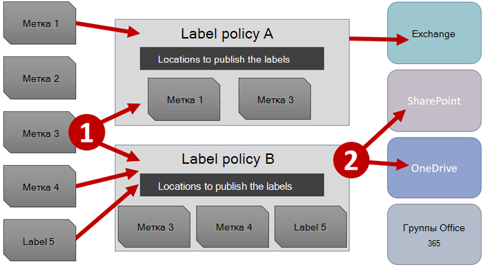
  
1. Когда вы публикуете метки хранения, они тем самым включаются в соответствующую политику. Обратите внимание, что имена меток хранения являются неизменяемыми, и их нельзя редактировать после создания.


2. Одну и ту же метку хранения можно включить в несколько политик меток хранения.

3. Одно и то же расположение можно включить в несколько политик меток хранения.    
    
3. Политики меток хранения задают расположения для публикации меток хранения.
    
## <a name="only-one-retention-label-at-a-time"></a>По одной метке хранения

Важно понимать, что к такому контенту, как электронные письма и документы, можно применять только по одной метке хранения.
  
- Метки хранения, назначенные пользователями вручную, можно удалять и менять.
    
- Если контенту назначена автоматически применяемая метка, то пользователь может заменить ее на метку хранения, назначенную вручную.
    
- Если пользователь вручную назначил метку хранения контенту, то автоматически применяемая метка не может заменить ее.
    
- Если имеется ряд правил, назначающих автоматически применяемую метку, а контент соответствует условиям нескольких из них, назначается метка хранения самого старого правила.
    
Метки, назначаемые вручную, применяются явно. Автоматически применяемые метки назначаются неявно. Приоритет явной метки хранения выше, чем неявной. Дополнительные сведения см. в разделе [Принципы хранения и приоритеты](#the-principles-of-retention-or-what-takes-precedence) ниже.

Все сведения этого раздела относятся только к меткам хранения. Обратите внимание, что в дополнение к одной метке хранения к элементу контента также может применяться одна метка конфиденциальности.
  
## <a name="how-long-it-takes-for-retention-labels-to-take-effect"></a>Срок вступления меток хранения в силу

При публикации автоматически применяемые метки хранения не сразу вступают в силу.
  
1. Для начала необходимо синхронизировать политику меток с расположениями при помощи Центра администрирования.
    
2. Затем в конкретном расположении может потребоваться некоторое время, чтобы опубликованные метки хранения стали доступными конечным пользователям или чтобы содержимому были автоматически присвоены соответствующие метки. Необходимое для этого время зависит от расположения и типа метки хранения.
    
### <a name="published-retention-labels"></a>Опубликованные метки хранения

При публикации меток хранения в SharePoint или OneDrive могут потребоваться сутки, чтобы эти метки хранения стали видны пользователям. Кроме того, при публикации меток хранения в Exchange может потребоваться 7 дней, чтобы эти метки хранения стали видны пользователям, а почтовый ящик должен содержать не менее 10 МБ данных.
  

  
### <a name="auto-apply-retention-labels"></a>Метки хранения, применяемые автоматически

Если метки хранения автоматически применяются к контенту, соответствующему определенным условиям, может потребоваться семь дней, чтобы метки хранения были применены ко всему существующему контенту, соответствующему условиям.
  

  
### <a name="how-to-check-on-the-status-of-retention-labels-published-to-exchange"></a>Проверка состояния меток хранения, опубликованных в Exchange

В Exchange Online метки хранения становятся доступны пользователям в ходе процесса, выполняемого каждые семь дней. С помощью Powershell можно узнать, когда этот процесс выполнялся в прошлый раз, и определить, когда он запустится снова.
  
1. [Подключение к Exchange Online PowerShell](https://go.microsoft.com/fwlink/?linkid=799773).
    
2. Выполните следующие команды:
    
   ```powershell
   $logProps = Export-MailboxDiagnosticLogs <user> -ExtendedProperties
   ```

   ```powershell
   $xmlprops = [xml]($logProps.MailboxLog)
   ```

   ```powershell
   $xmlprops.Properties.MailboxTable.Property | ? {$_.Name -like "ELC*"}
   ```

В результатах свойство `ELCLastSuccessTimeStamp` (UTC) показывает, когда система в последний раз обрабатывала ваш почтовый ящик. Если этого не происходило с момента создания политики, метки не будут отображаться. Для принудительной обработки выполните команду `Start-ManagedFolderAssistant -Identity <user>`.
    
Если метки не отображаются в Outlook в Интернете, хотя они должны быть видны, очистите кэш браузера (CTRL+F5).
    
## <a name="retention-label-policies-and-locations"></a>Политики и расположения меток хранения

Метки хранения различных типов можно публиковать в разных расположениях, зависящих от назначения метки хранения.
  
|**Тип метки хранения**|**Сфера применения политики меток**|
|:-----|:-----|
|Публикуемая для пользователей  <br/> |Exchange, SharePoint, OneDrive, группы Office 365  <br/> |
|Автоматически применяемая в соответствии с типами конфиденциальной информации  <br/> |Exchange (только ко всем почтовым ящикам), SharePoint, OneDrive  <br/> |
|Автоматически применяемая по запросу  <br/> |Exchange, SharePoint, OneDrive, группы Office 365  <br/> |
   
В Exchange метки хранения (и для запросов, и для конфиденциальной информации) присваиваются автоматически только недавно отправленным сообщениям (данным при передаче), а не ко всем элементам в почтовом ящике (неактивным данным). Кроме того, метки хранения для типов конфиденциальной информации могут автоматически присваиваться только всем почтовым ящикам: выбирать определенные почтовые ящики нельзя.
  
Общедоступные папки Exchange и Skype не поддерживают метки.
  
## <a name="how-retention-labels-enforce-retention"></a>Как метки хранения способствуют хранению

С помощью меток хранения можно обеспечить выполнение тех же действий по хранению, что и с помощью политики хранения. Метки хранения позволяют реализовать сложный план работы с содержимым (или файлами). Подробнее о том, как работают политики хранения, см. в статье [Общие сведения о политиках хранения](retention-policies.md).
  
Кроме того, для меток хранения предусмотрено два варианта хранения, недоступных в политиках хранения. С помощью метки хранения вы можете:
  
- вызвать проверку перед ликвидацией в конце периода хранения, чтобы документы SharePoint и OneDrive требовалось проверять перед удалением. Дополнительные сведения см. в статье [Общие сведения о проверках перед ликвидацией](disposition-reviews.md).
    
- начинать период хранения с момента добавления метки к контенту, а не с момента создания контента или его последнего изменения. Этот вариант применяется только к контенту на сайтах SharePoint и в учетных записях OneDrive. Для электронной почты Exchange срок хранения всегда основывается на дате отправки или получения сообщения, независимо от того, какой вариант вы выбрали.
    

  
## <a name="where-published-retention-labels-can-appear-to-end-users"></a>Где пользователям видны опубликованные метки хранения

Если пользователи назначают метку хранения контенту, ее можно опубликовать в:
  
- Outlook в Интернете;
    
- Outlook 2010 и более поздних версиях;
    
- OneDrive;
    
- SharePoint;
    
- группах Office 365 (как на сайте группы, так и в ее почтовом ящике в Outlook в Интернете).
    
В последующих разделах показано, как метки отображаются в различных приложениях для пользователей в вашей организации.
  
### <a name="outlook-on-the-web"></a>Outlook в Интернете

Чтобы назначить метку элементу в Outlook в Интернете, щелкните его правой кнопкой мыши, нажмите **Назначить политику** и выберите метку хранения. 
  

  
После применения метки хранения ее описание и выполняемые ею действия отображаются в верхней части описания элемента. Если сообщение классифицировано и с ним связан период хранения, вы можете сразу понять, когда истекает срок его действия.
  

  
Вы также можете применять метки хранения к папкам. В этом случае:
  
- ко всем элементам в папке автоматически применяется одна и та же метка хранения, **за исключением** элементов, к которым явно применены другие метки хранения. У таких элементов остаются имеющиеся метки хранения. Дополнительные сведения см. ниже в разделе, посвященном принципам хранения; 
    
- если изменить или удалить используемую по умолчанию метку хранения папки, также меняются или удаляются метки хранения всех элементов в этой папке, **кроме** элементов с явными метками хранения; 
    
- если переместить элемент с меткой хранения по умолчанию в другую папку, к которой по умолчанию применяется другая метка хранения, к элементу будет применена новая метка хранения по умолчанию;
    
- если переместить элемент с меткой хранения по умолчанию в другую папку без метки хранения по умолчанию, старая метка хранения по умолчанию удаляется.
    
### <a name="outlook-2010-and-later"></a>Outlook 2010 и более поздние версии

Чтобы присвоить элементу метку в классическом клиенте Outlook, выберите элемент. На вкладке **Главная** на ленте щелкните **Назначить политику**, а затем выберите метку хранения. 
  

  
Можно также щелкнуть правой кнопкой мыши элемент, выбрать команду **Назначить политику** в контекстном меню, а затем выбрать метку хранения. 

После того как метка хранения будет присвоена, в верхней части элемента можно будет просмотреть эту метку и описание действий, которые она выполняет. Если к электронному сообщению применена метка хранения, для которой задан срок хранения, то вы сразу сможете увидеть, когда истекает этот срок.
  
Вы также можете применять метки хранения к папкам. Это работает одинаково как в Outlook 2010 и более поздних версий, так и в Outlook в Интернете. Дополнительные сведения см. в предыдущем разделе.
  
### <a name="onedrive-and-sharepoint"></a>OneDrive и SharePoint

Чтобы применить метку к документу (включая файлы OneNote) в OneDrive или SharePoint, выберите элемент \> в правом верхнем углу нажмите **Открыть область сведений** \> **Применить метку хранения** и выберите метку хранения. 
  
Вы также можете применить метку хранения к папке или набору документов, а также задать метку хранения по умолчанию для библиотеки документов. Подробнее см. в следующем разделе.
  
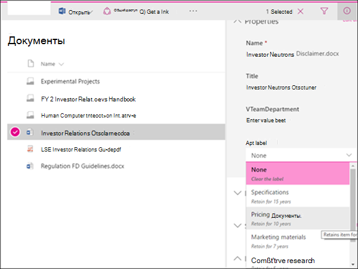
  
Применив метку хранения к элементу, вы можете просмотреть ее в области сведений при выборе этого элемента.
  
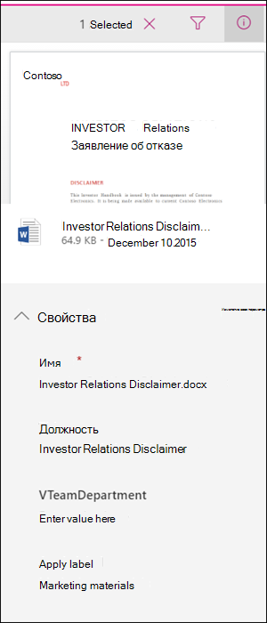
  
Вы также можете создать представление библиотеки, содержащей столбец **Метки** или **Элемент является записью**, чтобы вы могли сразу видеть, какие метки хранения назначены всем элементам и какие элементы являются записями. Однако следует помнить, что представление невозможно отфильтровать по столбцу **Элемент является записью**. 
  
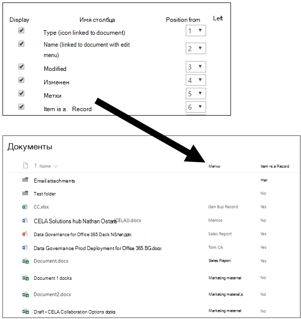
  
### <a name="office-365-groups"></a>Группы Office 365

Когда вы публикуете метки хранения в группе Office 365, они отображаются как на сайте группы, так и в почтовом ящике группы в Outlook в Интернете. Процесс применения метки хранения к контенту идентичен показанному выше процессу для электронных сообщений и документов.

Чтобы хранить контент для группы Office 365, необходимо использовать расположение групп Office 365. Хотя у группы Office 365 есть почтовый ящик Exchange, политика хранения, включающая все расположение Exchange, не будет содержать контент из почтовых ящиков групп Office 365.

Кроме того, нельзя использовать расположение Exchange для включения или исключения определенного почтового ящика группы. Хотя расположение Exchange изначально позволяет выбирать почтовый ящик группы, при попытке сохранить политику хранения появится ошибка, уведомляющая, что RemoteGroupMailbox является недопустимым выбором для расположения Exchange.
  
## <a name="applying-a-retention-label-automatically-based-on-conditions"></a>Автоматическое применение метки хранения в соответствии с условиями

Одно из главных преимуществ меток хранения — возможность автоматически их присваивать содержимому, которое соответствует определенным условиям. В этом случае сотрудникам вашей организации не нужно будет самостоятельно присваивать метки хранения. Office 365 все сделает за них
  
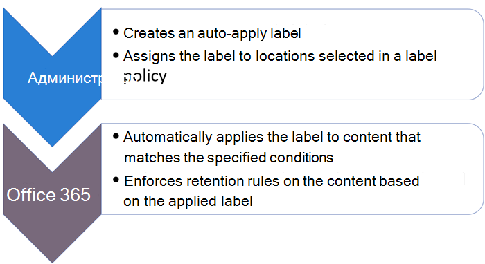
  
Автоматически применяемые метки хранения удобны, потому что:
  
- вам не придется обучать пользователей работе со всеми категориями;
    
- вам не нужно будет рассчитывать на то, что пользователи правильно классифицируют весь контент;
    
- пользователям больше не нужно будет знать о политиках управления данными — они могут сосредоточиться на своей работе.
    
Вы можете автоматически применять метки хранения к контенту, содержащему:
  
- [конфиденциальную информацию определенных типов](#auto-apply-retention-labels-to-content-with-specific-types-of-sensitive-information);
    
- [определенные ключевые слова, соответствующие созданному запросу](#auto-apply-labels-to-content-with-keywords-or-searchable-properties);

- [совпадение для обучаемых классификаторов](#auto-apply-labels-to-content-by-using-trainable-classifers).
    
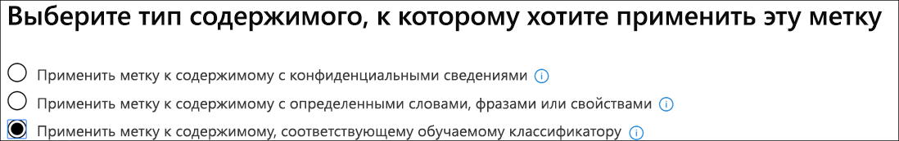

Автоматическое применение меток хранения к контенту, соответствующему заданным условиям, может занять до семи дней.
  
> [!TIP]
> Подробный сценарий использования управляемых свойств в SharePoint для автоматического применения меток хранения и реализации хранения, зависящего от возникновения события, см. в статье [Управление жизненным циклом документов SharePoint с метками хранения](auto-apply-retention-labels-scenario.md).

### <a name="auto-apply-retention-labels-to-content-with-specific-types-of-sensitive-information"></a>Автоматическое применение меток хранения к контенту с определенными типами конфиденциальной информации

Когда вы создаете автоматически присваиваемые метки хранения для конфиденциальной информации, вы видите тот же список шаблонов политик, что и при создании политики защиты от потери данных (DLP) . Каждый шаблон политик настроен для поиска определенных типов конфиденциальной информации. Например, показанный здесь шаблон служит для выявления идентификационного номера налогоплательщика (ITIN), номера социального страхования (SSN) и номера паспорта в американском формате. Дополнительные сведения см. в статье [Обзор политик защиты от потери данных](data-loss-prevention-policies.md).
  
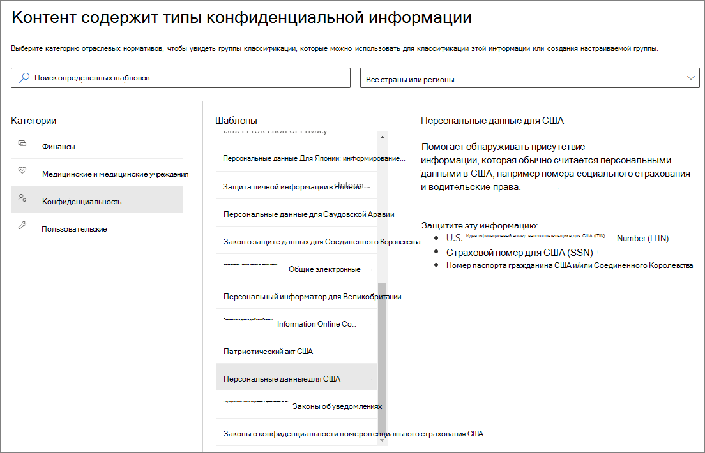
  
Выбрав шаблон политики, вы можете добавлять или удалять конфиденциальную информацию любых типов, а также менять количество экземпляров и точность совпадения. В приведенном ниже примере метка хранения будет автоматически применяться, только если:
  
- контент содержит от 1 до 9 экземпляров любого из этих трех типов конфиденциальной информации. Вы можете удалить **максимальное** значение, чтобы оно изменилось на **Любое**;
    
- для определяемого типа конфиденциальной информации задана точность совпадения (или уровень надежности) не менее 75. Для многих типов конфиденциальной информации определяется несколько шаблонов. Чем выше точность совпадения, тем больше признаков (например, ключевых слов, дат или адресов) нужно для обнаружения шаблона. Проще говоря, чем ниже **минимальная** точность совпадения, тем проще сопоставить контент с условием. 
    
Дополнительные сведения об этих параметрах см. в разделе [Настройка правил для упрощения или усложнения сопоставления](data-loss-prevention-policies.md#tuning-rules-to-make-them-easier-or-harder-to-match).
    
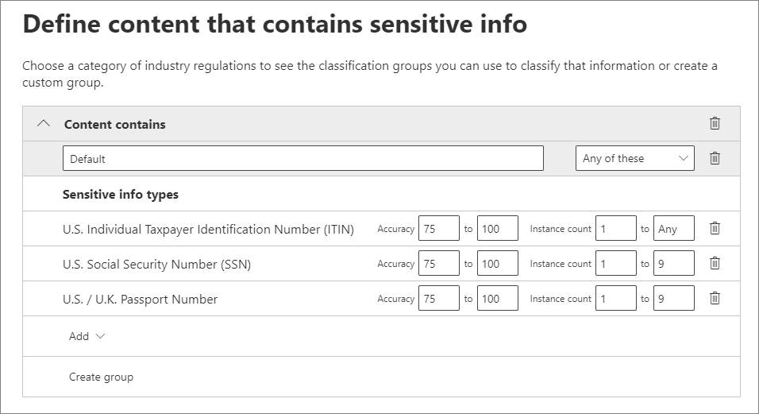
  
### <a name="auto-apply-labels-to-content-with-keywords-or-searchable-properties"></a>Автоматическое применение меток к контенту с ключевыми словами или доступными для поиска свойствами

Вы можете автоматически применять метки к контенту, соответствующему определенным условиям. Имеющиеся в данный момент условия поддерживают применение метки к контенту, содержащему определенные слова, фразы или значения доступных для поиска свойств. Вы можете уточнить запрос с помощью таких операторов поиска, как AND, OR и NOT.

Дополнительные сведения о синтаксисе запросов см. в статье:

- [Руководство по синтаксису языка запросов по ключевым словам (KQL)](https://docs.microsoft.com/sharepoint/dev/general-development/keyword-query-language-kql-syntax-reference)

Метки на основе запросов используют индекс поиска для определения контента. Дополнительные сведения о допустимых свойствах, доступных для поиска, см. в статьях:

- [Запросы ключевых слов и условия поиска контента](keyword-queries-and-search-conditions.md)
- [Обзор свойств для обхода и управляемых свойств в SharePoint Server](https://docs.microsoft.com/SharePoint/technical-reference/crawled-and-managed-properties-overview)

Примеры запросов:

- Exchange
    - subject:"Квартальное финансирование"
    - recipients:garthf<!--nolink-->@contoso.com
- SharePoint и OneDrive для бизнеса
    - contenttype:контракт
    - site:https<!--nolink-->://contoso.sharepoint.com/sites/teams/procurement И contenttype:contract

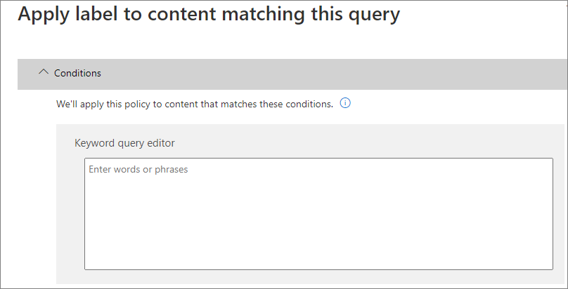


### <a name="auto-apply-labels-to-content-by-using-trainable-classifers"></a>Автоматическое применение меток к контенту с помощью обучаемых классификаторов

При использовании варианта для обучаемого классификатора вы можете выбрать один из встроенных классификаторов или настраиваемый классификатор. К встроенным классификаторам относятся **Оскорбительная лексика**, **Резюме**, **Исходный код**, **Целенаправленное притеснение**, **Сквернословие** и **Угрозы**.


Для автоматического применения меток с помощью классификатора на сайтах и в почтовых ящиках SharePoint Online должно быть не менее 10 МБ данных.

Дополнительные сведения об обучаемых классификаторах см. в статье [Начало работы с обучаемыми классификаторами (предварительная версия)](classifier-getting-started-with.md).

Пример конфигурации см. в статье [Подготовка к использованию и использование встроенных классификаторов](classifier-using-a-ready-to-use-classifier.md#how-to-prepare-for-and-use-a-built-in-classifier).

## <a name="applying-a-default-retention-label-to-all-content-in-a-sharepoint-library-folder-or-document-set"></a>Применение метки хранения по умолчанию ко всему контенту в библиотеке SharePoint, папке или набору документов

Вы можете не только разрешить пользователям применять метки хранения к отдельным документам, но и назначить метку хранения по умолчанию библиотеке SharePoint, папке или набору документов, чтобы эта метка хранения применялась ко всем документам в этом расположении.
  
Для библиотеки документов это можно сделать на странице **Параметры библиотеки**. Выбрав метку хранения по умолчанию, вы также можете присвоить ее существующим элементам в библиотеке. 
  
Например, если у вас есть тег для маркетинговых материалов и вы знаете, что определенная библиотека документов содержит контент только этого типа, вы можете сделать тег маркетинговых материалов стандартным для всех документов в этой библиотеке.
  

  
Если вы применяете метку хранения по умолчанию к имеющимся элементам в библиотеке, папке или наборе документов:
  
- ко всем элементам в библиотеке, папке или наборе документов автоматически применяется та же метка хранения, **за исключением** элементов, к которым явно применены другие метки хранения, например к записям (у таких элементов метка остается прежней). Дополнительные сведения см. ниже в разделе [Принципы хранения и приоритеты](#the-principles-of-retention-or-what-takes-precedence);
    
- если изменить или удалить используемую по умолчанию метку хранения библиотеки, папки или набора документов, также меняются или удаляются метки хранения всех элементов в этой библиотеке, папке или наборе документов, **кроме** элементов с явными метками хранения (например, записи);
    
- если переместить элемент с меткой хранения по умолчанию в другое семейство веб-сайтов, библиотеку, папку или набор документов с другой меткой, то у элемента останется текущая метка хранения по умолчанию, даже если к новому расположению применяется другая метка хранения по умолчанию; если у элемента нет метки перед перемещением, к нему будет применена метка хранения, используемая по умолчанию в новом расположении.

**Записи.** Если применить стандартную метку записи к библиотеке, папке или набору документов, метка записи применяется ко всем отдельным элементам в этих расположениях. При перемещении нового элемента в расположение с меткой записи этот элемент помечается как запись. Но если используемая по умолчанию метка хранения меняется на метку, не объявляющую содержимое записью, это действие **не** удаляет метку записи из отдельных элементов. Эти элементы сохраняют свою метку записи. Только администратор семейства веб-сайтов может явно удалить или изменить метку хранения для записей.

Дополнительные сведения о метках хранения, объявляющих содержимое записью, см. в статье [Обзор записей](records.md).
    
## <a name="applying-a-retention-label-to-email-by-using-rules"></a>Применение метки хранения к электронному сообщению с помощью правил

В Outlook 2010 и более поздних версиях можно создавать правила, применяемые к метке хранения или политике хранения.
  
Например, вы можете создать правило, которое применяет ту или иную метку хранения ко всем сообщениям, отправляемым в определенную группу рассылки или из нее.
  
Чтобы создать правило, щелкните элемент правой кнопкой мыши и выберите **Правила** \> **Создать правило** \> **Дополнительные параметры** \> **Мастер правил** \> **Применить политику хранения**.
  

  
## <a name="classifying-content-without-applying-any-actions"></a>Классификация контента без применения действий

Создавая метку хранения, вы можете не включать хранение или другие действия, как показано ниже. В этом случае метку хранения можно использовать исключительно как текстовую подпись, не выполняющую никаких действий.
  
Например, вы можете создать метку хранения под названием "Просмотреть позже" без действий, а затем автоматически применять эту метку хранения к контенту с конфиденциальной информацией или запрашиваемому контенту.
  
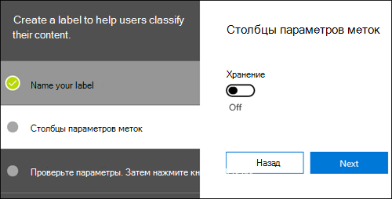
  
## <a name="using-retention-labels-for-records-management"></a>Использование меток хранения для управления записями
    
Метки хранения можно использовать для объявления содержимого записью. Это позволит реализовать единую согласованную стратегию управления записями в Office 365. Дополнительные сведения см. в статье [Обзор записей](records.md).
  
## <a name="using-a-retention-label-as-a-condition-in-a-dlp-policy"></a>Использование метки хранения в качестве условия в политике защиты от потери данных

Метка хранения может применять действия по хранению контента. Кроме того, вы можете использовать метку хранения как условие в политике защиты от потери данных (DLP), и политика защиты от потери данных может применять другие действия (например, ограничение доступа) к контенту с определенной меткой. 
  
Дополнительные сведения см. в разделе [Использование метки в качестве условия в политике защиты от потери данных](data-loss-prevention-policies.md#using-a-label-as-a-condition-in-a-dlp-policy).
  
## <a name="monitor-retention-labels"></a>Отслеживание меток хранения

После публикации и автоматического применения меток хранения вам нужно убедиться, что они применяются к контенту, как планировалось. Для отслеживания меток хранения можно использовать следующие средства:
  
- **Обозреватель действий с метками**. С помощью обозревателя (показанного ниже) вы можете быстро находить и просматривать действия с метками хранения для всего контента в SharePoint и OneDrive для бизнеса за последние 30 дней. Дополнительные сведения см. в статье [Просмотр действий с метками для документов](view-label-activity-for-documents.md).

- Страница **Аналитика меток**. В Центре соответствия требованиям Microsoft 365 и Центре безопасности Microsoft 365 можно быстро просмотреть основные метки и область их применения. Также можно просмотреть все содержимое с определенной меткой. Дополнительные сведения см. в статье [Просмотр использования меток с помощью аналитики меток](label-analytics.md).
    
- **Отчеты об управлении данными**. С помощью этих отчетов вы можете быстро просматривать тенденции и действия с метками хранения для всего контента в Exchange, SharePoint и OneDrive для бизнеса за последние 90 дней. Дополнительные сведения см. в статье [Просмотр отчетов об управлении данными](view-the-data-governance-reports.md).
    

  
## <a name="using-content-search-to-find-all-content-with-a-specific-retention-label-applied-to-it"></a>Использование средства "Поиск контента" для поиска содержимого с определенной меткой хранения

Когда метки хранения будут назначены содержимому (либо пользователями, либо автоматически), вы можете использовать средство "Поиск контента", чтобы найти весь контент с определенной меткой хранения.
  
Создавая запрос на поиск контента, выберите условие **Тег соответствия требованиям**, а затем укажите полное имя метки либо введите его часть и используйте подстановочный знак. Дополнительные сведения см. в статье [Запросы ключевых слов и условия поиска контента](keyword-queries-and-search-conditions.md).
  
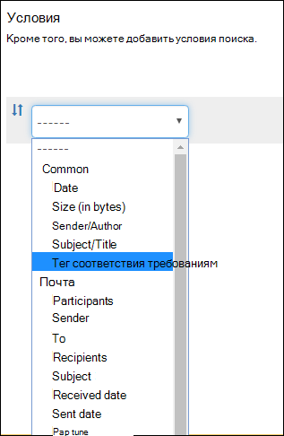
  
## <a name="the-principles-of-retention-or-what-takes-precedence"></a>Принципы хранения и приоритеты

Возможно (и даже вероятно), что к содержимому применено несколько политик хранения с разными действиями (хранением и/или удалением) и периодом хранения. Какая политика имеет приоритет? Во-первых, вы можете быть уверены, что содержимое, сохраняемое одной политикой, не может быть безвозвратно удалено другой.
  

  
Чтобы понять, как различные метки с действиями хранения применяются к контенту, запомните следующие принципы хранения:
  
1. **Хранение имеет приоритет перед удалением.** Допустим, одна политика хранения предписывает удаление электронной почты Exchange спустя три года, а другая — ее хранение в течение пяти лет с последующим удалением. Весь контент трехлетней давности будет удален и скрыт от пользователя, но останется в папке "Элементы с возможностью восстановления", пока его возраст не достигнет пяти лет, после чего он будет окончательно удален. 
    
2. **Самый продолжительный период хранения имеет приоритет.** Если к содержимому применено несколько политик, сохраняющих его, оно будет храниться до окончания самого длительного периода хранения. 
    
3. **Явное включение имеет приоритет перед неявным.** Это означает следующее: 
    
    1. Если пользователь вручную присваивает метку хранения с параметрами хранения тому или иному элементу, например сообщению электронной почты Exchange или документу OneDrive, эта метка хранения имеет преимущество как над политикой, которая назначена на уровне сайта или почтового ящика, так и над меткой хранения по умолчанию, которая присваивается библиотекой документов. Например, если в метке хранения явно указан десятилетний срок хранения, а в назначенной сайту политике хранения — пятилетний, приоритет отдается метке хранения. Автоматически присваиваемые метки хранения считаются неявными именно в силу автоматического их присваивания в Office 365.
    
    2. Если политика хранения включает определенное расположение, например учетную запись OneDrive для бизнеса или почтовый ящик конкретного пользователя, то эта политика имеет приоритет перед другой политикой хранения, которая применяется к учетным записям OneDrive для бизнеса или почтовым ящикам всех пользователей, но не включает почтовый ящик именно этого пользователя.
    
4. **Кратчайший период удаления имеет приоритет.** Если же к содержимому применено несколько политик, удаляющих его (без хранения), то оно будет удалено по истечении кратчайшего периода хранения. 
    
Следует понимать, что принципы хранения используются как поток разрешения конфликтов (сверху вниз): если правила, применяемые всеми политиками или метками, совпадают на одном уровне, то поток переходит на уровень ниже, чтобы определить приоритет применения правил.
  
Политика хранения или метка не может безвозвратно удалить какое-либо содержимое, находящееся на удержании для обнаружения электронных данных. При отмене удержания содержимое снова становится доступным для вышеописанного процесса очистки.
  
## <a name="use-retention-labels-instead-of-these-features"></a>Использование меток хранения вместо этих функций

Метки хранения легко сделать доступными всей организации и ее контенту в Office 365, включая Exchange, SharePoint, OneDrive и группы Office 365. Если вам нужно классифицировать контент или управлять записями в какой-либо службе из Office 365, рекомендуем использовать метки хранения.
  
Существуют другие функции, которые раньше использовались для классификации содержимого и управления записями в Office 365. Они перечислены ниже. Эти функции будут работать наряду с метками хранения. Несмотря на то, что в некоторых случаях реализация меток хранения отличается от действия предыдущих функций, развитие управления записями в Office 365 основывается на эволюции применения меток хранения. По этой причине в дальнейшем для управления данными рекомендуем вместо этих функций использовать метки хранения.
  
### <a name="exchange-online"></a>Exchange Online

- [Теги и политики хранения](https://go.microsoft.com/fwlink/?linkid=846125), также называемые средствами [управления записями сообщений (MRM)](https://go.microsoft.com/fwlink/?linkid=846126) (только для удаления) 
    
### <a name="sharepoint-online-and-onedrive-for-business"></a>SharePoint Online и OneDrive для бизнеса

- [Настройка управления записями на месте](https://support.office.com/article/7707a878-780c-4be6-9cb0-9718ecde050a) (хранение) 
    
- [Общие сведения о центре записей](https://support.office.com/article/bae6ca5a-7b19-40e0-b433-e3613a747c2c) (хранение) 
    
- [Политики управления информацией](intro-to-info-mgmt-policies.md) (только удаление) 
    
## <a name="permissions"></a>Разрешения

Участникам команды по обеспечению соответствия требованиям, которые будут создавать метки хранения, потребуются разрешения для Центра безопасности и соответствия требованиям. По умолчанию администратор клиента обладает доступом к этому расположению и может предоставить ответственным за обеспечение соответствия требованиям и другим лицам доступ к Центру безопасности и соответствия требованиям, не предоставляя им все разрешения администратора клиента. Для этого рекомендуем вам перейти на страницу **Разрешения** в Центре безопасности и соответствия требованиям, изменить группу ролей **Администратор соответствия требованиям** и добавить участников в эту группу ролей. 
  
Дополнительные сведения см. в статье [Предоставление пользователям доступа к Центру безопасности и соответствия требованиям Office 365](../security/office-365-security/grant-access-to-the-security-and-compliance-center.md).
  
Эти разрешения необходимы только для создания и применения меток хранения и соответствующей политики. Для применения политики не требуется доступ к контенту.  
## <a name="find-the-powershell-cmdlets-for-labels"></a>Командлеты PowerShell для работы с метками

Чтобы использовать командлеты для работы с метками, необходимо:
  
1. [Подключение к PowerShell Центра безопасности и соответствия требованиям Office 365](https://docs.microsoft.com/powershell/exchange/office-365-scc/connect-to-scc-powershell/connect-to-scc-powershell)
    
2. Используйте эти командлеты Центра безопасности и соответствия требованиям Office 365:

  - [Get-ComplianceTag](https://docs.microsoft.com/powershell/module/exchange/policy-and-compliance-retention/get-compliancetag)

  - [New-ComplianceTag](https://docs.microsoft.com/powershell/module/exchange/policy-and-compliance-retention/new-compliancetag)

  - [Remove-ComplianceTag](https://docs.microsoft.com/powershell/module/exchange/policy-and-compliance-retention/remove-compliancetag)

  - [Set-ComplianceTag](https://docs.microsoft.com/powershell/module/exchange/policy-and-compliance-retention/set-compliancetag)

  - [Enable-ComplianceTagStorage](https://docs.microsoft.com/powershell/module/exchange/policy-and-compliance-retention/enable-compliancetagstorage)

  - [Get-ComplianceTagStorage](https://docs.microsoft.com/powershell/module/exchange/policy-and-compliance-retention/get-compliancetagstorage)

  - [Get-RetentionCompliancePolicy](https://docs.microsoft.com/powershell/module/exchange/policy-and-compliance-retention/get-retentioncompliancepolicy)

  - [New-RetentionCompliancePolicy](https://docs.microsoft.com/powershell/module/exchange/policy-and-compliance-retention/new-retentioncompliancepolicy)

  - [Remove-RetentionCompliancePolicy](https://docs.microsoft.com/powershell/module/exchange/policy-and-compliance-retention/remove-retentioncompliancepolicy)

  - [Set-RetentionCompliancePolicy](https://docs.microsoft.com/powershell/module/exchange/policy-and-compliance-retention/set-retentioncompliancepolicy)

  - [Get-RetentionComplianceRule](https://docs.microsoft.com/powershell/module/exchange/policy-and-compliance-retention/get-retentioncompliancerule)

  - [New-RetentionComplianceRule](https://docs.microsoft.com/powershell/module/exchange/policy-and-compliance-retention/new-retentioncompliancerule)

  - [Remove-RetentionComplianceRule](https://docs.microsoft.com/powershell/module/exchange/policy-and-compliance-retention/remove-retentioncompliancerule)

  - [Set-RetentionComplianceRule](https://docs.microsoft.com/powershell/module/exchange/policy-and-compliance-retention/set-retentioncompliancerule)
