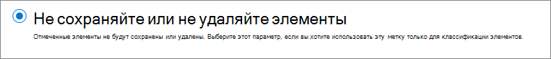

# Сведения о метках хранения

>*[Руководство по лицензированию Microsoft 365 для обеспечения безопасности и соответствия требованиям](https://aka.ms/ComplianceSD).*

Across your organization, you probably have different types of content that require different actions taken on them in order to comply with industry regulations and internal policies. For example, you might have:
  
- налоговые декларации, которые необходимо **хранить** не меньше определенного срока; 
    
- материалы для прессы, которые требуется **безвозвратно удалять** по достижении определенной давности; 
    
- исследования конкурентов, которые требуется **сохранять**, а затем **окончательно удалять**; 
    
- рабочие визы, которые требуется **отмечать как записи**, чтобы их невозможно было редактировать и удалять. 
    
In all of these cases, retention labels can help you take the right actions on the right content. With retention labels, you can classify data across your organization for governance, and enforce retention rules based on that classification.
  
С помощью меток хранения вы можете:
  
- **Enable people in your organization to apply a retention label manually** to content in Outlook on the web, Outlook 2010 and later, OneDrive, SharePoint, and Microsoft 365 Groups. Users often know best what type of content they're working with, so they can classify it and have the appropriate policy applied. 
    
- **Обеспечить автоматическое применение меток хранения к контенту**, если он соответствует определенным условиям, например если он содержит: 
    
    - конфиденциальную информацию определенных типов;
    
    - определенные ключевые слова, соответствующие созданному запросу.
    
    - совпадения с шаблоном для обучаемого классификатора.
    
  Возможность автоматически применять метки хранения к контенту важна, потому что:
    
     - вам не придется обучать пользователей работе со всеми категориями;
    
     - вам не нужно будет рассчитывать на то, что пользователи правильно классифицируют весь контент;
    
   - пользователям больше не нужно будет знать о политиках управления данными — они могут сосредоточиться на своей работе.

- **Применить стандартную метку хранения к библиотеке документов, папке или набору документов** в SharePoint, чтобы все документы, хранящиеся в этом расположении, наследовали эту метку.

Кроме того, метки хранения поддерживают [управления записями](records-management.md) для электронных сообщений и документов в приложениях и службах Microsoft 365. Метки хранения можно использовать для классификации контента как записи. После этого (при сохранении контента в Microsoft 365) метку, как и сам контент, нельзя будет изменить или удалить. 

Метки хранения, в отличие от [меток конфиденциальности](sensitivity-labels.md), не сохраняются, если контент перемещается за пределы Microsoft 365.

Количество меток хранения, поддерживаемых клиентом, не ограничено. Тем не менее 10 000 — это максимальное количество политик, которые поддерживаются клиентом, включая политики, которые применяют метки (политики меток хранения и автоматического применения хранения), а также политики хранения.

## Как работают метки хранения с политиками

Предоставление доступа к меткам хранения для сотрудников вашей организации выполняется в два этапа: 

1. Создание меток хранения

2. Публикация меток хранения с помощью их политик
  

  
Метки хранения — это независимые многократно используемые стандартные блоки, включаемые в одну или несколько политик меток хранения. Основное назначение политики меток хранения состоит в группировке набора меток хранения и указании расположений, где эти метки должны отображаться.
  

  
1. Когда вы публикуете метки хранения, они тем самым включаются в соответствующую политику. Имена меток хранения являются неизменяемыми. Это означает, что их нельзя изменить после создания.

2. Одну и ту же метку хранения можно включить в несколько политик меток хранения.

3. Одно и то же расположение можно включить в несколько политик меток хранения.
    
3. Политики меток хранения задают расположения для публикации меток хранения.
    
## По одной метке хранения

Важно понимать, что к такому контенту, как электронные письма и документы, можно применять только по одной метке хранения.
  
- Метки хранения, назначенные пользователями вручную, можно удалять и менять.
    
- Если контенту назначена автоматически применяемая метка, то пользователь может заменить ее на метку хранения, назначенную вручную.
    
- Если пользователь вручную назначил метку хранения контенту, то автоматически применяемая метка не может заменить ее.
    
- Если имеется ряд правил, назначающих автоматически применяемую метку, а контент соответствует условиям нескольких из них, назначается метка хранения самого старого правила.
    
Чтобы понять, как и зачем применяется та или иная метка хранения, нужно понять различия между явным и неявным назначением метки:

- Назначенные вручную метки присваиваются явно.
- Метки назначенные автоматически присваиваются неявно.

Метка хранения назначенная явно имеет приоритет над неявно назначенной. Дополнительные сведения см. в разделе [Принципы хранения и приоритеты](#the-principles-of-retention-or-what-takes-precedence) на этой странице;

## Политики и расположения меток хранения

Метки хранения различных типов можно публиковать в разных расположениях, зависящих от назначения метки хранения.
  
|**Тип метки хранения**|**Сфера применения политики меток**|
|:-----|:-----|
|Публикуемая для пользователей    |Exchange, SharePoint, OneDrive, группы Microsoft 365    |
|Автоматически применяемая в соответствии с типами конфиденциальной информации    |Exchange (только ко всем почтовым ящикам), SharePoint, OneDrive    |
|Автоматически применяемая по запросу    |Exchange, SharePoint, OneDrive, группы Microsoft 365    |
   
В Exchange метки хранения (и для запросов, и для конфиденциальной информации) присваиваются автоматически только недавно отправленным сообщениям (данным при передаче), а не ко всем элементам в почтовом ящике (неактивным данным). Кроме того, метки хранения для типов конфиденциальной информации могут автоматически присваиваться только всем почтовым ящикам: выбирать определенные почтовые ящики нельзя.
  
Общедоступные папки Exchange, сообщения каналов и чаты Skype и Teams не поддерживают метки хранения.

## Как метки хранения способствуют хранению

Метки хранения обеспечивают выполнение тех же действий по хранению, что и политики хранения – сохранение и удаление, либо только сохранение или только удаление. Метки хранения можно использовать для внедрения сложных планов хранения, которые определяют файлы для различных параметров хранения. Дополнительные сведения об обеспечении хранения, смотрите в разделе [Сведения о политиках хранения](retention-policies.md).

In addition, a retention label has two retention options that are available only in a retention label and not in a retention policy. With a retention label, you can:
  
- Запускать проверку перед ликвидацией в конце периода хранения, чтобы в обязательном порядке проверять документы из SharePoint и OneDrive перед их удалением. Дополнительные сведения см. в статье [Проверки перед ликвидацией](disposition.md#disposition-reviews).
    
- начинать период хранения с момента добавления метки к контенту, а не с момента создания контента или его последнего изменения. При использовании этого параметра:
    - Он применяется только к контенту на сайтах SharePoint и в учетных записях OneDrive. Для электронной почты Exchange срок хранения всегда основывается на дате отправки или получения сообщения.
    - Вы не можете изменить срок хранения после сохранения метки.
    

Другое важное отличие заключается в том, что если вы применяете метку хранения а не политику хранения к файлам в SharePoint и настраиваете для нее хранение содержимого, пользователи не могут удалять файл во время срока хранения. Пользователи могут удалять контент, когда одна и та же метка применена к файлам в OneDrive и сообщениям электронной почты, если только метка не помечает контент как запись.

## Где пользователям видны опубликованные метки хранения

Если пользователи назначают метку хранения контенту, ее можно опубликовать в:
  
- Outlook и Outlook в Интернете
    
- OneDrive
    
- SharePoint;
    
- группах Microsoft 365 (как на сайте группы, так и в ее почтовом ящике в Outlook в Интернете).
    
В последующих разделах описано, как метки отображаются в различных приложениях для пользователей в вашей организации.
  

### Outlook

Чтобы присвоить элементу метку в классическом клиенте Outlook, выберите элемент. На вкладке **Главная** на ленте щелкните **Назначить политику**, а затем выберите метку хранения. 
  

  
Можно также щелкнуть правой кнопкой мыши элемент, выбрать команду **Назначить политику** в контекстном меню, а затем выбрать метку хранения. 

После того как метка хранения будет присвоена, в верхней части элемента можно будет просмотреть эту метку и описание действий, которые она выполняет. Если к электронному сообщению применена метка хранения, для которой задан срок хранения, то вы сразу сможете увидеть, когда истекает этот срок.
  
Вы также можете применять метки хранения к папкам. В этом случае:
  
- ко всем элементам в папке автоматически применяется та же метка хранения, **за исключением** элементов, к которым явно применены другие метки хранения У явно помеченных элементов метка хранения остается прежней. Дополнительные сведения см. в разделе [Принципы хранения и приоритеты](#the-principles-of-retention-or-what-takes-precedence) на этой странице; 
    
- если изменить или удалить используемую по умолчанию метку хранения папки, также меняются или удаляются метки хранения всех элементов в этой папке, **кроме** элементов с явно назначенными метками хранения; 
    
- если переместить элемент с меткой хранения по умолчанию в другую папку, к которой по умолчанию применяется другая метка хранения, к элементу будет применена новая метка хранения по умолчанию;
    
- если переместить элемент с меткой хранения по умолчанию в другую папку без метки хранения по умолчанию, старая метка хранения по умолчанию удаляется.

### Outlook в Интернете

Чтобы назначить метку элементу в Outlook в Интернете, щелкните его правой кнопкой мыши, нажмите **Назначить политику** и выберите метку хранения. 
  

  
After the retention label is applied, you can view that retention label and what action it takes at the top of the item. If an email is classified and has an associated retention period, you can know at a glance when the email will expire.
  

  
Как и в Outlook в Интернете, вы можете применять метки хранения к папкам. 

### OneDrive и SharePoint

Чтобы применить метку к документу (включая файлы OneNote) в OneDrive или SharePoint, выберите элемент \> в правом верхнем углу нажмите **Открыть область сведений** \> **Применить метку хранения** и выберите метку хранения. 
  
Вы можете применить метку хранения к папке или набору документов, а также задать [метку хранения по умолчанию для библиотеки документов](#applying-a-default-retention-label-to-all-content-in-a-sharepoint-library-folder-or-document-set).
  

  
Применив метку хранения к элементу, вы можете просмотреть ее в области сведений при выборе этого элемента.
  

  
В SharePoint, но не в OneDrive, можно создать представление библиотеки, содержащей столбцы **Метки** или **Элемент является записью**. В этом представлении отображаются метки хранения, назначаемые всем элементам, а также элементы, являющиеся записями. Обратите внимание, что вы не можете отфильтровать представление по столбцу **Элемент является записью**. Инструкции по добавлению столбцов см. в статье [Отображение и скрытие столбцов в списке или библиотеке](https://support.microsoft.com/ru-RU/office/show-or-hide-columns-in-a-list-or-library-b820db0d-9e3e-4ff9-8b8b-0b2dbefa87e2).

### Группы Microsoft 365

Когда вы публикуете метки хранения в группах Microsoft 365 ([ранее группы Office 365](https://techcommunity.microsoft.com/t5/microsoft-365-blog/office-365-groups-will-become-microsoft-365-groups/ba-p/1303601)), они отображаются на сайте группы и в ее почтовом ящике в Outlook в Интернете. Порядок присваивания метки хранения содержимому такой же, как и для электронной почты и документов.

Чтобы хранить содержимое группы Microsoft 365, используйте расположение **групп Office 365**. Несмотря на то, что в группе Microsoft 365 есть почтовый ящик Exchange, политика хранения, включающая все расположение Exchange, не будет включать содержимое в почтовые ящики группы Microsoft 365.

Кроме того, нельзя использовать расположение Exchange для включения или исключения определенного почтового ящика группы. Хотя расположение Exchange изначально позволяет выбирать почтовый ящик группы, при попытке сохранить политику хранения появится ошибка, уведомляющая, что RemoteGroupMailbox является недопустимым выбором для расположения Exchange.
  
Сначала создайте и настройте метки конфиденциальности, которые должны быть доступны для приложений и других служб. Например, метки, которые пользователям нужно найти и применить из приложений Office. 

Затем создайте одну или несколько политик меток, содержащих настраиваемые метки и параметры политики. Публикацию меток и параметров для выбранных пользователей и расположений осуществляет политика меток.

## Автоматическое применение метки хранения в соответствии с условиями

Одно из главных преимуществ меток хранения — возможность автоматически их присваивать содержимому, которое соответствует определенным условиям. В этом случае сотрудникам вашей организации не нужно будет самостоятельно присваивать метки хранения. Microsoft 365 все сделает за них.
  

  
Польза автоматического присваивания меток хранения в том, что:
  
- вам не придется обучать пользователей работе со всеми категориями;
    
- вам не нужно будет рассчитывать на то, что пользователи правильно классифицируют весь контент;
    
- пользователям больше не нужно будет знать о политиках управления данными — они могут сосредоточиться на своей работе.
    
Вы можете автоматически применять метки хранения к контенту, содержащему:
  
- [конфиденциальную информацию определенных типов](create-retention-labels.md#auto-apply-labels-to-content-with-specific-types-of-sensitive-information);
    
- [определенные ключевые слова, соответствующие созданному запросу](create-retention-labels.md#auto-apply-labels-to-content-with-keywords-or-searchable-properties);

- [совпадение для обучаемых классификаторов](create-retention-labels.md#auto-apply-labels-to-content-by-using-trainable-classifiers).
    

> [!TIP]
> Подробный сценарий использования управляемых свойств в SharePoint для автоматического применения меток хранения и реализации хранения, зависящего от возникновения события, см. в статье [Управление жизненным циклом документов SharePoint с метками хранения](auto-apply-retention-labels-scenario.md).

## Применение метки хранения по умолчанию ко всему контенту в библиотеке SharePoint, папке или набору документов

Вы можете не только разрешить пользователям применять метки хранения к отдельным документам, но и назначить метку хранения по умолчанию библиотеке SharePoint, папке или набору документов, чтобы эта метка хранения применялась ко всем документам в этом расположении.
  
Для библиотеки документов это можно сделать на странице **Параметры библиотеки**. Выбрав метку хранения по умолчанию, вы также можете присвоить ее существующим элементам в библиотеке. 
  
Например, если у вас есть тег для маркетинговых материалов и вы знаете, что определенная библиотека документов содержит контент только этого типа, вы можете сделать тег маркетинговых материалов стандартным для всех документов в этой библиотеке.
  

  
Если вы применяете метку хранения по умолчанию к имеющимся элементам в библиотеке, папке или наборе документов:
  
- ко всем элементам в библиотеке, папке или наборе документов автоматически применяется та же метка хранения, **за исключением** элементов, к которым явно применены другие метки хранения, например к записям (у таких элементов метка остается прежней). Дополнительные сведения см. ниже в разделе [Принципы хранения и приоритеты](#the-principles-of-retention-or-what-takes-precedence);
    
- если изменить или удалить используемую по умолчанию метку хранения библиотеки, папки или набора документов, также меняются или удаляются метки хранения всех элементов в этой библиотеке, папке или наборе документов, **кроме** элементов с явными метками хранения (например, записи);
    
- если переместить элемент с меткой хранения по умолчанию в другое семейство веб-сайтов, библиотеку, папку или набор документов с другой меткой, то у элемента останется текущая метка хранения по умолчанию, даже если к новому расположению применяется другая метка хранения по умолчанию; если у элемента нет метки перед перемещением, к нему будет применена метка хранения, используемая по умолчанию в новом расположении.

**Записи.** Если применить стандартную метку записи к библиотеке, папке или набору документов, метка записи применяется ко всем отдельным элементам в этих расположениях. При перемещении нового элемента в расположение с меткой записи этот элемент помечается как запись. Но если используемая по умолчанию метка хранения меняется на метку, не объявляющую содержимое записью, это действие не удаляет метку записи из отдельных элементов. Эти элементы сохраняют свою метку записи. Только администратор семейства веб-сайтов может явно удалить или изменить метку хранения для записей.

Дополнительные сведения о метках хранения, объявляющих содержимое записью, см. в статье [Сведения о записях](records.md).

## Применение метки хранения к электронному сообщению с помощью правил

В Outlook можно создавать правила, применяемые к метке хранения или политике хранения.
  
Например, вы можете создать правило, которое применяет ту или иную метку хранения ко всем сообщениям, отправляемым в определенную группу рассылки или из нее.
  
Чтобы создать правило, щелкните элемент правой кнопкой мыши и выберите **Правила** \> **Создать правило** \> **Дополнительные параметры** \> **Мастер правил** \> **Применить политику хранения**.
  

  
## Классификация контента без применения действий

Создать метку хранения можно без назначения для нее каких-либо действий (например, по хранению). В этом случае метка хранения может служить просто текстовой подписью, не влекущей никаких действий.
  
Например, вы можете создать метку хранения под названием "Просмотреть позже" без действий, а затем автоматически применять эту метку хранения к контенту с конфиденциальной информацией или запрашиваемому контенту.
  

  
## Использование меток хранения для управления записями
    
Метки хранения можно использовать для объявления содержимого записью. Это позволит реализовать единую согласованную стратегию управления записями в Microsoft 365. Дополнительную информацию см. в статье [Сведения о записях](records.md).
  
## Использование метки хранения в качестве условия в политике защиты от потери данных

A retention label can enforce retention actions on content. In addition, you can use a retention label as a condition in a data loss prevention (DLP) policy, and the DLP policy can enforce other actions, such as restricting access, on content that contains a specific label. 
  
Дополнительные сведения см. в разделе [Использование метки хранения в качестве условия в политике защиты от потери данных](data-loss-prevention-policies.md#using-a-retention-label-as-a-condition-in-a-dlp-policy).
  

## Принципы хранения и приоритеты

It's possible or even likely that content might have several retention policies applied to it, each with a different action (retain, delete, or both) and retention period. What takes precedence? At the highest level, rest assured that content being retained by one policy can't be permanently deleted by another policy.
  

  
Чтобы понять, как различные метки с действиями хранения применяются к контенту, запомните следующие принципы хранения:
  
1. **Retention wins over deletion.** Suppose that one retention policy says to delete Exchange email after three years, but another retention policy says to retain Exchange email for five years and then delete it. Any content that reaches three years old will be deleted and hidden from the users' view, but still retained in the Recoverable Items folder until the content reaches five years old, when it will be permanently deleted. 
    
2. **The longest retention period wins.** If content's subject to multiple policies that retain content, it will be retained until the end of the longest retention period. 
    
3. **Explicit inclusion wins over implicit inclusion.** This means: 
    
    1. Если пользователь вручную присваивает метку хранения с параметрами хранения тому или иному элементу, например сообщению электронной почты Exchange или документу OneDrive, эта метка хранения имеет преимущество как над политикой, которая назначена на уровне сайта или почтового ящика, так и над меткой хранения по умолчанию, которая присваивается библиотекой документов. Например, если в метке хранения явно указан десятилетний срок хранения, а в назначенной сайту политике хранения — пятилетний, приоритет отдается метке хранения. Автоматически присваиваемые метки хранения считаются неявными именно в силу автоматического их присваивания в Microsoft 365.
    
    2. Если политика хранения включает определенное расположение, например учетную запись OneDrive или почтовый ящик конкретного пользователя, то эта политика имеет приоритет перед другой политикой хранения, которая применяется к учетным записям OneDrive или почтовым ящикам всех пользователей, но не включает почтовый ящик именно этого пользователя.
    
4. **The shortest deletion period wins.** Similarly, if content's subject to multiple policies that delete content (with no retention), it will be deleted at the end of the shortest retention period. 
    
Следует понимать, что принципы хранения используются как поток разрешения конфликтов (сверху вниз): если правила, применяемые всеми политиками или метками, совпадают на одном уровне, то поток переходит на уровень ниже, чтобы определить приоритет применения правил.
  
Наконец, политика хранения или метка хранения не могут окончательно удалить любой контент, находящийся в режиме ожидания для электронного обнаружения. После снятия удержания, содержимое снова становится доступным для описанного выше процесса очистки.

### Приоритеты для автоматического применения меток с помощью обучаемых классификаторов

Все метки хранения, настроенные для обучаемых классификаторов, оцениваются одновременно. Если элемент обнаруживается несколькими обучаемыми классификаторами, используются следующие условия, чтобы определить применяемую метку хранения:

1. Метки хранения, настроенные только для хранения или для хранения с последующим удалением имеют более высокий приоритет, чем метки хранения, настроенные только для удаления.

2. В случае меток хранения, настроенных только для хранения или для хранения с последующим удалением, приоритет имеет метка хранения с более длительным сроком хранения.

3. В случае меток хранения, настроенных только для удаления, приоритет имеет метка хранения с наименьшим сроком.

4. Метки хранения с одинаковым действием и сроком относятся к недетерминированному выбору меток хранения.

## Отслеживание меток хранения

После публикации или автоматического применения меток хранения, можно проверить, правильно ли они применены к содержимому. Отслеживание меток хранения:
  
- **Обозреватель действий с метками**. В обозревателе (пример на следующем рисунке) можно быстро найти и просмотреть действия с метками хранения для всего содержимого в SharePoint и OneDrive за последние 30 дней. Дополнительные сведения см. в статье [Просмотр действий с метками для документов](view-label-activity-for-documents.md).

- Страница **Аналитика меток**. В Центре соответствия требованиям Microsoft 365 и Центре безопасности Microsoft 365 можно быстро просмотреть основные метки хранения и область их применения. Также можно просмотреть все содержимое с определенной меткой хранения. Дополнительные сведения см. в статье [Просмотр использования меток с помощью аналитики меток](label-analytics.md).
    
- **Отчеты об управлении данными**. С помощью этих отчетов можно быстро просмотреть действия с метками хранения и тенденции в их использовании для всего содержимого в Exchange, SharePoint и OneDrive за последние 90 дней. Дополнительные сведения см. в статье [Просмотр отчетов об управлении данными](view-the-data-governance-reports.md).
    

## Использование средства "Поиск контента" для поиска содержимого с определенной меткой хранения

Когда метки хранения будут назначены содержимому (либо пользователями, либо автоматически), вы можете использовать средство "Поиск контента", чтобы найти весь контент с определенной меткой хранения.
  
При создании запроса на поиск контента выберите условие **Метка соответствия требованиям**, а затем полностью или частично (с использованием подстановочного знака) введите имя метки хранения. Дополнительные сведения см. в статье [Запросы по ключевым словам и условия для средства "Поиск контента"](keyword-queries-and-search-conditions.md).
  

  
## Использование меток хранения вместо старых функций

Метки хранения можно легко сделать доступными для всей организации и принадлежащего ей содержимого в Microsoft 365, включая Exchange, SharePoint, OneDrive и группы Microsoft 365. Если необходимо хранить либо удалять содержимое, или управлять записями в Microsoft 365, рекомендуется использовать для этого метки хранения.
  
Есть ряд других функций, которые ранее использовались для хранения и удаления содержимого, или управления записями в Microsoft 365. Эти функции будут работать наряду с метками хранения. Несмотря на то, что в некоторых случаях реализация меток хранения отличается от действия предыдущих функций, развитие управления записями в Microsoft 365 основывается на эволюции применения меток хранения. По этой причине в дальнейшем для управления данными рекомендуем использовать метки хранения вместо старых функций ниже.
  
### Exchange Online

- [Теги хранения и политики хранения](https://go.microsoft.com/fwlink/?linkid=846125), также известные как [управление записями обмена сообщениями](https://go.microsoft.com/fwlink/?linkid=846126) (только удаление) 
    
### SharePoint и OneDrive

- [Настройка управления записями на месте](https://support.office.com/article/7707a878-780c-4be6-9cb0-9718ecde050a) (хранение) 
    
- [Общие сведения о центре записей](https://support.office.com/article/bae6ca5a-7b19-40e0-b433-e3613a747c2c) (хранение) 
    
- [Политики управления информацией](intro-to-info-mgmt-policies.md) (только удаление) 
    
## Дальнейшие действия

Если вы готовы создавать и публиковать метки хранения, см. статью [Создание, публикация и автоматическое применение меток хранения](create-retention-labels.md).
