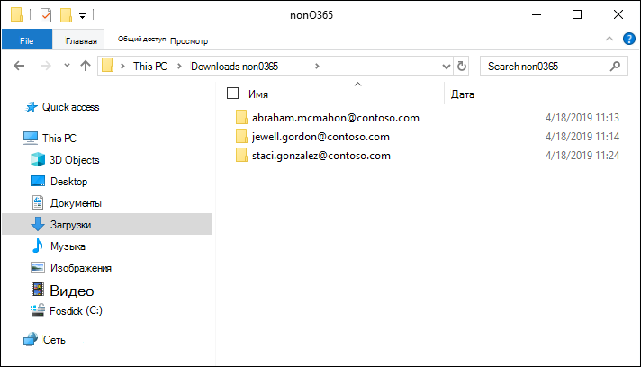
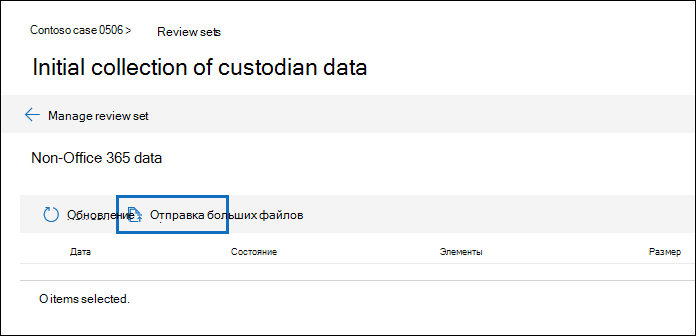
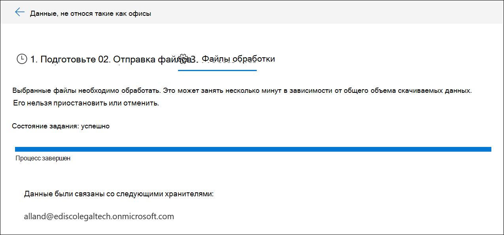

# Загрузка данных, отличных от Microsoft 365, в набор проверкиLoad non-Microsoft 365 data into a review set

Не все документы, которые необходимо проанализировать в Advanced eDiscovery, расположены в Microsoft 365.Not all documents that you need to analyze in Advanced eDiscovery are located in Microsoft 365. С помощью функции импорта данных, отличной от Microsoft 365, в Advanced eDiscovery можно отправлять документы, не размещенные в Microsoft 365, в набор рецензирования.With the non-Microsoft 365 data import feature in Advanced eDiscovery, you can upload documents that aren't located in Microsoft 365 to a review set. В этой статье показано, как перенести документы, не относящиеся к Microsoft 365, в Расширенное обнаружение электронных данных для анализа.This article shows you how to bring your non-Microsoft 365 documents into Advanced eDiscovery for analysis.

## Перед началом работыBefore you begin

Для использования функции отправки, отличной от Microsoft 365, описанной в этой статье, необходимо следующее:Using the upload non-Microsoft 365 feature described in this article requires that you have the following:

- Всем custodians, которым вы хотите сопоставить контент, отличный от Microsoft 365, необходимо назначить соответствующую лицензию.All custodians that you want to associate non-Microsoft 365 content to must be assigned the appropriate license. Дополнительные сведения можно найти в статье Начало [работы с расширенным обнаружением электронных](get-started-with-advanced-ediscovery.md#step-1-verify-and-assign-appropriate-licenses)данных.For more information, see [Get started with Advanced eDiscovery](get-started-with-advanced-ediscovery.md#step-1-verify-and-assign-appropriate-licenses).

- Существующее расширенное дело обнаружения электронных данных.An existing Advanced eDiscovery case.

- Custodians необходимо добавить в дело, прежде чем вы сможете отправить и связать с ними данные, отличные от Microsoft 365.Custodians must be added to the case before you can upload and associate the non-Microsoft 365 data to them.

- В качестве данных, отличных от Microsoft 365, должен использоваться тип файлов, поддерживаемый расширенным обнаружением электронных данных.Non-Microsoft 365 data must be a file type that's supported by Advanced eDiscovery. Для получения дополнительных сведений см. [Поддерживаемые типы файлов в Advanced eDiscovery](supported-filetypes-ediscovery20.md).For more information, see [Supported file types in Advanced eDiscovery](supported-filetypes-ediscovery20.md).

- Все файлы, которые передаются в набор проверки, должны находиться в папках, в которых каждая папка связана с определенным хранитель.All files that are uploaded to a review set must be located in folders, where each folder is associated with a specific custodian. Имена этих папок должны иметь следующий формат имен: *Alias@domainname*.The names for these folders must use the following naming format: *alias@domainname*. Alias@domainname должен быть псевдонимом Microsoft 365 и доменом пользователя.The alias@domainname must be the user's Microsoft 365 alias and domain. Вы можете собирать все alias@domainname папки в корневой папке.You can collect all the alias@domainname folders in a root folder. Корневая папка может содержать только папки alias@domainname.The root folder can only contain the alias@domainname folders. Свободные файлы в корневой папке не поддерживаются.Loose files in the root folder aren't supported.

   Структура папок для данных 365, которые вы хотите отправить, будет выглядеть так, как показано в следующем примере:The folder structure for the non-Microsoft 365 data that you want to upload would be similar to the following example:

   - c:\nonO365\abraham.mcmahon@contoso.comc:\nonO365\abraham.mcmahon@contoso.com
   - c:\nonO365\jewell.gordon@contoso.comc:\nonO365\jewell.gordon@contoso.com
   - c:\nonO365\staci.gonzalez@contoso.comc:\nonO365\staci.gonzalez@contoso.com

   Где abraham.mcmahon@contoso.com, jewell.gordon@contoso.com и staci.gonzalez@contoso.com — это SMTP-адреса custodians в случае.Where abraham.mcmahon@contoso.com, jewell.gordon@contoso.com, and staci.gonzalez@contoso.com are the SMTP addresses of custodians in the case.

   

- Учетная запись, назначенная группе ролей диспетчера обнаружения электронных данных (и добавленная как администратор обнаружения электронных данных).An account that is assigned to the eDiscovery Manager role group (and added as eDiscovery Administrator).

- Средство AzCopy v 8.1, установленное на компьютере, который имеет доступ к структуре папки контента, отличной от Microsoft 365.The AzCopy v8.1 tool installed on a computer that has access to the non-Microsoft 365 content folder structure. Чтобы установить AzCopy, ознакомьтесь [со статьей Transfer Data with a AzCopy v 8.1 в Windows](https://docs.microsoft.com/previous-versions/azure/storage/storage-use-azcopy).To install AzCopy, see [Transfer data with the AzCopy v8.1 on Windows](https://docs.microsoft.com/previous-versions/azure/storage/storage-use-azcopy). Обязательно установите AzCopy в расположении по умолчанию: **% ProgramFiles (x86)% \ Microsoft сдкс\азуре\азкопи**.Be sure to install AzCopy in the default location, which is **%ProgramFiles(x86)%\Microsoft SDKs\Azure\AzCopy**. Необходимо использовать AzCopy v 8.1.You must use AzCopy v8.1. Другие версии AzCopy могут не работать при загрузке данных, отличных от Microsoft 365, в Advanced eDiscovery.Other versions of AzCopy may not work when loading non-Microsoft 365 data in Advanced eDiscovery.

## Отправка контента, отличного от Microsoft 365, в Advanced eDiscoveryUpload non-Microsoft 365 content into Advanced eDiscovery

1. В качестве диспетчера обнаружения электронных данных или администратора обнаружения электронных данных откройте Расширенное обнаружение электронных данных и перейдите к случаю отправки данных не из Microsoft 365.As an eDiscovery Manager or eDiscovery Administrator, open Advanced eDiscovery, and go to the case that the non-Microsoft 365 data will be uploaded to.  

2. Нажмите кнопку **Обзор наборов**, а затем выберите набор рецензирования для отправки данных, отличных от Microsoft 365, в.Click **Review sets**, and then select the review set to upload the non-Microsoft 365 data to.  Если у вас нет набора рецензирования, его можно создать.If you don't have a review set, you can create one. 
 
3. В наборе проверки щелкните элемент **Управление набором проверки**, а затем нажмите кнопку **Просмотреть отправки** на плитке **данных, отличной от Microsoft 365** .In the review set, click **Manage review set**, and then click **View uploads** on the **Non-Microsoft 365 data** tile.

4. Нажмите кнопку **отправить файлы** , чтобы запустить мастер импорта данных.Click **Upload files** to start the data import wizard.

   

   Первый шаг мастера подготавливает безопасное расположение хранилища Azure, предоставленное Майкрософт, для отправки файлов в.The first step in the wizard prepares a secure Microsoft-provided Azure Storage location to upload the files to.  После завершения подготовки кнопка **Далее: Отправка файлов** становится активной.When the preparation is completed, the **Next: Upload files** button becomes active.

   
 
5. Нажмите кнопку **Далее: Отправка файлов**.Click **Next: Upload files**.

6. На странице **Отправка файлов** выполните следующие действия:On the **Upload files** page, do the following:

   

   а)a. В поле **путь к расположению файлов** проверьте или введите расположение корневой папки, в которой хранятся данные, не относящиеся к Microsoft 365, которые требуется отправить.In the **Path to location of files** box, verify or type the location of the root folder where you've stored the non-Microsoft 365 data you want to upload. Например, для расположения примеров файлов, показанных в **разделе до начала**работы, введите **%USERPROFILE\Downloads\nonO365**.For example, for the location of the example files shown in the **Before you begin section**, you would type **%USERPROFILE\Downloads\nonO365**. Правильное расположение позволяет убедиться, что команда AzCopy, отображаемая в поле под путем, правильно обновлена.Providing the correct location ensures the AzCopy command displayed in box under the path is properly updated.

   б)b. Нажмите кнопку **Копировать в буфер обмена** , чтобы скопировать команду, которая отображается в поле.Click **Copy to clipboard** to copy the command that is displayed in the box.

7. Запустите командную строку Windows, вставьте команду, скопированную на предыдущем шаге, а затем нажмите клавишу **Ввод** , чтобы запустить команду AzCopy.Start a Windows command prompt, paste the command that you copied in the previous step, and then press **Enter** to start the AzCopy command.  После запуска команды файлы, не относящиеся к Microsoft 365, будут отправлены в хранилище Azure, подготовленное на шаге 4.After you start the command, the non-Microsoft 365 files will be uploaded to the Azure Storage location that was prepared in step 4.

   

   > [!NOTE]
   > Как было сказано ранее, для успешного использования команды, которая указана на странице " **Отправка файлов** ", необходимо использовать AzCopy v 8.1.As previously stated, you must use AzCopy v8.1 to successfully use the command that's provided on the **Upload files** page. Если предоставленная команда AzCopy не удалась, обратитесь к разделу [Устранение неполадок AzCopy в Advanced eDiscovery](troubleshooting-azcopy.md).If the supplied AzCopy command fails, please see [Troubleshoot AzCopy in Advanced eDiscovery](troubleshooting-azcopy.md).

8. Вернитесь в центр безопасности & соответствия требованиям и нажмите кнопку **Далее: обработка файлов** в мастере.Go back to the Security & Compliance Center, and click **Next: Process files** in the wizard.  Это инициирует обработку, извлечение текста и индексирование файлов, не относящихся к Microsoft 365, которые были отправлены в место хранения Azure.This initiates processing, text extraction, and indexing of the non-Microsoft 365 files that were uploaded to the Azure Storage location.  

9. Отслеживание хода обработки файлов на странице " **файлы процесса** " или на вкладке " **задания** " путем просмотра задания с именем " **Добавление не-Microsoft 365 данных в набор проверки**".Track the progress of processing the files on the **Process files** page or on the **Jobs** tab by viewing a job named **Adding non-Microsoft 365 data to a review set**.  После завершения задания новые файлы будут доступны в наборе проверки.After the job is finished, the new files will be available in the review set.

   

10. После завершения обработки можно закрыть мастер.After the processing is finished, you can close the wizard.
