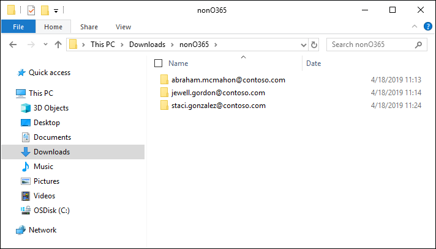

# Загрузка данных, не относяхся к Microsoft 365, в набор для проверки

Не все документы, которые необходимо проанализировать в Advanced eDiscovery, расположены в Microsoft 365. С помощью функции импорта данных, не от microsoft 365 в Advanced eDiscovery, вы можете отправить документы, не расположенные в Microsoft 365, в набор для проверки. В этой статье показано, как внести документы, не в microsoft 365, в Advanced eDiscovery для анализа.

## Требования к отправке содержимого, не относяного к Office 365

Для использования функции отправки, которая не является microsoft 365, описанной в этой статье, требуется следующее:

- Всем хранителям, которые вы хотите связать контент, не относячий к Microsoft 365, должна быть назначена соответствующая лицензия. Дополнительные сведения [см. в поддомене "Начало работы с Advanced eDiscovery".](get-started-with-advanced-ediscovery.md#step-1-verify-and-assign-appropriate-licenses)

- Существующее дело Advanced eDiscovery.

- Хранителей необходимо добавить в дело, прежде чем вы сможете отправить и связать с ними данные, не относячие к Microsoft 365.

- Данные, не относячие к Microsoft 365, должны быть типом файлов, поддерживаемым Advanced eDiscovery. Дополнительные сведения [см. в поддерживаемых типах файлов в Advanced eDiscovery.](supported-filetypes-ediscovery20.md)

- Все файлы, отложенные в набор для проверки, должны быть расположены в папках, где каждая папка связана с определенным хранителями. Имена этих папок должны иметь следующий формат имен: *alias@domainname*. В alias@domainname должен быть псевдоним и домен Microsoft 365 пользователя. Вы можете собрать все alias@domainname папки в корневой папке. Корневая папка может содержать только alias@domainname папок. Свободные файлы в корневой папке не поддерживаются.

   Структура папок для данных, не относяхся к Microsoft 365, которые вы хотите отправить, будет примерно такой же, как в следующем примере:

   - c:\nonO365\abraham.mcmahon@contoso.com
   - c:\nonO365\jewell.gordon@contoso.com
   - c:\nonO365\staci.gonzalez@contoso.com

   Где abraham.mcmahon@contoso.com, jewell.gordon@contoso.com и staci.gonzalez@contoso.com smTP-адреса хранителей в данном случае.

   

- Учетная запись, назначенная группе ролей "Руководитель eDiscovery" (и добавленная в качестве администратора для eDiscovery).

- Средство AzCopy 8.1, установленное на компьютере, который имеет доступ к структуре папок контента, не относячеству к Microsoft 365. Чтобы установить AzCopy, см. сведения о передаче [данных с AzCopy версии 8.1 в Windows.](https://docs.microsoft.com/previous-versions/azure/storage/storage-use-azcopy) Обязательно установите AzCopy в расположение по умолчанию% **ProgramFiles(x86)%\Microsoft SDKs\Azure\AzCopy.** Необходимо использовать AzCopy 8.1. Другие версии AzCopy могут не работать при загрузке данных, не влияющих на Microsoft 365, в Advanced eDiscovery.

## Отправка содержимого, не относяого к Microsoft 365, в Advanced eDiscovery

1. В качестве менеджера по обнаружению электронных данных или администратора eDiscovery откройте Advanced eDiscovery и перейдите к делу, в которое будут загружены данные, не относя такие как Microsoft 365.  

2. Щелкните **наборы для** проверки и выберите набор для отправки данных, не вложенных в Microsoft 365.  Если у вас нет набора для проверки, вы можете создать его. 
 
3. В наборе для проверки щелкните  "Управление набором для проверки", а затем выберите "Просмотр отправляемых данных" на плитке данных, не относящой к Microsoft **365.**

4. Нажмите **кнопку "Отправить файлы",** чтобы запустить мастер импорта данных.

   

   На первом этапе мастера подготавливается безопасное хранилище Azure, предоставленное Корпорацией Майкрософт, для отправки файлов.  После завершения подготовки активна кнопка **"Далее:** отправка файлов".

   
 
5. Нажмите **кнопку "Далее": отправка файлов.**

6. На странице **"Отправка файлов"** сделайте следующее:

   

   а. В поле **"Путь** к расположению файлов" проверьте или введите расположение корневой папки, в которой сохранены данные, не относявшиеся к Microsoft 365, которые вы хотите отправить. Например, для расположения примеров файлов, показанных в разделе "Перед началом **работы",** необходимо ввести **%USERPROFILE\Downloads\nonO365.** Правильное расположение обеспечивает правильное обновление команды AzCopy, отображаемой в поле под путем.

   б. Щелкните **"Копировать" в буфер** обмена, чтобы скопировать команду, отображаемую в поле.

7. Запустите командную подсказку Windows, введите команду, скопированную  на предыдущем шаге, а затем нажмите ввод, чтобы запустить команду AzCopy.  После запуска команды файлы, не вложенные в Microsoft 365, будут загружены в хранилище Azure, подготовленное на шаге 4.

   

   > [!NOTE]
   > Как было сказано ранее, для успешного использования команды, предоставленной на странице  "Отправка файлов", необходимо использовать AzCopy 8.1. Если сбой предоставленной команды AzCopy, см. "Устранение неполадок [AzCopy в Advanced eDiscovery".](troubleshooting-azcopy.md)

8. Снова в Центр безопасности & соответствия требованиям и нажмите кнопку **"Далее: обработка файлов** в мастере".  Это инициирует обработку, извлечение текста и индексацию файлов, не вложенных в Microsoft 365, которые были загружены в хранилище Azure.  

9. Отслеживайте ход обработки файлов  на странице "Файлы процесса" или на вкладке **"Задания",** просмотрев задание с именем "Добавление данных, не относяющихся к Microsoft **365",** в набор для проверки.  После завершения задания новые файлы будут доступны в наборе для проверки.

   

10. После завершения обработки можно закрыть мастер.
