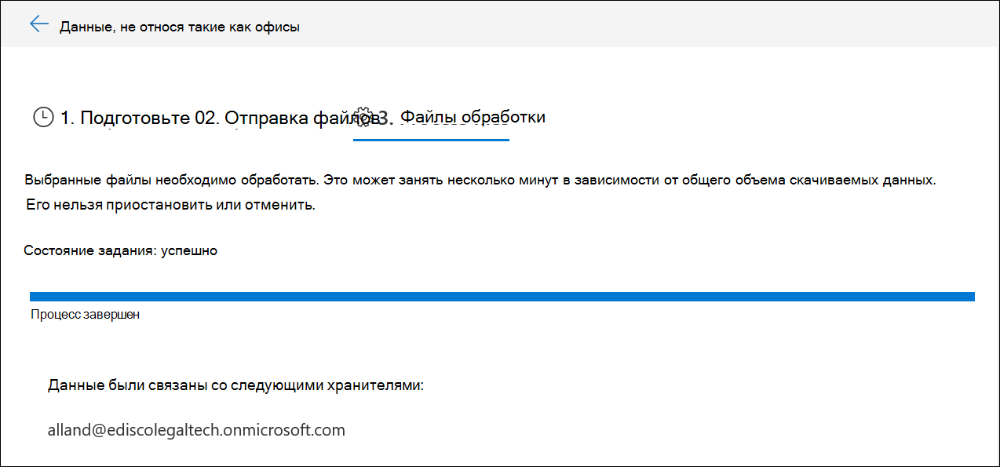

# Загрузка данных, отличных от Microsoft 365, в свидетельствоLoad non-Microsoft 365 data into evidence

Не все документы, которые могут потребоваться анализировать при расследовании данных, будут размещены в Microsoft 365.Not all documents that you may need to analyze in a data investigation will be located in Microsoft 365. С помощью функции импорта содержимого, отличной от Microsoft 365, вы можете отправлять в доказательства документы, которые не находятся в Microsoft 365, поэтому их можно проанализировать при расследовании данных.With the Non-Microsoft 365 content import feature you can upload documents that don't live in Microsoft 365 into evidence so they can be analyzed in a data investigation.

## ПодготовкаBefore you begin

Для использования функции отправки, отличной от Microsoft 365, как описано в этой процедуре, необходимо следующее:Using the upload Non-Microsoft 365 feature as described in this procedure requires that you have:

- Подписка на Microsoft 365 или Office 365 в.A Microsoft 365 or Office 365 E5 subscription.

- Все интересующие вас люди, на которые не входит Корпорация Майкрософт 365, должны содержать соответствующую лицензию на надстройку, которая составляет от нуля до нуля.All people of interest whose non-Microsoft 365 content will be uploaded must have the appropriate E5 or E5 add-on license.

- Существующее дело обнаружения электронных данных.An existing eDiscovery case.

- Все файлы для отправки собраны в папки, для которых в одной папке есть папка хранитель, а имя папки в этом формате *Alias@domainname*.All the files for uploading gathered into folders where there is one folder per custodian and the folders' name is in this format *alias@domainname*. *Alias@domainname* должен быть псевдонимом пользователя и доменом.The *alias@domainname* must be user's alias and domain. Вы можете собрать все *Alias@domainname* папки в корневую папку.You can collect all the *alias@domainname* folders into a root folder. Корневая папка может содержать только папки *Alias@domainname* , но в корневой папке не должно быть свободных файлов.The root folder can only contain the *alias@domainname* folders, there must be no loose files in the root folder.

- Учетная запись, которая является диспетчером eDiscovery или Microsoft Azure Storage Tools, установленных на компьютере, который имеет доступ к структуре папки контента, отличной от Microsoft 365.An account that is either an eDiscovery Manager or eDiscovery Administrator Microsoft Azure Storage Tools installed on a computer that has access to the non-Microsoft 365 content folder structure.

- Установите AzCopy, что можно сделать, выполнив указанные ниже действия.https://docs.microsoft.com/azure/storage/common/storage-use-azcopyInstall AzCopy, which you can do from here: https://docs.microsoft.com/azure/storage/common/storage-use-azcopy

## Отправка контента, отличного от Microsoft 365, во временный анализ данныхUpload non-Microsoft 365 content in to a data investigation

1. Откройте исследование **данных** и переходите к исследованию того, что данные, не относящиеся к Microsoft 365, будут отправлены в.Open **Data Investigations** and go to the investigation that the non-Microsoft 365 data will be uploaded to.  Перейдите на вкладку **свидетельство** , а затем выберите набор свидетельств, в который вы хотите загрузить данные.Click the **Evidence** tab, then select the evidence set you wish to load the data to.  Если вы еще не создали набор свидетельств, вы можете сделать это сейчас.If you have not already created an evidence set, you can do so now.  Наконец, щелкните **Управление свидетельством** , а затем **Просмотр отправок** в разделе данныеFinally, click **Manage evidence** then **View uploads** in the data section

2. Нажмите кнопку **отправить файлы** , чтобы запустить мастер импорта данных, не относящийся к Microsoft 365.Click the **Upload files** button to start the Non-Microsoft 365 data import wizard.

3. На первом этапе мастера просто подготавливается безопасный большой двоичный объект Azure для отправляемых файлов.The first step in the wizard simply prepares a secure Azure blob for the files to be uploaded.  После завершения подготовки нажмите кнопку " **Далее: Отправка файлов** ".After the preparation is complete, click the **Next: Upload files** button.

 
4. На шаге **Отправка файлов** укажите **путь к расположению файлов**, где находятся данные, не относящиеся к Microsoft 365, которые планируется импортировать.In the **Upload files** step, specify the **Path to location of files**, this is where the Non-Microsoft 365 data you plan on importing is located.  Задание правильного расположения гарантирует, что команда AzCopy будет правильно обновлена.Setting the correct location ensures the AzCopy command is properly updated.

> [!NOTE]
> Если вы еще не установили AzCopy, вы можете сделать это следующим образом:https://docs.microsoft.com/azure/storage/common/storage-use-azcopyIf you have not already installed AzCopy, you can do this from here: https://docs.microsoft.com/azure/storage/common/storage-use-azcopy

5. Скопируйте предопределенную команду, щелкнув ссылку **Копировать в буфер обмена** .Copy the predefined command by clicking the **Copy to clipboard** link. Запустите командную строку Windows, вставьте команду и нажмите клавишу ВВОД.Start a windows command prompt, paste the command and press enter.  Файлы будут отправлены в безопасное хранилище BLOB-объектов Azure для следующего этапа.The files will be uploaded to the secure Azure blob storage for the next step.

6. Наконец, вернитесь к & соответствия требованиям безопасности и нажмите кнопку **Далее: обработка файлов** .Finally, return back to the Security & Compliance and click the **Next: Process files** button.  Это инициирует обработку, извлечение текста и индексацию отправленных файлов.This initiates processing, text extraction, and indexing of the uploaded files.  Вы можете отслеживать ход обработки здесь или на вкладке **задания** .  После завершения новые файлы будут доступны в наборе свидетельств.You can track the progress of processing here or in the **Jobs** tab.  Once completed, the new files are available in the evidence set.  После завершения обработки можно закрыть мастер.After processing is complete, you can dismiss the wizard.

