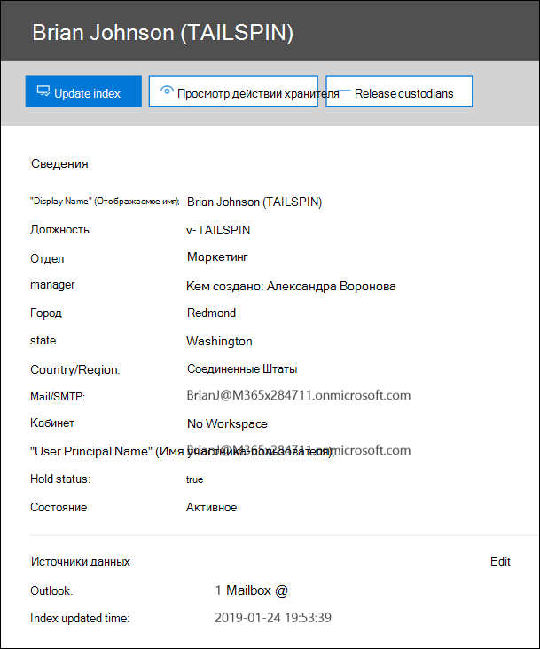

# Управление custodians в расширенном случае обнаружения электронных данныхManage custodians in an Advanced eDiscovery case

Страница custodians на вкладке **источники** в расширенном случае обнаружения электронных данных содержит список всех custodians, которые были добавлены в обращение.The Custodians page on the **Sources** tab in an Advanced eDiscovery case contains a list of all custodians that have been added to the case. Когда вы добавите custodians в дело, сведения о каждом из них автоматически собираются из Azure Active Directory и доступны для просмотра в Advanced eDiscovery.After you add custodians to a case, details about each custodian are automatically collected from Azure Active Directory and are viewable in Advanced eDiscovery.

## Просмотр сведений о хранительView custodian details

Чтобы просмотреть сведения о хранитель, щелкните хранитель в списке на вкладке **custodians** . Откроется всплывающая страница со следующими сведениями о хранитель:To view the details about a custodian, click the custodian from the list on the **Custodians** tab. A flyout page is displayed and contains the following information about the custodian:

- Контактные данныеContact information

  - **Display Name** — имя, отображаемое в адресной книге для хранитель.**Display Name** - The name displayed in the address book for the custodian. Обычно это сочетание имени, инициала и фамилии хранитель.This is usually the combination of the custodian's first name, middle initial, and last name.
  
   - **Mail/SMTP** — основной SMTP-адрес для хранитель, например brianj@contoso.onmicrosoft.com.**Mail/SMTP** - The primary SMTP address for the custodian, for example, brianj@contoso.onmicrosoft.com. Кроме того, приводятся имя участника-пользователя хранитель (UPN).The custodian's user principal name (UPN) is also listed.

  - **Title** — название задания хранитель.**Title** - The custodian's job title.

  - **Department** — имя отдела, в котором работает хранитель.**Department** - The name for the department in which the custodian works.

  - **Руководитель** — менеджер хранитель.**Manager** - The custodian's manager. Указанный руководитель получит все сообщения о эскалации для этого хранитель.The designated manager will receive any escalation communications for this custodian.
  
- Сведения о расположенииLocation information

  - **City** — город, в котором располагается хранитель.**City** - The city in which the custodian is located.

  - **State** — область или край в адресе хранитель.**State** - The state or province in the custodian's address.

  - **Страна** или регион — страна или регион, где находится хранитель.**Country/Region** - The country/region where the custodian is located.

  - **Office** — расположение комнаты бизнеса в хранитель.**Office** - The office location in the custodian's place of business.

- Сведения о делахCase information

  - **Состояние удержания** — указывает, был ли хранитель включен в удержание.**Hold status** - Indicates if the custodian has been placed on hold. 

  - **Состояние связи**: указывает, было ли хранитель было создано уведомление об удержании.**Communication status**: Indicates if the custodian has been issued a hold notice. Если хранитель было создано уведомление, это значение этого свойства **публикуется**.If the custodian has been issued a notice, this value of this property is **Published**. Если хранитель не выдал уведомление, состояние **отменяется**.If the custodian has not been issued a notice, the status is **Un-published**. 

  - **Status (состояние** ) — состояние хранитель в случае.**Status** - The status of the custodian within the case. Состояние **Active** указывает на то, что хранитель является частью дела.A status of **Active** indicates that the custodian is part of the case. Если хранитель выпускается из случая, состояние изменится на " **выпущен**".If a custodian is released from a case, the status is changed to **Released**. 

- Источники данных и сведения об индексированииData sources and indexing information

    - **Источники данных** — отображает количество и тип источников данных (почтовые ящики, сайты и команды), которые связаны с хранитель и являются частью этого случая.**Data sources** - Shows the count and type of data sources (mailboxes, sites, and Teams) that are associated with the custodian and are part of the case.

    - **Обновлять время индексирования** — указывает время и дату последнего запуска задания расширенного индексирования.**Index updated time** - Indicates the time and date for when the advanced indexing job was last triggered. Это свойство также указывает, когда в данный момент выполняется расширенный процесс индексирования.This property will also indicate when the advanced indexing process is currently in progress.

## Изменение хранительEdit a custodian

По мере последовательного выполнения можно обнаружить, что могут быть дополнительные источники данных, относящиеся к определенному хранитель & вашем случае.As your case progresses, you may discover that there may be additional data sources relevant to a specific custodian & your case. В других сценариях может потребоваться удалить некоторые источники данных, которые были проверены и были признаны несвязанными.In other scenarios, you may want to remove certain data sources that have been reviewed and deemed as not relevant.

Обновление источников данных, связанных с хранитель:To update the data sources that are associated with a custodian:

1. Перейдите на **Обнаружение электронных данных > Advanced eDiscovery** и откройте обращение.Go to  **eDiscovery > Advanced eDiscovery** and open the case.
  
2. Перейдите на вкладку **источники** .Click the **Sources** tab.
  
3. На странице **custodians** выберите хранитель в списке и нажмите кнопку **изменить** на всплывающей странице.On the **Custodians** page, select a custodian from the list and click **Edit** on the flyout page.

    
  
4. Нажмите кнопку **Выбор источников данных** , чтобы изменить параметры почтового ящика Exchange и учетной записи OneDrive хранитель, и выберите пункт **выбрать источники данных**.Click **Choose data sources** tab to change the settings for the custodian's Exchange mailbox and OneDrive account, click **Choose data sources**.
  
5. Перейдите на вкладку **выберите Дополнительные источники данных** , чтобы добавить или удалить Teams, SharePoint или почтовые ящики Exchange, связанные с хранитель.Click the **Select additional data sources** tab to add or remove Teams, SharePoint, or Exchange mailboxes associated with the custodian. 

    Для получения дополнительных сведений об источниках данных, связанных с хранитель, обратитесь к разделу "шаг 3: связывание дополнительных источников данных с хранитель" в разделе [Add custodians to Case](add-custodians-to-case.md#step-3-associate-additional-data-sources-to-a-custodian).For more information about data sources associated with a custodian, see "Step 3: Associate additional data sources to a custodian" in [Add custodians to a case](add-custodians-to-case.md#step-3-associate-additional-data-sources-to-a-custodian). 
  
6. Нажмите кнопку **поместить кустодиал удержания** , чтобы включить или отключить удержание для хранитель.Click **Place custodial holds** to enable or disable the hold for the custodian.

## Повторное индексирование данных хранительRe-index custodian data

В большинстве рабочих процессов обнаружения электронных данных для юридического расследования подмножество данных хранитель ищется после добавления хранитель в юридическое обращение.In most eDiscovery workflows for legal investigations, a subset of a custodian's data is searched after the custodian is added to a legal case. Из-за очень большого размера файлов или возможных повреждений данных некоторые элементы в источниках данных, связанных с хранитель, могут быть частично индексированы.Because of very large file sizes or possible data corruption, some items in the data sources associated with a custodian may be partially indexed. С помощью [расширенной функции индексирования](indexing-custodian-data.md) расширенного обнаружения электронных данных большинство частично индексированных элементов можно автоматически исправить путем повторного индексирования этих элементов по запросу.Using the [advanced indexing](indexing-custodian-data.md) capability in the Advanced eDiscovery, most partially indexed items can be automatically remediated by re-indexing these items on demand.

Когда хранитель добавляется к случаю, данные, расположенные в источниках данных, связанных с хранитель, автоматически переиндексируются автоматически (с помощью расширенного процесса индексирования).When a custodian is added to a case, the data located in the data sources associated with the custodian is automatically re-indexed (by the advanced indexing process). Это означает, что вы можете оставить данные на месте, а не загружать и исправлять их, а затем искать их в автономном режиме.This means you can leave the data in-place instead of having to download and remediate it and then search it offline). Однако во время жизненного цикла для юридического случая новые источники данных могут быть связаны с хранитель.However, during the lifecycle of a legal case new data sources might be associated with a custodian. В этом случае вы можете повторно индексировать данные хранитель, повторно выполнив расширенный процесс индексирования, чтобы исправить все элементы с частичным индексированием и обновить индекс для данных хранитель.In this case, you can re-index the custodian's data by re-running the advanced indexing process to remediate any partially indexed items and update the index for the custodian's data.

Чтобы запустить процесс повторного индексирования для частично индексированных элементов:To trigger the re-indexing process to address partially indexed items:

1. Перейдите на **Обнаружение электронных данных > Advanced eDiscovery** и откройте обращение.Go to  **eDiscovery > Advanced eDiscovery** and open the case.

2. Перейдите на вкладку **источники** .Click the **Sources** tab.

3. На странице **custodians** выберите хранитель, данные которого необходимо переиндексировать.On the **Custodians** page, select a custodian whose data must be reindexed.

4. На всплывающей странице щелкните **обновить индекс**.On the flyout page, click **Update index**.

   Отображается диалоговое окно с сообщением о том, что было создано задание индексирования.A dialog is displayed saying the index job has been created.

Повторное индексирование данных хранитель — это длительный процесс; соответствующее созданное задание называется **повторная индексация данных хранитель**.Re-indexing custodian data is a long-running process; the corresponding job that's created is named **Re-indexing custodian data**. Отслеживать ход выполнения можно на вкладке " **задания** " или на вкладке " **custodians** ", отслеживая состояние в столбце " **состояние задания индексирования** ".You can track the progress on the **Jobs** tab or on the **Custodians** tab by monitoring the status in the **Indexing job status** column.

Дополнительные сведения см. в указанных ниже статьях.For more information, see:

- [Работа с ошибками обработкиWork with processing errors](processing-data-for-case.md)

- [Управление заданиямиManage jobs](managing-jobs-ediscovery20.md)

## Выпуск хранитель из обращенияRelease a custodian from a case

Хранитель размещается в ситуациях, когда обращение закрывается, хранитель больше не считается обязательством по сохранению содержимого для случая или когда хранитель считается нерелевантным для случая.A custodian is released in situations where a case is closed, the custodian is no longer under obligation to preserve content for a case, or when the custodian is deemed to no longer be relevant to the case. 

Если вы выпустите хранитель после публикации уведомления об удержании, в Хранитель будет отправлено уведомление о выпуске.If you release a custodian after a hold notice was published, a release notice will be sent to the custodian. Кроме того, удаляются все удержания, размещенные в источниках данных, связанных с хранитель.Additionally, any holds placed on data sources that were associated with the custodian are removed. Если хранитель размещается на *удержании в автоматическом режиме*, где они не получали уведомления о юридическом удержании, уведомление о выпуске не будет отправлено, но все удержания, размещенные на источниках данных, связанных с этим хранитель, удаляются.If the custodian was placed on a *silent hold*, where they weren't issued any legal hold notifications, a release notice will not be sent but any holds placed on data sources that were associated with that custodian are removed.

Чтобы освободить хранитель, выполните указанные ниже действия.To release a custodian: 

1. Перейдите на **Обнаружение электронных данных > Advanced eDiscovery** и откройте обращение.Go to  **eDiscovery > Advanced eDiscovery** and open the case.

2. Перейдите на вкладку **источники** .Click the **Sources** tab.

3. На странице **custodians** , а затем выберите хранитель, который выпускается из этого случая.On the **Custodians** page, and then select the custodian who is being released from the case.

4. На всплывающей странице нажмите кнопку **Release хранитель**.On the flyout page, click **Release custodian**.

   Будет выведена страница с предупреждением о том, что если удержание помещается в источник данных, связанный с хранитель, то удержание будет удалено и все остальные удержания, связанные с другими дополнительными случаями обнаружения электронных данных, будут по-прежнему применяться.A warning page is displayed explaining that if a hold is placed on a data source associated with the custodian, the hold will be removed, and that any other hold associated with a different Advanced eDiscovery case will still apply. Включает другие типы сохранения и хранения (например, политика хранения Microsoft 365).That includes other types of preservation and retention features (such as a Microsoft 365 retention policy).

5. Нажмите кнопку **Да** , чтобы подтвердить, что вы хотите освободить хранитель.Click **Yes** to confirm that you want to release the custodian. 

    Для этого пользователя на вкладке **custodians** задано значение " **Пуск** ", а **состояние удержания** для всплывающей страницы изменяется на " **false**".The status for this user on the **Custodians** tab is set to **Released** and the **Hold status** on the flyout page is changed to **False**. 

> [!NOTE]
> Хранитель может быть одновременно задействована в нескольких юридических случаях.A custodian might be simultaneously involved in several legal cases. При отпускании хранитель из случая удержания и уведомления на другие вопросы не затрагиваются.When a custodian is released from a case, the holds and notifications across other matters won't be impacted.

## Массовое изменение custodiansBulk-edit custodians

Можно использовать пакетный редактор для одновременного редактирования нескольких custodians.You can use the bulk editor to edit multiple custodians as the same time. Для этого достаточно выбрать два или более custodians на вкладке **custodians** , чтобы отобразить Пакетный редактор, а затем выбрать одну из задач.To do this, just select two or more custodians on the **Custodians** tab to display the bulk editor and then click one of tasks.

