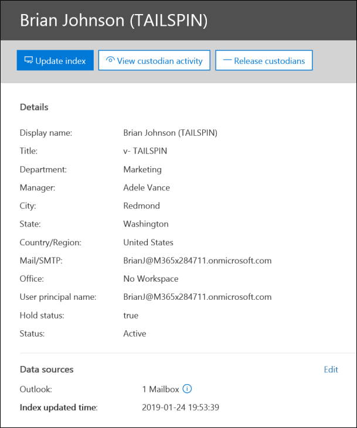

# Управление хранителями в случае Advanced eDiscovery

Страница Custodians на вкладке **"Источники"** в деле Advanced eDiscovery содержит список всех хранителей, добавленных в дело. После добавления хранителей в дело сведения о каждом хранителях автоматически собираются из Azure Active Directory и становятся просматриваемыми в Advanced eDiscovery.

## Просмотр сведений о хранителях

Чтобы просмотреть сведения о хранителях, щелкните его в списке на вкладке **Custodians.** Отобразится эта выдавляемая страница, содержаная следующие сведения об хранителе:

- Контактные данные

  - **Отображаемого** имени — имя, отображаемого в адресной книге для хранителя. Обычно это сочетание имени, от первой и фамилии хранителя.
  
   - **Mail/SMTP** — основной SMTP-адрес для хранителя, например, brianj@contoso.onmicrosoft.com. Кроме того, в списке указано имя основного пользователя (UPN) хранителя.

  - **Должность** — должность хранителя.

  - **Отдел** — название отдела, в котором работает хранителя.

  - **Руководитель** — руководитель хранителя. Назначенный руководитель получит все сообщения об эскалации для этого хранителя.
  
- Сведения о расположении

  - **Город** — город, в котором находится хранители.

  - **Область** — область или край в адресе хранителя.

  - **Страна или регион** — страна или регион, где находится хранитель.

  - **Office** — расположение офиса в месте работы хранителя.

- Сведения о делах

  - **Состояние удержания** — указывает, помещен ли хранител на удержание. 

  - **Состояние связи:** указывает, выдано ли хранителям уведомление об удержании. Если хранителям выдано уведомление, это значение этого свойства **публикуется.** Если хранителям не было выдано уведомление, состояние не **публикуется.** 

  - **Состояние** — состояние хранителя в рамках дела. Состояние **"Активный"** указывает, что хранители являются частью дела. Если хранители отпущены из дела, состояние меняется на **"Освобождено".** 

- Источники данных и сведения об индексации

    - **Источники данных** — показывает количество и тип источников данных (почтовых ящиков, сайтов и Teams), связанных с хранителями и входящих в дело.

    - **Время обновления индекса** — указывает время и дату последнего запуска задания расширенных индексации. Это свойство также указывает, когда в данный момент идет расширенный процесс индексации.

## Изменение хранителя

По мере продвижения дела вы можете обнаружить, что могут быть дополнительные источники данных, релевантные для конкретного хранителя & вашем случае. В других сценариях может потребоваться удалить определенные источники данных, которые были рассмотрены и признаны не релевантно.

Обновление источников данных, связанных с хранителями:

1. Перейдите  **в > Advanced eDiscovery** и откройте дело.
  
2. Перейдите на **вкладку "Источники".**
  
3. На странице **Custodians** выберите хранителя в списке и нажмите кнопку **"Изменить"** на странице".

    
  
4. Щелкните **вкладку "Выбор источников** данных", чтобы изменить параметры почтового ящика Exchange и учетной записи OneDrive хранителя, а затем **выберите "Выбор источников данных".**
  
5. Щелкните **вкладку "Выбор дополнительных источников** данных", чтобы добавить или удалить почтовые ящики Teams, SharePoint или Exchange, связанные с хранителями. 

    Дополнительные сведения об источниках данных, связанных с хранителями, см. в подстройки ["Добавление хранителей к делу".](add-custodians-to-case.md) 
  
6. Щелкните **"Разместить хранение",** чтобы включить или отключить удержание для хранителя.

## Переиндексация данных хранителя

В большинстве процессов eDiscovery для юридических расследований подмножество данных хранителя будет искаться после того, как он будет добавлен в судебный процесс. Из-за очень большого размера файла или возможного повреждения данных некоторые элементы в источниках данных, связанных с хранителями, могут частично индексироваться. Используя [расширенные](indexing-custodian-data.md) возможности индексации в Advanced eDiscovery, большинство частично индексированные элементы могут быть автоматически исправлены путем повторной индексации этих элементов по запросу.

При добавлении хранителя в дело данные, расположенные в источниках данных, связанных с хранителями, автоматически переиндексируются (в процессе дополнительного индексации). Это означает, что вы можете оставить данные на месте, а не загружать и устранять их, а затем искать их в автономном режиме. Однако в течение жизненного цикла судебного дела новые источники данных могут быть связаны с хранителями. В этом случае можно переиндексировать данные хранителя, повторно задав расширенный процесс индексации, чтобы исправление всех частично индексных элементов и обновление индекса для данных хранителя.

Чтобы активировать процесс переиндексации для частично индексации элементов:

1. Перейдите  **в > Advanced eDiscovery** и откройте дело.

2. Перейдите на **вкладку "Источники".**

3. На странице **Custodians** выберите хранителя, данные которого необходимо переиндексовать.

4. На странице "Flyout" щелкните **"Обновить индекс".**

   Отобразилось диалоговое окно со словами, что задание индекса создано.

Переиндексация данных хранителя является длительным процессом; созданное задание называется **Переиндексация данных хранителя.** Вы можете отслеживать ход выполнения на вкладке **"Задания"** или на вкладке **Custodians,** отслеживая состояние в столбце "Состояние **задания индексации".**

Дополнительные сведения см. в указанных ниже статьях.

- [Работа с ошибками обработки](processing-data-for-case.md)

- [Управление заданиями](managing-jobs-ediscovery20.md)

## Освобождение хранителя из дела

Хранители отпущены в тех случаях, когда дело закрыто, он больше не обязан сохранять содержимое для дела или если он больше не относится к делу. 

Если вы освобождаете хранителя после публикации уведомления об удержании, ему будет отправлено уведомление о выпуске. Кроме того, удаляются все хранение источников данных, связанных с хранителями. Если хранителя поместили на удержание в тихом режиме, где ему не выданы уведомления о удержании по юридическим вопросам, уведомление о выпуске не отправляется, но все удержания, размещенные на источниках данных, связанных с этим хранителями, удаляются.

Освобождение хранителя: 

1. Перейдите  **в > Advanced eDiscovery** и откройте дело.

2. Перейдите на **вкладку "Источники".**

3. На странице **Custodians** выберите хранителя, который будет освобожден из дела.

4. На странице "Flyout" щелкните **"Освободить хранителя".**

   Отображается страница предупреждения с объяснением того, что при удержании источника данных, связанного с хранитером, удержание будет удалено, а любое другое удержание, связанное с другим делом Advanced eDiscovery, будет по-прежнему применяться. К ним относятся другие типы функций сохранения и хранения (например, политика хранения Microsoft 365).

5. Нажмите **кнопку** "Да", чтобы подтвердить освобождение хранителя. 

    Для этого пользователя на вкладке **Custodians** установлено  состояние "Освобождено", а состояние удержания на странице "Flyout" изменено на **False.**  

> [!NOTE]
> Хранители могут быть одновременно вовлечены в несколько судебных дел. Когда хранители отпущены из дела, на хранение и уведомления по другим вопросам это не повлияет.

## Массовое редактирование хранителей

Вы можете использовать редактор для массовой рассылки нескольких хранителей одновременно. Для этого просто выберите двух или более хранителей на вкладке **Custodians,** чтобы отобразить редактор массовой рассылки, а затем щелкните одну из задач.

