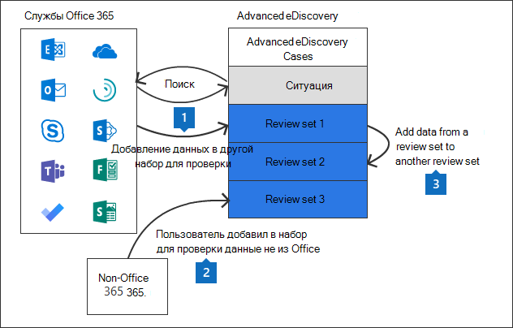

# Управление наборами обзоров в Advanced eDiscovery

Наборы для проверки - это статическое множество документов, в котором можно анализировать, запрашивать, просматривать, расставлять теги и экспортировать данные, касающиеся рассматриваемого дела. Дополнительные сведения о выполнении этих задач см. в

- [Анализ данных в наборе обзоров](analyzing-data-in-review-set.md)

- [Запрос данных в наборе для проверки](review-set-search.md)

- [Просмотр документов в наборе для проверки](view-documents-in-review-set.md)

- [Добавление тегов к документам в наборе для проверки](tagging-documents.md)

- [Экспорт данных дела](exporting-data-ediscover20.md)

## Создание набора отзывов

Наборы обзоров можно создать на **вкладке Наборы обзоров,** щелкнув **+ Добавить набор отзывов.**

На странице **флажок Набор** дополнительных обзоров введите имя для набора отзывов и нажмите **кнопку Сохранить**. Новый набор отзывов отображается в списке на **вкладке Наборы обзоров.**

Существует три различных способа добавления данных в набор обзоров в Advanced eDiscovery случае.

1. [Добавление результатов поиска в набор для проверки](add-data-to-review-set.md)

2. [Загрузка данных, не относящихся к Microsoft 365, в набор для проверки](load-non-Office-365-data-into-a-review-set.md)

3. [Добавление данных из одного набора для проверки в другой набор для проверки](add-data-to-review-set-from-another-review-set.md)
