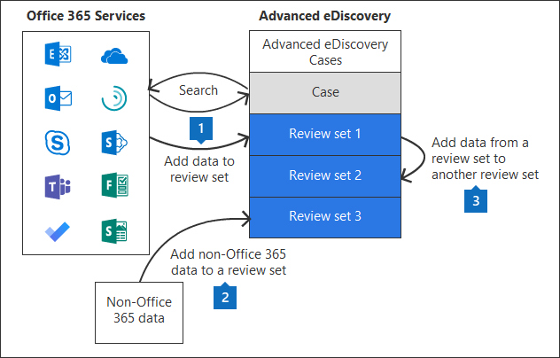

# Управление наборами проверки в Advanced eDiscoveryManage review sets in Advanced eDiscovery

Наборы для проверки — это статический набор документов, в котором можно анализировать, запрашивать, просматривать, помечать и экспортировать данные в случае.Review sets are a static set of documents where you can analyze, query, view, tag, and export data in a case. Дополнительные сведения о выполнении этих задач см. в указанных здесь.For more information about performing these tasks, see:

- [Анализ данных в наборе для проверкиAnalyze data in a review set](analyzing-data-in-review-set.md)

- [Запрос данных в наборе для проверкиQuery the data in a review set](review-set-search.md)

- [Просмотр документов в наборе для проверкиView documents in a review set](view-documents-in-review-set.md)

- [Добавление тегов к документам в наборе для проверкиTag documents in a review set](tagging-documents.md)

- [Экспорт данных делаExport case data](exporting-data-ediscover20.md)

## Создание набора для проверкиCreate a review set

Наборы для проверки можно создать на **вкладке "Наборы** проверки", нажав **кнопку +Добавить набор для проверки.**Review sets can be created on the **Review sets** tab by clicking **+ Add review set**.

На странице **"Добавление набора отзывов"** введите имя набора для проверки и нажмите кнопку **"Сохранить".**On the **Add review set** flyout page, type a name for the review set and then click **Save**. Новый набор для проверки отображается в списке на вкладке **"Наборы проверки".**The new review set is displayed in the list on the **Review sets** tab.

Существует три различных способа добавления данных в набор для проверки в случае Advanced eDiscovery.There are three different ways to add data to a review set in an Advanced eDiscovery case.

1. [Добавление результатов поиска в набор для проверкиAdd search results to a review set](add-data-to-review-set.md)

2. [Загрузка данных, не относяхся к Microsoft 365, в набор для проверкиLoad non-Microsoft 365 data into a review set](load-non-Office-365-data-into-a-review-set.md)

3. [Добавление данных в набор для проверки из другого набора для проверкиAdd data to a review set from another review set](add-data-to-review-set-from-another-review-set.md)
