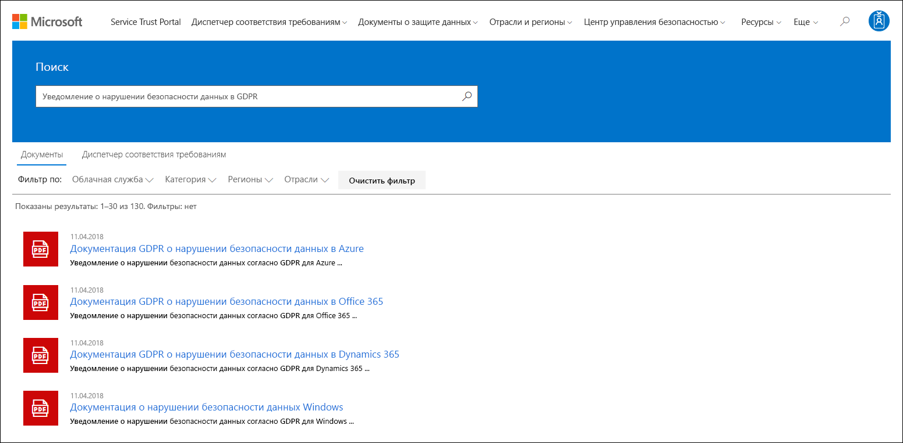

# Диспетчер соответствия требованиям Майкрософт (классический)Microsoft Compliance Manager (classic)

> [!NOTE]
> В этой документации описана предыдущая версия этого продукта.This documentation describes a previous version of this product. Пользователям *настоятельно рекомендуется не использовать эту версию диспетчера соответствия требованиям*.Users are *strongly discouraged from using this version of Compliance Manager*. **Если вы используете текущую предварительную версию диспетчера соответствия требованиям, ознакомьтесь с [документацией для диспетчера соответствия требованиям (предварительной версии)](working-with-compliance-manager.md).****If you're using the current preview version of Compliance Manager, refer to the [Compliance Manager (preveiw) documentation](working-with-compliance-manager.md).**

 *Диспетчер соответствия требованиям недоступен в планах Office 365 под управлением 21Vianet, Office 365 Germany, Office 365 U.S. Government Community High (GCC High) и Office 365 Department of Defense.**Compliance Manager isn't available in Office 365 operated by 21Vianet, Office 365 Germany, Office 365 U.S. Government Community High (GCC High), or Office 365 Department of Defense.*
  
Диспетчер соответствия требованиям — это основанное на рабочих процессах средство оценки рисков, представленное на портале Microsoft [Service Trust Portal](https://docs.microsoft.com/microsoft-365/compliance/get-started-with-service-trust-portal), которое позволяет отслеживать, назначать и проверять действия, направленные на обеспечение соответствия организации нормативным требованиям в профессиональных и облачных службах (Майкрософт), таких как Microsoft Office 365, Microsoft Dynamics 365 и Microsoft Azure.Compliance Manager, a workflow-based risk assessment tool in the Microsoft [Service Trust Portal](https://docs.microsoft.com/microsoft-365/compliance/get-started-with-service-trust-portal), enables you to track, assign, and verify your organization's regulatory compliance activities related to Microsoft Professional Services and Microsoft cloud services, such as Microsoft Office 365, Microsoft Dynamics 365, and Microsoft Azure. 

Диспетчер соответствия требованиям:Compliance Manager:
  
- совмещает подробные сведения, предоставленные корпорацией Майкрософт аудиторам и управляющим органам в рамках различных независимых проверок облачных служб (Майкрософт) на соответствие различным стандартам (например, ISO 27001, ISO 27018 и NIST), и сведения, собранные корпорацией Майкрософт для собственного использования, чтобы обеспечить соответствие требованиям нормативов (например, HIPAA и Общего регламента ЕС по защите данных, или GDPR), с данными, полученными вами в ходе самостоятельной оценки соответствия вашей организации этим стандартам и нормативам;Combines the detailed information provided by Microsoft to auditors and regulators as part of various third-party audits of Microsoft 's cloud services against various standards (for example, ISO 27001, ISO 27018, and NIST) and information that Microsoft compiles internally for its compliance with regulations (such as HIPAA and the EU General Data Protection Regulation, or GDPR) with your own self-assessment of your organization's compliance with these standards and regulations.
    
- позволяет назначать, отслеживать и записывать действия, связанные с оценкой и обеспечением соответствия требованиям, помогая координировать работу команд в организации для достижения ее целей;Enables you to assign, track, and record compliance and assessment-related activities, which can help your organization cross team barriers to achieve your organization's compliance goals.
    
- предоставляет рейтинг соответствия требованиям, помогающий отслеживать ваш прогресс и расставлять приоритеты средств аудита, чтобы снизить риск для организации;Provides a Compliance Score to help you track your progress and prioritize the auditing controls that will help reduce your organization's exposure to risk.
    
- предоставляет надежный репозиторий для отправки и контроля свидетельств и других артефактов, которые связаны с действиями, направленными на обеспечение соответствия требованиям;Provides a secure repository for you to upload and manage evidence and other artifacts related to your compliance activities.
    
- предоставляет подробные отчеты в Microsoft Excel, где документируются выполняемые вами и корпорацией Майкрософт действия, направленные на обеспечение соответствия требованиям. Эти сведения можно предоставлять аудиторам, управляющим органам и другим заинтересованным лицам.Produces richly detailed reports in Microsoft Excel that document the compliance activities performed by Microsoft and your organization, which can be provided to auditors, regulators, and other compliance stakeholders.

Краткую демонстрацию возможностей диспетчера соответствия требованиям см. в [этом видеоролике](https://www.youtube.com/watch?v=r1vs8NdSXKQ).For a brief demo of Compliance Manager, see this [Compliance Manager](https://www.youtube.com/watch?v=r1vs8NdSXKQ) video.

    
> [!IMPORTANT]
> Диспетчер соответствия требованиям — это информационная панель, на которой представлена сводка по защите данных и соответствию требованиям в вашей организации, а также рекомендации по их улучшению. Действия клиентов, предоставляемые в диспетчере соответствия требованиям, — это лишь рекомендации. Каждой организации следует самостоятельно оценивать эффективность этих рекомендаций на своей законодательной базе, прежде чем реализовывать их. Рекомендации в диспетчере соответствия требованиям не следует рассматривать как гарантию соответствия.Compliance Manager is a dashboard that provides a summary of your data protection and compliance stature and recommendations to improve data protection and compliance. The Customer Actions provided in Compliance Manager are recommendations; it is up to each organization to evaluate the effectiveness of these recommendations in their respective regulatory environment prior to implementation. Recommendations found in Compliance Manager should not be interpreted as a guarantee of compliance.

    
## Что такое диспетчер соответствия требованиям?What is Compliance Manager?

Диспетчер соответствия требованиям — это основанное на рабочих процессах средство оценки рисков, призванное помочь вам контролировать соответствие нормативным требованиям в рамках модели общей ответственности для облака. Диспетчер соответствия требованиям предоставляет информационную панель, на которой представлены стандарты, нормативы и оценки, содержащие сведения о реализации средств контроля корпорацией Майкрософт, результаты тестирования, а также рекомендации по реализации клиентских средств контроля и их отслеживанию для вашей организации. В диспетчере соответствия требованиям представлены определения средств оценки сертификатов, рекомендации по реализации и тестированию средств контроля, скорректированный с учетом риска рейтинг средств контроля, возможности управления доступом на основе ролей, а также рабочий процесс для назначения действий на месте, чтобы отслеживать реализацию средств контроля и состояние тестирования, а также управлять свидетельствами. Диспетчер соответствия требованиям оптимизирует рабочую нагрузку обеспечения соответствия требованиям, позволяя клиентам логичным образом группировать оценки и применять имеющиеся результаты тестирования к идентичным или связанным средствам контроля, что помогает избежать повторения действий, которое в ином случае требовалось бы для соблюдения идентичных требований разных сертификатов.Compliance Manager is a workflow-based risk assessment tool designed to help you manage regulatory compliance within the shared responsibility model of the cloud. Compliance Manager provides you with a dashboard view of standards and regulations and assessments that contain Microsoft's control implementation details and test results and customer control implementation guidance and tracking for your organization to enter. Compliance Manager provides certification assessment control definitions, guidance on implementation and testing of controls, risk-weighted scoring of controls, role-based access management, and an in-place control action assignment workflow to track control implementation, testing status and evidence management. Compliance Manager optimizes compliance workload by enabling customers to logically group assessments together and apply assessment control testing to identical or related controls, reducing the duplication of effort that might otherwise be required to satisfy identical control requirements across different certifications.

## Оценки в диспетчере соответствия требованиямAssessments in Compliance Manager

Основной компонент диспетчера соответствия требованиям называется *оценкой*. Оценка — это сопоставление службы Майкрософт со стандартом сертификации или нормативом защиты данных (например, ISO 27001:2013 или GDPR). Оценки помогают определить состояние защиты данных и соответствия требованиям определенного отраслевого стандарта для той или иной облачной службы (Майкрософт). Оценки выполняются путем реализации средств контроля, соответствующих оцениваемому стандарту сертификации.The core component of Compliance Manager is called an *Assessment*. An Assessment is an assessment of a Microsoft service against a certification standard or data protection regulation (such as ISO 27001:2013, and the GDPR). Assessments help you to discern your organization's data protection and compliance posture against the selected industry standard for the selected Microsoft cloud service. Assessments are completed by the implementation of the controls that map to the certification standard being assessed. 
  
Структура оценки основана на обязанностях, разделяемых между корпорацией Майкрософт и вашей организацией, чтобы оценить угрозы безопасности и риски несоответствия в облаке, а также реализовать средства защиты данных, предписываемые стандартом соответствия, стандартом защиты данных, нормативом или законом.The structure of an Assessment is based on the responsibility that is shared between Microsoft and your organization for assessing security and compliance risks in the cloud and for implementing the data protection safeguards specified by a compliance standard, a data protection standard, a regulation, or a law.
  
Оценка состоит из нескольких компонентов:An Assessment is made of several components, which are:
  
- **Службы в области.** Каждая оценка применяется к определенному набору служб Майкрософт, указанных в разделе "Облачные службы в области".**In-Scope Services** - Each assessment applies to a specific set of Microsoft services, which are listed in the In-Scope Cloud Services section. 
    
- **Средства контроля под управлением Майкрософт.** Для каждой облачной службы корпорация Майкрософт реализует набор *средств контроля*, призванных обеспечить соблюдение различных стандартов и нормативов, и управляет им. Эти средства контроля делятся на *семейства*, соответствующие структуре стандарта сертификации или норматива, к которому относится оценка. Для каждого средства контроля под управлением Майкрософт в диспетчере соответствия требованиям представлены сведения о том, как корпорация Майкрософт реализовала средство контроля, а также как и когда реализация была проверена и подтверждена независимым сторонним аудитором.**Microsoft-Managed Controls** - For each cloud service, Microsoft implements and manages a set of  *controls*  as part of Microsoft's compliance with various standards and regulations. These controls are organized into  *control families*  that align with the structure from the corresponding certification or regulation that the Assessment is aligned to. For each Microsoft-managed control, Compliance Manager provides details about how Microsoft implemented the control, along with how and when that implementation was tested and validated by an independent third-party auditor. 
    
    Ниже приведен пример трех средств контроля под управлением Майкрософт из семейства **Безопасность** для оценки соответствия службы Office 365 требованиям GDPR.Here's an example of three Microsoft-managed controls in the **Security** control family from an Assessment of Office 365 and the GDPR. 

    
  
  а. Представлена следующая информация о стандарте сертификации или нормативе, соответствующем средству контроля под управлением Майкрософт.a. Specifies the following information from the certification or regulation that maps to the Microsoft-managed control.

  - **Идентификатор средства контроля.** Номер раздела или статьи стандарта сертификации или норматива, которому соответствует средство контроля.**Control ID** - The section or article number from the certification or regulation that the control maps to.
    
  - **Заголовок.** Заголовок из соответствующего стандарта сертификации или норматива.**Title** - The title from the corresponding certification or regulation.
    
  - **Идентификатор статьи.** Это поле указывается только для оценок соблюдения GDPR, так как в нем указывается номер соответствующей статьи GDPR.**Article ID** - This field is included only for GDPR assessments, as it specifies the corresponding GDPR article number.
    
  - **Описание.** Текст стандарта сертификации или норматива, соответствующего выбранному средству контроля под управлением Майкрософт.**Description** - Text of the standard or regulation that maps to the selected Microsoft-managed control.

  б. Рейтинг соответствия требованиям, который указывает степень риска (по причине несоблюдения или сбоя средства контроля), связанную с каждым средством контроля под управлением Майкрософт. Дополнительные сведения см. в разделе [Общие сведения о рейтинге соответствия требованиям](#understanding-the-compliance-score). Обратите внимание, что соответствие требованиям оценивается по шкале от 1 до 10, а рейтинг сопровождается цветовым обозначением. Желтый цвет обозначает низкий уровень риска, оранжевый — средний, а красный — высокий.b. The Compliance Score for the control, which indicates the level of risk (due to non-compliance or control failure) associated with each Microsoft-managed control. See [Understanding the Compliance Score](#understanding-the-compliance-score) for more information. Note that Compliance Scores are rated from 1 to 10 and are color-coded. Yellow indicates low risk controls, orange indicates medium-risk controls, and red indicated high-risk controls. 
    
  c. Сведения о состоянии реализации этого средства контроля, дате его тестирования, тестировщике и результатах.c. Information about the implementation status of a control, the date the control was tested, who performed the test, and the test result.
    
  d. Для каждого средства контроля можно нажать кнопку **Дополнительно**, чтобы просмотреть дополнительные сведения, в том числе данные о реализации средства контроля корпораций Майкрософт, а также о том, как средство контроля было проверено и подтверждено независимым сторонним аудитором.d. For each control, you can click **More** to see additional information, including details about Microsoft's implementation of the control and details about how the control was tested and validated by an independent third-party auditor. 
    
- **Средства контроля под управлением клиента.** Это коллекция средств контроля, которыми управляет ваша организация. Ваша организация отвечает за реализацию этих средств контроля в рамках обеспечения соответствия требованиям определенного стандарта или норматива. Средства контроля под управлением клиента также делятся на семейства, соответствующие разным стандартам сертификации и нормативам. С помощью средств контроля под управлением клиента вы можете принимать меры обеспечения соответствия, рекомендуемые корпорацией Майкрософт. Ваша организация может использовать инструкции и рекомендуемые действия клиента для каждого средства контроля под ее управлением, чтобы контролировать реализацию и оценку этого средства контроля.**Customer-Managed Controls** - This is the collection of controls that are managed by your organization. Your organization is responsible for implementing these controls as part of your compliance process for a given standard or regulation. Customer-managed controls are also organized into control families for the corresponding certification or regulation. Use the customer-managed controls to implement the recommended actions suggested by Microsoft as part of your compliance activities. Your organization can use the prescriptive guidance and recommended Customer Actions in each customer-managed control to manage the implementation and assessment process for that control.
    
    В средства контроля под управлением клиента в оценках также встроены функции управления рабочими процессами, с помощью которых вы можете контролировать ход выполнения оценки в вашей организации. Например, ответственный за обеспечение соответствия требованиям в вашей организации может назначить поручение ИТ-администратору, который отвечает за выполнение рекомендуемых действий с этим средством контроля и обладает необходимыми для этого разрешениями. После этого ИТ-администратор может отправить свидетельства выполнения своих задач по реализации (например, снимки экрана с конфигурацией или параметрами политики), а затем снова назначить поручение ответственному за обеспечение соответствия требованиям для оценки собранных свидетельств, тестирования средства контроля и занесения даты реализации и результатов тестирования в диспетчер соответствия требованиям. Дополнительные сведения см. в разделе [Управление процессом оценки](#managing-the-assessment-process) в этой статье.Customer-managed controls in Assessments also have built-in workflow management functionality that you can use to manage and track your organization's progress towards completing the Assessment. For example, a Compliance Officer in your organization can assign an Action Item to an IT admin who has the responsibility and necessary permissions to perform the actions that are recommended for the control. When that work is complete, the IT admin can upload evidence of their implementation tasks (for example, screenshots of configuration or policy settings) and then assign the Action Item back to the Compliance Officer to evaluate the collected evidence, test the implementation of the control, and record the implementation date and test results in Compliance Manager. For more information, see the [Managing the assessment process](#managing-the-assessment-process) section in the article. 
  
## Разрешения и управление доступом на основе ролейPermissions and role-based access control

Диспетчер соответствия требованиям использует модель разрешений с управлением доступом на основе ролей.Compliance Manager uses a role-based access control permission model. Только пользователи, которым назначена роль пользователя, могут получить доступ к диспетчеру соответствия требованиям, а действия, разрешенные каждому пользователю, ограничиваются типом роли.Only users who are assigned a user role may access Compliance Manager, and the actions allowed by each user are restricted by role type.
  
Обратите внимание, что больше не существует используемой по умолчанию роли **Гостевой доступ**.Note that there is no longer a default **Guest access** role. Каждому пользователю должна быть назначена роль для доступа и работы в диспетчере соответствия требованиям.Each user must be assigned a role in order to access and work within Compliance Manager.
  
В приведенной ниже таблице описывается каждое разрешение в диспетчере соответствия требованиям и указаны действия, которые оно разрешает выполнять пользователям. В этой таблице также указаны роли, которым назначены те или иные разрешения.The following table describes each Compliance Manager permission and what it allows the user do. The table also indicates the role that each permission is assigned to.
  
||**Читатель в диспетчере соответствия требованиям****Compliance Manager Reader**|**Участник в диспетчере соответствия требованиям****Compliance Manager Contributor**|**Аудитор в диспетчере соответствия требованиям****Compliance Manager Assessor**|**Администратор диспетчера соответствия требованиям****Compliance Manager Administrator**|**Администратор портала****Portal Admin**|
|:-----|:-----|:-----|:-----|:-----|:-----|
|**Чтение данных.** Пользователи могут читать данные, но не могут редактировать их.**Read data** - Users can read but not edit data.    |             |             |             |             |            |
|**Изменение данных.** Пользователи могут редактировать все поля, кроме полей "Результат теста" и "Дата теста".**Edit data** - Users can edit all fields, except the Test Result and Test Date fields.    ||            |             |             |             |
|**Изменение результатов тестов.** Пользователи могут редактировать поля "Результат теста" и "Дата теста".**Edit test results** - Users can edit the Test Result and Test Date fields.    ||  |             |             |             |
|**Управление оценками.** Пользователи могут создавать, архивировать и удалять оценки.**Manage assessments** - Users can create, archive, and delete Assessments.    |||  |             |             |
|**Управление пользователями.** Пользователи могут добавлять других пользователей в своей организации к ролям "Читатель", "Участник", "Аудитор" и "Администратор". Только пользователи с ролью "Глобальный администратор" в организации могут добавлять и удалять пользователей из роли "Администратор портала".**Manage users** - Users can add other users in their organization to the Reader, Contributor, Assessor, and Administrator roles. Only those users with the Global Administrator role in your organization can add or remove users from the Portal Admin role.    ||||  |             |
   
## Общие сведения о рейтинге соответствия требованиямUnderstanding the Compliance Score

На информационной панели диспетчера соответствия требованиям в правом верхнем углу плитки отображается общий рейтинг Office 365.On the Dashboard, Compliance Manager displays a total score for Office 365 assessments in the upper right-hand corner of the tile. Это общий рейтинг соответствия требованиям, который включает баллы, полученные по результатам оценки всех средств контроля, помеченных при оценке как внедренные и протестированные.This is the overall total Compliance Score for the Assessment, and is the accumulation of points received for each control assessment that has been marked as Implemented and Tested in the Assessment. При добавлении оценки можно заметить, что рейтинг соответствия требованиям уже частично заполнен. Это связано с тем, что баллы для средств контроля, управляемых Майкрософт, уже отражены в рейтинге, после того, как они были реализованы Майкрософт и протестированы независимыми сторонними организациями.When adding an Assessment, you will see that the Compliance Score is already on the way towards completion because the points for the Microsoft-managed controls that have been implemented by Microsoft and tested by independent third parties are already applied.
  

  
Остальные баллы начисляются за успешную оценку клиентских средств контроля, а также реализацию и тестирование средств контроля под управлением клиента, каждому из которых назначается определенное значение, прибавляемое к общему рейтингу соответствия требованиям.The remaining points come from the successful customer control assessment, from the implementation and testing of the customer-managed controls, each of which has a specific value that contributes to the overall compliance score. 
  
Для каждой оценки показан рейтинг соответствия требованиям, который помогает определить уровень риска (из-за несоответствия или сбоя), связанный с каждым средством контроля (включая средства контроля, управляемые Майкрософт или клиентом).Each Assessment displays a risk-based Compliance Score to help you assess the level of risk (due to non-compliance or control failure) associated with each control (including both Microsoft managed and customer-managed controls) in an Assessment. Каждому средству контроля, управляемому клиентом, назначается максимальное количество баллов (называемое \*рейтингом серьезности) по шкале от 1 до 10. Чем больше фактор риска средства контроля, тем больше баллов ему назначается.Each customer-managed control is assigned a possible number of points (called a  \*severity ranking) on a scale from 1 to 10, where more points are awarded for controls associated with a higher risk factor if the control fails, and fewer points are awarded for lower-risk controls. 
  
Например, представленное ниже средство контроля оценки "Управление доступом пользователей" имеет очень высокий ранг серьезности риска, поэтому отображается значение 10.For example, the User Access Management assessment control shown below has a very high severity risk ranking, and displays an assigned value of 10.
  

  
 С другой стороны, представленное ниже средство контроля оценки "Резервное копирование" имеет низкий ранг серьезности риска, поэтому отображается значение 3.By comparison, the Information Backup assessment control shown below has a lower severity risk ranking, and displays an assigned value of 3. 
  

  
Диспетчер соответствия требованиям назначает разные ранги разным средствам контроля. Ранги риска вычисляются с учетом следующих критериев:The Compliance Manager assigns a default severity ranking to each control. Risk rankings are calculated based on the following criteria:
  
- Предотвращает ли средство контроля возникновение инцидентов (самый высокий рейтинг), обнаруживает ли возникшие инциденты или исправляет их воздействие (самый низкий рейтинг).Whether a control prevents incidents from happening (highest ranking), detects incidents that have happened, or corrects the impact of an incident (lowest ranking). Что касается рейтинга серьезности, обязательному средству контроля, предотвращающему угрозы, назначается наибольшее число баллов, а средствам контроля, отвечающим за обнаружение и исправление воздействия угроз (независимо от того, являются они обязательными или дискреционными), назначается наименьшее число.In terms of severity ranking, a mandatory control that prevents a threat is assigned the highest number of points; controls that are detective or corrective (regardless of whether they're mandatory or discretionary) are assigned the lowest number of points.
    
- Является ли средство контроля (после его реализации) обязательным, что не позволяет пользователям обходить его (например, необходимость сбрасывать пароли, а также соблюдать требования к длине пароля и символам), или необязательным (например, бизнес-правила, требующие блокировать экран, когда пользователь отсутствует на рабочем месте)?Whether a control (after it's been implemented) is mandatory and therefore can't be by-passed by users (for example, users having to reset their password and meet password length and character requirements) or discretionary and can be by-passed by users (for example, business rules that require users to lock their screens when their computers are unattended).
    
- Для средств контроля, связанных с угрозами конфиденциальности, целостности и доступности данных: являются ли угрозы внутренними или внешними, злонамеренными или случайными? Например, за средства контроля, которые могут помешать внешнему злоумышленнику нарушить безопасность сети и получить доступ к личным сведениям, начисляется больше баллов, чем за те средства, которые не дают сотрудникам по ошибке неправильно настроить сетевой маршрутизатор, вызвав отказ сети.Controls related to risks to data confidentiality, integrity, and availability, whether these risks come from internal or external threats, and whether the threat is malicious or accidental. For example, controls that would help prevent an external attacker from breaching that network and gaining access to personally identifiable information would be assigned more points than a control related to preventing an employee from accidentally mis-configuring a network router setting that results in a network outage).
    
- Риски, связанные с юридическими и внешними факторами, например контрактами, нормативами и обязательствами перед общественностью, для каждого средства контроля.Risks related to legal and external drivers, such as contracts, regulations, and public commitments, for each control.
    
Отображаемые значения рейтинга соответствия требованиям для средства контроля *целиком* применяются к общему рейтингу соответствия требованиям по принципу "зачет-незачет" — средство контроля либо внедряется и проходит последующий оценочный тест, либо нет. За неполное внедрение не назначается частичный зачет. Начисленные баллы прибавляются к общему рейтингу соответствия требованиям, только если в поле **Состояние реализации** указано значение **Реализовано** или **Альтернативная реализация**, а в поле **Результат тестирования** — значение **Пройдено**.The displayed Compliance Score values for the control are applied  *in their entirety*  to the Total Compliance Score on a pass/fail basis--either the control is implemented and passes the subsequent assessment test or it does not; there is no partial credit for a partial implementation. Only when the control has its **Implementation Status** set to **Implemented** or **Alternative Implementation** and the **Test Result** is set to **Passed** are the assigned points added to the Total Compliance Score. 
  
Основная функция рейтинга соответствия требованиям заключается в том, что он помогает определить, реализации каких средств контроля необходимо уделять внимание в первую очередь (он обозначает средства, с отсутствием внедрения которых связан наибольший риск).Most importantly, the Compliance Score can help you prioritize which controls to focus on for implementation by indicating which controls that have a higher potential risk if there is a failure related to a control. Кроме того, если средства контроля связаны с другими средствами (в той же оценке или в другой оценке этой группы), успешное прохождение проверки одним из средств может существенно упростить работу по проверке другого благодаря синхронизации результатов тестирования.In addition to risk-based prioritization, when assessment controls are related to other controls (either within the same assessment or in another assessment in the same assessment grouping), completing a single control successfully can result in a significant reduction of effort based on the synchronization of control test results.
  
Например, на приведенном ниже изображении показано, что оценка "Office 365 — GDPR" в настоящее время выполнена на 46 %. При этом оценено 51 из 111 средств контроля, а общий рейтинг соответствия требованиям составляет 289 баллов из 600 возможных.For example, in the image below we see that the Office 365 - GDPR Assessment is currently 46% assessed, with 51 of 111 control assessments completed for a Total Compliance score of 289 out of a possible 600.
  

  
В рамках оценки средство контроля GDPR 7.5.5 связано с 5 другими (7.4.1, 7.4.3, 7.4.4, 7.4.8 и 7.4.9), каждое из которых имеет средний или высокий рейтинг серьезности (от 6 до 8).Within the assessment GDPR control 7.5.5 is related to 5 other controls (7.4.1, 7.4.3, 7.4.4, 7.4.8, and 7.4.9) each with a moderate to high severity risk rating score of 6 or 8). Используя фильтр оценок, мы выбрали все эти средства контроля, показав их в представлении оценки. Как видно, ни одно из них не проходило оценку.Using the assessment filter, we have selected all of these controls, making them visible in the assessment view, and can see below that none of them have been assessed. 
  
 Так как эти 6 средств контроля взаимосвязаны, внедрение любого из них приведет к синхронизации результатов тестирования со связанными средствами контроля в этой оценке (а также со связанными средствами контроля из той же группы оценок). По завершении внедрения и тестирования средства контроля GDPR 7.5.5 область сведений о средстве контроля обновится, и вы увидите, что все 6 средств контроля были оценены, количество оцененных средств контроля повысилось до 57 (или 51 %), а общий рейтинг соответствия требованиям вырос на 40 баллов.As those 6 controls are related, the completion of any one them will result in a synchronization of those test results across the related controls within this assessment (just as it will for any related controls in an assessment that is in the same assessment grouping). Upon completion of the implementation and testing of GDPR control 7.5.5, the control detail area refreshes to show that all 6 controls have been assessed, with a corresponding increase in the number of assessed controls to 57 and 51% assessed, and a change in total Compliance Score of +40. 
  

  
Это диалоговое окно подтверждения обновления появится, если вы собираетесь изменить состояние реализации связанного средства контроля так, что это повлияет на остальные связанные средства контроля.This confirmation update dialog box will appear if you are about to change the Implementation Status of a related control in a way that will impact the other related controls.
  

  
> [!NOTE]
> В настоящее время рейтинг соответствия требованиям указывается только для оценок, относящихся к облачным службам Office 365. В оценках для Azure и Dynamics показывается состояние оценки.Currently, only Assessments for Office 365 cloud services include a Compliance Score. Assessments for Azure and Dynamics show an assessment status. 

## Принцип вычисления рейтингаCompliance Score methodology

Рейтинг соответствия требованиям, как и Оценка безопасности (Майкрософт), подобен другим системам оценивания с учетом поведения. Организация может повышать свой рейтинг соответствия требованиям, выполняя действия, связанные с защитой данных, обеспечением конфиденциальности и безопасности.The Compliance Score, like the Microsoft Secure Score, is similar to other behavior-based scoring systems; your organization's activity can increase its Compliance Score by performing activities related to data protection, privacy, and security.
  
> [!NOTE]
> Рейтинг соответствия требованиям не является абсолютным показателем соблюдения определенного стандарта или норматива в организации. Он показывает степень внедрения средств контроля, которые могут снизить угрозу для персональных данных и конфиденциальности. Ни одна служба не может гарантировать соблюдение стандарта или норматива, а рейтинг соответствия требованиям не следует рассматривать как гарантию.The Compliance Score does not express an absolute measure of organizational compliance with any particular standard or regulation. It expresses the extent to which you have adopted controls which can reduce the risks to personal data and individual privacy. No service can guarantee that you are compliant with a standard or regulation, and the Compliance Score should not be interpreted as a guarantee in any way. 
  
Оценки в диспетчере соответствия требованиям основаны на модели общей ответственности для работы в облаке. В этой модели корпорация Майкрософт и каждый клиент делят между собой обязанности по защите данных клиента при их хранении в облаке.Assessments in Compliance Manager are based on the shared responsibility model for cloud computing. In the shared responsibility model, Microsoft and each customer share responsibility for the protection of the customer's data when that data is stored in our cloud.
  
Как показано ниже в оценке GDPR для Office 365, корпорация Майкрософт и клиенты несут ответственность за выполнение различных действий, направленных на выполнение требований оцениваемого стандарта или нормативного акта.As shown in the Office 365 GDPR Assessment below, Microsoft and customers are each responsible for performing a variety of Actions that are designed to satisfy the requirements of the standard or regulation being assessed. Чтобы выявить необходимые действияTo rationalize and understand the required. и составить представление о них, в диспетчере соответствия требованиям все стандарты и нормативные акты рассматриваются как платформы контроля.Actions across a variety of standards and regulations, Compliance Manager treats all standards and regulations as if they were control frameworks. Таким образом, действия, выполняемые корпорацией Майкрософт и клиентами для каждой оценки, включают внедрение и проверку различных средств контроля.Thus, the Actions performed by Microsoft and by customers for each Assessment involve the implementation and validation of various controls.
  

  
Ниже представлен базовый рабочий процесс для типичного действия.Here's the basic workflow for a typical Action:
  
1. Лица, ответственные за соответствие требованиям, риск, конфиденциальность и/или защиту данных в организации назначают тому или иному сотруднику организации задачу по реализации средства контроля. Этим сотрудником может быть:The Compliance, Risk, Privacy, and/or Data Protection Officer of an organization assigns the task to someone in the organization to implement a control. That person could be:

    - владелец бизнес-политики;A business policy owner
    
    - специалист по внедрению ИТ;An IT implementer
    
    - другой сотрудник организации, отвечающий за выполнение задачи.Another individual in the organization who has responsibility for performing the task
    
2. Этот сотрудник выполняет задачи, необходимые для реализации средства контроля, отправляет свидетельства реализации в диспетчер соответствия требованиям и помечает средства контроля, связанные с действием, как реализованные. После выполнения задач они назначают действие аудитору для проверки. Аудиторы могут быть:That individual performs the tasks necessary to implement the control, uploads evidence of implementation into Compliance Manager, and marks the control(s) tied to the Action as implemented. Once these tasks are completed, they assign the Action to an Assessor for validation. Assessors can be:
    
    - внутренними, то есть выполнять проверку средств контроля в рамках организации;Internal assessors that perform validation of controls within an organization
    
    - внешними, то есть изучать, проверять и сертифицировать соответствие требованиям. Например, это могут быть сторонние независимые организации, выполняющие аудит облачных служб (Майкрософт).External assessors that examine, verify, and certify compliance, such as the third-party independent organizations that audit Microsoft's cloud services
    
3. Аудитор проверяет средства контроля, изучает свидетельства, помечает средства контроля как оцененные и записывает результаты оценки (например, "Пройдено").The Assessor validates the control and examines the evidence and marks the control(s) as assessed and the results of the assessment (e.g., passed).
    
После оценки всех средств контроля, связанных с оценкой, оценка считается выполненной.Once all the controls associated with an Assessment have been assessed, the Assessment is considered completed.
  
Каждая оценка в диспетчере соответствия требованиям содержит предварительно загруженные сведения о действиях, выполненных корпорацией Майкрософт для удовлетворения требований средств контроля, за которые она отвечает. Эти данные включают сведения о том, как корпорация Майкрософт реализовала каждое средство контроля, а также как и когда их реализация корпорацией Майкрософт была оценена и подтверждена сторонним аудитором. По этой причине средства контроля под управлением Майкрософт для каждой оценки отмечаются как оцененные, и это сказывается на рейтинге соответствия требованиям для оценки.Every Assessment in Compliance Manager comes pre-loaded with information that provides details about the Actions taken by Microsoft to satisfy the requirements of the controls for which Microsoft is responsible. This information includes details about how Microsoft has implemented each control and how and when Microsoft's implementation was assessed and verified by a third-party auditor. For this reason, the Microsoft Managed Controls for each Assessment are marked as Assessed, and the Compliance Score for the Assessment reflects this.
  
Каждая оценка включает общий рейтинг соответствия требованиям, основанный на модели общей ответственности. За реализацию и тестирование средств контроля Office 365 корпорацией Майкрософт начисляется часть возможных баллов, связанных с оценкой GDPR. По мере того как клиент реализует и тестирует свои действия, рейтинг соответствия требованиям повышается на значение, назначенное средству контроля.Each Assessment includes a total Compliance Score based on the shared responsibility model. Microsoft's implementation and testing of controls for Office 365 contributes a portion of the total possible points associated with a GDPR assessment. As the customer implements and tests each of the customer Actions, the Compliance Score for the Assessment will increase by the value assigned to the control. 
  
 ### Принцип оценивания с учетом рисковRisk-based scoring methodology
  
В диспетчере соответствия требованиям используется принцип оценивания с учетом рисков по шкале от 1 до 10. Чем выше риск в случае сбоя средства контроля или несоблюдения правила, тем выше значение. Система оценивания, используемая для вычисления рейтинга соответствия требованиям, основана на нескольких ключевых факторах, таких как:Compliance Manager uses a risk-based scoring methodology with a scale from 1-10 that assigns a higher value to controls that represent a higher risk in the event the control fails or is non-compliant. The scoring system used by Compliance Score is based on several key factors, such as:
  
- характер средства контроля;The essence of the control
    
- уровень риска для средства контроля с учетом типов угроз;The level of risk of the control based on the kinds of threats
    
- внешние факторы, влияющие на средство контроля.The external drivers for the control
    

  
 ### Характер средства контроляEssence of the control
  
Характер средства контроля основан на том, является ли оно обязательным, а также на его назначении (предотвращении, обнаружении или исправлении).The essence of the control is based on whether the control is Mandatory or Discretionary, and whether it is Preventative, Detective, or Corrective.
  
 ### Обязательное или дискреционноеMandatory or discretionary
  
 *Обязательные средства контроля* невозможно обходить ни намеренно, ни случайно. К примерам распространенных обязательных средств контроля относится политика паролей с централизованным управлением, которая задает требования к длине, сложности и сроку действия пароля. Пользователи должны соблюдать эти требования для доступа к системе.*Mandatory controls*  are controls that cannot be bypassed either intentionally or accidentally. An example of a common mandatory control is a centrally-managed password policy that sets requirements for password length, complexity, and expiration. Users must comply with these requirements in order to access the system. 
  
 *Дискреционные средства контроля* применяются с расчетом на то, что пользователи понимают политику и поступают соответствующим образом. Например, политика, которая требует, чтобы пользователи блокировали свои компьютеры, покидая рабочее место, является необязательной, так как ее выполнение зависит от пользователя.*Discretionary controls*  rely upon users to understand policy and act accordingly. For example, a policy requiring users to lock their computer when they leave it is a discretionary control because it relies on the user. 
  
 ### Профилактическое, обнаруживающее или корректирующееPreventative, detective, or corrective
  
 *Профилактические средства контроля* предотвращают определенные риски. Например, защита информации на месте с помощью шифрования — это профилактическая мера против атак, нарушений безопасности и т. д. Разделение обязанностей — это профилактическая мера, призванная контролировать конфликты интересов и предотвращать мошенничество.*Preventative controls*  are those that prevent specific risks. For example, protecting information at rest using encryption is a preventative control against attacks, breaches, etc. Separation of duties is a preventative control to manage conflict of interest and to guard against fraud. 
  
 *Обнаруживающие средства* активно отслеживают системы, выявляя необычные условия и действия, представляющие риск. С помощью этих средств контроля также можно обнаруживать вторжения и выявлять нарушения безопасности. К мониторинговым средствам контроля относятся аудит доступа к системе и действий привилегированных администраторов. Аудит соответствия требованиям нормативов — это средство контроля, используемое для обнаружения проблем с процессами.*Detective controls*  are those that actively monitor systems to identify irregular conditions or behaviors that represent risk or that can be used to detect intrusions or determine if a breach has occurred. System access auditing and privileged administrative actions auditing are types of detective monitoring controls; regulatory compliance audits are a type of detective control used to find process issues. 
  
 *Корректирующие средства контроля* пытаются свести к минимуму отрицательное воздействие нарушения безопасности, принимают корректирующие меры для снижения мгновенного влияния и по мере возможности устраняют ущерб. Реагирование на нарушения конфиденциальности — это корректирующее средство контроля, которое ограничивает ущерб и восстанавливает работоспособность систем после нарушения безопасности.*Corrective controls*  are those that try to keep the adverse effects of a security incident to a minimum, take corrective action to reduce the immediate effect, and reverse the damage, if possible. Privacy incident response is a corrective control to limit damage and restore systems to an operational state after a breach. 
  
Оценивая каждое средство контроля по этим критериям, мы определяем его характер и назначаем ему значение, соответствующее представляемому им уровню риска.By evaluating each control using these factors, we determine the essence of the control and assign it a value relative to the risk that it represents.
  
 **Угроза****Threat**
  
| | | |
|:-----|:-----|:-----|
||**Обязательное****Mandatory**   |**Необязательное****Discretionary**   |
|**Профилактическое****Preventative**   |Высокая степень рискаHigh risk    |Средняя степень рискаMedium risk    |
|**Обнаруживающее****Detective**   |Средняя степень рискаMedium risk    |Низкая степень рискаLow risk    |
|**Корректирующее****Corrective**   |Средняя степень рискаMedium risk    |Низкая степень рискаLow risk    |
   
Угроза — это что-либо, представляющее риск для фундаментального и общепринятого стандарта безопасности (три принципа защиты данных CIA: конфиденциальность, целостность и доступность):Threat refers to anything that poses a risk to the fundamental, universally-accepted security standard known as the CIA triad for data: Confidentiality, Integrity, and Availability:
  
- Конфиденциальность означает, что информацию могут считывать и толковать только доверенные, уполномоченные лица.Confidentiality means that information can be read and understood only by trusted, authorized parties.
    
- Целостность означает, что информация не была изменена или удалена неуполномоченными лицами.Integrity means that information has not been modified or destroyed by unauthorized parties.
    
- Доступность означает, что к информации можно в любой момент получить доступ с высоким качеством обслуживания.Availability means that information can be accessed readily with a high level of quality of service.
    
Несоответствие какому-либо из этих критериев считается компрометацией системы в целом. Угрозы могут поступать как из внутренних, так и из внешних источников, а также возникать по злому умыслу или непреднамеренно. Предполагаемое влияние этих факторов представлено в таблице угроз, где каждому сочетанию сценариев назначается высокая, средняя или низкая степень риска.A failure of any of these characteristics is considered a compromise of the system as a whole. Threats can come from both internal and external sources, and an actor's intent can be accidental or malicious. These factors are estimated in a threat matrix that assigns threat levels of either High, Moderate, or Low to each combination of scenarios.

| |**Внутренняя****Internal** | |**Внешняя****External** | | | |
|:-----|:-----|:-----|:-----|:-----|:-----|:-----|
||*Злоумышленная**Malicious* |*Непреднамеренная**Accidental* |*Злоумышленная**Malicious* |*Непреднамеренная**Accidental* |||
|**Конфиденциальность****Confidentiality** |(В, С или Н)(H, M, or L)    |(В, С или Н)(H, M, or L)    |(В, С или Н)(H, M, or L)    |(В, С или Н)(H, M, or L)|
|**Целостность****Integrity** |(В, С или Н)(H, M, or L)    |(В, С или Н)(H, M, or L)    |(В, С или Н)(H, M, or L)    |(В, С или Н)(H, M, or L)|
|**Доступность****Availability** |(В, С или Н)(H, M, or L)    |(В, С или Н)(H, M, or L)    |(В, С или Н)(H, M, or L)    |(В, С или Н)(H, M, or L)|
   
 **Внешние драйверы****External drivers**
  
|**Контракты****Contracts**|**Нормативы****Regulations**|**Обязательства перед общественностью****Public commitments**|
|:-----|:-----|:-----|
|(В, С или Н)(H, M, or L)    |(В, С или Н)(H, M, or L)    |(В, С или Н)(H, M, or L)    |
   
Внешние факторы, такие как применимые нормативы, контракты и обязательства перед общественностью, могут влиять на средства контроля, призванные защищать данные и предотвращать нарушения безопасности данных, а каждому из этих факторов назначается высокая, средняя или низкая степень риска.External factors such as applicable regulations, contracts, and public commitments can influence controls designed to protect data and prevent data breaches, and each of these factors are assigned risk values or High, Moderate or Low.
  
Предполагаемое количество возникающих рисков высокой, средней или низкой степени риска в 15 возможных сценариях (критерии ЦРУ/угрозы и юридические/внешние факторы), совмещается в целях оценки риска, где вероятность и количество рисков определенной степени считаются значительными и учитываются при вычислении ранга серьезности средства контроля.The estimated number of occurrences of these risk values of High, Moderate, or Low across the 15 possible risk scenarios represented in the CIA/Threat and Legal/External Drivers are combined to provide a risk weighting, which considers the likelihood and number of occurrences of risks at a given value as significant and is taken into consideration when calculating the severity ranking of the control.
  
С учетом ранга серьезности средства контроля ему назначается рейтинг соответствия требованиям — число от 1 (низкий) до 10 (высокий). Выделяются следующие категории риска:Based on the control's severity ranking, the control is assigned its compliance score value, a number between 1 (low) and 10 (high), grouped into the following categories of risk:
  
|**Уровень риска****Risk level**|**Значение рейтинга****Control value**|
|:-----|:-----|
|НизкийLow    |1–31-3    |
|СреднийModerate    |66    |
|ВысокийHigh    |88    |
|КритическийSevere    |1010    |
   
Отдавая приоритет средствам контроля с самым высоким рейтингом, организация сможет сосредоточиться на наиболее рискованных элементах и получать больше баллов в общем рейтинге соответствия требованиям по завершении оценки каждого средства контроля.By prioritizing assessment controls with the highest compliance score values, the organization will be concentrating on the highest risk items and receive proportionally higher positive feedback in the form of more points added to the total compliance score for the assessment for each control assessment completed.
  
### ЗаключениеSummary of scoring methodology
  
Рейтинг соответствия требованиям — основной компонент диспетчера соответствия требованиям, помогающий организациям анализировать и контролировать соответствие требованиям. Рейтинг соответствия требованиям для оценки — это числовой показатель соблюдения компанией определенного стандарта или норматива. Чем выше это значение (вплоть до максимально возможного числа баллов), тем больше компания соответствует требованиям. Понимание принципа оценивания соответствия, согласно которому средствам контроля назначается уровень риска от 1 до 10 (в порядке возрастания), и того, как выполненные оценки средств контроля влияют на общий рейтинг соответствия требованиям, критически важно для расстановки приоритетов деятельности в организации.The Compliance Score is a core component of the way that Compliance Manager helps organizations understand and manage their compliance. The Compliance Score for an assessment is an expression of the company's compliance with a given standard or regulation as a number, where the higher the score (up to the maximum number of points allocated for the Assessment), the better the company's compliance posture. Understanding the compliance scoring methodology in which assessment controls are assigned risk severity values between 1- 10 (low to high), and how completed control assessments add to the total compliance score is crucial to organizations for prioritizing their actions.

## Группировка оценокGrouping Assessments

При создании оценки можно создать для нее группу или присвоить ее существующей группе.When you create a new Assessment, you're prompted to create a group to assign the Assessment to or assign the Assessment to an existing group. Группы также помогают логически организовать оценки и использовать общую информацию и задачи рабочего процесса для оценок с одинаковыми или связанными средствами контроля, управляемыми клиентом.Groups allow you to logically organize Assessments and share common information and workflow tasks between Assessments that have the same or related customer-managed controls.
  
Например, вы можете группировать оценки по годам, командам, отделам и агентствам в организации. Ниже представлены примеры групп и оценок, которые они могут содержать.For example, you could group Assessments by year or teams, departments, or agencies within your organization or group them by year. Here are some examples of groups and the Assessments they might contain.
  
- Оценки GDPR — 2018 г.GDPR Assessments — 2018
    
  - Office 365 + GDPROffice 365 + GDPR
    
  - Azure + GDPRAzure + GDPR
    
  - Dynamics + GDPRDynamics + GDPR
    
- Оценки Azure — 2018 г.Azure Assessments — 2018
    
  - Azure + GDPRAzure + GDPR
    
  - Azure + ISO 27001:2013Azure + ISO 27001:2013
    
  - Azure + ISO 27018:2014Azure + ISO 27018:2014
    
- Оценки безопасности и конфиденциальности данныхData Security and Privacy Assessments
    
  - Office 365 + ISO 27001:2013Office 365 + ISO 27001:2013
    
  - Office 365 + ISO 27018:2014Office 365 + ISO 27018:2014
    
  - Azure + ISO 27001:2013Azure + ISO 27001:2013
    
  - Azure + ISO 27018:2014Azure + ISO 27018:2014
    
> [!TIP]
> Рекомендуем определить стратегию группировки для своей организации, прежде чем добавлять новые оценки.We recommend that your determine a grouping strategy for your organization before adding new assessments. 
  
На группировку оценок распространяются следующие требования:These are the requirements for grouping Assessments:
  
- Имена групп (также называемые \*идентификаторами групп) должны быть уникальными в рамках организации.Group names (also called  \*Group IDs) must be unique within your organization. 
    
- Группы могут содержать оценки для одного и того же стандарта сертификации или норматива, но каждая группа может содержать по одной оценке на каждую пару облачной службы и сертификата. Например, группа не может содержать две оценки для Office 365 и GDPR. Аналогичным образом, группа может содержать несколько оценок для одной облачной службы, если им соответствуют разные стандарты сертификации или нормативы.Groups can contain Assessments for the same certification/regulation, but each group can only contain one Assessment for a specific cloud service/certification pair. For example, a group can't contain two Assessments for Office 365 and GDPR. Similarly, a group can contain multiple Assessments for the same cloud service as long as the corresponding certification/regulation for each one is different.
    
После добавления оценки в группу последнюю невозможно изменить.Once an assessment has been added to an assessment grouping, the grouping cannot be changed. Вы можете переименовать группу оценок, после чего во всех оценках будет использоваться новое имя группы.You can rename the assessment group, which changes the name of the assessment grouping for all of the assessments associated with that group. Также можно создать новую оценку и новую группу оценок, а затем скопировать в нее сведения из существующей оценки (при этом создается дубликат оценки в другой группе).You can create an assessment and a new assessment group and copy information from an existing assessment, which effectively creates a duplicate of that assessment in a different assessment group. При архивации оценки нарушается связь между этой оценкой и группой оценок.Archiving an assessment breaks the relationship between that assessment and the assessment group. Дальнейшие обновления других связанных оценок больше не отражаются в архивированной оценке.Any further updates to other related assessments are no longer reflected in the archived assessment.
  
Как было сказано выше, одним из основных преимуществ применения групп является использование одного средства контроля, управляемого пользователем (а следовательно, и одинаковых действий клиента), для разных оценок в одной группе. Таким образом, при внесении сведений о реализации, тестировании и статусе для средства контроля в одной оценке они будут синхронизироваться с тем же средством контроля в других оценках в группе.As previous explained, one key advantage of using groups is that when two different Assessments in the same group share the same customer-managed control (and therefore the customer actions would be the same for each control), then the completion of implementation details, testing information, and status for the control in one Assessment would be synchronized to the same control in any other Assessment in the group. Другими словами, если для оценок используется одно и то же средство контроля и эти оценки находятся в одной группе, вам достаточно управлять процессом оценки для средства контроля только в одной оценке.In other words, if Assessments share the same control and those Assessments are in the same group, you'd only have to manage the assessment process for the control in one Assessment. Результаты для этого средства контроля будут автоматически синхронизированы с другими оценками.The results for that control will be automatically synchronized to other Assessments. Например, в стандартах ISO 27001 и ISO 27018 имеется средство контроля политик паролей.For example, ISO 27001 and ISO 27018 both have a control related to password policies. Если для статуса тестирования средства контроля указать значение "Пройдено" в одной оценке, состояние этого средства обновится, т. е. примет значение "Пройдено", и в другой оценке, если только обе эти оценки принадлежат к одной группе оценок.If the Test Status for the control is set to "Passed" in one Assessment, the control is updated (and marked as "Passed") in the other Assessment, as long as both assessments are part of the same Assessment Group.
  
Например, рассмотрим два связанных средства контроля, которые относятся к шифрованию данных в общедоступных сетях: 6.10.1.2 в оценке "Office 365 — GDPR" и SC-13 в оценке "Office 365 — NIST" 800-53.As an example of this, consider these two related assessment controls, each having to do with encryption of data on public networks, control 6.10.1.2 in the Office 365 — GDPR assessment, and control SC-13 in the Office 365 — NIST 800-53 assessment. Это связанные средства контроля в двух различных оценках, относящихся к группе по умолчанию.These are related assessment controls, in two different assessments, both in the Default Group. Изначально ни одна из этих оценок не была пройдена, как показано на панели мониторинга диспетчера соответствия требованиям.Initially, neither assessment has completed any customer control assessments, as is displayed on the Compliance Manager Dashboard that shows these two Assessments.
  

  
Выбрав оценку **Office 365 — GDPR** и применив фильтр для просмотра средства контроля GDPR 6.10.1.2, мы увидим, что средство контроля SC-13 для стандарта NIST 800-53 указано в качестве связанного.By clicking the **Office 365 — GDPR** assessment, and using the filter controls to view GDPR control 6.10.1.2, we see that NIST 800-53 control SC-13 is listed as a related control.
  

  
 Здесь показано завершение реализации и тестирования средства контроля GDPR 6.10.1.2.Here we show the completion of the implementation and testing of GDPR control 6.10.1.2. 
  

  
Перейдем к связанному средству контроля в оценке из этой группы и увидим, что средство контроля NIST 800-53 SC-13 также отмечено как завершенное, а указаны те же дата и время. При этом не потребовалось дополнительных усилий для реализации или тестирования.By navigating to the related control in the grouped assessment, we see that NIST 800-53 SC-13 has also been marked as completed with the same date and time, with no additional implementation or testing effort.
  

  
Снова открыв информационную панель, мы увидим, что для каждой оценки завершена проверка одного средства контроля, а общий рейтинг соответствия требованиям для каждой оценки увеличился на 8 (рейтинг соответствия требованиям для этого общего средства контроля).Back at the Dashboard, we can see that each assessment has one control assessment completed and that the total Compliance Score for each assessment has increased by 8 (the compliance score value of that shared control).
  

## Административные функцииAdministrative functions

Некоторые административные функции доступны только учетной записи администратора клиента и будут видны, только если войти от имени глобального администратора.There are specific administrative functions that are only available to the tenant administrator account, and will only be visible when logged in as a global administrator.
  
> [!NOTE]
> Разрешение "Доступ к ограниченным документам" в раскрывающемся списке позволяет администраторам предоставлять пользователям доступ к ограниченным документам, к которым корпорация Майкрософт предоставляет доступ на портале Service Trust Portal. Функция "Ограниченные документы" недоступна, но появится в скором времени.The Access to Restricted Documents permission in the drop-down list will allow administrators to give users access to restricted documents that Microsoft shares on the Service Trust Portal. The Restricted Documents feature isn't available, but is coming soon. 
  
### Назначение пользователям ролей в диспетчере соответствия требованиямAssigning Compliance Manager roles to users

Разрешения разных ролей в диспетчере соответствия требованиям немного различаются. Вы можете просматривать разрешения, назначенные каждой роли, узнавать, какие пользователи относятся к каким ролям, а также добавлять или удалять пользователей из этой роли с помощью портала Service Trust Portal, открыв меню **Администратор** и выбрав пункт **Параметры**.Each Compliance Manager role has slightly different permissions. You can view the permissions assigned to each role, see which users are in which roles, and add or remove users from that role through the Service Trust Portal by selecting the **Admin** menu item, and then choosing **Settings**. 
  

  
Чтобы добавить или удалить пользователей из роли в диспетчере соответствия требованиям, выполните указанные ниже действия.To add or remove users from Compliance Manager roles.
  
1. Перейдите по ссылке [https://servicetrust.microsoft.com](https://servicetrust.microsoft.com).Go to [https://servicetrust.microsoft.com](https://servicetrust.microsoft.com).
    
2. Войдите с помощью учетной записи глобального администратора Azure Active Directory.Sign in with your Azure Active Directory global administrator account.
    
3. В верхней строке меню Service Trust Portal выберите пункт **Администратор**, а затем — **Параметры**.On the Service Trust Portal top menu bar, click **Admin** and then choose **Settings**. 
    
4. В раскрывающемся списке **Выберите роль** щелкните нужную роль.In the **Select Role** drop-down list, click the role that you want to manage. 
    
5. Пользователи, добавленные к каждой роли, указаны на странице **Выбор роли**.Users added to each role are listed on the **Select Role** page. 
    
6. Чтобы добавить пользователей к этой роли, нажмите кнопку **Добавить**. В диалоговом окне **Добавление пользователей** щелкните поле пользователя. Вы можете прокрутить список доступных пользователей или начать вводить имя, чтобы отфильтровать список по вашему запросу. Выберите пользователя, чтобы добавить его в список **Добавление пользователей** для назначения этой роли. Чтобы добавить нескольких пользователей одновременно, отфильтруйте список, начав вводить имя, а затем выберите пользователя, чтобы добавить его в список. Нажмите кнопку **Сохранить**, чтобы назначить выбранную роль этим пользователям.To add users to this role, click **Add**. In the **Add Users** dialog, click the user field. You can scroll through the list of available users or begin typing the user name to filter the list based on your search term. Click the user to add that account to the **Add Users** list to be provisioned with that role. If you would like to add multiple users concurrently, begin typing a user name to filter the list, and then click the user to add to the list. Click **Save** to provision the selected role to these users. 
    
    
  
7. Чтобы удалить пользователей из этой роли, выберите их и нажмите кнопку **Удалить**.To remove users from this role, select the user(s) and click **Delete**. 
    
    
 
## Параметры конфиденциальности пользователейUser Privacy settings

Некоторые нормативы требуют, чтобы организация могла удалять данные журнала пользователей. Для этого в диспетчере соответствия требованиям предоставляется раздел **Параметры конфиденциальности пользователей**, где администраторы могут:Certain regulations require that an organization must be able to delete user history data. To enable this, Compliance Manager provides the **User Privacy Settings** functions, that allow administrators to: 
  
- [искать пользователей;Search for a user](#search-for-a-user)

- [экспортировать отчет о журнале данных учетных записей;Export a report of account data history](#export-a-report-of-account-data-history)

- [переназначать поручения;Reassign action items](#reassign-action-items)

- [удалять журналы данных пользователей.Delete user data history](#delete-user-data-history)
    

  
### Поиск пользователяSearch for a user

Чтобы найти учетную запись, выполните указанные ниже действия.To search for a user account:
  
1. Укажите адрес электронной почты пользователя, введя его псевдоним (текст слева от символа @) и выбрав имя домена в списке справа.Enter the user email address by typing in the alias (the information to the left of the @ symbol) and choosing the domain name by clicking the domain suffix list on the right. В случае клиента с несколькими зарегистрированными доменами рекомендуем перепроверить имя домена в адресе электронной почты.If this is tenant with multiple registered domains, you can double check the email address domain name suffix to ensure that it is correct.
    
2. Правильно указав имя пользователя, нажмите кнопку **Поиск**.When you have the username correctly entered, click **Search**. 
    
3. Если учетная запись пользователя не найдена, на странице появится сообщение "Пользователь не найден". Проверьте электронный адрес пользователя, внесите необходимые изменения и нажмите кнопку **Поиск**, чтобы повторить попытку.If the user account is not found, the error message 'User not found' will be displayed on the page. Check the user's email address information, make corrections as necessary and click **Search** to try again. 
    
4. Если учетная запись пользователя найдена, подпись кнопки **Поиск** изменится на **Очистить**. Это означает, что найденная учетная запись пользователя является рабочим контекстом для дополнительных функций, которые показаны ниже, а работа этих функций будет распространяться на данную учетную запись.If user account is found, the text of the button changes from **Search** to **Clear**, which indicates that the returned user account is the operating context for the additional functions that will be displayed below, that running those functions will apply to this user account. 
    
5. Чтобы очистить результаты поиска и найти другого пользователя, нажмите кнопку **Очистить**.To clear search results and search for a different user, click **Clear**. 
    
### Экспорт отчета о журнале данных учетной записиExport a report of account data history

Когда учетная запись пользователя найдена, вы можете создать отчет о связанных с ней зависимостях.Once the user account has been identified, you may wish to generate a report of dependencies that exist linked to this account. Эти сведения помогут вам переназначить открытые элементы действий или получить доступ к ранее отправленным доказательствам.This information allows you to reassign open action items or ensure access to previously uploaded evidence. 
  
 Чтобы создать и экспортировать отчет, выполните указанные ниже действия.To generate and export a report:
  
1. Нажмите кнопку **Экспорт**, чтобы создать и скачать отчет об элементах действий средств контроля в диспетчере соответствия требованиям, которые сейчас назначены найденной учетной записи пользователя, и список документов, отправленных этим пользователем.Click **Export** to generate and download a report of the Compliance Manager control action items currently assigned to the returned user account and the list of documents uploaded by that user. Если назначенные действия и отправленные документы отсутствуют, появится сообщение о том, что таких данных нет.If there are no assigned actions or uploaded documents, an error message will state "No data for this user". 
    
2. Отчет скачивается в фоновом режиме активного окна браузера. Если всплывающее окно загрузки не отображается, следует проверить журнал загрузок браузера.The report downloads in the background of the active browser window — if you don't see a download popup you want to check your browser download history.
    
3. Откройте документ, чтобы просмотреть данные отчета.Open the document to review the report data.
    
> [!NOTE]
> Это не хронологический отчет с данными об изменении состояния в журнале назначения поручений. Создаваемый отчет представляет собой моментальный снимок поручений, назначенных в момент его создания (метка даты и времени заносится в отчет). Например, любое последующее переназначение поручений приведет к созданию другого моментального снимка данных, если другой пользователь снова создаст этот отчет.This is not a historical report that retains and displays state changes to action item assignment history. The generated report is a snapshot of the control action items assigned at the time that the report is run (date and time stamp written into the report). For instance, any subsequent reassignment of action items will result in different snapshot report data if this report is generated again for the same user. 
  
### Переназначение порученийReassign action items

Эта функция позволяет организации удалять активные или просроченные зависимости учетной записи, переназначая все поручения (это относится как к активным, так и к выполненным поручениям) из найденной учетной записи пользователя новому пользователю, выбранному ниже. Это действие не меняет журнал отправки документов для найденной учетной записи.This function enables an organization to remove any active or outstanding dependencies on the user account by reassigning all action item ownership (which includes both active and completed action items) from the returned user account to a new user selected below. This action does not change document upload history for the returned user account. 
  
 Чтобы переназначить поручения другому пользователю, выполните указанные ниже действия.To reassign action items to another user:
  
1. Щелкните поле ввода, чтобы найти и выбрать другого пользователя в организации, которому следует назначить поручения найденного пользователя.Click the input box to browse for and select another user within the organization to whom the returned user's action items should be assigned.
    
2. Нажмите **Заменить**, чтобы переназначить все поручения найденного пользователя новому выбранному пользователю.Select **Replace** to reassign all control action items from the returned user to the newly selected user. 
    
3. Откроется диалоговое окно подтверждения с текстом "Все элементы действий управления будут переназначены выбранному пользователю.A confirmation dialog box appears stating "This will reassign all control action items from the current user to the selected user. Это действие невозможно отменить.This action cannot be undone. Продолжить?"Are you sure you want to continue?"
    
4. Если вы хотите продолжить, нажмите кнопку **ОК**. В противном случае нажмите кнопку **Отмена**.To continue click **OK**, otherwise click **Cancel**. 
    
> [!NOTE]
> Все поручения (как активные, так и выполненные) будут назначены новому пользователю. Однако это действие не влияет на журнал отправки документов. Во всех документах, отправленных ранее назначенным пользователем, по-прежнему будут отображаться дата и время, а также имя назначенного ранее пользователя.All action items (both active and completed) will be assigned to the newly selected user. However, this action does not affect the document upload history; any documents uploaded by the previously assigned user will still show the date/time and name of the previously assigned user. 
  
Чтобы удалить назначенного ранее пользователя, необходимо вручную отредактировать журнал отправки документов. В этом случае администратору потребуется:Changing the document upload history to remove the previously assigned user will have to be done as a manual process. In that case, the administrator will need to:
  
1. Открыть загруженный ранее отчет об экспорте.Open the previously downloaded Export report.
  
2. Определить нужное поручение и перейти к нему.Identify and navigate to the desired control action item.
  
3. Выбрать **Управление документами**, чтобы перейти к репозиторию свидетельств для этого средства контроля.Click **Manage Documents** to navigate to the evidence repository for that control. 
  
4. Скачать документ.Download the document.
  
5. Удалить документ их репозитория свидетельств.Delete the document in the evidence repository.
  
6. Повторно отправить документ. Теперь для документа будут указаны новые дата и время отправки, а также имя отправителя.Re-upload the document. The document will now have a new upload date, time and Uploaded By username. 
  
### Удаление журнала данных пользователяDelete user data history

При этом все поручения, назначенные найденному пользователю, становятся неназначенными. Кроме того, для всех документов, отправленных этим пользователям, значение имени отправителя меняется на "Пользователь удален".This sets control action items to 'unassigned' for all action items assigned to the returned user. This also sets uploaded by value to 'user removed' for any documents uploaded by the returned user
  
 Чтобы удалить журнал поручений и отправки документов для учетной записи, выполните указанные ниже действия.To delete the user account action item and document upload history:
  
1. Нажмите кнопку **Удалить**.Click **Delete**. 

    Появится диалоговое окно подтверждения с сообщением "Будут удалены все назначенные поручения и журнал отправки документов для выбранного пользователя. Это действие невозможно отменить. Продолжить?"A confirmation dialog will be displayed, stating "This will remove all control action item assignments and the document upload history for the selected user. This action cannot be undone. Are you sure you want to continue?"
    
3. Если вы хотите продолжить, нажмите кнопку **ОК**. В противном случае нажмите кнопку **Отмена**.To continue click **OK**, otherwise click **Cancel**. 
  
## Использование диспетчера соответствия требованиямUsing Compliance Manager

Диспетчер соответствия требованиям предоставляет инструменты, с помощью которых можно назначать, отслеживать и записывать действия, связанные с оценкой и обеспечением соответствия требованиям, помогая координировать работу команд в организации для достижения ее целей.Compliance Manager provides you with tools to assign, track, and record compliance and assessment-related activities, and to help your organization cross team barriers to achieve your organization's compliance goals.
  

## Доступ к диспетчеру соответствия требованиямAccessing Compliance Manager

Перейти к диспетчеру соответствия требованиям можно с портала Service Trust Portal. Диспетчер соответствия требованиям доступен любому пользователю с учетной записью Майкрософт или организационной учетной записью Azure Active Directory.You access Compliance Manager from the Service Trust Portal. Anyone with a Microsoft account or Azure Active Directory organizational account can access Compliance Manager.
  

  
1. Перейдите по ссылке [https://servicetrust.microsoft.com](https://servicetrust.microsoft.com/).Go to [https://servicetrust.microsoft.com](https://servicetrust.microsoft.com/).
    
2. Войдите с помощью учетной записи пользователя Azure Active Directory (Azure AD).Sign in with your Azure Active Directory (Azure AD) user account.
    
3. На портале Service Trust Portal выберите **Диспетчер соответствия требованиям**.In the Service Trust Portal, click **Compliance Manager**. 
    
4. Когда появится соглашение о неразглашении, прочтите его и нажмите кнопку **Принимаю** для продолжения. Это достаточно сделать один раз, после чего появится информационная панель диспетчера соответствия требованиям.When the Non-Disclosure Agreement is displayed, read it, and then click **Agree** to continue. You'll only have to do this once, and then the Compliance Manager dashboard is displayed. 

    Чтобы помочь вам приступить к работе, мы добавили по умолчанию следующие оценки:To get you started, we've added the following Assessments by default:
    
    
    
5. Нажмите значок  **Справка**, чтобы просмотреть краткий обзор диспетчера соответствия требованиям.Click  **Help** to take a short tour of Compliance Manager. 
  
## Просмотр порученийViewing action items

В диспетчере соответствия требованиям есть удобное представление всех назначенных вам поручений, связанных со средствами контроля, в котором можно легко и быстро выполнять нужные действия.Compliance Manager provides a convenient view of all your assigned control assessment action items, enabling you to quickly and easily take action on them. Можно просмотреть все поручения или выбрать те из них, которые связаны с определенной сертификацией, открыв соответствующую вкладку.You can view all action items or select the action items that correspond with a specific certification by clicking the tab associated with that assessment. Например, на приведенном ниже рисунке выбрана вкладка GDPR, на которой показаны средства контроля, связанные с оценкой GDPR.For instance, in the image below, the GDPR tab has been selected, showing controls that related to the GDPR assessment.
  

  
Чтобы просмотреть свои поручения, выполните указанные ниже действия.To view your action items:
  
1. Откройте информационную панель диспетчера соответствия требованиямGo to the Compliance Manager dashboard
    
2. Перейдите по ссылке **Поручения**, и страница обновится, после чего вы увидите назначенные вам поручения.Click the **Action Items** link, and the page will refresh to show the action items that have been assigned to you. 
    
    По умолчанию отображаются все поручения. Если у вас есть поручения для нескольких стандартов сертификации, то назначения этих стандартов будут показаны на вкладках в верхней части области оценки. Чтобы просмотреть поручения, относящиеся к определенному стандарту сертификации, выберите соответствующую вкладку.By default, all action items are shown. If you have action items across multiple certifications, the names of the certifications will be listed in tabs across the top of the assessment control. To see the action items for a specific certification, click that tab.

## Добавление оценкиAdding an Assessment

Чтобы добавить оценку в диспетчер соответствия требованиям, выполните указанные ниже действия.To add an Assessment to Compliance Manager:
  
1. На информационной панели в диспетчере соответствия требованиям нажмите  **Добавить оценку**.In the Compliance Manager dashboard, click  **Add Assessment**. 
    
2. В окне **Добавление оценки** вы можете создать группу, к которой будет добавлена оценка, или добавить оценку к имеющейся группе (встроенная группа называется "Исходная группа"). В зависимости от выбранного варианта введите имя новой группы или выберите существующую из раскрывающегося списка. Дополнительные сведения см. в разделе [Группировка оценок](#grouping-assessments).In the **Add an Assessment** window, you can create a new group to add the Assessment to or you can add it to an existing group (the built-in group is named "Initial Group".) Depending on the option you choose, either type the name of a new group or select an existing group from the drop-down list. For more information, see [Grouping Assessments](#grouping-assessments).
    
    При создании группы также можно скопировать информацию из существующей группы в новую оценку.If you create a group, you also have the option to copy information from an existing group to the new Assessment. Это означает, что информация из полей "Сведения о реализации", "План тестирования" и "Отклик функции управления" средств контроля, управляемых клиентом, для оценок в группе, из которой вы копируете сведения, копируется в те же (или связанные) средства контроля, управляемые клиентом, в новой оценке.That means any information that was added to the Implementation Details and Test Plan and Management Response fields of customer-managed controls from Assessments in the group that you're copying from are copied to the same (or related) customer-managed controls in the new Assessment. Если вы добавляете новую оценку в существующую группу, общая информация об оценках в этой группе копируется в новую оценку.If you're adding a new Assessment to an existing group, common information from Assessments in that group will be copied to the new Assessment. Дополнительные сведения см. в разделе [Копирование информации из существующих оценок](#copying-information-from-existing-assessments).For more information, see [Copying information from existing Assessments](#copying-information-from-existing-assessments).
    
3. Нажмите кнопку **Далее** и выполните указанные ниже действия.Click **Next**, and do the following:
    
    а.a. Выберите облачную службу Майкрософт для оценки соответствия требованиям в раскрывающемся списке **Выбор продукта**.Choose a Microsoft cloud service to assess for compliance from the **Select a product** drop-down list. 
    
    б.b. Выберите сертификацию для оценки выбранной облачной службы в раскрывающемся списке **Выбор сертификации**.Choose a certification to assess the selected cloud service against from the **Select a certification** drop-down list. 
    
4. Нажмите **Добавить на панель мониторинга**, чтобы создать оценку. Она будет добавлена на информационную панель диспетчера соответствия требованиям в качестве новой плитки в конце списка имеющихся плиток.Click **Add to Dashboard** to create the Assessment; the assessment will be added to the Compliance Manager dashboard as a new tile at the end of the list of existing tiles. 
    
    **Плитка оценки** на информационной панели в диспетчере соответствия требованиям содержит названия группы и оценки (последнее автоматически создается путем объединения имени службы с выбранным стандартом сертификации), даты ее создания и последнего изменения, общий рейтинг соответствия требованиям (представляющий собой сумму значений риска для всех реализованных, протестированных и прошедших оценку средств контроля), а также индикаторы хода выполнения вдоль нижнего края, показывающие количество средств контроля, прошедших оценку.The **Assessment Tile** on the Compliance Manager dashboard, displays the assessment grouping, the name of the assessment (automatically created as a combination of the Service name and the certification selected), the date it was created and when it was last modified, the Total Compliance Score (which is the sum of all of the assigned control risk values that have been implemented, tested, and passed), and progress indicators along the bottom that show the number of controls that have been assessed. 
    
5. Нажмите имя оценки, чтобы открыть ее и просмотреть сведения о ней.Click the Assessment name to open it, and view the details of the Assessment.
    
6. Откройте меню **Действия**, чтобы просмотреть назначенные вам поручения, переименовать группу оценок, экспортировать отчет об оценивании или архивировать оценку.Click the **Actions** menu to view your assigned action items, rename the assessment group, export the assessment report, or archive the assessment. 
    
    

## Копирование сведений из имеющихся оценокCopying information from existing Assessments

Как было сказано выше, при создании группы оценок можно скопировать информацию об оценках из существующей группы в новую оценку.As previously explained, when you create an assessment group, you have the option to copy information from Assessments in an existing group to the new Assessment in the new group. Это позволяет применить оценку и выполненную работу по тестированию для таких же средств контроля, управляемых клиентом, в новой оценке.This allows you to apply the assessment and testing work that's been completed to the same customer-managed controls in the new Assessment. Например, если у вас есть группа для всех оценок в организации, связанных со стандартом GDPR, вы можете скопировать общую информацию из существующих сведений об оценке во время добавления новой оценки в группу.For example, if you have a group for all GDPR-related Assessments in your organization, you can copy common information from existing assessment work when add a new Assessment to the group.
  
Вы можете скопировать в новую оценку следующие сведения от клиента:You can copy the following information from customer to a new Assessment:
  
- Пользователи оценки. Пользователь оценки — это пользователь, которому назначено средство контроля.Assessment Users. An Assessment user is a user who the control is assigned to.
    
- Состояние, дата и результаты тестирования.Status, Test Date, and Test Results.
    
- Сведения о реализации и плане тестирования.Implementation details and test plan information.
    
Аналогичным образом синхронизируется информация из общих средств контроля, управляемых клиентом, в одной группе оценок.Similarly, information from shared customer-managed controls within the same Assessment group is synchronized. Также синхронизируется информация в связанных средствах контроля, управляемых клиентом, в той же оценке.And information in related customer-managed controls within the same Assessment is also synchronized.

## Просмотр оценокViewing Assessments

1. Найдите плитку нужной оценки, а затем щелкните ее имя, чтобы открыть оценку и просмотреть связанные с ней средства контроля под управлением Майкрософт и клиента, а также список облачных служб, на которые распространяется оценка.Locate the Assessment Tile corresponding to the assessment you wish to view, then click the assessment name to open it and view the Microsoft and customer-managed controls associated with the Assessment, along with a list of the cloud services that are in-scope for the Assessment. Ниже приведен пример оценки для Office 365 и GDPR.Here's an example of the Assessment for Office 365 and GDPR.
    
    
  
1. В этом разделе показаны сводные данные об оценке, в том числе имя группы и оценки, а также количество средств контроля.This section shows the Assessment summary information, including the name of the Assessment Grouping, Product, Assessment name, number of Assess controls
    
2. В этом разделе показаны элементы фильтрации оценок. Подробные инструкции по использованию элементов фильтрации оценок см. в разделе [Управление процессом оценки](#managing-the-assessment-process).This section shows the Assessment Filter controls. For a more detailed explanation of how to use the Assessment Filter controls see the [Managing the assessment process](#managing-the-assessment-process) section. 
    
3. В этом разделе показаны отдельные облачные службы, на которые распространяется оценка.This section shows the individual cloud services that are in-scope for the assessment.
    
4. Этот раздел содержит средства контроля, управляемые Майкрософт.This section contains Microsoft-managed controls. Связанные средства контроля сгруппированы в семейства.Related controls are organized by control family. Щелкните семейство, чтобы развернуть его и отобразить отдельные средства контроля.Click a control family to expand it and display individual controls.
    
5. Этот раздел содержит клиентские средства контроля, которые также организованы в семейства.This section contains customer-managed controls, which are also organized by control family. Щелкните семейство, чтобы развернуть его и отобразить отдельные средства контроля.Click a control family to expand it and display individual controls.
    
6. Общее число средств контроля в семействе и количество оцениваемых средств.Displays the total number of controls in the control family, and how many of those controls have been assessed. Примечательная особенность диспетчера соответствия требованиям — возможность отслеживать ход оценки средств контроля, управляемых клиентом.A key capability of Compliance Manager is tracking your organization's progress on assessing the customer-managed controls. Дополнительные сведения см. в разделе [Сведения о рейтинге соответствия требованиям](#understanding-the-compliance-score).For more information, see the [Understanding the Compliance Score](#understanding-the-compliance-score) section. 

## Управление процессом оценкиManaging the assessment process

Создатель оценки изначально является ее единственным пользователем.The creator of an Assessment is initially the only Assessment User. Для каждого клиентского средства контроля можно назначить поручение сотруднику организации, чтобы он стал пользователем оценки и смог выполнять рекомендуемые действия, а также собирать и добавлять доказательства.For each customer-managed control, you can assign an Action Item to a person in your organization so that person becomes an Assessment User who can perform the recommended Customer Actions, and gather and upload evidence. При назначении поручения вы можете отправить сообщение электронной почты, в котором указаны рекомендуемые действия и приоритет.When you assign an Action Item, you can choose to send an email to the person that contains details including the recommended Customer Actions and the Action Item priority. Уведомление включает ссылку на панель мониторинга **Поручения**, где перечислены все поручения, назначенные этому лицу.The email notification includes a link to the **Action Items** dashboard, which lists all Action Items assigned to that person. 
  
Ниже представлен список задач, которые можно выполнять с помощью функций рабочих процессов в диспетчере соответствия требованиям.Here's a list of tasks that you can perform using the workflow features of Compliance Manager.
  

  
1. **Использование параметров фильтра для поиска определенных средств контроля оценки.** Диспетчер соответствия требованиям предоставляет **параметры фильтра**, позволяющие указывать детальные условия для выбора отображаемых средств контроля, помогая точно выделять определенные области вашей деятельности по обеспечению соответствия требованиям.**Use the Filter Options to find specific assessment controls** - Compliance Manager provides **Filter Options**, giving you highly granular selection criteria for displaying assessment controls, helping you to precisely target specific areas of your compliance efforts. 
    
    Щелкните значок воронки в правой части страницы, чтобы показать или скрыть **параметры фильтрации**.Click the funnel icon on the right-hand side of the page to show or hide the **Filter Options** controls. Укажите условия фильтрации, и ниже будут выведены только средства контроля, которые соответствуют им.These controls allow you to specify filter criteria, and only the assessment controls that fit those criteria will be displayed below. 
  
    - **Статьи**: фильтрует данные по названию статьи и возвращает только средства контроля, связанные с ней.**Articles** - filters on the article name and returns the assessment controls associated to that article. Например, если ввести "Article (5)", появится список статей, названия которых включают в себя эту строку, например Article (5)(1)(a), Article (5)(1)(b), Article (5)(1)(c) и т. д. При выборе статьи Article (5)(1)(c) будут выведены средства контроля, связанные с этой статьей.For instance, typing in "Article (5)" returns a selection list of articles whose name includes that string, i.e. Article (5)(1)(a), Article (5)(1)(b), Article (5)(1)(c), etc. Selecting Article (5)(1)(c) will return the controls associated with Article (5)(1)(c). Это поле множественного выбора, в котором значения соединяются с помощью оператора ИЛИ, то есть если выбрать статью Article (5)(1)(a) и добавить Article (5)(1)(c), фильтр вернет средства контроля, связанные с любой из этих статей.This is multiselect field that uses an OR operator with multiple values — for instance, if you select Article (5)(1)(a) and then add Article (5)(1)(c), the filter will return controls associated with either Article (5)(1)(a) or Article (5)(1)(c). 
    
      
  
    - **Средства контроля.** Возвращает список средств контроля, названия которых соответствуют фильтру. Например, если ввести 7.3, возвращается список выбора с такими элементами, как 7.3.1, 7.3.4, 7.3.5 и т. д. Это поле множественного выбора, в котором используется оператор ИЛИ с несколькими значениями. Например, если выбрать значение 7.3.1, а затем добавить значение 7.3.4, то фильтр вернет средства контроля, связанные со средством контроля 7.3.1 или 7.3.4.**Controls** - returns the list of controls whose names fit the filter, i.e. typing in 7.3 returns a selection list of items like 7.3.1, 7.3.4, 7.3.5, etc. This is multiselect field that uses an OR operator with multiple values — for instance, if you select 7.3.1 and then add 7.3.4, the filter returns controls associated with either 7.3.1 or 7.3.4. 
    
      
  
    - **Назначенные пользователи.** Возвращает список средств контроля, назначенных выбранному пользователю.**Assigned Users** - returns the list of controls who are assigned to the selected user. 
    
    - **Состояние.** Возвращает список средств контроля с выбранным состоянием.**Status** - returns the list of controls with the selected status. 
    
    - **Результат тестирования.** Возвращает список средств контроля с выбранным результатом тестирования.**Test Result** - returns the list of controls with the selected test result. 
    
    По мере применения условий фильтра представление применимых средств контроля меняется в соответствии с этими условиями. Разворачивайте разделы семейств средств контроля, чтобы снизу появились сведения об этих средствах.As you apply filter conditions, the view of applicable controls will change to correspond to your filter conditions. Expand the control family sections to show the control details below. 
    
    
  
2. Если после выбора нужных фильтров результаты не отображаются, это означает, что у вас нет средств контроля, соответствующих указанным условиям фильтра. Например, если выбрать определенного **назначенного пользователя**, а затем выбрать название **средства контроля**, назначенного пользователю, то на странице ниже не будет показано ни одной оценки.If after selecting the desired filters no results are shown, that means there are no controls that correspond to the specified filter conditions. For instance, if you select a particular **Assigned User** and then choose a **Control** name that does correspond to the control assigned to that user, no assessments will be shown in the page below. 
    
3. **Назначение поручения пользователю.** Вы можете назначить поручение пользователю, чтобы внедрить требования стандарта сертификации или норматива либо тестировать, проверять и документировать требования к их внедрению в организации. Назначая поручение, вы можете отправить пользователю электронное сообщение с такими сведениями, как рекомендуемые действия клиента и приоритет поручения. Вы также можете отменить назначение поручения или переназначить его другому пользователю.**Assign an Action Item to a user** - You can assign an Action Item to a person to implement the requirements of a certification/regulation, or to test, verify, and document your organization's implementation requirements. When you assign an Action Item, you can choose to send an email to the person that contains details including the recommended Customer Actions and the Action Item priority. You can also unassign or reassign an Action Item to a different person. 
    
4. **Управление документами**. Для клиентских средств контроля также можно управлять документами, которые относятся к задачам реализации, тестирования и проверки.**Manage documents** - Customer-managed controls also have a place to manage documents that are related to performing implementation tasks and for performing testing and validation tasks. Любой пользователь с разрешением на изменение данных в диспетчере соответствия требованиям может добавить документы, нажав кнопку **Управление документами**.Anyone with permissions to edit data in Compliance Manager can upload documents by clicking **Manage Documents**. После добавления документа можно нажать кнопку **Управление документами**, чтобы просмотреть или скачать файлы.After a documented has been uploaded, you can click **Manage Documents** to view and download files. 
    
5. **Предоставление сведений о реализации и тестировании.** Каждое средство контроля под управлением клиента также содержит редактируемое поле, где пользователи могут добавлять сведения о реализации, которые описывают принятые в организации меры по обеспечению соответствия требованиям стандарта сертификации или норматива, а также проверке и документированию соответствия требованиям в организации.**Provide implementation and testing details** - Every customer-managed control has an editable field where users can add implementation details that document the steps taken by your organization to meet the requirements of the certification/regulation, and to validate and document how your organization meets those requirements.
    
6. **Установка состояния.** Вы можете задать состояние каждого элемента в ходе оценки. Доступные значения состояния: **Реализовано**, **Альтернативная реализация**, **Запланировано** и **За пределами области**.**Set Status** - Set the Status for each item as part of the assessment process. Available status values are **Implemented**, **Alternative Implementation**, **Planned**, and **Not in Scope**. 
    
7. **Ввод даты и результатов тестирования.** Пользователь с ролью аудитора может подтвердить правильность тестирования, изучить сведения о реализации, план тестирования, результаты тестирования и все добавленные доказательства, а затем указать дату и результат тестирования.**Enter test date and test result** - The person with the Compliance Manager Assessor role can verify that proper testing performed, review the implementation details, test plan, test results, and any uploaded evidence, and then set the Test Date and Test Result. Доступные результаты тестирования: **Passed** (Пройдено), **Failed-Low Risk** (Не пройдено, низкий риск), **Failed-Medium Risk** (Не пройдено, средний риск) и **Failed-High Risk** (Не пройдено, высокий риск).Available test result values are **Passed**, **Failed-Low Risk**, **Failed-Medium Risk**, and **Failed-High Risk**. 

## Управление поручениямиManaging action items

Сотрудники, которые участвуют в процессе оценки, могут просматривать в диспетчере клиентские средства контроля для всех оценок, пользователями которых они являются.The people involved in the assessment process in your organization can use Compliance Manager to review the customer-managed controls from all Assessments for which they are users. Когда пользователь входит в диспетчер соответствия требованиям и открывает панель мониторинга **Поручения**, отображается список поручений, назначенных ему.When a user signs in to Compliance Manager and opens the **Action Items** dashboard, a list of Action Items assigned to them is displayed. В зависимости от роли пользователя он может ввести сведения о реализации или тестировании, обновить статус или назначить поручения.Depending on the Compliance Manager role assigned to the user, they can provide implementation or test details, update the Status, or assign Action Items. 
  
Так как средства контроля сертификации обычно реализует один пользователь, а тестирует другой, можно сначала назначить одному пользователю поручение на реализацию, а когда она будет завершена, этот пользователь может переназначить поручение другому сотруднику для тестирования и отправки свидетельств. Назначать и переназначать действия со средствами контроля могут все пользователи, которым в диспетчере соответствия требованиям назначены роли с достаточными разрешениями для централизованного управления назначениями средств контроля или децентрализованного переназначения поручений — от специалиста по внедрению до тестировщика.As certification controls are generally implemented by one person and tested by another, the control action item can be initially assigned to one person for implementation, and once that is complete, that person can reassign the control action item to the next person for control testing and uploading of evidence. This assignment/reassignment of control actions can be performed by any users who have a Compliance Manager role with sufficient permissions, allowing for central management of control assignments, or decentralized routing of control action items, from implementer to tester as appropriate.
  
Чтобы назначить поручение, выполните указанные ниже действия.To assign an action item:
  
1. На информационной панели в диспетчере соответствия требованиям найдите плитку нужной оценки и щелкните ее название, чтобы перейти на страницу сведений об оценке.On the Compliance Manager dashboard, locate the assessment tile of the assessment you wish to work with and click on the name of the assessment to go to the assessment details page.
    
2. Вы можете выбрать **Фильтр** и использовать элементы управления фильтром, чтобы найти нужное средство контроля.You can click **Filter** and use the filter controls to find the specific assessment control you wish to assign, or 
    
3. Вы также можете прокрутить вниз до раздела "Средства контроля под управлением клиента", развернуть семейство средств контроля и прокручивать список, пока не найдете нужное средство.Scroll down to the Customer-Managed Controls section, expand the control family, and scroll through the list of control until you have located the assessment control to be assigned
    
4. В столбце **Назначенный пользователь** нажмите кнопку **Назначить**.Under the **Assigned User** column, click **Assign**. 
    
5. В диалоговом окне "Назначение поручения" выберите поле **Назначить для**, чтобы заполнить список пользователей, которым можно назначить действие. Вы можете прокрутить список, чтобы найти целевого пользователя, или начать вводить его имя в поле поиска.In the Assign Action Item dialog box, click the **Assign To** field to populate the list of users to whom the action can be assigned. You can scroll through the list to find the target user or start typing in the field to search for the username. 
    
6. Выберите пользователя, чтобы назначить ему это поручение.Click the user to assign them this action item.
    
7. Если вы хотите отправить пользователю уведомление электронной почты, убедитесь, что установлен флажок **Отправить уведомление по электронной почте**.If you wish to send an email notification to the user notifying them, ensure that the **Send Email Notification** checkbox is checked. 
    
8. Введите примечания, которые должны отображаться для этого пользователя, и нажмите кнопку **Назначить**.Type any notes you wish to be displayed to that user and click **Assign**. 
 
    Пользователь получит уведомление о том, что ему назначено поручение, и предоставленные вами примечания.The user will receive notification of their action item assignment and any notes you have provided.
    
Примечания, связанные с поручением, хранятся в соответствующем разделе и доступны для следующего назначения этого поручения. Эти примечания доступны не только для чтения. Пользователь, назначающий поручение, может редактировать, заменять и удалять их.The notes that are associated with the action item are persisted in the notes section, available for the next time the action item is assigned. These notes are not read-only, can be edited, replaced or removed by the person assigning the action item.

## Экспорт сведений из оценкиExporting information from an Assessment

Оценку можно экспортировать в файл Excel, предназначенный для заинтересованных лиц в вашей организации, а также аудиторов и контролирующих органов.You can export an Assessment to an Excel file, which can be reviewed by compliance stakeholders in your organization, and provided to auditors and regulators. Такой отчет, представляющий собой моментальный снимок оценки на дату и время его создания, содержит сведения о средствах контроля, управляемых Майкрософт и клиентом, в том числе о состоянии их реализации, дате и результатах тестирования, а также ссылки на добавленные документы доказательств.This assessment report is a snapshot of the assessment as of the date and time that the report is created, and it contains the details of both the Microsoft-managed controls and the customer-managed controls for that assessment, including control implementation status, control test date and test results, and provides links to the uploaded evidence documents. Рекомендуется экспортировать отчет об оценке перед ее архивацией, так как в архивированных оценках не сохраняются ссылки на добавленные документы.It is recommended that you export the assessment report prior to archiving an assessment, as archived assessments do not retain their links to uploaded documents.
  
Чтобы экспортировать отчет об оценке, выполните указанные ниже действия.To export an Assessment report:
  
- На информационной панели нажмите **Действия** на плитке нужной оценки, а затем выберите **Экспорт в Excel**On the Compliance Manager dashboard, click **Actions** on the tile of the assessment you wish to export, and then choose **Export to Excel**

  илиOr
    
- Если открыта страница сведений об оценке, нажмите кнопку **Экспорт в Excel**, расположенную в правом верхнем углу страницы над рейтингом соответствия требованиям для этой оценки.If you are viewing the Assessment details page, click on the **Export to Excel** button, which is located in the upper right-hand corner of the page above the assessment's Compliance Score.
    
Отчет об оценке будет загружен в сеансе браузера. Если соответствующее всплывающее уведомление не появляется, проверьте папку загрузок браузера.The assessment report will be downloaded in your browser session. If you don't see a popup informing you of this, you may wish to check your browser's downloads folder.

## Архивация оценкиArchiving an Assessment

Если оценка завершена и больше не требуется для соответствия требованиям, вы можете архивировать ее. Архивируемая оценка удаляется с информационной панели оценок.When you have completed an Assessment and no longer need it for compliance purposes, you can archive it. When an Assessment is archived, it is removed from Assessments dashboard.
  
> [!NOTE]
> Заархивированную оценку невозможно "разархивировать" или вернуть в состояние чтения или записи. Обратите внимание, что в архивированных оценках не сохраняются ссылки на отправленные документы со свидетельствами, поэтому настоятельно рекомендуем экспортировать оценку, прежде чем архивировать ее, так как экспортированный отчет об оценке будет содержать ссылки на документы со свидетельствами, благодаря чем они по-прежнему будут доступны вам.When an Assessment is Archived, it cannot be 'unarchived' or restored to a read-write in progress state. Please note that Archived Assessments do not retain their links to uploaded evidence documents, so it is highly recommended that you perform an Export of the Assessment before archiving it, as the exported assessment report will contain links to the evidence documents, enabling you to continue to access them. 
  
Чтобы архивировать оценку, выполните указанные ниже действия.To archive an assessment:
  
1. На плитке нужной оценки на информационной панели нажмите **Действия**.On the dashboard tile of the desired assessment, click **Actions**. 
    
2. Выберите команду **Архивировать оценку**.Select **Archive Assessment**. 
 
    Откроется диалоговое окно **Архивирование оценок**, где предлагается подтвердить архивацию оценки.The **Archive Assessments** dialog is displayed, asking you to confirm that you want to archive the assessment.
    
4. Если вы хотите продолжить архивацию, нажмите **Архивировать**. В противном случае нажмите кнопку **Отмена**.To continue with archiving, click **Archive**, or else click **Cancel**. 
    
Чтобы просмотреть архивированные оценки, выполните указанные ниже действия.To view archived Assessments:
  
1. На информационной панели в диспетчере соответствия требованиям установите флажок **Показать архивированные**.On the Compliance Manager dashboard, check the **Show Archived** checkbox. 
    
    Архивированные оценки появятся в новом разделе под остальными активными оценками под заголовком **Архивированные оценки**.The archived assessments will appear in a newly visible section below the rest of the active assessments under a bar titled **Archived Assessments**.
    
3. Выберите имя нужной оценки.Click the name of the assessment you wish to view.
    
При просмотре архивированной оценки все элементы управления, обычно доступные для редактирования (т. е. "Реализация", "Результаты тестирования"), будут неактивны, а кнопка **Управление документами** не будет отображаться.When viewing an archived assessment, none of the normally editable controls (i.e. Implementation, Test Results) will be active, and the **Managed Documents** button will be absent.

## Использование поискаUsing search

  
Щелкните значок лупы в правом верхнем углу страницы, чтобы развернуть поле поиска, введите поисковые термины и нажмите клавишу ВВОД. Появится элемент управления "Поиск", где в поле ввода на панели поиска будет указан поисковый термин, а под ним будут показаны результаты поиска.Click the magnifying glass in the upper right-hand corner of the page by to expand the Search input field, enter your search terms and press Enter. The Search control will appear, with the search term in the search pane input field, and search results will appear beneath.
  
По умолчанию при поиске возвращаются документы, а вы можете воспользоваться раскрывающимися списками "Фильтровать по", чтобы уточнить отображаемый список документов, добавляя или удаляя результаты поиска в представлении. Вы можете использовать несколько атрибутов фильтра одновременно, чтобы возвращались только документы, относящиеся к определенным облачным службам, категориям соответствия требованиям или мерам безопасности, географическим регионам или отраслям. Перейдите по ссылке с именем документа, чтобы скачать документ.By default, Search returns Document results, and you can use the Filter By dropdown lists to refine the list of documents displayed, to add or remove search results from view. You can use multiple filter attributes at the same time to narrow the returned documents to specific cloud services, categories of compliance or security practices, regions of the world, or industries. Click the document name link to download the document.
  

  
Щелкните ссылку диспетчера соответствия требованиям, чтобы отобразить результаты поиска для средств контроля оценки диспетчера соответствия требованиям.Click on the Compliance Manager link to display Search results for Compliance Manager assessment controls. В списке результатов поиска показана дата создания оценки, имя группы оценки, применяемая облачная служба и под чьим управлением (Майкрософт или клиента) находятся средства контроля.The listed search results show the date the assessment was created, the name of the assessment grouping, the applicable cloud service, and whether the controls are Microsoft or Customer Managed.
  

  
> [!NOTE]
> Отчеты и документы Service Trust Portal доступны для скачивания в течение как минимум двенадцати месяцев после публикации или до тех пор, пока не станет доступна новая версия документа.Service Trust Portal reports and documents are available to download for at least twelve months after publishing or until a new version of document becomes available. 
 
## Поддержка локализацииLocalization support

На портале Service Trust Portal можно просматривать содержимое страниц на различных языках. Чтобы изменить язык страницы, просто щелкните значок глобуса в левом нижнем углу страницы и выберите нужный язык.Service Trust Portal enables you to view the page content in different languages. To change the page language, simply click on the globe icon in the lower left corner of the page and select the language of your choice. 
  

## Журнал изменений средств контроля под управлением клиентаChange log for Customer-Managed Controls

Диспетчер соответствия требованиям рассчитан на регулярное обновление в соответствии с изменениями нормативных требований и наших облачных служб.Compliance Manager is designed to be regularly updated to keep pace with changes in regulatory requirements, as well as changes in our cloud services. Эти обновления включают изменения правил, которыми управляет клиент.These updates include changes to the Customer-Managed Controls. Журнал изменений позволяет понимать, какое влияние они оказывают, а также содержит подробные сведения о добавленном или измененном содержимом и влиянии этих изменений на существующие оценки.A Change Log is provided to help you understand the impact of these changes, including the details of the content being added or changed, and guidance as to what effect the changes have on existing Assessments. В целом выделяют два типа изменений:Generally, there are two types of changes:
  
- **Значительное** изменение действия клиента, например добавление или удаление средства контроля или определенных пронумерованных этапов либо изменение инструкций касательно обязанностей, рекомендаций или свидетельств. Для значительных изменений рекомендуем повторно оценить реализацию и/или оценку затронутого средства контроля.A **Major** change is a significant change to a Customer Action, such as the addition or removal of a control or specific numbered steps, or a change in the guidance around responsibilities, recommendations, or evidence. For Major changes, we recommend that you re-evaluate your implementation and/or assessment of the affected control.
    
- **Незначительное изменение** действия клиента, например исправление опечатки или проблем с форматированием либо обновление или исправление гиперссылок. Как правило, при незначительных изменениях не требуется повторная оценка средства контроля. Однако мы все же рекомендуем проверить обновленное действие клиента.A **Minor** change is an insignificant change to a Customer Actions, such as fixing a typo or formatting issues, or updating or correcting hyperlinks. Minor changes generally do not require the control to be re-evaluated; however, we do recommend that you review the updated Customer Action.
  
### Средства контроля под управлением клиента — журнал изменений за июль 2018 г.Customer-managed controls - Change Log for July 2018

|**ИД средства контроля****Control ID**|**Оценка****Assessment**|**Тип изменения****Type of change**|**Описание изменения****Description of change**|**Рекомендуемые действия для клиентов****Recommended actions for customers**|
|:-----|:-----|:-----|:-----|:-----|:-----|:-----|:-----|:-----|
|45 C.F.R. § 164.308(a)(7)(ii)(A)45 C.F.R. § 164.308(a)(7)(ii)(A)  |Office 365: HIPAAOffice 365: HIPAA|ЗначительноеMajor|Добавлено средство контроля HITECH к оценке HIPAA для Office 365Added HITECH control to HIPAA Assessment for Office 365 |Проверьте добавленное средство контроля и рекомендуемые действия клиента.Review the added control and recommended Customer Actions  |
|45 C.F.R.  164.312(a)(6)(ii)45 C.F.R.  164.312(a)(6)(ii)|Office 365: HIPAAOffice 365: HIPAA|ЗначительноеMajor|Добавлено средство контроля HITECH к оценке HIPAA для Office 365Added HITECH control to HIPAA Assessment for Office 365|Проверьте добавленное средство контроля и рекомендуемые действия клиента.Review the added control and recommended Customer Actions |
45 C.F.R. § 164.312(c)(1)45 C.F.R. § 164.312(c)(1)| Office 365: HIPAAOffice 365: HIPAA|ЗначительноеMajor| Добавлено средство контроля HITECH к оценке HIPAA для Office 365Added HITECH control to HIPAA Assessment for Office 365 |Проверьте добавленное средство контроля и рекомендуемые действия клиента.Review the added control and recommended Customer Actions  |
45 C.F.R.  § 164.316(b)(2)(iii)45 C.F.R.  § 164.316(b)(2)(iii)| Office 365: HIPAAOffice 365: HIPAA|ЗначительноеMajor|Добавлено средство контроля HITECH к оценке HIPAA для Office 365Added HITECH control to HIPAA Assessment for Office 365|Проверьте добавленное средство контроля и рекомендуемые действия клиента.Review the added control and recommended Customer Actions |
|

### Средства контроля под управлением клиента — журнал изменений за апрель 2018 г.Customer-managed controls - Change Log for April 2018

|**GDPR****GDPR**|**HIPAA****HIPAA**|**ISO 27001****ISO 27001**|**ISO 27018****ISO 27018**|**NIST 800-53****NIST 800-53**|**NIST 800-171****NIST 800-171**|**Тип изменения****Type of change**|**Описание изменения****Description of change**|**Рекомендуемые действия для клиентов****Recommended actions for customers**|
|:-----|:-----|:-----|:-----|:-----|:-----|:-----|:-----|:-----|
|6.13.26.13.2    |||C.16.1.1C.16.1.1    |||ЗначительноеMajor    |Предыдущий номер: 6.12.1.1.Previously numbered as 6.12.1.1.    В рекомендации добавлены подробности.Added details to recommendations.    |Повторно оцените средство контроля: ознакомьтесь с обновленными рекомендациями по действиям клиента и выполните рекомендации по реализации и оценке средства контроля.Re-assess the control: Review the updated guidance in the Customer Actions and follow the recommended steps for implementing and assessing the control.    |
||||||3.1.63.1.6    |ЗначительноеMajor    |В рекомендации добавлены действия по включению аудита и поиску в журнале аудита.Added steps to guidance that include enabling auditing and searching audit logs.    |Ознакомьтесь с обновленными рекомендациями по действиям клиента.Review the updated recommendations in the Customer Actions.    |
|6.8.26.8.2    |||A.10.2A.10.2    |||ЗначительноеMajor    |Предыдущий номер: 6.7.2.9.Previously numbered as 6.7.2.9.    Добавлены новые рекомендации и поручения.Updated guidance with additional recommendations and action items.    |Повторно оцените средство контроля: ознакомьтесь с обновленными рекомендациями по действиям клиента и выполните рекомендации по реализации и оценке средства контроля.Re-assess the control: Review the updated guidance in the Customer Actions and follow the recommended steps for implementing and assessing the control.    |
|6.6.46.6.4    |45 C.F.R. § 164.312(a)(2)(i)45 C.F.R. § 164.312(a)(2)(i)              45 C.F.R. § 164.312(d)45 C.F.R. § 164.312(d)    |A.9.4.2A.9.4.2    ||IA-2IA-2    |3.5.13.5.1    |ЗначительноеMajor    |Предыдущий номер: 6.5.2.3.Previously numbered as 6.5.2.3.    Добавлены новые рекомендации и поручения.Updated guidance with additional recommendations and action items.    |Повторно оцените средство контроля: ознакомьтесь с обновленными рекомендациями по действиям клиента и выполните рекомендации по реализации и оценке средства контроля.Re-assess the control: Review the updated guidance in the Customer Actions and follow the recommended steps for implementing and assessing the control.    |
|6.13.16.13.1    |45 C.F.R. § 164.308(a)(1)(i)45 C.F.R. § 164.308(a)(1)(i)    |A.16.1A.16.1    |C.16.1C.16.1    |IR-4(a)IR-4(a)    |3.6.13.6.1    |ЗначительноеMajor    |Предыдущий номер: 6.12.1.Previously numbered as 6.12.1.    Добавлены новые рекомендации и поручения.Updated guidance with additional recommendations and action items.    |Повторно оцените средство контроля: ознакомьтесь с обновленными рекомендациями по действиям клиента и выполните рекомендации по реализации и оценке средства контроля.Re-assess the control: Review the updated guidance in the Customer Actions and follow the recommended steps for implementing and assessing the control.    |
|6.76.7    ||||||ЗначительноеMajor    |Предыдущий номер: 6.6.1.1.Previously numbered as 6.6.1.1.    Добавлены новые рекомендации и поручения.Updated guidance with additional recommendations and action items.    |Повторно оцените средство контроля: ознакомьтесь с обновленными рекомендациями по действиям клиента и выполните рекомендации по реализации и оценке средства контроля.Re-assess the control: Review the updated guidance in the Customer Actions and follow the recommended steps for implementing and assessing the control.    |
|6.6.56.6.5    |||A.10.8A.10.8    |IA-3IA-3    |3.5.23.5.2    |ЗначительноеMajor    |Предыдущий номер: 6.5.4.2.Previously numbered as 6.5.4.2.    Добавлены новые рекомендации и поручения.Updated guidance with additional recommendations and action items.    |Повторно оцените средство контроля: ознакомьтесь с обновленными рекомендациями по действиям клиента и выполните рекомендации по реализации и оценке средства контроля.Re-assess the control: Review the updated guidance in the Customer Actions and follow the recommended steps for implementing and assessing the control.    |
|6.15.16.15.1    ||||||ЗначительноеMajor    |Предыдущий номер: 6.14.1.3.Previously numbered as 6.14.1.3.    Добавлены новые рекомендации и поручения.Updated guidance with additional recommendations and action items.    |Повторно оцените средство контроля: ознакомьтесь с обновленными рекомендациями по действиям клиента и выполните рекомендации по реализации и оценке средства контроля.Re-assess the control: Review the updated guidance in the Customer Actions and follow the recommended steps for implementing and assessing the control.    |
|||||AC-2(h)(2)AC-2(h)(2)    ||НезначительноеMinor    |Добавлена ссылка на колонку "Включить аудит".Added link to Enable Auditing blade.    |Никаких действий не требуется.No action necessary.    |
|||||AC-2(7)(b)AC-2(7)(b)    ||НезначительноеMinor    |Добавлена ссылка на колонку "Включить аудит".Added link to Enable Auditing blade.    |Никаких действий не требуется.No action necessary.    |
|||||AC-2(h)(1)AC-2(h)(1)    ||НезначительноеMinor    |Добавлена ссылка на колонку "Включить аудит".Added link to Enable Auditing blade.    |Никаких действий не требуется.No action necessary.    |
||45 C.F.R. § 164.308(a)(5)(ii)(C)45 C.F.R. § 164.308(a)(5)(ii)(C)    |||AC-2(g)AC-2(g)    ||НезначительноеMinor    |Добавлена ссылка на колонку "Включить аудит".Added link to Enable Auditing blade.    |Никаких действий не требуется.No action necessary.    |
|||||AC-2(12)AC-2(12)    ||НезначительноеMinor    |Добавлена ссылка на колонку "Включить аудит".Added link to Enable Auditing blade.    |Никаких действий не требуется.No action necessary.    |
||45 C.F.R. § 164.312(b)45 C.F.R. § 164.312(b)    |A.12.4.3A.12.4.3    ||AU-2(d)AU-2(d)    ||НезначительноеMinor    |Добавлена ссылка на колонку "Включить аудит".Added link to Enable Auditing blade.    |Никаких действий не требуется.No action necessary.    |
|||||AC-2(4)AC-2(4)    ||НезначительноеMinor    |Добавлена ссылка на колонку "Включить аудит".Added link to Enable Auditing blade.    |Никаких действий не требуется.No action necessary.    |
||||||3.1.73.1.7    |НезначительноеMinor    |Добавлена ссылка на колонку "Включить аудит".Added link to Enable Auditing blade.    |Никаких действий не требуется.No action necessary.    |
|||A.16.1.7A.16.1.7    |C.12.4.2, часть 2C.12.4.2, Part 2    |||НезначительноеMinor    |Добавлена ссылка на колонку "Включить аудит".Added link to Enable Auditing blade.    |Никаких действий не требуется.No action necessary.    |
|||||AC-2(h)(3)AC-2(h)(3)    ||НезначительноеMinor    |Добавлена ссылка на колонку "Включить аудит".Added link to Enable Auditing blade.    |Никаких действий не требуется.No action necessary.    |
|||A.12.4.2A.12.4.2    ||||НезначительноеMinor    |Добавлена ссылка на колонку "Включить аудит".Added link to Enable Auditing blade.    |Никаких действий не требуется.No action necessary.    |
|||A.7.2.8A.7.2.8    ||||НезначительноеMinor    |Добавлены ссылки на колонку "Поиск контента" и портал DSR.Added links to Content Search blade and to DSR portal.    |Никаких действий не требуется.No action necessary.    |
||45 C.F.R. § 164.308(a)(3)(ii)(C)45 C.F.R. § 164.308(a)(3)(ii)(C)    |||||НезначительноеMinor    |Добавлены ссылки на колонку "Включить аудит" и справочные статьи по роли администратора Office 365.Added links to Enable Auditing blade and to Office 365 admin role support topics.    |Никаких действий не требуется.No action necessary.    |
|5.2.15.2.1    ||||||НезначительноеMinor    |Предыдущий номер: 5.2.2.Previously numbered as 5.2.2.    В рекомендациях уточнены обязанности клиента.Clarified customer responsibilities within guidance.    |Ознакомьтесь с обновленными рекомендациями по действиям клиента.Review the updated recommendations in the Customer Actions.    |
|6.11.16.11.1    |45 C.F.R. § 164.312(e)(2)(ii)45 C.F.R. § 164.312(e)(2)(ii)    |A.10.1.1          A.10.1.2          A.18.1.5A.10.1.1          A.10.1.2          A.18.1.5    |C.10.1.1C.10.1.1    |SC-13SC-13    |3.13.113.13.11    |НезначительноеMinor    |Предыдущий номер: 6.10.1.2.Previously numbered as 6.10.1.2.    Исправлена опечатка.Fixed typo.    |Никаких действий не требуется.No action necessary.    |
|7.5.17.5.1    ||||||НезначительноеMinor    |Предыдущий номер: A.7.4.1.Previously numbered as A.7.4.1.    Исправлена опечатка.Fixed typo.    |Никаких действий не требуется.No action necessary.    |
|||A.8.2.3A.8.2.3    |||3.1.33.1.3    |НезначительноеMinor    |Удалено лишнее предложение.Removed extra unnecessary sentence.    |Никаких действий не требуется.No action necessary.    |
||45 C.F.R. § 164.308(a)(4)(i)45 C.F.R. § 164.308(a)(4)(i)    |A.6.1.2A.6.1.2    ||AC-5(a)AC-5(a)    |3.1.2          3.1.43.1.2          3.1.4    |НезначительноеMinor    |Добавлены новые рекомендации и поручения.Updated guidance with additional recommendations and action items.    |Ознакомьтесь с обновленными рекомендациями по действиям клиента.Review the updated recommendations in the Customer Actions.    |
||45 C.F.R. § 164.308(a)(7)(ii)(E)45 C.F.R. § 164.308(a)(7)(ii)(E)    |||RA-2(a)RA-2(a)    ||НезначительноеMinor    |Ссылка на раздел справки, посвященный службе импорта, обновлена с использованием FWLink.Updated import service help topic link to use FWLink.    |Никаких действий не требуется.No action necessary.    |
|

### Справка по изменению ИД средств контроля GDPR: журнал изменений за февраль 2018 г.GDPR Assessment Control ID Change Reference - Change Log for February 2018 

|**Предыдущий ИД средства контроля (предварительная версия за ноябрь 2017 г.)****Previous Control ID (November 2017 Preview)**|**Новый ИД средства контроля (общедоступный выпуск за февраль 2018 г.)****New Control ID (February 2018 GA release)**|
|:-----|:-----|
|5.2.25.2.2    |5.2.15.2.1    |
|5.2.35.2.3    |5.2.25.2.2    |
|5.2.45.2.4    |5.2.35.2.3    |
|6.1.1.16.1.1.1    |6.26.2    |
|6.10.1.26.10.1.2    |6.11.16.11.1    |
|6.10.2.56.10.2.5    |6.11.26.11.2    |
|6.11.1.26.11.1.2    |6.126.12    |
|6.12.16.12.1    |6.13.16.13.1    |
|6.12.1.16.12.1.1    |6.13.26.13.2    |
|6.12.1.56.12.1.5    |6.13.36.13.3    |
|6.14.1.36.14.1.3    |6.15.16.15.1    |
|6.14.2.16.14.2.1    |6.15.26.15.2    |
|6.14.2.36.14.2.3    |6.15.36.15.3    |
|6.2.1.16.2.1.1    |6.36.3    |
|6.3.2.26.3.2.2    |6.46.4    |
|6.4.3.16.4.3.1    |6.5.26.5.2    |
|6.4.3.26.4.3.2    |6.8.16.8.1    |
|6.4.3.36.4.3.3    |6.5.36.5.3    |
|6.5.26.5.2    |6.6.16.6.1    |
|6.5.2.16.5.2.1    |6.6.26.6.2    |
|6.5.2.26.5.2.2    |6.6.36.6.3    |
|6.5.2.36.5.2.3    |6.6.46.6.4    |
|6.5.4.26.5.4.2    |6.6.56.6.5    |
|6.6.1.16.6.1.1    |6.76.7      |
|6.7.2.76.7.2.7    |6.8.16.8.1    |
|6.7.2.96.7.2.9    |6.8.26.8.2    |
|6.8.1.46.8.1.4    |6.9.16.9.1    |
|6.8.4.16.8.4.1    |6.9.36.9.3    |
|6.8.4.26.8.4.2    |6.9.46.9.4    |
|6.9.2.16.9.2.1    |6.10.16.10.1   |
|6.9.2.36.9.2.3    |6.10.26.10.2   |
|A.7.1.1A.7.1.1    |7.2.17.2.1    |
|A.7.1.2A.7.1.2    |7.2.27.2.2    |
|A.7.1.3A.7.1.3    |7.2.37.2.3    |
|A.7.1.4A.7.1.4    |7.2.47.2.4    |
|A.7.1.5A.7.1.5    |7.2.57.2.5    |
|A.7.1.6A.7.1.6    |7.2.67.2.6    |
|A.7.1.7A.7.1.7    |7.2.77.2.7    |
|A.7.2.1A.7.2.1    |7.3.17.3.1    |
|A.7.2.10A.7.2.10   |7.3.97.3.9    |
|A.7.2.11A.7.2.11   |7.3.107.3.10   |
|A.7.2.2A.7.2.2    |7.3.27.3.2    |
|A.7.2.3A.7.2.3    |7.3.37.3.3    |
|A.7.2.4A.7.2.4    |7.3.47.3.4    |
|A.7.2.5A.7.2.5    |7.3.57.3.5    |
|A.7.2.6A.7.2.6    |7.3.67.3.6    |
|A.7.2.7A.7.2.7    |7.3.77.3.7    |
|A.7.2.8A.7.2.8    |7.3.87.3.8    |
|A.7.3.1A.7.3.1    |7.4.17.4.1    |
|A.7.3.10A.7.3.10   |7.4.107.4.10   |
|A.7.3.2A.7.3.2    |7.4.27.4.2    |
|A.7.3.3A.7.3.3    |7.4.37.4.3    |
|A.7.3.4A.7.3.4    |7.4.47.4.4    |
|A.7.3.5A.7.3.5    |7.4.57.4.5    |
|A.7.3.6A.7.3.6    |7.4.67.4.6    |
|A.7.3.7A.7.3.7    |7.4.77.4.7    |
|A.7.3.8A.7.3.8    |7.4.87.4.8    |
|A.7.3.9A.7.3.9    |7.4.97.4.9    |
|A.7.4.1A.7.4.1    |7.5.17.5.1    |
|A.7.4.2A.7.4.2    |7.5.27.5.2    |
|A.7.4.3A.7.4.3    |7.5.37.5.3    |
|A.7.4.4A.7.4.4    |7.5.47.5.4    |
|A.7.4.5A.7.4.5    |7.5.57.5.5    |
|B.8.1.1B.8.1.1    |8.2.18.2.1    |
|B.8.1.2B.8.1.2    |8.2.28.2.2    |
|B.8.1.3B.8.1.3    |8.2.38.2.3    |
|B.8.1.4B.8.1.4    |8.2.48.2.4    |
|B.8.1.5B.8.1.5    |8.2.58.2.5    |
|B.8.1.6B.8.1.6    |8.2.68.2.6    |
|B.8.2.1B.8.2.1    |8.3.18.3.1    |
|B.8.3.1B.8.3.1    |8.4.18.4.1    |
|B.8.3.2B.8.3.2    |8.4.28.4.2    |
|B.8.3.3B.8.3.3    |8.4.38.4.3    |
|B.8.4.1B.8.4.1    |8.5.18.5.1    |
|B.8.4.2B.8.4.2    |8.5.28.5.2    |
|B.8.4.3B.8.4.3    |8.5.48.5.4    |
|B.8.4.4B.8.4.4    |8.5.58.5.5    |
|B.8.4.5B.8.4.5    |8.5.38.5.3    |
|B.8.4.6B.8.4.6    |8.5.68.5.6    |
|B.8.4.7B.8.4.7    |8.5.78.5.7    |
|B.8.4.8B.8.4.8    |8.5.88.5.8    |
|
   
## См. такжеSee also

- [Интерактивное руководство по диспетчеру соответствия требованиямCompliance Manager Interactive guide](https://content.cloudguides.com/guides/Compliance%20Manager)

- [Объявление об общедоступном выпуске диспетчера соответствия требованиямAnnouncing Compliance Manager general availability](https://techcommunity.microsoft.com/t5/Security-Privacy-and-Compliance/Announcing-Compliance-Manager-general-availability/ba-p/161922)

- [Microsoft 365 предоставляет стратегию защиты информации, чтобы помочь обеспечить соблюдение GDPRMicrosoft 365 provides an information protection strategy to help with the GDPR](https://blogs.office.com/2018/02/22/microsoft-365-provides-an-information-protection-strategy-to-help-with-the-gdpr)
