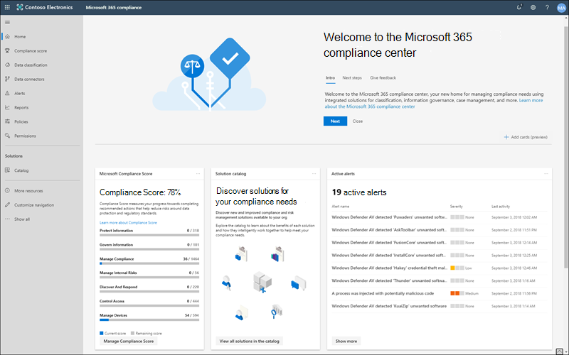
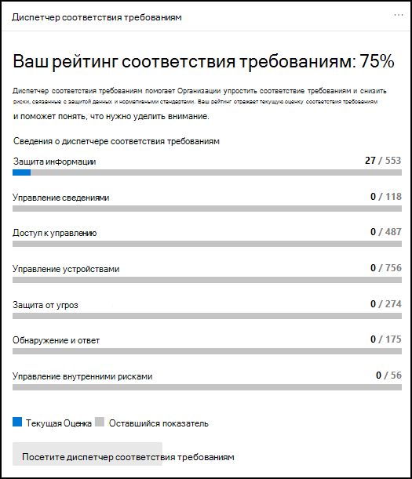
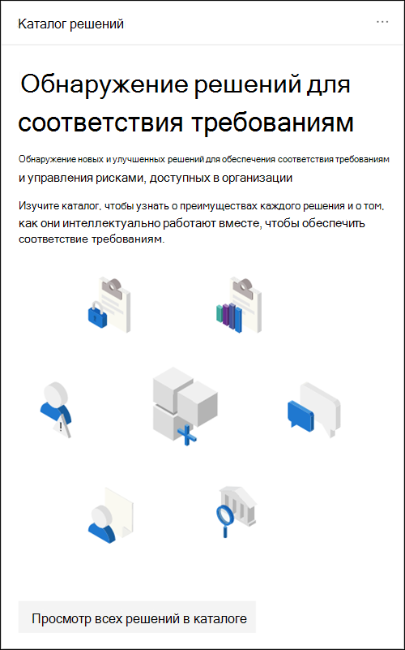
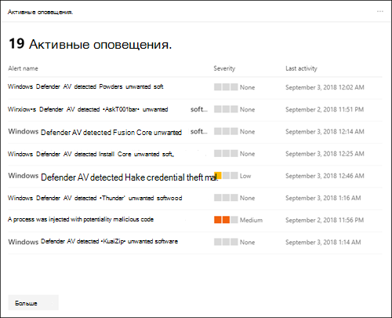
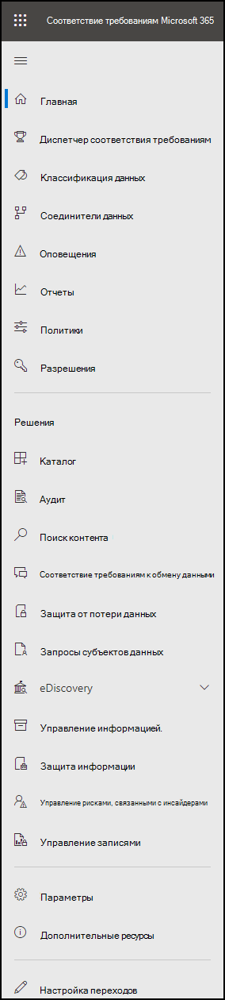
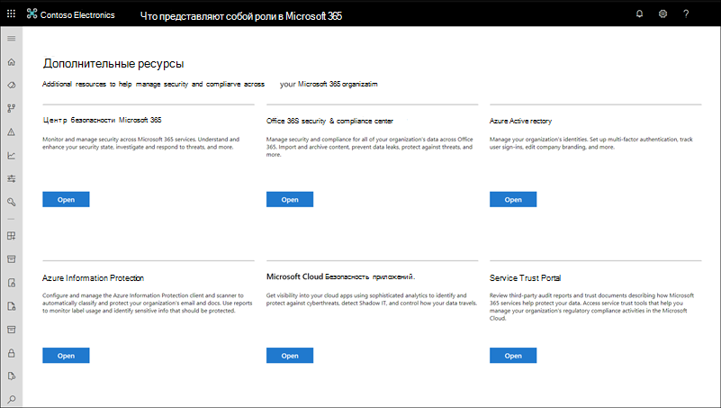

# Центр соответствия требованиям Microsoft 365Microsoft 365 compliance center

Если вы заинтересованы в обеспечении соответствия требованиям вашей организации, вы захотите понравится в [центре соответствия требованиям Microsoft 365](https://compliance.microsoft.com).If you're interested in your organization's compliance posture, you're going to love the [Microsoft 365 compliance center](https://compliance.microsoft.com). Центр соответствия требованиям Microsoft 365 обеспечивает легкий доступ к данным и средствам, необходимым для управления требованиями соответствия вашей организации.The Microsoft 365 compliance center provides easy access to the data and tools you need to manage to your organization's compliance needs.

Ознакомьтесь с этой статьей, чтобы ознакомиться с центром соответствия требованиям Microsoft 365, [о том, как получить его](#how-do-i-get-the-compliance-center), [часто задаваемые вопросы](#frequently-asked-questions)и выполнить [следующие действия](#next-steps).Read this article to get acquainted with the Microsoft 365 compliance center, [how to get it](#how-do-i-get-the-compliance-center), [frequently asked questions](#frequently-asked-questions), and your [next steps](#next-steps).

## Добро пожаловать в соответствие Microsoft 365Welcome to Microsoft 365 compliance

Когда вы впервые переходите в центр соответствия требованиям Microsoft 365, вы гритеде с помощью следующего приветственного сообщения:When you go to your Microsoft 365 compliance center for the first time, you're greeted with the following welcome message:

Плакат приветствия содержит некоторые указатели на начало работы с дальнейшими действиями и приглашением на отзыв.The welcome banner gives you some pointers on how to get started, with next steps, and an invitation for you to give us feedback.

## Раздел карточкиCard section

При первом посещении центра соответствия требованиям Microsoft 365 в разделе карточка на домашней странице показано, как ваша организация выполняет проверку соответствия требованиям к данным, какие решения доступны для Организации, а также сводку активных оповещений.When you first visit the Microsoft 365 compliance center, the card section on the home page shows you at a glance how your organization is doing with data compliance, what solutions are available for your organization, and a summary of any active alerts.

Отсюда можно выполнить следующие действия:From here, you can:

- Просмотрите карточку **диспетчера соответствия требованиям** , которая приводит к решению [диспетчера соответствия требованиям](compliance-manager.md) .Review the **Microsoft Compliance Manager** card, which leads you to the [Compliance Manager](compliance-manager.md) solution. Диспетчер соответствия требованиям помогает упростить способ управления соответствием требованиям.Compliance Manager helps simplify the way you manage compliance. Он вычисляет оценку, основанную на рисках, для выполнения рекомендуемых действий, которые снижают риск защиты данных и нормативных стандартов.It calculates a risk-based score measuring your progress toward completing recommended actions that help reduce risks around data protection and regulatory standards. Кроме того, он предоставляет возможности рабочих процессов и встроенные сопоставления элементов управления для эффективного выполнения действий по улучшению.It also provides workflow capabilities and built-in control mapping to help you efficiently carry out improvement actions.

    

- Изучите новую карточку **каталога решений** , содержащую ссылки на коллекции [интегрированных решений](microsoft-365-solution-catalog.md) , которые можно использовать для управления сквозными сценариями соответствия требованиям.Review the new **Solution catalog** card, which links to collections of [integrated solutions](microsoft-365-solution-catalog.md) you can use to help you manage end-to-end compliance scenarios. Возможности и средства решения могут включать в себя сочетание политик, оповещений, отчетов и многого другого.A solution's capabilities and tools might include a combination of policies, alerts, reports, and more.

    

- Просмотрите карточку **Активные оповещения** , в которой содержится сводный список наиболее [активных оповещений](alert-policies.md) , а также ссылку, в которой можно просмотреть более подробные сведения, такие как степень серьезности, состояние, Категория и т. д.Review the **Active alerts** card, which includes a summary of the most [active alerts](alert-policies.md) and includes a link where you can view more detailed information, such as Severity, Status, Category, and more.

    

Кроме того, можно использовать функцию **Add cards** , чтобы добавить дополнительные карты, например, один из которых показывает соответствие облачного приложения вашей организации, а другой — данные о пользователях с общими файлами, ссылки на [Cloud App Security](https://docs.microsoft.com/cloud-app-security/) или другие средства для просмотра данных.You can also use the **Add cards** feature to add additional cards, such as one showing your organization's cloud app compliance, and another showing data about users with shared files, with links to [Cloud App Security](https://docs.microsoft.com/cloud-app-security/) or other tools where you can explore data.

## Удобная навигация по функциям и возможностям обеспечения соответствия требованиямEasy navigation to more compliance features and capabilities

Помимо ссылок в карточках на домашней странице, в левой части экрана отображается область навигации, в которой можно легко получить доступ к [оповещениям](../security/office-365-security/alerts.md), [отчетам](reports-in-security-and-compliance.md), [политикам](alert-policies.md), решениям для обеспечения соответствия требованиям и т. д.In addition to links in cards on the home page, you'll see a navigation pane on the left side of the screen that gives you easy access to your [alerts](../security/office-365-security/alerts.md), [reports](reports-in-security-and-compliance.md), [policies](alert-policies.md), compliance solutions, and more. Чтобы добавить или удалить параметры настраиваемой области навигации, используйте элемент управления " **настроить навигацию** " в области навигации.To add or remove options for a customized navigation pane, use the **Customize navigation** control on the navigation pane. Откроется диалоговое окно **Настройка параметров области навигации** , чтобы можно было настроить элементы, отображаемые в области навигации.This opens the **Customize your navigation pane** settings so you can configure which items appear in the navigation pane.

|  |  |
|---------|---------|
|  | Выберите **Главная** , чтобы вернуться на главную страницу центра соответствия требованиям Microsoft 365.Select **Home** to return to the Microsoft 365 compliance center main page.   Посетите **Диспетчер соответствия требованиям** , чтобы проверить рейтинг соответствия требованиям и приступить к [управлению соответствием](compliance-manager.md) вашей организации.Visit **Compliance Manager** to check your compliance score and start [managing compliance](compliance-manager.md) for your organization.    Выберите раздел **классификация данных** , чтобы получить доступ к назначенным [классификаторам](classifier-learn-about.md), [типам конфиденциальной информации, определениям объектов](sensitive-information-type-entity-definitions.md)и обозревателям [действий](data-classification-activity-explorer.md) .Select the **Data classification** section to access [trainable classifiers](classifier-learn-about.md), [Sensitive information type entity definitions](sensitive-information-type-entity-definitions.md), content and [activity](data-classification-activity-explorer.md) explorers.    Выберите элемент **соединители данных** , чтобы [настроить соединители](archiving-third-party-data.md) для импорта и архивации данных в вашей подписке Microsoft 365.Select **Data connectors** to [configure connectors](archiving-third-party-data.md) to import and archive data in your Microsoft 365 subscription.    Переход на страницу **оповещения** для просмотра и разрешения [оповещений](alert-policies.md)Go to **Alerts** to view and resolve [alerts](alert-policies.md)   **Отчеты** для просмотра данных об [использовании и хранении подписей](sensitivity-labels.md), [политиках защиты от потери](view-the-dlp-reports.md)данных, [Общие файлы](https://docs.microsoft.com/cloud-app-security/file-filters), [сторонние приложения](https://docs.microsoft.com/cloud-app-security/discovered-apps)и т. д.Visit **Reports** to view data about [label usage and retention](sensitivity-labels.md), [DLP policy matches and overrides](view-the-dlp-reports.md), [shared files](https://docs.microsoft.com/cloud-app-security/file-filters), [third-party apps in use](https://docs.microsoft.com/cloud-app-security/discovered-apps), and more.    Перейдите к разделу **политики** , чтобы настроить политики для управления данными, управления устройствами и получения [оповещений](../security/office-365-security/alerts.md).Go to **Policies** to set up policies to govern data, manage devices, and receive [alerts](../security/office-365-security/alerts.md). Вы также можете получать доступ к политикам [защиты от потери](data-loss-prevention-policies.md) данных и политикам [хранения](retention.md) .You can also access your [DLP](data-loss-prevention-policies.md) and [retention](retention.md) policies.   Выберите **разрешения** для управления тем, кто в Организации имеет доступ к центру соответствия требованиям Microsoft 365 для просмотра контента и выполнения задач.Select **Permissions** to manage who in your organization has access to the Microsoft 365 compliance center to view content and complete tasks.    Используйте ссылки в разделе **решения** , чтобы получить доступ к решениям по обеспечению соответствия требованиям в Организации.Use the links in the **Solutions** section to access your organization's compliance solutions. Они включают:These include:    [КаталогCatalog](microsoft-365-solution-catalog.md)   Узнайте, как использовать интеллектуальные решения управления соответствием и рисками, доступные в вашей организации.Discover, learn about, and start using the intelligent compliance and risk management solutions available to your organization.    [АудитAudit](search-the-audit-log-in-security-and-compliance.md)   Используйте журнал аудита для изучения распространенных проблем поддержки и соответствия требованиям.Use the Audit log to investigate common support and compliance issues.    [Поиск контентаContent search](search-for-content.md)   Поиск контента используется для быстрого поиска электронной почты в почтовых ящиках Exchange, документов на сайтах SharePoint и в папках OneDrive и бесед в Microsoft Teams и Skype для бизнеса.Use Content search to quickly find email in Exchange mailboxes, documents in SharePoint sites and OneDrive locations, and instant messaging conversations in Microsoft Teams and Skype for Business.    [Соответствие требованиям к обмену даннымиCommunication compliance](communication-compliance.md)   Минимизация угроз для общения за счет автоматической записи недопустимых сообщений, выяснения возможных нарушений политики и выполнения действий по исправлению.Minimize communication risks by automatically capturing inappropriate messages, investigating possible policy violations, and taking steps to remediate.    [Исследования данныхData investigations](overview-data-investigations.md)   Поиск по расположениям контента для определения конфиденциальных, вредоносных или неправильно размещенных данных в Microsoft 365, поэтому вы можете исследовать и устранять любые происшествия, например, проявление данных.Search across content locations to identify sensitive, malicious, or misplaced data across Microsoft 365 so you can investigate and remediate any incidents, such as data spillage.    [Защита от потери данныхData loss prevention](data-loss-prevention-policies.md)   Обнаруживать конфиденциальный контент, используемый и общий доступ в Организации, в облаке и на устройствах, а также помогает предотвратить случайную потерю данных.Detect sensitive content as it's used and shared throughout your organization, in the cloud and on devices, and helps prevent accidental data loss.    [Запросы субъектов данныхData subject requests](manage-gdpr-data-subject-requests-with-the-dsr-case-tool.md)   Найдите и экспортируйте персональные данные пользователя, которые помогут вам ответить на запросы субъектов данных для общего регулирования безопасности данных (GDPR).Find and export a user's personal data to help you respond to data subject requests for the General Data Protection Regulation (GDPR).    [Обнаружение электронных данныхeDiscovery](overview-ediscovery-20.md)   Разверните этот раздел, чтобы использовать основные и расширенные функции обнаружения электронных данных для сохранения, сбора, проверки, анализа и экспорта содержимого, которое отвечает на внутренние и внешние расследования вашей организации.Expand this section to use the core and Advanced eDiscovery for preserving, collecting, reviewing, analyzing, and exporting content that's responsive to your organization's internal and external investigations.    [Управление сведениямиInformation governance](manage-information-governance.md)   Управление жизненным циклом контента с помощью компонентов для импорта, хранения и классификации важных данных, чтобы можно было хранить нужные данные и удалять их.Manage your content lifecycle using features to import, store, and classify business-critical data so you can keep what you need and delete what you don't.    [Защита информацииInformation protection](information-protection.md)   Обнаруживать, классифицировать и защищать конфиденциальный и важный от бизнеса контент в течение всего жизненного цикла вашей организации.Discover, classify, and protect sensitive and business-critical content throughout its lifecycle across your organization.    [Внутреннее управление рискамиInsider risk management](insider-risk-management.md)   Определите рискованные действия в Организации, чтобы помочь вам быстро определить, исследовать и принять меры по угрозам и угрозам для участников.Detect risky activity across your organization to help you quickly identify, investigate, and take action on insider risks and threats.    [управление записямиRecords management](records-management.md)   Автоматизация и упрощение расписания хранения нормативных, юридических и важных для бизнеса записей в Организации.Automate and simplify the retention schedule for regulatory, legal and business-critical records in your organization.

## Как получить центр соответствия требованиям?How do I get the compliance center?

- Если у вас еще нет нового центра соответствия требованиям Microsoft 365, его можно будет вскоре получить.If you don't have the new Microsoft 365 compliance center already, you'll have it soon. Центр соответствия требованиям Microsoft 365, как правило, теперь доступен клиентам SKU Microsoft 365.The Microsoft 365 compliance center is generally available now to Microsoft 365 SKU customers.

- Чтобы посетить центр соответствия требованиям Microsoft 365, выполните вход в систему с глобальным администратором, администратором соответствия требованиям или администратором данных соответствия требованиям [https://compliance.microsoft.com](https://compliance.microsoft.com) .To visit the Microsoft 365 compliance center, as a global administrator, compliance administrator, or compliance data administrator go to [https://compliance.microsoft.com](https://compliance.microsoft.com) and sign in.

## Вопросы и ответыFrequently asked questions

**Почему в центре безопасности & соответствия требованиям выполняются некоторые задачи, например определение определенных политик?****Why am I taken to the Security & Compliance Center to complete some tasks, such as defining certain policies?**

Мы по-прежнему разрабатываем центр соответствия требованиям Microsoft 365, и в течение ближайших месяцев мы добавим дополнительные функции и решения.We're still developing the Microsoft 365 compliance center, and we add more functionality and solutions over the coming months. Кроме того, в центре безопасности & соответствия требованиям () необходимо выполнить несколько задач [https://protection.office.com](https://protection.office.com) .In the meantime, there are a few tasks that must be completed in the Security & Compliance Center ([https://protection.office.com](https://protection.office.com)). В этих случаях вы будете автоматически направлены в расположение, в котором можно выполнить поставленную задачу, например создание или изменение политики контроля.In those cases, you'll be directed automatically to the location where you can complete the task at hand, such as creating or editing a supervision policy.

**Почему я еще не вижу нового центра соответствия требованиям Microsoft 365?****Why don't I see the new Microsoft 365 compliance center yet?**

Сначала убедитесь, что у вас есть соответствующие лицензии и разрешения.First, make sure that you have the appropriate licenses and permissions. Затем войдите в систему [https://compliance.microsoft.com](https://compliance.microsoft.com) .Then, sign in at [https://compliance.microsoft.com](https://compliance.microsoft.com). Если вы еще не видите новый центр соответствия требованиям, вы будете в ближайшее время.If you don't see the new compliance center yet, you'll have it soon.

**Некоторые функции соответствия требованиям не доступны в центре соответствия требованиям Microsoft 365. Чем я занимаюсь?****Some of my compliance features aren't available in the Microsoft 365 compliance center. What do I do?**

Мы по-прежнему добавляем функциональные возможности в центр соответствия требованиям Microsoft 365.We're still adding functionality to the Microsoft 365 compliance center. Если вы не можете найти чего-либо, например, поиск в журнале аудита, используйте центр безопасности & соответствия требованиям ( [https://protection.office.com](https://protection.office.com) ).If you can't find something, such as audit log search, use the Security & Compliance Center ([https://protection.office.com](https://protection.office.com)). Конфигурации сохраняются в существующем центре безопасности & соответствия требованиям и автоматически в новом центре соответствия требованиям Microsoft 365.Your configurations are saved in both the existing Security & Compliance Center and in the new Microsoft 365 compliance center automatically.

Чтобы перейти в нее, в центре соответствия требованиям Microsoft 365 в области навигации в левой части экрана выберите пункт **Дополнительные ресурсы** , а затем в разделе **Центр безопасности & безопасности Office 365** нажмите кнопку **Открыть**.To go there, in the Microsoft 365 compliance center, in the navigation pane on the left side of the screen, choose **More resources** , and then, under **Office 365 Security & Compliance Center** , choose **Open**.

## Дальнейшие действияNext steps

- **Посетите диспетчер соответствия требованиям Майкрософт** , чтобы увидеть ваш рейтинг соответствия требованиям и приступить к управлению соответствием вашей организации.**Visit Microsoft Compliance Manager** to see your compliance score and start managing compliance for your organization. Чтобы узнать больше, ознакомьтесь со статьей [Диспетчер соответствия требованиям](compliance-manager.md).To learn more, see [Compliance Manager](compliance-manager.md).

- **Настройте политики управления рисками** , чтобы свести к минимуму внутренние риски и обеспечить возможность обнаружения, исследования и выполнения действий для рискованных действий в Организации.**Configure insider risk management policies** to help minimize internal risks and enable you to detect, investigate, and take action for risky activities in your organization. Ознакомьтесь с [Разучастником управление рисками](insider-risk-management.md).See [Insider risk management](insider-risk-management.md).

- **Изучите политики защиты от потери данных в Организации** и внесите требуемые изменения по мере необходимости.**Review your organization's data loss prevention policies** and make required changes as necessary. Чтобы узнать больше о политиках защиты от потери данных, ознакомьтесь со статьей [Обзор политик защиты от потери данных](data-loss-prevention-policies.md).To learn more about, see [Overview of data loss prevention policies](data-loss-prevention-policies.md).

- **Познакомьтесь с настройками Microsoft Cloud App Security**.**Get acquainted with and set up Microsoft Cloud App Security**. [В разделе Краткое руководство: Начало работы с Microsoft Cloud App Security](https://docs.microsoft.com/cloud-app-security/getting-started-with-cloud-app-security).See [Quickstart: Get started with Microsoft Cloud App Security](https://docs.microsoft.com/cloud-app-security/getting-started-with-cloud-app-security).

- **Узнайте о политиках обеспечения соответствия требованиям и их создании** , чтобы быстро определить и исправить нарушения политики корпоративных кодов.**Learn about and create communication compliance policies** to quickly identify and remediate corporate code-of-conduct policy violations. Ознакомьтесь [с требованиями к связи в Microsoft 365](communication-compliance.md).See [Communication compliance in Microsoft 365](communication-compliance.md).

- **Посетите центр соответствия требованиям Microsoft 365** и обязательно изучите все оповещения или потенциальные риски, которые возникнут.**Visit your Microsoft 365 compliance center often** , and make sure to review any alerts or potential risks that arise. Перейдите на страницу [https://compliance.microsoft.com](https://compliance.microsoft.com) и войдите.Go to [https://compliance.microsoft.com](https://compliance.microsoft.com) and sign in.
