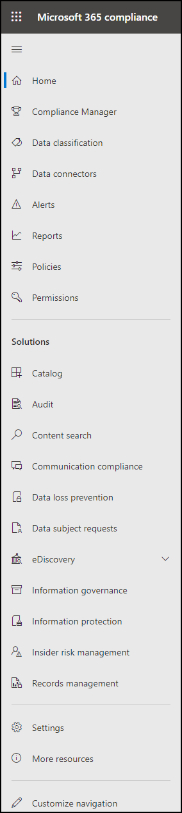
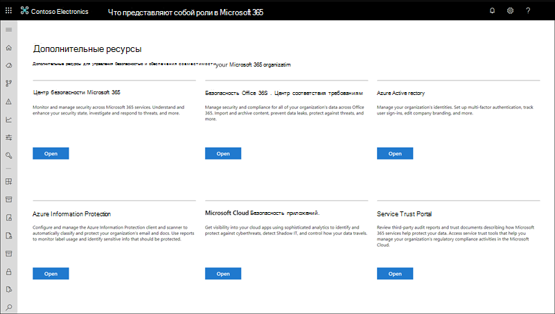

# Центр соответствия требованиям Microsoft 365Microsoft 365 compliance center

Если вы заинтересованы в состоянии соответствия требованиям вашей организации, вам понравится Центр соответствия [требованиям Microsoft 365.](https://compliance.microsoft.com)If you're interested in your organization's compliance posture, you're going to love the [Microsoft 365 compliance center](https://compliance.microsoft.com). Центр соответствия требованиям Microsoft 365 обеспечивает простой доступ к данным и инструментам, которые необходимы для управления соответствием требованиям вашей организации.The Microsoft 365 compliance center provides easy access to the data and tools you need to manage to your organization's compliance needs.

Прочитайте эту статью, чтобы ознакомиться с Центром соответствия требованиям Microsoft 365, узнать, как получить [ее,](#frequently-asked-questions)часто задайте вопросы и дальнейшие [действия.](#next-steps)Read this article to get acquainted with the Microsoft 365 compliance center, [how to get it](#how-do-i-get-the-compliance-center), [frequently asked questions](#frequently-asked-questions), and your [next steps](#next-steps).

## Добро пожаловать в службу соответствия требованиям Microsoft 365Welcome to Microsoft 365 compliance

Когда вы впервые будете перейти в Центр соответствия требованиям Microsoft 365, вас приветствует следующее приветствие:When you go to your Microsoft 365 compliance center for the first time, you're greeted with the following welcome message:

Баннер приветствия дает вам некоторые указатели на то, как начать работу, с последующими действиями и приглашением для вас предоставить нам отзыв.The welcome banner gives you some pointers on how to get started, with next steps, and an invitation for you to give us feedback.

## Раздел карточкиCard section

При первом посещении Центра соответствия требованиям Microsoft 365 в разделе карточки на домашней странице показано, как ваша организация работает с соответствием требованиям данных, какие решения доступны для вашей организации, а также сводка активных оповещений.When you first visit the Microsoft 365 compliance center, the card section on the home page shows you at a glance how your organization is doing with data compliance, what solutions are available for your organization, and a summary of any active alerts.

Здесь вы можете:From here, you can:

- Просмотрите **карточку диспетчера соответствия требованиям (Майкрософт),** которая приведет вас к решению [диспетчера соответствия](compliance-manager.md) требованиям.Review the **Microsoft Compliance Manager** card, which leads you to the [Compliance Manager](compliance-manager.md) solution. Диспетчер соответствия требованиям помогает упростить управление соответствием требованиям.Compliance Manager helps simplify the way you manage compliance. Он вычисляет оценку на основе риска, измеряя ход выполнения рекомендуемых действий, которые помогают снизить риски, связанные с защитой данных и нормативными стандартами.It calculates a risk-based score measuring your progress toward completing recommended actions that help reduce risks around data protection and regulatory standards. Кроме того, он предоставляет возможности рабочего процесса и встроенное сопоставление управления для эффективного выполнения действий по улучшению.It also provides workflow capabilities and built-in control mapping to help you efficiently carry out improvement actions.

    

- Просмотрите новую **карточку каталога** решений, которая содержит ссылки на коллекции интегрированных решений, которые можно использовать для управления комплексными сценариями соответствия требованиям. Review the new **Solution catalog** card, which links to collections of [integrated solutions](microsoft-365-solution-catalog.md) you can use to help you manage end-to-end compliance scenarios. Возможности и средства решения могут включать сочетание политик, оповещений, отчетов и других средств.A solution's capabilities and tools might include a combination of policies, alerts, reports, and more.

    

- Просмотрите  карточку активных оповещений,  которая содержит сводку по наиболее активным оповещениям и ссылку, где можно просмотреть более подробные сведения, такие как серьезность, состояние, категория и другие.Review the **Active alerts** card, which includes a summary of the most [active alerts](alert-policies.md) and includes a link where you can view more detailed information, such as Severity, Status, Category, and more.

    

Вы также можете  использовать функцию "Добавить карточки", чтобы добавить дополнительные карточки, например карточки с отображением соответствия облачных приложений вашей организации, а другую — данные о пользователях с общими файлами, а также ссылки на [Cloud App Security](https://docs.microsoft.com/cloud-app-security/) или другие инструменты, с помощью которых можно изучить данные.You can also use the **Add cards** feature to add additional cards, such as one showing your organization's cloud app compliance, and another showing data about users with shared files, with links to [Cloud App Security](https://docs.microsoft.com/cloud-app-security/) or other tools where you can explore data.

## Простая навигация по дополнительным функциям и возможностям соответствия требованиямEasy navigation to more compliance features and capabilities

Помимо ссылок на карточках на домашней странице, в левой части экрана вы увидите области навигации, которая обеспечивает простой доступ к [оповещениям,](../security/office-365-security/alerts.md)отчетам, политикам, решениям для обеспечения соответствия требованиям и многому другому. In addition to links in cards on the home page, you'll see a navigation pane on the left side of the screen that gives you easy access to your [alerts](../security/office-365-security/alerts.md), [reports](reports-in-security-and-compliance.md), [policies](alert-policies.md), compliance solutions, and more. Чтобы добавить или удалить параметры настраиваемой области навигации, используйте в области навигации параметр **"Настройка** навигации".To add or remove options for a customized navigation pane, use the **Customize navigation** control on the navigation pane. Откроется настройка **параметров** области навигации, чтобы можно было настроить элементы, которые отображаются в области навигации.This opens the **Customize your navigation pane** settings so you can configure which items appear in the navigation pane.

|  |  |
|---------|---------|
|  | Выберите **"Главная",** чтобы вернуться на главную страницу Центра соответствия требованиям Microsoft 365.Select **Home** to return to the Microsoft 365 compliance center main page.   Посетите **диспетчер соответствия требованиям,** чтобы проверить свой показатель соответствия требованиям и начать [управление](compliance-manager.md) соответствием требованиям в вашей организации.Visit **Compliance Manager** to check your compliance score and start [managing compliance](compliance-manager.md) for your organization.    Выберите раздел **классификации** данных, чтобы получить доступ к обучаемым классификаторам, определениям сущности типа конфиденциальной информации, контенту и [проводникам](data-classification-activity-explorer.md) действий. Select the **Data classification** section to access [trainable classifiers](classifier-learn-about.md), [Sensitive information type entity definitions](sensitive-information-type-entity-definitions.md), content and [activity](data-classification-activity-explorer.md) explorers.    Выберите **соединители данных,** [чтобы настроить соединители](archiving-third-party-data.md) для импорта и архива данных в подписке На Microsoft 365.Select **Data connectors** to [configure connectors](archiving-third-party-data.md) to import and archive data in your Microsoft 365 subscription.    Перейдите **в "Оповещения"** для просмотра и разрешения [оповещений](alert-policies.md)Go to **Alerts** to view and resolve [alerts](alert-policies.md)   Посетите **раздел "Отчеты",** чтобы просмотреть данные об использовании и хранении меток, совпадениях и переопределениях политики [DLP,](view-the-dlp-reports.md)общих файлах, приложениях сторонних продуктов [и](https://docs.microsoft.com/cloud-app-security/discovered-apps)других материалах.Visit **Reports** to view data about [label usage and retention](sensitivity-labels.md), [DLP policy matches and overrides](view-the-dlp-reports.md), [shared files](https://docs.microsoft.com/cloud-app-security/file-filters), [third-party apps in use](https://docs.microsoft.com/cloud-app-security/discovered-apps), and more.    Перейдите **в "Политики",** чтобы настроить политики для управления данными, управления устройствами и получения [оповещений.](../security/office-365-security/alerts.md)Go to **Policies** to set up policies to govern data, manage devices, and receive [alerts](../security/office-365-security/alerts.md). Вы также можете получить доступ к [политикам DLP](data-loss-prevention-policies.md) [и](retention.md) хранения.You can also access your [DLP](data-loss-prevention-policies.md) and [retention](retention.md) policies.   Выберите **разрешения для** управления доступом к Центру соответствия требованиям Microsoft 365 для просмотра контента и выполнения задач.Select **Permissions** to manage who in your organization has access to the Microsoft 365 compliance center to view content and complete tasks.    Используйте ссылки в разделе **"Решения"** для доступа к решениям для обеспечения соответствия требованиям в организации.Use the links in the **Solutions** section to access your organization's compliance solutions. Они включают:These include:    [КаталогCatalog](microsoft-365-solution-catalog.md)   Узнайте, как использовать интеллектуальные решения для обеспечения соответствия требованиям и управления рисками, доступные в вашей организации.Discover, learn about, and start using the intelligent compliance and risk management solutions available to your organization.    [AuditAudit](search-the-audit-log-in-security-and-compliance.md)   Используйте журнал аудита для изучения распространенных проблем с поддержкой и соответствием требованиям.Use the Audit log to investigate common support and compliance issues.    [Поиск контентаContent search](search-for-content.md)   Поиск контента используется для быстрого поиска электронной почты в почтовых ящиках Exchange, документах на сайтах SharePoint и в расположениях OneDrive, а также для обмена мгновенными сообщениями в Microsoft Teams и Skype для бизнеса.Use Content search to quickly find email in Exchange mailboxes, documents in SharePoint sites and OneDrive locations, and instant messaging conversations in Microsoft Teams and Skype for Business.    [Соответствие требованиям к обмену даннымиCommunication compliance](communication-compliance.md)   Свести к минимуму риски для связи путем автоматического захвата недопустимых сообщений, расследования возможных нарушений политики и принятия мер по исправлению.Minimize communication risks by automatically capturing inappropriate messages, investigating possible policy violations, and taking steps to remediate.    [Защита от потери данныхData loss prevention](data-loss-prevention-policies.md)   Обнаруживать конфиденциальное содержимое по мере его использования и совместного использования во всей организации, в облаке и на устройствах, а также помогает предотвратить случайную потерю данных.Detect sensitive content as it's used and shared throughout your organization, in the cloud and on devices, and helps prevent accidental data loss.    [Запросы субъектов данныхData subject requests](manage-gdpr-data-subject-requests-with-the-dsr-case-tool.md)   Поиск и экспорт персональных данных пользователя, которые помогут вам отвечать на запросы субъектов данных в Общем регламенте по защите данных (GDPR).Find and export a user's personal data to help you respond to data subject requests for the General Data Protection Regulation (GDPR).    [Обнаружение электронных данныхeDiscovery](overview-ediscovery-20.md)   Разоберите этот раздел, чтобы использовать основные средства и Advanced eDiscovery для сохранения, сбора, просмотра, анализа и экспорта контента, который реагирует на внутренние и внешние расследования в организации.Expand this section to use the core and Advanced eDiscovery for preserving, collecting, reviewing, analyzing, and exporting content that's responsive to your organization's internal and external investigations.    [Управление информациейInformation governance](manage-information-governance.md)   Управляйте жизненным циклом контента, используя функции для импорта, хранения и классификации критически важных бизнес-данных, чтобы сохранить необходимые данные и удалить то, что не нужно.Manage your content lifecycle using features to import, store, and classify business-critical data so you can keep what you need and delete what you don't.    [Защита информацииInformation protection](information-protection.md)   Обнаружение, классификация и защита конфиденциального и критически важного для бизнеса содержимого на протяжении всего жизненного цикла организации.Discover, classify, and protect sensitive and business-critical content throughout its lifecycle across your organization.    [Управление рисками, связанными с инсайдерамиInsider risk management](insider-risk-management.md)   Выявляйте рискованные действия в организации, чтобы помочь вам быстро выявлять, исследовать и принимать меры по угрозам и угрозам внутри организации.Detect risky activity across your organization to help you quickly identify, investigate, and take action on insider risks and threats.    [Управление записямиRecords management](records-management.md)   Автоматизация и упрощение расписания хранения нормативных, юридических и критически важных для бизнеса записей в организации.Automate and simplify the retention schedule for regulatory, legal and business-critical records in your organization.

## Как получить Центр соответствия требованиям?How do I get the compliance center?

- Если у вас еще нет нового Центра соответствия требованиям Microsoft 365, он появится в ближайшее время.If you don't have the new Microsoft 365 compliance center already, you'll have it soon. Центр соответствия требованиям Microsoft 365 теперь доступен пользователям SKU Microsoft 365.The Microsoft 365 compliance center is generally available now to Microsoft 365 SKU customers.

- Чтобы посетить Центр соответствия требованиям Microsoft 365, войдите и войдите в нее с учетной записью глобального администратора, администратора соответствия требованиям или администратора данных соответствия [https://compliance.microsoft.com](https://compliance.microsoft.com) требованиям.To visit the Microsoft 365 compliance center, as a global administrator, compliance administrator, or compliance data administrator go to [https://compliance.microsoft.com](https://compliance.microsoft.com) and sign in.

## Вопросы и ответыFrequently asked questions

**Почему я перенаюсь в Центр безопасности & соответствия требованиям для выполнения некоторых задач, таких как определение определенных политик?****Why am I taken to the Security & Compliance Center to complete some tasks, such as defining certain policies?**

Мы по-прежнему разрабатываем Центр соответствия требованиям Microsoft 365 и добавим дополнительные функции и решения в ближайшие месяцы.We're still developing the Microsoft 365 compliance center, and we add more functionality and solutions over the coming months. В то же время в Центре безопасности и соответствия требованиям (Security & Compliance Center) необходимо выполнять несколько задач. [https://protection.office.com](https://protection.office.com)In the meantime, there are a few tasks that must be completed in the Security & Compliance Center ([https://protection.office.com](https://protection.office.com)). В таких случаях вы будете автоматически перенаправированы в расположение, в котором можно выполнить задачу, например создать или изменить политику контроля.In those cases, you'll be directed automatically to the location where you can complete the task at hand, such as creating or editing a supervision policy.

**Почему я еще не вижу новый Центр соответствия требованиям Microsoft 365?****Why don't I see the new Microsoft 365 compliance center yet?**

Сначала убедитесь, что у вас есть соответствующие лицензии и разрешения.First, make sure that you have the appropriate licenses and permissions. Затем во sign in at [https://compliance.microsoft.com](https://compliance.microsoft.com) .Then, sign in at [https://compliance.microsoft.com](https://compliance.microsoft.com). Если вы еще не видите новый Центр соответствия требованиям, он появится в ближайшее время.If you don't see the new compliance center yet, you'll have it soon.

**Некоторые из моих функций соответствия требованиям недоступны в Центре соответствия требованиям Microsoft 365. Чем я занимаюсь?****Some of my compliance features aren't available in the Microsoft 365 compliance center. What do I do?**

Мы по-прежнему добавляем функции в Центр соответствия требованиям Microsoft 365.We're still adding functionality to the Microsoft 365 compliance center. Если вы не можете найти что-либо, например поиск в журнале аудита, используйте Центр безопасности & соответствия требованиям ( [https://protection.office.com](https://protection.office.com) ).If you can't find something, such as audit log search, use the Security & Compliance Center ([https://protection.office.com](https://protection.office.com)). Конфигурации сохраняются как в существующем Центре безопасности & соответствия требованиям, так и в новом Центре соответствия требованиям Microsoft 365 автоматически.Your configurations are saved in both the existing Security & Compliance Center and in the new Microsoft 365 compliance center automatically.

To go there, in the Microsoft 365 compliance center, in the navigation pane on the left side of the screen, choose **More resources,** and then, under **Office 365 Security & Compliance Center,** choose **Open**.To go there, in the Microsoft 365 compliance center, in the navigation pane on the left side of the screen, choose **More resources**, and then, under **Office 365 Security & Compliance Center**, choose **Open**.

## Дальнейшие действияNext steps

- **Посетите диспетчер соответствия требованиям (Майкрософт),** чтобы узнать свой показатель соответствия требованиям и начать управление соответствием требованиям в вашей организации.**Visit Microsoft Compliance Manager** to see your compliance score and start managing compliance for your organization. Дополнительные узнать см. в [диспетчере соответствия требованиям.](compliance-manager.md)To learn more, see [Compliance Manager](compliance-manager.md).

- **Настройте политики управления внутренними** рисками, чтобы помочь свести к минимуму внутренние риски и позволить обнаруживать, исследовать и принимать меры для рискованных действий в организации.**Configure insider risk management policies** to help minimize internal risks and enable you to detect, investigate, and take action for risky activities in your organization. См. [руководство по управлению рисками для оценки рисков.](insider-risk-management.md)See [Insider risk management](insider-risk-management.md).

- **Просмотрите политики защиты от потери** данных в организации и при необходимости внести необходимые изменения.**Review your organization's data loss prevention policies** and make required changes as necessary. Дополнительные сведения см. в обзоре политик защиты от [потери данных.](data-loss-prevention-policies.md)To learn more about, see [Overview of data loss prevention policies](data-loss-prevention-policies.md).

- **Знакомство и настройка Microsoft Cloud App Security.****Get acquainted with and set up Microsoft Cloud App Security**. См. [краткое начало работы с Microsoft Cloud App Security.](https://docs.microsoft.com/cloud-app-security/getting-started-with-cloud-app-security)See [Quickstart: Get started with Microsoft Cloud App Security](https://docs.microsoft.com/cloud-app-security/getting-started-with-cloud-app-security).

- **Узнайте о политиках соответствия** требованиям к коммуникациям и создайте их для быстрого выявления и устранения нарушений корпоративного кода поведения.**Learn about and create communication compliance policies** to quickly identify and remediate corporate code-of-conduct policy violations. См. [соответствие требованиям к коммуникациям в Microsoft 365.](communication-compliance.md)See [Communication compliance in Microsoft 365](communication-compliance.md).

- Часто посетите Центр соответствия **требованиям Microsoft 365** и обязательно просмотрите все оповещения или потенциальные риски.**Visit your Microsoft 365 compliance center often**, and make sure to review any alerts or potential risks that arise. Перейдите на страницу [https://compliance.microsoft.com](https://compliance.microsoft.com) и войдите.Go to [https://compliance.microsoft.com](https://compliance.microsoft.com) and sign in.
