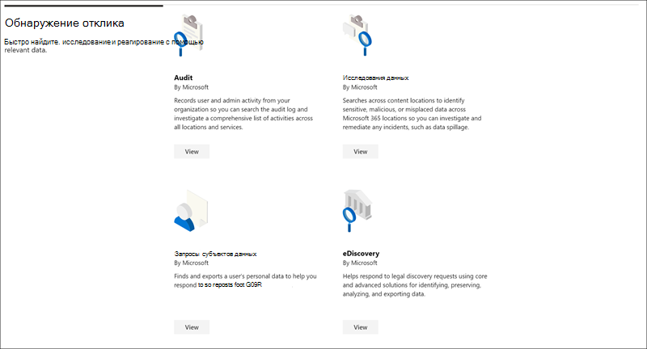

# Каталог решений Microsoft 365Microsoft 365 solution catalog

Вы ищете способ быстрого начала работы с задачами соответствия требованиям в Microsoft 365?Are you looking for a way to quickly get started with compliance tasks in Microsoft 365? Ознакомьтесь с [каталогом Microsoft 365](https://compliance.microsoft.com/solutioncatalog) решений для обнаружения, получения и быстрого начала работы с решениями по обеспечению соответствия требованиям и управлению рисками.Check out the [Microsoft 365 solution catalog](https://compliance.microsoft.com/solutioncatalog) to discover, learn, and quickly get started with compliance and risk management solutions.

Решения для Microsoft 365 являются наборами интегрированных возможностей, которые можно использовать для управления сценариями соответствия требованиям.Compliance solutions in Microsoft 365 are collections of integrated capabilities you can use to help you manage end-to-end compliance scenarios. Возможности и средства решения могут включать сочетание политик, оповещений, отчетов и других функций.A solution's capabilities and tools might include a combination of policies, alerts, reports, and more.

Прочитайте эту статью, чтобы ознакомиться с новым каталогом решений в [Центр соответствия требованиям Microsoft 365,](#how-do-i-get-this)как его [получить,](#frequently-asked-questions)часто задав вопросы, и ваши [дальнейшие действия](#next-steps).Read this article to get acquainted with the new solution catalog in the Microsoft 365 compliance center, [how to get it](#how-do-i-get-this), [frequently asked questions](#frequently-asked-questions), and your [next steps](#next-steps).

## Организация каталогаCatalog organization

Каталог решений состоит из разделов, содержащих информационные карточки для каждого решения соответствия требованиям, доступных в Microsoft 365 подписки.The solution catalog is organized into sections that contain information cards for each compliance solution available in your Microsoft 365 subscription. Каждый раздел содержит карточки решений, сгруппив их по области соответствия требованиям.Each section contains cards for solutions grouped by compliance area.

При выборе **карты "Просмотр** решения" вы увидите подробные сведения о решении соответствия требованиям и о том, как начать работу.When you select **View** for a solution card, you'll see detailed information about the compliance solution and how to get started. Эти сведения включают обзор, требования к предварительной конфигурации, ресурсы обучения, элементы управления, позволяющие прикрепить карту к области навигации, а также возможность обмена решением в качестве ссылки, электронной почты или Microsoft Teams сообщения.This information includes an overview, pre-configuration requirements, learning resources, controls that allow you to pin the card to the navigation pane, and an option to share the solution as a link, email, or Microsoft Teams message.

## Раздел управления & защиты информацииInformation protection & governance section

В **разделе управление &** информации показано, как можно использовать решения Microsoft 365 для защиты и управления данными в организации.The **Information protection & governance** section shows you at a glance how you can use Microsoft 365 compliance solutions to protect and govern data in your organization.

Здесь вы увидите карты для следующих решений:From here, you'll see cards for the following solutions:

- [Предотвращение потери](dlp-learn-about-dlp.md)данных: обнаружение конфиденциального контента по мере его использования и общего использования во всей организации, в облаке и на устройствах и помогает предотвратить случайную потерю данных.[Data loss prevention](dlp-learn-about-dlp.md): Detects sensitive content as it's used and shared throughout your organization, in the cloud and on devices, and helps prevent accidental data loss.
- [Управление информацией.](manage-information-governance.md)Управляет жизненным циклом контента с помощью решений для импорта, хранения и классификации критически важных для бизнеса данных, чтобы вы могли хранить необходимые данные и удалять то, что не нужно.[Information governance](manage-information-governance.md): Manages your content lifecycle using solutions to import, store, and classify business-critical data so you can keep what you need and delete what you don't.
- [Защита информации:](information-protection.md)обнаружение, классификация и защита конфиденциального и критически важного для бизнеса контента на протяжении всего жизненного цикла организации.[Information protection](information-protection.md): Discovers, classifies, and protects sensitive and business-critical content throughout its lifecycle across your organization.
- [Управление записями.](records-management.md)Использование интеллектуальной классификации для автоматизации и упрощения расписания хранения нормативных, юридических и бизнес-критических записей в организации.[Records management](records-management.md): Uses intelligent classification to automate and simplify the retention schedule for regulatory, legal, and business-critical records in your organization.

## Раздел управление рисками на инсайдерской сторонеInsider risk management section

В разделе Управление рисками **insider** на домашней странице сразу показано, как организация может выявлять, анализировать и принимать меры по внутренним рискам, прежде чем они причинят вред.The **Insider risk management** section on the home page shows you at a glance how your organization can identify, analyze, and take action on internal risks before they cause harm.

Здесь вы увидите карты для следующих решений:From here, you'll see cards for the following solutions:

- [Соответствие требованиям](communication-compliance.md)связи. Минимизируют риски связи, помогая автоматически фиксировать недопустимые сообщения, исследовать возможные нарушения политики и принимать меры для минимизации вреда.[Communication compliance](communication-compliance.md): Minimizes communication risks by helping you automatically capture inappropriate messages, investigate possible policy violations, and take steps to minimize harm.
- [Управление рисками](insider-risk-management.md)на основе инсайдерской информации. Обнаружение рисков в вашей организации, чтобы помочь вам быстро выявлять, исследовать и принимать меры по рискам и угрозам, исходя изнутри.[Insider risk management](insider-risk-management.md): Detect risky activity across your organization to help you quickly identify, investigate, and take action on insider risks and threats.

## Раздел & обнаруженияDiscovery & response section

В **разделе &** обнаружения на домашней странице показано, как организация может быстро находить, исследовать и реагировать на проблемы с соответствием соответствующим данным.The **Discovery & response** section on the home page shows you at a glance how your organization can quickly find, investigate, and respond to compliance issues with relevant data.

Здесь вы увидите карты для следующих решений:From here, you'll see cards for the following solutions:

- [Аудит](search-the-audit-log-in-security-and-compliance.md). Записи действий пользователя и администратора в организации, чтобы вы могли искать журнал аудита и исследовать полный список действий во всех расположениях и службах.[Audit](search-the-audit-log-in-security-and-compliance.md): Records user and admin activity from your organization so you can search the audit log and investigate a comprehensive list of activities across all locations and services.
- [Запросы субъекта](/compliance/regulatory/gdpr-manage-gdpr-data-subject-requests-with-the-dsr-case-tool)данных. Находит и экспортирует личные данные пользователя, чтобы помочь вам отвечать на запросы субъекта данных для GDPR.[Data subject requests](/compliance/regulatory/gdpr-manage-gdpr-data-subject-requests-with-the-dsr-case-tool): Finds and exports a user's personal data to help you respond to data subject requests for GDPR.
- [Обнаружение электронных данныхeDiscovery](manage-legal-investigations.md)
    - [Основные](./get-started-core-ediscovery.md)сведения об обнаружении: поиск в различных расположениях контента для выявления, сохранения и экспорта данных в ответ на запросы об обнаружении юридических данных и случаи обнаружения электронных данных.[Core eDiscovery](./get-started-core-ediscovery.md): Searches across content locations to identify, preserve, and export data in response to legal discovery requests and eDiscovery cases.
    - [Advanced eDiscovery:](overview-ediscovery-20.md)использует возможности обнаружения электронных данных, предоставляя интеллектуальную аналитику и машинное обучение, чтобы помочь вам в дальнейшем анализировать данные, соответствующие запросам на обнаружение.[Advanced eDiscovery](overview-ediscovery-20.md): Builds on eDiscovery capabilities by providing intelligent analytics and  machine learning to help you further analyze data that's relevant to discovery requests.

## Как это получить?How do I get this?

Чтобы посетить каталог Microsoft 365 решений, войдите и войдите в качестве глобального администратора, администратора соответствия требованиям или [https://compliance.microsoft.com](https://compliance.microsoft.com) администратора данных соответствия требованиям.To visit the Microsoft 365 solution catalog, go to [https://compliance.microsoft.com](https://compliance.microsoft.com) and sign in as a global administrator, compliance administrator, or compliance data administrator. Выберите **Каталог** в области навигации слева от экрана, чтобы открыть домашную страницу каталога.Select **Catalog** in the navigation pane on the left side of the screen to open the catalog home page.

## Вопросы и ответыFrequently asked questions

**Почему я не вижу каталог Microsoft 365 решений?****Why don't I see the Microsoft 365 solution catalog?**

Во-первых, убедитесь, что у вас есть соответствующие лицензии и разрешения.First, make sure that you have the appropriate licenses and permissions. Затем впишитесь в качестве [https://compliance.microsoft.com](https://compliance.microsoft.com) глобального администратора, администратора соответствия требованиям или администратора данных соответствия требованиям.Then, sign in at [https://compliance.microsoft.com](https://compliance.microsoft.com) as a global administrator, compliance administrator, or compliance data administrator.

**Некоторые функции соответствия требованиям, перечисленные на странице каталога решений, недоступны в Центр соответствия требованиям Microsoft 365. Чем я занимаюсь?****Some of the compliance features listed on the solution catalog page aren't available in the Microsoft 365 compliance center. What do I do?**

Мы всегда работаем над добавлением новых функций в Центр соответствия требованиям Microsoft 365 и каталог решений.We're always working to add new functionality to the Microsoft 365 compliance center and the solution catalog. Если вы не можете найти определенное решение в области навигации, оно будет доступно при наличии решения в подписке.If you can't find a specific solution in the navigation area, it will be accessible when the solution is available in your subscription.

Если вы ищете существующее решение для соответствия требованиям и оно еще не доступно в Центр соответствия требованиям Microsoft 365, вы всегда можете получить доступ к решениям в существующем Центре соответствия требованиям безопасности, переехав в &amp; [https://protection.office.com](https://protection.office.com) .If you are looking for an existing compliance solution and it's not available in the Microsoft 365 compliance center yet, you can always access solutions in the existing Security &amp; Compliance Center by going to [https://protection.office.com](https://protection.office.com). Кроме того, вы можете  щелкнуть вкладку Дополнительные ресурсы в левой навигации Центр соответствия требованиям Microsoft 365 и выбрать Office 365 центр безопасности и соответствия требованиям.Alternatively, you can click on the **More resources** tab in the left navigation of the Microsoft 365 compliance center and select the Office 365 security and compliance center card.  

## Дальнейшие действияNext steps

- **Посетите веб-сайт Microsoft Compliance Manager,** который поможет вам понять состояние вашей организации в соответствии с ключевыми стандартами и нормативными актами.**Visit Microsoft Compliance Manager**, which helps you understand your organization's state of compliance with key standards and regulations. Он содержит рекомендуемые действия, которые можно принять для укрепления общей позиции соответствия требованиям, а также возможности рабочего процесса, которые помогут вам эффективно выполнять эти действия.It provides recommended actions you can take to strengthen your overall compliance posture, and provides workflow capabilities to help you efficiently carry out those actions. Дополнительные дополнительные информации см. в [см. в "Диспетчере соответствия требованиям".](compliance-manager.md)To learn more, see [Compliance Manager](compliance-manager.md).

- **Настройте внутренние политики управления** рисками, чтобы свести к минимуму внутренние риски и позволить обнаруживать, исследовать и принимать меры для рискованных действий в организации.**Configure insider risk management policies** to help minimize internal risks and enable you to detect, investigate, and take action for risky activities in your organization. См. [в руководстве по управлению рисками insider.](insider-risk-management.md)See [Insider risk management](insider-risk-management.md).

- **Узнайте о политиках соответствия** требованиям к коммуникациям и создании их для быстрого выявления и устранения нарушений политики корпоративного кодекса поведения.**Learn about and create Communication compliance policies** to quickly identify and remediate corporate code-of-conduct policy violations. См. [соответствие требованиям связи.](communication-compliance.md)See [Communication compliance](communication-compliance.md).

- **Microsoft Information Protection** узнайте, как Microsoft 365 решения помогут вам обнаружить, классифицировать и защитить конфиденциальную информацию, где бы она ни была.**Microsoft Information Protection**, learn how Microsoft 365 solutions help you discover, classify, and protect sensitive information wherever it lives or travels.
    - **Знакомство с и настройка Microsoft Cloud App Security**.**Get acquainted with and set up Microsoft Cloud App Security**. См. [в обзоре Quickstart. Начало работы с Microsoft Cloud App Security](/cloud-app-security/getting-started-with-cloud-app-security).See [Quickstart: Get started with Microsoft Cloud App Security](/cloud-app-security/getting-started-with-cloud-app-security).
    - **Начало работы с классификаторами.****Get started with classifiers**. Классификация контента, а затем его маркировка, чтобы она была защищена и должным образом обработана, является начальным местом для дисциплины защиты информации.Classifying content and then labeling it so it can be protected and handled properly is the starting place for the information protection discipline. Узнайте о классификаторах, которые [можно обучить (предварительный просмотр).](classifier-learn-about.md)See [Learn about trainable classifiers (preview)](classifier-learn-about.md).

- Часто Microsoft 365 каталог **решений** и просмотрите новые решения, которые помогут вам в выполнении требований.**Visit your Microsoft 365 solution catalog often**, and make sure to review new solutions to help you with your compliance needs. Впишитесь [https://compliance.microsoft.com](https://compliance.microsoft.com) в систему и выберите **Каталог** в левой области навигации.Sign in at [https://compliance.microsoft.com](https://compliance.microsoft.com) and then select **Catalog** in the left navigation pane.