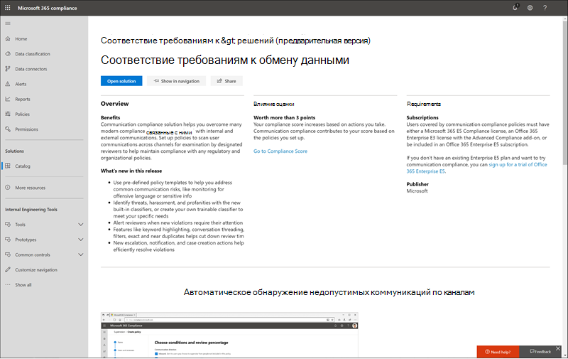

# Каталог решений Microsoft 365Microsoft 365 solution catalog

Вы ищете способ быстро начать работу с задачами обеспечения соответствия требованиям в Microsoft 365?Are you looking for a way to quickly get started with compliance tasks in Microsoft 365? Ознакомьтесь с каталогом решений [Microsoft 365, чтобы](https://compliance.microsoft.com/solutioncatalog) найти, изучить и быстро начать работу с решениями для управления соответствием требованиям и рисками.Check out the [Microsoft 365 solution catalog](https://compliance.microsoft.com/solutioncatalog) to discover, learn, and quickly get started with compliance and risk management solutions.

Решения для обеспечения соответствия требованиям в Microsoft 365 — это наборы интегрированных возможностей, которые можно использовать для управления комплексными сценариями соответствия требованиям.Compliance solutions in Microsoft 365 are collections of integrated capabilities you can use to help you manage end-to-end compliance scenarios. Возможности и средства решения могут включать сочетание политик, оповещений, отчетов и других средств.A solution's capabilities and tools might include a combination of policies, alerts, reports, and more.

Ознакомьтесь с этой статьей, чтобы ознакомиться с новым каталогом решений в Центре соответствия требованиям Microsoft 365, узнать, как получить [его,](#frequently-asked-questions)часто задайте вопросы и дальнейшие [действия.](#next-steps)Read this article to get acquainted with the new solution catalog in the Microsoft 365 compliance center, [how to get it](#how-do-i-get-this), [frequently asked questions](#frequently-asked-questions), and your [next steps](#next-steps).

## Организация каталогаCatalog organization

Каталог решений состоит из разделов, содержащих информационные карточки для каждого решения для обеспечения соответствия требованиям, доступного в вашей подписке на Microsoft 365.The solution catalog is organized into sections that contain information cards for each compliance solution available in your Microsoft 365 subscription. Каждый раздел содержит карточки для решений, сгруппных по области соответствия требованиям.Each section contains cards for solutions grouped by compliance area.

При выборе **представления** карточки решения вы увидите подробные сведения о решении для обеспечения соответствия требованиям и о том, как начать работу.When you select **View** for a solution card, you'll see detailed information about the compliance solution and how to get started. Эти сведения включают обзор, требования к предварительной настройке, учебные ресурсы, элементы управления, позволяющие закрепить карточку в области навигации, а также возможность поделиться решением как ссылкой, электронной почтой или сообщением Microsoft Teams.This information includes an overview, pre-configuration requirements, learning resources, controls that allow you to pin the card to the navigation pane, and an option to share the solution as a link, email, or Microsoft Teams message.

## Раздел "Управление & информации"Information protection & governance section

В **разделе** & управления информационной защитой показано, как можно использовать решения для обеспечения соответствия требованиям Microsoft 365 для защиты и управления данными в организации.The **Information protection & governance** section shows you at a glance how you can use Microsoft 365 compliance solutions to protect and govern data in your organization.

Здесь вы увидите карточки для следующих решений:From here, you'll see cards for the following solutions:

- [Предотвращение потери](data-loss-prevention-policies.md)данных: обнаружение конфиденциального содержимого по мере его использования и совместного использования в организации, в облаке и на устройствах, а также помогает предотвратить случайную потерю данных.[Data loss prevention](data-loss-prevention-policies.md): Detects sensitive content as it's used and shared throughout your organization, in the cloud and on devices, and helps prevent accidental data loss.
- [Управление информацией:](manage-information-governance.md)управляет жизненным циклом контента с помощью решений для импорта, хранения и классификации критически важных бизнес-данных, чтобы сохранить необходимые данные и удалить то, что вам не нужно.[Information governance](manage-information-governance.md): Manages your content lifecycle using solutions to import, store, and classify business-critical data so you can keep what you need and delete what you don't.
- [Защита информации:](information-protection.md)обнаружение, классификация и защита конфиденциального и критически важного для бизнеса содержимого на протяжении всего жизненного цикла организации.[Information protection](information-protection.md): Discovers, classifies, and protects sensitive and business-critical content throughout its lifecycle across your organization.
- [Управление записями](records-management.md): использует интеллектуальную классификацию для автоматизации и упрощения расписания хранения нормативных, юридических и критически важных для бизнеса записей в организации.[Records management](records-management.md): Uses intelligent classification to automate and simplify the retention schedule for regulatory, legal, and business-critical records in your organization.

## Раздел "Управление рисками внутри организации"Insider risk management section

В **разделе "Управление** внутренними рисками" на домашней странице показано, как ваша организация может определить, проанализировать и принять меры по внутренним рискам, прежде чем они повредят.The **Insider risk management** section on the home page shows you at a glance how your organization can identify, analyze, and take action on internal risks before they cause harm.

Здесь вы увидите карточки для следующих решений:From here, you'll see cards for the following solutions:

- [Соответствие коммуникации:](communication-compliance.md)минимизирует риски для связи, помогая автоматически фиксировать недопустимые сообщения, исследовать возможные нарушения политики и принимать меры для минимизации вреда.[Communication compliance](communication-compliance.md): Minimizes communication risks by helping you automatically capture inappropriate messages, investigate possible policy violations, and take steps to minimize harm.
- [Управление рисками](insider-risk-management.md)внутри организации: обнаружение рискованных действий в организации, которые помогут вам быстро выявлять, исследовать и принимать меры по угрозам и рискам внутри организации.[Insider risk management](insider-risk-management.md): Detect risky activity across your organization to help you quickly identify, investigate, and take action on insider risks and threats.

## Раздел & обнаруженияDiscovery & response section

В **разделе &** обнаружения на домашней странице показано, как ваша организация может быстро находить, исследовать и реагировать на проблемы с соответствием требованиям с помощью соответствующих данных.The **Discovery & response** section on the home page shows you at a glance how your organization can quickly find, investigate, and respond to compliance issues with relevant data.

Здесь вы увидите карточки для следующих решений:From here, you'll see cards for the following solutions:

- [Аудит:](search-the-audit-log-in-security-and-compliance.md)записи действий пользователей и администраторов из вашей организации, чтобы вы могли искать в журнале аудита и исследовать полный список действий во всех расположениях и службах.[Audit](search-the-audit-log-in-security-and-compliance.md): Records user and admin activity from your organization so you can search the audit log and investigate a comprehensive list of activities across all locations and services.
- [Запросы субъектов](manage-gdpr-data-subject-requests-with-the-dsr-case-tool.md)данных: находит и экспортирует персональные данные пользователя, чтобы помочь вам отвечать на запросы субъектов данных в GDPR.[Data subject requests](manage-gdpr-data-subject-requests-with-the-dsr-case-tool.md): Finds and exports a user's personal data to help you respond to data subject requests for GDPR.
- [Обнаружение электронных данныхeDiscovery](manage-legal-investigations.md)
    - [Основное обнаружение](ediscovery-cases.md)электронных данных: поиск в разных расположениях контента для идентификации, сохранения и экспорта данных в ответ на запросы юридического обнаружения и дела обнаружения электронных данных.[Core eDiscovery](ediscovery-cases.md): Searches across content locations to identify, preserve, and export data in response to legal discovery requests and eDiscovery cases.
    - [Advanced eDiscovery](overview-ediscovery-20.md): строится на возможностях обнаружения электронных данных, предоставляя интеллектуальную аналитику и машинное обучение, чтобы помочь вам в дальнейшем анализировать данные, релевантные для запросов на обнаружение.[Advanced eDiscovery](overview-ediscovery-20.md): Builds on eDiscovery capabilities by providing intelligent analytics and  machine learning to help you further analyze data that's relevant to discovery requests.

## Как это получить?How do I get this?

Чтобы посетить каталог решений Microsoft 365, войдите в качестве глобального администратора, администратора соответствия требованиям или [https://compliance.microsoft.com](https://compliance.microsoft.com) администратора данных соответствия требованиям.To visit the Microsoft 365 solution catalog, go to [https://compliance.microsoft.com](https://compliance.microsoft.com) and sign in as a global administrator, compliance administrator, or compliance data administrator. Выберите **"Каталог"** в области навигации в левой части экрана, чтобы открыть домашняя страница каталога.Select **Catalog** in the navigation pane on the left side of the screen to open the catalog home page.

## Вопросы и ответыFrequently asked questions

**Почему я не вижу каталог решений Microsoft 365?****Why don't I see the Microsoft 365 solution catalog?**

Сначала убедитесь, что у вас есть соответствующие лицензии и разрешения.First, make sure that you have the appropriate licenses and permissions. Затем во sign in as [https://compliance.microsoft.com](https://compliance.microsoft.com) a global administrator, compliance administrator, or compliance data administrator.Then, sign in at [https://compliance.microsoft.com](https://compliance.microsoft.com) as a global administrator, compliance administrator, or compliance data administrator.

**Некоторые функции соответствия требованиям, перечисленные на странице каталога решений, недоступны в Центре соответствия требованиям Microsoft 365. Чем я занимаюсь?****Some of the compliance features listed on the solution catalog page aren't available in the Microsoft 365 compliance center. What do I do?**

Мы всегда работаем над добавлением новых функций в Центр соответствия требованиям Microsoft 365 и каталог решений.We're always working to add new functionality to the Microsoft 365 compliance center and the solution catalog. Если вы не можете найти определенное решение в области навигации, оно будет доступно, когда оно будет доступно в вашей подписке.If you can't find a specific solution in the navigation area, it will be accessible when the solution is available in your subscription.

Если вы ищете существующее решение для обеспечения соответствия требованиям и оно еще не доступно в Центре соответствия требованиям Microsoft 365, вы всегда можете получить доступ к решениям в существующем Центре соответствия требованиям безопасности, переходить к &amp; [https://protection.office.com](https://protection.office.com) .If you are looking for an existing compliance solution and it's not available in the Microsoft 365 compliance center yet, you can always access solutions in the existing Security &amp; Compliance Center by going to [https://protection.office.com](https://protection.office.com). Кроме того, можно щелкнуть вкладку "Дополнительные ресурсы" в левой области навигации Центра соответствия требованиям Microsoft 365 и выбрать карточку Центра безопасности и соответствия требованиям Office 365. Alternatively, you can click on the **More resources** tab in the left navigation of the Microsoft 365 compliance center and select the Office 365 security and compliance center card.  

## Дальнейшие действияNext steps

- **Посетите диспетчер соответствия требованиям (Майкрософт),** который поможет вам понять состояние вашей организации в соответствии с ключевыми стандартами и нормативными актами.**Visit Microsoft Compliance Manager**, which helps you understand your organization's state of compliance with key standards and regulations. Он предоставляет рекомендуемые действия, которые можно выполнить для усиления общего уровня соответствия требованиям, а также возможности рабочего процесса для эффективного выполнения этих действий.It provides recommended actions you can take to strengthen your overall compliance posture, and provides workflow capabilities to help you efficiently carry out those actions. Дополнительные узнать см. в [диспетчере соответствия требованиям.](compliance-manager.md)To learn more, see [Compliance Manager](compliance-manager.md).

- **Настройте политики управления внутренними** рисками, чтобы помочь свести к минимуму внутренние риски и позволить обнаруживать, исследовать и принимать меры для рискованных действий в организации.**Configure insider risk management policies** to help minimize internal risks and enable you to detect, investigate, and take action for risky activities in your organization. См. [руководство по управлению рисками внутри организации.](insider-risk-management.md)See [Insider risk management](insider-risk-management.md).

- **Узнайте о политиках соответствия** требованиям к коммуникациям и создайте их для быстрого выявления и устранения нарушений корпоративного кода поведения.**Learn about and create Communication compliance policies** to quickly identify and remediate corporate code-of-conduct policy violations. См. ["Соответствие требованиям к коммуникациям".](communication-compliance.md)See [Communication compliance](communication-compliance.md).

- **Microsoft Information Protection**, узнайте, как решения Microsoft 365 помогают обнаруживировать, классифицировать и защищать конфиденциальную информацию, где бы она ни находится или находится.**Microsoft Information Protection**, learn how Microsoft 365 solutions help you discover, classify, and protect sensitive information wherever it lives or travels.
    - **Знакомство и настройка Microsoft Cloud App Security.****Get acquainted with and set up Microsoft Cloud App Security**. См. [краткое начало работы с Microsoft Cloud App Security.](https://docs.microsoft.com/cloud-app-security/getting-started-with-cloud-app-security)See [Quickstart: Get started with Microsoft Cloud App Security](https://docs.microsoft.com/cloud-app-security/getting-started-with-cloud-app-security).
    - **Начало работы с классификаторами.****Get started with classifiers**. Классифицировать контент, а затем пометить его так, чтобы его можно было надлежащим образом защитить и обработать, является отправной точкой для защиты информации.Classifying content and then labeling it so it can be protected and handled properly is the starting place for the information protection discipline. См. [информацию об обучаемых классификаторах (предварительная версия).](classifier-learn-about.md)See [Learn about trainable classifiers (preview)](classifier-learn-about.md).

- **Часто посетите каталог решений Microsoft 365** и обязательно просмотрите новые решения, которые помогут вам обеспечить соответствие требованиям.**Visit your Microsoft 365 solution catalog often**, and make sure to review new solutions to help you with your compliance needs. Во sign in [https://compliance.microsoft.com](https://compliance.microsoft.com) and then select **Catalog** in the left navigation pane.Sign in at [https://compliance.microsoft.com](https://compliance.microsoft.com) and then select **Catalog** in the left navigation pane.
