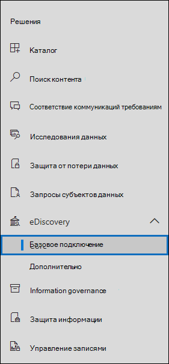
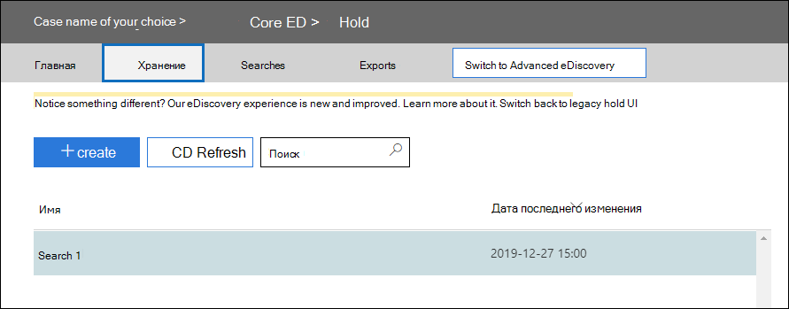
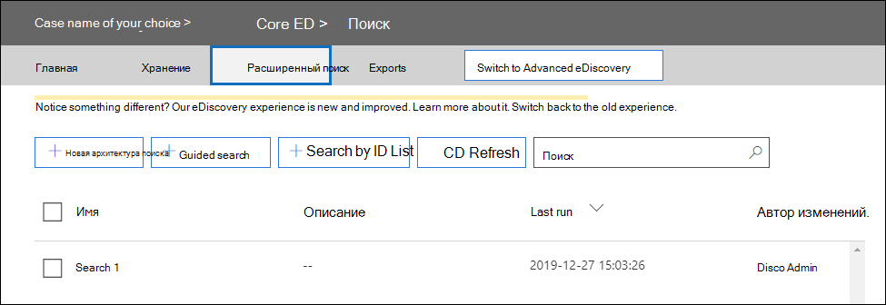

# <a name="migrate-legacy-ediscovery-searches-and-holds-to-the-microsoft-365-compliance-center"></a><span data-ttu-id="c748d-102">Миграция поиска электронных данных прежних версий и удержаний в центре соответствия требованиям Microsoft 365</span><span class="sxs-lookup"><span data-stu-id="c748d-102">Migrate legacy eDiscovery searches and holds to the Microsoft 365 compliance center</span></span>

<span data-ttu-id="c748d-103">Центр соответствия требованиям Microsoft 365 предоставляет улучшенные возможности использования обнаружения электронных данных, в том числе повышенную надежность, лучшую производительность и многие функции, связанные с рабочими процессами обнаружения электронных данных, в том числе делами для упорядочения контента, изучите наборы для просмотра контента и аналитики, чтобы помочь в отборе данных, таких как почти-повторяющуюся группировка, почтовые потоки, анализ тем</span><span class="sxs-lookup"><span data-stu-id="c748d-103">The Microsoft 365 compliance center provides an improved experience for eDiscovery usage, including: higher reliability, better performance and many features tailored to eDiscovery workflows including cases to organize your content by matter, review sets to review content and analytics to help cull data for review such as near-duplicate grouping, email threading, themes analysis, and predictive coding.</span></span>

<span data-ttu-id="c748d-104">Чтобы помочь пользователям использовать новые и улучшенные функции, в этой статье представлены основные рекомендации по переносу поисковых запросов с обнаружением электронных данных на месте и удержанию из центра администрирования Exchange в центр соответствия требованиям Microsoft 365.</span><span class="sxs-lookup"><span data-stu-id="c748d-104">To help customers take advantage of the new and improved functionality, this article provides basic guidance on how to migrate In-Place eDiscovery searches and holds from the Exchange admin center to the Microsoft 365 compliance center.</span></span>

> [!NOTE]
> <span data-ttu-id="c748d-105">Так как существует множество различных сценариев, в этой статье представлены общие рекомендации по переходу на поиск и удержанию в базовом варианте обнаружения электронных данных в центре соответствия требованиям Microsoft 365.</span><span class="sxs-lookup"><span data-stu-id="c748d-105">Because there are many different scenarios, this article provides general guidance to transition searches and holds to a core eDiscovery case in the Microsoft 365 compliance center.</span></span> <span data-ttu-id="c748d-106">Не всегда требуется использовать случаи обнаружения электронных данных, но они добавляют дополнительный уровень безопасности, позволяя назначать разрешения для управления доступом пользователей к делам обнаружения электронных данных в Организации.</span><span class="sxs-lookup"><span data-stu-id="c748d-106">Using eDiscovery cases aren't always required, but they add an extra layer of security by letting you assign permissions to control who has access to the eDiscovery cases in your organization.</span></span>

## <a name="before-you-begin"></a><span data-ttu-id="c748d-107">Перед началом работы</span><span class="sxs-lookup"><span data-stu-id="c748d-107">Before you begin</span></span>

- <span data-ttu-id="c748d-108">Для запуска команд PowerShell, описанных в этой статье, необходимо быть членом группы ролей "Диспетчер обнаружения электронных данных" в центре безопасности & соответствия требованиям.</span><span class="sxs-lookup"><span data-stu-id="c748d-108">You have to be a member of the eDiscovery Manager role group in the Security & Compliance Center to run the PowerShell commands described in this article.</span></span> <span data-ttu-id="c748d-109">Вы также должны быть членом группы ролей "Управление обнаружением" в центре администрирования Exchange.</span><span class="sxs-lookup"><span data-stu-id="c748d-109">You also have to be a member of the Discovery Management role group in the Exchange admin center.</span></span>

- <span data-ttu-id="c748d-110">В этой статье приводятся рекомендации по созданию удержания обнаружения электронных данных.</span><span class="sxs-lookup"><span data-stu-id="c748d-110">This article provides guidance on how to create an eDiscovery hold.</span></span> <span data-ttu-id="c748d-111">Политика удержания будет применяться к почтовым ящикам с помощью асинхронного процесса.</span><span class="sxs-lookup"><span data-stu-id="c748d-111">The hold policy will be applied to mailboxes through an asynchronous process.</span></span> <span data-ttu-id="c748d-112">При создании удержания для обнаружения электронных данных необходимо создать как Caseholdpolicy позволяет, так и Caseholdrule позволяет, в противном случае удержание не будет создано, а расположения контента не появятся на удержании.</span><span class="sxs-lookup"><span data-stu-id="c748d-112">When creating an eDiscovery hold, you must create both a CaseHoldPolicy and CaseHoldRule, otherwise the hold will not be created and content locations will not be placed on hold.</span></span>

## <a name="step-1-connect-to-exchange-online-powershell-and-security--compliance-center-powershell"></a><span data-ttu-id="c748d-113">Шаг 1: подключение к Exchange Online PowerShell и & безопасности в PowerShell центр соответствия требованиям</span><span class="sxs-lookup"><span data-stu-id="c748d-113">Step 1: Connect to Exchange Online PowerShell and Security & Compliance Center PowerShell</span></span>

<span data-ttu-id="c748d-114">Первый шаг — подключение к PowerShell для Exchange Online и безопасности & центре соответствия требованиям.</span><span class="sxs-lookup"><span data-stu-id="c748d-114">The first step is to connect to Exchange Online PowerShell and Security & Compliance Center PowerShell.</span></span> <span data-ttu-id="c748d-115">Вы можете скопировать следующий сценарий, вставить его в окно PowerShell и запустить его.</span><span class="sxs-lookup"><span data-stu-id="c748d-115">You can copy the following script, paste it into a PowerShell window and then run it.</span></span> <span data-ttu-id="c748d-116">Вам будет предложено ввести учетные данные для Организации, к которой вы хотите подключиться.</span><span class="sxs-lookup"><span data-stu-id="c748d-116">You'll be prompted for credentials for the organization that you want to connect to.</span></span> 

```powershell
$UserCredential = Get-Credential
$sccSession = New-PSSession -ConfigurationName Microsoft.Exchange -ConnectionUri https://ps.compliance.protection.outlook.com/powershell-liveid -Credential $UserCredential -Authentication Basic -AllowRedirection
Import-PSSession $sccSession -DisableNameChecking
$exoSession = New-PSSession -ConfigurationName Microsoft.Exchange -ConnectionUri https://ps.outlook.com/powershell-liveid/ -Credential $UserCredential -Authentication Basic -AllowRedirection
Import-PSSession $exoSession -AllowClobber -DisableNameChecking
```

<span data-ttu-id="c748d-117">В этом сеансе PowerShell необходимо выполнить указанные ниже действия.</span><span class="sxs-lookup"><span data-stu-id="c748d-117">You need to run the commands in the following steps in this PowerShell session.</span></span>

## <a name="step-2-get-a-list-of-in-place-ediscovery-searches-by-using-get-mailboxsearch"></a><span data-ttu-id="c748d-118">Шаг 2: получение списка поисковых запросов при обнаружении электронных данных на месте с помощью Get – MailboxSearch</span><span class="sxs-lookup"><span data-stu-id="c748d-118">Step 2: Get a list of In-Place eDiscovery searches by using Get-MailboxSearch</span></span>

<span data-ttu-id="c748d-119">После проверки подлинности можно получить список поисковых запросов с обнаружением электронных данных на месте, выполнив командлет **Get – MailboxSearch** .</span><span class="sxs-lookup"><span data-stu-id="c748d-119">After you've authenticated, you can get a list of In-Place eDiscovery searches by running the **Get-MailboxSearch** cmdlet.</span></span> <span data-ttu-id="c748d-120">Скопируйте и вставьте следующую команду в PowerShell, а затем запустите ее.</span><span class="sxs-lookup"><span data-stu-id="c748d-120">Copy and paste the following command into PowerShell and then run it.</span></span> <span data-ttu-id="c748d-121">Список операций поиска будет отображаться с их именами и состоянием удержания на месте.</span><span class="sxs-lookup"><span data-stu-id="c748d-121">A list of searches will be listed with their names and the status of any In-Place Holds.</span></span>

```powershell
Get-MailboxSearch
```

<span data-ttu-id="c748d-122">Выходные данные командлета будут выглядеть следующим образом:</span><span class="sxs-lookup"><span data-stu-id="c748d-122">The cmdlet output will be similar to the following:</span></span>


## <a name="step-3-get-information-about-the-in-place-ediscovery-searches-and-in-place-holds-you-want-to-migrate"></a><span data-ttu-id="c748d-124">Шаг 3: получение сведений об поисках с обнаружением электронных данных на месте и удержаниях на месте, которые требуется перенести</span><span class="sxs-lookup"><span data-stu-id="c748d-124">Step 3: Get information about the In-Place eDiscovery searches and In-Place Holds you want to migrate</span></span>

<span data-ttu-id="c748d-125">Опять же, вы будете использовать командлет **Get – MailboxSearch** , но на этот раз — для получения свойств поиска.</span><span class="sxs-lookup"><span data-stu-id="c748d-125">Again you will use the **Get-MailboxSearch** cmdlet, but this time to get the properties of the search.</span></span> <span data-ttu-id="c748d-126">Эти свойства можно хранить в переменной для последующего использования.</span><span class="sxs-lookup"><span data-stu-id="c748d-126">You can store these properties in a variable for use later.</span></span> <span data-ttu-id="c748d-127">В следующем примере показано, как сохранить результаты командлета **Get – MailboxSearch** в переменной, а затем отобразить свойства поиска.</span><span class="sxs-lookup"><span data-stu-id="c748d-127">The following example stores the results of the **Get-MailboxSearch** cmdlet in a variable and then displays the properties of the search.</span></span>

```powershell
$search = Get-MailboxSearch -Identity "Search 1"
```

```powershell
$search | FL
```

<span data-ttu-id="c748d-128">Выходные данные этих двух команд будут выглядеть следующим образом:</span><span class="sxs-lookup"><span data-stu-id="c748d-128">The output of these two commands will be similar to the following:</span></span>


> [!NOTE]
> <span data-ttu-id="c748d-130">Продолжительность удержания на месте в данном примере является неопределенной (*ItemHoldPeriod: Unlimited*).</span><span class="sxs-lookup"><span data-stu-id="c748d-130">The duration of the In-Place Hold in this example is indefinite (*ItemHoldPeriod: Unlimited*).</span></span> <span data-ttu-id="c748d-131">Это типично для сценариев обнаружения электронных данных и судебного разбирательства.</span><span class="sxs-lookup"><span data-stu-id="c748d-131">This is typical for eDiscovery and legal investigation scenarios.</span></span> <span data-ttu-id="c748d-132">Если длительность удержания отличается от значения неопределенности, причина, скорее всего, заключается в том, что удержание используется для хранения контента в сценарии хранения.</span><span class="sxs-lookup"><span data-stu-id="c748d-132">If the hold duration has is different value than indefinite, the reason is likely because the hold is being used to retain content in a retention scenario.</span></span> <span data-ttu-id="c748d-133">Вместо использования командлетов обнаружения электронных данных в средстве Security & Center соответствия требованиям PowerShell для сценариев хранения мы рекомендуем использовать командлеты [New – RetentionCompliancePolicy](https://docs.microsoft.com/powershell/module/exchange/policy-and-compliance-retention/new-retentioncompliancepolicy) и [New – RetentionComplianceRule](https://docs.microsoft.com/powershell/module/exchange/policy-and-compliance-retention/new-retentioncompliancerule) для хранения контента.</span><span class="sxs-lookup"><span data-stu-id="c748d-133">Instead of using the eDiscovery cmdlets in Security & Compliance Center PowerShell for retention scenarios, we recommend that you use [New-RetentionCompliancePolicy](https://docs.microsoft.com/powershell/module/exchange/policy-and-compliance-retention/new-retentioncompliancepolicy) and [New-RetentionComplianceRule](https://docs.microsoft.com/powershell/module/exchange/policy-and-compliance-retention/new-retentioncompliancerule) to retain content.</span></span> <span data-ttu-id="c748d-134">Результат использования этих командлетов аналогичен использованию командлетов **New – caseholdpolicy позволяет** и **New – caseholdrule позволяет**, но вы можете указать срок хранения и действие хранения, такие как удаление контента после истечения срока хранения.</span><span class="sxs-lookup"><span data-stu-id="c748d-134">The result of using these cmdlets will be similar to using **New-CaseHoldPolicy** and **New-CaseHoldRule**, but you'll able to specify a retention period and a retention action, such as deleting content after the retention period expires.</span></span> <span data-ttu-id="c748d-135">Кроме того, использование командлетов хранения не требует, чтобы привязать удержание к случаю обнаружения электронных данных.</span><span class="sxs-lookup"><span data-stu-id="c748d-135">Also, using the retention cmdlets don't require you to associate the retention holds with an eDiscovery case.</span></span>

## <a name="step-4-create-a-case-in-the-microsoft-365-compliance-center"></a><span data-ttu-id="c748d-136">Шаг 4: создание дела в центре соответствия требованиям Microsoft 365</span><span class="sxs-lookup"><span data-stu-id="c748d-136">Step 4: Create a case in the Microsoft 365 Compliance center</span></span>

<span data-ttu-id="c748d-137">Чтобы создать удержание для обнаружения электронных данных, необходимо создать сценарий обнаружения электронных данных для связи с удержанием.</span><span class="sxs-lookup"><span data-stu-id="c748d-137">To create an eDiscovery hold, you have to create an eDiscovery case to associate the hold with.</span></span> <span data-ttu-id="c748d-138">В следующем примере показано, как создать вариант обнаружения электронных данных с помощью имени.</span><span class="sxs-lookup"><span data-stu-id="c748d-138">The following example creates an eDiscovery case using a name of your choice.</span></span> <span data-ttu-id="c748d-139">Мы будем хранить свойства нового случая в переменной для дальнейшего использования.</span><span class="sxs-lookup"><span data-stu-id="c748d-139">We will store the properties of the new case in a variable for use later.</span></span> <span data-ttu-id="c748d-140">Вы можете просмотреть эти свойства, выполнив `$case | FL` команду после создания дела.</span><span class="sxs-lookup"><span data-stu-id="c748d-140">You can view those properties by running the `$case | FL` command after you create the case.</span></span>

```powershell
$case = New-ComplianceCase -Name "[Case name of your choice]"
```


## <a name="step-5-create-the-ediscovery-hold"></a><span data-ttu-id="c748d-142">Шаг 5: Создание удержания обнаружения электронных данных</span><span class="sxs-lookup"><span data-stu-id="c748d-142">Step 5: Create the eDiscovery hold</span></span>

<span data-ttu-id="c748d-143">После создания обращения можно создать удержание и связать его с обращением, созданным на предыдущем шаге.</span><span class="sxs-lookup"><span data-stu-id="c748d-143">After the case is created, you can create the hold and associate it with the case that you created in the previous step.</span></span> <span data-ttu-id="c748d-144">Важно помнить о том, что необходимо создать как политику удержания, так и правило удержания дел.</span><span class="sxs-lookup"><span data-stu-id="c748d-144">It's important to remember that you must create both a case hold policy and a case hold rule.</span></span> <span data-ttu-id="c748d-145">Если правило удержания не создается после создания политики удержания, то удержание для обнаружения электронных данных не будет создано и содержимое не будет включено в удержание.</span><span class="sxs-lookup"><span data-stu-id="c748d-145">If the case hold rule isn't created after you created case hold policy, the eDiscovery hold will not be created and any content won't be placed on hold.</span></span>

<span data-ttu-id="c748d-146">Выполните следующие команды, чтобы повторно создать удержание для обнаружения электронных данных, которое требуется перенести.</span><span class="sxs-lookup"><span data-stu-id="c748d-146">Run the following commands to re-create the eDiscovery hold that you want to migrate.</span></span> <span data-ttu-id="c748d-147">В этих примерах используются свойства из шага 3, которые нужно перенести, из раздела "удержание на месте".</span><span class="sxs-lookup"><span data-stu-id="c748d-147">These examples use the properties from In-Place Hold from Step 3 that you want to migrate.</span></span> <span data-ttu-id="c748d-148">Первая команда создает новую политику удержания дел и сохраняет свойства в переменной.</span><span class="sxs-lookup"><span data-stu-id="c748d-148">The first command creates a new case hold policy and saves the properties to a variable.</span></span> <span data-ttu-id="c748d-149">Вторая команда создает соответствующее правило хранения для случая.</span><span class="sxs-lookup"><span data-stu-id="c748d-149">The second command creates the corresponding case hold rule.</span></span>

```powershell
$policy = New-CaseHoldPolicy -Name $search.Name -Case $case.Identity -ExchangeLocation $search.SourceMailboxes
```

```powershell
New-CaseHoldRule -Name $search.Name -Policy $policy.Identity
```


## <a name="step-6-verify-the-ediscovery-hold"></a><span data-ttu-id="c748d-151">Шаг 6: Проверка удержания обнаружения электронных данных</span><span class="sxs-lookup"><span data-stu-id="c748d-151">Step 6: Verify the eDiscovery hold</span></span>

<span data-ttu-id="c748d-152">Чтобы убедиться в отсутствии проблем с созданием удержания, убедитесь, что состояние распределения для удержания прошло успешно.</span><span class="sxs-lookup"><span data-stu-id="c748d-152">To make sure there were no issues in creating the hold, it's good to check that the hold distribution status is successful.</span></span> <span data-ttu-id="c748d-153">Распределение означает, что удержание применено ко всем расположениям контента, указанным в параметре *ExchangeLocation* на предыдущем шаге.</span><span class="sxs-lookup"><span data-stu-id="c748d-153">Distribution means that the hold has been applied to all the content locations specified in the *ExchangeLocation* parameter in the previous step.</span></span> <span data-ttu-id="c748d-154">Для этого можно выполнить командлет **Get – caseholdpolicy позволяет** .</span><span class="sxs-lookup"><span data-stu-id="c748d-154">To do this, you can run the **Get-CaseHoldPolicy** cmdlet.</span></span> <span data-ttu-id="c748d-155">Так как свойства, сохраненные в переменной *$Policy* , созданной на предыдущем этапе, не обновлялись автоматически в переменной, необходимо повторно выполнить командлет, чтобы убедиться в успешности распространения.</span><span class="sxs-lookup"><span data-stu-id="c748d-155">Because the properties saved to the *$policy* variable that you created in the previous step aren't automatically updated in the variable, you need to rerun the cmdlet to verify that distribution is successful.</span></span> <span data-ttu-id="c748d-156">Для успешного распространения политик удержания на случай может потребоваться от 5 минут до 24 часов.</span><span class="sxs-lookup"><span data-stu-id="c748d-156">It can take between 5 minutes and 24 hours for case hold policies to be successfully distributed.</span></span>

<span data-ttu-id="c748d-157">Выполните следующую команду, чтобы убедиться, что удержание обнаружения электронных данных успешно распространено.</span><span class="sxs-lookup"><span data-stu-id="c748d-157">Run the following command to verify that the eDiscovery hold has been successfully distributed.</span></span>

```powershell
Get-CaseHoldPolicy -Identity $policy.Identity | Select name, DistributionStatus
```

<span data-ttu-id="c748d-158">Значение **Success** для свойства *дистрибутионстатус* указывает на то, что удержание успешно размещено в расположениях контента.</span><span class="sxs-lookup"><span data-stu-id="c748d-158">The value of **Success** for the *DistributionStatus* property indicates the hold was successfully placed on the content locations.</span></span> <span data-ttu-id="c748d-159">Если распределение еще не завершено, отображается значение **Ожидание** .</span><span class="sxs-lookup"><span data-stu-id="c748d-159">If the distribution is not yet complete, a value of **Pending** is displayed.</span></span>


## <a name="step-7-create-the-search"></a><span data-ttu-id="c748d-161">Шаг 7: создание поиска</span><span class="sxs-lookup"><span data-stu-id="c748d-161">Step 7: Create the search</span></span>

<span data-ttu-id="c748d-162">Последний шаг — повторное создание поиска, который вы определили на шаге 3, и свяжите его с обращением.</span><span class="sxs-lookup"><span data-stu-id="c748d-162">The last step is to re-create the search that you identified in Step 3 and associate it with the case.</span></span> <span data-ttu-id="c748d-163">После создания поиска вы можете запустить его с помощью командлета **Start – ComplianceSearch** или выполнить позже.</span><span class="sxs-lookup"><span data-stu-id="c748d-163">After you create the search, you can run it by using the **Start-ComplianceSearch** cmdlet or run at a later time.</span></span>

```powershell
New-ComplianceSearch -Name $search.Name -ExchangeLocation $search.SourceMailboxes -ContentMatchQuery $search.SearchQuery -Case $case.name
```


## <a name="step-8-verify-the-case-hold-and-search-in-the-microsoft-365-compliance-center"></a><span data-ttu-id="c748d-165">Шаг 8: Проверка регистра, удержания и поиска в центре соответствия требованиям Microsoft 365</span><span class="sxs-lookup"><span data-stu-id="c748d-165">Step 8: Verify the case, hold, and search in the Microsoft 365 compliance center</span></span>

<span data-ttu-id="c748d-166">Чтобы убедиться, что все настроено правильно, перейдите в центр [https://compliance.microsoft.com](https://compliance.microsoft.com)соответствия требованиям Microsoft 365 и выберите **ядро > обнаружения электронных**данных.</span><span class="sxs-lookup"><span data-stu-id="c748d-166">To make sure that everything is set up correctly, go to the Microsoft 365 compliance center at [https://compliance.microsoft.com](https://compliance.microsoft.com), and click **eDiscovery > Core**.</span></span>



<span data-ttu-id="c748d-168">Дело, созданное на шаге 3, отображается на основной странице **обнаружения электронных** данных.</span><span class="sxs-lookup"><span data-stu-id="c748d-168">The case that you created in Step 3 is listed on the **Core eDiscovery** page.</span></span> <span data-ttu-id="c748d-169">Откройте обращение и обратите внимание на удержание, созданное на шаге 4 в списке на вкладке **удержания** . Вы можете щелкнуть удержание, чтобы просмотреть подробные сведения, в том числе количество почтовых ящиков, к которым применяется удержание, а также состояние распространения.</span><span class="sxs-lookup"><span data-stu-id="c748d-169">Open the case and then notice the hold that you created in Step 4 in listed on the **Holds** tab. You can click the hold to see details, including the number of mailboxes the hold is applied to and the distribution status.</span></span>



<span data-ttu-id="c748d-171">Поиск, созданный на шаге 7, указан в списке на вкладке " **поиски** " в варианте обнаружения электронных данных.</span><span class="sxs-lookup"><span data-stu-id="c748d-171">The search that you created in Step 7 is listed on the listed on the **Searches** tab of the eDiscovery case.</span></span>



<span data-ttu-id="c748d-173">Если вы переносите Поиск с обнаружением электронных данных на месте, но не связываете его с вариантом обнаружения электронных данных, он будет указан на странице "поиск контента" в центре соответствия требованиям Microsoft 365.</span><span class="sxs-lookup"><span data-stu-id="c748d-173">If you migrate an In-Place eDiscovery search but don't associate it with an eDiscovery case, it will be listed on the Content search page in the Microsoft 365 compliance center.</span></span>

## <a name="more-information"></a><span data-ttu-id="c748d-174">Дополнительные сведения</span><span class="sxs-lookup"><span data-stu-id="c748d-174">More information</span></span>

- <span data-ttu-id="c748d-175">Дополнительные сведения о & обнаружения электронных данных на месте в центре администрирования Exchange приведены в следующих статьях:</span><span class="sxs-lookup"><span data-stu-id="c748d-175">For more information about In-Place eDiscovery & Holds in the Exchange admin center, see:</span></span>
  
  - [<span data-ttu-id="c748d-176">Обнаружение электронных данных на месте</span><span class="sxs-lookup"><span data-stu-id="c748d-176">In-Place eDiscovery</span></span>](https://docs.microsoft.com/exchange/security-and-compliance/in-place-ediscovery/in-place-ediscovery)

  - [<span data-ttu-id="c748d-177">Хранение на месте и хранение для судебного разбирательства</span><span class="sxs-lookup"><span data-stu-id="c748d-177">In-Place Hold and Litigation Hold</span></span>](https://docs.microsoft.com/exchange/security-and-compliance/in-place-and-litigation-holds)

- <span data-ttu-id="c748d-178">Дополнительные сведения о командлетах PowerShell, используемых в этой статье, приведены в статье:</span><span class="sxs-lookup"><span data-stu-id="c748d-178">For more information about the PowerShell cmdlets used in the article, see:</span></span>

  - [<span data-ttu-id="c748d-179">Get — MailboxSearch</span><span class="sxs-lookup"><span data-stu-id="c748d-179">Get-MailboxSearch</span></span>](https://docs.microsoft.com/powershell/module/exchange/policy-and-compliance-content-search/get-mailboxsearch)
  
  - [<span data-ttu-id="c748d-180">New — ComplianceCase</span><span class="sxs-lookup"><span data-stu-id="c748d-180">New-ComplianceCase</span></span>](https://docs.microsoft.com/powershell/module/exchange/policy-and-compliance-ediscovery/new-compliancecase)

  - [<span data-ttu-id="c748d-181">New — Caseholdpolicy позволяет</span><span class="sxs-lookup"><span data-stu-id="c748d-181">New-CaseHoldPolicy</span></span>](https://docs.microsoft.com/powershell/module/exchange/policy-and-compliance-ediscovery/new-caseholdpolicy)
  
  - [<span data-ttu-id="c748d-182">New — Caseholdrule позволяет</span><span class="sxs-lookup"><span data-stu-id="c748d-182">New-CaseHoldRule</span></span>](https://docs.microsoft.com/powershell/module/exchange/policy-and-compliance-ediscovery/new-caseholdrule)

  - [<span data-ttu-id="c748d-183">Get — Caseholdpolicy позволяет</span><span class="sxs-lookup"><span data-stu-id="c748d-183">Get-CaseHoldPolicy</span></span>](https://docs.microsoft.com/powershell/module/exchange/policy-and-compliance-ediscovery/get-caseholdpolicy)
  
  - [<span data-ttu-id="c748d-184">New-ComplianceSearch</span><span class="sxs-lookup"><span data-stu-id="c748d-184">New-ComplianceSearch</span></span>](https://docs.microsoft.com/powershell/module/exchange/policy-and-compliance-content-search/new-compliancesearch)

  - [<span data-ttu-id="c748d-185">Start-ComplianceSearch</span><span class="sxs-lookup"><span data-stu-id="c748d-185">Start-ComplianceSearch</span></span>](https://docs.microsoft.com/powershell/module/exchange/policy-and-compliance-content-search/start-compliancesearch)

- <span data-ttu-id="c748d-186">Для получения дополнительных сведений о центре соответствия требованиям Microsoft 365, ознакомьтесь со статьей [Обзор центра соответствия требованиям microsoft 365](microsoft-365-compliance-center.md).</span><span class="sxs-lookup"><span data-stu-id="c748d-186">For more information about the Microsoft 365 compliance center, see [Overview of the Microsoft 365 compliance center](microsoft-365-compliance-center.md).</span></span>
