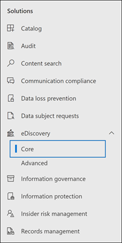

# <a name="migrate-legacy-ediscovery-searches-and-holds-to-the-microsoft-365-compliance-center"></a>Перенос устаревших поисков электронных данных в центр Microsoft 365 соответствия требованиям

Центр Microsoft 365 соответствия требованиям предоставляет улучшенный опыт использования электронных данных, в том числе: более высокую надежность, лучшую производительность и многие функции, адаптированные к рабочего процессам eDiscovery, включая случаи организации контента по материи, наборы обзоров для просмотра контента и аналитики, чтобы помочь отключать данные для проверки, такие как почти дубликатная группировка, потоки электронной почты, анализ тем и прогностическое кодирование.

Чтобы помочь клиентам воспользоваться новыми и улучшенными функциональными возможностями, в этой статье данная статья содержит основные рекомендации по переносу In-Place поиска и удерживания электронных данных из центра администрирования Exchange в центр Microsoft 365 соответствия требованиям.

> [!NOTE]
> Поскольку существует множество различных сценариев, в этой статье содержится общее руководство по переходу поиска и содержится в основном случае Microsoft 365 соответствия требованиям. Не всегда требуется использовать случаи получения электронных данных, но они добавляют дополнительный уровень безопасности, позволяя назначать разрешения для управления доступом к делам об обнаружении электронных данных в организации.

## <a name="before-you-begin"></a>Прежде чем начать

- Для выполнения команд PowerShell, описанных в этой статье, необходимо быть членом группы ролей диспетчера электронных данных в Центре & безопасности. Вы также должны быть членом группы ролей управления обнаружением в центре администрирования Exchange.

- В этой статье данная статья содержит рекомендации по созданию удержания для электронных обнаружений. Политика удержания будет применяться к почтовым ящикам с помощью асинхронного процесса. При создании удержания для электронных обнаружений необходимо создать как CaseHoldPolicy, так и CaseHoldRule, в противном случае удержание не будет создано и расположения контента не будут помещены в удержание.

## <a name="step-1-connect-to-exchange-online-powershell-and-security--compliance-center-powershell"></a>Шаг 1. Подключение Exchange Online PowerShell и security & PowerShell

Первым шагом является подключение к Exchange Online PowerShell и безопасности & PowerShell центра соответствия требованиям. Вы можете скопировать следующий сценарий, вклеить его в окно PowerShell и запустить его. Вам будут предложены учетные данные для организации, к которую необходимо подключиться. 

```powershell
$UserCredential = Get-Credential
$sccSession = New-PSSession -ConfigurationName Microsoft.Exchange -ConnectionUri https://ps.compliance.protection.outlook.com/powershell-liveid -Credential $UserCredential -Authentication Basic -AllowRedirection
Import-PSSession $sccSession -DisableNameChecking
$exoSession = New-PSSession -ConfigurationName Microsoft.Exchange -ConnectionUri https://ps.outlook.com/powershell-liveid/ -Credential $UserCredential -Authentication Basic -AllowRedirection
Import-PSSession $exoSession -AllowClobber -DisableNameChecking
```

Необходимо выполнить команды в следующих действиях в этом сеансе PowerShell.

## <a name="step-2-get-a-list-of-in-place-ediscovery-searches-by-using-get-mailboxsearch"></a>Шаг 2. Получить список поиска In-Place с помощью Get-MailboxSearch

После проверки подлинности вы можете получить список In-Place поиска по электронным данным с помощью **cmdlet Get-MailboxSearch.** Скопируйте и вклеите следующую команду в PowerShell и запустите ее. Список поисков будет указан с их именами и состоянием любого In-Place holds.

```powershell
Get-MailboxSearch
```

Вывод cmdlet будет похож на следующий:


## <a name="step-3-get-information-about-the-in-place-ediscovery-searches-and-in-place-holds-you-want-to-migrate"></a>Шаг 3. Сведения о поиске In-Place и In-Place, которые необходимо перенести

Снова вы будете использовать **комлет Get-MailboxSearch,** но на этот раз, чтобы получить свойства поиска. Эти свойства можно хранить в переменной для использования позже. В следующем примере в переменной хранится результат **комлета Get-MailboxSearch,** а затем отображаются свойства поиска.

```powershell
$search = Get-MailboxSearch -Identity "Search 1"
```

```powershell
$search | FL
```

Выход этих двух команд будет похож на следующие:


> [!NOTE]
> Продолжительность удержания In-Place в этом примере неопределенная *(ItemHoldPeriod: Unlimited).* Это характерно для сценариев расследования электронных и юридических расследований. Если продолжительность хранения отличается от неопределенного значения, причина, скорее всего, в том, что удержание используется для сохранения контента в сценарии хранения. Вместо использования кодлетов eDiscovery в Центре обеспечения безопасности & PowerShell для сценариев хранения рекомендуется использовать [New-RetentionCompliancePolicy](/powershell/module/exchange/new-retentioncompliancepolicy) и [New-RetentionComplianceRule](/powershell/module/exchange/new-retentioncompliancerule) для сохранения контента. Результат использования этих кодлетов будет аналогичен использованию **New-CaseHoldPolicy** и **New-CaseHoldRule,** но вы сможете указать период хранения и действие хранения, например удаление контента по истечении срока хранения. Кроме того, с помощью кодлетов хранения не требуется связывать удержание хранении с случаем электронного разоружия.

## <a name="step-4-create-a-case-in-the-microsoft-365-compliance-center"></a>Шаг 4. Создание дела в центре Microsoft 365 соответствия требованиям

Чтобы создать удержание для электронных обнаружений, необходимо создать дело об обнаружении электронных обнаружений, чтобы связать удержание с. В следующем примере создается дело об обнаружении электронной почты с использованием имени по вашему выбору. Свойства нового дела будут храниться в переменной для использования позже. Эти свойства можно просматривать, запуская `$case | FL` команду после создания дела.

```powershell
$case = New-ComplianceCase -Name "[Case name of your choice]"
```


## <a name="step-5-create-the-ediscovery-hold"></a>Шаг 5. Создание удержания для электронных обнаружений

После создания случая можно создать удержание и связать его с случаем, созданным на предыдущем шаге. Важно помнить, что необходимо создать как политику удержания кейсов, так и правило удержания кейсов. Если правило удержания в случае не создается после создания политики удержания в случае, удержание электронных обнаружений не создается и содержимое не будет помещено в удержание.

Запустите следующие команды, чтобы повторно создать удержание для электронных обнаружений, которое необходимо перенести. В этих примерах используются свойства из In-Place удержания из шага 3, которые необходимо перенести. Первая команда создает новую политику удержания корпусов и сохраняет свойства на переменную. Вторая команда создает соответствующее правило удержания случая.

```powershell
$policy = New-CaseHoldPolicy -Name $search.Name -Case $case.Identity -ExchangeLocation $search.SourceMailboxes
```

```powershell
New-CaseHoldRule -Name $search.Name -Policy $policy.Identity
```


## <a name="step-6-verify-the-ediscovery-hold"></a>Шаг 6. Проверка удержания для проверки электронных обнаружений

Чтобы убедиться, что при создании удержания не было проблем, необходимо убедиться, что состояние распределения удержания успешно. Распространение означает, что удержание было применено во всех расположениях контента, указанных в параметре *ExchangeLocation* на предыдущем шаге. Для этого можно запустить **cmdlet Get-CaseHoldPolicy.** Так как свойства, сохраненные в переменной *$policy,* созданной на предыдущем шаге, не обновляются автоматически в переменной, необходимо повторно перезаключить кодлет, чтобы убедиться в успешном распространении. Для успешного распространения политик удержания для дела может занять от 5 минут до 24 часов.

Запустите следующую команду, чтобы убедиться, что удержание электронной информации успешно распределено.

```powershell
Get-CaseHoldPolicy -Identity $policy.Identity | Select name, DistributionStatus
```

Значение **Success** для свойства *DistributionStatus* указывает, что удержание было успешно размещено в расположениях контента. Если распределение еще не завершено, отображается значение **Pending.**


## <a name="step-7-create-the-search"></a>Шаг 7. Создание поиска

Последним шагом является повторное создание поиска, который вы определили в шаге 3, и связать его с делом. После создания поиска можно выполнить его с помощью **cmdlet Start-ComplianceSearch** или выполнить его позже.

```powershell
New-ComplianceSearch -Name $search.Name -ExchangeLocation $search.SourceMailboxes -ContentMatchQuery $search.SearchQuery -Case $case.name
```


## <a name="step-8-verify-the-case-hold-and-search-in-the-microsoft-365-compliance-center"></a>Шаг 8. Проверка случая, удержания и поиска в центре Microsoft 365 соответствия требованиям

Чтобы убедиться, что все настроено правильно, перейдите в центр Microsoft 365 соответствия требованиям и нажмите [https://compliance.microsoft.com](https://compliance.microsoft.com) **кнопку eDiscovery > Core**.



Случай, созданный в шаге 3, указан на странице **Core eDiscovery.** Откройте дело, а затем обратите внимание на удержание, созданное в шаге 4 в списке на **вкладке Удержание.** Вы можете выбрать удержание, чтобы увидеть сведения на странице вылетов, включая количество почтовых ящиков, к которых применяется удержание, и состояние рассылки.


Поиск, созданный в шаге 7, указан на вкладке **"Поиски** дела".


Если вы переносим In-Place поиска электронных данных, но не связываете его с делом об обнаружении электронных данных, он будет указан на странице поиска контента в центре Microsoft 365 соответствия требованиям.

## <a name="more-information"></a>Дополнительные сведения

- Дополнительные сведения о In-Place eDiscovery & в центре администрирования Exchange, см. в.
  
  - [Обнаружение электронных данных на месте](/exchange/security-and-compliance/in-place-ediscovery/in-place-ediscovery)

  - [Хранение на месте и хранение для судебного разбирательства](/exchange/security-and-compliance/in-place-and-litigation-holds)

- Дополнительные сведения о cmdlets PowerShell, используемых в статье, см. в статье:

  - [Get-MailboxSearch](/powershell/module/exchange/get-mailboxsearch)
  
  - [New-ComplianceCase](/powershell/module/exchange/new-compliancecase)

  - [New-CaseHoldPolicy](/powershell/module/exchange/new-caseholdpolicy)
  
  - [New-CaseHoldRule](/powershell/module/exchange/new-caseholdrule)

  - [Get-CaseHoldPolicy](/powershell/module/exchange/get-caseholdpolicy)
  
  - [New-ComplianceSearch](/powershell/module/exchange/new-compliancesearch)

  - [Start-ComplianceSearch](/powershell/module/exchange/start-compliancesearch)

- Дополнительные сведения о центре Microsoft 365 см. в [обзоре](microsoft-365-compliance-center.md)центра Microsoft 365 соответствия требованиям.