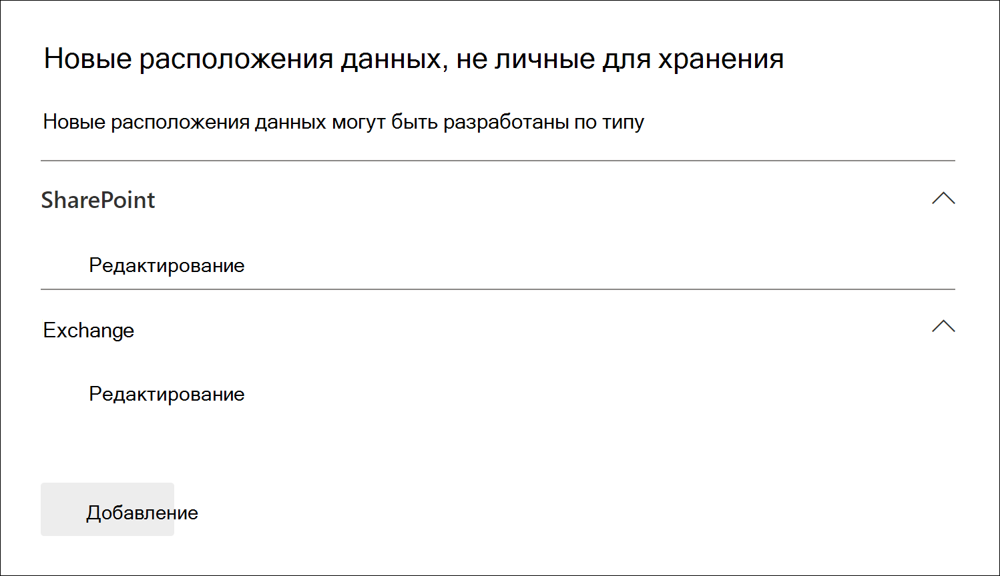
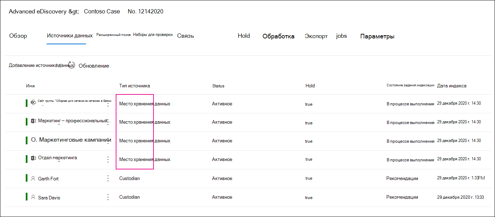

# Добавление источников данных, не в отношении хранения, в дело Advanced eDiscoveryAdd non-custodial data sources to an Advanced eDiscovery case

В случаях Advanced eDiscovery оно не всегда соответствует вашим требованиям, чтобы связать источник данных Microsoft 365 с хранителями в этом случае.In Advanced eDiscovery cases, it doesn't always meet your needs to associate a Microsoft 365 data source with a custodian in the case. Но вам все равно может потребоваться связать эти данные с делом, чтобы можно было искать в них, добавлять их в набор для проверки, а также анализировать и анализировать.But you may still need to associate that data with a case so that you can search it, add it to a review set, and analyze and review it. Функция в Advanced eDiscovery  называется источниками данных без хранения и позволяет добавлять данные в дело, не связывая их с хранителями.The feature in Advanced eDiscovery is called *non-custodial data sources* and lets you add data to a case without having to associate it to a custodian. Он также применяет те же функции Advanced eDiscovery к данным, не связанным с хранением, которые доступны для данных, связанных с хранителями.It also applies the same Advanced eDiscovery functionality to non-custodial data that's available for data associated with custodian. Две наиболее полезные функции, которые можно применить к данным, не относянымся к хранителям, — поместить их на удержание и обрабатывать с помощью [функции "Расширенный индексация".](indexing-custodian-data.md)Two of the most useful things that you can apply to non-custodial data is placing it on hold and processing it using [Advanced indexing](indexing-custodian-data.md).

## Добавление источника данных, не влияемого на хранениеAdd a non-custodial data source

Выполните следующие действия, чтобы добавить источники данных, не личные, и управлять ими в случае Advanced eDiscovery.Follow these steps to add and manage non-custodial data sources in an Advanced eDiscovery case.

1. На **домашней странице Advanced eDiscovery** щелкните дело, в которое нужно добавить данные.On the **Advanced eDiscovery** home page, click the case that you want to add the data to.

2. Перейдите **на вкладку "Источники** данных", а затем нажмите кнопку **"Добавить расположения** данных для источника  >  **данных".**Click the **Data sources** tab and then click **Add data source** > **Add data locations**.

3. На странице **"Новые расположения для хранения** данных" выберите источники данных, которые нужно добавить в дело.On the **New non-custodial data locations** flyout page, choose the data sources that you want to add to the case. Вы можете добавить несколько почтовых ящиков и сайтов, расширив **разделы SharePoint** или **Exchange** и нажав кнопку **"Изменить".**You can add multiple mailboxes and sites by expanding the **SharePoint** or **Exchange** sections and then clicking **Edit**.

   

   - **SharePoint** — нажмите **кнопку "Изменить",** чтобы добавить сайты.**SharePoint** - Click **Edit** to add sites. Выберите сайт в списке или вы можете найти его, введя URL-адрес сайта в панели поиска.Select a site in the list or you can search for a site by typing the URL of the site in the search bar. Выберите сайты, которые нужно добавить в качестве источников данных, не относящых к хранителям, и нажмите кнопку **"Добавить".**Select the sites that you want to add as non-custodian data sources and click **Add**.

   - **Exchange** — нажмите **кнопку** "Изменить", чтобы добавить почтовые ящики.**Exchange** - Click **Edit** to add mailboxes. Введите имя или псевдоним (не менее трех символов) в поле поиска почтовых ящиков или групп рассылки.Type a name or alias (a minimum of three characters) in the search box for mailboxes or distribution groups. Выберите почтовые ящики, которые нужно добавить в качестве источников данных, не входящих в хранители, и нажмите кнопку **"Добавить".**Select the mailboxes that you want to add as non-custodian data sources and click **Add**.

   > [!NOTE]
   > Разделы **SharePoint** и **Exchange** можно использовать для добавления сайтов и почтовых ящиков, связанных с группой или группой Yammer, в качестве источников данных, не связанных с хранением.You can use the **SharePoint** and **Exchange** sections to add sites and mailboxes associated with a Team or Yammer group as non-custodial data sources. Необходимо отдельно добавить почтовый ящик и сайт, связанные с командой или группой Yammer.You have to separately add the mailbox and site associated with a Team or Yammer group.

4. После добавления источников данных, не в том числе для хранения, вы можете разместить эти расположения на удержании или нет.After you add non-custodial data sources, you have the option to place those locations on hold or not. Чтобы на удержание разместить его, выберите или отбрасыйте его рядом с источником данных. Select or unselect the **Hold** checkbox next to the data source to place it on hold.

5. Нажмите **кнопку** "Добавить" в нижней части страницы "Новые расположения не для хранения данных", чтобы добавить источники данных в дело. Click **Add** at the bottom of the **New non-custodial data locations** flyout page to add the data sources to the case.

   Каждый добавленный источник данных, не относя близкий к хранителям, указан на **странице "Источники** данных".Each non-custodial data source that you added is listed on the **Data sources** page. Источники данных, не личные, идентифицированы значением расположения **данных** в **столбце "Тип источника".**Non-custodial data sources are identified by the **Data location** value in the **Source type** column.

   

После добавления в дело источников данных, не в отношении хранения, создается и отображается на вкладке "Задания" дела задание с именем *"Переиндексовать* недедексные данные". After you add non-custodial data sources to the case, a job named *Reindexing non-custodial data* is created and displayed on the **Jobs** tab of the case. После создания задания инициален расширенный процесс индексации и переиндексация источников данных.After the job is created, the Advanced indexing process in initiated and the data sources are reindexed.

## Управление удержанием для источников данных, не отправляемых в хранениеManage the hold for non-custodial data sources

После того как вы поместите удержание на источник данных, не содержащий хранение, автоматически создается политика удержания, которая содержит источники данных, не личные для дела.After you place a hold on a non-custodial data source, a hold policy that contains the non-custodial data sources for the case is automatically created. При удержании других источников данных, не в отношении хранения, они добавляются в эту политику удержания.When you place other non-custodial data sources on hold, they are added to this hold policy.

1. Откройте дело Advanced eDiscovery и выберите вкладку **"Удержание".**Open the Advanced eDiscovery case and select the **Hold** tab.

2. Щелкните **NCDSHold- \<GUID\>**, где значение GUID уникально для дела.Click **NCDSHold-\<GUID\>**, where the GUID value is unique to the case.

   На отображаемой странице отображаются сведения и статистика об источниках данных, не в том виде, в которые они находятся на удержании.The flyout page display information and statistics about the non-custodial data sources on hold.

   

3. Нажмите **кнопку "Изменить** удержание", чтобы просмотреть источники данных, не вложенные в хранение, и выполнить следующие задачи управления:Click **Edit hold** to view the non-custodial data sources placed on hold and perform the following management tasks:

   - На странице **"Расположения"** можно освободить источник данных, не относяющийся к хранителям, удалив его из удержания.On the **Locations** page, you can release a non-custodial data source by removing it from the hold. Освобождение источника данных не удаляет источник данных, не относяющийся к хранителям, из дела.Releasing a data source doesn't remove the non-custodial data source from the case. Он удаляет только удержание, которое было помещено на источник данных.It only removes the hold that was placed on the data source.

   - На странице **"Запрос"** можно изменить удержание, чтобы создать удержание на основе запроса, которое применяется во всех источниках данных, не вложенных в хранение, в этом случае.On the **Query** page, you can edit the hold to create a query-based hold that is applied to all tha non-custodial data sources in the case.
