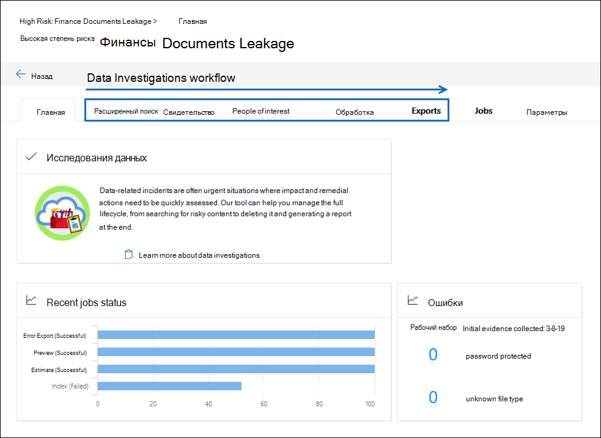

# Общие сведения о расследовании данных (Предварительная версия) в Microsoft 365Overview of Data Investigations (preview) in Microsoft 365

Сброс данных происходит, когда документ с конфиденциальным, конфиденциальным или вредоносным содержимым размещается в ненадежной среде.A data spill occurs when a document containing confidential, sensitive, or malicious content is released into an untrusted environment. При обнаружении переноса данных очень важно быстро содержать среду, оценить размер и расположение удаляемого, проанализировать действия пользователей и удалить перенесенные данные из службы.When a data spill is detected, it's important to quickly contain the environment, assess the size and locations of the spillage, examine user activities around it, and then delete the spilled data from the service. С помощью нового средства расследования данных (Preview) можно искать конфиденциальные, опасные или недопустимые данные в Office 365, изучите, что произошло, и выполните соответствующие действия, чтобы исправить его.Using the new Data Investigations (preview) tool, you can search for sensitive, malicious, or misplaced data across Office 365, investigate what happened, and take the appropriate actions to remediate the spillage.  

В этой статье описывается использование возможностей в новом средстве расследования данных (Preview) для решения сценария для переноса данных.This article describes using the capabilities in the new Data Investigations (preview) tool to address a data spillage scenario.

## РазрешенияPermissions

Чтобы получить доступ к анализу данных и провести анализ данных, необходимо быть участником группы ролей Data инвестигатор.To access and conduct a data investigation, you need be a member of the Data investigator role group. Дополнительные сведения приведены в статье [Назначение разрешений для расследования данных](data-investigations-permissions.md).For more information, see [Assign permissions for Data Investigations](data-investigations-permissions.md).

## Рабочий процесс расследования данных (Предварительная версия)Data Investigations (preview) workflow 

В следующих разделах описываются все этапы встроенного рабочего процесса при расследовании данных (Предварительная версия).The following sections describe each step in the built-in workflow in Data Investigations (preview). На следующем снимке экрана показана вкладка " **Главная** " для исследования " *высокий риск": "утечки в финансовых документах*".The following screenshot shows the **Home** tab of an investigation named *High Risk: Finance Documents Leakage*. 

## Поиск конфиденциальных, вредоносных или перемещенных данныхSearch for sensitive, malicious, or misplaced data

Используйте вкладку **поиски** , чтобы найти Microsoft 365 для данных, которые требуется исправить.Use the **Searches** tab to create searches to find the Microsoft 365 for data that you want to remediate. Вы можете создавать и выполнять поиск на основе запросов, чтобы определить, какие сообщения электронной почты и документы могут содержать перенесенные данные, а затем собрать их как свидетельство для просмотра и анализа.You can create and run query-based searches to identify a set email messages and documents that might contain spilled data, and then collect them as evidence to review and analyze. Кроме того, вы можете использовать средство поиска для предварительного просмотра образцов документов и просмотра статистики поиска, которые могут помочь уточнить и улучшить результаты поиска.Also, you can use the search tool to preview sample documents and view search statistics that can  help you refine and improve the search results. Когда вы удовлетворены, что результаты поиска содержат все данные, относящиеся к расследованию, вы добавляете результаты поиска в набор свидетельств для дальнейшей проверки, оценки влияния и выполнения действий по воспроизводимым носителям.Once you're satisfied that the search results contain the all the data relevant to the investigation, you add the search results to the evidence set to further review, impact assessment, and taking remedial actions as necessary. Для получения дополнительных сведений обратитесь к разделу [Поиск данных при расследовании](search-for-data.md).For more information, see [Search for data in an investigation](search-for-data.md).

## Просмотр и исследование доказательствReview and investigate evidence

Используйте вкладку **свидетельство** для изучения данных, собранных из службы Live, в данном случае — Office 365.Use the **Evidence** tab to investigate the data that you've collected from the live service, which in this case is Office 365. Данные в наборе свидетельств — это моментальный снимок собранных результатов поиска.The data in the evidence set is a snapshot of search results that you collected. При добавлении результатов поиска в качестве свидетельства для извлечения файлов, метаданных и текста вызывается процесс.When you add search results as evidence a process is triggered to extract files, metadata, and text. По завершении этого процесса средство анализа данных создает новый индекс всех данных и добавляет его в набор свидетельств.When this process is complete, the Data Investigations tool builds a new index of all the data and adds it to an evidence set. Это позволяет быстро включить среду, удалив данные, расположенные в исходных расположениях содержимого (в службе Live), при расследовании свидетельств, собранных в среде с карантином.For any time-sensitive investigations, this allows you to quickly contain the environment by deleting data located in the original content locations (in the live service) while investigating the evidence that you collected in a quarantined environment. После сбора доказательств можно выполнить дополнительные запросы для сужения данных по диапазону времени, типам файлов, владельцам данных и другим типам условий.After evidence is collected, you can run more queries to narrow the data by time range, file types, data owners, and other types of conditions. Например, с помощью условий "Автор", "отправитель" и "получатель" можно быстро определить пользователей, которые участвовали в сбросе данных, а также в том случае, если какие бы они были предоставлены другим пользователям за прев Организации.For example, by using the Author, Sender, and Recipient conditions you can quickly identify those who were are involved in the data spill and if any of the spilled data was shared with people outside of your organization.

Вы также можете выполнить расширенную аналитику для собираемых доказательств.You can also run advanced analytics on the evidence you collect. Это может предоставить вам общие темы и организовывать доказательства с помощью почтовых потоков, точных дубликатов и ближайших дубликатов для проведения расследования.This can provide you with general themes, and organize evidence by email threads, exact duplicates, and near duplicates to facilitate your investigation. Вы можете просматривать документы в извлеченном текстовом представлении или в собственном формате файлов, размечая их с помощью результатов расследования.You can review documents in extracted text view or in the native file format, and tag them with investigation results. Дополнительные сведения см. в указанных ниже статьях.For more information, see:

  - [Просмотр данных в свидетельствеReview data in evidence](review-data-in-evidence.md)

  - [Запуск аналитики для ускорения исследованияRun analytics to investigate faster](run-analytics-to-investigate-faster.md)

## Управление интересными людьмиManaging people of interest

Используйте вкладку **люди по процентам** для добавления людей, которые вы указали в качестве интересующих людей, и управления ими в ходе расследования доказательства.Use the **People of interest** tab to add and manage the people that you've identified as persons of interest during your investigation of the evidence. При добавлении интересующих людей их источники данных, например их почтовые ящики и учетные записи OneDrive, будут идентифицированы и сопоставлены.When you add people of interest, their data sources, such as their mailbox and OneDrive account, are identified and mapped. После этого вы сможете выполнять поиск, выполняя поиск только по расположению содержимого этих пользователей.Then you can scope searches by searching only the content locations of those people. При работе с областями интересующие вас люди ищут более эффективные и точные данные, так как средство повторно обрабатывает любые неиндексированные данные, такие как изображения или неподдерживаемые типы файлов.When scoped by people of interest, searches are more efficient and accurate because the tool reprocesses any unindexed data such as images or unsupported file types. На вкладке **люди по процентам** вы также можете просмотреть сведения о действиях в журнале аудита для этих людей и выполнить их поиск.On the **People of interest** tab, you can also view and search the audit log activity of those people to further help your investigation. В ходе расследования вы можете добавить больше интересующих людей.You can add more people of interest throughout the investigation. Дополнительные сведения можно найти [в разделе Manage люди, которые нужно исследовать](manage-people-of-interest.md).For more information, see [Manage people of interest an investigation](manage-people-of-interest.md).

## Индексирование данных интересующих людейIndexing the data of people of interest

Добавление интересующего человека к расследованию повторно индексирует все элементы с частичным индексированием из источников данных пользователя.Adding a person of interest to an investigation re-indexes any partially indexed items from the person's data sources. Этот процесс называется *расширенной индексацией*.This process is called *Advanced indexing*. Расширенное индексирование повторно обрабатывает данные, такие как изображения и неподдерживаемые типы файлов, чтобы эти данные были полностью обнаруживаемыми при выполнении поиска для сбора данных для расследования.Advanced indexing reprocesses data such as images and unsupported file types so that this data is fully discoverable when you run searches to collect data for an investigation. Используйте вкладку **Обработка** для наблюдения за состоянием расширенной индексации и исправления любых ошибок обработки, которые могут возникнуть при использовании процесса, который называется *исправлением ошибок*.Use the **Processing** tab to monitor the status of Advanced indexing and fix any processing errors that may occur using a process called *error remediation*. Дополнительные сведения можно найти в разделе [Устранение ошибок при обработке данных для расследования](error-remediation.md).For more information, see [Error remediation when processing data for an investigation](error-remediation.md).

## Экспорт данныхExporting data

Если вы хотите экспортировать данные, используйте вкладку **экспорты** для управления заданием экспорта и загрузки данных из набора свидетельств.If you want to export data, use the **Exports** tab to manage an export job and download data from the evidence set. При экспорте свидетельства данные передаются в место хранения Azure, а затем доступны для загрузки на локальный компьютер.When you export evidence, the data is uploaded to an Azure Storage location and then is available to download to a local computer. На вкладке **экспортируемые** данные можно получить URL-адрес расположения хранилища Azure и ключ оценки хранилища, которые необходимы для загрузки экспортированных данных.On the **Exports** tab, you can obtain the Azure Storage location URL and the storage assess key, which are both necessary to download the exported data. Дополнительные сведения можно найти [в статье экспорт данных из расследования](export-data.md).For more information, see [Export data from an investigation](export-data.md).

## Управление заданиямиManaging jobs

Используйте вкладку **задания** для отслеживания длительно выполняемых процессов для задач, связанных с расследованиями.Use the **Jobs** tab to monitor the long-running processes for tasks related to the investigation. Сюда входят задания для выполнения поиска, добавления данных в набор свидетельств, переиндексация данных и экспорта свидетельства.This includes jobs for running searches, adding data to an evidence set, reindexing data, and exporting evidence. Например, вы можете создать поиск на вкладке **поисковые запросы** , включающие множество источников данных.For example, you might create a search on the **Searches** tab that includes many data sources. Состояние этого процесса поиска отображается на вкладке **задания** . Более подробную информацию можно узнать [в статье Управление заданиями при расследовании данных](manage-jobs.md).The status of this search process is displayed on the **Jobs** tab. For more information, see [Manage jobs in a data investigation](manage-jobs.md).

## Настройка параметров расследованияConfiguring investigation settings

На вкладке **Параметры** можно настроить параметры на уровне расследования.Use the **Settings** tab to configure investigation-wide settings. Сюда входит добавление участников в исследование, закрытие или удаление расследования, а также настройка поведения поиска и аналитики.This includes adding members to an investigation, closing or deleting an investigation, and configuring search and analytics behavior.
