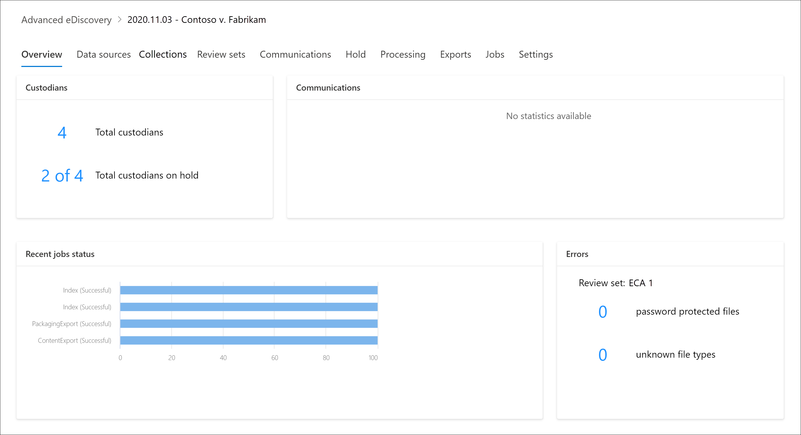

# Обзор Microsoft 365 Advanced eDiscovery

Решение Advanced eDiscovery в Microsoft 365 построено на существующих возможностях Microsoft eDiscovery и аналитики. Advanced eDiscovery предоставляет конечный рабочий процесс для сохранения, сбора, анализа, анализа, анализа и экспорта контента, который отвечает на внутренние и внешние исследования в организации. Он также позволяет юридическим группам управлять всем процессом уведомлений об удержании по юридическим основаниям для связи с хранителями, участвующими в деле.

Advanced eDiscovery может помочь вашей организации реагировать на юридические вопросы или внутренние расследования, обнаруживая данные, в которых она находится. Вы можете легко управлять процессами eDiscovery, выявляя интересующих лиц и их источники данных, легко применяя удержания для сохранения данных, а затем управляйте процессом связи с удержанием по юридическим основаниям. Собирая данные из источника, вы можете искать нужные данные на живой платформе Microsoft 365. Интеллектуальные возможности машинного обучения, такие как глубокая индексация, потоки электронной почты и обнаружение практически дублирующихся данных, также помогают уменьшить объемы данных до соответствующего набора данных.

В следующих разделах описано, как эти возможности Advanced eDiscovery могут помочь вашей организации.

## Обнаружение и сбор данных на месте

Традиционно организации, которые используют несколько сторонних решений для eDiscovery, требуют копирования больших объемов данных из Microsoft 365 для обработки и необходимости хранения дублирующихся данных. Эта необходимость увеличивает время поиска соответствующих данных, а также риски, затраты и сложность управления несколькими решениями.

Advanced eDiscovery в Microsoft 365 позволяет обнаруживая данные в источнике и оставаясь в пределах границ безопасности и соответствия требованиям Microsoft 365.  При сборе данных на месте из живой системы Advanced eDiscovery снижает риск вернуться к источнику и уменьшает ненужную работу по поиску отсутствующих данных, что часто происходит при задержке журнала в традиционных решениях eDiscovery.

Возможности поиска и сбора данных в Teams, Yammer, SharePoint Online, OneDrive для бизнеса и Exchange Online еще больше улучшают обнаружение данных. Например, Advanced eDiscovery:

- Восстанавливает беседы Teams (вместо того чтобы возвращать отдельные сообщения из бесед).

- Собирает облачное содержимое, к которое пользователи могут получить доступ, с помощью ссылок или современных вложений в сообщениях электронной почты и чатах Teams.

- Имеет встроенную поддержку сотен типов файлов, не в microsoft 365.

- Собирает данные из сторонних источников (таких как Bloomberg, Facebook, Slack и Zoom Meetings), импортируемые и архивируемые в Microsoft 365 соединитетелями [данных.](archiving-third-party-data.md)

## Управление процессом eDiscovery на одной платформе

Advanced eDiscovery позволяет сократить количество решений для eDiscovery, на которые необходимо опираться. Он обеспечивает оптимизированный и весь рабочий процесс, который все происходит в Microsoft 365. Advanced eDiscovery помогает уменьшить конфликты при определении и сборе потенциальных источников релевантной информации путем автоматического сопоставления уникальных и общих источников данных с интересующий лицом (известным как *хранител),* а также предоставляя отчеты и аналитику по потенциально релевантным данным перед их сбором для анализа и анализа.

Кроме того, API Microsoft Graph могут помочь автоматизировать рабочий процесс eDiscovery и расширить Advanced eDiscovery для пользовательских решений.

## Интеллектуальное отсев данных

Интеллектуальные возможности машинного обучения в Advanced eDiscovery помогают сократить объем данных для проверки. Эти интеллектуальные возможности помогают уменьшить и захиметь большие объемы данных в соответствующий набор. Например, встроенный запрос набора для проверки помогает фильтровать только уникальное содержимое путем определения почти дубликатов. Эта возможность может значительно сократить объем данных, которые необходимо просмотреть.

Дополнительные возможности машинного обучения могут дополнительно уточнять и идентифицировать релевантные данные с помощью смарт-тегов и средств проверки технологий, таких как модули релевантности.

## Архитектура Advanced eDiscovery

Ниже показана схема архитектуры Advanced eDiscovery, на которой показан конечный рабочий процесс в среде с одним и несколькими географическими средами, а  также поток данных, который соответствует эталонной модели электронного обнаружения (EDRM).

[Представление в качестве изображения](../media/solutions-architecture-center/m365-advanced-ediscovery-architecture.png)

[Скачивание в формате PDF-файла](https://download.microsoft.com/download/d/1/c/d1ce536d-9bcf-4d31-b75b-fcf0dc560665/m365-advanced-ediscovery-architecture.pdf)

[Скачивание в качестве файла Visio](https://download.microsoft.com/download/d/1/c/d1ce536d-9bcf-4d31-b75b-fcf0dc560665/m365-advanced-ediscovery-architecture.vsdx)

Дополнительные сведения о конечном рабочего процесса в Advanced eDiscovery см. в этом видео [Microsoft Mechanics.](https://go.microsoft.com/fwlink/?linkid=2066133)

## Рабочий процесс Advanced eDiscovery

В следующих разделах описаны все этапы встроенного рабочего процесса в средстве Advanced eDiscovery в Центре соответствия требованиям Microsoft 365. На следующем снимке экрана показана вкладка **"Обзор"** дела с именем *2020.11.03 — Contoso v. Fabrikam.*

Дополнительные сведения см. в описании процесса [управления advanced eDiscovery.](create-and-manage-advanced-ediscoveryv2-case.md#manage-the-workflow)

### Управление хранителями и источниками данных, не относяками к хранителям

Вкладка **"Источники** данных" используется для добавления и управления людьми, которых вы определили как интересуйте по этому делу, и другими источниками данных, которые не могут быть связаны с хранителями. При добавлении хранителей или источников данных, не относящемся к хранителям, вы можете быстро выполнить такие действия, как помещение на удержание по юридическим и другим источникам данных, общение с хранителями и поиск источников данных хранителя и других источников для сбора контента, относящемся к делу. По мере продвижения дела можно легко добавить новых хранителей или источники дат, не в отношении которых они находятся, или освободить их из дела. Дополнительные сведения см. в [работе с хранителями.](managing-custodians.md)

### Управление уведомлениями об удержании по юридическим основаниям

Вкладка **"Связь"** используется для управления процессом связи с хранителями в данном случае. Уведомление об удержании по юридическим основаниям предписывает хранителям сохранять все содержимое, которое относится к делу. Юридические группы должны иметь возможность отслеживать уведомления, полученные, прочитаные и подтвержденные хранителями. Рабочий процесс связи в Advanced eDiscovery позволяет создавать и отправлять начальные уведомления, напоминания, уведомления о выпуске и эскалации, если хранители не могут подтвердить уведомление об удержании. Дополнительные сведения см. в [теме "Работа с коммуникациями".](managing-custodian-communications.md)

### Управление сохранением контента

При добавлении хранителя в дело можно наложить удержание на данные. Вкладка **"Удержание"** используется для управления удержанием, созданным при добавлении хранителей, и для управления другими юридическими удержанием, связанными с делом; например, вы можете определить и установить удержание для источников данных, не относяхся к хранителям. Вы также можете изменить любое удержание в этом случае и сделать его удержанием на основе запроса, чтобы сохранить только содержимое, которое соответствует запросу. Например, к удержанию можно добавить диапазон дат, чтобы в пределах определенной даты сохранялся только контент, созданный в пределах определенной даты. Вы также можете получить статистику по контенту, на удержании, удалить удержание после того, как оно больше не относится к делу, или удалить его. Дополнительные сведения см. в [подкадре "Управление удерживаемой информацией".](managing-holds.md)

### Индексация данных хранителя

При добавлении в дело хранителя и соответствующих источников данных для хранения все частично индексные данные из источника данных хранителя переиндексются процессом, который называется *"Расширенный индексация".* Это позволяет полностью искать контент, например изображения, неподтвердимые типы файлов и другой потенциально недексируемый контент, при поиске для сбора данных по делу. Вкладка **"Обработка"** используется для отслеживания состояния "Расширенный индексация" и устранения ошибок обработки с помощью процесса устранения *ошибок.* Дополнительные сведения см. в [устранении ошибок обработки.](processing-data-for-case.md)

### Сбор данных дела

Вкладка **"Поиск"** используется для создания поисковых запросов для поиска контента, относящемся к делу, в источниках данных, не в отношении хранения и не в отношении хранения. Вы можете создавать и запускать поисковые запросы (с использованием ключевых слов и условий), чтобы определить набор сообщений электронной почты и документов, которые имеют отношение к делу и которые вы хотите дополнительно просмотреть и проанализировать на последующих шагах рабочего процесса eDiscovery. Можно создать один или несколько поисковых запросов, связанных с делом. Кроме того, с помощью средства поиска можно просмотреть примеры документов и просмотреть статистику поиска, чтобы уточнить и улучшить результаты поиска. После того как результаты поиска будут удовлетворены, добавьте их в набор для дальнейшей проверки, анализа и выбора. Дополнительные сведения [см. в теме "Сбор данных для дела".](collecting-data-for-ediscovery.md)

### Просмотр и анализ данных дела

Вкладка **"Наборы** отзывов" используется для просмотра и анализа контента, собранного из живой системы и добавленного в набор для проверки. Набор  для проверки — это статический набор этих данных (другими словами, автономной копии данных) данных об хранителях (и, если применимо, не хранение данных), собранных на предыдущем этапе рабочего процесса eDiscovery. При добавлении результатов поиска в набор для проверки запускается процесс извлечения файлов из контейнеров, извлечения метаданных и извлечения текста. После завершения этого процесса система создает новый индекс всех данных, собранных хранителями, и добавляет их в набор для проверки. После того как данные будут добавлены в набор для проверки, можно выполнить дополнительные запросы, чтобы сузить данные дела, просмотреть данные в виде текста или в формате файла, а также добавить аннотации, отредакции и пометки документов в наборе для проверки. Вы также можете выполнять расширенные аналитические данные, например определять дублирование документов, потоки электронной почты и темы. После того как данные будут отобраны только для того, что относится к делу, можно либо скачать документы напрямую, либо экспортировать их вместе с метаданными файла, аннотациями и любыми тегами. Дополнительные сведения см. в указанных ниже статьях.

- [Просмотр документов в наборе для проверки](view-documents-in-review-set.md)

- [Запрос данных в наборе для проверки](review-set-search.md)

- [Добавление тегов к документам в наборе для проверки](tagging-documents.md)

- [Анализ данных в наборе для проверки](analyzing-data-in-review-set.md)

### Экспорт данных для проверки и представления

После экспорта данных из набора для проверки используйте вкладку **"Экспорт"** для управления заданием экспорта и загрузки данных из набора для проверки. При экспорте набора для проверки данные загружаются в предоставленное корпорацией Майкрософт хранилище Azure (или в хранилище Azure, управляемое вашей организацией). После отправки в Azure он будет доступен для скачивания на локальный компьютер. Вы можете получить ключ оценки хранилища, необходимый для загрузки экспортных данных на вкладке **"Экспорт".** Дополнительные сведения см. в [экспорте данных дела.](exporting-data-ediscover20.md)

### Управление заданиями

Вкладка **"Задания"** используется для отслеживания длительных процессов, связанных с задачами, которые вы инициировали. К примерам заданий относятся задания, связанные с переиндексасом, поиском и экспортом данных дела. Например, если создать поиск на  вкладке "Поиск", включаемую множество источников данных, состояние этого процесса поиска будет отображаться на вкладке **"Задания".** Дополнительные сведения см. в [под управлением заданий.](managing-jobs-ediscovery20.md)

### Настройка параметров дела

Используйте **вкладку "Параметры"** для настройки параметров для всего дела. Это включает добавление членов в дело, закрытие или удаление дела, а также настройку параметров поиска и аналитики. Дополнительные сведения см. в указанных ниже статьях.

- [Добавление участников в дело](add-or-remove-members-from-a-case-in-advanced-ediscovery.md)

- [Закрытие или удаление дела](close-or-delete-case.md)

- [Настройка параметров поиска и аналитики](configure-search-and-analytics-settings-in-advanced-ediscovery.md)
