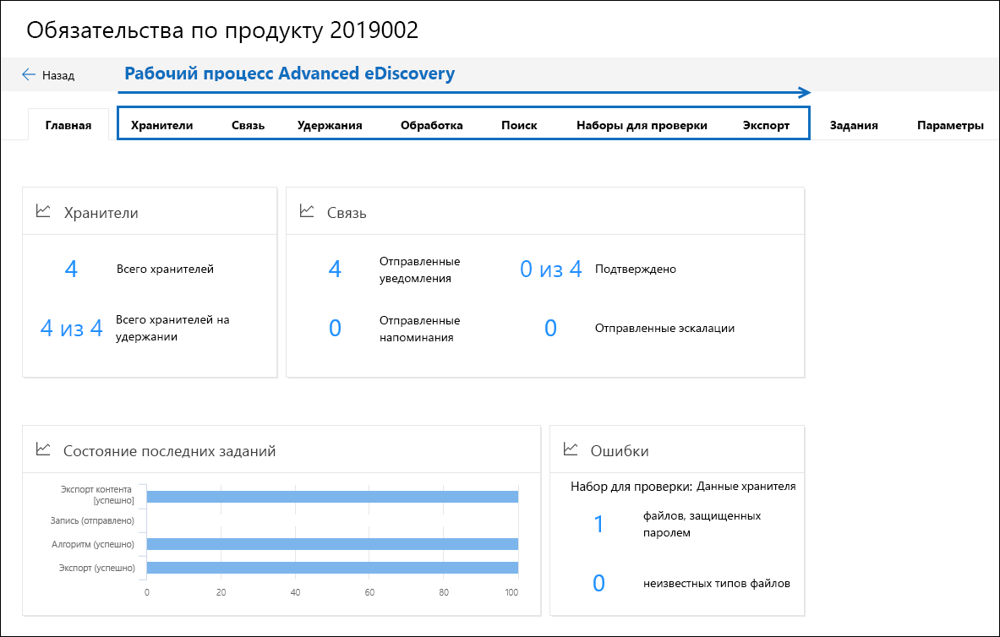

# Обзор расширенного решения обнаружения электронных данных в Microsoft 365Overview of the Advanced eDiscovery solution in Microsoft 365

Расширенное решение обнаружения электронных данных в Microsoft 365 построено на существующих возможностях обнаружения электронных данных и аналитики в Office 365.The Advanced eDiscovery solution in Microsoft 365 builds on the existing eDiscovery and analytics capabilities in Office 365. Это новое решение, именуемое *Advanced eDiscovery*, предоставляет сквозной рабочий процесс для сохранения, сбора, проверки, анализа и экспорта контента, который отвечает на внутренние и внешние расследования вашей организации.This new solution, called *Advanced eDiscovery*, provides an end-to-end workflow to preserve, collect, review, analyze, and export content that's responsive to your organization's internal and external investigations. Кроме того, он позволяет юридическим командам управлять всем рабочим процессом уведомления об удержаниях на удержание, чтобы общаться с custodians, вовлеченным в дело.It also lets legal teams manage the entire legal hold notification workflow to communicate with custodians involved in a case. 

> [!NOTE]
> Для расширенного обнаружения электронных данных требуется Корпоративная подписка на Office 365 или Microsoft 365.Advanced eDiscovery requires an Office 365 or Microsoft 365 E5 Enterprise subscription. Дополнительные сведения о расширенном лицензировании eDiscovery можно найти в [статье Руководство по лицензированию Microsoft 365 для обеспечения безопасности & соответствия требованиям](https://docs.microsoft.com/office365/servicedescriptions/microsoft-365-service-descriptions/microsoft-365-tenantlevel-services-licensing-guidance/microsoft-365-security-compliance-licensing-guidance#advanced-ediscovery).For more details about Advanced eDiscovery licensing, see [Microsoft 365 licensing guidance for security & compliance](https://docs.microsoft.com/office365/servicedescriptions/microsoft-365-service-descriptions/microsoft-365-tenantlevel-services-licensing-guidance/microsoft-365-security-compliance-licensing-guidance#advanced-ediscovery).

## Выравнивание с EDRMAlignment with EDRM

Встроенный бизнес-процесс с расширенным обнаружением электронных данных выравнивается по процессу обнаружения электронных данных, описанному в справочной модели электронного обнаружения (EDRM).The built-in workflow of Advanced eDiscovery aligns with the eDiscovery process outlined by the Electronic Discovery Reference Model (EDRM). 

(Источник изображения с edrm.net.(Image source courtesy of edrm.net. Исходное изображение было доступно в разделе неперенесенная лицензия Creative Commons со соотнесением 3,0.)The source image was made available under Creative Commons Attribution 3.0 Unported License.)

На высоком уровне ниже показано, как Расширенное обнаружение электронных данных поддерживает рабочий процесс EDRM:At a high level, here's how Advanced eDiscovery supports the EDRM workflow:

- **Процедура.****Identification.** Определив потенциальных людей, которые могут быть полезны в расследовании, вы можете добавить их как custodians (также называемые *custodians данных*, так как они могут хранить информацию, относящуюся к расследованию) в расширенном варианте обнаружения электронных данных.After you identify potential persons of interest in an investigation, you can add them as custodians (also called *data custodians*, because they may possess information that's relevant to the investigation) to an Advanced eDiscovery case. После добавления пользователей в качестве custodians можно легко сохранить, собрать и проверить документы хранитель.After users are added as custodians, it's easy to preserve, collect, and review custodian documents.

- **Букв.****Preservation.** Для сохранения и защиты данных, относящихся к расследованию, Расширенное обнаружение электронных данных позволяет помещать в custodians.To preserve and protect data that's relevant to an investigation, Advanced eDiscovery lets you place a legal hold on the data sources associated with the custodians in a case. Вы также можете размещать данные, не относящиеся к кустодиал, на удержании.You can also place non-custodial data on hold. Расширенное обнаружение электронных данных также имеет встроенный рабочий процесс связи, который позволяет отправлять уведомления о юридических удержаниях в custodians и отслеживать их подтверждения.Advanced eDiscovery also has a built-in communications workflow so you can send legal hold notifications to custodians and track their acknowledgments.

- **Семейства.****Collection.** После определения (и сохранения) источников данных, относящихся к расследованию, можно использовать встроенное средство поиска в разделе Advanced обнаружения электронных данных для сбора данных из источников данных кустодиал (и источников данных, не являющихся кустодиал, если применимо), которые могут быть релевантны для случая.After you identified (and preserved) the data sources relevant to the investigation, you can use the built-in search tool in Advanced eDiscovery search for and collect live data from the custodial data sources (and non-custodial data sources, if applicable) that may be relevant to the case.

- **Двухпроцессорной.****Processing.** После сбора всех данных, относящихся к этому случаю, следующий шаг обрабатывает их для дальнейшего анализа и анализа.After you've collected all data relevant to the case, the next step is process it for further review and analysis. В расширенном режиме обнаружения электронных данных данные на месте копируются в место хранения Azure (называемое *набором проверки*), что обеспечивает статическое представление данных вариантов.In Advanced eDiscovery, the in-place data that you identified in the collection phase is copied to an Azure Storage location (called a *review set*), which provides you with a static view of the case data. 
 
- **Смотрите.****Review.** После добавления данных в набор проверки можно просматривать определенные документы и выполнять другие запросы, чтобы уменьшить количество данных до наиболее релевантного варианта.After data has been added to a review set, you can view specific documents and run another queries to reduce the data to what is most relevant to the case. Кроме того, можно закомментировать и пометить документы определенными тегами.Also, can annotate and tag specific documents.
 
- **Отчетов.****Analysis.** Расширенное обнаружение электронных данных предоставляет интегрированное средство аналитики, которое помогает дополнительному изучению данных из набора проверки, которые вы определили, не важны для расследования.Advanced eDiscovery provides integrated analytics tool that helps you further cull data from the review set that you determine isn't relevant to the investigation. Кроме уменьшения объема релевантных данных, предварительное обнаружение электронных данных также помогает сэкономить затраты на проверку, позволяя организовывать процесс проверки и более простой и эффективной работы.In addition to reducing the volume of relevant data, Advance eDiscovery also helps you save legal review costs by letting you organize content to make the review process easier and more efficient.

- **Рабочая среда** и **презентация.****Production** and **Presentation.** Когда вы будете готовы, вы можете экспортировать документы из набора рецензирования для юридической проверки.When you're ready, you can export documents from a review set for legal review. Документы можно экспортировать в исходном формате или в формате EDRM, чтобы их можно было импортировать в сторонние приложения проверки.You can export documents in their native format or in an EDRM-specified format so they can be imported into third-party review applications.

## Расширенный рабочий процесс обнаружения электронных данныхAdvanced eDiscovery workflow

В следующих разделах описывается каждый этап встроенного рабочего процесса в Advanced eDiscovery.The following sections describe each step in the built-in workflow in Advanced eDiscovery. На следующем снимке экрана показана вкладка " **Главная** " для случая с названием " *ответственность за продукт 2019002*".The following screenshot shows the **Home** tab of a case named *Product Liability 2019002*. Обратите внимание, что вкладки рабочих процессов, расположенные в верхней части страницы, упорядочены в соответствии с процессом EDRM.Note the workflow tabs at the top of the page are sequenced to align with the EDRM process. 

Для получения дополнительных сведений о сквозном рабочем процессе в Advanced eDiscovery посетите этот [видеоролик Microsoft механики](https://go.microsoft.com/fwlink/?linkid=2066133).For more information about the end-to-end workflow in Advanced eDiscovery, see this [Microsoft Mechanics video](https://go.microsoft.com/fwlink/?linkid=2066133). 

## Управление custodiansManaging custodians

Используйте вкладку **custodians** для добавления людей, которые вы указали в качестве интересующих людей, и управления ими.Use the **Custodians** tab to add and manage the people that you've identified as persons of interest in the case. При добавлении custodians можно быстро выполнять действия, связанные с хранитель, такие как помещение судебного удержания на источники данных хранитель, связь с custodians и поиск в источниках данных хранитель, чтобы собрать содержимое, которое относится к этому случаю.When you add custodians, you can quickly perform custodian-related actions like placing a legal hold on custodian data sources, communicating with custodians, and searching custodian data sources to collect content that's relevant to the case. По мере того, как выполняется ситуация, легко добавлять новые custodians или выпускать custodians из этого случая.As the case progresses, it's easy to add new custodians or release custodians from the case. Дополнительные сведения см. [в статье Working with custodians in Advanced eDiscovery](managing-custodians.md).For more information, see [Work with custodians in Advanced eDiscovery](managing-custodians.md).

## Управление уведомлениями о юридических удержанияхManaging legal hold notifications

Вкладка **связи** используется для управления процессом связи с custodians в случае.Use the **Communications** tab to manage the process of communicating with the custodians in the case. Уведомление о юридическом удержании указывает, что custodians сохраняет все содержимое, которое относится к этому случаю.A legal hold notice instructs custodians to preserve any content that's relevant to the case. Юридические команды должны иметь возможность отслеживать полученные уведомления о получении, чтении и подтверждении custodians.Legal teams must be able to track the notices that have been received, read, and acknowledged by custodians. Рабочий процесс связи в Advanced eDiscovery позволяет создавать и отправлять исходные уведомления, напоминания, уведомления о выпусках и эскалации, если custodians не удается подтвердить уведомление об удержании.The communications workflow in Advanced eDiscovery allows you to create and send initial notifications, reminders, release notices, and escalations if custodians fail to acknowledge a hold notification. Дополнительные сведения см в статье [Working with Communications In Advanced eDiscovery](managing-custodian-communications.md).For more information, see [Work with communications in Advanced eDiscovery](managing-custodian-communications.md).

## Управление сохранением содержимогоManaging content preservation

При добавлении хранитель к случаю можно поместить удержание на данные кустодиал.When you add a custodian to a case, you can place a hold on custodial data. Используйте вкладку **удержания** для управления удержанием, созданным при добавлении custodians, и управления другими юридическими удержаниями, связанными с обращением; Например, вы можете определить и разместить удержание на источниках данных, не являющихся кустодиал.Use the **Holds** tab to manage the hold created when you add custodians, and to manage other legal holds associated with the case; for example, you can identify and place a hold on non-custodial data sources. Кроме того, можно изменить удержание в случае, чтобы сохранить только содержимое, которое соответствует запросу, с удержанием на основе запроса.You can also edit any hold in the case and make it a query-based hold to preserve only the content that matches the query. Например, вы можете добавить диапазон дат в удержание, чтобы только содержимое, созданное в пределах указанной даты, в сохраненном диапазоне.For example, you could add a date range to the hold so that only content created within a specific date ranged in preserved. Вы также можете получить статистику по контенту, который находится на удержании, удалить удержание после того, как оно больше не соответствует регистру, или удалить его.You can also get statistics on content that's on hold, remove the hold after it's no longer relevant to the case, or delete it. Дополнительные сведения см в разделе [Manage удержания в Advanced eDiscovery](managing-holds.md).For more information, see [Manage holds in Advanced eDiscovery](managing-holds.md).

## Индексирование данных хранительIndexing custodian data

При добавлении хранитель и соответствующих источников данных кустодиал в случае все частично индексированные элементы из источника данных хранитель повторно индексируются процессом, который называется *расширенной индексацией*.When you add a custodian and the corresponding custodial data sources to a case, any partially indexed item from a custodian data source is re-indexed by a process called *Advanced indexing*. Это позволяет полностью поддерживать поиск контента кустодиал, например изображений, неподдерживаемых типов файлов и другого потенциально неиндексированного контента, при выполнении поиска для сбора данных для обращения.This allows custodial content such as images, unsupported file types, and other potentially unindexed content to be fully searchable when you run searches to collect data for the case. Используйте вкладку **Обработка** для отслеживания состояния расширенных ошибок индексирования и исправления с помощью процесса, который называется *исправлением ошибок*.Use the **Processing** tab to monitor the status of Advanced indexing and fix processing errors by using a process called *error remediation*. Дополнительные сведения можно найти [в статье Устранение ошибок обработки в Advanced eDiscovery](processing-data-for-case.md).For more information, see [Fix processing errors in Advanced eDiscovery](processing-data-for-case.md).

## Сбор данных делаCollecting case data

Используйте вкладку **поиски** для создания поискового запроса на месте кустодиал и других источников данных, относящихся к этому случаю.Use the **Searches** tab to create searches to search the in-place custodial and non-custodial data sources for content relevant to the case. Вы можете создавать и выполнять поиск на основе запросов (с помощью ключевых слов и условий), чтобы определить набор сообщений электронной почты и документов, которые соответствуют этому случаю, и что вы хотите проанализировать и проанализировать в ходе последующих шагов рабочего процесса обнаружения электронных данных.You can create and run query-based searches (using keywords and conditions) to identify a set of email messages and documents that are relevant to the case and that you want to further review and analyze in subsequent steps in the eDiscovery workflow. Можно создать один или несколько операций поиска, связанных с обращением.You can create one or more searches associated with the case. Кроме того, вы можете использовать средство поиска для предварительного просмотра образцов документов и просмотра статистики поиска, чтобы упростить и улучшить результаты поиска.You can also use the search tool to preview sample documents and view search statistics to help you refine and improve the search results. Когда вы удовлетворены результатами поиска, содержащие все данные, связанные с обращением, вы добавляете результаты поиска в набор проверки для дальнейшей проверки, анализа и отбора.After you're satisfied the search results contain the all data relevant to the case, you add the search results to a review set for further review, analysis, and culling. Дополнительные сведения: [сбор данных для обращения в разделе Advanced eDiscovery](collecting-data-for-ediscovery.md).For more information, see [Collect data for a case in Advanced eDiscovery](collecting-data-for-ediscovery.md).

## Просмотр и анализ данных обращенийReviewing and analyzing case data

Вкладка " **Рецензирование** " используется для просмотра и анализа содержимого, собранного из системы Live и добавленного в набор рецензирования.Use the **Review sets** tab to review and analyze the content that you've collected from the live system and added to a review set. *Набор проверки* представляет собой статическую коллекцию данных (другими словами, автономную копию данных) данных кустодиал (и, если это возможно, данные, не связанные с кустодиал), собранные на предыдущем этапе рабочего процесса обнаружения электронных данных.A *review set* is a static collection of that data (in other words, an offline copy of data) of custodial data (and if applicable, non-custodial data) that you collected in the previous phase of the eDiscovery workflow. При добавлении результатов поиска в набор проверки запускается процесс, который извлекает файлы из контейнеров, извлекает метаданные и извлекает текст.When you add search results to a review set, a process is triggered that extracts files from containers, extracts metadata, and extracts text. По завершении этого процесса система создает новый индекс всех данных, собранных из custodians, и добавляет их в набор проверки.When this process is complete, the system builds a new index of all the data collected from custodians and adds it to the review set. После добавления данных в набор проверки можно выполнить дополнительные запросы для сужения данных регистра, просмотра данных в виде текста или в собственном формате файлов, а также для документов аннотирования, исправления и тегов в наборе рецензирования.After the data is added to the review set, you can run more queries to narrow the case data, view data as text or in the native file format, and annotate, redact, and tag documents in the review set. Кроме того, можно выполнить расширенную аналитику, например определить дублирование документов, почтовые потоки и темы.You can also perform advanced analytics such as identify document duplication, email threading, and themes. После того как вы выдаете данные только о том, что относится к регистру, вы можете либо загрузить документы напрямую, либо экспортировать их вместе с метаданными файлов, примечаниями и любыми тегами.After you've culled the data to only what is relevant to the case, you can either download documents directly or export them along with file metadata, annotations, and any tags. Дополнительные сведения см. в указанных ниже статьях.For more information, see:

- [Просмотр документов в наборе для проверкиView documents in a review set](view-documents-in-review-set.md)

- [Запрос данных в наборе для проверкиQuery the data in a review set](review-set-search.md)

- [Добавление тегов к документам в наборе для проверкиTag documents in a review set](tagging-documents.md)

- [Анализ данных в наборе рецензированияAnalyze data in a review set](analyzing-data-in-review-set.md)

## Экспорт данных для проверки и представленияExporting data for review and presentation

После экспорта данных из набора проверки используйте вкладку **экспорты** для управления заданием экспорта и загрузки данных из набора рецензирования.After you export the data from a review set, use the **Exports** tab to manage an export job and download data from a review set. При экспорте набора проверки данные передаются в предоставленное Майкрософт место хранения Azure (или место хранения Azure, управляемое вашей организацией).When you export a review set, the data is uploaded to a Microsoft-provided Azure Storage location (or an Azure Storage location managed by your organization). После отправки в Azure он и доступен для загрузки на локальный компьютер.After it's uploaded to Azure, it's then and available to download to a local computer. Вы можете получить ключ оценки хранения, необходимый для скачивания экспортированных данных на вкладке " **Экспорт** ". Дополнительные сведения см в разделе [Export Data Case in Advanced eDiscovery](exporting-data-ediscover20.md).You can obtain the storage assess key necessary to download the exported data on the **Exports** tab. For more information, see [Export case data in Advanced eDiscovery](exporting-data-ediscover20.md).

## Управление заданиямиManaging jobs

Используйте вкладку **задания** для отслеживания длительно выполняемых процессов для задач, связанных с учетом регистра.Use the **Jobs** tab to monitor long-running processes for case-related tasks that you've initiated. Примеры заданий включают задачи, связанные с переиндексацией, поиском и экспортом данных о делах.Examples of jobs include ones related to reindexing, searching, and exporting case data. Например, если вы создадите Поиск на вкладке **поиски** , содержащую множество источников данных, состояние этого процесса поиска будет отображаться на вкладке **задания** . Дополнительные сведения см в разделе [Управление заданиями в Advanced eDiscovery](managing-jobs-ediscovery20.md).For example, if you create a search on the **Searches** tab that includes many data sources, the status of this search process will be displayed on the **Jobs** tab. For more information, see [Manage jobs in Advanced eDiscovery](managing-jobs-ediscovery20.md).

## Настройка параметров регистраConfiguring case settings

С помощью вкладки **Параметры** можно настроить параметры на уровне всего в наличии.Use the **Settings** tab to configure case-wide settings. Это включает в себя добавление элементов к случаю, закрытие или удаление обращения, а также настройку параметров поиска и аналитики.This includes adding members to a case, closing or deleting a case, and configuring search and analytics settings.

## Расширенные отчеты обнаружения электронных данныхAdvanced eDiscovery reports

Вы можете использовать расширенные отчеты обнаружения электронных данных на домашней странице, чтобы обеспечить отслеживание активности и состояния во всех дополнительных случаях обнаружения электронных данных.You can use the Advanced eDiscovery reports on the home page to help your organization track activity and status across all Advanced eDiscovery cases. Функция Advanced eDiscovery Reports объединяет сведения о обращениях, custodians, источниках данных и связях.The Advanced eDiscovery reports feature aggregates information about cases, custodians, data sources, and communications. Вы можете отфильтровать данные отчета на основе различных критериев и экспортировать Объединенные данные в CSV-файл для дальнейшего анализа.You can filter the report data based on various criteria and export the aggregated information to a CSV file for further analysis.  Более подробную информацию можно узнать в статье [Advanced eDiscovery Reports](advanced-ediscovery-reports.md).For more information, see [Advanced eDiscovery reports](advanced-ediscovery-reports.md).
