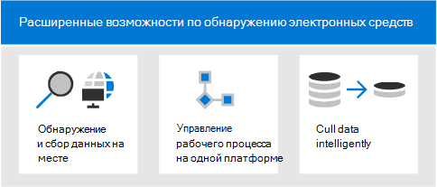
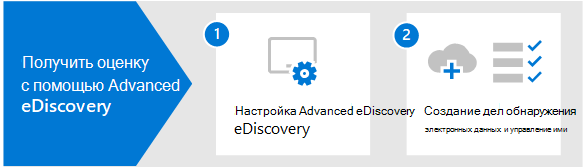

# Обзор Microsoft 365 Advanced eDiscovery

Решение Advanced eDiscovery в Microsoft 365 построено на существующих возможностях microsoft eDiscovery и аналитики. Advanced eDiscovery обеспечивает конечный рабочий процесс для сохранения, сбора, анализа, анализа и экспорта контента, отвечающей внутренним и внешним расследованиям организации. Он также позволяет группе юристов управлять всем рабочим процессом уведомления об удержании по юридическим причинам, чтобы общаться с хранителями, участвующими в деле.

## Advanced eDiscovery возможностей

Advanced eDiscovery может помочь организации реагировать на юридические вопросы или внутренние расследования, обнаруживая данные, в которых она живет. Вы можете легко управлять процессами электронных открытий, выявляя интересующих лиц и их источники данных, плавно применяя точки хранения для сохранения данных, а затем управляйте процессом связи с законным удержанием. Собирая данные из источника, вы можете искать платформу Microsoft 365, чтобы быстро найти то, что вам нужно. Интеллектуальные возможности машинного обучения, такие как глубокая индексация, потоковая отправка электронной почты и обнаружение дублирующихся данных, также помогают сократить большие объемы данных до соответствующего набора данных.

В следующих разделах описывается, как эти Advanced eDiscovery могут помочь вашей организации.

### Обнаружение и сбор данных на месте

Традиционно организациям, которые используют несколько сторонних решений по обнаружению электронных данных, требуется копирование больших объемов данных Microsoft 365 обработки и хранения дублирующих данных. Это увеличивает время поиска соответствующих данных, а также риски, затраты и сложность управления несколькими решениями.

Advanced eDiscovery в Microsoft 365 позволяет обнаружить данные в источнике и оставаться в пределах Microsoft 365 безопасности и соответствия требованиям.  Собирая данные на месте из живой системы, Advanced eDiscovery уменьшает трение при возвращающихся к источнику и уменьшает ненужную работу по поиску недостающего контента, что часто происходит при задержке журналов в традиционных решениях по обнаружению электронных данных.

Возможности поиска и сбора данных в Teams, Yammer, SharePoint Online, OneDrive для бизнеса и Exchange Online еще больше улучшают обнаружение данных. Например, Advanced eDiscovery:

- Восстанавливает Teams беседы (вместо того, чтобы возвращать отдельные сообщения из бесед).

- Собирает облачный контент, общий пользователям с помощью ссылок или современных вложений в сообщения электронной почты и Teams чатах.

- Имеет встроенную поддержку сотен типов Microsoft 365 файлов.

- Собирает данные из сторонних источников (таких как Bloomberg, Facebook, Slack и Zoom Meetings), импортируемых и архивируемых в Microsoft 365 соединители [данных.](archiving-third-party-data.md)

### Управление рабочий процессом электронных данных на одной платформе

Advanced eDiscovery поможет вам сократить количество решений по обнаружению электронных данных, на которые необходимо положиться. Он обеспечивает упорядоченный, конечный рабочий процесс, все, что происходит в Microsoft 365. Advanced eDiscovery помогает уменьшить трение при определении и сборе потенциальных источников соответствующей информации путем автоматического сопоставления уникальных и общих источников данных для заинтересованного лица (известного как хранитель), а также предоставления отчетов и аналитики по потенциально релевантным данным перед их сбором для анализа и анализа.

Кроме того, Graph API Майкрософт могут помочь автоматизировать рабочий процесс по обнаружению электронных данных и расширить Advanced eDiscovery пользовательских решений.

### Cull data intelligently

Интеллектуальные возможности машинного обучения в Advanced eDiscovery помогают уменьшить количество данных, которые необходимо просмотреть. Эти интеллектуальные возможности помогают сократить и отоиметь большие объемы данных до соответствующего набора. Например, встроенный запрос набора обзоров позволяет фильтровать только уникальный контент, выявляя ближайшие дубликаты. Эта возможность может существенно сократить объем данных, которые необходимо просмотреть.

Дополнительные возможности машинного обучения могут дополнительно уточнять и идентифицировать соответствующие данные с помощью смарт-тегов и вспомогательных средств проверки технологий, таких как модули Релевантность.

## Advanced eDiscovery согласование с моделью электронного обнаружения

Встроенный рабочий процесс Advanced eDiscovery в Microsoft 365 совпадает с процессом обнаружения электронных данных, описанным справочной моделью электронного обнаружения (EDRM).

(Источник изображений предоставлен edrm.net. Исходный образ был доступен в статье Creative Commons Attribution 3.0 Unported License.)

На общем уровне Advanced eDiscovery поддерживает описанный ниже рабочий процесс EDRM.

- **Идентификация.** Определив лиц, потенциально представляющих интерес для расследования, вы можете добавить их в качестве хранителей (также называемых *хранителями данных*, поскольку они могут располагать информацией, представляющей интерес для расследования) к делу Advanced eDiscovery. Добавив пользователей в качестве хранителей, вы можете легко сохранять, собирать и просматривать их документы.

- **Сохранение.** Чтобы сохранить и защитить данные, имеющие отношение к расследованию, в Advanced eDiscovery можно поместить источники данных, связанные с хранителями из соответствующего дела, на удержание по юридическим причинам. Вы также можете поместить на удержание данные, не принадлежащие хранителям. В Advanced eDiscovery также встроен рабочий процесс рассылки сообщений, с помощью которого можно отправлять хранителям уведомления об удержании по юридическим причинам и отслеживать их подтверждения.

- **Коллекция.** Определив (и сохранив) источники данных, имеющие отношение к расследованию, вы можете использовать встроенный в Advanced eDiscovery инструмент поиска для сбора актуальных данных из источников данных хранителей (а при необходимости — и других источников данных), которые могут иметь отношение к делу.

- **Обработка.** Собрав все данные, имеющие отношение к делу, необходимо обработать их для последующих проверки и анализа. В Advanced eDiscovery удерживаемые на месте данные, выявленные на этапе сбора, копируются в расположение в службе хранилища Azure (так называемый *набор для проверки*), где доступно статическое представление материалов дела. 

- **Обзор.** После того как данные были добавлены в набор отзывов, можно просмотреть конкретные документы и запустить дополнительные запросы, чтобы уменьшить количество данных до наиболее релевантной для дела. Кроме того, вы можете добавлять к документам примечания и теги.

- **Анализ.** Advanced eDiscovery предоставляет интегрированное средство аналитики, которое помогает вам отсеять данные из набора для проверки, не имеющие отношения к расследованию. Advance eDiscovery помогает не только сократить объем релевантных данных, но и экономить на юридических проверках, упорядочивая содержимое для более удобной и эффективной проверки.

- **Производство** и **презентация.** Когда все будет готово, вы можете экспортировать документы из набора для юридической проверки. Вы можете экспортировать документы в исходном формате или в формате, установленном в EDRM, чтобы их можно было импортировать в сторонние приложения для проверки.

## Подписки и лицензирование

Для лицензирования Advanced eDiscovery требуется соответствующая подписка на организацию и лицензирование для каждого пользователя.

- **Подписка на организацию:** Чтобы получить Advanced eDiscovery в центре Microsoft 365 соответствия требованиям, организация должна иметь один из следующих:

  - Подписка Microsoft 365 E5 или Office 365 E5
  
  - Подписка Microsoft 365 E3 с дополнительной надстройкой для соответствия требованиям E5

  - Microsoft 365 E3 подписка с надстройка eDiscovery и Audit E5

  - Microsoft 365 для образования Подписка на A5 или Office 365 для образования A5

   Если у вас нет существующего плана Microsoft 365 E5 и вы хотите попробовать  Advanced eDiscovery, вы можете добавить  Microsoft 365 к существующей подписке или подписаться на пробную Microsoft 365 E5.

- **Лицензирование для каждого пользователя:** Чтобы добавить пользователя в качестве хранителя в случае предварительного получения электронных данных, этому пользователю должна быть назначена одна из следующих лицензий в зависимости от подписки на организацию:

  - Microsoft 365. Пользователям должна быть назначена лицензия Microsoft 365 E5, надстройка соответствия требованиям E5 или лицензия E5 eDiscovery и Audit. Microsoft 365 для образования пользователям должна быть назначена лицензия A5.

  - Office 365: пользователям должна быть назначена Office 365 E5 или Office 365 для образования A5.

   Сведения о назначении лицензий см. в руб. [Назначение лицензий пользователям.](/microsoft-365/admin/manage/assign-licenses-to-users)

> [!NOTE]
> Пользователям требуется только лицензия E5 или A5 (или соответствующая надстройка), которая должна быть добавлена в качестве хранителей в Advanced eDiscovery случае. ИТ-администраторам, менеджерам по обнаружению электронных данных, юристам, паралегалам или следователям, которые используют Advanced eDiscovery для управления делами и проверки данных дел, не требуется лицензия E5, A5 или надстройка.

## Начало работы с Advanced eDiscovery

Существует два простых и быстрых шага для начала работы с Advanced eDiscovery.

|Шаги  |Описание  |
|:---------|:---------|
|[Настройка Advanced eDiscovery](get-started-with-advanced-ediscovery.md)| После проверки требований к подписке и лицензированию можно назначить разрешения и настроить параметры всей организации для начала работы с Advanced eDiscovery.|
|[Создание и управление случаями](create-and-manage-advanced-ediscoveryv2-case.md) | Создание случаев управления рабочим процессом Advanced eDiscovery для всех юридических и других типов расследований в вашей организации.|
|||

## Advanced eDiscovery архитектуры

Вот схема архитектуры Advanced eDiscovery, на которой показан конечный рабочий процесс в единой гео-среде и в среде с несколькими географическими данными, а также конечный поток данных, который совпадает с [EDRM.](#advanced-ediscovery-alignment-with-the-electronic-discovery-reference-model)

[Представление как изображение](../media/solutions-architecture-center/m365-advanced-ediscovery-architecture.png)

[Скачивание в формате PDF-файла](https://download.microsoft.com/download/d/1/c/d1ce536d-9bcf-4d31-b75b-fcf0dc560665/m365-advanced-ediscovery-architecture.pdf)

[Скачайте как Visio файл](https://download.microsoft.com/download/d/1/c/d1ce536d-9bcf-4d31-b75b-fcf0dc560665/m365-advanced-ediscovery-architecture.vsdx)
