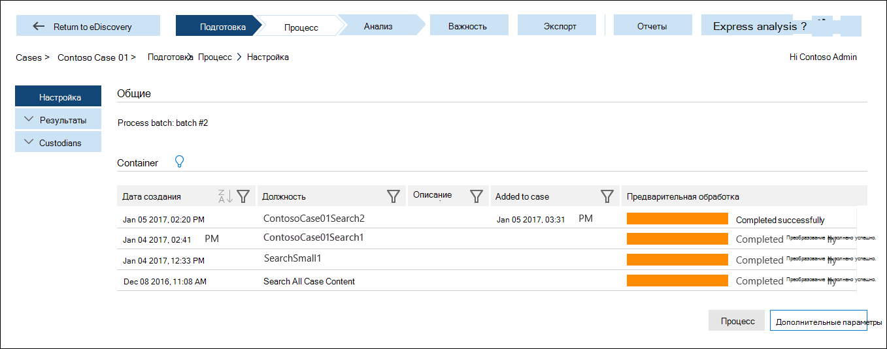

# Подготовка данных для расширенного обнаружения электронных данных (классический)Prepare data for Advanced eDiscovery (classic)

В этом разделе описывается, как загружать результаты поиска контента в случае с дополнительным обнаружением электронных данных (Classic).This topic describes how to load the results of a Content Search in to a case in Advanced eDiscovery (classic). 
  
> [!IMPORTANT]
> Продолжая инвестировать в разработку новых версий Advanced eDiscovery, мы сообщаем о прекращении поддержки версии Advanced eDiscovery, также известной как *Advanced eDiscovery (классическая версия)* или *Advanced eDiscovery 1.0*.As we continue to invest in newer versions of Advanced eDiscovery, we are announcing the retirement of Advanced eDiscovery, also known as *Advanced eDiscovery (classic)* or *Advanced eDiscovery v1.0*. Если вы все еще используете Advanced eDiscovery 1.0, перейдите на версию [Advanced eDiscovery 2.0](overview-ediscovery-20.md) (также известную как *решение Advanced eDiscovery в Microsoft 365*) как можно скорее.If you're still using Advanced eDiscovery v1.0, please transition to [Advanced eDiscovery v2.0](overview-ediscovery-20.md) (also known as the *Advanced eDiscovery solution in Microsoft 365*) as soon as possible. Advanced eDiscovery 2.0 имеет те же функции, что и Advanced eDiscovery 1.0, а также множество новых возможностей, таких как управление для хранителя, управление коммуникацией и наборы для проверки.Advanced eDiscovery 2.0 contains similar functionality found in Advanced eDiscovery v1.0, but also offers many new features such as custodian management, communications management, and review sets. Дополнительные сведения о прекращении поддержки Advanced eDiscovery 1.0 см. в статье [Прекращение поддержки средств прежних версий eDiscovery](legacy-ediscovery-retirement.md#advanced-ediscovery-v10).To learn more about the retirement of Advanced eDiscovery v1.0, see [Retirement of legacy eDiscovery tools](legacy-ediscovery-retirement.md#advanced-ediscovery-v10).  
  
## Шаг 1: подготовка данных для расширенного обнаружения электронных данныхStep 1: Prepare data for Advanced eDiscovery

Для анализа данных с помощью расширенного обнаружения электронных данных можно использовать результаты поиска контента, который вы используете в центре безопасности Майкрософт 365 &amp; (на странице " **Поиск контента** " в центре безопасности соответствия требованиям Microsoft 365 &amp; ), или при поиске, связанном с вариантом обнаружения электронных данных, на странице **Обнаружение электронных** данных в центре безопасности и &amp; соответствия требованиям.To analyze data with Advanced eDiscovery, you can use the results of a Content Search that you run in the Microsoft 365 Security &amp; Compliance Center (listed on the **Content search** page in the Microsoft 365 Security &amp; Compliance Center) or a search associated with an eDiscovery case (listed on the **eDiscovery** page in the Security &amp; Compliance Center). 
  
Подробные инструкции по подготовке результатов поиска для анализа в Advanced eDiscovery приведены в статье [Подготовка результатов поиска для расширенного обнаружения электронных](prepare-search-results-for-advanced-ediscovery.md)данных.For the detailed steps on preparing search results for analysis in Advanced eDiscovery, see [Prepare search results for Advanced eDiscovery](prepare-search-results-for-advanced-ediscovery.md).
  
> [!NOTE]
> Если у вас есть данные за пределами Microsoft 365 и хотите импортировать их в Microsoft 365, чтобы вы могли подготовить и проанализировать их в Advanced eDiscovery, ознакомьтесь со статьей [Обзор импорта PST-файлов в microsoft 365](https://docs.microsoft.com/microsoft-365/compliance/importing-pst-files-to-office-365) и [архивации сторонних данных](https://go.microsoft.com/fwlink/p/?linkid=716918).If you have data outside of Microsoft 365 and want to import it to Microsoft 365 so that you can prepare and analyze it in Advanced eDiscovery, a see [Overview of importing PST files to Microsoft 365](https://docs.microsoft.com/microsoft-365/compliance/importing-pst-files-to-office-365) and [Archiving third-party data](https://go.microsoft.com/fwlink/p/?linkid=716918). 
  
## Шаг 2: Загрузка данных результатов поиска в дело с дополнительным обнаружением электронных данныхStep 2: Load search result data in to a case in Advanced eDiscovery

После подготовки результатов поиска в центре безопасности и &amp; соответствия требованиям для анализа следующий шаг — загрузка результатов поиска в случае Advanced eDiscovery.After you prepare the search results in the Security &amp; Compliance Center for analysis, the next step is to load the search results in to a case in Advanced eDiscovery. Более подробную информацию можно найти в разделе [Run the process Module](run-the-process-module-in-advanced-ediscovery.md).For more detailed information, see [Run the Process module](run-the-process-module-in-advanced-ediscovery.md).
  
1. Перейдите по ссылке [https://protection.office.com](https://protection.office.com).Go to [https://protection.office.com](https://protection.office.com).
    
2. Выполните вход с помощью рабочей или учебной учетной записи.Sign in using your work or school account.
    
3. Чтобы отобразился список дел в организации, в Центре безопасности и соответствия требованиям выберите **Поиск и исследование** \> **Обнаружение электронных данных**.In the Security &amp; Compliance Center, click **Search &amp; investigation** \> **eDiscovery** to display the list of cases in your organization. 
    
4. Нажмите кнопку **Открыть** рядом с тем случае, в которое вы хотите загрузить данные в разделе Advanced eDiscovery.Click **Open** next to the case that you want to load data in to in Advanced eDiscovery. 
    
5. На странице **Главная** для этого дела выберите **Advanced eDiscovery**.On the **Home** page for the case, click **Advanced eDiscovery**. 
    
    
  
    Отображается панель **подключения к расширенному** индикатору выполнения обнаружения электронных данных.The **Connecting to Advanced eDiscovery** progress bar is displayed. При подключении к расширенному обнаружению электронных данных список контейнеров отображается на странице Настройка для этого случая.When you're connected to Advanced eDiscovery, a list of containers is displayed on the setup page for the case. 
    
    
  
     Эти контейнеры представляют результаты поиска, подготовленные для анализа в ходе расширенного обнаружения электронных данных на этапе 1.These containers represent the search results that you prepared for analysis in Advanced eDiscovery in Step 1. Обратите внимание, что имя контейнера имеет то же имя, что и поиск контента, в случае в &amp; центре соответствия требованиям безопасности.Note that the name of the container has the same name as the Content Search in the case in the Security &amp; Compliance Center. Контейнеры в списке подготовлены.The containers in the list are the ones that you prepared. Если для расширенного обнаружения электронных данных были подготовлены другие пользовательские результаты поиска, соответствующие контейнеры не будут включены в список.If a different user prepared search results for Advanced eDiscovery, the corresponding containers won't be included in the list. 
    
6. Чтобы загрузить данные результатов поиска из контейнера в дело с дополнительным обнаружением электронных данных, выберите контейнер и нажмите кнопку **обработать**.To load the search result data from a container in to the case in Advanced eDiscovery, select a container and then click **Process**.
    
После добавления результатов поиска из центра безопасности и &amp; соответствия требованиям в Advanced eDiscovery, следующим шагом является использование средств расширенного обнаружения электронных данных для анализа и отбора данных, релевантных для случая.After the search results from the Security &amp; Compliance Center are added to the case in Advanced eDiscovery, the next step is to use the tools in Advanced eDiscovery to analyze and cull the data that's relevant to the case. 
  
## См. такжеSee also

[Advanced eDiscovery (классическая версия)Advanced eDiscovery (classic)](office-365-advanced-ediscovery.md)
  
[Настройка пользователей и обращенийSet up users and cases](set-up-users-and-cases-in-advanced-ediscovery.md)
  
[Анализ данных делаAnalyzing case data](analyze-case-data-with-advanced-ediscovery.md)
  
[Управление установкой релевантностиManaging Relevance setup](manage-relevance-setup-in-advanced-ediscovery.md)
  
[Использование модуля релевантностиUsing the Relevance module](use-relevance-in-advanced-ediscovery.md)
  
[Экспорт данных делаExporting case data](export-case-data-in-advanced-ediscovery.md)

