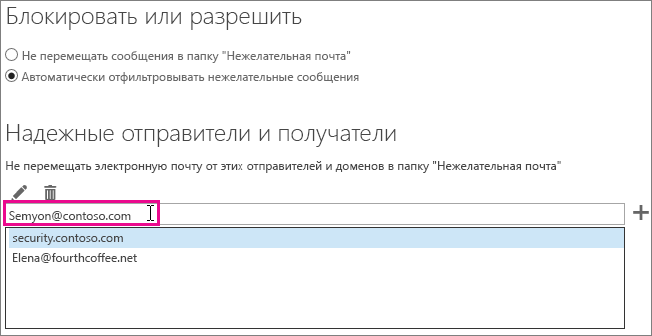

# <a name="how-to-prevent-real-email-from-being-marked-as-spam-in-office-365"></a>Как не допустить, чтобы настоящая почта помечалась как спам в Office 365

 **Подлинные электронные сообщения помечаются как спам в Office 365? Попробуйте это решение.**

При возникновении ложного срабатывания следует уведомить о сообщении корпорацию Майкрософт с помощью [надстройки Report Message](https://support.office.com/article/b5caa9f1-cdf3-4443-af8c-ff724ea719d2). Или можно отправить сообщение с помощью [обозревателя отправок](/security/office-365-security/admin-submission.md).

## <a name="determine-the-reason-why-the-message-was-marked-as-spam"></a>Определение причины, по которой сообщение было помечено как спам

Множество проблем с нежелательной почтой в Office 365 можно решить, [изучив заголовки сообщений электронной почты](https://support.office.com/article/cd039382-dc6e-4264-ac74-c048563d212c) и определив, где произошла ошибка. Необходимо искать заголовок с именем X-Forefront-Antispam-Report. В [этой статье](https://technet.microsoft.com/library/dn205071%28v=exchg.150%29.aspx) вы можете найти дополнительные сведения о заголовках сообщений о защите от нежелательной почты.

Ищите в заголовке перечисленные ниже названия и значения.

### <a name="x-forefront-antispam-report"></a>X-Forefront-Antispam-Report

- **SFV:SPM**. Указывает на то, что сообщение было помечено как нежелательное из-за фильтров EOP.

- **SFV:BLK**. Указывает на то, что сообщение было помечено как нежелательное, потому что адрес отправителя указан в списке заблокированных отправителей на стороне получателя.

- **SFV:SKS**. Указывает на то, что сообщение было помечено как нежелательное до обработки фильтром содержимого. Такая отметка появляется, например, когда правило потока почты (другое название — правило транспорта) помечает сообщение как нежелательное. Чтобы узнать о том, было ли активировано правило потока почты с высоким уровнем вероятности нежелательной почты, запустите трассировку сообщений.

- **SFV:SKB**. Указывает на то, что сообщение было помечено как нежелательное, так как оно соответствует параметрам списка блокировок в политике фильтрации нежелательной почты.

- **SFV:BULK**. Указывает на то, что значение порога неприятия массовых рассылок (BCL), указанное в заголовке X-Microsoft-Antispam, превышает пороговое значение, установленное для фильтра содержимого. Массовая рассылка — это сообщения, на которые пользователи могли подписаться, но которые все же могут оказаться нежелательными. В заголовке сообщения найдите заголовок X-Microsoft-Antispam, содержащий свойство "вероятность массовой рассылки" (BCL). Если значение свойства BCL меньше порогового значения, установленного для фильтра нежелательной почты, вы можете изменить его так, чтобы массовые рассылки такого типа помечались как нежелательная почта. Разные пользователи по-разному относятся к массовым рассылкам и [управлению ими](https://docs.microsoft.com/microsoft-365/security/office-365-security/bulk-complaint-level-values). Вы можете создавать различные политики и правила в зависимости от предпочтений пользователей.

- **CAT:SPOOF** или **CAT:PHISH**. Указывает на то, что сообщение похоже на поддельное, иначе говоря, оно получено из неподтвержденного или подозрительного источника. Если отправитель подтвержден, ему необходимо проверить конфигурацию инфраструктуры политики отправителей и DKIM. Дополнительные сведения см. в заголовке Authentication-Results. Добиться того, чтобы все отправители использовали правильные методы подтверждения подлинности, может оказаться трудной задачей. Тем не менее игнорирование этих проверок может представлять большую опасность и стать одной из главных причин нарушений.

### <a name="x-customspam"></a>x-customspam

- Наличие этого заголовка означает, что сообщение было помечено как спам, потому что в вашем фильтре содержимого [включен один из расширенных параметров нежелательной почты](https://technet.microsoft.com/library/jj200750%28v=exchg.150%29.aspx). Если вам не нужны эти функции, рекомендуем использовать параметры по умолчанию.

## <a name="solutions-to-additional-causes-of-too-much-spam"></a>Устранение других причин получения больших объемов спама

Для эффективной работы Exchange Online Protection (EOP) администраторы должны выполнить несколько задач. Если вы не являетесь администратором клиента Office 365 и получаете слишком много спама, то можете обратиться к администратору за помощью в выполнении этих задач. В противном случае можете переходить к разделу для пользователей.

### <a name="for-admins"></a>Для администраторов

- **Настройте записи DNS таким образом, чтобы они указывали на Office 365**. Чтобы служба EOP могла защищать вашу почту, записи DNS почтового обменника (MX) для всех доменов должны указывать исключительно на Office 365. Если записи MX не указывают на Office 365, служба EOP не может фильтровать нежелательную почту пользователей. Если вы хотите использовать другую службу или устройство для фильтрации нежелательной почты в своем домене, подумайте над выключением защиты от нежелательной почты в EOP. Для этого нужно создать правило потока почты, при котором значение вероятности нежелательной почты равно -1.   Если позже вы решите использовать EOP, не забудьте удалить это правило потока почты.

- **Включите надстройку Report Message для пользователей**. Мы настоятельно рекомендуем [включить надстройку Report Message для пользователей в вашей организации](/security/office-365-security/enable-the-report-message-add-in.md).

- **Используйте [обозреватель отправок](/security/office-365-security/admin-submission.md)**. Администраторы в Office 365 теперь могут отправлять сообщения электронной почты, используя идентификатор файла или сетевого сообщения, URL-адреса и файлы для сканирования корпорацией Майкрософт. Как администратор вы также можете просматривать отзывы пользователей и настраивать любые параметры, которые могут вызывать проблемы.

- **Убедитесь, что пользователи не превышают допустимые пределы** отправки и получения электронных сообщений, представленные [здесь](https://docs.microsoft.com/ru-RU/office365/servicedescriptions/exchange-online-service-description/exchange-online-limits).

- **Еще раз проверьте уровни массовой почты**, указанные [здесь](/security/office-365-security/bulk-complaint-level-values.md).

### <a name="for-users"></a>Для пользователей

- **Создайте список надежных отправителей**. Пользователи могут добавить адреса отправителей, которым они доверяют, в списки надежных отправителей в [Outlook](https://go.microsoft.com/fwlink/p/?LinkId=270065) или [Outlook в Интернете](https://go.microsoft.com/fwlink/p/?LinkId=294862) (прежнее название — Outlook Web App). В Outlook в Интернете для этого нужно выбрать **Параметры** \> **Параметры** \> **Блокировка или разрешение**. На схеме ниже показан пример добавления элемента в список надежных отправителей.



EOP будет учитывать списки надежных отправителей и получателей, настроенные пользователями, но не списки надежных доменов. Это не зависит от того, был ли домен добавлен через Outlook в Интернете или же добавлен в Outlook и синхронизирован с помощью синхронизации каталогов.

- **Отключите фильтр SmartScreen в Outlook**. Если используется более ранняя версия классического клиента Outlook, следует отключить фильтр SmartScreen, поддержка которого прекращена. Работа этого фильтра может приводить к ложным срабатываниям. При использовании обновленного классического клиента Outlook этот фильтр не нужен.

## <a name="troubleshooting-a-message-ends-up-in-the-junk-folder-even-though-eop-marked-the-message-as-non-spam"></a>Устранение неполадок: сообщение попадает в папку "Нежелательная почта", хотя EOP помечает его как не являющееся спамом

Если пользователь настроил в Outlook параметр "Только списки надежных адресатов. В папку "Входящие" доставляется только почта от пользователей и из доменов, включенных в списки надежных отправителей и получателей", в папку "Нежелательная почта" будут попадать сообщения всех отправителей, которых нет в списке надежных отправителей. Это происходит даже в том случае, если EOP помечает сообщение как не являющееся нежелательным или в EOP настроено соответствующее правило.

Вы можете отключить этот параметр для пользователей Outlook, следуя инструкциям в статье [Outlook: параметр политики для отключения интерфейса нежелательной почты и механизма фильтрации](https://support.microsoft.com/ru-RU/kb/2180568).

При просмотре сообщения в Outlook в Интернете будет выводиться выделенное желтым предупреждение о том, что сообщение находится в папке "Нежелательная почта", так как отправителя нет в списке надежных отправителей получателя.

В заголовке сообщения может быть штамп SFV:SKN (список разрешенных IP-адресов или разрешение ETR) либо SFV:NSPM (не является нежелательным), но сообщение все равно будет помещено в папку "Нежелательная почта" пользователя. В заголовке сообщения не указано, что пользователь включил параметр "Только списки надежных адресатов". Это происходит потому, что параметр "Только списки надежных адресатов", заданный в Outlook, переопределяет параметр EOP.

### <a name="to-verify-why-a-message-from-a-safe-sender-is-marked-as-non-spam-in-the-message-header-but-still-ends-up-in-the-users-junk-folder"></a>Как проверить, почему сообщение от надежного отправителя имеет пометку "Не является нежелательным" в заголовке, но попадает в папку "Нежелательная почта"

1. Сведения о том, как подключиться к Exchange Online PowerShell, см. в статье [Подключение к Exchange Online PowerShell](https://go.microsoft.com/fwlink/p/?LinkId=396554).

2. Выполните приведенную ниже команду, чтобы просмотреть параметры настройки нежелательной почты для пользователя:

  ```Powershell
  Get-MailboxJunkEmailConfiguration example@contoso.com | Format-List TrustedListsOnly,ContactsTrusted,TrustedSendersAndDomains
  ```

- Если параметр TrustedListsOnly имеет значение True, этот параметр включен.

- Если параметр ContactsTrusted имеет значение True, пользователь доверяет контактам и надежным отправителям.

- В списке TrustedSendersAndDomains перечислены надежные отправители для этого пользователя

## <a name="eop-only-customers-use-directory-synchronization"></a>Для клиентов с подпиской только на EOP: синхронизация каталогов

Если вы являетесь клиентом с подпиской только на службу EOP, которая используется с локальным почтовым сервером (Exchange), синхронизируйте параметры пользователей со службой посредством синхронизации службы каталогов. Благодаря этому в EOP будут учитываться ваши списки надежных отправителей. Дополнительные сведения см. в разделе "Управление почтовыми пользователями с помощью синхронизации службы каталогов" статьи [Управление почтовыми пользователями в EOP](https://go.microsoft.com/fwlink/?LinkId=534098).
