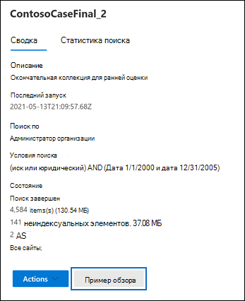

# Предварительный просмотр результатов поиска обнаружения электронных данныхPreview eDiscovery search results

После запуска поиска контента или поиска, связанного с делом Core eDiscovery, можно просмотреть образец результатов, возвращенных при поиске.After you run a Content search or a search associated with a Core eDiscovery case, you can preview a sample of the results returned by the search. Предварительный просмотр элементов, возвращаемых поисковым запросом, может помочь определить, возвращает ли поиск те результаты, на которые вы надеетесь, или вам нужно изменить поисковый запрос и повторно использовать поиск.Previewing items returned by the search query can help you determine if the search is returning the results you hope for or if you need to change the search query and rerun the search.

Чтобы просмотреть образец результатов, возвращаемого при поиске, выполните следующие действия:To preview a sample of results returned by a search:

1. В Центре соответствия требованиям Microsoft 365 перейдите на страницу поиска контента или к делу Core eDiscovery.In the Microsoft 365 compliance center, go to the Content search page or a Core eDiscovery case.

2. Выберите поиск, чтобы отобразить всплывающую страницу.Select search to display the flyout page.

3. В нижней части всплывающей страницы щелкните **Просмотреть образец**.On the bottom of the flyout page, click **Review sample**.

   

   Откроется страница с образцом результатов поиска.A page is displayed containing a sample of the search results.

4. Выберите элемент, чтобы просмотреть его содержимое в области просмотра.Select an item to view its contents in the reading pane.

   

   На предыдущем снимке экрана обратите внимание, что ключевые слова из поискового запроса выделяются при предварительном просмотре элементов.In the previous screenshot, notice that keywords from the search query are highlighted when you preview items.

## Выбор примеров результатов поискаHow the search result samples are selected

Для предварительного просмотра доступно не более 1000 случайно выбранных элементов.A maximum of 1,000 randomly selected items are available to preview. Элементы, доступные для предварительного просмотра, не только выбираются случайным образом, но и должны соответствовать следующим критериям:In addition to being randomly selected, items available for preview must also meet the following criteria:

- Предварительно просмотреть можно не более 100 элементов из одного расположения контента (почтового ящика или сайта).A maximum of 100 items from a single content location (a mailbox or a site) can be previewed. Это означает, что в предварительной версии может быть доступно менее 1000 элементов.This means that it's possible that less than 1,000 items might be available for preview. Например, если при поиске в четырех почтовых ящиках возвращается 1500 элементов, предварительный просмотр будет доступен только для 400 элементов, так как предварительный просмотр доступен только для 100 элементов из каждого почтового ящика.For example, if you search four mailboxes and the search returns 1,500 estimated items, only 400 will be available for preview because only 100 items from each mailbox can be previewed.

- Для элементов почтового ящика для предварительного просмотра доступны только сообщения электронной почты.For mailbox items, only email messages are available to preview. Невозможно предварительно просмотреть такие элементы, как задачи, элементы календаря и контакты.Items like tasks, calendar items, and contacts can't be previewed.

- Для элементов сайта для предварительного просмотра доступны только документы.For site items, only documents are available to preview. Невозможно предварительно просмотреть такие элементы, как папки, списки или вложения списков.Items like folders, lists, or list attachments can't be previewed.

## Типы файлов, поддерживаемые при предварительном просмотре результатов поискаFile types supported when previewing search results

Файлы поддерживаемых типов можно просматривать в области просмотра.You can preview supported file types in the preview pane. Если тип файла не поддерживается, необходимо скачать копию файла на локальный компьютер (щелкнув **Скачать исходный элемент**).If a file type isn't supported, you have to download a copy of the file to your local computer (by clicking **Download original item**). Включается URL-адрес веб-страницы формата ASPX, но у вас может не быть разрешений на доступ к ней.For .aspx Web pages, the URL for the page is included though you may not have permissions to access the page. Неиндексированные элементы недоступны для предварительного просмотра.Unindexed items aren't available for previewing.

Следующие поддерживаемые типы файлов можно просматривать в области результатов поиска.The following file types are supported and can be previewed in the search results pane.
  
- TXT, HTML, MHTML.txt, .html, .mhtml

- EML.eml

- DOC, DOCX, DOCM.doc, .docx, .docm

- PPTM, PPTX.pptm, .pptx

- PDF.pdf

Также поддерживаются следующие типы файлов контейнера.Also, the following file container types are supported. Списки файлов контейнера можно просматривать в области предварительного просмотра.You can view the list of files in the container in the preview pane.
  
- ZIP.zip

- GZIP.gzip