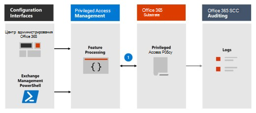
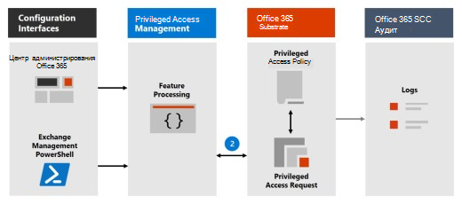
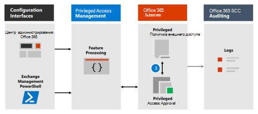
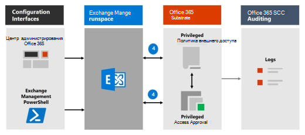

# Управление привилегированным доступомPrivileged access management

Управление привилегированным доступом позволяет осуществлять детализированный контроль над задачами привилегированного администрирования в Office 365.Privileged access management allows granular access control over privileged admin tasks in Office 365. Это поможет защитить организацию от нарушений, которые используют существующие привилегированные учетные записи администратора с ограниченным доступом к конфиденциальным данным или к критически важным параметрам конфигурации.It can help protect your organization from breaches that use existing privileged admin accounts with standing access to sensitive data or access to critical configuration settings. Управление привилегированным доступом требует от пользователей запрашивать доступ по требованию к выполнению привилегированных и привилегированных задач с помощью рабочего процесса утверждения с высоким уровнем с областью действия и с ограниченным временем действия.Privileged access management requires users to request just-in-time access to complete elevated and privileged tasks through a highly scoped and time-bounded approval workflow. Эта конфигурация дает пользователям достаточно прав для выполнения задачи, не выполняя риск потери конфиденциальных данных или критически важных параметров конфигурации.This configuration gives users just-enough-access to perform the task at hand, without risking exposure of sensitive data or critical configuration settings. Включение управления привилегированным доступом в Microsoft 365 позволяет организации работать с нулевыми привилегиями и обеспечивать уровень защиты от появления уязвимостей административного доступа.Enabling privileged access management in Microsoft 365 allows your organization to operate with zero standing privileges and provide a layer of defense against standing administrative access vulnerabilities.

Чтобы получить краткий обзор интегрированного защищенного хранилища и рабочего процесса управления доступом для клиентов, просмотрите [видео о защищенном доступе и привилегированном доступе](https://go.microsoft.com/fwlink/?linkid=2066800).For a quick overview of the integrated Customer Lockbox and privileged access management workflow, see this [Customer Lockbox and privileged access management video](https://go.microsoft.com/fwlink/?linkid=2066800).

## Уровни защитыLayers of protection

Управление привилегированным доступом дополняет другие функции защиты данных и доступа в архитектуре безопасности Microsoft 365.Privileged access management complements other data and access feature protections within the Microsoft 365 security architecture. Включение привилегированного управления доступом в рамках интегрированного и многоуровневого подхода к безопасности обеспечивает модель безопасности, которая максимизирует защиту конфиденциальной информации и параметров конфигурации Microsoft 365.Including privileged access management as part of an integrated and layered approach to security provides a security model that maximizes protection of sensitive information and Microsoft 365 configuration settings. Как показано на схеме, управление привилегированным доступом выполняется на основе защиты, предоставляемой с помощью встроенного шифрования данных Microsoft 365 и модели безопасности управления доступом на основе ролей для служб Microsoft 365.As shown in the diagram, privileged access management builds on the protection provided with native encryption of Microsoft 365 data and the role-based access control security model of Microsoft 365 services. При использовании с [правами привилегированного управления удостоверениями Azure AD](https://docs.microsoft.com/azure/active-directory/active-directory-privileged-identity-management-configure)эти две функции обеспечивают управление доступом с помощью доступа по требованию в различных областях.When used with [Azure AD Privileged Identity Management](https://docs.microsoft.com/azure/active-directory/active-directory-privileged-identity-management-configure), these two features provide access control with just-in-time access at different scopes.

Управление привилегированным доступом определяется и задается на уровне **задачи** , а управление удостоверениями Azure AD обеспечивает защиту на уровне **ролей** с возможностью выполнения нескольких задач.Privileged access management is defined and scoped at the **task** level, while Azure AD Privileged Identity Management applies protection at the **role** level with the ability to execute multiple tasks. Служба управления удостоверениями Azure AD в основном позволяет управлять ролями AD и группами ролей, в то время как управление привилегированным доступом в Microsoft 365 применяется только на уровне задачи.Azure AD Privileged Identity Management primarily allows managing accesses for AD roles and role groups, while privileged access management in Microsoft 365 applies only at the task level.

- **Включение управления привилегированным доступом в то время, когда уже используется Azure AD с правами на управление удостоверениями:** Добавление привилегированного управления доступом обеспечивает еще один детализированный уровень защиты и возможности аудита для привилегированного доступа к данным Microsoft 365.**Enabling privileged access management while already using Azure AD Privileged Identity Management:** Adding privileged access management provides another granular layer of protection and audit capabilities for privileged access to Microsoft 365 data.

- **Включение привилегированного управления удостоверениями Azure AD при использовании привилегированного управления доступом в Office 365:**  Добавление привилегированного управления удостоверениями Azure AD в Управление привилегированным доступом позволяет расширить доступ к данным вне Microsoft 365, которые в основном определяются ролями пользователей или удостоверениями.**Enabling Azure AD Privileged Identity Management while already using privileged access management in Office 365:**  Adding Azure AD Privileged Identity Management to privileged access management can extend privileged access to data outside of Microsoft 365 that's primarily defined by user roles or identity.  

## Архитектура управления привилегированным доступом и последовательность процессовPrivileged access management architecture and process flow

Каждый из следующих процессов обрабатывает архитектуру привилегированного доступа и взаимодействие с подложкой Microsoft 365, аудитом и пространством выполнения управления Exchange.Each of the following process flows outline the architecture of privileged access and how it interacts with the Microsoft 365 substrate, auditing, and the Exchange Management runspace.

### Шаг 1: Настройка политики привилегированного доступаStep 1: Configure a privileged access policy

При настройке политики привилегированного доступа с помощью [центра администрирования Microsoft 365](https://admin.microsoft.com) или Exchange Management PowerShell вы определяете политику и процессы привилегированного доступа и атрибуты политики на подложке Microsoft 365.When you configure a privileged access policy with the [Microsoft 365 admin center](https://admin.microsoft.com) or the Exchange Management PowerShell, you define the policy and the privileged access feature processes and the policy attributes in the Microsoft 365 substrate. Действия регистрируются в центре безопасности и &amp; соответствия требованиям.The activities are logged in the Security &amp; Compliance Center. Теперь политика включена и готова к обработке входящих запросов на утверждения.The policy is now enabled and ready to handle incoming requests for approvals.

### Шаг 2: запрос на доступStep 2: Access request

В [центре администрирования Microsoft 365](https://admin.microsoft.com) или Exchange Management PowerShell пользователи могут запрашивать доступ к повышенным или привилегированным задачам.In the [Microsoft 365 admin center](https://admin.microsoft.com) or with the Exchange Management PowerShell, users can request access to elevated or privileged tasks. Функция привилегированного доступа отправляет запрос на подложку Microsoft 365 для обработки в настроенной политике доступа к данным и записывает действия в &amp; журналы центра соответствия требованиям безопасности.The privileged access feature sends the request to the Microsoft 365 substrate for processing against the configured privilege access policy and records the Activity in the Security &amp; Compliance Center logs.

### Шаг 3: утверждение доступаStep 3: Access approval

Будет создан запрос на утверждение, а уведомление о незавершенном запросе будет отправлено утверждающим.An approval request is generated and the pending request notification is emailed to approvers. В случае утверждения привилегированный запрос на доступ обрабатывается как утверждение и готов к выполнению задачи.If approved, the privileged access request is processed as an approval and the task is ready to be completed. Если этот параметр отклонен, задача блокируется, а запрашивающему не предоставляется доступ.If denied, the task is blocked and no access is granted to the requestor. Запрашивающий уведомляет об утверждении или отказе от запроса через сообщение электронной почты.The requestor is notified of the request approval or denial via email message.

### Шаг 4: обработка доступаStep 4: Access processing

Для утвержденного запроса задача обрабатывается пространством выполнения управления Exchange.For an approved request, the task is processed by the Exchange Management runspace. Утверждение проверяется на соответствие политике привилегированного доступа и обрабатывается с помощью подложки Microsoft 365.The approval is checked against the privileged access policy and processed by the Microsoft 365 substrate. Все действия для задачи записываются в центре безопасности и &amp; соответствия требованиям.All activity for the task is logged in the Security &amp; Compliance Center.

## Вопросы и ответыFrequently asked questions

### Какие номера SKU могут использовать привилегированный доступ в Office 365?What SKUs can use privileged access in Office 365?

Управление привилегированным доступом доступно для пользователей с широким набором подписок и надстроек Microsoft 365 и Office 365.Privileged access management is available for customers for a wide selection of Microsoft 365 and Office 365 subscriptions and add-ons. Дополнительные сведения можно найти в статье Начало [работы с правами на управление правами на доступ к данным](privileged-access-management-configuration.md) .See [Get started with privileged access management](privileged-access-management-configuration.md) for details.

### Когда будет поддерживаться привилегированный доступ к рабочим нагрузкам Office 365 за пределами Exchange?When will privileged access support Office 365 workloads beyond Exchange?

Управление привилегированным доступом скоро будет доступно в других рабочих нагрузках Office 365.Privileged access management will be available in other Office 365 workloads soon. Для получения дополнительных сведений посетите [план Microsoft 365](https://www.microsoft.com/microsoft-365/roadmap) .Visit the [Microsoft 365 Roadmap](https://www.microsoft.com/microsoft-365/roadmap) for more details.

### Для организации требуется более 30 политик привилегированного доступа? это максимальное значение будет увеличено.My organization needs more than 30 privileged access policies, will this limit be increased?

Да, если вы придаете текущему ограничению 30 привилегированных политик доступа для каждой организации, в ней находится схема компонентов.Yes, raising the current limit of 30 privileged access policies per organization is on the feature roadmap.

### Нужен ли глобальный администратор для управления привилегированным доступом в Office 365?Do I need to be a Global Admin to manage privileged access in Office 365?

Нет, роль управления ролями Exchange должна быть назначена учетным записям, которые управляют привилегированным доступом в Office 365.No, you need the Exchange Role Management role assigned to accounts that manage privileged access in Office 365. Если вы не хотите настраивать роль управления ролями в качестве автономного разрешения, роль глобального администратора включает эту роль по умолчанию и может управлять привилегированным доступом.If you don't want to configure the Role Management role as a stand-alone account permission, the Global Administrator role includes this role by default and can manage privileged access. Пользователи, включенные в группу утверждающих, не обязательно должны быть глобальными администраторами или иметь роль управления ролями, назначенную для просмотра и утверждения запросов с помощью PowerShell.Users included in an approvers' group don't need to be a Global Admin or have the Role Management role assigned to review and approve requests with PowerShell.

### Как управление привилегированным доступом связано с защищенным хранилищем пользователей?How is privileged access management related to Customer Lockbox?

[Служба защищенного хранилища](https://docs.microsoft.com/office365/admin/manage/customer-lockbox-requests) обеспечивает уровень управления доступом для организаций, когда Microsoft обращается к данным.[Customer Lockbox](https://docs.microsoft.com/office365/admin/manage/customer-lockbox-requests) allows a level of access control for organizations when Microsoft accesses data. Управление привилегированным доступом позволяет управлять детальным доступом в Организации для всех привилегированных задач Microsoft 365.Privileged access management allows granular access control within an organization for all Microsoft 365 privileged tasks.

## Готовы приступить к работе?Ready to get started?

Начните [настраивать организацию для управления привилегированным доступом](privileged-access-management-configuration.md).Start [configuring your organization for privileged access management](privileged-access-management-configuration.md).

## ПодробнееLearn more

[Интерактивное руководство: мониторинг и управление задачами администрирования с помощью привилегированного управления доступомInteractive guide: Monitor and control administrator tasks with privileged access management](https://content.cloudguides.com/guides/Privileged%20Access%20Management)
