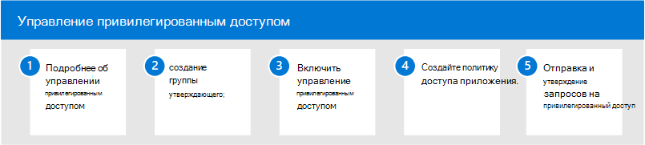

# Управление привилегированным доступом в Microsoft 365

Постоянный доступ некоторых пользователей к конфиденциальной информации или критическим настройкам конфигурации сети в Microsoft Exchange Online является потенциальным путем для компрометации учетных записей или внутренних угроз. Управление привилегированным доступом помогает защитить организацию от нарушений безопасности и обеспечить соответствие требованиям, ограничив постоянный доступ к конфиденциальным данным или доступ к критически важным настройкам конфигурации. Вместо того чтобы администраторы с постоянным доступом, правила доступа в срок реализуются для задач, которые нуждаются в повышенных разрешениях. Включение управления привилегированным доступом для Exchange Online в Microsoft 365 позволяет вашей организации работать без постоянных привилегий и обеспечивать уровень защиты от постоянных уязвимостей административного доступа.

## Настройка управления привилегированным доступом для Microsoft 365

Чтобы настроить управление привилегированным доступом в организации, с помощью следующих действий:

1. Узнайте об [управлении привилегированным доступом](privileged-access-management-overview.md) в Microsoft 365
2. Создание группы [утвержденного](privileged-access-management-configuration.md#step-1-create-an-approvers-group)
3. Включить [управление привилегированным доступом](privileged-access-management-configuration.md#step-2-enable-privileged-access)
4. Создание политики [доступа](privileged-access-management-configuration.md#step-3-create-an-access-policy)
5. Отправка и утверждение [запросов на привилегированный доступ](privileged-access-management-configuration.md#step-4-submitapprove-privileged-access-requests)

## Дополнительные сведения об управлении привилегированным доступом

- [Вопросы и ответы об управлении привилегированным доступом](privileged-access-management-overview.md#frequently-asked-questions)