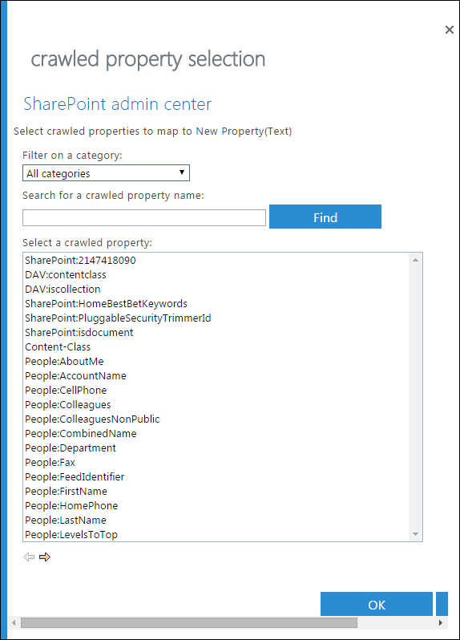

# <a name="create-a-dlp-policy-to-protect-documents-with-fci-or-other-properties"></a><span data-ttu-id="62780-103">Создание политики защиты от потери данных для защиты документов с помощью FCI или других свойств</span><span class="sxs-lookup"><span data-stu-id="62780-103">Create a DLP policy to protect documents with FCI or other properties</span></span>

<span data-ttu-id="62780-104">В Microsoft 365 вы можете использовать политику защиты от потери данных (DLP) для определения, отслеживания и защиты конфиденциальной информации.</span><span class="sxs-lookup"><span data-stu-id="62780-104">In Microsoft 365, you can use a data loss prevention (DLP) policy to identify, monitor, and protect sensitive information.</span></span> <span data-ttu-id="62780-105">Во многих организациях уже есть процесс идентификации и классификации конфиденциальной информации с помощью свойств классификации в инфраструктуре классификации файлов Windows Server (FCI), свойств документа в SharePoint или свойств документа, применяемых сторонней системой.</span><span class="sxs-lookup"><span data-stu-id="62780-105">Many organizations already have a process to identify and classify sensitive information by using the classification properties in Windows Server File Classification Infrastructure (FCI), the document properties in SharePoint, or the document properties applied by a third-party system.</span></span> <span data-ttu-id="62780-106">Если это описание организации, вы можете создать политику защиты от потери данных, которая распознает свойства, примененные к документам в Windows Server FCI или другой системе, чтобы политика защиты от потери данных могла быть применена к документам Office с определенными FCI или другими значениями свойств.</span><span class="sxs-lookup"><span data-stu-id="62780-106">If this describes your organization, you can create a DLP policy that recognizes the properties that have been applied to documents by Windows Server FCI or other system, so that the DLP policy can be enforced on Office documents with specific FCI or other property values.</span></span>
  

  
<span data-ttu-id="62780-108">Например, ваша организация может использовать Windows Server FCI для определения документов с личными сведениями, такими как номера социального страхования, а затем для классификации документа путем задания свойства личных данных " **высокий**", " **умеренный**", "высокий **", "** **Общедоступ**" или " **нет** ", в зависимости от типа и количества повторений личных **данных** , найденных в документе.</span><span class="sxs-lookup"><span data-stu-id="62780-108">For example, your organization might use Windows Server FCI to identify documents with personally identifiable information (PII) such as social security numbers, and then classify the document by setting the **Personally Identifiable Information** property to **High**, **Moderate**, **Low**, **Public**, or **Not PII** based on the type and number of occurrences of PII found in the document.</span></span> <span data-ttu-id="62780-109">В Microsoft 365 вы можете создать политику защиты от потери данных, определяющую документы, для которых для этого свойства задано определенное значение, например **High** и **Medium**, а затем выполняются действия, такие как блокировка доступа к этим файлам.</span><span class="sxs-lookup"><span data-stu-id="62780-109">In Microsoft 365, you can create a DLP policy that identifies documents that have that property set to specific values, such as **High** and **Medium**, and then takes an action such as blocking access to those files.</span></span> <span data-ttu-id="62780-110">Одна и та же политика может иметь другое правило, которое принимает другое действие, если для свойства задано значение " **низкое**", например Отправка уведомления по электронной почте.</span><span class="sxs-lookup"><span data-stu-id="62780-110">The same policy can have another rule that takes a different action if the property is set to **Low**, such as sending an email notification.</span></span> <span data-ttu-id="62780-111">Таким образом, DLP интегрируется с Windows Server FCI и может помочь защитить документы Office, отправленные или предоставленные в Microsoft 365, с файловых серверов под управлением Windows Server.</span><span class="sxs-lookup"><span data-stu-id="62780-111">In this way, DLP integrates with Windows Server FCI and can help protect Office documents uploaded or shared to Microsoft 365 from Windows Server-based file servers.</span></span>
  
<span data-ttu-id="62780-112">Политика защиты от потери данных просто ищет определенную для свойства комбинацию "имя-значение".</span><span class="sxs-lookup"><span data-stu-id="62780-112">A DLP policy simply looks for a specific property name/value pair.</span></span> <span data-ttu-id="62780-113">Можно использовать любое свойство документа, если свойство имеет соответствующее управляемое свойство для поиска SharePoint.</span><span class="sxs-lookup"><span data-stu-id="62780-113">Any document property can be used, as long as the property has a corresponding managed property for SharePoint search.</span></span> <span data-ttu-id="62780-114">Например, в семействе веб-сайтов SharePoint может использоваться тип контента с именем " **отчет о командировках** " и обязательное поле с именем **Customer**.</span><span class="sxs-lookup"><span data-stu-id="62780-114">For example, a SharePoint site collection might use a content type named **Trip Report** with a required field named **Customer**.</span></span> <span data-ttu-id="62780-115">Каждый раз, когда пользователь создает отчет о командировках, он должен ввести имя клиента.</span><span class="sxs-lookup"><span data-stu-id="62780-115">Whenever a person creates a trip report, they must enter the customer name.</span></span> <span data-ttu-id="62780-116">Эту возможность можно также использовать в политике защиты от потери данных, например, если требуется правило, блокирующее доступ к документу для внешних пользователей, если поле **клиент** содержит **contoso**.</span><span class="sxs-lookup"><span data-stu-id="62780-116">This property name/value pair can also be used in a DLP policy — for example, if you want a rule that blocks access to the document for external users when the **Customer** field contains **Contoso**.</span></span>
  
<span data-ttu-id="62780-117">Обратите внимание, что если вы хотите применить политику защиты от потери данных к содержимому с определенными метками Microsoft 365, не выполняйте действия, описанные в этой статье.</span><span class="sxs-lookup"><span data-stu-id="62780-117">Note that if you want to apply your DLP policy to content with specific Microsoft 365 labels, you should not follow the steps here.</span></span> <span data-ttu-id="62780-118">Вместо этого Узнайте, как [использовать метку хранения в качестве условия в политике защиты от потери](data-loss-prevention-policies.md#using-a-retention-label-as-a-condition-in-a-dlp-policy)данных.</span><span class="sxs-lookup"><span data-stu-id="62780-118">Instead, learn how to [Using a retention label as a condition in a DLP policy](data-loss-prevention-policies.md#using-a-retention-label-as-a-condition-in-a-dlp-policy).</span></span>
  
## <a name="before-you-create-the-dlp-policy"></a><span data-ttu-id="62780-119">Перед созданием политики защиты от потери данных</span><span class="sxs-lookup"><span data-stu-id="62780-119">Before you create the DLP policy</span></span>

<span data-ttu-id="62780-120">Прежде чем можно будет использовать свойство Windows Server FCI или другое свойство в политике защиты от потери данных, необходимо создать управляемое свойство в центре администрирования SharePoint.</span><span class="sxs-lookup"><span data-stu-id="62780-120">Before you can use a Windows Server FCI property or other property in a DLP policy, you need to create a managed property in the SharePoint admin center.</span></span> <span data-ttu-id="62780-121">Вот почему.</span><span class="sxs-lookup"><span data-stu-id="62780-121">Here's why.</span></span>
  
<span data-ttu-id="62780-122">В SharePoint Online и OneDrive для бизнеса индекс поиска создается путем обхода контента на сайтах.</span><span class="sxs-lookup"><span data-stu-id="62780-122">In SharePoint Online and OneDrive for Business, the search index is built up by crawling the content on your sites.</span></span> <span data-ttu-id="62780-123">Программа-обходчик извлекает контент и метаданные из документов в форме свойств для обхода.</span><span class="sxs-lookup"><span data-stu-id="62780-123">The crawler picks up content and metadata from the documents in the form of crawled properties.</span></span> <span data-ttu-id="62780-124">Схема поиска помогает программе-обходчику определить, какое содержимое и метаданные следует отбирать.</span><span class="sxs-lookup"><span data-stu-id="62780-124">The search schema helps the crawler decide what content and metadata to pick up.</span></span> <span data-ttu-id="62780-125">Примерами метаданных являются автор и название документа.</span><span class="sxs-lookup"><span data-stu-id="62780-125">Examples of metadata are the author and the title of a document.</span></span> <span data-ttu-id="62780-126">Тем не менее, чтобы получить содержимое и метаданные из документов в индексе поиска, свойства для обхода должны быть сопоставлены с управляемыми свойствами.</span><span class="sxs-lookup"><span data-stu-id="62780-126">However, to get the content and metadata from the documents into the search index, the crawled properties must be mapped to managed properties.</span></span> <span data-ttu-id="62780-127">Индекс содержит только управляемые свойства.</span><span class="sxs-lookup"><span data-stu-id="62780-127">Only managed properties are kept in the index.</span></span> <span data-ttu-id="62780-128">Например, свойство для обхода, связанное с автором, сопоставляется с управляемым свойством, связанным с автором.</span><span class="sxs-lookup"><span data-stu-id="62780-128">For example, a crawled property related to author is mapped to a managed property related to author.</span></span>
  
<span data-ttu-id="62780-129">Это важно, так как DLP использует обходчика для определения и классификации конфиденциальной информации на сайтах, а затем сохраняет эти конфиденциальные данные в надежной части индекса поиска.</span><span class="sxs-lookup"><span data-stu-id="62780-129">This is important because DLP uses the search crawler to identify and classify sensitive information on your sites, and then store that sensitive information in a secure portion of the search index.</span></span> <span data-ttu-id="62780-130">При отправке документа в Office 365 SharePoint автоматически создает свойства для обхода на основе свойств документа.</span><span class="sxs-lookup"><span data-stu-id="62780-130">When you upload a document to Office 365, SharePoint automatically creates crawled properties based on the document properties.</span></span> <span data-ttu-id="62780-131">Но чтобы использовать FCI или другое свойство в политике DLP, это свойство для обхода должно быть сопоставлено с управляемым свойством, чтобы контент с этим свойством сохранялся в индексе.</span><span class="sxs-lookup"><span data-stu-id="62780-131">But to use an FCI or other property in a DLP policy, that crawled property needs to be mapped to a managed property so that content with that property is kept in the index.</span></span>
  
<span data-ttu-id="62780-132">Дополнительную информацию о свойствах поиска и управляемых свойствах можно узнать [в статье Управление схемой поиска в SharePoint Online](https://go.microsoft.com/fwlink/p/?LinkID=627454).</span><span class="sxs-lookup"><span data-stu-id="62780-132">For more information on search and managed properties, see [Manage the search schema in SharePoint Online](https://go.microsoft.com/fwlink/p/?LinkID=627454).</span></span>
  
### <a name="step-1-upload-a-document-with-the-needed-property-to-office-365"></a><span data-ttu-id="62780-133">Шаг 1: Отправьте документ с требуемым свойством в Office 365</span><span class="sxs-lookup"><span data-stu-id="62780-133">Step 1: Upload a document with the needed property to Office 365</span></span>

<span data-ttu-id="62780-134">Сначала необходимо отправить документ со свойством, на которое вы хотите создать ссылку в политике защиты от потери данных.</span><span class="sxs-lookup"><span data-stu-id="62780-134">You first need to upload a document with the property that you want to reference in your DLP policy.</span></span> <span data-ttu-id="62780-135">Microsoft 365 обнаружит свойство и автоматически создаст из него свойство для обхода.</span><span class="sxs-lookup"><span data-stu-id="62780-135">Microsoft 365 will detect the property and automatically create a crawled property from it.</span></span> <span data-ttu-id="62780-136">На следующем этапе вы создадите управляемое свойство, а затем сопоставьте управляемое свойство с этим свойством для обхода.</span><span class="sxs-lookup"><span data-stu-id="62780-136">In the next step, you'll create a managed property, and then map the managed property to this crawled property.</span></span>
  
### <a name="step-2-create-a-managed-property"></a><span data-ttu-id="62780-137">Шаг 2: создание управляемого свойства</span><span class="sxs-lookup"><span data-stu-id="62780-137">Step 2: Create a managed property</span></span>

1. <span data-ttu-id="62780-138">Войдите в Центр администрирования Microsoft 365.</span><span class="sxs-lookup"><span data-stu-id="62780-138">Sign in to the Microsoft 365 admin center.</span></span>
    
2. <span data-ttu-id="62780-139">В области навигации слева выберите пункт **центры администрирования** \> **SharePoint**.</span><span class="sxs-lookup"><span data-stu-id="62780-139">In the left navigation, choose **Admin centers** \> **SharePoint**.</span></span> <span data-ttu-id="62780-140">Теперь вы в Центре администрирования SharePoint.</span><span class="sxs-lookup"><span data-stu-id="62780-140">You're now in the SharePoint admin center.</span></span>
    
3. <span data-ttu-id="62780-141">На панели навигации слева выберите **Поиск** \> на странице **администрирования поиска** \> **Управление схемой поиска**.</span><span class="sxs-lookup"><span data-stu-id="62780-141">In the left navigation, choose **search** \> on the **search administration** page \> **Manage Search Schema**.</span></span>
    
    
  
4. <span data-ttu-id="62780-143">На странице " **управляемые свойства** " \> **Создайте управляемое свойство**.</span><span class="sxs-lookup"><span data-stu-id="62780-143">On the **Managed Properties** page \> **New Managed Property**.</span></span>
    
    
  
5. <span data-ttu-id="62780-145">Введите имя и описание свойства.</span><span class="sxs-lookup"><span data-stu-id="62780-145">Enter a name and description for the property.</span></span> <span data-ttu-id="62780-146">Это имя будет отображаться в политиках защиты от потери данных.</span><span class="sxs-lookup"><span data-stu-id="62780-146">This name is what will appear in your DLP policies.</span></span>
    
6. <span data-ttu-id="62780-147">В поле **тип**выберите **текст**.</span><span class="sxs-lookup"><span data-stu-id="62780-147">For **Type**, choose **Text**.</span></span> 
    
7. <span data-ttu-id="62780-148">В разделе **Основные характеристики**выберите возможность **запроса** и **извлечения**.</span><span class="sxs-lookup"><span data-stu-id="62780-148">Under **Main characteristics**, select **Queryable** and **Retrievable**.</span></span>
    
8. <span data-ttu-id="62780-149">В разделе **сопоставления со свойствами для обхода** \> **добавьте сопоставление**.</span><span class="sxs-lookup"><span data-stu-id="62780-149">Under **Mappings to crawled properties** \> **Add a mapping**.</span></span>
    
9. <span data-ttu-id="62780-150">В диалоговом окне **Выбор свойств для обхода** \> найдите и выберите свойство для обхода, соответствующее свойству Windows Server FCI или другому свойству, которое будет использоваться в политике защиты от потери данных \> **OK**.</span><span class="sxs-lookup"><span data-stu-id="62780-150">In the **crawled property selection** dialog box \> find and select the crawled property that corresponds to the Windows Server FCI property or other property that you will use in your DLP policy \> **OK**.</span></span>
    
    
  
10. <span data-ttu-id="62780-152">В нижней части страницы \> **ОК**.</span><span class="sxs-lookup"><span data-stu-id="62780-152">At the bottom of the page \> **OK**.</span></span>
    
## <a name="create-a-dlp-policy-that-uses-an-fci-property-or-other-property"></a><span data-ttu-id="62780-153">Создание политики защиты от потери данных, использующей свойство FCI или другое свойство</span><span class="sxs-lookup"><span data-stu-id="62780-153">Create a DLP policy that uses an FCI property or other property</span></span>

<span data-ttu-id="62780-154">В этом примере организация использует FCI на своих файловых серверах под управлением Windows Server; в частности, они используют свойство классификации FCI с **личными сведениями** с возможными значениями **High**, **Moderate**, **un,** **Public**и **Not PII**.</span><span class="sxs-lookup"><span data-stu-id="62780-154">In this example, an organization is using FCI on its Windows Server-based file servers; specifically, they're using the FCI classification property named **Personally Identifiable Information** with possible values of **High**, **Moderate**, **Low**, **Public**, and **Not PII**.</span></span> <span data-ttu-id="62780-155">Теперь они хотят использовать существующую классификацию FCI в политиках защиты от потери данных в Office 365.</span><span class="sxs-lookup"><span data-stu-id="62780-155">Now they want to leverage their existing FCI classification in their DLP policies in Office 365.</span></span>
  
<span data-ttu-id="62780-156">Для начала выполните описанные выше действия, чтобы создать управляемое свойство в SharePoint Online, которое сопоставляется со свойством для обхода, созданным автоматически из свойства FCI.</span><span class="sxs-lookup"><span data-stu-id="62780-156">First, they follow the steps above to create a managed property in SharePoint Online, which maps to the crawled property created automatically from the FCI property.</span></span>
  
<span data-ttu-id="62780-157">Затем создайте политику DLP с двумя правилами, в которых оба правила используют **Свойства документа Condition, содержащие любое из следующих значений**:</span><span class="sxs-lookup"><span data-stu-id="62780-157">Next, they create a DLP policy with two rules that both use the condition **Document properties contain any of these values**:</span></span>
  
- <span data-ttu-id="62780-158">**Персональные данные FCI — высокий, средний** Первое правило разрешает доступ к документу, если свойство классификации FCI с **личными данными** имеет высокий или средний **уровень** , **Moderate** а документ предоставляется пользователям за преличную организацию.</span><span class="sxs-lookup"><span data-stu-id="62780-158">**FCI PII content - High, Moderate** The first rule restricts access to the document if the FCI classification property **Personally Identifiable Information** equals **High** or **Moderate** and the document is shared with people outside the organization.</span></span> 
    
- <span data-ttu-id="62780-159">**FCI личных сведений — минимум** Второе правило отправляет уведомление владельцу документа, если свойство классификации FCI с **личными данными** имеет значение " **маленький** " и документ предоставляется пользователям за преличную организацию.</span><span class="sxs-lookup"><span data-stu-id="62780-159">**FCI PII content - Low** The second rule sends a notification to the document owner if the FCI classification property **Personally Identifiable Information** equals **Low** and the document is shared with people outside the organization.</span></span> 
    
### <a name="create-the-dlp-policy-by-using-powershell"></a><span data-ttu-id="62780-160">Создание политики защиты от потери данных с помощью PowerShell</span><span class="sxs-lookup"><span data-stu-id="62780-160">Create the DLP policy by using PowerShell</span></span>

<span data-ttu-id="62780-161">Обратите внимание, что в **свойствах документа Condition содержатся какие-либо из этих значений** , которые временно недоступны в пользовательском интерфейсе &amp; центра безопасности, но вы можете использовать это условие с помощью PowerShell.</span><span class="sxs-lookup"><span data-stu-id="62780-161">Note that the condition **Document properties contain any of these values** is temporarily not available in the UI of the Security &amp; Compliance Center, but you can still use this condition by using PowerShell.</span></span> <span data-ttu-id="62780-162">Вы можете использовать `New\Set\Get-DlpCompliancePolicy` командлеты для работы с политикой защиты от потери данных и использовать `New\Set\Get-DlpComplianceRule` командлеты с `ContentPropertyContainsWords` параметром, чтобы добавить **Свойства документа Condition, содержащие любое из этих значений**.</span><span class="sxs-lookup"><span data-stu-id="62780-162">You can use the  `New\Set\Get-DlpCompliancePolicy` cmdlets to work with a DLP policy, and use the  `New\Set\Get-DlpComplianceRule` cmdlets with the  `ContentPropertyContainsWords` parameter to add the condition **Document properties contain any of these values**.</span></span>
  
<span data-ttu-id="62780-163">Дополнительные сведения об этих командлетах приведены в [разделе &amp; командлеты центра соответствия требованиям безопасности](https://go.microsoft.com/fwlink/?LinkID=799772&amp;clcid=0x409).</span><span class="sxs-lookup"><span data-stu-id="62780-163">For more information on these cmdlets, see [Security &amp; Compliance Center cmdlets](https://go.microsoft.com/fwlink/?LinkID=799772&amp;clcid=0x409).</span></span>
  
1. [<span data-ttu-id="62780-164">Подключение к центру безопасности и &amp; соответствия требованиям с помощью удаленной оболочки PowerShell</span><span class="sxs-lookup"><span data-stu-id="62780-164">Connect to the Security &amp; Compliance Center using remote PowerShell</span></span>](https://go.microsoft.com/fwlink/?LinkID=799771&amp;clcid=0x409)
    
2. <span data-ttu-id="62780-165">Создайте политику с помощью `New-DlpCompliancePolicy` .</span><span class="sxs-lookup"><span data-stu-id="62780-165">Create the policy by using  `New-DlpCompliancePolicy`.</span></span>

<span data-ttu-id="62780-166">Ниже приведен пример PowerShell, который создает политику защиты от потери данных, которая применяется ко всем расположениям.</span><span class="sxs-lookup"><span data-stu-id="62780-166">Here is a PowerShell example that creates a DLP policy that applies to all locations.</span></span>

```powershell
New-DlpCompliancePolicy -Name FCI_PII_policy -ExchangeLocation All -SharePointLocation All -OneDriveLocation All -Mode Enable
```

3. <span data-ttu-id="62780-167">Создайте два правила, описанные выше, с помощью `New-DlpComplianceRule` , где одно правило применяется к **минимальному** значению, а еще одно правило для значений **High** и **Moderate** .</span><span class="sxs-lookup"><span data-stu-id="62780-167">Create the two rules described above by using  `New-DlpComplianceRule`, where one rule is for the **Low** value, and another rule is for the **High** and **Moderate** values.</span></span> 
    
    <span data-ttu-id="62780-168">Ниже приведен пример PowerShell, который создает эти два правила.</span><span class="sxs-lookup"><span data-stu-id="62780-168">Here is a PowerShell example that creates these two rules.</span></span> <span data-ttu-id="62780-169">Обратите внимание, что пары имя-значение свойства заключаются в кавычки, а имя свойства может указывать несколько значений, разделенных запятыми без пробелов, например`"<Property1>:<Value1>,<Value2>","<Property2>:<Value3>,<Value4>"....`</span><span class="sxs-lookup"><span data-stu-id="62780-169">Note that the property name/value pairs are enclosed in quotation marks, and a property name may specify multiple values separated by commas with no spaces, like  `"<Property1>:<Value1>,<Value2>","<Property2>:<Value3>,<Value4>"....`</span></span>

```powershell
New-DlpComplianceRule -Name FCI_PII_content-High,Moderate -Policy FCI_PII_policy -AccessScope NotInOrganization -BlockAccess $true -ContentPropertyContainsWords "Personally Identifiable Information:High,Moderate" -Disabled $falseNew-DlpComplianceRule -Name FCI_PII_content-Low -Policy FCI_PII_policy -AccessScope NotInOrganization -BlockAccess $false -ContentPropertyContainsWords "Personally Identifiable Information:Low" -Disabled $false -NotifyUser Owner
```

    Note that Windows Server FCI includes many built-in properties, including **Personally Identifiable Information** used in this example. The possible values for each property can be different for every organization. The **High**, **Moderate**, and **Low** values used here are only an example. For your organization, you can view the Windows Server FCI classification properties with their possible values in the file Server Resource Manager on the Windows Server-based file server. For more information, see [Create a classification property](https://go.microsoft.com/fwlink/p/?LinkID=627456).
    
<span data-ttu-id="62780-170">По завершении политика должна иметь два новых правила, которые оба используют **Свойства документа содержат любое из этих значений** .</span><span class="sxs-lookup"><span data-stu-id="62780-170">When you finish, your policy should have two new rules that both use the **Document properties contain any of these values** condition.</span></span> <span data-ttu-id="62780-171">Обратите внимание, что это условие не будет отображаться в пользовательском интерфейсе, хотя отобразятся другие условия, действия и параметры.</span><span class="sxs-lookup"><span data-stu-id="62780-171">Note that this condition won't appear in the UI, though the other conditions, actions, and settings will appear.</span></span>
  
<span data-ttu-id="62780-172">Одно правило блокирует доступ к контенту, для которого свойство **личного** характера имеет значение **High** или **Moderate**.</span><span class="sxs-lookup"><span data-stu-id="62780-172">One rule blocks access to content where the **Personally Identifiable Information** property equals **High** or **Moderate**.</span></span> <span data-ttu-id="62780-173">Второе правило отправляет уведомление о контенте, в котором свойство **личного** характера имеет значение " **маленький**".</span><span class="sxs-lookup"><span data-stu-id="62780-173">A second rule sends a notification about content where the **Personally Identifiable Information** property equals **Low**.</span></span>
  

  
## <a name="after-you-create-the-dlp-policy"></a><span data-ttu-id="62780-175">После создания политики защиты от потери данных</span><span class="sxs-lookup"><span data-stu-id="62780-175">After you create the DLP policy</span></span>

<span data-ttu-id="62780-176">Действия, описанные в предыдущих разделах, помогут создать политику защиты от потери данных, которая быстро обнаружит контент с этим свойством, но только в том случае, если это содержимое было недавно Отправлено (таким образом, что индексирование контента) или если это содержимое устарело, но только что редактировалось, чтобы переиндексировать контент.</span><span class="sxs-lookup"><span data-stu-id="62780-176">Doing the steps in the previous sections will create a DLP policy that will quickly detect content with that property, but only if that content is newly uploaded (so that the content's indexed), or if that content is old but just edited (so that the content's re-indexed).</span></span>
  
<span data-ttu-id="62780-177">Для обнаружения контента с помощью этого свойства можно вручную запросить повторное индексирование библиотеки, сайта или семейства веб-сайтов, чтобы политика защиты от потери данных сознала все содержимое с этим свойством.</span><span class="sxs-lookup"><span data-stu-id="62780-177">To detect content with that property everywhere, you may want to manually request that your library, site, or site collection be re-indexed, so that the DLP policy is aware of all the content with that property.</span></span> <span data-ttu-id="62780-178">В SharePoint Online обход контента выполняется автоматически по определенному расписанию.</span><span class="sxs-lookup"><span data-stu-id="62780-178">In SharePoint Online, content is automatically crawled based on a defined crawl schedule.</span></span> <span data-ttu-id="62780-179">Программа-обходчик выбирает контент, который изменился с момента последнего обхода, и обновляет индекс.</span><span class="sxs-lookup"><span data-stu-id="62780-179">The crawler picks up content that has changed since the last crawl and updates the index.</span></span> <span data-ttu-id="62780-180">Если вам необходима политика DLP для защиты содержимого перед следующим запланированным обходным путем, выполните указанные ниже действия.</span><span class="sxs-lookup"><span data-stu-id="62780-180">If you need your DLP policy to protect content before the next scheduled crawl, you can take these steps.</span></span>
  
> [!CAUTION]
> <span data-ttu-id="62780-181">[!Внимание!]  Переиндексация сайта может создать большую нагрузку на систему поиска.</span><span class="sxs-lookup"><span data-stu-id="62780-181">Re-indexing a site can cause a massive load on the search system.</span></span> <span data-ttu-id="62780-182">Не переиндексируюте сайт, если он совершенно не нужен.</span><span class="sxs-lookup"><span data-stu-id="62780-182">Don't re-index your site unless your scenario absolutely requires it.</span></span> 
  
<span data-ttu-id="62780-183">Дополнительные сведения см. в статье [Ручной запрос обхода контента и переиндексации сайта, библиотеки или списка](https://go.microsoft.com/fwlink/p/?LinkID=627457).</span><span class="sxs-lookup"><span data-stu-id="62780-183">For more information, see [Manually request crawling and re-indexing of a site, a library or a list](https://go.microsoft.com/fwlink/p/?LinkID=627457).</span></span>
  
### <a name="re-index-a-site-optional"></a><span data-ttu-id="62780-184">Повторное индексирование сайта (необязательно)</span><span class="sxs-lookup"><span data-stu-id="62780-184">Re-index a site (optional)</span></span>

1. <span data-ttu-id="62780-185">На сайте выберите Параметры сайта в разделе **Параметры** (значок шестеренки в верхнем правом углу) \> **Site Settings**.</span><span class="sxs-lookup"><span data-stu-id="62780-185">On the site, choose **Settings** (gear icon in upper right) \> **Site Settings**.</span></span>
    
2. <span data-ttu-id="62780-186">В разделе **Поиск**выберите пункт **Поиск и** \> **переиндексация**доступности на сайте.</span><span class="sxs-lookup"><span data-stu-id="62780-186">Under **Search**, choose **Search and offline availability** \> **Reindex site**.</span></span>
    
## <a name="more-information"></a><span data-ttu-id="62780-187">Дополнительные сведения</span><span class="sxs-lookup"><span data-stu-id="62780-187">More information</span></span>

- [<span data-ttu-id="62780-188">Обзор политик защиты от потери данных</span><span class="sxs-lookup"><span data-stu-id="62780-188">Overview of data loss prevention policies</span></span>](data-loss-prevention-policies.md)
    
- [<span data-ttu-id="62780-189">Создание политики защиты от потери данных на основе шаблона</span><span class="sxs-lookup"><span data-stu-id="62780-189">Create a DLP policy from a template</span></span>](create-a-dlp-policy-from-a-template.md)
    
- [<span data-ttu-id="62780-190">Отправка уведомлений и отображение подсказок политик защиты от потери данных</span><span class="sxs-lookup"><span data-stu-id="62780-190">Send notifications and show policy tips for DLP policies</span></span>](use-notifications-and-policy-tips.md)
    
- [<span data-ttu-id="62780-191">Что входит в шаблоны политики защиты от потери данных</span><span class="sxs-lookup"><span data-stu-id="62780-191">What the DLP policy templates include</span></span>](what-the-dlp-policy-templates-include.md)
    
- [<span data-ttu-id="62780-192">Определения объектов типов конфиденциальной информации</span><span class="sxs-lookup"><span data-stu-id="62780-192">Sensitive information type entity definitions</span></span>](sensitive-information-type-entity-definitions.md)
