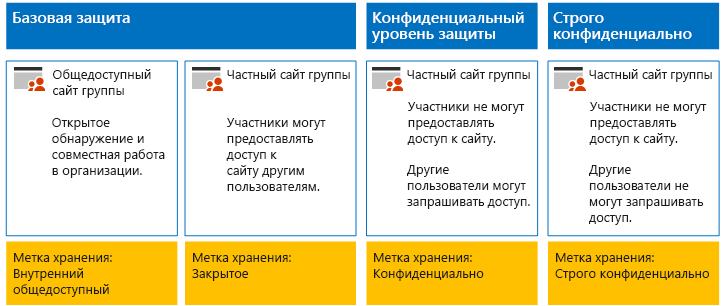
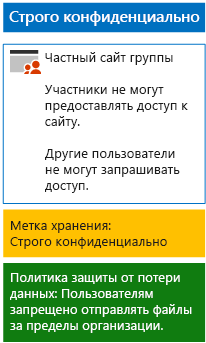

# Защита файлов SharePoint Online с помощью меток хранения и DLPProtect SharePoint Online files with retention labels and DLP

В этой статье описано создание и развертывание меток хранения и политик защиты от потери данных для базовых, конфиденциальных и строго конфиденциальных сайтов группы SharePoint Online.Use the steps in this article to design and deploy retention labels and DLP policies for baseline, sensitive, and highly confidential SharePoint Online team sites. Дополнительные сведения об этих трех уровнях защиты см. в статье [Защита сайтов и файлов SharePoint Online](../security/office-365-security/secure-sharepoint-online-sites-and-files.md).For more information about these three tiers of protection, see [Secure SharePoint Online sites and files](../security/office-365-security/secure-sharepoint-online-sites-and-files.md).
  
## Как это работаетHow this works

1. Создайте нужные метки хранения и опубликуйте их.Create the desired retention labels and publish these. Для их публикации может потребоваться до 12 часов.It can take up to 12 hours for these to be published.
2. Для нужных сайтов SharePoint измените параметры библиотеки документов, чтобы присвоить нужные метки хранения к элементам в библиотеке.For the desired SharePoint sites, edit the document library settings to apply the desired retention labels to items in the library.
3. Создайте политики защиты от потери данных, чтобы выполнять действия на основе меток хранения.Create DLP policies to take action based on the retention labels.

Когда пользователи добавляют документ в библиотеку, этот документ получает назначенную метку хранения по умолчанию. When users add a document to the library, the document will receive the assigned retention label by default. При необходимости пользователи могут изменить метку.Users can change the label, if needed. Если пользователь делится документом за пределами организации, служба защиты от потери данных проверяет, назначена ли метка, и выполняет действия, если политика защиты от потери данных соответствует метке.When a user shares a document outside the organization, DLP will check to see if a label is assigned and take action if a DLP policy matches the label. Служба защиты от потери данных также проверяет соответствие другим политикам, таким как защита файлов с номерами кредитных карт, если этот тип политики настроен.DLP will look for other policy matches as well, such as protecting files with credit card numbers if this type of policy is configured. 

## Метки хранения для сайтов SharePoint OnlineRetention labels for your SharePoint Online sites

Существует три этапа создания и назначения меток хранения для сайтов группы SharePoint Online.There are three phases to creating and then assigning retention labels to SharePoint Online team sites.
  
### Этап 1. Определение имен меток храненияPhase 1: Determine the retention label names

На этом этапе нужно определить названия меток хранения для четырех уровней защиты информации, применяемых к сайтам группы SharePoint Online.In this phase, you determine the names of your retention labels for the four levels of information protection applied to SharePoint Online team sites. В приведенной ниже таблице перечислены рекомендуемые имена для каждого уровня.The following table lists the recommended names for each level.
  
|**Уровень защиты сайта группы SharePoint Online****SharePoint Online team site protection level**|**Имя метки****Label name**|
|:-----|:-----|
|Базовый общедоступныйBaseline-Public    |Внутренний общедоступныйInternal public    |
|Базовый частныйBaseline-Private    |ЧастныйPrivate    |
|КонфиденциальныйSensitive    |КонфиденциальныйSensitive    |
|Строго конфиденциальныйHighly Confidential    |Строго конфиденциальныйHighly Confidential    |
   
### Этап 2. Создание меток храненияPhase 2: Create the retention labels

На этом этапе нужно создать и опубликовать определенные метки для разных уровней защиты информации.In this phase, you create and then publish your determined labels for the different levels of information protection.
  
1. Войдите на [портал соответствия требованиям Microsoft 365](https://compliance.microsoft.com), используя учетную запись с ролью администратора компании или администратора безопасности.Sign in to the [Microsoft 365 compliance portal](https://compliance.microsoft.com) with an account that has the Security Administrator or Company Administrator role.
    
2. На вкладке **Главная — соответствие требованиям Microsoft 365** в браузере выберите пункты **Классификации > Метки**.From the **Home - Microsoft 365 compliance** tab of your browser, click **Classifications > Labels**.
    
3. Щелкните **Метки хранения > Создать метку**.Click **Retention labels > Create a label**.
    
4. В области **Назовите метку** введите название метки и описание для администраторов и пользователей, а затем нажмите кнопку **Далее**.On the **Name your label** pane, type the name of the label and a description for admins and users, and then click **Next**.

5. В области **Дескрипторы плана хранения** введите необходимые параметры и нажмите кнопку **Далее**.On the **File plan descriptors** pane, fill in as needed, and then click **Next**.
    
6. В области **Параметры метки** при необходимости установите параметр **Хранение** в положение **Вкл.** и настройте параметры хранения.On the **Label settings** pane, if needed, set **Retention** to **On** and configure retention settings. Нажмите кнопку **Далее**.Click **Next**.
    
7. В области **Проверьте параметры** нажмите кнопку **Создать эту метку**.On the **Review your settings** pane, click **Create the label**.
    
8. Для создания дополнительных меток нажмите кнопку **Создать метку** и повторите нужные действия с 3 по 7.For your additional labels, click **Create a label**, and then repeat steps 3-7 as needed.
    

### Публикация новых метокPublish your new labels

Для публикации новых меток хранения выполните действия, указанные ниже.Next, use these steps to publish the new retention labels.
  
1. В области **Метки** щелкните вкладку **Метки хранения** и нажмите кнопку **Опубликовать метки**.From the **Labels** pane, click the **Retention labels** tab, and then click **Publish labels**.
    
2. В области **Выберите метки для публикации** щелкните **Выберите метки для публикации**.On the **Choose labels to publish** pane, click **Choose labels to publish**.
    
3. В области **Выбор меток** нажмите кнопку **Добавить**, выберите все четыре метки и щелкните **Добавить**.On the **Choose labels** pane, click **Add**, select all four labels, click **Add**.
    
4. Нажмите кнопку **Готово**.Click **Done**.
    
5. В области **Выберите метки для публикации** нажмите кнопку **Далее**.On the **Choose labels to publish** pane, click **Next**.
    
6. В области **Выбор расположений** нажмите кнопку **Далее**.On the **Choose locations** pane, click **Next**.
    
7. В области **Назовите политику** введите название для своего набора меток в поле **Название**, а затем нажмите кнопку **Далее**.On the **Name your policy** pane, type a name for your set of labels in **Name**, and then click **Next**.
    
8. В области **Проверьте параметры** последовательно нажмите кнопки **Опубликовать метки** и **Закрыть**.On the **Review your settings** pane, click **Publish labels**, and then click **Close**.

    
### Этап 3. Применение меток хранения к сайтам SharePoint OnlinePhase 3: Apply the retention labels to your SharePoint Online sites

Инструкции по применению меток хранения к папкам документов, размещенным на сайтах группы SharePoint Online, приведены ниже.Use these steps to apply the retention labels to the documents folders of your SharePoint Online team sites.
  
1. Войдите на [портал Office 365](https://www.office.com) и щелкните приложение **SharePoint**.Sign in to the [Office 365 portal](https://www.office.com), click the **SharePoint** app.
    
2. На новой вкладке **SharePoint** в браузере выберите сайт, которому нужно назначить метку хранения.On the new **SharePoint** tab in your browser, click a site that needs a retention label assigned.
    
3. На новой вкладке SharePoint в браузере щелкните **Документы**.In the new SharePoint site tab of your browser, click **Documents**.
    
4. Щелкните значок параметров, а затем **Параметры библиотеки**.Click the settings icon, and then click **Library settings**.
    
5. В разделе **Разрешения и управление** нажмите **Применить метку к элементам в этой библиотеке**.Under **Permissions and Management**, click **Apply label to items in this library**.
    
6. В разделе **Параметры — применение метки** выберите соответствующую метку хранения и нажмите кнопку **Сохранить**.In **Settings-Apply Label**, select the appropriate retention label, and then click **Save**.
    
7. Закройте вкладку сайта SharePoint Online.Close the tab for the SharePoint Online site.
    
8. Повторите шаги со 2 по 8, чтобы назначить метки хранения для дополнительных сайтов SharePoint Online.Repeat steps 2-8 to assign retention labels to your additional SharePoint Online sites.
    
Ниже показана итоговая конфигурация.Here is your resulting configuration.
  

  
## Политики защиты от потери данных для сайтов SharePoint OnlineDLP policies for your SharePoint Online sites

Выполните указанные ниже действия, чтобы настроить политику защиты от потери данных, которая уведомляет пользователей, когда они предоставляют доступ к документу с конфиденциального сайта группы SharePoint Online пользователям не из организации.Use these steps to configure a DLP policy that notifies users when they share a document on a SharePoint Online sensitive team site outside the organization.

1. Войдите на [портал соответствия требованиям Microsoft 365](https://compliance.microsoft.com/), используя учетную запись с ролью администратора компании или администратора безопасности.Sign in to the [Microsoft 365 compliance portal](https://compliance.microsoft.com/) with an account that has the Security Administrator or Company Administrator role.
    
2. На новой вкладке **Соответствие требованиям Microsoft 365** в браузере выберите пункты **Политики > Защита от потери данных**.On the new **Microsoft 365 compliance** tab in your browser, click **Policies > Data loss prevention**.
    
3. В области **Главная > Защита от потери данных** нажмите кнопку **Создание политики**.In the **Home > Data loss prevention** pane, click **Create a policy**.
    
4. В области **Начать с шаблона или создать настраиваемую политику** выберите **Настраиваемая**, а затем нажмите кнопку **Далее**.In the **Start with a template or create a custom policy** pane, click **Custom**, and then click **Next**.
    
5. В области **Назовите политику** введите название для политики защиты от потери конфиденциальных данных в поле **Название**, а затем нажмите кнопку **Далее**.In the **Name your policy** pane, type the name for the sensitive level DLP policy in **Name**, and then click **Next**.
    
6. В области **Выберите расположения** щелкните **Позволить мне выбрать расположения** и нажмите кнопку **Далее**.In the **Choose locations** pane, click **Let me choose specific locations**, and then click **Next**.
    
7. В списке расположений отключите параметры **Электронная почта Exchange**, **Учетные записи OneDrive** и **Сообщения из чатов и каналов Teams**, а затем нажмите кнопку **Далее**.In the list of locations, disable the **Exchange email**, **OneDrive accounts**, and **Teams chat and channel messages** locations, and then click **Next**.
    
8. В области **Выберите тип содержимого, которое вы хотите защитить** щелкните ссылку **Изменить**.In the **Customize the type of content you want to protect** pane, click **Edit**.
    
9. В области **Выбрать типы содержимого для защиты** выберите **Добавить** в раскрывающемся списке, а затем выберите **Метки хранения**.In the **Choose the types of content to protect** pane, click **Add** in the drop-down box, and then click **Retention labels**.
    
10. В области **Метки хранения** нажмите кнопку **Добавить**, укажите метку **Конфиденциальный** и последовательно нажмите кнопки **Добавить** > **Готово**.In the **Retention labels** pane, click **Add**, select the **Sensitive** label, click **Add**, and then click **Done**.
    
11. В области **Выбрать типы содержимого для защиты** нажмите кнопку **Сохранить**.In the **Choose the types of content to protect** pane, click **Save**.
    
12. В области **Выберите тип содержимого, которое вы хотите защитить** нажмите кнопку **Далее**.In the **Customize the type of content you want to protect** pane, click **Next**.

13. В области **Что необходимо делать, если мы обнаружим конфиденциальные сведения?** щелкните **Настройка подсказки и уведомления**.In the **What do you want to do if we detect sensitive info?** pane, click **Customize the tip and email**.
    
14. В области **Настройка подсказок политики и уведомлений по электронной почте** щелкните **Измените текст подсказки политики**.In the **Customize policy tips and email notifications** pane, click **Customize the policy tip text**.
    
15. В текстовом поле введите или вставьте одну из следующих подсказок в зависимости от того, используются ли необязательные метки конфиденциальности, чтобы защитить конфиденциальные файлы:In the text box, type or paste in one of the following tips, depending on if you are optionallyusing sensitivity labels to protect sensitive files:
    
  - Чтобы предоставить доступ пользователю за пределами организации, скачайте файл и откройте его. Выберите пункты "Файл > Защитить документ > Зашифровать паролем", а затем укажите надежный пароль. Отправьте пароль в отдельном сообщении или с помощью других средств связи.To share with a user outside the organization, download the file and then open it. Click File, then Protect Document, and then Encrypt with Password, and then specify a strong password. Send the password in a separate email or other means of communication.
  - Строго конфиденциальные файлы защищены с помощью шифрования. Их могут просматривать только те внешние пользователи, которым ваш ИТ-отдел предоставил разрешения для этих файлов.Highly confidential files are protected with encryption. Only external users who are granted permissions to these files by your IT department can read them.
    
    Вы также можете ввести или вставить собственную подсказку политики, которая укажет пользователям, как делиться файлом с людьми за пределами организации.Alternately, type or paste in your own policy tip that instructs users on how to share a file outside your organization.
    
16. Нажмите кнопку **ОК**.Click **OK**.
    
17. В области **Что необходимо делать, если мы обнаружим конфиденциальные сведения?** нажмите кнопку **Далее**.In the **What do you want to do if we detect sensitive info?** pane, click **Next**.
    
18. В области **Вы хотите включить политику или сначала проверить, как все работает?** выберите пункт **Да, включить сразу**, а затем нажмите кнопку **Далее**.In the **Do you want to turn on the policy or test things out first?** pane, click **Yes, turn it on right away**, and then click **Next**.
    
19. В области **Проверьте параметры** нажмите **Создать**, а затем нажмите кнопку **Закрыть**.In the **Review your settings** pane, click **Create**, and then click **Close**.
    
Здесь показана итоговая конфигурация для конфиденциальных сайтов групп SharePoint Online.Here is your resulting configuration for sensitive SharePoint Online team sites.
  

  
Выполните следующие действия, чтобы настроить политику защиты от потери данных, которая блокирует пользователей, когда они совместно используют документы на строго конфиденциальном сайте группы SharePoint Online за пределами организации.Next, use these steps to configure a DLP policy that blocks users when they share a document on a SharePoint Online highly confidential team site outside the organization.
  
1. На новой вкладке **Соответствие требованиям Microsoft 365** в браузере выберите пункты **Политики > Защита от потери данных**.On the new **Microsoft 365 compliance** tab in your browser, click **Policies > Data loss prevention**.
    
2. В области **Защита от потери данных** нажмите кнопку **Создание политики**.In the **Data loss prevention** pane, click **Create a policy**.
    
3. В области **Начать с шаблона или создать настраиваемую политику** выберите **Настраиваемая**, а затем нажмите кнопку **Далее**.In the **Start with a template or create a custom policy** pane, click **Custom**, and then click **Next**.
    
4. В области **Назовите политику** введите название для политики защиты от потери строго конфиденциальных данных в поле **Название**, а затем нажмите кнопку **Далее**.In the **Name your policy** pane, type the name for the highly sensitive level DLP policy in **Name**, and then click **Next**.
    
5. В области **Выберите расположения** щелкните **Позволить мне выбрать расположения** и нажмите кнопку **Далее**.In the **Choose locations** pane, click **Let me choose specific locations**, and then click **Next**.
    
6. В списке расположений отключите параметры **Электронная почта Exchange**, **Учетные записи OneDrive** и **Сообщения из чатов и каналов Teams**, а затем нажмите кнопку **Далее**.In the list of locations, disable the **Exchange email**, **OneDrive accounts**, and **Teams chat and channel messages** locations, and then click **Next**.
    
7. В области **Выберите тип содержимого, которое вы хотите защитить** щелкните ссылку **Изменить**.In the **Customize the types of sensitive info you want to protect** pane, click **Edit**.
    
8. В области **Выбрать типы содержимого для защиты** выберите **Добавить** в раскрывающемся списке, а затем выберите **Метки хранения**.In the **Choose the types of content to protect** pane, click **Add** in the drop-down box, and then click **Retention labels**.
    
9. В области **Метки хранения** нажмите кнопку **Добавить**, укажите метку **Строго конфиденциальный** и последовательно нажмите кнопки **Добавить** > **Готово**.In the **Retention labels** pane, click **Add**, select the **Highly Confidential** label, click **Add**, and then click **Done**.
    
10. В области **Выбрать типы содержимого для защиты** нажмите кнопку **Сохранить**.In the **Choose the types of content to protect** pane, click **Save**.
    
12. В области **Выберите тип содержимого, которое вы хотите защитить** нажмите кнопку **Далее**.In the **Customize the types of sensitive info you want to protect** pane, click **Next**.
    
13. В области **Что необходимо делать, если мы обнаружим конфиденциальные сведения?** щелкните **Настройка подсказки и уведомления**.In the **What do you want to do if we detect sensitive info?** pane, click **Customize the tip and email**.
    
14. В области **Настройка подсказок политики и уведомлений по электронной почте** щелкните **Измените текст подсказки политики**.In the **Customize policy tips and email notifications** pane, click **Customize the policy tip text**.
    
15. В текстовом поле введите или вставьте следующее:In the text box, type or paste in the following:
    
  - Чтобы предоставить доступ пользователю за пределами организации, скачайте файл и откройте его. Выберите пункты "Файл > Защитить документ > Зашифровать паролем", а затем укажите надежный пароль. Отправьте пароль в отдельном сообщении или с помощью других средств связи.To share with a user outside the organization, download the file and then open it. Click File, then Protect Document, and then Encrypt with Password, and then specify a strong password. Send the password in a separate email or other means of communication.
    
    Вы также можете ввести или вставить, скопировав, собственную подсказку политики, которая укажет пользователям, как делиться файлом с людьми за пределами организации.Alternately, type or paste in your own policy tip that instructs users on how to share a file outside your organization.
    
16. Нажмите кнопку **ОК**.Click **OK**.
    
17. В разделе **Обнаружение случаев разовой отправки определенного объема конфиденциальных данных** области **Что необходимо делать, если мы обнаружим конфиденциальные сведения?** щелкните **Ограничение доступа или шифрование содержимого** и нажмите кнопку **Далее**.In the **What do you want to do if we detect sensitive info?** pane, under **Detect when a specific amount of sensitive info is being shared at one time**, click **Restrict access or encrypt the content**, and then click **Next**.
    
18. В области **Включить политику или сначала протестировать ее?** выберите пункт **Да, включить ее сразу**, а затем нажмите кнопку **Далее**.In the **Do you want to turn on the policy or test things out first?** pane, click **Yes, turn it on right away**, and then click **Next**.
    
19. В области **Проверьте параметры** нажмите **Создать**, а затем нажмите кнопку **Закрыть**.In the **Review your settings** pane, click **Create**, and then click **Close**.
    
Ниже показана итоговая конфигурация для строго конфиденциальных сайтов групп SharePoint Online.Here is your resulting configuration for high confidentiality SharePoint Online team sites.
  

### Поддержка меток конфиденциальности появится в ближайшее времяSupport for sensitivity labels is coming

На данный момент в качестве условия можно использовать только метки хранения, а не [метки конфиденциальности](sensitivity-labels.md).You can currently use only a retention label as a condition, not a [sensitivity label](sensitivity-labels.md). Сейчас мы работаем над поддержкой меток конфиденциальности для этого условия.We're currently working on support for using a sensitivity label in this condition.
  
## Следующий этапNext step

[Защита файлов SharePoint Online с помощью меток конфиденциальностиProtect SharePoint Online files with sensitivity labels](protect-sharepoint-online-files-with-sensitivity-label.md)
    
## См. такжеSee Also

[Руководство по безопасности (Майкрософт) для политических кампаний, некоммерческих и других динамических организацийMicrosoft Security Guidance for Political Campaigns, Nonprofits, and Other Agile Organizations](../security/office-365-security/microsoft-security-guidance-for-political-campaigns-nonprofits-and-other-agile-o.md)
  
[Освоение облака и гибридные решенияCloud adoption and hybrid solutions](https://docs.microsoft.com/office365/enterprise/cloud-adoption-and-hybrid-solutions)

