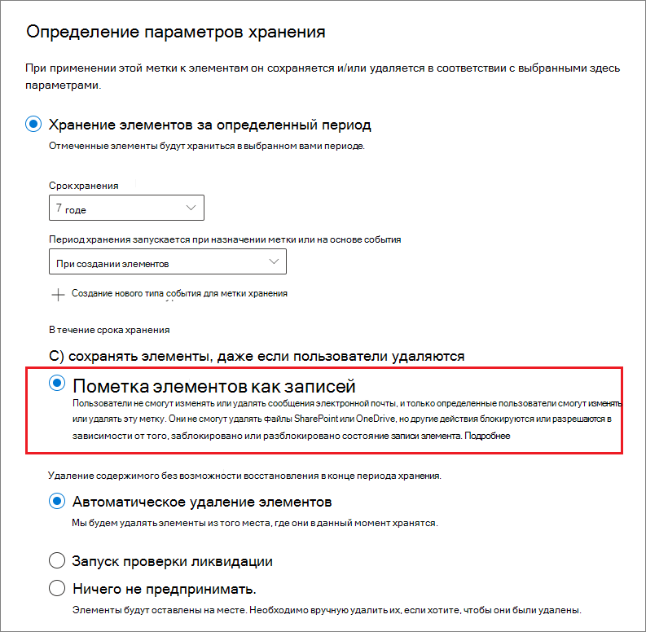
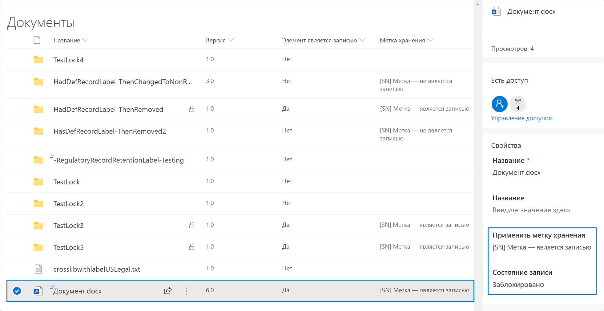
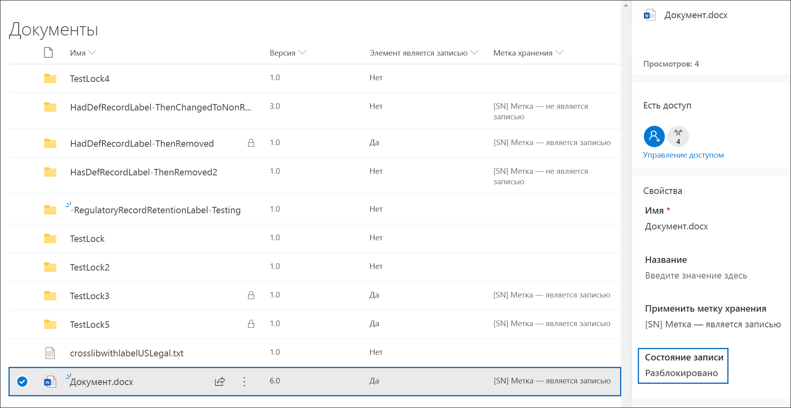
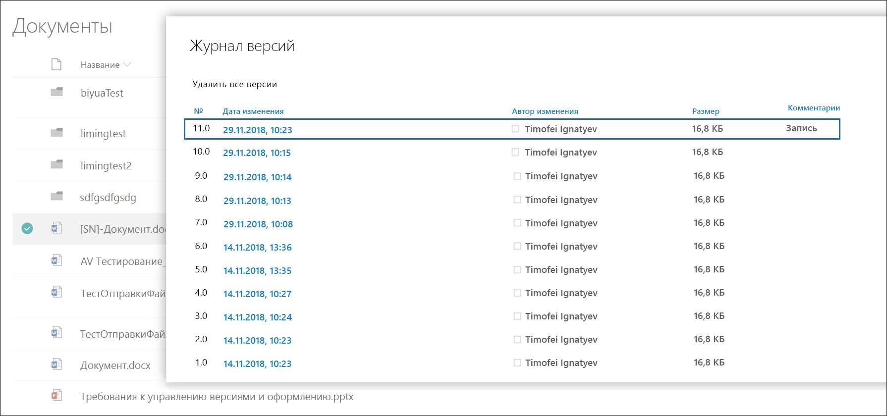
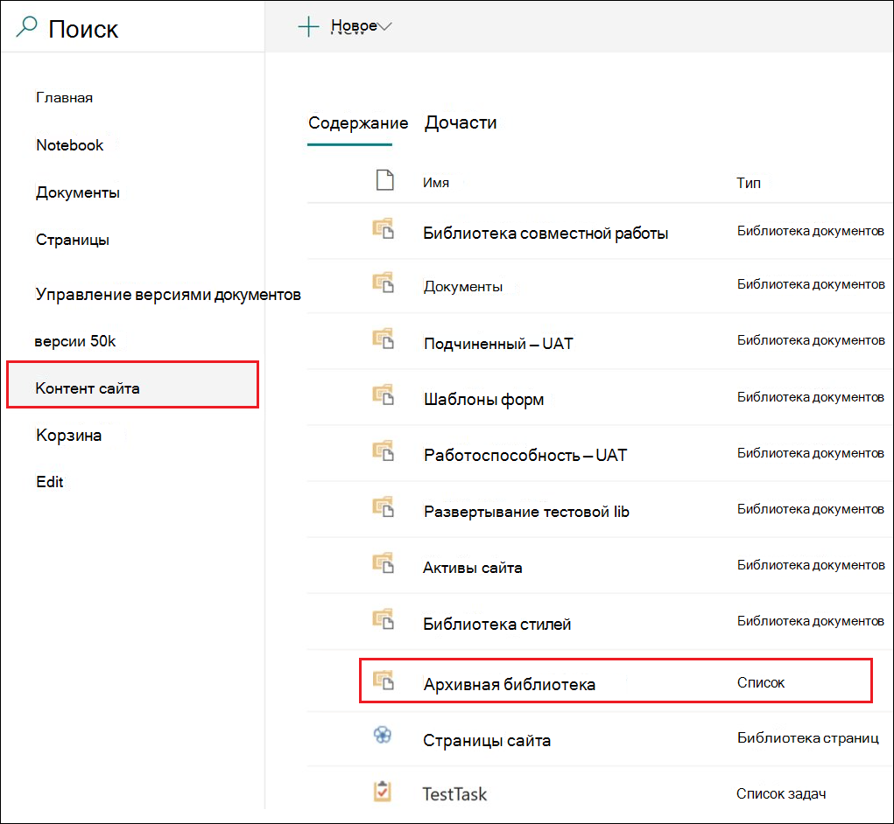
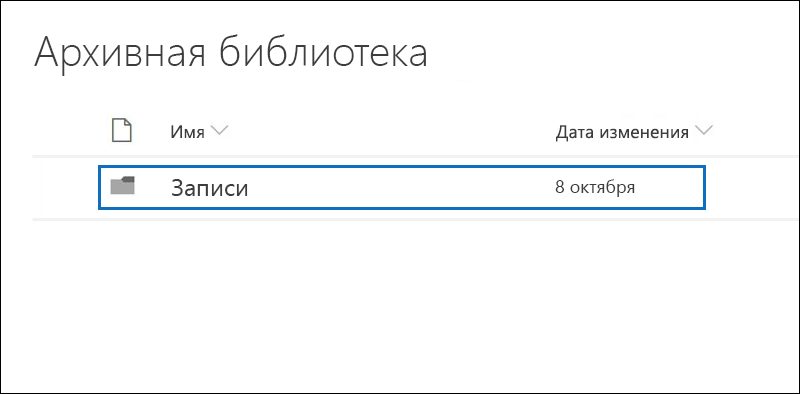
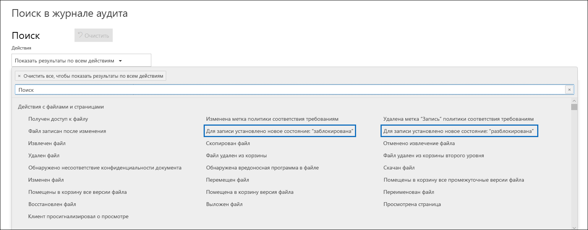

# Общие сведения о записях

Управление записями в организациях Microsoft 365 способствует соблюдению их корпоративных политик, правовых и нормативных положений с уменьшением рисков и правовых последствий.

На высоком уровне при обозначении содержимого в качестве записи

- элемент становится неизменным (запись нельзя изменить или удалить);

- дополнительные действия, связанные с элементом, фиксируются в журнале;

- записи окончательно ликвидируются по истечении заявленного периода их хранения.

[Метки хранения](labels.md) можно использовать для классификации содержимого как записи. Создавая метки хранения для обозначения записей, можно либо [публиковать](labels.md#how-retention-labels-work-with-retention-label-policies) эти метки (тогда пользователи могут использовать их для классификации содержимого в качестве записей), либо [автоматически применять эти метки](labels.md#applying-a-retention-label-automatically-based-on-conditions) к содержимому, которое нужно классифицировать в качестве записи. Использование меток хранения для обозначения записей позволяет внедрить единую последовательную стратегию управления записями в Office 365 в целом, тогда как другие возможности управления записями, например, Центр записей, предназначены для применения только к содержимому в SharePoint Online.

По поводу записей необходимо учитывать нижеуказанные нюансы.

  - **Записи невозможно изменить.** Метку хранения, которая обозначает содержимое как запись, можно добавить к содержимому не только в SharePoint и OneDrive для бизнеса, но и в Exchange. При этом[управление версиями записей](#record-versioning) возможно только в SharePoint и OneDrive, но не в Exchange.

    В Exchange содержимое, обозначенное в качестве записи, невозможно изменить до окончательного удаления. Если элемент Exchange помечен как запись, для него действуют следующие четыре правила:

    - элемент невозможно безвозвратно удалить;

    - элемент невозможно изменить;

    - метку невозможно изменить;

    - метку невозможно удалить.

  - **Записи и папки.** Метку хранения можно применить к папке в Exchange, SharePoint или OneDrive. Если папка помечена как запись, и после этого в нее перемещается элемент, то этот элемент также помечается как запись. Если затем переместить его из папки в другое место, этот элемент останется помеченным как запись.

    Кроме того, если изменить метку записи, примененную к папке (в SharePoint и OneDrive), на метку хранения, которая не объявляет содержимое записью, то у элементов в этой папке сохранится существующая метка записи.

    Дополнительные сведения о применении меток хранения к папкам SharePoint и OneDrive см. в разделе [Применение метки хранения по умолчанию ко всему содержимому в библиотеке SharePoint, папке или набору документов](labels.md#applying-a-default-retention-label-to-all-content-in-a-sharepoint-library-folder-or-document-set).

  - **Записи невозможно удалить**. При попытке пользователя удалить запись в Exchange элемент перемещается в папку "Элементы с возможностью восстановления" в соответствии с разделом [Что делает политика хранения с содержимым на месте](retention-policies.md#content-in-mailboxes-and-public-folders).

    При попытке пользователя удалить запись в SharePoint отображается ошибка с сообщением о том, что элемент не был удален и остается в библиотеке.

    

    Если пользователь пытается удалить запись в OneDrive, элемент перемещается в архивную библиотеку, как описано в разделе [Что делает политика хранения с содержимым на месте](retention-policies.md#content-in-onedrive-accounts-and-sharepoint-sites).

  - **Метки записей удалить невозможно.** После присвоения метки записи элементу ее может удалить только администратор этого расположения (например, администратор семейства веб-сайтов, в том числе сайта SharePoint).

## Использование меток хранения для обозначения записей

Создаваемую метку хранения можно использовать для классификации содержимого в качестве записи. Чтобы объявить контент как запись, выполните следующие действия:

1. Создание метки хранения. В Центре соответствия требованиям Microsoft 365 перейти в раздел **Управление записями** \> **План хранения**. На странице **План хранения** нужно выбрать команду**Создать метку**.

2. На странице мастера **Параметры метки** нужно выбрать параметр, согласно которому метка хранения обозначит содержимое в качестве записи. 

   

3. [Публикация](labels.md#how-retention-labels-work-with-retention-label-policies) или[автоматическое применение](labels.md#applying-a-retention-label-automatically-based-on-conditions)метки хранения в учетных записях SharePoint и (или) OneDrive.

> [!NOTE]
> Для объявления элемента в качестве записи с использованием [меток хранения](labels.md) требуется лицензия на Office 365 корпоративный E5 или аналогичная лицензия для каждого пользователя, у которого есть разрешения на изменение контента в этом расположении. Пользователям с доступом только для чтения лицензия не требуется.

### Применение метки хранения к содержимому

Любой пользователь в Exchange, имеющий доступ к почтовому ящику с возможностью ввода текста, может применить метку хранения для любого сообщения электронной почты. Применить метку записи к содержимому в SharePoint и OneDrive может любой пользователь, который (на уровне разрешений "Участие").входит в группу "Участники", используемую по умолчанию. Удалить или изменить такую уже присвоенную записи метку может только администратор семейства веб-сайтов. Как говорилось выше, метка хранения, обозначающая содержимое как запись, может применяться к содержимому автоматически.

Вот что получается, если применить метку записи к документу на сайте SharePoint или в учетной записи OneDrive.
  

## Управление версиями

Возможность классифицировать документ как запись и сделать эту запись неизменной — важный аспект управления записями. Вместе с тем невозможность изменять запись препятствует совместной работе над документом, если пользователям нужно создавать его последующие версии. Например, контракт продажи можно обозначить как запись, и затем, когда требуется этот контракт обновить и внести новые положения, обозначить последнюю версию как новую запись, при этом сохраняется и предыдущая версия записи. Для таких случаев в SharePoint Online и OneDrive для бизнеса теперь поддерживается *управление версиями записей*. Папки записных книжек OneNote не поддерживаются.

Чтобы воспользоваться управлением версиями записей, в первую очередь необходимо в Центре соответствия требованиям Microsoft 365 создать и опубликовать метки хранения, которые будут использоваться для обозначения записей на всех сайтах SharePoint и в учетных записях OneDrive, или опубликовать их на определенных сайтах SharePoint и учетных записях OneDrive. Следующий этап — применение опубликованной метки записи к документу. После этого рядом с меткой хранения отобразится свойство документа под названием *Состояние записи*, а изначальное состояние записи сменится на**Заблокировано**. На этом этапе можно совершать нижеуказанные действия.

  - **Периодическое редактирование и обозначение отдельных версий документа как записей с разблокировкой и блокировкой свойства "Состояние записи".** Когда свойство **Состояние записи** установлено как **Заблокировано**, сохраняются только версии, обозначенные как записи. Это уменьшает риск сохранения ненужных версий и копий документа.

  - **Автоматическое сохранение записей в репозитории записей на месте, который размещается внутри семейства веб-сайтов.** Содержимое любого семейства веб-сайтов в SharePoint и OneDrive сохраняется в соответствующей архивной библиотеке. Место хранения версий записей в этой библиотеке —папка "Записи".

  - **Сохранение всегда актуального документа, включающего в себя все версии.** В каждом документе SharePoint и OneDrive по умолчанию имеется журнал версий, который можно найти в меню элемента. Благодаря такому журналу версий можно легко определить, какие версии являются записями, и просмотреть эти документы.

Управление версиями записей автоматически предлагается для любого документа с меткой хранения, обозначающей его как запись. При просмотре пользователем свойств документа в области сведений **Состояние записи** переключается с**Заблокировано** на **Разблокировано**. Так всего одним щелчком в папке архивной библиотеки "Записи" создается запись, которая остается там в течение оставшегося периода хранения. Пока документ разблокирован, редактировать файл может любой пользователь, у которого есть соответствующие разрешения. При этом, однако, удалить файл пользователи не могут, так как он обозначен как запись. После внесения нужных изменений пользователь может переключить **Состояние записи** с**Разблокировано**на **Заблокировано**. Таким образом документ снова обозначается как запись, и его нельзя редактировать.
  

> [!NOTE]
> Для управления версиями записей каждому пользователю, у которого есть разрешения на изменение обозначенного как запись содержимого на сайте SharePoint или в учетной записи OneDrive, требуется лицензия на Office 365 корпоративный E5. Пользователям с доступом только для чтения эта лицензия не требуется.

### Блокировка и разблокировка записи

После того, как метка записи назначена документу, любой пользователь с разрешениями Contribute или более узким уровнем разрешений может разблокировать запись или заблокировать незаблокированную запись.
  

Разблокировка записи пользователем приводит к нижеуказанным результатам.

1. При отсутствии в текущем семействе веб-сайтов библиотеки хранения архивов такая библиотека создается.

2. При отсутствии в архивной библиотеке папки записи такая запись создается.

3. При использовании действия**Копировать в** самая последняя версия документа копируется в папку "Записи". Действие **Копировать в** относится только к последней версии документа и не затрагивает предыдущие версии. Скопированный документ теперь рассматривается как версия документа в виде записи, и файл приобретает следующий формат: \[Title GUID Version\#\]

4. Копия, созданная в папке "Записи", добавляется в журнал версий исходного документа, и в поле примечаний к этой версии отображается слово **Запись**.

5. Исходный документ — это новая версия, которую можно редактировать (но не удалять). В столбце библиотеки документов **Элемент является записью**по-прежнему содержится значение **Да**, так как документ все так же рассматривается как запись, несмотря на то, что его теперь можно редактировать.

После того как пользователь заблокирует запись, внесение изменений в исходный документ снова станет невозможным. Однако именно благодаря действию по разблокировке записи ее версия появляется в папке "Записи", расположенной в архивной библиотеке.

### Версии записей

Каждый раз, когда пользователь производит разблокировку записи, копия последней версии этой записи появляется в архивной библиотеке со значением **Запись** в поле**Примечания** журнала версий.
  

Чтобы просмотреть журнал версий, выберите документ в библиотеке документов, а затем в меню элемента выберите **Журнал версий**.

### Место хранения записей

Записи хранятся в папке "Записи" архивной библиотеки на сайте верхнего уровня в семействе веб-сайтов. В левой панели навигации на сайте верхнего уровня выберите **Содержимое сайта** \> **Архивная библиотека**.
  

  

Архивная библиотека отображается только для администраторов семейства веб-сайтов. Кроме того, архивная библиотека не существует по умолчанию. Такая библиотека создается только тогда, когда содержимое, к которому относится метка хранения или политика хранения, впервые удаляется в семействе веб-сайтов.

### Поиск событий управления версиями записей в журнале аудита

Действия по блокировке и разблокировке записей регистрируются в журнале аудита Office 365. Определенные действия, а именно**Для записи установлено новое состояние: "Заблокировано"** и**Для записи установлено новое состояние: "Разблокировано"** можно найти в разделе **Действия с файлами и страницами**раскрывающегося списка**Действия** на странице**Поиск в журнале аудита** Центра безопасности и соответствия требованиям.
  

Подробнее о том, как производится поиск таких событий, можно прочитать в разделе "Действия с файлами и страницами" статьи [Поиск в журнале аудита в Центре безопасности и соответствия требованиям](search-the-audit-log-in-security-and-compliance.md#file-and-page-activities).
