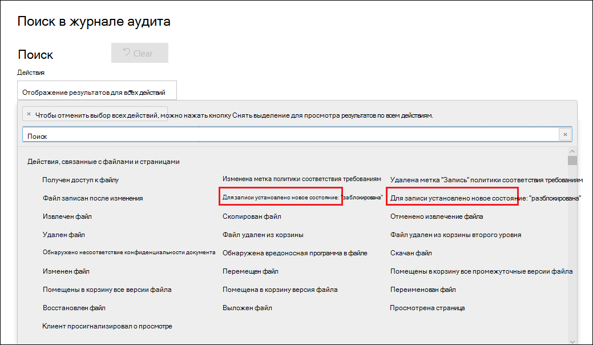

# Узнайте о записяхLearn about records

>*[Руководство по лицензированию Microsoft 365 для обеспечения безопасности и соответствия требованиям](https://aka.ms/ComplianceSD).**[Microsoft 365 licensing guidance for security & compliance](https://aka.ms/ComplianceSD).*

Управление записями в Microsoft 365 помогает организации соблюдать корпоративные политики, правовые и нормативные положения, а также уменьшить риски и правовые последствия.Managing records in Microsoft 365 helps your organization comply with corporate policies and legal or regulatory obligations, while also reducing risk and legal liability.

Если содержимое помечается как запись:When content is marked as an record:

- элемент становится неизменным, т. е. его нельзя изменить или удалить;The item becomes immutable, which means that it can't be modified or deleted.

- дополнительные действия, связанные с элементом, фиксируются в журнале;Additional activities about the item are logged.

- когда элемент удаляется по истечении периода хранения, его ликвидация подтверждается.You have proof of disposition when they are deleted at the end of their retention period.

Чтобы пометить содержимое как запись, используются [метки хранения](labels.md).You use [retention labels](labels.md) to mark content as a record. После создания меток хранения, которые объявляют элементы записями, вы можете либо опубликовать эти метки, чтобы пользователи и администраторы могли вручную применить их к содержимому, либо автоматически применить эти метки к содержимому, которое вы хотите пометить как запись.After you create retention labels that declare records, you can either publish those labels so that users and administrators can manually apply them to content, or auto-apply those labels to content that you want to mark as a record. Инструкции см. в разделе [Создание, публикация и автоматическое применение меток хранения](create-retention-labels.md).For instructions, see [Create, publish, and auto-apply retention labels ](create-retention-labels.md).

Используя метки хранения для объявления записей, вы можете реализовать единую согласованную стратегию управления записями в своей среде Microsoft 365.By using retention labels to declare records, you can implement a single, consistent records-management strategy across your Microsoft 365 environment.

По поводу записей необходимо учитывать нижеуказанные нюансы.Keep the following things in mind about records:

  - **Записи невозможно изменить.****Records are immutable.** Метку хранения, которая помечает содержимое как запись, можно применить к содержимому не только в SharePoint и OneDrive, но и в Exchange.A retention label that marks content as a record can be applied to content in Exchange, in addition to SharePoint and OneDrive. При этом[управление версиями записей](#record-versioning) возможно только в SharePoint и OneDrive, но не в Exchange.However, [record versioning](#record-versioning) is available only in SharePoint and OneDrive, and not for Exchange.

    В Exchange содержимое, обозначенное в качестве записи, невозможно изменить до окончательного удаления.In Exchange, content labeled as a record is immutable until its final deletion. Если элемент Exchange помечен как запись, для него действуют следующие четыре правила:When an Exchange item is labeled as a record, four things happen:

    - элемент невозможно безвозвратно удалить;The item can't be permanently deleted.

    - элемент невозможно изменить;The item can't be edited.

    - метку невозможно изменить;The label can't be changed.

    - метку невозможно удалить.The label can't be removed.

  - **Записи и папки.****Records and folders.** Метку хранения можно применить к папке в Exchange, SharePoint или OneDrive.You can apply a retention label to a folder in Exchange, SharePoint, and OneDrive. Если папка помечена как запись, и после этого в нее перемещается элемент, то этот элемент также помечается как запись.If a folder is labeled as a record, and you move an item into the folder, the item is labeled as a record. Если затем переместить его из папки в другое место, этот элемент останется помеченным как запись.When you move the item out of the folder, the item remains labeled as a record.

    Кроме того, если изменить метку записи, примененную к папке (в SharePoint и OneDrive), на метку хранения, которая не объявляет содержимое записью, у элементов в этой папке сохранится существующая метка записи.Also, if you change the record label that's applied to a folder (in SharePoint and OneDrive) to a retention label that does not declare content as a record, items in the folder keep their existing record label.

    Дополнительные сведения о применении меток хранения к папкам SharePoint и OneDrive см. в разделе [Применение метки хранения по умолчанию ко всему содержимому в библиотеке SharePoint, папке или набору документов](labels.md#applying-a-default-retention-label-to-all-content-in-a-sharepoint-library-folder-or-document-set).For more information about applying retention labels to SharePoint and OneDrive folders, see [Applying a default retention label to all content in a SharePoint library, folder, or document set](labels.md#applying-a-default-retention-label-to-all-content-in-a-sharepoint-library-folder-or-document-set).

  - **Записи невозможно удалить**.**Records can't be deleted**. При попытке пользователя удалить запись в Exchange элемент перемещается в папку "Элементы с возможностью восстановления", как указано в разделе [Как работает политика хранения с Exchange](retention-policies-exchange.md#how-a-retention-policy-works-with-exchange).If a user attempts to delete a record in Exchange, the item is moved to the Recoverable Items folder as described in [How a retention policy works with Exchange](retention-policies-exchange.md#how-a-retention-policy-works-with-exchange).

    При попытке пользователя удалить запись в SharePoint отображается ошибка с сообщением о том, что элемент не был удален и остается в библиотеке.If a user attempts to delete a record in a SharePoint, an error is displayed say that the item wasn't deleted, and remains in the library.

    

    Если пользователь пытается удалить запись в OneDrive, элемент перемещается в библиотеку хранения сохранения, как описано в разделе [Как политика хранения работает с SharePoint и OneDrive](retention-policies-sharepoint.md#how-a-retention-policy-works-with-sharepoint-and-onedrive).If a user attempts to delete a record in OneDrive, the item is moved to the Preservation Hold library as described in [How a retention policy works with SharePoint and OneDrive](retention-policies-sharepoint.md#how-a-retention-policy-works-with-sharepoint-and-onedrive).

  - **Метки записей удалить невозможно.****Records labels can't be removed.** После присвоения метки записи элементу ее может удалить только администратор этого расположения (например, администратор семейства веб-сайтов, в том числе сайта SharePoint).After a record label has been applied to an item, only the admin of that location (for example, a site collection admin of a SharePoint site) can remove that record label.

## Использование меток хранения для объявления элементов записямиUsing retention labels to declare records

Когда вы создаете метку хранения, у вас есть возможность использовать метку хранения, чтобы пометить содержимое как запись.When you create a retention label, you have the option to use the retention label to mark the content as a record:

1. В Центре соответствия требованиям Microsoft 365 перейти в раздел **Управление записями** \> **План хранения**.In the Microsoft 365 compliance center, go to **Records Management** \> **File Plan**. На странице **План хранения** выберите **Создать метку**.On the **File plan** page, select **Create a label**.

2. На странице мастера **Параметры метки** нужно выбрать параметр, согласно которому метка хранения обозначит содержимое в качестве записи.On the **Label settings** page in the wizard, choose the option to set the retention label to declare content as a record.
    
   

3. [Публикация](labels.md#how-retention-labels-work-with-retention-label-policies) или[автоматическое применение](labels.md#applying-a-retention-label-automatically-based-on-conditions)метки хранения в учетных записях SharePoint и (или) OneDrive.[Publish](labels.md#how-retention-labels-work-with-retention-label-policies) or [auto-apply](labels.md#applying-a-retention-label-automatically-based-on-conditions) the retention label to SharePoint sites and/or OneDrive accounts.

### Применение метки хранения к содержимомуApplying a retention label to content

Любой пользователь в Exchange, имеющий доступ к почтовому ящику с возможностью ввода текста, может применить метку хранения для любого сообщения электронной почты.For Exchange, any user with write-access to the mailbox can apply a record label to an email message. Применить метку записи к содержимому в SharePoint и OneDrive может любой пользователь, который (на уровне разрешений "Участие").входит в группу "Участники", используемую по умолчанию.For content in SharePoint and OneDrive, any user in the default Members group (the Contribute permission level) can apply a record label to content. Удалить или изменить такую уже присвоенную записи метку может только администратор семейства веб-сайтов.Only a site collection admin can remove or change that record label after it's been applied. Как говорилось выше, метка хранения, обозначающая содержимое как запись, может применяться к содержимому автоматически.As previously explained, a retention label that classifies content as a record can be auto-applied to content.

Вот что получается, если применить метку записи к документу на сайте SharePoint или в учетной записи OneDrive.Here's what this looks like when a record label is applied to a document on a SharePoint site or OneDrive account.
  

## Управление версиямиRecord versioning

Возможность классифицировать документ как запись и сделать эту запись неизменной — важный аспект управления записями.An essential part of records management is the ability to declare a document as a record and have that record be immutable. Вместе с тем невозможность изменять запись препятствует совместной работе над документом, если пользователям нужно создавать его последующие версии.At the same time, record immutability prevents collaboration on the document if people need to create subsequent versions. Например, контракт продажи можно обозначить как запись, и затем, когда требуется этот контракт обновить и внести новые положения, обозначить последнюю версию как новую запись, при этом сохраняется и предыдущая версия записи.For example, you might declare a sales contract as a record, but then need to update the contract with new terms and declare the latest version as a new record while still retaining the previous record version. Для таких случаев в SharePoint и OneDrive поддерживается *управление версиями записей*.For these types of scenarios, SharePoint and OneDrive support *record versioning*. Папки записных книжек OneNote не поддерживают управление версиями записей.OneNote notebook folders don't support record versioning.

Чтобы воспользоваться управлением версиями записей, в первую очередь необходимо в Центре соответствия требованиям Microsoft 365 создать метки хранения, которые объявляют элементы записями, и опубликовать их на всех сайтах SharePoint и в учетных записях OneDrive или опубликовать их на определенных сайтах SharePoint или в учетных записях OneDrive.To use record versioning, the first step is to use the Microsoft 365 compliance center to create retention labels that declare records and and publish them to all SharePoint sites and OneDrive accounts, or publish them to specific SharePoint sites or OneDrive accounts. Следующий этап — применение опубликованной метки записи к документу.The next step is to apply a published retention record label to a document. При этом рядом с меткой хранения отобразится свойство документа под названием *Состояние записи*, а изначальное состояние записи сменится на**Заблокировано**.When this happens, a document property, called *Record status* is displayed next to the retention label, and the initial record status will be **Locked**. На этом этапе можно совершать нижеуказанные действия.At this point, you can do the following things:

  - **Периодическое редактирование и обозначение отдельных версий документа как записей с разблокировкой и блокировкой свойства "Состояние записи".****Continually edit and declare individual versions of the document as records, by unlocking and locking the Record status property.** Когда свойство **Состояние записи** установлено как **Заблокировано**, сохраняются только версии, обозначенные как записи.Only the versions declared as records are retained when the **Record status** property is set to **Locked**. Это уменьшает риск сохранения ненужных версий и копий документа.This reduces the risk of retaining unnecessary versions and copies of the document.

  - **Автоматическое сохранение записей в репозитории записей на месте, который размещается внутри семейства веб-сайтов.****Have the records automatically stored in an in-place records repository located within the site collection.** Содержимое любого семейства веб-сайтов в SharePoint и OneDrive сохраняется в соответствующей архивной библиотеке.Each site collection in SharePoint and OneDrive preserves content in its Preservation Hold library. Место хранения версий записей в этой библиотеке —папка "Записи".Record versions are stored in the Records folder in this library.

  - **Сохранение всегда актуального документа, включающего в себя все версии.****Maintain an evergreen document that contains all versions.** В каждом документе SharePoint и OneDrive по умолчанию имеется журнал версий, который можно найти в меню элемента.By default, each SharePoint and OneDrive document has a version history available on the item menu. Благодаря такому журналу версий можно легко определить, какие версии являются записями, и просмотреть эти документы.In this version history, you can easily see which versions are records and view those documents.

Управление версиями записей автоматически предлагается для любого документа с меткой хранения, обозначающей его как запись.Record versioning is automatically available for any document that has a retention label that declares the item as a record. При просмотре пользователем свойств документа в области сведений **Состояние записи** переключается с**Заблокировано** на **Разблокировано**.When a user views the document properties through the details pane, they toggle the **Record status** from **Locked** to **Unlocked**. Так всего одним щелчком в папке архивной библиотеки "Записи" создается запись, которая остается там в течение оставшегося периода хранения.This single click creates a record in the Records folder in the Preservation Hold library, where it resides for the remainder of its retention period. 

Пока документ разблокирован, редактировать файл может любой пользователь, у которого есть соответствующие разрешения.While the document is unlocked, any user with permissions can edit the file. При этом, однако, удалить файл пользователи не могут, так как он считается записью.However, users can't delete the file, because it's considered a record. После внесения нужных изменений пользователь может переключить **Состояние записи** с**Разблокировано**на **Заблокировано**. Таким образом документ снова обозначается как запись, и его нельзя редактировать.After the necessary changes are made, the user can then toggle the **Record status** from **Unlocked** to **Locked**, so that the document is again declared a record and can't be edited.
  

### Блокировка и разблокировка записиLocking and unlocking a record

После того, как метка записи назначена документу, любой пользователь с разрешениями Contribute или более узким уровнем разрешений может разблокировать запись или заблокировать незаблокированную запись.After a record label is assigned to a document, any user with Contribute permissions or a narrower permission level can unlock a record or lock an unlocked record.
  

Разблокировка записи пользователем приводит к нижеуказанным результатам.When a user unlocks a record, the following actions occur:

1. При отсутствии в текущем семействе веб-сайтов библиотеки хранения архивов такая библиотека создается.If the current site collection doesn't have a Preservation Hold library, one is created.

2. При отсутствии в архивной библиотеке папки записи такая запись создается.If the Preservation Hold library doesn't have a Records folder, one is created.

3. При использовании действия**Копировать в** самая последняя версия документа копируется в папку "Записи".A **Copy to** action copies the latest version of the document to the Records folder. Действие **Копировать в** относится только к последней версии документа и не затрагивает предыдущие версии.The **Copy to** action includes only the latest version and no prior versions. Скопированный документ теперь рассматривается как версия документа в виде записи, и файл приобретает следующий формат: \[Title GUID Version\#\]This copied document is now considered a record version of the document, and its file name has the format: \[Title GUID Version\#\]

4. Копия, созданная в папке "Записи", добавляется в журнал версий исходного документа, и в поле примечаний к этой версии отображается слово **Запись**.The copy created in the Records folder added to the version history of the original document, and this version shows the word **Record** in the comments field.

5. Исходный документ — это новая версия, которую можно редактировать (но не удалять).The original document is a new version that can be edited (but not deleted). В столбце библиотеки документов **Элемент является записью**по-прежнему содержится значение **Да**, так как документ все так же рассматривается как запись, несмотря на то, что его теперь можно редактировать.The document library column **Item is a Record** still shows the **Yes** value because the document is still considered a record, even if it can now be edited.

После того как пользователь заблокирует запись, внесение изменений в исходный документ снова станет невозможным.When a user locks a record, the original document again can't be edited. Однако именно благодаря действию по разблокировке записи ее версия появляется в папке "Записи", расположенной в архивной библиотеке.But it is the action of unlocking a record that copies a version to the Records folder in the Preservation Hold library.

### Версии записейRecord versions

Каждый раз, когда пользователь производит разблокировку записи, копия последней версии этой записи появляется в архивной библиотеке со значением **Запись** в поле**Примечания** журнала версий.Each time a user unlocks a record, the latest version is copied to the Records folder in the Preservation Hold library, and that version contains the value of **Record** in the **Comments** field of the version history.
  

Чтобы просмотреть журнал версий, выберите документ в библиотеке документов, а затем в меню элемента выберите **Журнал версий**.To view the version history, select a document in the document library and then click **Version history** in the item menu.

### Место хранения записейWhere records are stored

Записи хранятся в папке "Записи" архивной библиотеки на сайте верхнего уровня в семействе веб-сайтов.Records are stored in the Records folder in the Preservation Hold library in the top-level site in the site collection. В левой панели навигации на сайте верхнего уровня выберите **Содержимое сайта** \> **Архивная библиотека**.In the left nav on the top-level site, choose **Site contents** \> **Preservation Hold Library**.
  

  

Архивная библиотека отображается только для администраторов семейства веб-сайтов.The Preservation Hold library is visible only to site collection admins. Кроме того, архивная библиотека не существует по умолчанию.Also, the Preservation Hold library doesn't exist by default. Такая библиотека создается только тогда, когда содержимое, к которому относится метка хранения или политика хранения, впервые удаляется в семействе веб-сайтов.It's created only when content subject to a retention label or retention policy is deleted for the first time in the site collection.

### Поиск событий управления версиями записей в журнале аудитаSearching the audit log for record versioning events

Действия по блокировке и разблокировке записей регистрируются в журнале аудита.The actions of locking and unlocking records are logged in the audit log. Определенные действия, а именно**Для записи установлено новое состояние: "Заблокировано"** и**Для записи установлено новое состояние: "Разблокировано"** можно найти в разделе **Действия с файлами и страницами**раскрывающегося списка**Действия** на странице**Поиск в журнале аудита** Центра безопасности и соответствия требованиям.You can search for the specific activities **Changed record status to locked** and **Changed record status to unlocked**, which are located in the **File and page activities** section in the **Activities** dropdown list on the **Audit log search** page in the security and compliance center.
  

Подробнее о том, как производится поиск таких событий, можно прочитать в разделе "Действия с файлами и страницами" статьи [Поиск в журнале аудита в Центре безопасности и соответствия требованиям](search-the-audit-log-in-security-and-compliance.md#file-and-page-activities).For more information about searching for these events, see the "File and page activities" section in [Search the audit log in the Security & Compliance Center](search-the-audit-log-in-security-and-compliance.md#file-and-page-activities).

## Дальнейшие действияNext steps

Инструкции о том, как создать и опубликовать метки хранения, содержащие параметр "Пометить содержимое как запись", см. в статье [Создание, публикация и автоматическое применение меток хранения](create-retention-labels.md).For instructions how to create and publish the retention labels that contain the setting to mark content as a record, see [Create, publish, and auto-apply retention labels](create-retention-labels.md).
