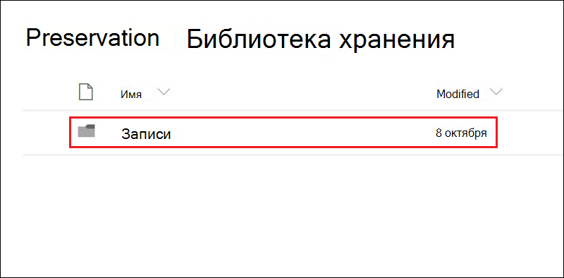

# Узнайте о записях

>*[Руководство по лицензированию Microsoft 365 для обеспечения безопасности и соответствия требованиям](https://aka.ms/ComplianceSD).*

Управление записями в Microsoft 365 помогает организации соблюдать корпоративные политики, правовые и нормативные положения, а также уменьшить риски и правовые последствия.

Когда содержимое помечается как запись:

- На элементы накладываются ограничения в отношении того, какие[действия разрешены или запрещены](#compare-restrictions-for-what-actions-are-allowed-or-blocked).

- дополнительные действия, связанные с элементом, фиксируются в журнале;

- Когда элементы удаляются по истечении периода хранения, вы должны подтвердить их ликвидацию.

Чтобы пометить содержимое как запись, используются [метки хранения](retention.md#retention-labels). Вы можете либо опубликовать эти метки, чтобы пользователи и администраторы могли вручную применить их к содержимому, либо автоматически применить эти метки к содержимому, которое вы хотите пометить как запись.

Используя метки хранения для того, чтобы помечать содержимое как записи, вы можете реализовать единую и последовательную стратегию управления записями в своей среде Microsoft 365.

## Сравните ограничения на то, какие действия разрешены или запрещены

Используйте приведенную ниже таблицу, чтобы определить, какие ограничения накладываются на контент в результате применения стандартной метки хранения, а также меток хранения, помечающих содержимое как запись. 

Конфигурация стандартной метки хранения позволяет сохранять данные, не помечая содержимое как запись.

>[!NOTE] 
> Таблица также содержит столбцы для заблокированной и разблокированной записи, которая применима к содержимому в SharePoint и OneDrive, но не в Exchange. Для блокировки и разблокировки записи используется [Управление версиями записи](#record-versioning), которое не поддерживается для элементов Exchange. Таким образом, для всех элементов Exchange, которые помечены как записи, действие сопоставляется со столбцом **Запись заблокирована**, а столбец **Запись разблокирована** не имеет значения.

|Действие| Метка хранения |Запись заблокирована| Запись разблокирована|
|:-----|:-----|:-----|:-----|:-----|
|Изменение содержаний|Разрешено | **Заблокировано** | Разрешено|
|Изменение свойств, включая переименование|Разрешено |Разрешено | Разрешено|
|Удалить|Разрешено 1 |**Заблокировано** | **Заблокировано**|
|Копировать|Разрешено |Разрешено | Разрешено|
|Перемещение в контейнере 2|Разрешено |Разрешено | Разрешено|
|Перемещение между контейнерами 2|Разрешено |Разрешено, если никогда не будет разблокировано | Разрешено|
|Открыть/читать|Разрешено |Разрешено | Разрешено|
|Изменить метку|Разрешено |Разрешено только для администраторов контейнера | Разрешено только для администраторов контейнера|
|Удалить метку|Разрешено |Разрешено только для администраторов контейнера | Разрешено только для администраторов контейнера|

Сноски:

1 Поддерживается OneDrive и Exchange путем сохранения копии в защищенном месте, но заблокировано в SharePoint.

Сообщение, которое видит пользователь, когда пытается удалить помеченный документ в SharePoint:

2 Контейнеры включают библиотеки документов SharePoint и почтовые ящики Exhange.

## Использование меток хранения для объявления элементов записями

Когда вы создаете метку хранения, у вас есть возможность использовать метку хранения, чтобы пометить содержимое как запись.

1. В Центре соответствия требованиям Microsoft 365 перейти в раздел **Управление записями** \> **План хранения**. На странице **План хранения** выберите **Создать метку**.

2. На странице мастера**Параметры метки** выберите параметр для классификации содержимого как записи.
    
   

3. При необходимости можно применить метку хранения к документам SharePoint или OneDrive и электронным письмам Exchange. Для получения инструкций:
    
    - [Создание меток хранения и их применение в приложениях](create-apply-retention-labels.md)
    
    - [Автоматическое применение метки хранения к контенту](apply-retention-labels-automatically.md)

### Применение сконфигурированной метки хранения к содержимому

Когда метки хранения, помечающие содержимое как запись, становятся доступны для пользователей для применения их в приложениях:

- Любой пользователь в Exchange, имеющий доступ к почтовому ящику с возможностью ввода текста, может применить метку хранения. 
- Применить метки в SharePoint и OneDrive может любой пользователь, который (на уровне разрешения "Участие") входит в группу "Участники", используемую по умолчанию.

Пример документа, помеченного как запись, с помощью метки хранения:

## Управление версиями

Возможность пометить документ как запись и ограничить действия, которые можно выполнять с записью, является основной целью любого решения по управлению записями. Однако для создания последующих версий может также потребоваться совместная работа.

Например, контракт продажи можно пометить как запись, и затем, когда требуется этот контракт обновить и внести новые положение, пометить последнюю версию как новую запись, и при этом сохраняется и предыдущая версия записи. Для таких случаев в SharePoint и OneDrive поддерживается *управление версиями записей*. Папки записных книжек OneNote не поддерживают управление версиями записей.

Чтобы использовать управление версиями записей, сначала отметьте документ и пометьте его как запись. В этот момент рядом с меткой хранения отобразится свойство документа под названием *Состояние записи*, а изначальное состояние записи сменится на**Заблокировано**. 

Доступны перечисленные ниже действия:

  - **Периодическое редактирование и сохранение отдельных версий документа как записей с разблокировкой и блокировкой свойства "Состояние записи".** Только когда свойство**Состояние записи** имеет значение**Заблокировано**, новая версия записи сохраняется. Это переключение между заблокированными и разблокированными версиями уменьшает риск сохранения ненужных версий и копий документа.

  - **Автоматическое сохранение записей в репозитории записей на месте, который размещается внутри семейства веб-сайтов.** Содержимое любого семейства веб-сайтов в SharePoint и OneDrive сохраняется в соответствующей архивной библиотеке. Место хранения версий записей в этой библиотеке —папка "Записи".

  - **Сохранение всегда актуального документа, включающего в себя все версии.** В каждом документе SharePoint и OneDrive по умолчанию имеется журнал версий, который можно найти в меню элемента. Благодаря такому журналу версий можно легко определить, какие версии являются записями, и просмотреть эти документы.

Управление версиями записей автоматически предлагается для любого документа с меткой хранения, помечающей его как запись. При просмотре пользователем свойств документа с использованием области сведений **Состояние записи** может переключиться с**Заблокировано** на **Разблокировано**. Одним действием в папке архивной библиотеки "Записи" создается запись, которая остается там в течение оставшегося периода хранения. 

Пока документ разблокирован, редактировать файл может любой пользователь со стандартными разрешениями на редактирование. При этом, однако, удалить файл пользователи не могут, так как он все еще является записью. После завершения редактирования пользователь может переключить **Состояние записи** с**Разблокировано** на**Заблокировано**, что запрещает дальнейшие правки в этом состоянии.
  

### Блокировка и разблокировка записи

После того, как метка, которая помечает содержимое как запись, применена к документу, любой пользователь с разрешениями Contribute или более узким уровнем разрешения может разблокировать запись или заблокировать разблокированную запись.
  

Разблокировка записи пользователем приводит к нижеуказанным результатам.

1. При отсутствии в текущем семействе веб-сайтов библиотеки хранения архивов такая библиотека создается.

2. При отсутствии в архивной библиотеке папки записи такая запись создается.

3. При использовании действия**Копировать в** самая последняя версия документа копируется в папку "Записи". Действие **Копировать в** относится только к последней версии документа и не затрагивает предыдущие версии. Скопированный документ теперь рассматривается как версия документа в виде записи, и файл приобретает следующий формат: \[Title GUID Version\#\]

4. Копия, созданная в папке «Записи», добавлена в журнал версий исходного документа, и в поле примечаний к этой версии отображается слово **Запись**.

5. Исходный документ — это новая версия, которую можно редактировать, но не удалять. В столбце библиотеки документов **Элемент является записью**по-прежнему содержится значение **Да**, так как документ все равно является записью, несмотря на то, что его теперь можно редактировать.

После того как пользователь заблокирует запись, внесение изменений в исходный документ снова станет невозможным. Однако именно благодаря действию по разблокировке записи ее версия появляется в папке "Записи", расположенной в архивной библиотеке.

### Версии записей

Каждый раз, когда пользователь производит разблокировку записи, копия последней версии этой записи появляется в архивной библиотеке со значением **Запись** в поле**Примечания** журнала версий.
  

Чтобы просмотреть журнал версий, выберите документ в библиотеке документов, а затем в меню элемента выберите **Журнал версий**.

### Место хранения записей

Записи хранятся в папке "Записи" архивной библиотеки на сайте верхнего уровня в семействе веб-сайтов. В левой панели навигации на сайте верхнего уровня выберите**Содержание сайта** \> **Архивная библиотека**.
  

  

Архивная библиотека отображается только для администраторов семейства веб-сайтов. Кроме того, архивная библиотека не существует по умолчанию. Такая библиотека создается только тогда, когда содержимое, к которому относится метка хранения или политика хранения, впервые удаляется в семействе веб-сайтов.

### Поиск событий управления версиями записей в журнале аудита

Действия по блокировке и разблокировке записей регистрируются в журнале аудита. Определенные действия, а именно**Для записи установлено новое состояние: "Заблокировано"** и**Для записи установлено новое состояние: "Разблокировано"** можно найти в разделе **Действия с файлами и страницами**раскрывающегося списка**Действия** на странице**Поиск в журнале аудита** Центра безопасности и соответствия требованиям.
  

Подробнее о том, как производится поиск таких событий, можно прочитать в разделе "Действия с файлами и страницами" статьи [Поиск в журнале аудита в Центре безопасности и соответствия требованиям](search-the-audit-log-in-security-and-compliance.md#file-and-page-activities).

## Дальнейшие действия

Если у вас еще нет меток хранения для управления записями, см. статью [Начало работы с политиками хранения и метками хранения](get-started-with-retention.md).

Информацию о ликвидации записей см. в разделе [Ликвидация содержимого](disposition.md).
