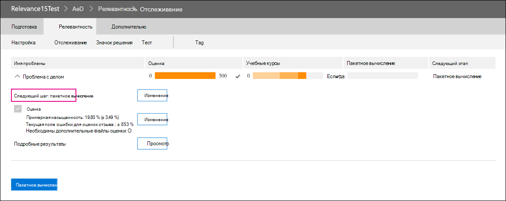

# Выход из модуля релевантности в Advanced eDiscoveryRetirement of the Relevance module in Advanced eDiscovery

10 марта 2021 г. мы удаляем модуль релевантности в Advanced eDiscovery.On March 10, 2021, we are retiring the Relevance module in Advanced eDiscovery. Это означает, что у организаций больше не будет доступа к модуле релевантности (путем управления релевантность набора проверки в случае  >   Advanced eDiscovery) или у организаций будет доступ к существующим моделям релевантности.This retirement means that organizations will no longer have access to the Relevance module (by going to **Manage review set** > **Relevance** in an Advanced eDiscovery case) or be able to access any existing Relevance models. Текущий отозвляющийся модуль релевантности будет заменен новым решением прогнозирования кодирования в Q2 CY 2021.The current Relevance module that is being retired will be replaced with a new predictive coding solution in Q2 CY 2021. Эта новая функциональность позволит организациям создавать собственные модели прогнозирования кодирования в более простом и интуитивно понятном рабочего процесса.This new functionality will let organizations build their own predictive coding models in an easier and more intuitive workflow.

Для подготовки к предстоящему выводу из системы рекомендуется организациям, которые используют модуль релевантности, экспортировать выходные данные модели до даты выхода из системы путем пакетного вычисления для всех существующих моделей.To prepare for this upcoming retirement, we recommend that organizations who use the Relevance module export their model’s output before the retirement date by running a Batch calculation for all existing models. Все показатели релевантности из модели будут постоянно храниться в соответствующем наборе для проверки и доступны при экспорте документов.All Relevance scores from your model will be permanently stored in the corresponding review set and accessible when documents are exported. Оценки релевантности также сохраняются в виде метаданных в файле загрузки.Relevance scores are also retained as metadata in the load file. Кроме того, вы по-прежнему сможете фильтровать содержимое в наборе для проверки на основе оценки релевантности и иметь доступ ко всем метаданным моделей релевантности.Also, you will still be able to filter content in the review set based on relevance score and have access to all metadata produced by your Relevance models.

## Завершение незаконченных моделейComplete unfinished models

Для любых незавершенных моделей релевантности выполните оценку, обучение и пакетное вычисление, чтобы применить модель к документам в наборе для проверки.For any unfinished Relevance models, please complete assessment, training, and Batch calculation so that you can apply the model to the documents in a review set. При выполнении пакетного вычисления данные сохраняются после даты выхода из модуля релевантности.Completing the Batch calculation will preserve the information after the retirement date of the Relevance module.

Чтобы выполнить все незавершенные модели, выполните следующие действия.Here are the steps to complete any unfinished models:

1. Обучение модели до тех пор, пока она не будет стабилизируется и не будет готова к пакетным вычислениям.Train your model until it is stabilized and ready for Batch calculation. См. [обучающие курсы по тегам и релевантности.](tagging-and-relevance-training-in-advanced-ediscovery.md)See [Tagging and Relevance training](tagging-and-relevance-training-in-advanced-ediscovery.md).

   На следующем снимке экрана показан модуль, готовый к пакетным вычислениям.The following screenshot shows a module that is ready for a Batch calculation. Обратите внимание, что оценка и обучение завершены, и следующим шагом является запуск пакетного вычисления.Notice that the Assessment and Training is complete, and the next step is to run Batch calculation.

   

2. Запустите пакетное вычисление.Run the Batch calculation. См. ["Выполнение пакетного вычисления".](track-relevance-analysis-in-advanced-ediscovery.md#performing-batch-calculation)See [Performing Batch calculation](track-relevance-analysis-in-advanced-ediscovery.md#performing-batch-calculation).

3. Убедитесь, что пакетное вычисление было успешным.Verify that Batch calculation was successful. См. [результаты пакетного вычисления.](track-relevance-analysis-in-advanced-ediscovery.md#batch-calculation-results)See [Batch calculation results](track-relevance-analysis-in-advanced-ediscovery.md#batch-calculation-results).

За помощью в выполнении незавершенных моделей релевантности обратитесь в службу поддержки Майкрософт.For help with completing unfinished Relevance models, contact Microsoft Support.
