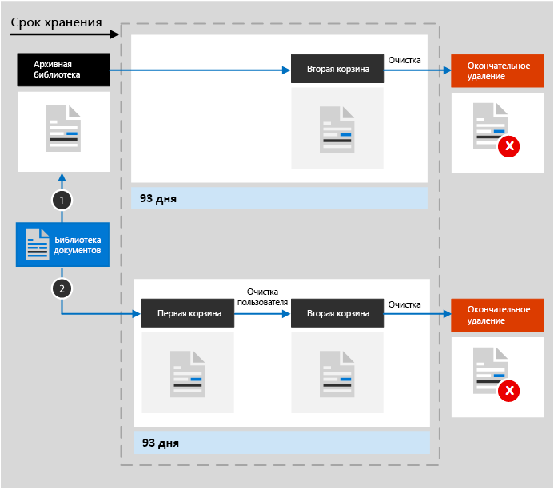
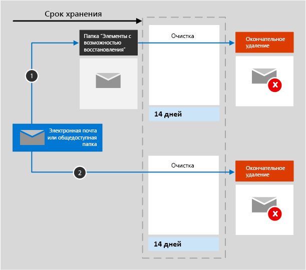
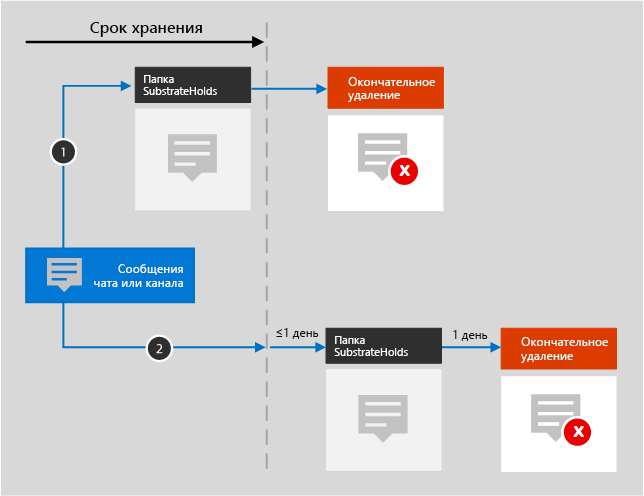

# Общие сведения о политиках хранения

В большинстве организаций объем и сложность данных возрастают с каждым днем: накапливаются электронные сообщения, документы, мгновенные сообщения и многое другое. Важно уметь эффективно управлять такой информацией, потому что нужно выполнять следующее:
  
- **Заблаговременно обеспечивать соответствие отраслевым нормативным актам и внутренним политикам**, требующим хранить содержимое в течение некоторого минимального периода. Например, закон Сарбейнса — Оксли может обязывать вас хранить определенные типы содержимого в течение семи лет. 
    
- **Снизить риск на случай судебного разбирательства или нарушения безопасности** путем окончательного удаления старого содержимого, которое вы больше не обязаны хранить. 
    
- **Способствовать динамичности организации и эффективному обмену знаниями в ней**, обеспечив актуальность и релевантность данных, с которыми работают пользователи. 
    
Достичь всех этих целей помогает политика хранения. Как правило, управление содержимым предполагает два действия:
  
- **Хранение** содержимого таким образом, чтобы его нельзя было удалить без возможности восстановления до окончания периода хранения. 
    
- **Удаление** содержимого без возможности восстановления в конце периода хранения. 
    
Политика хранения позволяет следующее:
  
- Заблаговременно решать, как поступить с содержимым — хранить его, удалить или удалить через какой-то период.
    
- Применять единую политику ко всей организации или к некоторым расположениям либо пользователям.
    
- Применять политику ко всему содержимому или к удовлетворяющему определенным условиям (например, включающему определенные ключевые слова или [определенные типы конфиденциальной информации](what-the-sensitive-information-types-look-for.md)).
    
Когда к содержимому применяется политика хранения, пользователи могут изменять его и работать с ним так же, как и раньше, потому что содержимое никуда не делось и находится в исходном расположении. Но если кто-либо изменит или удалит такое содержимое, его копия попадет в надежное расположение и будет там храниться до момента окончания действия политики хранения.
  
От некоторых организаций требуется выполнять требования нормативных актов, например постановления 17a-4 Комиссии по ценным бумагам и биржам (США), которое запрещает отключать политику хранения или делать ее менее строгой. В этом случае можно использовать блокировку хранения. После блокировки никто (в том числе администратор) не сможет отключить политику или сделать ее менее строгой.
  
Создавать политики хранения и управлять ими можно на:

- странице **Политики** в [Центре соответствия требованиям Microsoft 365](https://compliance.microsoft.com/);
- странице **Хранение** в разделе **Управление информацией** в [Центре безопасности и соответствия требованиям Office 365](https://protection.office.com/).
  
## Что делает политика хранения с содержимым на месте

При добавлении расположения, например сайта или почтового ящика, в политику хранения содержимое остается в исходном расположении. Пользователи могут продолжать работать со своими документами или почтой, как будто ничего не изменилось. Но если они изменят или удалят содержимое, включенное в политику, его копия сохранится в том виде, в каком было содержимое на момент применения политики.
  
Для семейств веб-сайтов SharePoint копия исходного содержимого, измененного или удаленного пользователями, сохраняется в архивной библиотеке. Для электронной почты и общедоступных папок копия сохраняется в папке "Элементы с возможностью восстановления". Эти надежные расположения и хранимое в них содержимое не видны большинству пользователей. Политика хранения такова, что пользователям не нужно знать о ее применении к содержимому.
  
Примечания:
  
- Содержимое Teams (чатов) хранится в Exchange, где политика применяется на основе типа сообщений (электронная почта или беседы).
    
- Политика хранения, примененная к группе Office 365, включает в себя как сайт, так и почтовый ящик группы.
    
### Содержимое учетных записей OneDrive и сайтов SharePoint

Политика хранения применяется на уровне семейства веб-сайтов. Когда семейство веб-сайтов SharePoint или учетная запись OneDrive добавляется в политику хранения, создается архивная библиотека, если она еще не существует. Эту библиотеку можно просмотреть на странице **Содержимое сайта** на сайте верхнего уровня в семействе веб-сайтов. Большинство пользователей не могут просматривать архивную библиотеку, так как она видна только администраторам семейства веб-сайтов.
  
Если кто-то пытается изменить или удалить содержимое сайта, к которому применяется политика хранения, сначала эта политика проверяет, было ли это содержимое изменено с момента ее применения. Если это первое изменение с момента назначения этой политики, содержимое копируется в архивную библиотеку, после чего пользователь сможет изменить или удалить исходное содержимое. В архивную библиотеку можно скопировать любое содержимое семейства веб-сайтов, даже если оно не соответствует запросу, используемому политикой хранения.
  
Затем архивная библиотека будет очищена заданием таймера. Задание таймера выполняется периодически. При этом сравнивается все содержимое архивной библиотеки со всеми запросами, которые используются для политики хранения на сайте. Пока содержимое не будет соответствовать хотя бы одному из запросов, задание таймера будет окончательно удалять его из архивной библиотеки.
  
Описанное выше касается содержимого, существующего на момент применения политики хранения. Кроме того, новое содержимое, созданное в семействе веб-сайтов или добавленное в него после включения семейства веб-сайтов в политику, будет сохранено после удаления. Однако новое содержимое копируется в архивную библиотеку не при первом изменении, а только при удалении. Чтобы сохранить все версии файла, необходимо включить управление версиями (см. следующий раздел).
  
Обратите внимание, что пользователь получит сообщение об ошибке при попытке удалить библиотеку, список, папку или сайт, на которые распространяется политика хранения. Папку можно удалить, если сначала переместить или удалить из нее файлы, к которым применены политики. Кроме того, архивная библиотека создается только при необходимости копирования первого элемента в библиотеку, а не при создании политики хранения. Поэтому для проверки политики необходимо сначала изменить или удалить документ на сайте, на который распространяется эта политика, а затем перейти в архивную библиотеку, чтобы просмотреть сохраненную копию.
  
После назначения политики хранения учетной записи OneDrive или сайту SharePoint содержимое обрабатывается одним из указанных ниже способов.

  
1. **Если содержимое изменяется или удаляется** в течение срока хранения, в архивной библиотеке сохраняется копия исходного содержимого по состоянию на момент, когда политика была назначена. Периодически выполняемое задание таймера определяет элементы, срок хранения которых истек, и элементы, перемещенные во вторую корзину, из которой они удаляются без возможности восстановления через 93 дня. Вторая корзина не видна конечным пользователям (видна только первая корзина), но администраторы семейства веб-сайтов могут просматривать и восстанавливать содержимое из нее.

    > [!NOTE]
    > Недавно был изменен способ удаления содержимого из архивной библиотеки. Чтобы предотвратить случайную потерю данных, содержимое из архивной библиотеки больше не удаляется без возможности восстановления. Вместо этого содержимое удаляется без возможности восстановления только из корзины, поэтому весь контент из архивной библиотеки теперь перемещается во вторую корзину.
    
2. **Если содержимое не изменяется и не удаляется** в течение срока хранения, по окончании срока хранения оно перемещается в первую корзину. Если пользователь удаляет это содержимое из корзины или очищает корзину, документ перемещается во вторую корзину. Для первой и второй корзины в совокупности устанавливается срок хранения в 93 дня. По окончании 93-дневного срока документ окончательно удаляется из того места, в котором он фактически пребывает, будь то первая или вторая корзина. Корзина не индексируется, поэтому поиск содержимого в ней невозможен. Это означает, что обнаружение электронных данных не позволяет находить содержимое в корзине для его удержания. 
    
### Содержимое в почтовых ящиках и общедоступных папках

Политика хранения почты, календаря и других элементов пользователя применяется на уровне почтового ящика. Политика хранения общедоступной папки применяется на уровне папки, а не на уровне почтового ящика. Элементы почтового ящика и общедоступной папки хранятся в папке "Элементы с возможностью восстановления". Только пользователи, которым назначены разрешения на обнаружение электронных данных, могут просматривать папки "Элементы с возможностью восстановления" других пользователей.
  
По умолчанию при удалении сообщения из папки, отличной от папки "Удаленные", сообщение перемещается в папку "Удаленные". При удалении элемента из папки "Удаленные" сообщение перемещается в папку "Элементы с возможностью восстановления". Кроме того, пользователь может выполнить обратимое удаление элемента (SHIFT+DELETE) в любой папке, что позволяет обойти папку "Удаленные" и переместить этот элемент непосредственно в папку "Элементы с возможностью восстановления".
  
Процесс периодически проверяет содержимое папки "Элементы с возможностью восстановления". Если элемент не соответствует правилам по крайней мере одной политики хранения, он окончательно удаляется (такое удаление также называется необратимым) из этой папки.
  
При попытке пользователя изменить определенные свойства элемента почтового ящика (например, тему, текст сообщения, вложения, отправителей и получателей, дату отправки или получения сообщения) копия исходного элемента сохраняется в папке "Элементы с возможностью восстановления", прежде чем изменение вступит в силу. Так будет происходить при каждом последующем изменении. В конце периода хранения копии в папке "Элементы с возможностью восстановления" окончательно удаляются.
  
Если пользователь уходит из организации, а для его почтового ящика действует политика хранения, такой почтовый ящик становится неактивным при удалении учетной записи Office 365 пользователя. К содержимому неактивного почтового ящика по-прежнему применяется политика хранения, назначенная до того, как почтовый ящик стал неактивным, и такое содержимое можно найти при обнаружении электронных данных. Дополнительные сведения см. в статье [Неактивные почтовые ящики в Exchange Online](inactive-mailboxes-in-office-365.md).
  
После назначения политики хранения почтовому ящику или общедоступной папке содержимое обрабатывается одним из указанных ниже способов.

1. **Если элемент изменяется или окончательно удаляется** пользователем во время периода хранения, то копируется или перемещается в папку "Элементы с возможностью восстановления" соответственно. (К окончательному удалению элемента приводит нажатие клавиш SHIFT+DELETE или удаление элемента из папки "Удаленные элементы".) После чего периодически запускается процесс, который выявляет элементы с истекшим сроком хранения, и они удаляются в течение 14 дней после окончания периода хранения без возможности восстановления. Обратите внимание на то, что 14 дней — это значение по умолчанию. Его можно менять, указывая до 30 дней.
    
2. **Если элемент не изменяется и не удаляется** в течение срока хранения, аналогичным образом периодически сканируются все папки в почтовом ящике, и в них определяются элементы, срок хранения которых истек. В течение 14 дней после окончания срока хранения эти элементы удаляются без возможности восстановления. Обратите внимание, что срок окончательного удаления равен 14 дням по умолчанию, но может быть установлен и более длительным — до 30 дней. 
    
## Что политика хранения делает с версиями документов в семействе веб-сайтов

Управление версиями — это функция всех библиотек документов в SharePoint Online и OneDrive для бизнеса. По умолчанию при управлении версиями сохраняется не менее 500 основных номеров версий, хотя можно увеличить это значение. Дополнительные сведения см. в статье [Включение и настройка управления версиями для списка или библиотеки](https://support.office.com/article/1555d642-23ee-446a-990a-bcab618c7a37).
  
Политика сохранения (политика, сохраняющая содержимое вместо его удаления) сохраняет все версии документа в семействе сайтов SharePoint или в учетной записи OneDrive. При каждом изменении документа, для которого действует политика сохранения, версия этого документа копируется в архивную библиотеку. При каждом удалении документа, для которого действует политика сохранения, все версии этого документа копируется в архивную библиотеку, если включено управление версиями. Каждая версия документа в архивной библиотеке существует как отдельный элемент с собственным сроком хранения:
  
- Если политика хранения основана на времени создания содержимого, все версии имеют ту же дату истечения срока хранения, что и исходный документ.
    
- Если политика хранения основана на времени последнего изменения содержимого, каждая из версий имеет собственный срок хранения, определенный с учетом времени изменения исходного документа для ее создания. Сроки для исходного документа и его версий истекают независимо друг от друга.

> [!NOTE]
> Сохраненные версии документов SharePoint и OneDrive недоступны для поиска средствами обнаружения электронных данных.

## Хранение содержимого в течение определенного периода времени

Используя политику хранения, вы можете хранить содержимое бесконечно или в течение определенного количества дней, месяцев или лет. Длительность хранения содержимого рассчитывается исходя из давности содержимого, а не с момента применения политики хранения. Вы можете выбрать, как будет определяться давность содержимого (для OneDrive и SharePoint): по дате и времени создания или последнего изменения.
  
Например, если необходимо хранить содержимое в семействе веб-сайтов на протяжении семи лет с момента его последнего изменения, а документ в этом семействе веб-сайтов не изменялся в течение шести лет, то он будет сохраняться еще только один год, если в него не внесут изменений. В случае повторного изменения документа отсчет его возраста начинается с новой даты последнего изменения, при этом он будет сохраняться еще семь лет.
  
Кроме того, если вы хотите хранить содержимое почтового ящика в течение семи лет, а сообщение было отправлено шесть лет назад, оно будет храниться всего один год. Для содержимого Exchange возраст всегда определяется с учетом даты получения или отправки (они совпадают). Хранение содержимого с учетом времени последнего изменения применяется только для содержимого сайтов в OneDrive и SharePoint.
  
Вы можете выбрать, будет ли контент удаляться без возможности восстановления по окончании срока хранения. Политика хранения может также предусматривать удаление старого содержимого без его хранения (см. следующий раздел).
  

  
## Удаление содержимого, которое старше указанного возраста

Политика хранения может предусматривать как хранение содержимого с последующим удалением, так и удаление старого содержимого без хранения.
  
Если политика хранения предусматривает удаление содержимого, важно понимать, что период, указанный для политики хранения, рассчитывается со времени создания или изменения содержимого, а не со времени назначения политики.
  

  
Предположим, вы создаете политику хранения, согласно которой содержимое удаляется через три года, а затем назначаете эту политику всем учетным записям OneDrive с большим объемом содержимого, созданного четыре или пять лет назад. В этом случае такое содержимого будет удалено вскоре после назначения политики хранения в первый раз. По этой причине **политика хранения, предусматривающая удаление содержимого, может серьезно повлиять на содержимое**. 
  
Потому перед первым назначением политики хранения семейству веб-сайтов следует сначала определить возраст содержимого и подумать о том, как может эта политика повлиять на такое содержимое. Кроме того, может потребоваться уведомить ваших пользователей о новой политике, прежде чем назначать ее, чтобы у них было время оценить возможное ее влияние. Обратите внимание на это предупреждение, которое появляется при просмотре параметров политики хранения непосредственно перед ее созданием.
  

  
## Дополнительные параметры, с помощью которых политика применяется только к содержимому, соответствующему определенным условиям

Политику хранения можно применить ко всему содержимому в расположениях, на которые она распространяется, или же только к содержимому, включающему определенные ключевые слова или [определенные типы конфиденциальной информации](what-the-sensitive-information-types-look-for.md).
  

  
### Хранение содержимого с определенными ключевыми словами

Вы можете применить политику хранения к содержимому, соответствующему определенным условиям, а затем предпринять действия по хранению только в отношении такого содержимого. Доступные в данный момент условия поддерживают применение политики хранения к содержимому, содержащему определенные слова или фразы. Вы можете уточнить запрос с помощью таких операторов поиска, как И, ИЛИ и НЕ. Дополнительные сведения об операторах см. в статье [Запросы по ключевым словам и условия поиска содержимого](keyword-queries-and-search-conditions.md).
  
Поддержка добавления свойств, поддерживающих поиск (например, **subject:**), появится в скором времени.
  
При хранении на основе запросов используется индекс поиска для определения содержимого.
  

  
### Хранение содержимого с конфиденциальной информацией

Политику хранения можно также применить только к содержимому с [определенными типами конфиденциальной информации](what-the-sensitive-information-types-look-for.md). Например, можно установить уникальные требования к хранению только содержимого, которое включает такие персональные данные, как идентификационные номера налогоплательщиков, номера социального страхования или номера паспортов.
  

  
Примечания:
  
- Дополнительные параметры хранения конфиденциальной информации не применяются к общедоступным папкам Exchange и Skype для бизнеса, так как эти расположения не поддерживают типы конфиденциальной информации.
    
- Следует понимать, что Exchange Online использует правила потока обработки почты (также называемые правилами транспорта) для выявления конфиденциальной информации, поэтому этот способ применим только к сообщениям во время их передачи, а не ко всем элементам, уже сохраненным в почтовом ящике. Для Exchange Online это означает, что политика хранения может выявить конфиденциальную информацию и выполнить действия по хранению только над сообщениями, которые были получены **после** применения политики к почтовому ящику. (Обратите внимание, что хранение на основе запросов, описанное в предыдущем разделе, не имеет такого ограничения, так как при нем используется индекс поиска для выявления содержимого). 
    
## Применение политики хранения ко всей организации или определенным расположениям

Вы можете легко применить политику хранения ко всей организации, целому расположению или только к отдельным его частям или пользователям.
  
### Политика для всей организации

Одно из самых замечательных свойств политики хранения заключается в том, что по умолчанию она применяется к расположениям в Office 365, включающим следующие:
  
- Почта Exchange
    
- Семейства веб-сайтов SharePoint
    
- Учетные записи OneDrive
    
- Группы Office 365 (применимо к содержимому почтового ящика, сайта и документов группы. Поддержка содержимого Планировщика, Yammer, CRM Microsoft Teams, PowerBI, Stream, Exchange и сайтов групп SharePoint ожидается в ближайшее время.)
    
- Общедоступные папки Exchange.
    

  
Ниже перечислены другие важные возможности политики хранения для всей организации.
  
- Количество почтовых ящиков или сайтов, на которые может распространяться политика, не ограничено.
    
- Для Exchange каждый новый почтовый ящик, созданный после применения политики, будет автоматически ее наследовать.
  
### Политика, применяемая к целому расположению

При выборе расположений можно легко включить или исключить из политики целое расположение, например всю электронную почту Exchange или все учетные записи OneDrive. Для этого включите или отключите параметр **Состояние** этого расположения. 
  
Как и в случае с политикой для всей организации, политика, применяемая к любому сочетанию целых расположений, не ограничена в количестве почтовых ящиков или сайтов, которые может охватывать. Например, если политика охватывает всю почту Exchange и все сайты SharePoint, будут включены все сайты и почтовые ящики независимо от их количества. Для Exchange каждый новый почтовый ящик, созданный после применения политики, будет автоматически ее наследовать.
 

  
### Политика, в которую включены нужные элементы

Можно также применить политику хранения к определенным пользователям. Для этого установите переключатель **Состояние** такого расположения в положение включения и затем с помощью ссылок включите или исключите отдельных пользователей, группы Office 365 или расположения. 
  
Обратите внимание на указанные ниже ограничения политики хранения, которая включает или исключает свыше 1000 конкретных пользователей.
  
- Такая политика хранения не может содержать более 1000 почтовых ящиков и 100 семейств веб-сайтов.
    
- Клиент не может содержать более 10 000 политик хранения.
    
Существующие ограничения можно превысить, применив политику ко всей организации или к целым расположениям.
  
### Расположения Skype

В отличие от почты Exchange, состояние расположения Skype нельзя изменить так, чтобы добавить всех пользователей, но можно включить это расположение, а затем вручную выбрать пользователей, чьи беседы нужно сохранить.
  
Выбирая пользователей Skype для бизнеса, вы можете быстро добавить всех пользователей, выбрав столбец **Имя** в заголовке, но при этом важно понимать, что каждый пользователь засчитывается как отдельно включенный в политику. Поэтому, если вы выберете более 1000 пользователей, вступят в силу ограничения, о которых шла речь в предыдущем разделе. Выбор всех пользователей Skype здесь не равносилен заданию гипотетической общеорганизационной политики, которая бы по умолчанию включала всех пользователей Skype. 
  

  
Обратите внимание, что **Журнал бесед**, папка в Outlook, не имеет отношения к архивам Skype. **Журнал бесед** может быть отключен пользователем, однако архивация для Skype выполняется путем сохранения копии бесед Skype в скрытой папке, не доступной для пользователя, но доступной для обнаружения электронных данных.

### Расположения Teams

Для хранения чатов и сообщений канала в Teams можно использовать политику хранения. Чаты Teams хранятся в скрытой папке почтового ящика каждого пользователя, включенного в чат, а сообщения канала Teams хранятся в похожей скрытой папке в почтовом ящике группы. Важно понимать, что Teams использует службу чата на базе Azure, которая также сохраняет эти данные, а по умолчанию эта служба хранит данные бесконечно. По этой причине мы настоятельно рекомендуем использовать расположение Teams для хранения и удаления данных Teams. Использование этого расположения позволит окончательно удалять данные из почтовых ящиков Exchange и службы чата на базе Azure. Дополнительные сведения см. в статье [Общие сведения о безопасности и соответствии требованиям в Microsoft Teams](https://go.microsoft.com/fwlink/?linkid=871258).
  
На чаты и сообщения каналов Teams не влияют политики хранения, применяемые к почтовым ящикам пользователей или групп в расположениях Exchange и Групп Office 365. Хотя чаты и сообщения каналов Teams хранятся в Exchange, на них влияет только политика хранения, применяемая к расположению Teams.
  
После того как политика хранения назначена команде, чаты и сообщения каналов обрабатываются одним из указанных ниже способов.

1. **Если сообщение чата или канала изменено или удалено** пользователем в течение срока хранения, оно перемещается (или копируется в случае изменения) в папку SubstrateHolds (скрытая папка в почтовом ящике каждого пользователя или группы) и хранится в этой папке до истечения срока хранения. Сообщения окончательно удаляются в день истечения срока хранения.

2. **Если сообщение чата или канала не удаляется** в течение срока хранения, оно перемещается в папку SubstrateHolds в течение одного дня после истечения срока хранения (это занимает до 24 часов). Сообщение окончательно удаляется через день после перемещения в папку SubstrateHolds. 

> [!NOTE]
> Сообщения в папке SubstrateHolds доступны для поиска средствами обнаружения электронных данных. После окончательного удаления сообщения оно не будет возвращаться в результатах поиска средствами обнаружения электронных данных.

Мы постоянно работаем над оптимизацией функций хранения в Teams и планируем выпустить новые функции в ближайшие месяцы. Тем временем следует учитывать ряд ограничений.
  
- **Для Teams требуется отдельная политика хранения**. Если при создании политики хранения включить расположение Teams, все остальные расположения необходимо выключить. Политика хранения, которая применяется к Teams, не должна включать какие-либо другие расположения, кроме Teams. 
    
- **Teams не включается в политику для всей организации**. При создании такой политики Teams в нее не включается, так как требует отдельной политики хранения. 
    
- **Teams не поддерживает расширенные возможности хранения**. Если при создании политики хранения выбрать [дополнительные параметры для применения политики только к содержимому, отвечающему определенным условиям](#advanced-settings-that-apply-a-policy-only-to-content-that-meets-certain-conditions), расположение Teams будет недоступно. В настоящее время политика хранения Teams применяется ко всему содержимому чатов и сообщений каналов. 

- **Содержимое Teams в закрытых каналах не поддерживается**. В настоящее время политики хранения, созданные для Teams, не применяются к сообщениям закрытых каналов. Политика хранения, созданная для Teams, распространяется только на сообщения в стандартных каналах. Поддержка политик хранения для закрытых каналов ожидается в ближайшее время. 
    
- **Очистка сообщений с истекшим сроком действия в Teams может занимать до трех дней**. Политика хранения, применяемая к Teams, удаляет чаты и сообщения канала по истечении срока хранения. Однако очистка этих сообщений и их окончательное удаление может занимать до трех дней. Кроме того, сообщения чатов и каналов доступны для поиска средствами обнаружения электронных данных после истечения срока хранения и безвозвратного удаления сообщений.

   > [!NOTE]
   > Действительно, раньше политика хранения не могла удалять содержимое Teams с давностью менее 30 дней, но это ограничение было устранено. Теперь срок хранения содержимого Teams может составлять любое выбранное вами значение в днях, даже один день. Если ваш срок хранения составляет один день, окончательное удаление сообщений может занять до трех дней с истечения срока хранения.
    
В Teams файлы, которыми пользователь поделился в чате, сохраняются в учетной записи OneDrive этого пользователя. Файлы, добавленные в каналы, сохраняются на сайте SharePoint для команды. Таким образом, чтобы сохранять или удалять файлы в команде, необходимо создать политику хранения, применимую к расположениям SharePoint и OneDrive. Если нужно применить политику к файлам определенной команды, можно выбрать сайт SharePoint для этой команды и учетные записи OneDrive пользователей, которые в нее входят.
  
В политике хранения, применимой к Teams, можно использовать [блокировку хранения](#locking-a-retention-policy).
  

  
> [!NOTE]
> Если вы создали политики хранения для расположений Skype или Teams в организации, одна из них отображается в качестве используемой по умолчанию политики папки, когда пользователь просматривает свойства почтовой папки в классическом клиенте Outlook. Это проблема неверного отображения в Outlook, являющаяся [известной проблемой](https://support.microsoft.com/help/4491013/outlook-client-displays-teams-or-skype-for-business-retention-policies). В качестве используемой по умолчанию политики папки должна отображаться политика хранения почтового ящика, применяемая к папке. Политика хранения Skype или Teams не применяется к почтовому ящику пользователя.  

### Расположения групп Office 365

Чтобы хранить содержимое группы Office 365, необходимо использовать расположение групп Office 365. Хотя у группы Office 365 есть почтовый ящик Exchange, политика хранения, включающая все расположение Exchange, не будет включать содержимое почтовых ящиков группы Office 365. Политика хранения, примененная к группе Office 365, включает как сайт, так и почтовый ящик группы. Политика хранения, примененная к группе Office 365, защищает ресурсы, созданные группой Office 365, которые могут включать Microsoft Teams.

Кроме того, нельзя использовать расположение Exchange для включения или исключения определенного почтового ящика группы. Хотя расположение Exchange изначально позволяет выбирать почтовый ящик группы, при попытке сохранить политику хранения появится ошибка, уведомляющая, что RemoteGroupMailbox является недопустимым выбором для расположения Exchange. 

## Исключение определенных типов элементов Exchange из политики хранения
С помощью PowerShell можно исключить определенные типы элементов Exchange из политики хранения. Например, можно исключить голосовые сообщения, мгновенные сообщения и другое содержимое Skype для бизнеса Online в почтовых ящиках. Кроме того, можно исключить календарь, заметки и задачи. Эта возможность доступна только в PowerShell, она недоступна в пользовательском интерфейсе, когда вы создаете политику хранения.
  
Для этого используйте параметр `ExcludedItemClasses` командлетов `New-RetentionComplianceRule` и `Set-RetentionComplianceRule`. Дополнительные сведения о PowerShell см. далее в разделе [Поиск командлетов PowerShell для политик хранения](#find-the-powershell-cmdlets-for-retention-policies).

## Блокировка политики хранения
От некоторых организаций требуется выполнять требования органов надзора. Например, следовать постановлению 17a-4 Комиссии по ценным бумагам и биржам (США), которое запрещает отключать политику хранения или делать ее менее строгой. Если вы настроите блокировку хранения, никто, в том числе администратор, не сможет отключить политику или сделать ее менее строгой.
  
После блокировки политики никто не сможет ее отключить или исключить из нее расположения. В период хранения невозможно изменить или удалить содержимое, в отношении которого действует такая политика. После блокировки можно включать в политику хранения дополнительные расположения и увеличивать срок ее действия. Заблокированную политику можно только дополнить.
  
Прежде чем блокировать политику хранения, **крайне необходимо** изучить критерии организации в отношении обеспечения соответствия требованиям и **быть уверенным** в результате.

### Блокировка политики хранения с помощью PowerShell
  
Политику хранения можно заблокировать только с помощью PowerShell.

Во-первых, [подключитесь к PowerShell Центра безопасности и соответствия требованиям Office 365](https://go.microsoft.com/fwlink/p/?LinkID=799771).

Во-вторых, просмотрите список своих политик хранения и найдите имя политики, которую нужно заблокировать. Для этого запустите командлет `Get-RetentionCompliancePolicy`.

В-третьих, чтобы установить блокировку хранения для политики, запустите командлет `Set-RetentionCompliancePolicy` с присвоением параметру `RestrictiveRetention` значения true. Например:

`Set-RetentionCompliancePolicy -Identity “<Name of Policy>” – RestrictiveRetention $true`

После запуска этого командлета появится запрос подтверждения. Выберите **Да для всех**.

После этого для политики хранения установлена блокировка хранения. Если запустить командлет `Get-RetentionCompliancePolicy`, параметр `RestrictiveRetention` будет иметь значение true. Например:

`Get-RetentionCompliancePolicy -Identity “<Name of Policy>” |Fl`

  
## Отключение политики хранения

Вы можете в любое время отключить или удалить политику хранения. В этом случае все хранящееся в архивной библиотеке содержимое SharePoint или OneDrive не удаляется сразу и безвозвратно. Чтобы предотвратить случайную потерю данных, теперь существует 30-дневный период отсрочки, в течение которого для этой политики не истекает срок действия содержимого в архивной библиотеке, чтобы при необходимости можно было восстановить содержимое из нее. Кроме того, вы можете снова включить политику хранения в течение периода отсрочки, и никакое содержимое, относящееся к этой политике, не будет удалено.

Этот 30-дневный период отсрочки в SharePoint и OneDrive соответствует 30-дневному удержанию с задержкой в Exchange. Дополнительные сведения см. в разделе [Управление почтовыми ящиками при удержании с задержкой](identify-a-hold-on-an-exchange-online-mailbox.md#managing-mailboxes-on-delay-hold).

## Принципы хранения и приоритеты

Возможно (и даже вероятно), что к содержимому применено несколько политик хранения с разными действиями (хранением и/или удалением) и периодом хранения. Какая политика имеет приоритет? Во-первых, вы можете быть уверены, что содержимое, сохраняемое одной политикой, не может быть безвозвратно удалено другой.
  

  
Чтобы понять, как различные политики хранения применяются к содержимому, запомните следующие принципы хранения:
  
1. **Хранение имеет преимущество над удалением.** Предположим, что одна политика хранения предписывает удалять почту Exchange через три года, а другая — хранить ее в течение пяти лет и только потом удалять. Любое содержимое давностью три года и более будет удалено и скрыто от пользователей, но по-прежнему будет храниться в папке "Элементы с возможностью восстановления", пока ему не исполнится пять лет, после чего это содержимое окончательно удаляется. 
    
2. **Преимущество имеет самый длительный срок хранения.** Если на содержимое распространяется действие нескольких политик хранения, оно будет храниться до истечения самого длительного из установленных сроков хранения. 
    
3. **Явное включение имеет преимущество над неявным.** То есть: 
    
    1. Если пользователь вручную присваивает метку параметров хранения тому или иному элементу, например сообщению электронной почты Exchange или документу OneDrive, эта метка имеет преимущество как над политикой, которая назначена на уровне сайта или почтового ящика, так и над меткой по умолчанию, которая присваивается библиотекой документов. Например, если в метке явно указан десятилетний срок хранения, а в назначенной сайту политике — пятилетний, приоритет отдается метке. Автоматически присваиваемые метки считаются неявными именно в силу автоматического их присваивания в Office 365.
    
    2. Если политика хранения включает определенное расположение, например учетную запись OneDrive для бизнеса или почтовый ящик конкретного пользователя, то эта политика имеет приоритет перед другой политикой хранения, которая применяется к учетным записям OneDrive для бизнеса или почтовым ящикам всех пользователей, но не включает почтовый ящик именно этого пользователя.
    
4. **Кратчайший период удаления имеет приоритет.** Если же к содержимому применено несколько политик, удаляющих его (без хранения), то оно будет удалено по истечении кратчайшего периода хранения. 
    
Следует понимать, что принципы хранения используются как поток разрешения конфликтов (сверху вниз): если правила, применяемые всеми политиками или метками, совпадают на одном уровне, то поток переходит на уровень ниже, чтобы определить приоритет применения правил.
  
Политика хранения или метка не может безвозвратно удалить какое-либо содержимое, находящееся на удержании для обнаружения электронных данных. При отмене удержания содержимое снова становится доступным для вышеописанного процесса очистки.
  
## Вместо некоторых функций лучше использовать политику хранения

Конкретную политику хранения можно легко применить ко всей организации и всем расположениям в Office 365, включая Exchange Online, SharePoint Online, OneDrive для бизнеса и группы Office 365. Если вам требуется хранить или удалять содержимое в Office 365, рекомендуется использовать для этого политику хранения. (Вы также можете использовать метки с параметрами хранения. Дополнительные сведения см. в статье [Обзор меток](labels.md).)
  
Есть ряд других функций, которые ранее использовались для хранения и удаления содержимого в Office 365. Они перечислены ниже. Эти функции будут работать наряду с политиками хранения и метками хранения. Но в дальнейшем из соображений эффективного управления информацией мы рекомендуем взамен всех этих функций использовать политику хранения или метки. Политика хранения — это единственная функция, которая позволяет как хранить, так и удалять содержимое в Office 365, где бы оно ни располагалось.
  
### Exchange Online

- [Управление делами обнаружения электронных данных в Центре безопасности и соответствия требованиям Office 365](https://support.office.com/article/edea80d6-20a7-40fb-b8c4-5e8c8395f6da) (удержание для обнаружения электронных данных) 
    
- [Удержание на месте и хранение для судебного разбирательства](https://go.microsoft.com/fwlink/?linkid=846124) (удержание для обнаружения электронных данных) 

- [Как определить тип удержания, примененного для почтового ящика Exchange Online](identify-a-hold-on-an-exchange-online-mailbox.md)
    
- [Теги и политики хранения](https://go.microsoft.com/fwlink/?linkid=846125), также называемые средствами [управления записями сообщений (MRM)](https://go.microsoft.com/fwlink/?linkid=846126) (только для удаления) 
    
### SharePoint Online и OneDrive для бизнеса

- [Управление делами обнаружения электронных данных в Центре безопасности и соответствия требованиям Office 365](https://support.office.com/article/edea80d6-20a7-40fb-b8c4-5e8c8395f6da) (удержание для обнаружения электронных данных) 
    
- [Добавление содержимого к делу и настройка удержания источников в Центре обнаружения электронных данных](https://support.office.com/article/54d70de9-1ec2-4325-84f3-aeb588554479) (удержание для обнаружения электронных данных) 
    
- [Обзор политик удаления документов](https://support.office.com/article/55e8d858-f278-482b-a198-2e62d6a2e6e5) (только удаление) 
    
- [Настройка управления записями на месте](https://support.office.com/article/7707a878-780c-4be6-9cb0-9718ecde050a) (хранение) 
    
- [Использование политик для закрытия и удаления сайта](https://support.office.com/article/a8280d82-27fd-48c5-9adf-8a5431208ba5) (только удаление) 
    
- [Политики управления информацией](intro-to-info-mgmt-policies.md) (только удаление) 
    
Если ранее вы пользовались какими-либо функциями удержания для электронного обнаружения в целях управления информацией, следует перейти к использованию вместо них политики хранения, чтобы заблаговременно обеспечить соответствие требованиям. Удержания следует использовать только для обнаружения электронных данных.
  
### Политики управления данными переопределяются политиками хранения

Возможно, у вас установлены [политики управления сведениями](intro-to-info-mgmt-policies.md) на сайтах SharePoint для хранения контента. Если вы применяете политику хранения к сайту, на котором уже используются политики типов контента или политики управления сведениями для списка или библиотеки, такие политики игнорируются, пока действует политика хранения. 
  
## Что произошло с политиками сохранения?

Если ранее вы использовали политику сохранения, она была автоматически преобразована в политику хранения, предусматривающую только хранение содержимого, но не его удаление. Политика сохранения продолжает работать и сохраняет содержимое, не требуя от вас никаких изменений. Эти политики можно найти на странице **Политики** в [Центре соответствия требованиям Microsoft 365](https://compliance.microsoft.com/) или на странице **Хранение** в разделе **Управление информацией** в [Центре безопасности и соответствия требованиям](https://protection.office.com/). В такой политике сохранения вы можете изменить только срок хранения; другие изменения (например, добавление и удаление расположений) невозможны. 
  
## Разрешения

Участникам команды по обеспечению соответствия требованиям, которые будут создавать политики хранения, потребуются разрешения для [Центра безопасности и соответствия требованиям](https://protection.office.com/). По умолчанию администратор клиента обладает доступом к этому расположению и может предоставить ответственным за обеспечение соответствия требованиям и другим лицам доступ к [Центру безопасности и соответствия требованиям](https://protection.office.com/), не предоставляя им все разрешения администратора клиента. Для этого рекомендуем вам перейти на страницу **Разрешения** в [Центре безопасности и соответствия требованиям](https://protection.office.com/), изменить группу ролей **Администратор соответствия требованиям** и добавить участников в эту группу ролей. 
  
Дополнительные сведения см. в статье [Предоставление пользователям доступа к Центру безопасности и соответствия требованиям Office 365](/security/office-365-security/grant-access-to-the-security-and-compliance-center.md).
  
Эти разрешения необходимы только для создания и применения политики хранения. Для реализации политики не требуется доступ к содержимому.
  
## Поиск командлетов PowerShell для политик хранения

Чтобы использовать командлеты политики хранения:
  
1. [Подключитесь к Центру безопасности и соответствия требованиям Office 365 с помощью удаленного сеанса PowerShell](https://go.microsoft.com/fwlink/?LinkID=799771&amp;clcid=0x409).
    
2. Используйте эти [командлеты Центра безопасности и соответствия требованиям Office 365](https://go.microsoft.com/fwlink/?LinkID=799772&amp;clcid=0x409).
    
## Дополнительные сведения

- [Общие сведения о метках](labels.md)
- [Ограничения SharePoint Online](https://docs.microsoft.com/office365/servicedescriptions/sharepoint-online-service-description/sharepoint-online-limits)
- [Ограничения и спецификации для Microsoft Teams](https://docs.microsoft.com/microsoftteams/limits-specifications-teams) 
    
