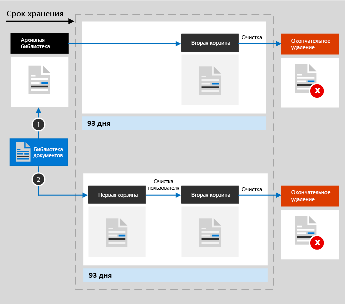
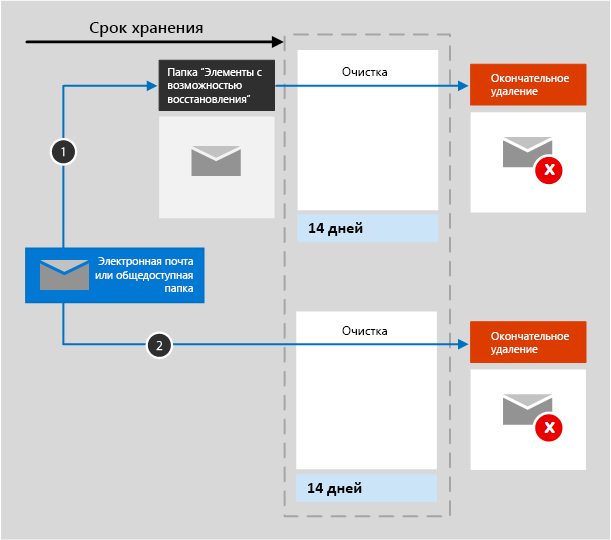
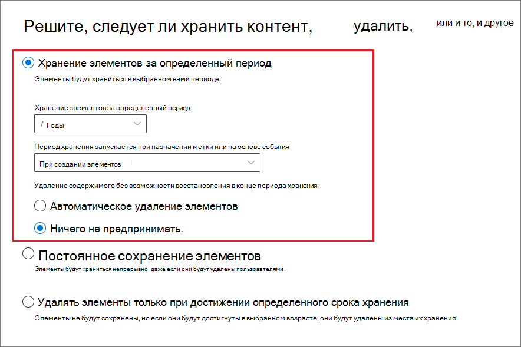
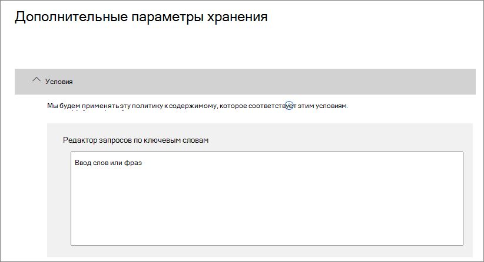
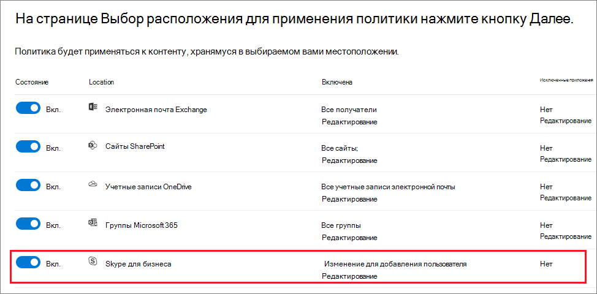
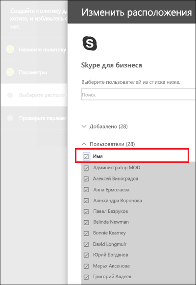
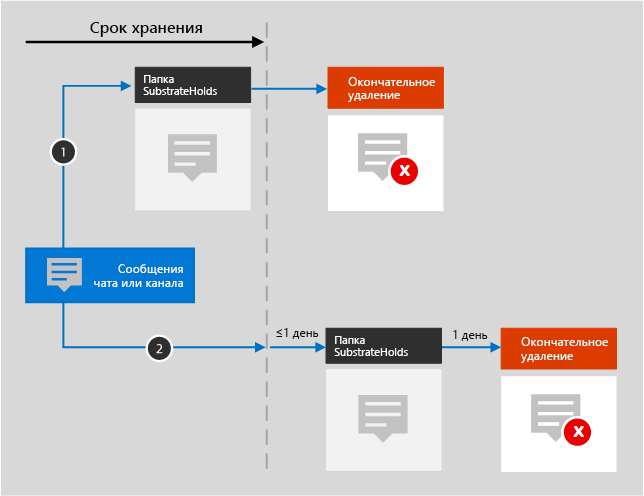
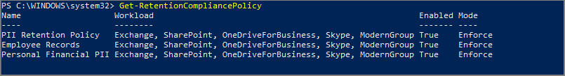
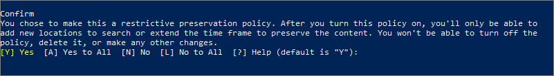
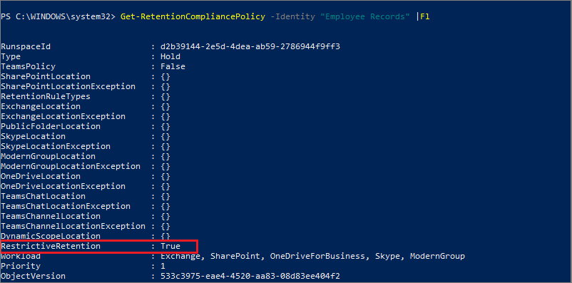

# Общие сведения о политиках храненияOverview of retention policies

>*[Руководство по лицензированию Microsoft 365 для обеспечения безопасности и соответствия требованиям](https://aka.ms/ComplianceSD).**[Microsoft 365 licensing guidance for security & compliance](https://aka.ms/ComplianceSD).*

В большинстве организаций объем и сложность данных возрастают с каждым днем: накапливаются электронные сообщения, документы, мгновенные сообщения и многое другое. Важно уметь эффективно управлять такой информацией, потому что нужно выполнять следующее:For most organizations, the volume and complexity of their data is increasing daily — email, documents, instant messages, and more. Effectively managing or governing this information is important because you need to:
  
- **Заблаговременно обеспечивать соответствие отраслевым нормативным актам и внутренним политикам**, требующим хранить содержимое в течение некоторого минимального периода. Например, закон Сарбейнса-Оксли может обязывать вас хранить определенные типы содержимого в течение семи лет.**Comply proactively with industry regulations and internal policies** that require you to retain content for a minimum period of time — for example, the Sarbanes-Oxley Act might require you to retain certain types of content for seven years. 
    
- **Снизить риск на случай судебного разбирательства или нарушения безопасности** путем окончательного удаления старого содержимого, которое вы больше не обязаны хранить.**Reduce your risk in the event of litigation or a security breach** by permanently deleting old content that you're no longer required to keep. 
    
- **Способствовать динамичности организации и эффективному обмену знаниями в ней**, обеспечив актуальность и релевантность данных, с которыми работают пользователи.**Help your organization to share knowledge effectively and be more agile** by ensuring that your users work only with content that's current and relevant to them. 
    
Достичь всех этих целей помогает политика хранения. Как правило, управление содержимым предполагает два действия:A retention policy can help you achieve all of these goals. Managing content commonly requires two actions:
  
- **Хранение** содержимого таким образом, чтобы его нельзя было удалить без возможности восстановления до окончания периода хранения.**Retaining** content so that it can't be permanently deleted before the end of the retention period. 
    
- **Удаление** содержимого без возможности восстановления в конце периода хранения.**Deleting** content permanently at the end of the retention period. 
    
Политика хранения позволяет следующее:With a retention policy, you can:
  
- Заблаговременно решать, как поступить с содержимым — хранить его, удалить или удалить через какой-то период.Decide proactively whether to retain content, delete content, or both — retain and then delete the content.
    
- Применять единую политику ко всей организации или к некоторым расположениям либо пользователям.Apply a single policy to the entire organization or specific locations or users.
    
- Применять политику ко всему содержимому или к удовлетворяющему определенным условиям (например, включающему определенные ключевые слова или [определенные типы конфиденциальной информации](what-the-sensitive-information-types-look-for.md)).Apply a policy to all content or content meeting certain conditions, such as content containing specific keywords or [specific types of sensitive information](what-the-sensitive-information-types-look-for.md).
    
Когда к содержимому применяется политика хранения, пользователи могут изменять его и работать с ним так же, как и раньше, потому что содержимое никуда не делось и находится в исходном расположении. Но если кто-либо изменит или удалит такое содержимое, его копия попадет в надежное расположение и будет там храниться до момента окончания действия политики хранения.When content is subject to a retention policy, people can continue to edit and work with the content as if nothing's changed because the content is retained in place, in its original location. But if someone edits or deletes content that's subject to the policy, a copy is saved to a secure location where it's retained while the policy is in effect.
  
Некоторые организации должны выполнять требования нормативных актов, например постановления 17a-4 Комиссии по ценным бумагам и биржам (США), которое запрещает отключать политику хранения или делать ее менее строгой. В этом случае можно использовать блокировку хранения. После блокировки никто (в том числе администратор) не сможет отключить политику или сделать ее менее строгой.Finally, some organizations have to comply with regulations such as Securities and Exchange Commission (SEC) Rule 17a-4, which requires that after a retention policy is turned on, it cannot be turned off or made less restrictive. To meet this requirement, you can use Preservation Lock. After a policy's been locked, no one (including an administrator) can turn off the policy or make it less restrictive.
  
Можно создавать политики хранения и управлять ими в [Центре соответствия требованиям Microsoft 365](https://compliance.microsoft.com/): **Политики** > **Данные** > **Хранение**You create and manage retention policies from the [Microsoft 365 compliance center](https://compliance.microsoft.com/): **Policies** > **Data** > **Retention**

Кроме того, можно перейти на эту же страницу Центра соответствия требованиям Microsoft 365 с помощью вкладки **Решения** > **Управление информацией** > **Хранение**.Alternatively, you can navigate to the same place in the Microsoft 365 compliance center by using **Solutions** > **Information governance** > **Retention** tab. 

**Если вам требуется возможность просматривать контент перед его окончательным удалением,** рекомендуется использовать [метки хранения](labels.md) вместо политики хранения.**If you want the ability to review content before it’s permanently deleted,** consider using [retention labels](labels.md) instead of a retention policy. При создании метки хранения можно настроить [проверку перед ликвидацией](disposition.md#disposition-reviews), чтобы просматривать контент в конце срока хранения.When you create a retention label, you can set up a [disposition review](disposition.md#disposition-reviews) to review the content at the end of its retention period.

## Что делает политика хранения с содержимым на местеHow a retention policy works with content in place

При добавлении расположения, например сайта или почтового ящика, в политику хранения содержимое остается в исходном расположении. Пользователи могут продолжать работать со своими документами или почтой, как будто ничего не изменилось. Но если они изменят или удалят содержимое, включенное в политику, его копия сохранится в том виде, в каком было содержимое на момент применения политики.When you include a location such as a site or mailbox in a retention policy, the content remains in its original location. People can continue to work with their documents or mail as if nothing's changed. But if they edit or delete content that's included in the policy, a copy of the content as it existed when you applied the policy is retained.
  
Для семейств веб-сайтов SharePoint копия исходного содержимого, измененного или удаленного пользователями, сохраняется в архивной библиотеке. Для электронной почты и общедоступных папок копия сохраняется в папке "Элементы с возможностью восстановления". Эти надежные расположения и хранимое в них содержимое не видны большинству пользователей. Политика хранения такова, что пользователям не нужно знать о ее применении к содержимому.For SharePoint site collections, a copy of the original content is retained in the Preservation Hold library when users edit or delete it. For email and public folders, the copy is retained in the Recoverable Items folder. These secure locations and the retained content are not visible to most people. With a retention policy, people do not even need to know that their content is subject to the policy.
  
Примечания:Notes:
  
- Содержимое Teams (чатов) хранится в Exchange, где политика применяется на основе типа сообщений (электронная почта или беседы).Teams (chat) content is stored in Exchange, where the policy is applied based on message type (email or conversation).
    
- Политика хранения, примененная к группе Office 365, включает как сайт, так и почтовый ящик группы.A retention policy applied to an Office 365 group includes both the group mailbox and site.

- Архивная библиотека использует квоту хранилища для сайта.The Preservation Hold library consumes storage quota for the site.
    
### Содержимое учетных записей OneDrive и сайтов SharePointContent in OneDrive accounts and SharePoint sites

Политика хранения применяется на уровне семейства веб-сайтов.A retention policy is applied at the level of a site collection. При включении семейства веб-сайтов SharePoint или учетной записи OneDrive в политику хранения для хранения документов используется архивная библиотека.When you include a SharePoint site collection or OneDrive account in a retention policy, a Preservation Hold library is used to retain documents. Если эта библиотека еще не существует, она создается автоматически.This library is automatically created if it doesn't already exist. Эту библиотеку можно просмотреть на странице **Содержимое сайта** на сайте верхнего уровня в семействе веб-сайтов.You can view this library on the **Site contents** page in the top-level site of the site collection. Большинство пользователей не могут просматривать архивную библиотеку, так как она видна только администраторам семейства веб-сайтов.Most users can't view the Preservation Hold library because it's visible only to site collection administrators.
  
Если кто-то пытается изменить или удалить содержимое сайта, к которому применяется политика хранения, предусматривающая хранение и удаление или только хранение, сначала эта политика проверяет, было ли это содержимое изменено с момента ее применения.If a person attempts to change or delete content in a site that's subject to retain and delete, or retain-only, first the policy checks whether the content's been changed since the policy was applied. Если это первое изменение с момента назначения этой политики, содержимое копируется в архивную библиотеку, после чего пользователь сможет изменить или удалить исходное содержимое.If this is the first change since the policy was applied, the retention policy copies the content to the Preservation Hold library, and then allows the person to change or delete the original content. В архивную библиотеку можно скопировать любое содержимое семейства веб-сайтов, даже если оно не соответствует запросу, используемому политикой хранения.Any content in the site collection can be copied to the Preservation Hold library, even if the content does not match the query used by the retention policy.

В архивную библиотеку копируется только то содержимое, которое существовало на момент применения политики хранения.Copying content to the Preservation Hold library applies to content that exists when the retention policy is applied. Кроме того, все новое содержимое, которое было создано или добавлено в коллекцию сайтов после ее включения в политику будет сохранено после удаления.In addition, any new content that's created or added to the site collection after it was included in the policy will be retained after deletion. Однако новый контент не копируется в архивную библиотеку при первом изменении, а только при удалении.However, new content isn't copied to the Preservation Hold library the first time it's edited, only when it's deleted. Чтобы сохранить все версии файла, включите управление версиями, как описано в следующем [разделе](#how-a-retention-policy-works-with-document-versions-in-a-site-collection).To retain all versions of a file, turn on versioning, as explained in a following [section](#how-a-retention-policy-works-with-document-versions-in-a-site-collection).
  
Обратите внимание, что пользователь получит сообщение об ошибке при попытке удалить библиотеку, список, папку или сайт, на которые распространяется политика хранения.Note that a user receives an error if they try to delete a library, list, folder, or site that's subject to a retention policy. Папку можно удалить, если сначала переместить или удалить из нее файлы, к которым применены политики.A user can delete a folder if they first move or delete any files in the folder that are subject to the policy. Кроме того, архивная библиотека создается только при необходимости копирования первого элемента в библиотеку, а не при создании политики хранения.Also, the Preservation Hold library is created only when the first item needs to be copied to the library and not when you create the retention policy. Поэтому для проверки политики необходимо сначала изменить или удалить документ на сайте, на который распространяется эта политика, а затем перейти в архивную библиотеку, чтобы просмотреть сохраненную копию.Therefore, to test your policy, you first need to edit or delete a document in a site that is subject to the policy, and then browse to the Preservation Hold library to view the retained copy.
  
После назначения политики хранения учетной записи OneDrive или сайту SharePoint порядок обработки содержимого зависит от настроек политики: хранение и удаление, только хранение или только удаление.After a retention policy is assigned to a OneDrive account or SharePoint site, the paths the content takes depend on whether the retention policy is to retain and delete, to retain only, or delete only.

Если политика хранения предусматривает хранение и удаление:When the retention policy is to retain and delete:

  
1. **Если содержимое изменяется или удаляется** в течение срока хранения: в архивной библиотеке сохраняется копия исходного содержимого по состоянию на момент назначения политики.**If the content is modified or deleted** during the retention period: A copy of the original content as it existed when the retention policy was assigned is created in the Preservation Hold library. Периодически выполняемое задание таймера определяет элементы, срок хранения которых истек.There, a timer job runs periodically and identifies items whose retention period has expired. Эти элементы перемещаются во вторую корзину, откуда они безвозвратно удаляются через 93 дня.Those items are then moved to the second-stage Recycle Bin, where they're permanently deleted at the end of 93 days. Вторая корзина не видна конечным пользователям (видна только первая корзина), но администраторы семейства веб-сайтов могут просматривать и восстанавливать содержимое из нее.The second-stage Recycle Bin is not visible to end users (only the first-stage Recycle Bin is), but site collection admins can view and restore content from there.

    > [!NOTE]
    > Чтобы предотвратить случайную потерю данных, содержимое не удаляется автоматически из архивной библиотеки, а перемещается во вторую корзину.To help prevent inadvertent data loss, content is never automatically deleted from the Preservation Hold library but moves to the second-stage Recycle Bin. В течение 93 дней администратор при необходимости может восстановить это содержимое.There, the grace period of 93 days lets admins recover this content, if necessary.
    
2. **Если содержимое не изменяется и не удаляется** в течение срока хранения: по окончании срока хранения документ перемещается в первую корзину.**If the content is not modified or deleted** during the retention period: At the end of the retention period, the document is moved to the first-stage Recycle Bin. Если пользователь удаляет документ оттуда или очищает корзину, то документ перемещается во вторую корзину.If a user deletes the document from there or empties this Recycle Bin (also known as purging), the document is moved to the second-stage Recycle Bin. 93-дневный срок хранения включает суммарное время хранения в первой и во второй корзине. Через 93 дня документ окончательно удаляется из того места, где он находится, то есть из первой или из второй корзины.A 93-day retention period spans both the first-stage and second-stage recycle bins. At the end of 93 days, the document is permanently deleted from wherever it resides, in either the first-stage or second-stage Recycle Bin. Корзина не индексируется, поэтому недоступна для поиска.The Recycle Bin is not indexed and therefore unavailable for searching. В результате при поиске для обнаружения электронных данных не удается найти содержимое корзины для постановки на удержание.As a result, an eDiscovery search can't find any Recycle Bin content on which to place a hold. 

Если политика хранения предусматривает только хранение или только удаление, пути к содержимому представляют собой разновидности путей политики хранения и удаления:When the retention policy is retain-only, or delete-only, the contents paths are variations of retain and delete:

#### Пути к содержимому для политики хранения, предусматривающей только хранениеContent paths for retain-only retention policy

1. **Если содержимое изменяется или удаляется** в течение срока хранения: копия исходного документа создается в архивной библиотеке и хранится до окончания срока хранения, после чего копия, находящаяся в архивной библиотеке, перемещается во вторую корзину, а через 93 дня безвозвратно удаляется.**If the content is modified or deleted** during the retention period: A copy of the original document is created in the Preservation Hold library and retained until the end of the retention period, when the copy in the Preservation Hold library is moved to the second-stage Recycle Bin and is permanently deleted after 93 days.

2. **Если содержимое не изменяется или удаляется** в течение срока хранения: ничего не происходит до и после срока хранения, документ остается в исходом месте.**If the content is not modified or deleted** during the retention period: Nothing happens before and after the retention period; the document remains in its original location.

#### Пути к содержимому для политики хранения, предусматривающей только удалениеContent paths for delete-only retention policy

1. **Если содержимое удалено** в течение срока хранения: документ перемещается в первую корзину.**If the content is deleted** during the retention period: The document is moved to first-stage Recycle Bin. Если пользователь удаляет документ оттуда или очищает корзину, то документ перемещается во вторую корзину.If a user deletes the document from there or empties this Recycle Bin, the document is moved to the second-stage Recycle Bin. 93-дневный срок хранения включает суммарное время хранения в первой и во второй корзине. Через 93 дня документ окончательно удаляется из того места, где он находится, то есть из первой или из второй корзины.A 93-day retention period spans both the first-stage and second-stage recycle bins. At the end of 93 days, the document is permanently deleted from wherever it resides, in either the first-stage or second-stage Recycle Bin. Если содержимое изменяется в течение срока хранения, по истечении его срока действия используется тот же путь удаления.If the content is modified during the retention period, it follows the same deletion path after the content expires.

2. **Если содержимое не удаляется** в течение срока хранения: по окончании срока хранения документ перемещается в первую корзину.**If the content is not deleted** during the retention period: At the end of the retention period, the document is moved to the first-stage Recycle Bin. Если содержимое удаляется в течение срока хранения, документ немедленно перемещается в первую корзину.If the content is deleted during the retention period, the document is immediately moved to first-stage Recycle Bin. Если пользователь удаляет документ оттуда или очищает корзину, то документ перемещается во вторую корзину.If a user deletes the document from there or empties this Recycle Bin (also known as purging), the document is moved to the second-stage Recycle Bin. 93-дневный срок хранения включает суммарное время хранения в первой и во второй корзине. Через 93 дня документ окончательно удаляется из того места, где он находится, то есть из первой или из второй корзины.A 93-day retention period spans both the first-stage and second-stage recycle bins. At the end of 93 days, the document is permanently deleted from wherever it resides, in either the first-stage or second-stage Recycle Bin. Корзина не индексируется, поэтому недоступна для поиска.The Recycle Bin is not indexed and therefore unavailable for searching. В результате при поиске для обнаружения электронных данных не удается найти содержимое корзины для постановки на удержание.As a result, an eDiscovery search can't find any Recycle Bin content on which to place a hold.

### Содержимое в почтовых ящиках и общедоступных папкахContent in mailboxes and public folders

Политика хранения почты, календаря и других элементов пользователя применяется на уровне почтового ящика. Политика хранения общедоступной папки применяется на уровне папки, а не на уровне почтового ящика. Элементы почтового ящика и общедоступной папки хранятся в папке "Элементы с возможностью восстановления". Только пользователи, которым назначены разрешения на обнаружение электронных данных, могут просматривать папки "Элементы с возможностью восстановления" других пользователей.For a user's mail, calendar, and other items, a retention policy is applied at the level of a mailbox. For a public folder, a retention policy is applied at the folder level, not the mailbox level. Both a mailbox and a public folder use the Recoverable Items folder to retain items. Only people whom have been assigned eDiscovery permissions can view items in another user's Recoverable Items folder.
  
По умолчанию при удалении сообщения из папки, отличной от папки "Удаленные", сообщение перемещается в папку "Удаленные". При удалении элемента из папки "Удаленные" сообщение перемещается в папку "Элементы с возможностью восстановления". Кроме того, пользователь может выполнить обратимое удаление элемента (SHIFT+DELETE) в любой папке, что позволяет обойти папку "Удаленные" и переместить этот элемент непосредственно в папку "Элементы с возможностью восстановления".By default, when a person deletes a message in a folder other than the Deleted Items folder, the message is moved to the Deleted Items folder. When a person deletes an item in the Deleted Items folder, the message is moved to the Recoverable Items folder. In addition, a person can soft delete an item (SHIFT+DELETE) in any folder, which bypasses the Deleted Items folder and moves the item directly to the Recoverable Items folder.
  
Процесс периодически проверяет содержимое папки "Элементы с возможностью восстановления". Если элемент не соответствует правилам по крайней мере одной политики хранения, он окончательно удаляется (такое удаление также называется необратимым) из этой папки.A process periodically evaluates items in the Recoverable Items folder. If an item doesn't match the rules of at least one retention policy, the item is permanently deleted (also called hard deleted) from the Recoverable Items folder.
  
При попытке пользователя изменить определенные свойства элемента почтового ящика (например, тему, текст сообщения, вложения, отправителей и получателей, дату отправки или дату получения сообщения) копия исходного элемента сохраняется в папке "Элементы с возможностью восстановления", прежде чем изменение вступит в силу.When a person attempts to change certain properties of a mailbox item — such as the subject, body, attachments, senders and recipients, or date sent or received for a message — a copy of the original item is saved to the Recoverable Items folder before the change is committed. Так будет происходить при каждом последующем изменении.This action happens for each subsequent change. В конце периода хранения копии в папке "Элементы с возможностью восстановления" окончательно удаляются.At the end of the retention period, copies in the Recoverable Items folder are permanently deleted.
  
Если политика хранения предусматривает хранение и удаление:When the retention policy is to retain and delete:

1. **Если элемент изменяется или окончательно удаляется** пользователем во время периода хранения, то копируется или перемещается в папку "Элементы с возможностью восстановления" соответственно. (К окончательному удалению элемента приводит нажатие клавиш SHIFT+DELETE или удаление элемента из папки "Удаленные элементы".) После чего периодически запускается процесс, который выявляет элементы с истекшим сроком хранения, и они удаляются в течение 14 дней после окончания периода хранения без возможности восстановления. Обратите внимание на то, что 14 дней — это значение по умолчанию. Его можно менять, указывая до 30 дней.**If the item is modified or permanently deleted** by the user (either SHIFT+DELETE or deleted from Deleted Items) during the retention period, the item is moved (or copied, in the case of edit) to the Recoverable Items folder. There, a process runs periodically and identifies items whose retention period has expired, and these items are permanently deleted within 14 days of the end of the retention period. Note that 14 days is the default setting, but it can be configured up to 30 days.
    
2. **Если элемент не изменяется и не удаляется** в течение срока хранения, аналогичным образом периодически сканируются все папки в почтовом ящике, и в них определяются элементы, срок хранения которых истек. В течение 14 дней после окончания срока хранения эти элементы удаляются без возможности восстановления.**If the item is not modified or deleted** during the retention period, the same process runs periodically on all folders in the mailbox and identifies items whose retention period has expired, and these items are permanently deleted within 14 days of the end of the retention period. Обратите внимание, что срок окончательного удаления равен 14 дням по умолчанию, но может быть установлен и более длительным — до 30 дней.Note that 14 days is the default setting, but it can be configured up to 30 days. Если политика хранения предусматривает только хранение или только удаление, пути к содержимому представляют собой разновидности путей политики хранения и удаления:When the retention policy is retain-only, or delete-only, the contents paths are variations of retain and delete:

#### Пути к содержимому для политики хранения, предусматривающей только хранениеContent paths for retain-only retention policy

1. **Если элемент изменяется или удаляется** в течение срока хранения: копия исходного элемента создается в папке "Элементы с возможностью восстановления" и хранится до окончания срока хранения, после чего копия, находящаяся папке "Элементы с возможностью восстановления", безвозвратно удаляется через 14 дней после истечения срока действия элемента.**If the item is modified or deleted** during the retention period: A copy of the original item is created in the Recoverable Items folder and retained until the end of the retention period, when the copy in the Recoverable Items folder is permanently deleted within 14 days after the item expires. 

2. **Если элемент не изменяется или удаляется** в течение срока хранения: ничего не происходит до и после срока хранения, элемент остается в исходом месте.**If the item is not modified or deleted** during the retention period: Nothing happens before and after the retention period; the item remains in its original location.

#### Пути к содержимому для политики хранения, предусматривающей только удалениеContent paths for delete-only retention policy

1. **Если элемент не удаляется** в течение срока хранения: по окончании срока хранения элемент перемещается в папку "Элементы с возможностью восстановления".**If the item is not deleted** during the retention period: At the end of the retention period, the item is moved to the Recoverable items folder. 

2. **Если элемент удаляется** в течение срока хранения, то элемент немедленно перемещается в папку "Элементы с возможностью восстановления".**If the item is deleted** during the period, the item is immediately moved to the Recoverable items folder. Если пользователь удалит элемент оттуда или очистит папку "Элементы с возможностью восстановления", элемент будет безвозвратно удален.If a user deletes the item from there or empties the Recoverable items folder, the item is permanently deleted. В противном случае элемент будет безвозвратно удален через 14 дней после перемещения в папку "Элементы с возможностью восстановления".Otherwise, the item is permanently deleted after being in the Recoverable items folder for 14 days. 

### Когда пользователь покидает организациюWhen a user leaves the organization

**Exchange****Exchange** 

Если пользователь покидает вашу организацию, а почтовый ящик пользователя включается в политику хранения, почтовый ящик становится неактивным почтовым ящиком при удалении учетной записи пользователя Office 365.If a user leaves your organization and the user's mailbox is included in a retention policy, the mailbox becomes an inactive mailbox when the user's Office 365 account is deleted. Содержимое неактивного почтового ящика по-прежнему подчиняется любой политике хранения, которая была помещена в почтовый ящик до того, как он стал неактивным, и содержимое доступно для поиска eDiscovery.The contents of an inactive mailbox are still subject to any retention policy that was placed on the mailbox before it was made inactive, and the contents are available to an eDiscovery search. Дополнительные сведения см. В разделе [Неактивные почтовые ящики в Exchange Online](inactive-mailboxes-in-office-365.md).For more information, see [Inactive mailboxes in Exchange Online](inactive-mailboxes-in-office-365.md).

**OneDrive****OneDrive**

Если пользователь покидает вашу организацию, любые файлы, на которые распространяется политика хранения или которые содержат метки хранения, будут оставаться в течение срока действия политики или метки.If a user leaves your organization, any files subject to a retention policy or containing retention labels will remain for the duration of the policy or label. В течение этого периода все возможности совместного доступа продолжают работать.During that time period, all sharing access continues to work. Когда срок хранения истекает, контент перемещается в корзину семейства сайтов и становится недоступным никому, кроме администратора. Если документ помечен политикой хранения как запись, он не будет удален до тех пор, пока не истечет срок хранения, после которого содержимое будет удалено окончательно.When the retention period expires, content moves into the Site Collection Recycle Bin and is not accessible to anyone except the admin. If a document is marked by a retention policy as a record, it will not be deleted until the retention period is over, after which time the content is permanently deleted.

**SharePoint****SharePoint**

Когда пользователь покидает вашу организацию, на любое содержимое, созданное этим пользователем, это не влияет, поскольку SharePoint считается средой совместной работы, в отличие от почтового ящика пользователя или учетной записи OneDrive.When a user leaves your organization, any content created by that user is not affected because SharePoint is considered a collaborative environment, unlike a user's mailbox or OneDrive account.

## Что политика хранения делает с версиями документов в семействе веб-сайтовHow a retention policy works with document versions in a site collection

Управление версиями — это функция всех библиотек документов в SharePoint Online и OneDrive для бизнеса.Versioning is a feature of all document libraries in SharePoint Online and OneDrive for Business. По умолчанию при управлении версиями сохраняется не менее 500 основных номеров версий, хотя можно увеличить это значение.By default, versioning retains a minimum of 500 major versions, though you can increase this limit. Дополнительные сведения см. в статье [Включение и настройка управления версиями для списка или библиотеки](https://support.office.com/article/1555d642-23ee-446a-990a-bcab618c7a37).For more information, see [Enable and configure versioning for a list or library](https://support.office.com/article/1555d642-23ee-446a-990a-bcab618c7a37).
  
Политика сохранения (политика, сохраняющая содержимое вместо его удаления) сохраняет все версии документа в семействе сайтов SharePoint или в учетной записи OneDrive.A retain policy (retention policy that retains content instead of delete-only) retains all versions of a document in a SharePoint site collection or OneDrive account. При первом изменении документа, для которого действует политика сохранения или удержания, версия исходного документа копируется в архивную библиотеку.When a document subject to a hold or retain policy is edited for the first time, a version of the original document is copied to the Preservation Hold library. При удалении документа, для которого действует политика сохранения или удержания, все версии этого документа копируется в архивную библиотеку, если включено управление версиями.When a document subject to a hold or retain policy is deleted, all versions are copied to the Preservation Hold library if versioning is enabled. Каждая версия документа в архивной библиотеке существует как отдельный элемент с собственным сроком хранения:Each version of a document in the Preservation Hold library exists as a separate item with its own retention period:
  
- Если политика хранения основана на времени создания содержимого, все версии имеют ту же дату истечения срока хранения, что и исходный документ.If the retention policy is based on when the content was created, each version has the same expiration date as the original document. The original document and its versions all expire at the same time.
    
- Если политика хранения основана на времени последнего изменения содержимого, каждая из версий имеет собственный срок хранения, определенный с учетом времени изменения исходного документа для ее создания. Сроки для исходного документа и его версий истекают независимо друг от друга.If the retention policy is based on when the content was last modified, each version has its own expiration date based on when the original document was modified to create that version. The original documents and its versions expire independently of each other.

> [!NOTE]
> Сохраненные версии документов SharePoint и OneDrive недоступны для поиска средствами обнаружения электронных данных.The preserved versions of SharePoint and OneDrive documents are not searchable by eDiscovery tools.

## Хранение содержимого в течение определенного периода времениRetaining content for a specific period of time

Используя политику хранения, вы можете хранить содержимое бесконечно или в течение определенного количества дней, месяцев или лет.With a retention policy, you can retain content indefinitely or for a specific number of days, months, or years. Длительность хранения содержимого рассчитывается исходя из давности содержимого, а не с момента применения политики хранения.The duration for how long content is retained is calculated from the age of the content, not from when the retention policy is applied. Вы можете выбрать, как будет определяться давность содержимого (для OneDrive и SharePoint): по дате и времени создания или последнего изменения.You can choose whether the age is based on when the content was created or (for OneDrive and SharePoint) when it was last modified.
  
Например, если необходимо хранить содержимое в семействе веб-сайтов на протяжении семи лет с момента его последнего изменения, а документ в этом семействе веб-сайтов не изменялся в течение шести лет, то он будет сохраняться еще только один год, если в него не внесут изменений. В случае повторного изменения документа отсчет его возраста начинается с новой даты последнего изменения, при этом он будет сохраняться еще семь лет.For example, if you want to retain content in a site collection for seven years since it was last modified, and a document in that site collection hasn't been modified in six years, the document will be retained for only another year if it's not modified. If the document is edited again, the age of the document is calculated from the new last modified date, and it will be retained for another seven years.
  
Кроме того, если вы хотите хранить содержимое почтового ящика в течение семи лет, а сообщение было отправлено шесть лет назад, оно будет храниться всего один год. Для содержимого Exchange возраст всегда определяется с учетом даты получения или отправки (они совпадают). Хранение содержимого с учетом времени последнего изменения применяется только для содержимого сайтов в OneDrive и SharePoint.Similarly, if you want to retain content in a mailbox for seven years, and a message was sent six years ago, the message will be retained for only one year. For Exchange content, the age is always based on the date received or sent (they are the same). Retaining content based on when it was last modified applies only to site content in OneDrive and SharePoint.
  
Вы можете выбрать, будет ли контент удаляться без возможности восстановления по окончании срока хранения.You can choose whether you want the content to be permanently deleted at the end of the retention period. Политика хранения может также предусматривать удаление старого содержимого без его храненияA retention policy can also delete old content without retaining it. (см. следующий раздел).See the next section.
  

  
## Удаление содержимого, которое старше указанного возрастаDeleting content that's older than a specific age

Политика хранения может предусматривать как хранение содержимого с последующим удалением, так и удаление старого содержимого без хранения.A retention policy can both retain and then delete content, or delete old content without retaining it.
  
Если политика хранения предусматривает удаление содержимого, важно понимать, что период, указанный для политики хранения, рассчитывается со времени создания или изменения содержимого, а не со времени назначения политики.If your retention policy deletes content, it's important to understand that the time period specified for a retention policy is calculated from the time when the content was created or modified, not the time since the policy was assigned.
  

  
Предположим, вы создаете политику хранения, согласно которой содержимое удаляется через три года, а затем назначаете эту политику всем учетным записям OneDrive с большим объемом содержимого, созданного четыре или пять лет назад. В этом случае такое содержимого будет удалено вскоре после назначения политики хранения в первый раз. По этой причине **политика хранения, предусматривающая удаление содержимого, может серьезно повлиять на содержимое**.For example, suppose that you create a retention policy that deletes content after three years, and then assign that policy to all OneDrive accounts, which contain a lot of content that was created four or five years ago. In this case, a lot of content will be deleted soon after assigning the retention policy for the first time. For this reason, **a retention policy that deletes content can have a considerable impact on your content**. 
  
Потому перед первым назначением политики хранения семейству веб-сайтов следует сначала определить возраст содержимого и подумать о том, как может эта политика повлиять на такое содержимое. Кроме того, может потребоваться уведомить ваших пользователей о новой политике, прежде чем назначать ее, чтобы у них было время оценить возможное ее влияние. Обратите внимание на это предупреждение, которое появляется при просмотре параметров политики хранения непосредственно перед ее созданием.Therefore, before you assign a retention policy to a site collection for the first time, you should first consider the age of the existing content and how the policy may impact that content. You may also want to communicate the new policy to your users before assigning it, to give them time to assess the possible impact. Note this warning that appears when you review the settings for your retention policy just before creating it.
  

  
## Дополнительные параметры, с помощью которых политика применяется только к содержимому, соответствующему определенным условиямAdvanced settings that apply a policy only to content that meets certain conditions

Политику хранения можно применить ко всему содержимому в расположениях, на которые она распространяется, или же только к содержимому, включающему определенные ключевые слова или [определенные типы конфиденциальной информации](what-the-sensitive-information-types-look-for.md).A retention policy can apply to all content in the locations that it includes, or you can choose to apply a retention policy only to content that contains specific keywords or [specific types of sensitive information](what-the-sensitive-information-types-look-for.md).
  

  
### Хранение содержимого с определенными ключевыми словамиRetain content that contains specific keywords

Вы можете применить политику хранения к содержимому, соответствующему определенным условиям, а затем предпринять действия по хранению только в отношении такого содержимого. Доступные в данный момент условия поддерживают применение политики хранения к содержимому, содержащему определенные слова или фразы. Вы можете уточнить запрос с помощью таких операторов поиска, как И, ИЛИ и НЕ. Дополнительные сведения об операторах см. в статье [Запросы по ключевым словам и условия поиска содержимого](keyword-queries-and-search-conditions.md).You can apply a retention policy only to content that satisfies certain conditions, and then take retention actions on just that content. The conditions available now support applying a retention policy to content that contains specific words or phrases. You can refine your query by using search operators like AND, OR, and NOT. For more information on these operators, see [Keyword queries and search conditions for Content Search](keyword-queries-and-search-conditions.md).
  
Поддержка добавления свойств, поддерживающих поиск (например, **subject:**), появится в скором времени.Support for adding searchable properties (for example, **subject:**) is coming soon.
  
При хранении на основе запросов используется индекс поиска для определения содержимого.Query-based retention uses the search index to identify content.
  

  
### Хранение содержимого с конфиденциальной информациейRetain content that contains sensitive information

Политику хранения можно также применить только к содержимому с [определенными типами конфиденциальной информации](what-the-sensitive-information-types-look-for.md). Например, можно установить уникальные требования к хранению только содержимого, которое включает такие персональные данные, как идентификационные номера налогоплательщиков, номера социального страхования или номера паспортов.You can also apply a retention policy only to content that contains [specific types of sensitive information](what-the-sensitive-information-types-look-for.md). For example, you can choose to apply unique retention requirements only to content that contains personally identifiable information (PII) such as taxpayer identification numbers, social security numbers, or passport numbers.
  

  
Примечания:Notes:
  
- Дополнительные параметры хранения конфиденциальной информации не применяются к общедоступным папкам Exchange и Skype для бизнеса, так как эти расположения не поддерживают типы конфиденциальной информации.Advanced retention for sensitive information doesn't apply to Exchange public folders or Skype for Business because those locations don't support sensitive information types.
    
- Следует понимать, что Exchange Online использует правила потока обработки почты (также называемые правилами транспорта) для выявления конфиденциальной информации, поэтому этот способ применим только к сообщениям во время их передачи, а не ко всем элементам, уже сохраненным в почтовом ящике. Для Exchange Online это означает, что политика хранения может выявить конфиденциальную информацию и выполнить действия по хранению только над сообщениями, которые были получены **после** применения политики к почтовому ящику. (Обратите внимание, что хранение на основе запросов, описанное в предыдущем разделе, не имеет такого ограничения, так как при нем используется индекс поиска для выявления содержимого.)You should understand that Exchange Online uses mail flow rules (also known as transport rules) to identify sensitive information, so this works only on messages in transit — not on all items already stored in a mailbox. For Exchange Online, this means that a retention policy can identify sensitive information and take retention actions only on messages that are received **after** the policy is applied to the mailbox. (Note that query-based retention described in the previous section doesn't have this limitation because it uses the search index to identify content.) 
    
## Применение политики хранения ко всей организации или определенным расположениямApplying a retention policy to an entire organization or specific locations

Вы можете легко применить политику хранения ко всей организации, целому расположению или только к отдельным его частям или пользователям.You can easily apply a retention policy to an entire organization, entire locations, or only to specific locations or users.
  
### Политика для всей организацииOrg-wide policy

Одна из наиболее эффективных функций политики хранения заключается в том, что она может применяться к расположениям в Office 365, в том числе:One of the most powerful features of a retention policy is that it can apply to locations across Office 365, including:
  
- Электронная почта ExchangeExchange email
    
- Семейства веб-сайтов SharePointSharePoint site collections
    
- Учетные записи OneDriveOneDrive accounts
    
- Группы Office 365 (применимо к содержимому почтового ящика группы и связанного сайта SharePoint).Office 365 groups (applies to content in the group's mailbox and associated SharePoint site.)
    
- Общедоступные папки Exchange.Exchange public folders
    

Ниже перечислены другие важные возможности политики хранения для всей организации.Other important features of an org-wide retention policy include:
  
- Количество почтовых ящиков или сайтов, на которые может распространяться политика, не ограничено.There is no limit to the number of mailboxes or sites the policy can include.
    
- Для Exchange каждый новый почтовый ящик, созданный после применения политики, будет автоматически ее наследовать.For Exchange, any new mailbox created after the policy is applied will automatically inherit the policy.
  
### Политика, применяемая к целому расположениюA policy that applies to entire locations

При выборе расположений можно легко включить или исключить из политики целое расположение, например всю электронную почту Exchange или все учетные записи OneDrive.When you choose locations, you can easily include or exclude an entire location, such as Exchange email or OneDrive accounts. Для этого включите или отключите параметр **Состояние** этого расположения.To do so, toggle the **Status** of that location on or off. 
  
Как и в случае с политикой для всей организации, политика, применяемая к любому сочетанию целых расположений, не ограничена в количестве почтовых ящиков или сайтов, которые может охватывать. Например, если политика охватывает всю почту Exchange и все сайты SharePoint, будут включены все сайты и почтовые ящики независимо от их количества. Для Exchange каждый новый почтовый ящик, созданный после применения политики, будет автоматически ее наследовать.Like an org-wide policy, if a policy applies to any combination of entire locations, there is no limit to the number of mailboxes or sites the policy can include. For example, if a policy includes all Exchange email and all SharePoint sites, all sites and mailboxes will be included, no matter how many. And for Exchange, any new mailbox created after the policy is applied will automatically inherit the policy.

### Политика, в которую включены нужные элементыA policy with specific inclusions or exclusions

Можно также применить политику хранения к определенным пользователям, группам Office 365 или сайтам. Для этого установите переключатель **Состояние** такого расположения во включенное положение и затем с помощью ссылок включите или исключите отдельных пользователей, группы Office 365 или сайты.You can also apply a retention policy to specific users, Office 365 groups, or sites. To do so, toggle the **Status** of that location on, and then use the links to include or exclude specific users, Office 365 groups, or sites. 
  
Однако обратите внимание, что при настройке политики хранения, которая включает или исключает более 1000 определенных расположений, существуют следующие ограничения:However, note that the following limits exist when you configure a retention policy that includes or excludes over 1,000 specific locations:
  
- Максимальное количество для политики хранения:Maximum numbers for the retention policy:
    - 1000 почтовых ящиков1,000 mailboxes
    - 1000 групп Office 3651,000 Office 365 groups
    - 1 000 пользователей приватных чатов Teams1,000 users for Teams private chats
    - 100 сайтов (OneDrive или SharePoint)100 sites (OneDrive or SharePoint)

- Клиент не может содержать более 10 000 политик хранения.A tenant can contain no more than 10,000 retention policies.
    
Хотя эти ограничения существуют, вы можете избежать их, применяя либо политику всей организации, либо политику, которая применяется ко всем местоположениям.Although these limits exist, you can avoid them by applying either an org-wide policy or a policy that applies to entire locations.
  
### Расположения SkypeSkype locations

В отличие от электронной почты Exchange, вы не можете включить статус местоположения Skype, чтобы включить всех пользователей, но когда вы включаете это местоположение, вы затем вручную выбираете пользователей, чьи разговоры вы хотите сохранить:Unlike Exchange email, you can't toggle the status of the Skype location on to include all users, but when you turn on that location, you then manually choose the users whose conversations you want to retain:

  
Выбрав **Выбрать пользователей**, вы можете быстро включить всех пользователей, выбрав поле **Имя** в заголовке столбца.When you select **Choose users**, you can quickly include all users by selecting the **Name** box in the column header. но при этом важно понимать, что каждый пользователь засчитывается как отдельно включенный в политику.However, it's important to understand that each user counts as a specific inclusion in the policy. Поэтому, если вы выберете более 1000 пользователей, вступят в силу ограничения, о которых шла речь в предыдущем разделе.Therefore, if you include over 1,000 users, the limits noted in the previous section apply. Выбор всех пользователей Skype здесь не равносилен заданию гипотетической общеорганизационной политики, которая бы по умолчанию включала всех пользователей Skype.Selecting all Skype users here is not the same as if an org-wide policy were able to include all Skype users by default. 
  

  
Обратите внимание, что **Журнал бесед**, папка в Outlook, не имеет отношения к архивам Skype. **Журнал бесед** может быть отключен пользователем, однако архивация для Skype выполняется путем сохранения копии бесед Skype в скрытой папке, не доступной для пользователя, но доступной для обнаружения электронных данных.Note that **Conversation History**, a folder in Outlook, is a feature that has nothing to do with Skype archiving. **Conversation History** can be turned off by the end user, but archiving for Skype is done by storing a copy of Skype conversations in a hidden folder that is inaccessible to the user but available to eDiscovery.

### Расположения SharePointSharePoint locations

Ваша политика хранения может сохранять контент на сайтах связи SharePoint, сайтах групп, которые не связаны группами Office 365, и классических сайтах.Your retention policy can retain content in SharePoint communication sites, team sites that aren't connected by Office 365 groups, and classic sites. Сайты групп, подключенные к группам Office 365, не поддерживаются этим параметром, вместо этого используйте расположения **групп Office 365**.Team sites connected by Office 365 groups aren't supported with this option and instead, use the **Office 365 groups** locations.

Если вы указываете сайты, которые не поддерживаются, они игнорируются политикой хранения.If you specify sites that aren't supported, these are ignored by the retention policy.

Когда вы указываете свои местоположения для сайтов SharePoint, вам не нужны разрешения для доступа к сайту, и проверка не выполняется в тот момент, когда вы указываете URL-адрес на странице **Изменить местоположения**.When you specify your locations for SharePoint sites, you don't need permissions to access the site and no validation is done at the time you specify the URL on the **Edit locations** page. Однако сайты должны быть проиндексированы, а указанные вами сайты проверяются на то, что они существуют в конце работы мастера.However, the sites must be indexed and the sites you specify are checked that they exist at the end of the wizard.

Если эта проверка не пройдена, вы увидите сообщение о том, что проверка для введенного вами URL не удалась, и мастер не создаст политику хранения, пока проверка проверки не пройдет.If this check fails, you see a message that validation failed for the URL you entered, and the wizard won't create the retention policy until the validation check passes. Если вы видите это сообщение, вернитесь в мастер, чтобы изменить URL или удалить сайт.If you see this message, go back in the wizard to change the URL or remove the site.

### Расположения TeamsTeams locations

> [!NOTE]
> Настройка для хранения сообщений в закрытых каналах пока не поддерживается.We don't yet support configuration for retention of private channel messages. Поддерживается хранение файлов, к которым предоставлен общий доступ в закрытых каналах.Retention of files shared in private channels is supported.

Для хранения чатов и сообщений канала в Teams можно использовать политику хранения. Чаты Teams хранятся в скрытой папке почтового ящика каждого пользователя, включенного в чат, а сообщения канала Teams хранятся в похожей скрытой папке в почтовом ящике группы. Важно понимать, что Teams использует службу чата на базе Azure, которая также сохраняет эти данные, а по умолчанию эта служба хранит данные бесконечно. По этой причине мы настоятельно рекомендуем использовать расположение Teams для хранения и удаления данных Teams. Использование этого расположения позволит окончательно удалять данные из почтовых ящиков Exchange и службы чата на базе Azure. Дополнительные сведения см. в статье [Общие сведения о безопасности и соответствии требованиям в Microsoft Teams](https://go.microsoft.com/fwlink/?linkid=871258).You can use a retention policy to retain chats and channel messages in Teams. Teams chats are stored in a hidden folder in the mailbox of each user included in the chat, and Teams channel messages are stored in a similar hidden folder in the group mailbox for the team. However, it's important to understand that Teams uses an Azure-powered chat service that also stores this data, and by default this service stores the data forever. For this reason, we strongly recommend that you use the Teams location to retain and delete Teams data. Using the Teams location will permanently delete data from both the Exchange mailboxes and the underlying Azure-powered chat service. For more information, see [Overview of security and compliance in Microsoft Teams](https://go.microsoft.com/fwlink/?linkid=871258).
  
На чаты и сообщения каналов Teams не влияют политики хранения, применяемые к почтовым ящикам пользователей или групп в расположениях Exchange и Групп Office 365.Teams chats and channel messages are not affected by retention policies applied to user or group mailboxes in the Exchange or Office 365 groups locations. Хотя чаты и сообщения каналов Teams хранятся в Exchange, на них влияет только политика хранения, применяемая к расположению Teams.Even though Teams chats and channel messages are stored in Exchange, they're affected only by a retention policy that's applied to the Teams location.

> [!NOTE]
> Если пользователь включен в активную политику хранения, в соответствии с которой хранятся данные Teams, и вы удаляете почтовый ящик пользователя, включенного в эту политику, для сохранения данных почтовый ящик преобразуется в [неактивный](inactive-mailboxes-in-office-365.md).If a user is included in an active retention policy that retains Teams data and you a delete a mailbox of a user who is included in this policy, to retain the data, the mailbox is converted into an [inactive mailbox](inactive-mailboxes-in-office-365.md). Если вам не нужно хранить эти данные для пользователя, исключите пользователя из политики хранения перед удалением почтового ящика.If you don't need to retain this data for the user, exclude the user from the retention policy before you delete their mailbox.
  
После того как политика хранения назначена команде, чаты и сообщения каналов обрабатываются одним из указанных ниже способов.After a retention policy is assigned to a team, chat and channel messages can follow one of two paths:

1. **Если сообщение чата или канала изменено или удалено** пользователем в течение срока хранения, оно перемещается (или копируется в случае изменения) в папку SubstrateHolds (скрытая папка в почтовом ящике каждого пользователя или группы) и хранится в этой папке до истечения срока хранения.**If a chat or channel message is modified or deleted** by the user during the retention period, the message is moved (or copied, in the case of edit) to the SubstrateHolds folder (which is a hidden folder in every user or group mailbox) and is stored in this folder until the retention period expires. Сообщения окончательно удаляются в день истечения срока хранения.Messages are permanently deleted on the day the retention period expires.

2. **Если сообщение чата или канала не удаляется** в течение срока хранения, оно перемещается в папку SubstrateHolds в течение одного дня после истечения срока хранения (это занимает до 24 часов).**If a chat or channel message isn't deleted** during the retention period, the message is moved to the SubstrateHolds folder within one day after the retention period expires (it takes from 0 to 24 hours). Сообщение окончательно удаляется через день после перемещения в папку SubstrateHolds.The message is permanently deleted one day after it is moved to the SubstrateHolds folder. 

> [!NOTE]
> Сообщения в папке SubstrateHolds доступны для поиска средствами обнаружения электронных данных.Messages in the SubstrateHolds folder are searchable by eDiscovery tools. После окончательного удаления сообщения оно не будет возвращаться в результатах поиска средствами обнаружения электронных данных.After a message is permanently deleted, it won't be returned in an eDiscovery search.

Мы постоянно работаем над оптимизацией функций хранения в Teams и планируем выпустить новые функции в ближайшие месяцы.We're continuously working on optimizing retention functionality in Teams, and we plan to release new features in the coming months. Тем временем следует учитывать ряд ограничений.In the meantime, here are a few limitations to be aware of:
  
- **Для Teams требуется отдельная политика хранения**.**Teams require a separate retention policy**. Если при создании политики хранения включить расположение Teams, все остальные расположения необходимо выключить.When you create a retention policy and toggle on the Teams location, all other locations toggle off. Политика хранения, которая применяется к Teams, не должна включать какие-либо другие расположения, кроме Teams.A retention policy that includes Teams can include only Teams and no other locations. 
    
- **Teams не включается в политику для всей организации**.**Teams aren't included in an org-wide policy**. При создании такой политики Teams в нее не включается, так как требует отдельной политики хранения.If you create an org-wide policy, Teams are not included because they require a separate retention policy. 
    
- **Teams не поддерживает расширенные возможности хранения**.**Teams doesn't support advanced retention**. Если при создании политики хранения выбрать [дополнительные параметры для применения политики только к содержимому, отвечающему определенным условиям](#advanced-settings-that-apply-a-policy-only-to-content-that-meets-certain-conditions), расположение Teams будет недоступно.When you create a retention policy, if you choose the [Advanced settings that apply a policy only to content that meets certain conditions](#advanced-settings-that-apply-a-policy-only-to-content-that-meets-certain-conditions), the Teams location is not available. В настоящее время политика хранения Teams применяется ко всему содержимому чатов и сообщений каналов.At this time, retention in Teams applies to all of the chat and channel message content. 

- **Содержимое Teams в закрытых каналах не поддерживается**.**Teams content in private channels isn't supported**. В настоящее время политики хранения, созданные для Teams, не применяются к сообщениям закрытых каналов.At this time, retention policies created for Teams don't apply to private channel messages. Политика хранения, созданная для Teams, распространяется только на сообщения в стандартных каналах.Only messages in standard channels are subject to a retention policy created for Teams. Поддержка политик хранения для закрытых каналов ожидается в ближайшее время.Support for retention policies for private channels is coming soon. 
    
- **Очистка сообщений с истекшим сроком действия в Teams может занимать до трех дней**.**Teams may take up to three days to clean up expired messages**. Политика хранения, применяемая к Teams, удаляет чаты и сообщения канала по истечении срока хранения.A retention policy applied to Teams will delete chat and channel messages when the retention period expires. Однако очистка этих сообщений и их окончательное удаление может занимать до трех дней.However, it may take up to three days to clean up these messages and permanently delete them. Кроме того, сообщения чатов и каналов доступны для поиска средствами обнаружения электронных данных после истечения срока хранения и безвозвратного удаления сообщений.Also, chat and channel messages will be searchable with eDiscovery tools during the time after the retention period expires and when messages are permanently deleted.

   > [!NOTE]
   > Действительно, раньше политика хранения не могла удалять содержимое Teams с давностью менее 30 дней, но это ограничение было устранено.It used to be true that a retention policy couldn't delete Teams content that's less than 30 days old, but we've removed this limitation. Теперь срок хранения содержимого Teams может составлять любое выбранное вами значение в днях, даже один день.Now the retention period for Teams content can be any number of days you choose and as short as one day. Если ваш срок хранения составляет один день, окончательное удаление сообщений может занять до трех дней с истечения срока хранения.If you do have a retention period of one day, it will take up to three days after the retention period expires before messages are permanently deleted.
    
В Teams файлы, которыми пользователь поделился в чате, сохраняются в учетной записи OneDrive этого пользователя.In Teams, files that are shared in chat are stored in the OneDrive account of the user who shared the file. Файлы, добавленные в каналы, сохраняются на сайте SharePoint для команды.Files that are uploaded into channels are stored in the SharePoint site for the team. Таким образом, чтобы сохранять или удалять файлы в Teams, необходимо создать политику хранения, которая будет применяться к расположениям OneDrive и групп Microsoft 365.Therefore, to retain or delete files in Teams, you need to create a retention policy that applies to OneDrive and Microsoft 365 Group locations. Если нужно применить политику ко всем файлам, которыми определенный пользователь или команда делятся в Teams, вы можете выбрать расположения OneDrive или групп Microsoft 365 и включить определенного пользователя или команду.If you want to apply a policy to the files shared in Teams of just a specific user or team, you can choose the OneDrive or Microsoft 365 Group locations and include the specific user or team.
  
В политике хранения, применимой к Teams, можно использовать [блокировку хранения](#locking-a-retention-policy).A retention policy that applies to Teams can use [Preservation Lock](#locking-a-retention-policy).
  

  
> [!NOTE]
> Если вы создали политики хранения для расположений Skype или Teams в организации, одна из них отображается в качестве используемой по умолчанию политики папки, когда пользователь просматривает свойства почтовой папки в классическом клиенте Outlook.If you create retention policies for Skype or Teams locations in your organization, one of those policies is shown as the default folder policy when a user views the properties of a mailbox folder in the Outlook desktop client. Это проблема неверного отображения в Outlook, являющаяся [известной проблемой](https://support.microsoft.com/help/4491013/outlook-client-displays-teams-or-skype-for-business-retention-policies).This is an incorrect display issue in Outlook and [a known issue](https://support.microsoft.com/help/4491013/outlook-client-displays-teams-or-skype-for-business-retention-policies). В качестве используемой по умолчанию политики папки должна отображаться политика хранения почтового ящика, применяемая к папке.What should be displayed as the default folder policy is the mailbox retention policy that's applied to the folder. Политика хранения Skype или Teams не применяется к почтовому ящику пользователя.The Skype or Teams retention policy is not applied to the user's mailbox.  

### Расположения групп Microsoft 365Microsoft 365 groups locations

Чтобы хранить содержимое группы Microsoft 365, необходимо использовать расположение групп Microsoft 365.To retain content for an icrosoft 365 group, you need to use the Microsoft 365 groups location. Хотя у группы Microsoft 365 есть почтовый ящик Exchange, политика хранения, включающая все расположение Exchange, не будет включать содержимое почтовых ящиков группы Microsoft 365.Even though an Microsoft 365 group has an Exchange mailbox, a retention policy that includes the entire Exchange location won't include content in Microsoft 365 group mailboxes. Политика хранения, примененная к группе Microsoft 365, охватывает как сайт, так и почтовый ящик группы.A retention policy applied to an Microsoft 365 group includes both the group mailbox and site. Политика хранения, примененная к группе Microsoft 365, защищает ресурсы, созданные группой Microsoft 365, включая Microsoft Teams.A retention policy applied to an Microsoft 365 group protects the resources created by an Microsoft 365 group, which would include Microsoft Teams.

Кроме того, нельзя использовать расположение Exchange для включения или исключения определенного почтового ящика группы.In addition, it's not possible to use the Exchange location to include or exclude a specific group mailbox. Хотя расположение Exchange изначально позволяет выбирать почтовый ящик группы, при попытке сохранить политику хранения появится ошибка, уведомляющая, что RemoteGroupMailbox является недопустимым выбором для расположения Exchange.Although the Exchange location initially allows a group mailbox to be selected, when you try to save the retention policy, you receive an error that "RemoteGroupMailbox" is not a valid selection for the Exchange location. 

## Исключение определенных типов элементов Exchange из политики храненияExcluding specific types of Exchange items from a retention policy
С помощью PowerShell можно исключить определенные типы элементов Exchange из политики хранения. Например, можно исключить голосовые сообщения, мгновенные сообщения и другое содержимое Skype для бизнеса Online в почтовых ящиках. Кроме того, можно исключить календарь, заметки и задачи. Эта возможность доступна только в PowerShell, она недоступна в пользовательском интерфейсе, когда вы создаете политику хранения.By using PowerShell, you can exclude specific types of Exchange items from a retention policy. For example, you can exclude voicemail messages, IM conversations, and other Skype for Business Online content in mailboxes. You can also exclude calendar, note, and task items. This capability is available only by using PowerShell; it's not available in the UI when you create a retention policy.
  
Для этого используйте  `ExcludedItemClasses`параметр `New-RetentionComplianceRule` и командлеты `Set-RetentionComplianceRule`.To do this, use the  `ExcludedItemClasses` parameter of the  `New-RetentionComplianceRule` and  `Set-RetentionComplianceRule` cmdlets.

## Блокировка политики храненияLocking a retention policy
От некоторых организаций требуется выполнять требования органов надзора. Например, следовать постановлению 17a-4 Комиссии по ценным бумагам и биржам (США), которое запрещает отключать политику хранения или делать ее менее строгой. Если вы настроите блокировку хранения, никто, в том числе администратор, не сможет отключить политику или сделать ее менее строгой.Some organizations may need to comply with rules defined by regulatory bodies such as the Securities and Exchange Commission (SEC) Rule 17a-4, which requires that after a retention policy is turned on, it cannot be turned off or made less restrictive. With Preservation Lock, you can lock the policy so that no one — including the administrator — can turn off the policy or make it less restrictive.
  
После блокировки политики никто не сможет ее отключить или исключить из нее расположения. В период хранения невозможно изменить или удалить содержимое, в отношении которого действует такая политика. После блокировки можно включать в политику хранения дополнительные расположения и увеличивать срок ее действия. Заблокированную политику можно только дополнить.After a policy's been locked, no one can turn it off or remove locations from the policy. And it's not possible to modify or delete content that's subject to the policy during the retention period. After the policy's been locked, the only ways you can modify the retention policy are by adding locations to it or extending its duration. A locked policy can be increased or extended, but it can't be reduced or turned off.
  
Прежде чем блокировать политику хранения, **крайне необходимо** изучить критерии организации в отношении обеспечения соответствия требованиям и **быть уверенным** в результате.Therefore, before you lock a retention policy, it's **critical** that you understand your organization's compliance requirements, and that **you do not lock a policy** until you're certain that's what you need.

### Блокировка политики хранения с помощью PowerShellLock a retention policy by using PowerShell
  
Политику хранения можно заблокировать только с помощью PowerShell.You can lock a retention policy only by using PowerShell.

Во-первых, [подключитесь к PowerShell Центра безопасности и соответствия требованиям Office 365](https://docs.microsoft.com/powershell/exchange/office-365-scc/connect-to-scc-powershell/connect-to-scc-powershell?view=exchange-ps).First, [connect to Office 365 Security & Compliance Center PowerShell](https://docs.microsoft.com/powershell/exchange/office-365-scc/connect-to-scc-powershell/connect-to-scc-powershell?view=exchange-ps).

Во-вторых, просмотрите список своих политик хранения и найдите имя политики, которую нужно заблокировать. Для этого запустите командлет `Get-RetentionCompliancePolicy`.Second, to view a list of your retention policies and find the name of the policy that you want to lock, run `Get-RetentionCompliancePolicy`.

В-третьих, чтобы установить блокировку хранения для политики, запустите командлет `Set-RetentionCompliancePolicy` с присвоением параметру `RestrictiveRetention` значения true.Third, to place a Preservation Lock on the retention policy, run `Set-RetentionCompliancePolicy` with the `RestrictiveRetention` parameter set to true. Например:For example:

`Set-RetentionCompliancePolicy -Identity "<Name of Policy>" – RestrictiveRetention $true`

После запуска этого командлета появится запрос подтверждения. Выберите **Да для всех**.After you run that cmdlet, you see a confirmation prompt. Choose **Yes to All**.

После этого для политики хранения установлена блокировка хранения.A Preservation Lock is now placed on the retention policy. Если запустить командлет `Get-RetentionCompliancePolicy`, параметр `RestrictiveRetention` будет иметь значение true.If you run `Get-RetentionCompliancePolicy`, the `RestrictiveRetention` parameter is set to true. Например:For example:

`Get-RetentionCompliancePolicy -Identity "<Name of Policy>" |Fl`

  
## Отключение политики храненияReleasing a retention policy

Вы можете в любое время отключить или удалить политику хранения.You can turn off or delete a retention policy at any time. В этом случае все хранящееся в архивной библиотеке содержимое SharePoint или OneDrive не удаляется сразу и безвозвратно.When you do so, any SharePoint or OneDrive content that's being retained in the Preservation Hold library is not immediately and permanently deleted. Чтобы предотвратить случайную потерю данных, теперь существует 30-дневный период отсрочки, в течение которого для этой политики не истекает срок действия содержимого в архивной библиотеке, чтобы при необходимости можно было восстановить содержимое из нее.Instead, to help prevent inadvertent data loss, there is a 30-day grace period, during which content expiration for that policy does not happen in the Preservation Hold library, so that you can restore any content from there, if needed. Кроме того, вы можете снова включить политику хранения в течение периода отсрочки, и никакое содержимое, относящееся к этой политике, не будет удалено.You can also turn on the retention policy again during the grace period, and no content will be deleted for that policy.

Этот 30-дневный период отсрочки в SharePoint и OneDrive соответствует 30-дневному удержанию с задержкой в Exchange.This 30-day grace period in SharePoint and OneDrive corresponds to the 30-day delay hold in Exchange. Дополнительные сведения см. в разделе [Управление почтовыми ящиками при удержании с задержкой](identify-a-hold-on-an-exchange-online-mailbox.md#managing-mailboxes-on-delay-hold).For more information, see [Managing mailboxes on delay hold](identify-a-hold-on-an-exchange-online-mailbox.md#managing-mailboxes-on-delay-hold).

## Принципы хранения и приоритетыThe principles of retention, or what takes precedence?

Возможно (и даже вероятно), что к содержимому применено несколько политик хранения с разными действиями (хранением и/или удалением) и периодом хранения. Какая политика имеет приоритет? Во-первых, вы можете быть уверены, что содержимое, сохраняемое одной политикой, не может быть безвозвратно удалено другой.It's possible or even likely that content might have several retention policies applied to it, each with a different action (retain, delete, or both) and retention period. What takes precedence? At the highest level, rest assured that content being retained by one policy can't be permanently deleted by another policy.
  

  
Чтобы понять, как различные политики хранения применяются к содержимому, запомните следующие принципы хранения:To understand how different retention policies are applied to content, keep these principles of retention in mind:
  
1. **Хранение имеет преимущество над удалением.****Retention wins over deletion.** Предположим, что одна политика хранения предписывает удалять почту Exchange через три года, а другая — хранить ее в течение пяти лет и только потом удалять.Suppose that one retention policy says to delete Exchange email after three years, but another retention policy says to retain Exchange email for five years and then delete it. Любое содержимое давностью три года и более будет удалено и скрыто от пользователей, но по-прежнему будет храниться в папке "Элементы с возможностью восстановления", пока ему не исполнится пять лет, после чего это содержимое окончательно удаляется.Any content that reaches three years old will be deleted and hidden from the users' view, but still retained in the Recoverable Items folder until the content reaches five years old, when it is permanently deleted. 
    
2. **Преимущество имеет самый длительный срок хранения.****The longest retention period wins.** Если на содержимое распространяется действие нескольких политик хранения, оно будет храниться до истечения самого длительного из установленных сроков хранения.If content is subject to multiple policies that retain content, it will be retained until the end of the longest retention period. 
    
3. **Явное включение имеет преимущество над неявным.****Explicit inclusion wins over implicit inclusion.** То есть:This means: 
    
    1. Если пользователь вручную присваивает метку параметров хранения тому или иному элементу, например сообщению электронной почты Exchange или документу OneDrive, эта метка имеет преимущество как над политикой, которая назначена на уровне сайта или почтового ящика, так и над меткой по умолчанию, которая присваивается библиотекой документов.If a label with retention settings is manually assigned by a user to an item, such as an Exchange email or OneDrive document, that label takes precedence over both a policy assigned at the site or mailbox level and a default label assigned by the document library. Например, если в метке явно указан десятилетний срок хранения, а в назначенной сайту политике — пятилетний, приоритет отдается метке.For example, if the explicit label says to retain for 10 years, but the policy assigned to the site says to retain for only five years, the label takes precedence. Автоматически присваиваемые метки считаются неявными именно в силу их автоматического присваивания в Microsoft 365.Auto-applied labels are considered implicit, not explicit, because they're applied automatically by Microsoft 365.
    
    2. Если политика хранения включает определенное расположение, например учетную запись OneDrive для бизнеса или почтовый ящик конкретного пользователя, то эта политика имеет приоритет перед другой политикой хранения, которая применяется к учетным записям OneDrive для бизнеса или почтовым ящикам всех пользователей, но не включает почтовый ящик именно этого пользователя.If a retention policy includes a specific location, such as a specific user's mailbox or OneDrive for Business account, that policy takes precedence over another retention policy that applies to all users' mailboxes or OneDrive for Business accounts but doesn't specifically include that user's mailbox.
    
4. **Кратчайший период удаления имеет приоритет.** Если же к содержимому применено несколько политик, удаляющих его (без хранения), то оно будет удалено по истечении кратчайшего периода хранения.**The shortest deletion period wins.** Similarly, if content's subject to multiple policies that delete content (with no retention), it will be deleted at the end of the shortest retention period. 
    
Следует понимать, что принципы хранения используются как поток разрешения конфликтов (сверху вниз): если правила, применяемые всеми политиками или метками, совпадают на одном уровне, то поток переходит на уровень ниже, чтобы определить приоритет применения правил.Understand that the principles of retention work as a tie-breaking flow from top to bottom: If the rules applied by all policies or labels are the same at one level, the flow moves down to the next level to determine precedence for which rule is applied.
  
Политика хранения или метка не может безвозвратно удалить какое-либо содержимое, находящееся на удержании для обнаружения электронных данных. При отмене удержания содержимое снова становится доступным для вышеописанного процесса очистки.Finally, a retention policy or label cannot permanently delete any content that's on hold for eDiscovery. When the hold is released, the content again becomes eligible for the cleanup process described above.
  
## Вместо некоторых функций лучше использовать политику храненияUse a retention policy instead of these features

Конкретную политику хранения можно легко применить ко всей организации и всем расположениям в Microsoft 365, включая Exchange Online, SharePoint Online, OneDrive для бизнеса и группы Microsoft 365.A single retention policy can easily apply to an entire organization and locations across Microsoft 365, including Exchange Online, SharePoint Online, OneDrive for Business, and Microsoft 365 groups. Если вам требуется хранить или удалять содержимое в Microsoft 365, рекомендуется использовать для этого политику хранения.If you need to retain or delete content anywhere in Microsoft 365, we recommend that you use a retention policy. (Вы также можете использовать метки с параметрами хранения.(You can also use labels with retention settings. Дополнительные сведения см. в статье [Обзор меток](labels.md).)For more information, see [Overview of labels](labels.md).)
  
Есть ряд других функций, которые ранее использовались для хранения и удаления содержимого в Microsoft 365.There are several other features that have previously been used to retain or delete content in Microsoft 365. Они перечислены ниже.These are listed below. Эти функции будут работать наряду с политиками хранения и метками хранения.These features will continue to work side by side with retention policies and retention labels. Но в дальнейшем из соображений эффективного управления информацией мы рекомендуем взамен всех этих функций использовать политику хранения или метки.But moving forward, for information governance, we recommend that you use a retention policy or labels instead of all of these features. Политика хранения — это единственная функция, которая позволяет как хранить, так и удалять содержимое в Microsoft 365, где бы оно ни располагалось.A retention policy is the only feature that can both retain and delete content across Microsoft 365.
  
### Exchange OnlineExchange Online

- [Управление делами обнаружения электронных данных (eDiscovery) в Центре безопасности &amp; соответствия требованиям](https://support.office.com/article/edea80d6-20a7-40fb-b8c4-5e8c8395f6da) (удержание для обнаружения электронных данных)[Manage eDiscovery cases in the Security &amp; Compliance Center](https://support.office.com/article/edea80d6-20a7-40fb-b8c4-5e8c8395f6da) (eDiscovery hold) 
    
- [Удержание на месте и хранение для судебного разбирательства](https://go.microsoft.com/fwlink/?linkid=846124) (удержание для обнаружения электронных данных)[In-Place Hold and Litigation Hold](https://go.microsoft.com/fwlink/?linkid=846124) (eDiscovery hold) 

- [Как определить тип удержания, примененного для почтового ящика Exchange OnlineHow to identify the type of hold placed on an Exchange Online mailbox](identify-a-hold-on-an-exchange-online-mailbox.md)
    
- [Теги и политики хранения](https://go.microsoft.com/fwlink/?linkid=846125), также называемые средствами [управления записями сообщений (MRM)](https://go.microsoft.com/fwlink/?linkid=846126) (только для удаления)[Retention tags and retention policies](https://go.microsoft.com/fwlink/?linkid=846125), also known as [messaging records management (MRM)](https://go.microsoft.com/fwlink/?linkid=846126) (Deletion only) 
    
### SharePoint Online и OneDrive для бизнесаSharePoint Online and OneDrive for Business

- [Управление делами обнаружения электронных данных (eDiscovery) в Центре безопасности &amp; соответствия требованиям](https://support.office.com/article/edea80d6-20a7-40fb-b8c4-5e8c8395f6da) (удержание для обнаружения электронных данных)[Manage eDiscovery cases in the Security &amp; Compliance Center](https://support.office.com/article/edea80d6-20a7-40fb-b8c4-5e8c8395f6da) (eDiscovery hold) 
    
- [Добавление содержимого к делу и настройка удержания источников в Центре обнаружения электронных данных](https://support.office.com/article/54d70de9-1ec2-4325-84f3-aeb588554479) (удержание для обнаружения электронных данных)[Add content to a case and place sources on hold in the eDiscovery Center](https://support.office.com/article/54d70de9-1ec2-4325-84f3-aeb588554479) (eDiscovery hold) 
    
- [Обзор политик удаления документов](https://support.office.com/article/55e8d858-f278-482b-a198-2e62d6a2e6e5) (только удаление)[Overview of document deletion policies](https://support.office.com/article/55e8d858-f278-482b-a198-2e62d6a2e6e5) (Deletion only) 
    
- [Настройка управления записями на месте](https://support.office.com/article/7707a878-780c-4be6-9cb0-9718ecde050a) (хранение)[Configuring in place records management](https://support.office.com/article/7707a878-780c-4be6-9cb0-9718ecde050a) (Retention) 
    
- [Использование политик для закрытия и удаления сайта](https://support.office.com/article/a8280d82-27fd-48c5-9adf-8a5431208ba5) (только удаление)[Use policies for site closure and deletion](https://support.office.com/article/a8280d82-27fd-48c5-9adf-8a5431208ba5) (Deletion only) 
    
- [Политики управления информацией](intro-to-info-mgmt-policies.md) (только удаление)[Information management policies](intro-to-info-mgmt-policies.md) (Deletion only) 
    
Если ранее вы пользовались какими-либо функциями удержания для электронного обнаружения в целях управления информацией, следует перейти к использованию вместо них политики хранения, чтобы заблаговременно обеспечить соответствие требованиям.If you've previously used any of the eDiscovery holds for the purpose of information governance, you should instead use a retention policy for proactive compliance. Удержания следует использовать только для обнаружения электронных данных.You should use a hold only for eDiscovery.
  
### Политики управления данными переопределяются политиками храненияRetention policies override information management policies

Возможно, у вас установлены [политики управления сведениями](intro-to-info-mgmt-policies.md) на сайтах SharePoint для хранения контента.In SharePoint sites, you may be using [information management policies](intro-to-info-mgmt-policies.md) to retain content. Если вы применяете политику хранения к сайту, на котором уже используются политики типов контента или политики управления сведениями для списка или библиотеки, такие политики игнорируются, пока действует политика хранения.If you apply a retention policy to a site that already uses content type policies or information management policies for a list or library, those policies are ignored while the retention policy is in effect. 
  
## Что произошло с политиками сохранения?What happened to preservation policies?

Если ранее вы использовали политику сохранения, она была автоматически преобразована в политику хранения, предусматривающую только хранение содержимого, но не его удаление.If you were using a preservation policy, that policy has been automatically converted to a retention policy that uses only the retain action — the policy won't delete content. Политика сохранения продолжает работать и сохраняет содержимое, не требуя от вас никаких изменений.The preservation policy continues to work and preserve your content without requiring any changes from you. Эти политики можно найти на странице **Политики** в [Центре соответствия требованиям Microsoft 365](https://compliance.microsoft.com/) или на странице **Хранение** в разделе **Управление информацией** в [Центре безопасности и соответствия требованиям](https://protection.office.com/).You can find these policies on the **Policies** page in the [Microsoft 365 compliance center](https://compliance.microsoft.com/), or on the **Retention** page under **Information governance** in the [Security &amp; Compliance Center](https://protection.office.com/). В такой политике сохранения вы можете изменить только срок хранения; другие изменения (например, добавление и удаление расположений) невозможны.You can edit a preservation policy to change the retention period, but you can't make other changes, such as adding or removing locations. 

## Поиск командлетов PowerShell для политик храненияFind the PowerShell cmdlets for retention policies

Чтобы использовать командлеты политик хранения:To use the retention policies cmdlets:
  
1. [Подключитесь к интерфейсу PowerShell Центра безопасности и соответствия требованиям](https://docs.microsoft.com/powershell/exchange/office-365-scc/connect-to-scc-powershell/connect-to-scc-powershell).[Connect to the Security & Compliance Center Powershell](https://docs.microsoft.com/powershell/exchange/office-365-scc/connect-to-scc-powershell/connect-to-scc-powershell)
    
2. Используйте следующие командлеты Центра безопасности и соответствия требованиям:Use these Security & Compliance Center cmdlets:
    
    - [Get-RetentionCompliancePolicyGet-RetentionCompliancePolicy](https://docs.microsoft.com/powershell/module/exchange/policy-and-compliance-retention/get-retentioncompliancepolicy)
    
    - [New-RetentionCompliancePolicyNew-RetentionCompliancePolicy](https://docs.microsoft.com/powershell/module/exchange/policy-and-compliance-retention/new-retentioncompliancepolicy)
    
    - [Remove-RetentionCompliancePolicyRemove-RetentionCompliancePolicy](https://docs.microsoft.com/powershell/module/exchange/policy-and-compliance-retention/remove-retentioncompliancepolicy)
    
    - [Set-RetentionCompliancePolicySet-RetentionCompliancePolicy](https://docs.microsoft.com/powershell/module/exchange/policy-and-compliance-retention/set-retentioncompliancepolicy)
    
    - [Get-RetentionComplianceRuleGet-RetentionComplianceRule](https://docs.microsoft.com/powershell/module/exchange/policy-and-compliance-retention/get-retentioncompliancerule)
    
    - [New-RetentionComplianceRuleNew-RetentionComplianceRule](https://docs.microsoft.com/powershell/module/exchange/policy-and-compliance-retention/new-retentioncompliancerule)
    
    - [Remove-RetentionComplianceRuleRemove-RetentionComplianceRule](https://docs.microsoft.com/powershell/module/exchange/policy-and-compliance-retention/remove-retentioncompliancerule)
    
    - [Set-RetentionComplianceRuleSet-RetentionComplianceRule](https://docs.microsoft.com/powershell/module/exchange/policy-and-compliance-retention/set-retentioncompliancerule)

## РазрешенияPermissions

Участникам команды по обеспечению соответствия требованиям, которые будут создавать политики хранения, потребуются разрешения для [Центра безопасности и соответствия требованиям](https://protection.office.com/).Members of your compliance team who will create retention policies need permissions to the [Security &amp; Compliance Center](https://protection.office.com/). По умолчанию администратор клиента обладает доступом к этому расположению и может предоставить ответственным за обеспечение соответствия требованиям и другим лицам доступ к [Центру безопасности и соответствия требованиям](https://protection.office.com/), не предоставляя им все разрешения администратора клиента. Для этого рекомендуем вам перейти на страницу **Разрешения** в [Центре безопасности и соответствия требованиям](https://protection.office.com/), изменить группу ролей **Администратор соответствия требованиям** и добавить участников в эту группу ролей.By default, your tenant admin has access to this location and can give compliance officers and other people access to the [Security &amp; Compliance Center](https://protection.office.com/), without giving them all the permissions of a tenant admin. To do this, we recommend that you go to the **Permissions** page of the [Security &amp; Compliance Center](https://protection.office.com/), edit the **Compliance Administrator** role group, and add members to that role group. 
  
Дополнительные сведения см. в статье [Предоставление пользователям доступа к Центру безопасности и соответствия требованиям](https://docs.microsoft.com/microsoft-365/security/office-365-security/grant-access-to-the-security-and-compliance-center).For more information, see [Give users access to the Security & Compliance Center](https://docs.microsoft.com/microsoft-365/security/office-365-security/grant-access-to-the-security-and-compliance-center). 

Эти разрешения необходимы только для создания и применения политики хранения. Для реализации политики доступ к содержимому не требуется.These permissions are required only to create and apply a retention policy. Policy enforcement does not require access to the content.

## Дополнительные сведенияMore information

- [Политики хранения в Microsoft TeamsRetention policies in Microsoft Teams](/microsoftteams/retention-policies#using-powershell )
- [Общие сведения о меткахOverview of labels](labels.md)
- [Ограничения SharePoint OnlineSharePoint Online Limits](https://docs.microsoft.com/office365/servicedescriptions/sharepoint-online-service-description/sharepoint-online-limits)
- [Ограничения и спецификации для Microsoft TeamsLimits and specifications for Microsoft Teams](https://docs.microsoft.com/microsoftteams/limits-specifications-teams) 
    