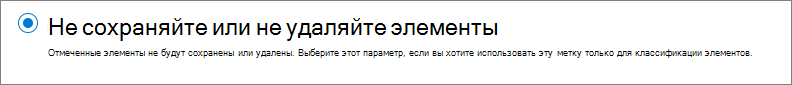
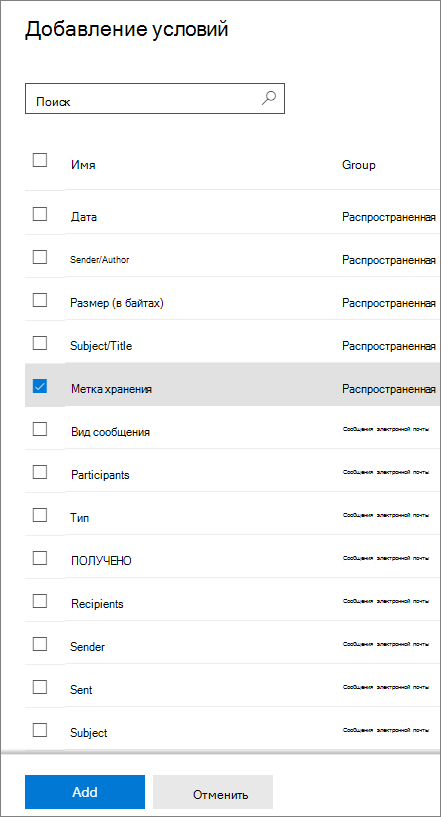

# Сведения о политиках и метках хранения

>*[Руководство по лицензированию Microsoft 365 для обеспечения безопасности и соответствия требованиям](https://aka.ms/ComplianceSD).*

Для большинства организаций объем и сложность их данных ежедневно увеличивается - электронная почта, документы, мгновенные сообщения и многое другое. Эффективное управление или управление этой информацией важно, потому что вам необходимо:
  
- **Активно соблюдайте отраслевые правила и внутренние политики** , которые требуют, чтобы вы сохраняли контент в течение минимального периода времени, например, закон Сарбейнса-Оксли может требовать от вас сохранения определенных типов контента в течение семи лет. 

- **Снизить риск на случай судебного разбирательства или нарушения безопасности** путем окончательного удаления старого содержимого, которое вы больше не обязаны хранить. 
    
- **Способствовать динамичности организации и эффективному обмену знаниями в ней** , обеспечив актуальность и релевантность данных, с которыми работают пользователи. 
    
Настроенные параметры хранения помогут вам добиться всех этих целей. Как правило, управление контентом требует двух действий:
  
- **Хранение** содержимого таким образом, чтобы его нельзя было удалить без возможности восстановления до окончания периода хранения. 
    
- **Удаление** содержимого без возможности восстановления в конце периода хранения. 
    

Можно настроить параметры хранения с использованием этих двух действий для получения следующих результатов.

- Только хранение. Контент хранится в течение неопределенного или заданного срока.
- Только удаление. Контент удаляется по истечении заданного срока.
- Хранить, затем удалить. Контент хранится в течение заданного срока, по истечении которого удаляется.

Эти параметры хранения применяются к имеющемуся контенту, что позволяет вам экономить ресурсы, необходимые для создания и настройки дополнительного хранилища в тех случаях, когда хранение контента требуется для соблюдения требований. Кроме того, не требуется внедрять настраиваемые процессы копирования и синхронизации этих данных.

## Как параметры хранения применяются к имеющемуся контенту

Если контенту назначены параметры хранения, он остается в исходном расположении. Пользователи могут, как и раньше, продолжать работать со своими документами и почтой. Но если они изменят или удалят содержимое, включенное в политику хранения, копия этого содержимого будет автоматически сохранена.
  
- Для сайтов SharePoint и OneDrive: копия хранится в **архивной** библиотеке.

- Для почтовых ящиков Exchange: копия хранится в папке **Восстанавливаемые элементы**. 

- Для сообщений Teams и Yammer: копия хранится в скрытой папке **SubstrateHolds** , вложенной в папку **Восстанавливаемые элементы** Exchange.

> [!NOTE]
> Архивная библиотека использует хранилище, которое не исключается из расчета расхода квоты хранилища на сайте. Возможно, вам придется увеличить объем хранилища при использовании параметров хранения для групп SharePoint и Microsoft 365.
> 
Эти защищенные расположения и хранимый в них контент большинству пользователей не видны. Как правило, им даже не требуется знать, что к их контенту применяются параметры хранения.

Для получения более подробной информации о том, как параметры хранения работают для различных видов рабочей среды, см. следующие статьи:

- [Хранение контента SharePoint и OneDrive](retention-policies-sharepoint.md)
- [Хранение контента Microsoft Teams](retention-policies-teams.md)
- [ Хранение контента Yammer](retention-policies-yammer.md)
- [Хранение контента Exchange](retention-policies-exchange.md)

## Политики и метки хранения

Чтобы назначить контенту свои параметры хранения, можно использовать как политики хранения, так и метки хранения. 

Политики хранения используются для того, чтобы задавать единые параметры хранения для контента на уровне сайта или почтового ящика, а с помощью меток хранения задаются параметры хранения на уровне отдельных элементов (папка, документ, сообщение электронной почты).

Например, если все документы на сайте SharePoint должны храниться 5 лет, более эффективным решением будет настроить политику хранения, чем присваивать метку хранения каждому документу на этом сайте. Однако, если вам одни документы на сайте нужно хранить в течение 5 лет, а другие — в течение 10 лет, с такой задачей политика хранения не справится. Когда нужно указывать параметры хранения на уровне элементов, используйте метки хранения. 

В отличие от политик хранения, параметры хранения, указанные в метках, перемещаются вместе с содержимым при его перемещении в другое расположение в вашем клиенте Microsoft 365. Кроме того, метки хранения имеют перечисленные ниже возможности, которые не поддерживаются политиками хранения. 
 
- Срок хранения можно отсчитывать от момента присваивания метки контенту или от какого-либо события, а также на основе давности контента или даты его последнего изменения.

- Использование [обучаемых классификаторов](classifier-learn-about.md) для выявления контента, которому необходимо присвоить метку.

- Применение метки, заданной по умолчанию, к документам SharePoint.

- Поддержка [проверки перед ликвидацией](disposition-reviews.md) для проверки контента перед его окончательным удалением.

- Пометка контента как [записи](records-management.md#records) с помощью параметров метки, при этом всегда можно получить  [подтверждение ликвидации](disposition.md#disposition-of-records)  при удалении контента по истечении срока его хранения.

### Политики хранения

Политики хранения можно применять к следующим расположениям:
- Электронная почта Exchange
- Сайт SharePoint
- Учетные записи OneDrive
- Группы Microsoft 365
- Skype для бизнеса
- Общедоступные папки Exchange
- Сообщения из каналов Teams
- Чаты Teams
- Сообщения сообщества Yammer
- Личные сообщения в Yammer

Вы можете с высокой эффективностью применять единую политику к нескольким расположениям либо к конкретным расположениям или пользователям.

Элементы наследуют параметры хранения от своего контейнера, указанного в политике хранения. Если после этого они будут перемещены за пределы контейнера при том, что политика хранения настроена на сохранение содержимого, копия элемента будет сохранена в надежном расположении рабочей нагрузки. Однако параметры хранения не перемещаются вместе с контентом в новое расположение. Если это необходимо, вместо политик хранения используйте метки хранения.

### Метки хранения

Используйте метки хранения для различных типов контента, требующих различных параметров хранения. Например:
  
- налоговых деклараций, которые необходимо хранить не меньше определенного срока; 
    
- материалов для прессы, которые требуется безвозвратно удалять по достижении определенной давности; 
    
- исследований деятельности конкурентов, которые требуется хранить в течение определенного срока, а затем окончательно удалять; 
    
- рабочих виз, которые требуется отмечать как записи, чтобы их невозможно было изменить или удалить. 
    
Во всех этих случаях с помощью меток можно применять параметры хранения, управляя хранением на уровне элементов (документов и сообщений электронной почты).
  
С помощью меток хранения вы можете:
  
- **Предоставить сотрудникам своей организации возможность вручную присваивать метки** контенту Outlook и Outlook в Интернете, OneDrive, SharePoint и группах Microsoft 365. Пользователи часто знают лучше других, с контентом какого типа они работают, и поэтому могут классифицировать его и применять соответствующие параметры хранения. 
    
- **Обеспечить автоматическое применение меток хранения к контенту** , если он соответствует определенным условиям, например если он содержит: 
    - конфиденциальную информацию определенных типов;
    - определенные ключевые слова, соответствующие созданному запросу.
    - совпадения с шаблоном для обучаемого классификатора.

- **Отсчитывать срок хранения от момента присвоения метки контенту** для документов на сайтах SharePoint и в учетных записях OneDrive, а также для сообщений электронной почты, за исключением элементов календаря. Если применить к элементу календаря метку хранения с этим параметром, срок хранения будет отсчитываться с момента его отправки.

- **Отсчитывать срок хранения от какого-либо события** , например ухода сотрудника из организации или окончания срока действия договора.

- **Применить стандартную метку хранения к библиотеке документов, папке или набору документов** в SharePoint, чтобы все документы, хранящиеся в этом расположении, наследовали эту метку.

Кроме того, метки хранения поддерживают [управления записями](records-management.md) для электронных сообщений и документов в приложениях и службах Microsoft 365. Метки хранения можно использовать для пометки элементок как записи. В этом случае метка накладывает дополнительные ограничения на содержимое в Microsoft 365, необходимые для соблюдения нормативных требований. Дополнительные сведения см. в разделе [Сравнение ограничений для разрешенных и запрещенных действий](records-management.md#compare-restrictions-for-what-actions-are-allowed-or-blocked).

Метки хранения, в отличие от [меток конфиденциальности](sensitivity-labels.md), не сохраняются, если контент перемещается за пределы Microsoft 365.

Количество меток хранения, поддерживаемых клиентом, не ограничено. Тем не менее 10 000 — это максимальное количество политик, которые поддерживаются клиентом, включая политики, которые применяют метки (политики меток хранения и автоматического применения хранения), а также политики хранения.

#### Классификация контента без применения действий

Хотя главная цель применения меток хранения заключается в хранении или удалении контента, вы можете использовать метки хранения и не предусматривая никаких действий, связанных или не связанных с хранением. В этом случае метка хранения может служить просто текстовой подписью, не влекущей никаких действий.
  
Например, вы можете создать и применить метку хранения с именем "Просмотреть позже", не назначив никаких действий, а затем использовать эту метку для поиска контента.
  

#### Использование метки хранения в качестве условия в политике защиты от потери данных

Метку хранения можно использовать в качестве условия в политике защиты от потери данных (DLP) для документов в SharePoint. Например, настроить политику защиты от потери данных, чтобы запретить предоставление доступа к документам за пределами организации, если им уже присвоена определенная метка хранения.

Подробнее см. в разделе [Использование метки хранения в качестве условия в политике защиты от потери данных](data-loss-prevention-policies.md#using-a-retention-label-as-a-condition-in-a-dlp-policy).

#### Метки хранения и применяющие их политики

Метки хранения — это независимые кирпичики для многократного использования. Основное назначение политики меток хранения состоит в группировке набора меток хранения и указании расположений, где эти метки должны отображаться. После этого администраторы и пользователи могут применять эти метки к контенту в указанных расположениях.
  

  
При публикации меток хранения они включаются в политику меток хранения, благодаря которой администраторы и пользователи могут выбирать подходящие им варианты.

- Одну и ту же метку хранения можно включить в несколько политик меток хранения.

- Политики меток хранения задают расположения для публикации меток хранения.

- Одно и то же расположение можно включить в несколько политик меток хранения.

Помимо политик меток хранения можно создать одну или несколько политик автоматического действия, каждая из которых будет применять одну метку хранения. При использовании такой политики метка хранения автоматически применяется при выполнении условий, указанных в политике. 

#### Политики и расположения меток хранения

Метки хранения различных типов можно публиковать в разных расположениях, зависящих от назначения метки хранения.
  
| Если метка хранения... | то политика меток хранения может быть применена к: |
|:-----|:-----|
|опубликована для администраторов и пользователей    |Exchange, SharePoint, OneDrive, группам Microsoft 365    |
|применена автоматически исходя из типов конфиденциальной информации или на основе обучаемых классификаторов    |Exchange (только ко всем почтовым ящикам), SharePoint, OneDrive    |
|Автоматически применяемая по запросу    |Exchange, SharePoint, OneDrive, группы Microsoft 365    |
   
В Exchange метки хранения присваиваются автоматически только недавно отправленным сообщениям (данным в движении), а не ко всем элементам, находящимся в почтовом ящике (неактивным данным). Кроме того, метки хранения для конфиденциальной информации того или иного типа и обучаемых классификаторов могут автоматически присваиваться только всем почтовым ящикам одновременно: выбирать определенные почтовые ящики нельзя.
  
В общедоступных папках Exchange, сообщениях Skype, Teams и Yammer метки хранения не поддерживаются. Для хранения и удаления контента из этих расположений используйте вместо меток политики хранения.

#### Метки хранения присваиваются по одной

К сообщению электронной почты или документу единовременно может быть применена только одна метка хранения:
  
- метки хранения, назначенные пользователями или администраторами вручную, можно удалять и менять;
    
- если метка применена к контенту автоматически, ее можно заменить опубликованной меткой хранения;
    
- если к контенту применена опубликованная метка хранения, ее не может заменить метка, предусматривающая автоматическое применение.
    
- Если имеется ряд правил, назначающих автоматически применяемую метку, а контент соответствует условиям нескольких из них, назначается метка хранения самого старого правила (по дате создания).
    
Чтобы понять, как и зачем применяется та или иная метка хранения, нужно понять различия между явным и неявным назначением метки:

- метки хранения, применяемые посредством политики меток, присваиваются явным образом;
- метки хранения, применяемые посредством политики автоматического применения меток, присваиваются неявным образом.

Метка хранения назначенная явно имеет приоритет над неявно назначенной. Дополнительные сведения см. в разделе [Принципы хранения и приоритеты](retention.md#the-principles-of-retention-or-what-takes-precedence) на этой странице;

В SharePoint метки хранения также могут неявно назначаться при настройке стандартной метки для всего контента в библиотеке SharePoint, папке или наборе документов. В этом сценарии автоматически применяемая метка имеет приоритет над стандартной меткой, но чтобы полностью понять результаты использования стандартной метки, ознакомьтесь со сведениями в разделе [Применение стандартной метки хранения ко всему контенту в библиотеке SharePoint, папке или набору документов](create-apply-retention-labels.md#applying-a-default-retention-label-to-all-content-in-a-sharepoint-library-folder-or-document-set). 

#### Отслеживание меток хранения

В Центре соответствия требованиям Microsoft 365 в разделе **Классификация данных** > **Обзор** можно отслеживать использование меток хранения в клиенте и определять, где расположены элементы с метками. Дополнительные сведения, в том числе важные предварительные требования, см. в статье [Знайте свои данные — обзор классификации данных](data-classification-overview.md).

Затем можно детализировать сведения с помощью [обозревателя содержимого](data-classification-content-explorer.md) и [обозревателя действий](data-classification-activity-explorer.md).

> [!TIP]
>Рекомендуется использовать аналитику некоторых других средств классификации данных, например обучаемых классификаторов и типов конфиденциальной информации, чтобы определить, какое содержимое нужно сохранить либо удалить или каким содержимым следует управлять как записями.

Центр безопасности и соответствия требованиям Office 365 содержит аналогичные общие сведения о метках хранения в разделе **Управление сведениями** > **Панель мониторинга** , а также более подробные сведения в разделе **Управление сведениями** > **Обозреватель действий с метками**. Дополнительные сведения об отслеживании меток хранения в старом центре администрирования см. в следующей документации:
- [Просмотр отчетов об управлении данными](view-the-data-governance-reports.md)
- [Просмотр использования меток с помощью аналитики меток](label-analytics.md)
- [Просмотр действий с метками для документов](view-label-activity-for-documents.md)

#### Использование средства "Поиск контента" для поиска содержимого с определенной меткой хранения

После того как метки хранения будут применены к содержимому (либо пользователями, либо автоматически), вы можете использовать средство "Поиск контента", чтобы найти все элементы с определенной меткой хранения.

При создании запроса на поиск контента выберите условие **Метка хранения** , а затем полностью или частично (с использованием подстановочного знака) введите имя метки хранения. Дополнительные сведения см. в статье [Запросы по ключевым словам и условия для средства "Поиск контента"](keyword-queries-and-search-conditions.md).
  

## Сравнение возможностей политик хранения и меток хранения

Таблица ниже поможет вам определить, что следует использовать: политику хранения или метку хранения, исходя из имеющихся возможностей обоих вариантов.

|Возможность|Политика хранения |Метка хранения|
|:-----|:-----|:-----|:-----|
|Параметры хранения, предполагающие хранение с последующим удалением, только хранение или только удаление |Да |Да |
|Поддерживаемые виды рабочей среды:  – Exchange  – SharePoint  – OneDrive  – Группы Microsoft 365  – Skype для бизнеса  – Teams – Yammer|  Да   Да   Да   Да   Да   Да   Да |   Да, за исключением общих папок   Да   Да   Да   Нет   Нет   Нет |
|Режим хранения назначается автоматически | Да | Да |
|Хранение, применяемое на основе условий   - типы конфиденциальных данных, запросы по ключевым словам KQL, обучаемые классификаторы| Нет | Да |
|Режим хранения назначается вручную | Нет | Да |
|Наличие пользовательского интерфейса для пользователей | Нет | Да |
|Сохраняется при перемещении контента | Нет | Да, в рамках вашего клиента Microsoft 365 |
|Объявление элемента записью| Нет | Да |
|Начало периода хранения:   — При создании или последнем изменении элементов  — При применении метки или на основе события |  Да  Нет |  Да   Да |
|Проверка перед ликвидацией | Нет| Да |
|Подтверждение ликвидации до 7 лет | Нет |Да, когда элемент объявлен записью|
|Аудит действий администратора| Да | Да|
|Выявление элементов, подлежащих хранению:   – Поиск контента   – Страница классификации данных, обозреватель контента, обозреватель действий |   Нет   Нет |   Да   Да|

Обратите внимание: как политики хранения, так и метки хранения можно использовать в качестве дополнительных методов хранения. Например:

1. Можно создать и настроить политику хранения, которая будет автоматически удалять контент через пять лет после последнего изменения, и применить ее ко всем учетным записям OneDrive.

2. Можно создать и настроить метку хранения, которая будет хранить контент неопределенно долго, и добавить ее в политику меток, которую вы опубликуете во всех учетных записях OneDrive. Объясните пользователям, как вручную применять эту метку к определенным документам, которые нужно исключить из процедуры автоматического удаления документов, не изменявшихся в течение пяти лет.

Подробнее о совместном действии политик и меток хранения, а также о том, как определить итоговый результат их действия, см. в следующем разделе, посвященном принципам и приоритетам хранения.

## Принципы и приоритеты хранения

Возможно или даже вероятно, что к контенту могут быть применены несколько политик и меток хранения, для каждой из которых определено действие (хранить, удалить или хранить, а затем удалить) и срок хранения контента. Как определяется приоритет? 

В целом правильно будет считать, что хранение всегда предпочтительнее удаления, а из вариантов хранения наиболее предпочтителен вариант с самым продолжительным сроком хранения. 

Однако необходимо учитывать еще несколько факторов, поэтому для получения итогового результата воспользуйтесь следующей схемой, на которой каждый уровень действует как переключатель при движении сверху вниз. Если результат получен на первом уровне, нет необходимости переходить на второй, и так далее. Только если результат нельзя определить по правилам уровня, требуется спуститься на следующий уровень, чтобы определить, какие параметры хранения имеют более высокий приоритет.

  
Объяснение действия каждого из четырех уровней:
  
1. **Хранение имеет преимущество над удалением.** Предположим, что одна политика хранения настроена на удаление электронной почты Exchange через три года, а другая политика хранения настроена на сохранение электронной почты Exchange в течение пяти лет, а затем ее удаление. Любое содержимое давностью три года и более будет удалено и скрыто от пользователей, но по-прежнему будет храниться в папке "Элементы с возможностью восстановления", пока ему не исполнится пять лет, после чего это содержимое окончательно удаляется. 
2. **Преимущество имеет самый длительный срок хранения.** Если на контент распространяется действие нескольких параметров, диктующих его хранение в течение различных сроков, то контент будет храниться до конца самого длительного из этих сроков.
    
3. **Явное включение имеет преимущество над неявным.** То есть: 
    
    1. Если пользователь вручную присвоил метку хранения такому элементу, как сообщение электронной почты Exchange или документ OneDrive, эта метка хранения имеет приоритет как над политикой хранения, назначенной на уровне сайта или почтового ящика, так и над меткой хранения по умолчанию, назначенной библиотеке документов. Например, если явно назначенная метка хранения настроена на хранение контента в течение 10 лет, а политика хранения, назначенная сайту, настроена на хранение контента только в течение пяти лет, то метка хранения имеет приоритет.
    
    2. Если политика хранения включает определенное расположение, например почтовый ящик определенного пользователя или учетную запись OneDrive, эта политика хранения имеет приоритет над другой политикой хранения, которая применяется ко всем почтовым ящикам пользователей или учетным записям OneDrive, но не включает почтовый ящик этого пользователя.
    
4. **Преимущество имеет самый короткий срок удаления.** Точно так же, если на контент распространяется несколько параметров хранения, удаляющих контент без хранения, этот контент будет удален в конце кратчайшего срока хранения. 

Наконец, политика или метка хранения не могут окончательно удалить какой-либо контент, находящийся в режиме ожидания для обнаружения электронных данных. Когда удержание снимается, контент снова становится доступным для процесса очистки в защищенных расположениях для данного вида рабочей среды.

## Использование инструмента блокировки для сохранения в целях ограничения изменений политик

Некоторым организациям может потребоваться соблюдать правила, определенные регулирующими органами, такими как Правило 17a-4 Комиссии по ценным бумагам и биржам (SEC), которое требует, чтобы после включения политики хранения ее нельзя было отключить или сделать менее ограничительной. 

Блокировка для сохранения гарантирует, что ваша организация может соответствовать таким нормативным требованиям, поскольку она блокирует политику хранения или метки хранения, чтобы никто, — включая администратора, — не мог ее отключить, удалить или сделать ее менее строгой.
  
Блокировка для сохранения применяется после создания политики хранения или политики меток хранения. Дополнительные сведения и инструкции см. в статье [Использование инструмента блокировки для сохранения в целях ограничения изменений политик хранения и политик меток хранения](retention-preservation-lock.md).

## Высвобождение политики хранения

Если к политикам хранения не применена блокировка для сохранения, их в любое время можно удалить, при этом будут выключены ранее применявшиеся параметры хранения. Кроме того, можно сохранить политику, но изменить состояние ее расположения на "выкл.".
 
При выполнении любого из этих действий хранящееся в архивной библиотеке содержимое SharePoint или OneDrive не удаляется сразу и безвозвратно. Чтобы предотвратить случайную потерю данных, теперь существует 30-дневный период отсрочки, в течение которого для этой политики не истекает срок действия содержимого в архивной библиотеке, чтобы при необходимости можно было восстановить содержимое из нее. Кроме того, вы не можете удалить это содержимое вручную в течение периода отсрочки.

Вы можете вернуть состояние расположения к "вкл." в течение периода отсрочки, и тогда никакое содержимое, относящееся к этой политике, не будет удалено.

Этот 30-дневный период отсрочки в SharePoint и OneDrive соответствует 30-дневному удержанию с задержкой в Exchange. Дополнительные сведения см. в разделе [Управление почтовыми ящиками при удержании с задержкой](identify-a-hold-on-an-exchange-online-mailbox.md#managing-mailboxes-on-delay-hold).

## Аудит конфигурации хранения

Если [включен аудит](turn-audit-log-search-on-or-off.md), действия администратора в отношении политик и меток хранения сохраняются в журнале аудита. Например, событие аудита создается при создании, настройке или удалении политики или метки хранения. Полный список см. в статье [Действия, связанные с политиками и метками хранения](search-the-audit-log-in-security-and-compliance.md#retention-policy-and-retention-label-activities).

## Командлеты PowerShell для политик и меток хранения

Для использования командлетов хранения нужно сначала [установить подключение к PowerShell Центра безопасности и соответствия требованиям Office 365](https://docs.microsoft.com/powershell/exchange/connect-to-scc-powershell). Затем воспользуйтесь одним из следующих командлетов:

- [Get-ComplianceTag](https://docs.microsoft.com/powershell/module/exchange/get-compliancetag)

- [New-ComplianceTag](https://docs.microsoft.com/powershell/module/exchange/new-compliancetag)

- [Remove-ComplianceTag](https://docs.microsoft.com/powershell/module/exchange/remove-compliancetag)

- [Set-ComplianceTag](https://docs.microsoft.com/powershell/module/exchange/set-compliancetag)

- [Enable-ComplianceTagStorage](https://docs.microsoft.com/powershell/module/exchange/enable-compliancetagstorage)

- [Get-ComplianceTagStorage](https://docs.microsoft.com/powershell/module/exchange/get-compliancetagstorage)

- [Get-RetentionCompliancePolicy](https://docs.microsoft.com/powershell/module/exchange/get-retentioncompliancepolicy)

- [New-RetentionCompliancePolicy](https://docs.microsoft.com/powershell/module/exchange/new-retentioncompliancepolicy)

- [Remove-RetentionCompliancePolicy](https://docs.microsoft.com/powershell/module/exchange/remove-retentioncompliancepolicy)

- [Set-RetentionCompliancePolicy](https://docs.microsoft.com/powershell/module/exchange/set-retentioncompliancepolicy)

- [Get-RetentionComplianceRule](https://docs.microsoft.com/powershell/module/exchange/get-retentioncompliancerule)

- [New-RetentionComplianceRule](https://docs.microsoft.com/powershell/module/exchange/new-retentioncompliancerule)

- [Remove-RetentionComplianceRule](https://docs.microsoft.com/powershell/module/exchange/remove-retentioncompliancerule)

- [Set-RetentionComplianceRule](https://docs.microsoft.com/powershell/module/exchange/set-retentioncompliancerule)

## В каких ситуациях использовать политики и метки хранения или удержание данных, созданных с помощью обращения обнаружения электронных данных

Хотя и параметры хранения, и [удержания данных, созданные с помощью обращения обнаружения электронных данных](create-ediscovery-holds.md), предотвращают полное удаление информации, они созданы для разных вариантов развития событий. Чтобы лучше разобраться в различиях и выбрать, что использовать, используйте следующие инструкции:

- Параметры хранения, указанные в политиках и метках хранения, предназначены для долговременной стратегии управления информацией, чтобы сохранить или удалить данные согласно политике соответствия требованиям. Область распространения обычно является широкой, а основная внимание уделяется расположению и содержимому, а не отдельными пользователями. Время начала и окончания срока хранения можно настраивать, изменяя возможность автоматического удаления содержимого без дополнительного вмешательства администратора.

- Удержания данных, созданных с помощью обращения обнаружения электронных данных (Core eDiscovery или Advanced eDiscovery), разработаны для хранения данных в течение ограниченного периода времени. Эта область зависит от того, какими данными владеют определенные пользователи. Время начала и окончания периода хранения не настраивается, но зависит от действий администратора, без возможности автоматического удаления содержимого по окончании периода удержания.

Сводка для сравнения хранения с удержанием данных, созданных с помощью обращения обнаружения электронных данных:

|Фактор|Хранение |Удержание данных, созданных с помощью обращения обнаружения электронных данных|
|:-----|:-----|:-----|:-----|
|Бизнес-потребность: |Соответствие требованиям |Юридические аспекты |
|Временные рамки: |Долгосрочные |Краткосрочные |
|Фокус: |Широкий контент, основанный на содержимом |Подбирается под определенного пользователя: |
|Дата начала и окончания настраиваемая: |Да |Нет |
|Удаление содержимого: |Да (опционально) |Нет |
|Административные накладные расходы: |Низкие |Высокие |

Если к содержимому применяются и параметры хранения, и удержание данных, созданных с помощью обращения обнаружения электронных данных, сохранение содержимого для удержания обнаружения электронных данных всегда имеет приоритет. Таким образом, [принципы хранения](#the-principles-of-retention-or-what-takes-precedence) расширяются до удержания обнаружения электронных данных, так как они сохраняют данные до тех пор, пока администратор не отменит удержание вручную. Тем не менее, несмотря на эти приоритеты, не используйте удержания данных, созданных с помощью обращения обнаружения электронных данных, для долговременного управления информацией. Если вы беспокоитесь об автоматическом удалении данных, можно настроить параметры хранения так, чтобы постоянное хранение элементов было ограничено, или использовать [проверку перед ликвидацией](disposition.md#disposition-reviews) с метками хранения.

Если вы используете устаревшую версию средств обнаружения электронных данных для хранения информации, см. следующие ссылки:

- Exchange: 
    - [Хранение на месте и хранение для судебного разбирательства](https://go.microsoft.com/fwlink/?linkid=846124)
    - [Как определить тип удержания, примененного для почтового ящика Exchange Online](https://docs.microsoft.com/microsoft-365/compliance/identify-a-hold-on-an-exchange-online-mailbox)

- SharePoint и OneDrive: 
    - [Добавление контента к делу и перевод источников в состояние удержания в центре обнаружения электронных данных](https://docs.microsoft.com/SharePoint/governance/add-content-to-a-case-and-place-sources-on-hold-in-the-ediscovery-center)

- [Прекращение поддержки устаревших средств обнаружения электронных данных](legacy-ediscovery-retirement.md)

## Использование политик и меток хранения вместо старых функций

Если вам нужен эффективный способ хранения или удаления контента в Microsoft 365 для целей управления информацией, рекомендуем использовать политики и метки хранения вместо приведенных ниже старых функций.

Если в настоящее время вы используете эти старые функции, то они будут продолжать работать наряду с политиками и метками хранения. Однако мы рекомендуем в дальнейшем использовать политики хранения и метки хранения. Они предоставляют вам единый механизм для централизованного управления хранением и удалением контента в Microsoft 365.

**Старые функции Exchange Online:**

- [Теги хранения и политики хранения](https://go.microsoft.com/fwlink/?linkid=846125), также известные как [управление записями обмена сообщениями](https://go.microsoft.com/fwlink/?linkid=846126) (только удаление)

**Старые функции из SharePoint и OneDrive:**

- [Политики удаления документов](https://support.office.com/article/Create-a-document-deletion-policy-in-SharePoint-Server-2016-4fe26e19-4849-4eb9-a044-840ab47458ff) (только удаление)
    
- [Настройка управления записями на месте](https://support.office.com/article/7707a878-780c-4be6-9cb0-9718ecde050a) (только хранение) 
    
- [Используйте политики для закрытия и удаления сайта](https://support.microsoft.com/ru-RU/office/use-policies-for-site-closure-and-deletion-a8280d82-27fd-48c5-9adf-8a5431208ba5) (только удаление) 
    
- [Политики управления информацией](intro-to-info-mgmt-policies.md) (только удаление)
     
Если вы настроили сайты SharePoint для политик типов контента или политик управления информацией для сохранения контента для списка или библиотеки, эти политики игнорируются, пока действует политика хранения. 

## Статьи по теме

- [Ограничения SharePoint Online](https://docs.microsoft.com/office365/servicedescriptions/sharepoint-online-service-description/sharepoint-online-limits)
- [Ограничения и спецификации для Microsoft Teams](https://docs.microsoft.com/microsoftteams/limits-specifications-teams) 
- [Вспомогательные ресурсы для соблюдения нормативных требований к управлению данными и записями](retention-regulatory-requirements.md)

## Дальнейшие действия

Если вы готовы создать политики хранения, см. статью [Создание и настройка политик хранения](create-retention-policies.md).

Для создания и применения меток хранения см. следующие статьи:
- [Создание меток хранения и их применение в приложениях](create-apply-retention-labels.md)
- [Автоматическое применение метки хранения к контенту](apply-retention-labels-automatically.md)

