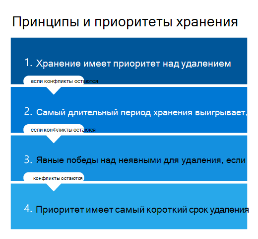

# Сведения о политиках и метках храненияLearn about retention policies and retention labels

>*[Руководство по лицензированию Microsoft 365 для обеспечения безопасности и соответствия требованиям](/office365/servicedescriptions/microsoft-365-service-descriptions/microsoft-365-tenantlevel-services-licensing-guidance/microsoft-365-security-compliance-licensing-guidance).**[Microsoft 365 licensing guidance for security & compliance](/office365/servicedescriptions/microsoft-365-service-descriptions/microsoft-365-tenantlevel-services-licensing-guidance/microsoft-365-security-compliance-licensing-guidance).*

> [!NOTE]
> Если вы получаете сообщения о политиках хранения в ваших приложениях, обратитесь в ИТ-отдел за сведениями об их настройке.If you're seeing seeing messages about retention policies in your apps, contact your IT department for information about how they have been configured for you. Если это сообщения чата или канала Teams, см. статью [Сообщения Teams о политиках хранения](https://support.microsoft.com/office/teams-messages-about-retention-policies-c151fa2f-1558-4cf9-8e51-854e925b483b).If these messages are for Teams chat or channel messages, see [Teams messages about retention policies](https://support.microsoft.com/office/teams-messages-about-retention-policies-c151fa2f-1558-4cf9-8e51-854e925b483b).
>
> Информация на этой странице предназначена для ИТ-администраторов, которые могут создавать политики хранения и метки хранения в целях обеспечения соответствия требованиям.The information on this page is for IT administrators who can create retention policies and retention labels for compliance reasons.

Для большинства организаций объем и сложность их данных ежедневно увеличивается - электронная почта, документы, мгновенные сообщения и многое другое. Эффективное управление или управление этой информацией важно, потому что вам необходимо:For most organizations, the volume and complexity of their data is increasing daily—email, documents, instant messages, and more. Effectively managing or governing this information is important because you need to:

- **Активно соблюдайте отраслевые правила и внутренние политики**, которые требуют, чтобы вы сохраняли контент в течение минимального периода времени, например, закон Сарбейнса-Оксли может требовать от вас сохранения определенных типов контента в течение семи лет.**Comply proactively with industry regulations and internal policies** that require you to retain content for a minimum period of time—for example, the Sarbanes-Oxley Act might require you to retain certain types of content for seven years.

- **Снизить риск на случай судебного разбирательства или нарушения безопасности** путем окончательного удаления старого содержимого, которое вы больше не обязаны хранить.**Reduce your risk in the event of litigation or a security breach** by permanently deleting old content that you're no longer required to keep.

- **Способствовать динамичности организации и эффективному обмену знаниями в ней**, обеспечив актуальность и релевантность данных, с которыми работают пользователи.**Help your organization to share knowledge effectively and be more agile** by ensuring that your users work only with content that's current and relevant to them.

Настроенные параметры хранения помогут вам добиться всех этих целей.Retention settings that you configure can help you achieve these goals. Как правило, управление контентом требует двух действий:Managing content commonly requires two actions:

| ДействиеAction| НазначениеPurpose |
|:-----|:-----|
|Хранение содержимогоRetain content | Окончательное удаление запрещено; данные остаются доступными для электронного обнаруженияPrevent permanent deletion and remain available for eDiscovery |
|Удаление содержимогоDelete content | Окончательное удаление содержимого из организацииPermanently delete content from your organization|

Можно настроить параметры хранения с использованием этих двух действий для получения следующих результатов.With these two retention actions, you can configure retention settings for the following outcomes:

- Только хранение. Контент хранится в течение неопределенного или заданного срока.Retain-only: Retain content forever or for a specified period of time.
- Только удаление. Контент удаляется по истечении заданного срока.Delete-only: Permanently delete content after a specified period of time.
- Хранить, затем удалить. Контент хранится в течение заданного срока, по истечении которого удаляется.Retain and then delete: Retain content for a specified period of time and then permanently delete it.

Эти параметры хранения применяются к имеющемуся контенту, что позволяет вам экономить ресурсы, необходимые для создания и настройки дополнительного хранилища в тех случаях, когда хранение контента требуется для соблюдения требований.These retention settings work with content in place that saves you the additional overheads of creating and configuring additional storage when you need to retain content for compliance reasons. Кроме того, не требуется внедрять настраиваемые процессы копирования и синхронизации этих данных.In addition, you don't need to implement customized processes to copy and synchronize this data.

В следующих разделах вы узнаете, как работают политики хранения и метки хранения, когда их использовать и как они дополняют друг друга.Use the following sections to learn more about how retention policies and retention labels work, when to use them, and how they supplement each other. Но если вы готовы начать работу и развернуть параметры хранения для некоторых распространенных сценариев, см. статью [Начало работы с политиками хранения и метками хранения](get-started-with-retention.md).But if you're ready to get started and deploy retention settings for some common scenarios, see [Get started with retention policies and retention labels](get-started-with-retention.md).

## Как параметры хранения применяются к имеющемуся контентуHow retention settings work with content in place

Если контенту назначены параметры хранения, он остается в исходном расположении.When content has retention settings assigned to it, that content remains in its original location. Пользователи могут, как и раньше, продолжать работать со своими документами и почтой.People can continue to work with their documents or mail as if nothing's changed. Но если они изменят или удалят содержимое, включенное в политику хранения, копия этого содержимого будет автоматически сохранена.But if they edit or delete content that's included in the retention policy, a copy of the content is automatically retained.
  
- Для сайтов SharePoint и OneDrive: копия хранится в **архивной** библиотеке.For SharePoint and OneDrive sites: The copy is retained in the **Preservation Hold** library.

- Для почтовых ящиков Exchange: копия хранится в папке **Восстанавливаемые элементы**.For Exchange mailboxes: The copy is retained in the **Recoverable Items** folder. 

- Для сообщений Teams и Yammer: копия хранится в скрытой папке **SubstrateHolds**, вложенной в папку **Восстанавливаемые элементы** Exchange.For Teams and Yammer messages: The copy is retained in a hidden folder named **SubstrateHolds** as a subfolder in the Exchange **Recoverable Items** folder.

> [!NOTE]
> Архивная библиотека использует хранилище, которое не исключается из расчета расхода квоты хранилища на сайте.The Preservation Hold library consumes storage that isn't exempt from a site's storage quota. Возможно, вам придется увеличить объем хранилища при использовании параметров хранения для групп SharePoint и Microsoft 365.You might need to increase your storage when you use retention settings for SharePoint and Microsoft 365 groups.
> 
Эти защищенные расположения и хранимый в них контент большинству пользователей не видны.These secure locations and the retained content are not visible to most people. Как правило, им даже не требуется знать, что к их контенту применяются параметры хранения.In most cases, people do not even need to know that their content is subject to retention settings.

Для получения более подробной информации о том, как параметры хранения работают для различных видов рабочей среды, см. следующие статьи:For more detailed information about how retention settings work for different workloads, see the following articles:

- [Хранение контента SharePoint и OneDriveLearn about retention for SharePoint and OneDrive](retention-policies-sharepoint.md)
- [Хранение контента Microsoft TeamsLearn about retention for Microsoft Teams](retention-policies-teams.md)
- [ Хранение контента YammerLearn about retention for Yammer](retention-policies-yammer.md)
- [Хранение контента ExchangeLearn about retention for Exchange](retention-policies-exchange.md)

## Политики и метки храненияRetention policies and retention labels

Чтобы назначить контенту свои параметры хранения, воспользуйтесь **политиками хранения** и **метками хранения с политиками меток**.To assign your retention settings to content, use **retention policies** and **retention labels with label policies**. Эти способы можно использовать как отдельно, так и в сочетании.You can use just one of these methods, or combine them.

Политики хранения используются для того, чтобы задавать единые параметры хранения для контента на уровне сайта или почтового ящика, а с помощью меток хранения задаются параметры хранения на уровне отдельных элементов (папка, документ, сообщение электронной почты).Use a retention policy to assign the same retention settings for content at a site or mailbox level, and use a retention label to assign retention settings at an item level (folder, document, email).

Например, если все документы на сайте SharePoint должны храниться 5 лет, более эффективным решением будет настроить политику хранения, чем присваивать метку хранения каждому документу на этом сайте.For example, if all documents in a SharePoint site should be retained for 5 years, it's more efficient to do this with a retention policy than apply the same retention label to all documents in that site. Однако, если вам одни документы на сайте нужно хранить в течение 5 лет, а другие — в течение 10 лет, с такой задачей политика хранения не справится.However, if some documents in that site should be retained for 5 years and others retained for 10 years, a retention policy wouldn't be able to do this. Когда нужно указывать параметры хранения на уровне элементов, используйте метки хранения.When you need to specify retention settings at the item level, use retention labels. 

В отличие от политик хранения, параметры хранения, указанные в метках, перемещаются вместе с содержимым при его перемещении в другое расположение в вашем клиенте Microsoft 365.Unlike retention policies, retention settings from retention labels travel with the content if it’s moved to a different location within your Microsoft 365 tenant. Кроме того, метки хранения имеют перечисленные ниже возможности, которые не поддерживаются политиками хранения.In addition, retention labels have the following capabilities that retention policies don't support: 
 
- Срок хранения можно отсчитывать от момента присваивания метки контенту или от какого-либо события, а также на основе давности контента или даты его последнего изменения.Options to start the retention period from when the content was labeled or based on an event, in addition to the age of the content or when it was last modified.

- Использование [обучаемых классификаторов](classifier-learn-about.md) для выявления контента, которому необходимо присвоить метку.Use [trainable classifiers](classifier-learn-about.md) to identify content to label.

- Применение метки, заданной по умолчанию, к документам SharePoint.Apply a default label for SharePoint documents.

- Поддержка [проверки перед ликвидацией](./disposition.md) для проверки контента перед его окончательным удалением.Support [disposition review](./disposition.md) to review the content before it's permanently deleted.

- Пометка контента как [записи](records-management.md#records) с помощью параметров метки, при этом всегда можно получить  [подтверждение ликвидации](disposition.md#disposition-of-records)  при удалении контента по истечении срока его хранения.Mark the content as a [record](records-management.md#records) as part of the label settings, and always have [proof of disposition](disposition.md#disposition-of-records) when content is deleted at the end of its retention period.

### Политики храненияRetention policies

Политики хранения можно применять к следующим расположениям:Retention policies can be applied to the following locations:
- Электронная почта ExchangeExchange email
- Сайт SharePointSharePoint site
- Учетные записи OneDriveOneDrive accounts
- Группы Microsoft 365Microsoft 365 Groups
- Skype для бизнесаSkype for Business
- Общедоступные папки ExchangeExchange public folders
- Сообщения из каналов TeamsTeams channel messages
- Чаты TeamsTeams chats
- Сообщения сообщества YammerYammer community messages
- Личные сообщения в YammerYammer private messages

Вы можете с высокой эффективностью применять единую политику к нескольким расположениям либо к конкретным расположениям или пользователям.You can very efficiently apply a single policy to multiple locations, or to specific locations or users.

Для начала периода хранения можно выбрать дату создания содержимого или (эта возможность поддерживается только для файлов, а также расположений в SharePoint, OneDrive и Группах Microsoft 365) его изменения.For the start of the retention period, you can choose when the content was created or, supported only for files and the SharePoint, OneDrive, and Microsoft 365 Groups locations, when the content was last modified.

Элементы наследуют параметры хранения от своего контейнера, указанного в политике хранения.Items inherit the retention settings from their container specified in the retention policy. Если после этого они будут перемещены за пределы контейнера при том, что политика хранения настроена на сохранение содержимого, копия элемента будет сохранена в надежном расположении рабочей нагрузки.If they are then moved outside that container when the policy is configured to retain content, a copy of that item is retained in the workload's secured location. Однако параметры хранения не перемещаются вместе с контентом в новое расположение.However, the retention settings don't travel with the content in its new location. Если это необходимо, вместо политик хранения используйте метки хранения.If that's required, use retention labels instead of retention policies.

### Метки храненияRetention labels

Используйте метки хранения для различных типов контента, требующих различных параметров хранения.Use retention labels for different types of content that require different retention settings. Например:For example:
  
- налоговых деклараций, которые необходимо хранить не меньше определенного срока;Tax forms that need to be retained for a minimum period of time. 
    
- материалов для прессы, которые требуется безвозвратно удалять по достижении определенной давности;Press materials that need to be permanently deleted when they reach a specific age. 
    
- исследований деятельности конкурентов, которые требуется хранить в течение определенного срока, а затем окончательно удалять;Competitive research that needs to be retained for a specific period and then permanently deleted. 
    
- рабочих виз, которые требуется отмечать как записи, чтобы их невозможно было изменить или удалить.Work visas that must be marked as a record so that they can't be edited or deleted. 
    
Во всех этих случаях с помощью меток можно применять параметры хранения, управляя хранением на уровне элементов (документов и сообщений электронной почты).In all these cases, retention labels let you apply retention settings for governance control at the item level (document or email).
  
С помощью меток хранения вы можете:With retention labels, you can:
  
- **Предоставить сотрудникам своей организации возможность вручную присваивать метки** контенту Outlook и Outlook в Интернете, OneDrive, SharePoint и группах Microsoft 365.**Enable people in your organization to apply a retention label manually** to content in Outlook and Outlook on the web, OneDrive, SharePoint, and Microsoft 365 groups. Пользователи часто знают лучше других, с контентом какого типа они работают, и поэтому могут классифицировать его и применять соответствующие параметры хранения.Users often know best what type of content they're working with, so they can classify it and have the appropriate retention settings applied. 
    
- **Обеспечить автоматическое применение меток хранения к контенту**, если он соответствует определенным условиям, например если он содержит:**Apply retention labels to content automatically** if it matches specific conditions, such as when the content contains: 
    - конфиденциальную информацию определенных типов;Specific types of sensitive information.
    - определенные ключевые слова, соответствующие созданному запросу.Specific keywords that match a query you create.
    - совпадения с шаблоном для обучаемого классификатора.Pattern matches for a trainable classifier.

- **Отсчитывать срок хранения от момента присвоения метки контенту** для документов на сайтах SharePoint и в учетных записях OneDrive, а также для сообщений электронной почты, за исключением элементов календаря.**Start the retention period from when the content was labeled** for documents in SharePoint sites and OneDrive accounts, and to email items with the exception of calendar items. Если применить к элементу календаря метку хранения с этим параметром, срок хранения будет отсчитываться с момента его отправки.If you apply a retention label with this configuration to a calendar item, the retention period starts from when it is sent.

- **Отсчитывать срок хранения от какого-либо события**, например ухода сотрудника из организации или окончания срока действия договора.**Start the retention period when an event occurs**, such as employees leave the organization, or contracts expire.

- **Применить стандартную метку хранения к библиотеке документов, папке или набору документов** в SharePoint, чтобы все документы, хранящиеся в этом расположении, наследовали эту метку.**Apply a default retention label to a document library, folder, or document set** in SharePoint, so that all documents that are stored in that location inherit the default retention label.

Кроме того, метки хранения поддерживают [управления записями](records-management.md) для электронных сообщений и документов в приложениях и службах Microsoft 365.Additionally, retention labels support [records management](records-management.md) for email and documents across Microsoft 365 apps and services. Метки хранения можно использовать для пометки элементок как записи.You can use a retention label to mark items as a record. В этом случае метка накладывает дополнительные ограничения на содержимое в Microsoft 365, необходимые для соблюдения нормативных требований.When this happens and the content remains in Microsoft 365, the label places further restrictions on the content that might be needed for regulatory reasons. Дополнительные сведения см. в разделе [Сравнение ограничений для разрешенных и запрещенных действий](records-management.md#compare-restrictions-for-what-actions-are-allowed-or-blocked).For more information, see [Compare restrictions for what actions are allowed or blocked](records-management.md#compare-restrictions-for-what-actions-are-allowed-or-blocked).

Метки хранения, в отличие от [меток конфиденциальности](sensitivity-labels.md), не сохраняются, если контент перемещается за пределы Microsoft 365.Retention labels, unlike [sensitivity labels](sensitivity-labels.md), do not persist if the content is moved outside Microsoft 365.

Количество меток хранения, поддерживаемых клиентом, не ограничено.There is no limit to the number of retention labels that are supported for a tenant. Тем не менее 10 000 — это максимальное количество политик, которые поддерживаются клиентом, включая политики, которые применяют метки (политики меток хранения и автоматического применения хранения), а также политики хранения.However, 10,000 is the maximum number of policies that are supported for a tenant and these include the policies that apply the labels (retention label policies and auto-apply retention policies), as well as retention policies.

#### Классификация контента без применения действийClassifying content without applying any actions

Хотя главная цель применения меток хранения заключается в хранении или удалении контента, вы можете использовать метки хранения и не предусматривая никаких действий, связанных или не связанных с хранением.Although the main purpose of retention labels is to retain or delete content, you can also use retention labels without turning on any retention or other actions. В этом случае метка хранения может служить просто текстовой подписью, не влекущей никаких действий.In this case, you can use a retention label simply as a text label, without enforcing any actions.
  
Например, вы можете создать и применить метку хранения с именем "Просмотреть позже", не назначив никаких действий, а затем использовать эту метку для поиска контента.For example, you can create and apply a retention label named "Review later" with no actions, and then use that label to find that content later.
  

#### Использование метки хранения в качестве условия в политике защиты от потери данныхUsing a retention label as a condition in a DLP policy

Метку хранения можно использовать в качестве условия в политике защиты от потери данных (DLP) для документов в SharePoint.You can specify a retention label as a condition in a data loss prevention (DLP) policy for documents in SharePoint. Например, настроить политику защиты от потери данных, чтобы запретить предоставление доступа к документам за пределами организации, если им уже присвоена определенная метка хранения.For example, configure a DLP policy to prevent documents from being shared outside the organization if they have a specified retention label applied to it.

Подробнее см. в разделе [Использование метки хранения в качестве условия в политике защиты от потери данных](data-loss-prevention-policies.md#using-a-retention-label-as-a-condition-in-a-dlp-policy).For more information, see [Using a retention label as a condition in a DLP policy](data-loss-prevention-policies.md#using-a-retention-label-as-a-condition-in-a-dlp-policy).

#### Метки хранения и применяющие их политикиRetention labels and policies that apply them

При публикации меток хранения они включаются в **политику меток хранения**, благодаря которой администраторы и пользователи могут применять ее к содержимому.When you publish retention labels, they're included in a **retention label policy** that makes them available for admins and users to apply to content. Как показано на схеме ниже:As the following diagram shows:

1. Одну метку хранения можно включить в несколько политик меток хранения.A single retention label can be included in multiple retention label policies.

2. Политики меток хранения задают расположения для публикации меток хранения.Retention label policies specify the locations to publish the retention labels. Одно расположение можно включить в несколько политик меток хранения.The same location can be included in multiple retention label policies.

Вы также можете создать одну или несколько **политик автоматического применения меток хранения**, каждая из которых будет применять одну метку хранения.You can also create one or more **auto-apply retention label policies**, each with a single retention label. При использовании такой политики метка хранения автоматически применяется при выполнении условий, указанных в политике.With this policy, a retention label is automatically applied when conditions that you specify in the policy are met.

#### Политики и расположения меток храненияRetention label policies and locations

Метки хранения различных типов можно публиковать в разных расположениях, зависящих от назначения метки хранения.Different types of retention labels can be published to different locations, depending on what the retention label does.
  
| Если метка хранения...If the retention label is… | то политика меток хранения может быть применена к:Then the label policy can be applied to… |
|:-----|:-----|
|опубликована для администраторов и пользователейPublished to admins and end users    |Exchange, SharePoint, OneDrive, группам Microsoft 365Exchange, SharePoint, OneDrive, Microsoft 365 Groups    |
|применена автоматически исходя из типов конфиденциальной информации или на основе обучаемых классификаторовAuto-applied based on sensitive information types or trainable classifiers    |Exchange (только ко всем почтовым ящикам), SharePoint, OneDriveExchange (all mailboxes only), SharePoint, OneDrive    |
|Автоматически применяемая по запросуAuto-applied based on a query    |Exchange, SharePoint, OneDrive, группы Microsoft 365Exchange, SharePoint, OneDrive, Microsoft 365 Groups    |
   
В Exchange автоматически применяемые метки хранения присваиваются только недавно отправленным сообщениям (данным при передаче), а не ко всем элементам, находящимся в почтовом ящике (неактивным данным).In Exchange, retention labels that you auto-apply are applied only to messages newly sent (data in transit), not to all items currently in the mailbox (data at rest). Кроме того, метки хранения для конфиденциальной информации того или иного типа и обучаемых классификаторов могут автоматически присваиваться только всем почтовым ящикам одновременно: выбирать определенные почтовые ящики нельзя.Also, auto-apply retention labels for sensitive information types and trainable classifiers apply to all mailboxes; you can't select specific mailboxes.
  
В общедоступных папках Exchange, сообщениях Skype, Teams и Yammer метки хранения не поддерживаются.Exchange public folders, Skype, Teams and Yammer messages do not support retention labels. Для хранения и удаления контента из этих расположений используйте вместо меток политики хранения.To retain and delete contain from these locations, use retention policies instead.

#### Метки хранения присваиваются по однойOnly one retention label at a time

К сообщению электронной почты или документу единовременно может быть применена только одна метка хранения.An email or document can have only a single retention label applied to it at a time. Метку хранения может [вручную](create-apply-retention-labels.md#manually-apply-retention-labels) применить конечный пользователь или администратор, а также ее можно применить автоматически, используя один из следующих способов:A retention label can be applied [manually](create-apply-retention-labels.md#manually-apply-retention-labels) by an end user or admin, or automatically by using any of the following methods:

- [Политика автоматического применения метокAuto-apply label policy](apply-retention-labels-automatically.md)
- [Модель осмысления документации в Microsoft SharePoint SyntexDocument understanding model for SharePoint Syntex](../contentunderstanding/apply-a-retention-label-to-a-model.md)
- [Стандартная метка для SharePoint](create-apply-retention-labels.md#applying-a-default-retention-label-to-all-content-in-a-sharepoint-library-folder-or-document-set) или [Outlook](create-apply-retention-labels.md#applying-a-default-retention-label-to-an-outlook-folder)[Default label for SharePoint](create-apply-retention-labels.md#applying-a-default-retention-label-to-all-content-in-a-sharepoint-library-folder-or-document-set) or [Outlook](create-apply-retention-labels.md#applying-a-default-retention-label-to-an-outlook-folder)
- [Правила OutlookOutlook rules](create-apply-retention-labels.md#automatically-applying-a-retention-label-to-email-by-using-rules)

Для стандартных меток хранения (они не помечают элементы как [записи или нормативные записи](records-management.md#records)):For standard retention labels (they don't mark items as a [record or regulatory record](records-management.md#records)):

- Администраторы и пользователи могут вручную изменить или удалить существующую метку хранения, которая используется для контента.Admins and end users can manually change or remove an existing retention label that's applied on content. 

- Если к контенту уже применена метка хранения, существующая метка не будет автоматически удалена или заменена другой меткой хранения с одним возможным исключением: Существующая метка была применена в качестве метки по умолчанию.When content already has a retention label applied, the existing label won't be automatically removed or replaced by another retention label with one possible exception: The existing label was applied as a default label.
    
    Дополнительные сведения о поведении метки во время установки с помощью метки по умолчанию, см. в статье:For more information about the label behavior when it's applied by using a default label:
    - Метка по умолчанию для SharePoint: [Поведение метки при использовании метки по умолчанию для SharePoint](create-apply-retention-labels.md#label-behavior-when-you-use-a-default-label-for-sharepoint)Default label for SharePoint: [Label behavior when you use a default label for SharePoint](create-apply-retention-labels.md#label-behavior-when-you-use-a-default-label-for-sharepoint)
    - Метка по умолчанию для Outlook: [Применение метки хранения по умолчанию к папке Outlook](create-apply-retention-labels.md#applying-a-default-retention-label-to-an-outlook-folder)Default label for Outlook: [Applying a default retention label to an Outlook folder](create-apply-retention-labels.md#applying-a-default-retention-label-to-an-outlook-folder)

- Если имеется несколько политик автоматического применения меток, которые применяют метки хранения, а контент соответствует условиям нескольких из них, применяется метка хранения для самой старшей политики автоматического применения меток (по дате создания).If there are multiple auto-apply label policies that could apply a retention label, and content meets the conditions of multiple policies, the retention label for the oldest auto-apply label policy (by date created) is applied.

Если метки хранения помечают элементы как записи или нормативные записи, эти метки никогда не изменяются автоматически.When retention labels mark items as a record or a regulatory record, these labels are never automatically changed. Только администраторы контейнера могут вручную менять или удалять метки хранения, которые помечают элементы как записи, но не как нормативные записи.Only admins for the container can manually change or remove retention labels that mark items as a record, but not regulatory records. Дополнительные сведения см. в разделе [Сравнение ограничений для разрешенных и запрещенных действий](records-management.md#compare-restrictions-for-what-actions-are-allowed-or-blocked).For more information, see [Compare restrictions for what actions are allowed or blocked](records-management.md#compare-restrictions-for-what-actions-are-allowed-or-blocked).

#### Отслеживание меток храненияMonitoring retention labels

В Центре соответствия требованиям Microsoft 365 в разделе **Классификация данных** > **Обзор** можно отслеживать использование меток хранения в клиенте и определять, где расположены элементы с метками.From the Microsoft 365 compliance center, use **Data classification** > **Overview** to monitor how your retention labels are being used in your tenant, and identify where your labeled items are located. Дополнительные сведения, в том числе важные предварительные требования, см. в статье [Знайте свои данные — обзор классификации данных](data-classification-overview.md).For more information, including important prerequisites, see [Know your data - data classification overview](data-classification-overview.md).

Затем можно детализировать сведения с помощью [обозревателя содержимого](data-classification-content-explorer.md) и [обозревателя действий](data-classification-activity-explorer.md).You can then drill down into details by using [content explorer](data-classification-content-explorer.md) and [activity explorer](data-classification-activity-explorer.md).

> [!TIP]
>Рекомендуется использовать аналитику некоторых других средств классификации данных, например обучаемых классификаторов и типов конфиденциальной информации, чтобы определить, какое содержимое нужно сохранить либо удалить или каким содержимым следует управлять как записями.Consider using some of the other data classification insights, such as trainable classifiers and sensitive info types, to help you identify content that you might need to retain or delete, or manage as records.

Центр безопасности и соответствия требованиям Office 365 содержит аналогичные общие сведения о метках хранения в разделе **Управление сведениями** > **Панель мониторинга**, а также более подробные сведения в разделе **Управление сведениями** > **Обозреватель действий с метками**.The Office 365 Security & Compliance Center has the equivalent overview information for retention labels from **Information governance** > **Dashboard**, and more detailed information from **Information governance** > **Label activity explorer**. Дополнительные сведения об отслеживании меток хранения в старом центре администрирования см. в следующей документации:For more information about monitoring retention labels from this older admin center, see the following documentation:
- [Просмотр отчетов об управлении даннымиView the data governance reports](view-the-data-governance-reports.md)
- [Начало работы с классификацией данных](data-classification-overview.md)[Get started with data classification](data-classification-overview.md).
- [Просмотр действий с метками для документовView label activity for documents](view-label-activity-for-documents.md)

#### Использование средства "Поиск контента" для поиска содержимого с определенной меткой храненияUsing Content Search to find all content with a specific retention label

После того как метки хранения будут применены к содержимому (либо пользователями, либо автоматически), вы можете использовать средство "Поиск контента", чтобы найти все элементы с определенной меткой хранения.After retention labels are applied to content, either by users or auto-applied, you can use content search to find all items that have a specific retention label applied.

При создании запроса на поиск контента выберите условие **Метка хранения**, а затем полностью или частично (с использованием подстановочного знака) введите имя метки хранения.When you create a content search, choose the **Retention label** condition, and then enter the complete retention label name or part of the label name and use a wildcard. Дополнительные сведения см. в статье [Запросы по ключевым словам и условия для средства "Поиск контента"](keyword-queries-and-search-conditions.md).For more information, see [Keyword queries and search conditions for Content Search](keyword-queries-and-search-conditions.md).
  

## Сравнение возможностей политик хранения и меток храненияCompare capabilities for retention policies and retention labels

Таблица ниже поможет вам определить, что следует использовать: политику хранения или метку хранения, исходя из имеющихся возможностей обоих вариантов.Use the following table to help you identify whether to use a retention policy or retention label, based on capabilities.

|ВозможностьCapability|Политика храненияRetention policy |Метка храненияRetention label|
|:-----|:-----|:-----|:-----|
|Параметры хранения, предполагающие хранение с последующим удалением, только хранение или только удалениеRetention settings that can retain and then delete, retain-only, or delete-only |ДаYes |ДаYes |
|Поддерживаемые виды рабочей среды:Workloads supported:  – Exchange- Exchange  – SharePoint- SharePoint  - OneDrive- OneDrive  – Группы Microsoft 365- Microsoft 365 groups  – Skype для бизнеса- Skype for Business  – Teams- Teams – Yammer- Yammer|  ДаYes   ДаYes   ДаYes   ДаYes   ДаYes   ДаYes   ДаYes |   Да, за исключением общих папокYes, except public folders   ДаYes   ДаYes   ДаYes   НетNo   НетNo   НетNo |
|Режим хранения назначается автоматическиRetention applied automatically | ДаYes | ДаYes |
|Хранение, применяемое на основе условийRetention applied based on conditions   - типы конфиденциальной информации, запросы и ключевые слова с кодом KQL, обучаемые классификаторы- sensitive info types, KQL queries and keywords, trainable classifiers| НетNo | ДаYes |
|Режим хранения назначается вручнуюRetention applied manually | НетNo | ДаYes |
|Наличие пользовательского интерфейса для пользователейUI presence for end users | НетNo | ДаYes |
|Сохраняется при перемещении контентаPersists if the content is moved | НетNo | Да, в рамках вашего клиента Microsoft 365Yes, within your Microsoft 365 tenant |
|Объявление элемента записьюDeclare item as a record| НетNo | ДаYes |
|Период хранения запускается при назначении метки или на основе событияStart the retention period when labeled or based on an event | НетNo | ДаYes |
|Проверка перед ликвидациейDisposition review | НетNo| ДаYes |
|Подтверждение ликвидации до 7 летProof of disposition for up to 7 years | НетNo |Да, когда элемент объявлен записьюYes, when item is declared a record|
|Аудит действий администратораAudit admin activities| ДаYes | ДаYes|
|Выявление элементов, подлежащих хранению:Identify items subject to retention:   – Поиск контента- Content Search   – Страница классификации данных, обозреватель контента, обозреватель действий- Data classification page, content explorer, activity explorer |   НетNo   НетNo |   ДаYes   ДаYes|

Обратите внимание: как политики хранения, так и метки хранения можно использовать в качестве дополнительных методов хранения.Note that you can use both retention policies and retention labels as complementary retention methods. Например:For example:

1. Можно создать и настроить политику хранения, которая будет автоматически удалять контент через пять лет после последнего изменения, и применить ее ко всем учетным записям OneDrive.You create and configure a retention policy that automatically deletes content five years after it's last modified, and apply the policy to all OneDrive accounts.

2. Можно создать и настроить метку хранения, которая будет хранить контент неопределенно долго, и добавить ее в политику меток, которую вы опубликуете во всех учетных записях OneDrive.You create and configure a retention label that keeps content forever and add this to a label policy that you publish to all OneDrive accounts. Объясните пользователям, как вручную применять эту метку к определенным документам, которые нужно исключить из процедуры автоматического удаления документов, не изменявшихся в течение пяти лет.You explain to users how to manually apply this label to specific documents that should be excluded from automatic deletion if not modified after five years.

Подробнее о совместном действии политик и меток хранения, а также о том, как определить итоговый результат их действия, см. в следующем разделе, посвященном принципам и приоритетам хранения.For more information about how retention policies and retention labels work together and how to determine their combined outcome, see the next section that explains the principles of retention and what takes precedence.

## Принципы и приоритеты храненияThe principles of retention, or what takes precedence?

В отличие от меток хранения, к одному и тому же контенту можно применять несколько политик хранения.Unlike retention labels, you can apply more than one retention policy to the same content. Каждая политика хранения может привести к действиям по сохранению и удалению.Each retention policy can result in a retain action and a delete action. Кроме того, эти действия также можно применять к этому элементу с помощью метки хранения.Additionally, that item could also be subject to these actions from a retention label.

В этом случае, когда к элементам применяются несколько параметров хранения, которые могут конфликтовать, что имеет приоритет при определении результата их действия?In this scenario, when items can be subject to multiple retention settings that could conflict with one another, what takes precedence to determine the outcome?

Результат заключается не в том, какая именно политика хранения или метка хранения получит преимущество, а в том, как долго элемент сохраняется (если это применимо) и когда элемент удаляется (если это применимо). The outcome isn't which single retention policy or single retention label wins, but how long an item is retained (if applicable) and when an item is deleted (if applicable). Эти два действия рассчитываются независимо друг от друга, исходя из всех параметров хранения, примененных к элементу.These two actions are calculated independently from each other, from all the retention settings applied to an item.

Например, к элементу может применяться одна политика хранения, настроенная только на удаление, и другая политика хранения, настроенная на сохранение и последующее удаление.For example, an item might be subject to one retention policy that is configured for a delete-only action, and another retention policy that is configured to retain and then delete. В результате для этого элемента будут настроены одно действие по сохранению и два действия по удалению.Consequently, this item has just one retain action but two delete actions. Возможны конфликты между действиями по сохранению и удалению, а также между датами двух действий по удалению.The retention and deletion actions could be in conflict with one another and the two deletion actions might have a conflicting date. Чтобы определить результат, необходимо применить принципы хранения.To work out the outcome, you must apply the principles of retention.

В целом вы можете быть уверены в том, что хранение всегда имеет приоритет перед удалением и наиболее предпочтителен вариант с самым продолжительным сроком хранения.At a high level, you can be assured that retention always takes precedence over deletion, and the longest retention period wins. Эти два простые правила всегда определяют, как долго будет храниться элемент.These two simple rules always decide how long an item will be retained.

Срок удаления элемента также определяют еще несколько факторов, в том числе действие по удалению из метки хранения всегда имеет приоритет перед действием по удалению из политики хранения.There are a few more factors that determine when an item will be deleted, which include the delete action from a retention label always takes precedence over the delete action from a retention policy.

Блок-схема ниже поможет вам понять, какими будут результаты действий хранения и удаления одного элемента. В этой последовательности, направленной сверху вниз, каждый уровень выступает в роли средства разрешения конфликтов.Use the following flow to understand the retention and deletion outcomes for a single item, where each level acts as a tie-breaker for conflicts, from top to bottom. Если результат определяется на первом уровне, поскольку других конфликтов нет, нет необходимости в переходе на следующий уровень, и так далее.If the outcome is determined by the first level because there are no further conflicts, there's no need to progress to the next level, and so on.

> [!IMPORTANT]
> Если вы используете метки хранения. Прежде чем использовать эту блок-схему для определения результатов нескольких настроек хранения для одного и того же элемента, обязательно выясните, [какая применена метка хранения](#only-one-retention-label-at-a-time).If you are using retention labels: Before using this flow to determine the outcome of multiple retention settings on the same item, make sure you know [which retention label is applied](#only-one-retention-label-at-a-time).

  
Объяснение действия каждого из четырех уровней:Explanation for the four different levels:
  
1. **Хранение имеет преимущество над удалением.****Retention wins over deletion.** Контент не будет удален безвозвратно, если для него есть настройки хранения.Content won't be permanently deleted when it also has retention settings to retain it.  
    
    Например, к сообщению электронной почты применяется политика хранения для Exchange, которая настроена на удаление элементов через три года, и также к нему применена метка хранения, которая настроена на хранение элементов в течение пяти лет.Example: An email message is subject to a retention policy for Exchange that is configured to delete items after three years and it also has a retention label applied that is configured to retain items for five years.
    
    Сообщение электронной почты хранится в течение пяти лет, поскольку это действие по хранению имеет приоритет перед удалением.The email message is retained for five years because this retention action takes precedence over deletion. Сообщение электронной почты удаляется по прошествии пяти лет, потому что действие по удалению было отложено.The email message is deleted at the end of the five years because of the deferred delete action.

2. **Преимущество имеет самый длительный срок хранения.****The longest retention period wins.** Если на контент распространяется действие нескольких параметров, диктующих его хранение в течение различных сроков, то контент будет храниться до конца самого длительного из этих сроков.If content is subject to multiple retention settings that retain content for different periods of time, the content will be retained until the end of the longest retention period.
    
    Например, к документам отдела маркетинга на сайте SharePoint применяются две политики хранения.Example: Documents in the Marketing SharePoint site are subject to two retention policies. Первая политика хранения настроена для всех сайтов SharePoint на хранение элементов в течение пяти лет.The first retention policy is configured for all SharePoint sites to retain items for five years. Вторая политика хранения настроена для определенных отделов на сайте SharePoint на хранение элементов в течение десяти лет.The second retention policy is configured for specific SharePoint sites to retain items for ten years.
    
    Документы отдела маркетинга на этом сайте SharePoint хранятся в течение десяти лет, потому что это самый длительный срок хранения.Documents in this Marketing SharePoint site are retained for ten years because that's the longest retention period.

3. **Явное включение имеет преимущество над неявным.****Explicit wins over implicit.** Применяется, чтобы определить, когда элементы будут удалены.Applicable to determine when items will be deleted: 
    
    1. Метка хранения (независимо от того, была ли она применена) в сравнении с политиками хранения обеспечивает явное хранение, поскольку настройки хранения применяются к отдельному элементу, а не назначаются из контейнера неявно.A retention label (however it was applied) provides explicit retention in comparison with retention policies, because the retention settings are applied to an individual item rather than implicitly assigned from a container. Это означает, что действие по удалению из метки хранения всегда имеет приоритет над действием по удалению из любой политики хранения.This means that a delete action from a retention label always takes precedence over a delete action from any retention policy.
        
        Например, к документу применяются две политики хранения, которые предусматривают действие по удалению через пять и десять лет соответственно, а также метка хранения с действием по удалению через семь лет.Example: A document is subject to two retention policies that have a delete action of five years and ten years respectively, and also a retention label that has a delete action of seven years.
        
        Документ удаляется через семь лет, поскольку приоритет у действия по удалению из метки хранения.The document is deleted after seven years because the delete action from the retention label takes precedence.
    
    2. Если у вас есть только политики хранения. Если политика хранения для расположения ограничена использованием конфигурации включения (например, определенных пользователей для электронной почты Exchange), эта политика хранения имеет приоритет над политиками хранения без заданной области для того же расположения.When you have retention policies only: If a retention policy for a location is scoped to use an include configuration (such as specific users for Exchange email) that retention policy takes precedence over unscoped retention policies for the same location.
        
        В политике хранения без заданной области расположение выбирается без указания конкретных экземпляров.An unscoped retention policy is where a location is selected without specifying specific instances. Пример политики хранения без заданной области: **Электронная почта Exchange** и параметр по умолчанию **Все получатели**.For example, **Exchange email** and the default setting of **All recipients** is an unscoped retention policy. Или **Сайты SharePoint** и параметр по умолчанию **Все сайты**.Or, **SharePoint sites** and the default setting of **All sites**. Когда в политиках задана область хранения, на этом уровне у них одинаковый приоритет.When retention policies are scoped, they have equal precedence at this level.
        
        Пример 1. К сообщению электронной почты применяются две политики хранения.Example 1: An email message is subject to two retention policies. У первой политики хранения нет заданной области, она удаляет элементы через десять лет.The first retention policy is unscoped and deletes items after ten years. Область хранения второй политики ограничена конкретными почтовыми ящиками, она удаляет элементы через пять лет.The second retention policy is scoped to specific mailboxes and deletes items after five years.
        
        Сообщение электронной почты удаляется после пяти лет, потому что действие по удалению из политики с ограниченной областью хранения имеет приоритет перед политикой хранения без заданной области.The email message is deleted after five years because the deletion action from the scoped retention policy takes precedence over the unscoped retention policy.
        
        Пример 2. К документу в учетной записи пользователя OneDrive применяются две политики хранения.Example 2: A document in a user's OneDrive account is subject to two retention policies. Область хранения первой политики ограничена учетной записью OneDrive этого пользователя и предусматривает действие по удалению через десять лет.The first retention policy is scoped to include this user's OneDrive account and has a delete action after 10 years. Область хранения второй политики ограничена учетной записью OneDrive этого пользователя и предусматривает действие по удалению через семь лет.The second retention policy is scoped to include this user's OneDrive account and has a delete action after seven years.
        
        На этом уровне невозможно определить, когда документ должен быть удален, поскольку в обеих политиках задана область хранения.When this document will be deleted can't be determined at this level because both retention policies are scoped.

4. **Преимущество имеет самый короткий срок удаления.****The shortest deletion period wins.** Применяется, чтобы определить, когда элементы будут удалены из политик хранения, и на предыдущем уровне невозможно определить результат. Контент удаляется по окончании самого короткого срока хранения.Applicable to determine when items will be deleted from retention policies and the outcome couldn't be resolved from the previous level: Content is deleted at the end of the shortest retention period.
    
    Пример. К документу в учетной записи пользователя OneDrive применяются две политики хранения.Example: A document in a user's OneDrive account is subject to two retention policies. Область хранения первой политики ограничена учетной записью OneDrive этого пользователя и предусматривает действие по удалению через десять лет.The first retention policy is scoped to include this user's OneDrive account and has a delete action after 10 years. Область хранения второй политики ограничена учетной записью OneDrive этого пользователя и предусматривает действие по удалению через семь лет.The second retention policy is scoped to include this user's OneDrive account and has a delete action after seven years.
    
    Этот документ будет удален через семь лет, потому что это самый короткий период хранения для этих двух политик хранения с заданной областью.This document will be deleted after seven years because that's the shortest retention period for these two scoped retention policies.

Обратите внимание: элементы, подлежащие удержанию для обнаружения электронных данных, также подпадают под первый принцип хранения. Никакие политики хранения или метки хранения не могут их удалить.Note that items subject to eDiscovery hold also fall under the first principle of retention; they cannot be deleted by any retention policy or retention label. Когда это удержание снимается, к ним по-прежнему применяются принципы хранения.When that hold is released, the principles of retention continue to apply to them. Например, тогда к ним могут применяться период хранения, срок действия которого не истек, или отложенное действие по удалению.For example, they could then be subject to an unexpired retention period or a deferred delete action.

Более сложные примеры, в которых сочетаются действия хранения и удаления.More complex examples that combine retain and delete actions:

1. К элементу применены следующие настройки хранения:An item has the following retention settings applied to it:
    
    - политика хранения только для удаления через пять лет;A retention policy for delete-only after five years
    - политика хранения, настроенная на хранение в течение трех лет, а затем удаление;A retention policy that retains for three years and then deletes
    - метка хранения, настроенная только на хранение в течение семи лет.A retention label that retains-only for seven years
    
    **Результат.** Элемент хранится в течение семи лет из-за приоритета хранения перед удалением, а семь лет — самый длительный срока хранения.**Outcome**: The item is retained for seven years because retention takes precedence over deletion and seven years is the longest retention period. По истечении этого срока хранения элемент удаляется, поскольку активизируется действие по удалению из политик хранения, отложенное на срок хранения элемента.At the end of this retention period, the item is deleted because of the delete action from the retention policies that was deferred while the item was retained.
    
    Несмотря на то, что в этих двух политиках хранения предусмотрены разные даты для действий по удалению, элемент не может был удален раньше, чем по окончании самого длительного из периодов хранения, что позже каждой из дат удаления.Although the two retention policies have different dates for the delete actions, the earliest the item can be deleted is at the end of the longest retention period, which is longer than both deletion dates. В данном примере нет конфликтов, связанных с датами удаления, поэтому все конфликты разрешаются на втором уровне.In this example, there is no conflict to resolve for the deletion dates so all conflicts are resolved by the second level.

2.  К элементу применены следующие настройки хранения:An item has the following retention settings applied to it:
    
    - политика хранения без заданной области, настроенная только на удаление через десять лет;An unscoped retention policy that deletes-only after ten years
    - политика хранения с заданной областью, настроенная на хранение в течение пяти лет, а затем удаление;A scoped retention policy that retains for five years and then deletes
    - метка хранения, настроенная на хранение в течение трех лет, а затем удаление.A retention label that retains for three years and then deletes
    
    **Результат.** Элемент хранится в течение пяти лет, поскольку это самый длительный период хранения.**Outcome**: The item is retained for five years because that's the longest retention period. По истечении этого срока хранения элемент удаляется, поскольку активизируется действие по удалению из метки хранения — удаление через три года, — отложенное на срок хранения элемента.At the end of that retention period, the item is deleted because of the delete action of three years from the retention label that was deferred while the item was retained. Удаление из меток хранения имеет приоритет перед удалением из всех политик хранения.Deletion from retention labels takes precedence over deletion from all retention policies. В данном примере все конфликты разрешаются на третьем уровне.In this example, all conflicts are resolved by the third level.

## Использование инструмента блокировки для сохранения в целях ограничения изменений политикUse Preservation Lock to restrict changes to policies

Некоторым организациям может потребоваться соблюдать правила, определенные регулирующими органами, такими как Правило 17a-4 Комиссии по ценным бумагам и биржам (SEC), которое требует, чтобы после включения политики хранения ее нельзя было отключить или сделать менее ограничительной.Some organizations might need to comply with rules defined by regulatory bodies such as the Securities and Exchange Commission (SEC) Rule 17a-4, which requires that after a policy for retention is turned on, it cannot be turned off or made less restrictive. 

Блокировка для сохранения гарантирует, что ваша организация может соответствовать таким нормативным требованиям, поскольку она блокирует политику хранения или метки хранения, чтобы никто, — включая администратора, — не мог ее отключить, удалить или сделать ее менее строгой.Preservation Lock ensures your organization can meet such regulatory requirements because it locks a retention policy or retention label policy so that no one—including an administrator—can turn off the policy, delete the policy, or make it less restrictive.
  
Блокировка для сохранения применяется после создания политики хранения или политики меток хранения.You apply Preservation Lock after the retention policy or retention label policy is created. Дополнительные сведения и инструкции см. в статье [Использование инструмента блокировки для сохранения в целях ограничения изменений политик хранения и политик меток хранения](retention-preservation-lock.md).For more information and instructions, see [Use Preservation Lock to restrict changes to retention policies and retention label policies](retention-preservation-lock.md).

## Высвобождение политики храненияReleasing a policy for retention

Если к политикам хранения не применена блокировка для сохранения, их в любое время можно удалить, при этом будут выключены ранее применявшиеся параметры хранения.Providing your policies for retention don't have a Preservation Lock, you can delete your policies at any time, which effectively turns off the previously applied retention settings. Кроме того, можно сохранить политику, но удалить сайт для SharePoint или учетную запись для OneDrive, изменить статус расположения на "выкл." или отключить политику.You can also keep the policy, but remove a site for SharePoint or an account for OneDrive, or change the location status to off, or disable the policy.
 
При выполнении любого из этих действий контент SharePoint или OneDrive, подлежащий хранению в соответствии с политикой, по-прежнему хранится в течение 30 дней во избежание случайной потери данных.When you do any of these actions, any SharePoint or OneDrive content that's subject to retention from the policy continues to be retained for 30 days to prevent inadvertent data loss. Во время этого 30-дневного периода отсрочки нельзя удалить сайт, удаленные файлы продолжают храниться (файлы по-прежнему добавляются в архивную библиотеку), но задание, выполняемое по таймеру, которое периодически очищает архивную библиотеку, приостанавливается в отношении этих файлов, поэтому при необходимости их можно восстановить.During this 30-day grace period, you can't delete the site, deleted files are still retained (files continue to be added to the Preservation Hold library), but the timer job that periodically cleans up the Preservation Hold library is suspended for these files so you can restore them if necessary.

Подробнее об архивной библиотеке см. в статье [Как работает хранение для SharePoint и OneDrive](retention-policies-sharepoint.md#how-retention-works-for-sharepoint-and-onedrive).For more information about the Preservation Hold library, see [How retention works for SharePoint and OneDrive](retention-policies-sharepoint.md#how-retention-works-for-sharepoint-and-onedrive).

Учитывая поведение во время периода отсрочки, если вы в течение 30 дней повторно включите политику или снова измените статус расположения на "вкл.", политика снова начнет работать без какой-либо перманентной потери данных в течение этого времени.Because of the behavior during the grace period, if you re-enable the policy or change the location status back to on within 30 days, the policy resumes without any permanent data loss during this time.

## Аудит конфигурации храненияAuditing retention configuration

Если [включен аудит](turn-audit-log-search-on-or-off.md), действия администратора в отношении политик и меток хранения сохраняются в журнале аудита.Administrator actions for retention policies and retention labels are saved to the audit log when [auditing is enabled](turn-audit-log-search-on-or-off.md). Например, событие аудита создается при создании, настройке или удалении политики или метки хранения.For example, an audit event is created when a retention policy or label is created, configured, or deleted. Полный список см. в статье [Действия, связанные с политиками и метками хранения](search-the-audit-log-in-security-and-compliance.md#retention-policy-and-retention-label-activities).For the full list, see [Retention policy and retention label activities](search-the-audit-log-in-security-and-compliance.md#retention-policy-and-retention-label-activities).

## Командлеты PowerShell для политик и меток храненияPowerShell cmdlets for retention policies and retention labels

Для использования командлетов хранения нужно сначала [установить подключение к PowerShell Центра безопасности и соответствия требованиям Office 365](/powershell/exchange/connect-to-scc-powershell).To use the retention cmdlets, you must first [connect to the Office 365 Security & Compliance Center PowerShell](/powershell/exchange/connect-to-scc-powershell). Затем воспользуйтесь одним из следующих командлетов:Then, use any of the following cmdlets:

- [Get-ComplianceTagGet-ComplianceTag](/powershell/module/exchange/get-compliancetag)

- [New-ComplianceTagNew-ComplianceTag](/powershell/module/exchange/new-compliancetag)

- [Remove-ComplianceTagRemove-ComplianceTag](/powershell/module/exchange/remove-compliancetag)

- [Set-ComplianceTagSet-ComplianceTag](/powershell/module/exchange/set-compliancetag)

- [Enable-ComplianceTagStorageEnable-ComplianceTagStorage](/powershell/module/exchange/enable-compliancetagstorage)

- [Get-ComplianceTagStorageGet-ComplianceTagStorage](/powershell/module/exchange/get-compliancetagstorage)

- [Get-RetentionCompliancePolicyGet-RetentionCompliancePolicy](/powershell/module/exchange/get-retentioncompliancepolicy)

- [New-RetentionCompliancePolicyNew-RetentionCompliancePolicy](/powershell/module/exchange/new-retentioncompliancepolicy)

- [Remove-RetentionCompliancePolicyRemove-RetentionCompliancePolicy](/powershell/module/exchange/remove-retentioncompliancepolicy)

- [Set-RetentionCompliancePolicySet-RetentionCompliancePolicy](/powershell/module/exchange/set-retentioncompliancepolicy)

- [Get-RetentionComplianceRuleGet-RetentionComplianceRule](/powershell/module/exchange/get-retentioncompliancerule)

- [New-RetentionComplianceRuleNew-RetentionComplianceRule](/powershell/module/exchange/new-retentioncompliancerule)

- [Remove-RetentionComplianceRuleRemove-RetentionComplianceRule](/powershell/module/exchange/remove-retentioncompliancerule)

- [Set-RetentionComplianceRuleSet-RetentionComplianceRule](/powershell/module/exchange/set-retentioncompliancerule)

## В каких ситуациях использовать политики и метки хранения или удержание данных, созданных с помощью обращения обнаружения электронных данныхWhen to use retention policies and retention labels or eDiscovery holds

Хотя и параметры хранения, и [удержания данных, созданные с помощью обращения обнаружения электронных данных](create-ediscovery-holds.md), предотвращают полное удаление информации, они созданы для разных вариантов развития событий.Although retention settings and [holds that you create with an eDiscovery case](create-ediscovery-holds.md) can both prevent data from being permanently deleted, they are designed for different scenarios. Чтобы лучше разобраться в различиях и выбрать, что использовать, используйте следующие инструкции:To help you understand the differences and decide which to use, use the following guidance:

- Параметры хранения, указанные в политиках и метках хранения, предназначены для долговременной стратегии управления информацией, чтобы сохранить или удалить данные согласно политике соответствия требованиям.Retention settings that you specify in retention policies and retention labels are designed for a long-term information governance strategy to retain or delete data for compliance requirements. Область распространения обычно является широкой, а основная внимание уделяется расположению и содержимому, а не отдельными пользователями.The scope is usually broad with the main focus being the location and content rather than individual users. Время начала и окончания срока хранения можно настраивать, изменяя возможность автоматического удаления содержимого без дополнительного вмешательства администратора.The start and end of the retention period is configurable, with the option to automatically delete content without additional administrator intervention.

- Удержания данных, созданных с помощью обращения обнаружения электронных данных (Core eDiscovery или Advanced eDiscovery), разработаны для хранения данных в течение ограниченного периода времени.Holds for eDiscovery (either Core eDiscovery or Advanced eDiscovery cases) are designed for a limited duration to preserve data for a legal investigation. Эта область зависит от того, какими данными владеют определенные пользователи.The scope is specific with the focus being content owned by identified users. Время начала и окончания периода хранения не настраивается, но зависит от действий администратора, без возможности автоматического удаления содержимого по окончании периода удержания.The start and end of the preservation period isn't configurable but dependent on individual administrator actions, without an option to automatically delete content when the hold is released.

Сводка для сравнения хранения с удержанием данных, созданных с помощью обращения обнаружения электронных данных:Summary to compare retention with holds:

|ФакторConsideration|ХранениеRetention |Удержание данных, созданных с помощью обращения обнаружения электронных данныхeDiscovery holds|
|:-----|:-----|:-----|:-----|
|Бизнес-потребность:Business need: |Соответствие требованиямCompliance |Юридические аспектыLegal |
|Временные рамки:Time scope: |ДолгосрочныеLong-term |КраткосрочныеShort-term |
|Фокус:Focus: |Широкий контент, основанный на содержимомBroad, content-based |Подбирается под определенного пользователя:Specific, user-based |
|Дата начала и окончания настраиваемая:Start and end date configurable: |ДаYes |НетNo |
|Удаление содержимого:Content deletion: |Да (опционально)Yes (optional) |НетNo |
|Административные накладные расходы:Administrative overheads: |НизкиеLow |ВысокиеHigh |

Если к содержимому применяются и параметры хранения, и удержание данных, созданных с помощью обращения обнаружения электронных данных, сохранение содержимого для удержания обнаружения электронных данных всегда имеет приоритет.If content is subject to both retention settings and an eDiscovery hold, preserving content for the eDiscovery hold always takes precedence. Таким образом, [принципы хранения](#the-principles-of-retention-or-what-takes-precedence) расширяются до удержания обнаружения электронных данных, так как они сохраняют данные до тех пор, пока администратор не отменит удержание вручную.In this way, the [principles of retention](#the-principles-of-retention-or-what-takes-precedence) expand to eDiscovery holds because they preserve data until an administrator manually releases the hold. Тем не менее, несмотря на эти приоритеты, не используйте удержания данных, созданных с помощью обращения обнаружения электронных данных, для долговременного управления информацией.However, despite this precedence, don't use eDiscovery holds for long-term information governance. Если вы беспокоитесь об автоматическом удалении данных, можно настроить параметры хранения так, чтобы постоянное хранение элементов было ограничено, или использовать [проверку перед ликвидацией](disposition.md#disposition-reviews) с метками хранения.If you are concerned about automatic deletion of data, you can configure retention settings to retain items forever, or use [disposition review](disposition.md#disposition-reviews) with retention labels.

Если вы используете устаревшую версию средств обнаружения электронных данных для хранения информации, см. следующие ссылки:If you are using older eDiscovery tools to preserve data, see the following resources:

- Exchange:Exchange: 
    - [Хранение на месте и хранение для судебного разбирательстваIn-Place Hold and Litigation Hold](/exchange/security-and-compliance/in-place-and-litigation-holds)
    - [Как определить тип удержания, примененного для почтового ящика Exchange OnlineHow to identify the type of hold placed on an Exchange Online mailbox](./identify-a-hold-on-an-exchange-online-mailbox.md)

- SharePoint и OneDrive:SharePoint and OneDrive: 
    - [Добавление контента к делу и перевод источников в состояние удержания в центре обнаружения электронных данныхAdd content to a case and place sources on hold in the eDiscovery Center](/SharePoint/governance/add-content-to-a-case-and-place-sources-on-hold-in-the-ediscovery-center)

- [Прекращение поддержки устаревших средств обнаружения электронных данныхRetirement of legacy eDiscovery tools](legacy-ediscovery-retirement.md)

## Использование политик и меток хранения вместо старых функцийUse retention policies and retention labels instead of older features

Если вам нужен эффективный способ хранения или удаления контента в Microsoft 365 для целей управления информацией, рекомендуем использовать политики и метки хранения вместо приведенных ниже старых функций.If you need to proactively retain or delete content in Microsoft 365 for information governance, we recommend that you use retention policies and retention labels instead of the following older features.

Если в настоящее время вы используете эти старые функции, то они будут продолжать работать наряду с политиками и метками хранения.If you currently use these older features, they will continue to work side-by-side with retention policies and retention labels. Однако мы рекомендуем в дальнейшем использовать политики хранения и метки хранения.However, we recommend that going forward, you use retention policies and retention labels instead. Они предоставляют вам единый механизм для централизованного управления хранением и удалением контента в Microsoft 365.They provide you with a single mechanism to centrally manage both retention and deletion of content across Microsoft 365.

**Старые функции Exchange Online:****Older features from Exchange Online:**

- [Теги хранения и политики хранения](/exchange/security-and-compliance/messaging-records-management/retention-tags-and-policies), также известные как [управление записями обмена сообщениями](/exchange/security-and-compliance/messaging-records-management/messaging-records-management) (только удаление)[Retention tags and retention policies](/exchange/security-and-compliance/messaging-records-management/retention-tags-and-policies), also known as [messaging records management (MRM)](/exchange/security-and-compliance/messaging-records-management/messaging-records-management) (deletion only)

**Старые функции из SharePoint и OneDrive:****Older features from SharePoint and OneDrive:**

- [Политики удаления документов](https://support.office.com/article/Create-a-document-deletion-policy-in-SharePoint-Server-2016-4fe26e19-4849-4eb9-a044-840ab47458ff) (только удаление)[Document deletion policies](https://support.office.com/article/Create-a-document-deletion-policy-in-SharePoint-Server-2016-4fe26e19-4849-4eb9-a044-840ab47458ff) (deletion only)
    
- [Настройка управления записями на месте](https://support.office.com/article/7707a878-780c-4be6-9cb0-9718ecde050a) (только хранение)[Configuring in place records management](https://support.office.com/article/7707a878-780c-4be6-9cb0-9718ecde050a) (retention only) 
    
- [Используйте политики для закрытия и удаления сайта](https://support.microsoft.com/ru-RU/office/use-policies-for-site-closure-and-deletion-a8280d82-27fd-48c5-9adf-8a5431208ba5) (только удаление)[Use policies for site closure and deletion](https://support.microsoft.com/ru-RU/office/use-policies-for-site-closure-and-deletion-a8280d82-27fd-48c5-9adf-8a5431208ba5) (deletion only)
    
- [Политики управления информацией](intro-to-info-mgmt-policies.md) (только удаление)[Information management policies](intro-to-info-mgmt-policies.md) (deletion only)
     
Если вы настроили сайты SharePoint для политик типов контента или политик управления информацией для сохранения контента для списка или библиотеки, эти политики игнорируются, пока действует политика хранения.If you have configured SharePoint sites for content type policies or information management policies to retain content for a list or library, those policies are ignored while a retention policy is in effect. 

## Статьи по темеRelated information

- [Ограничения SharePoint OnlineSharePoint Online Limits](/office365/servicedescriptions/sharepoint-online-service-description/sharepoint-online-limits)
- [Ограничения и спецификации для Microsoft TeamsLimits and specifications for Microsoft Teams](/microsoftteams/limits-specifications-teams) 
- [Вспомогательные ресурсы для соблюдения нормативных требований к управлению данными и записямиResources to help you meet regulatory requirements for information governance and records management](retention-regulatory-requirements.md)

## Рекомендации по настройкеConfiguration guidance

Если вы готовы создать политики хранения, см. статью [Создание и настройка политик хранения](create-retention-policies.md).If you are ready to create retention policies, see [Create and configure retention policies](create-retention-policies.md).

Для создания и применения меток хранения см. следующие статьи:To create and apply retention labels:
- [Создание меток хранения и их применение в приложенияхCreate retention labels and apply them in apps](create-apply-retention-labels.md)
- [Автоматическое применение метки хранения к контентуApply a retention label to content automatically](apply-retention-labels-automatically.md)