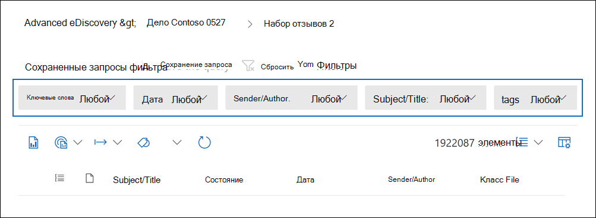
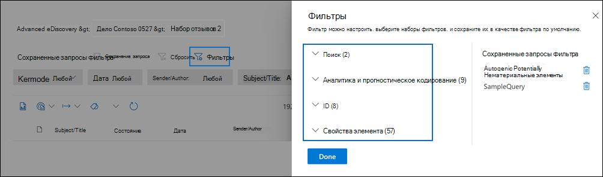
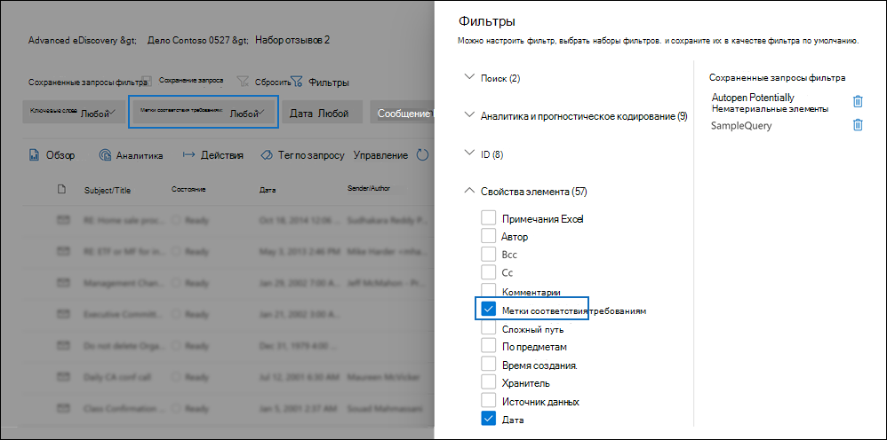
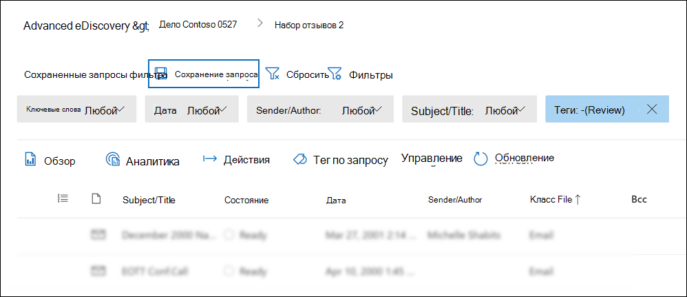
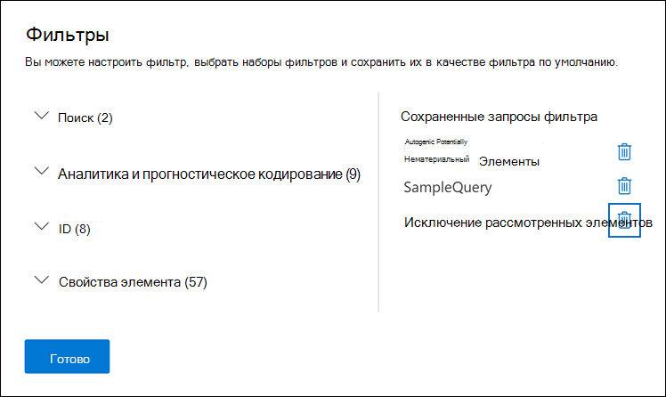
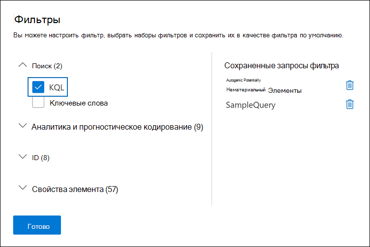
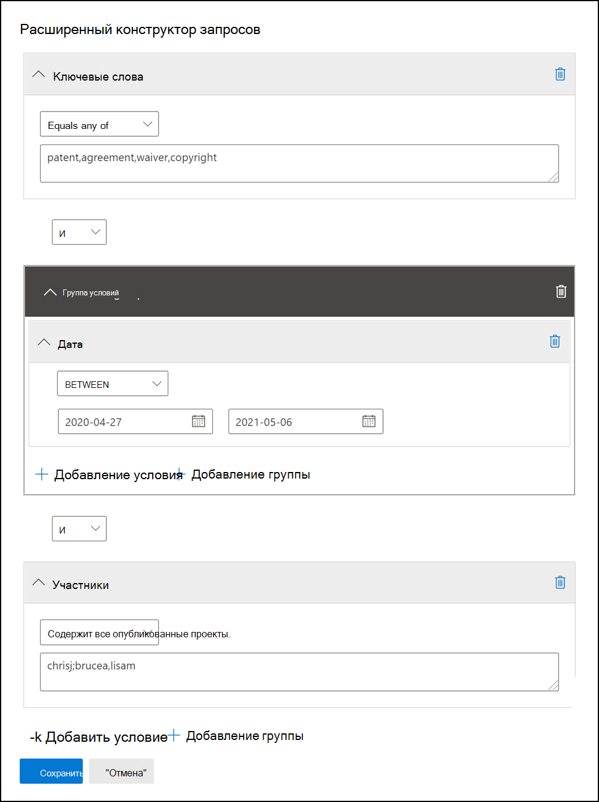

# Запрос и фильтрация контента в наборе обзоровQuery and filter content in a review set

В большинстве случаев будет полезно углубиться в содержимое в наборе обзоров и организовать его, чтобы облегчить более эффективный обзор.In most cases, it will be useful to dig deeper into the content in a review set and organize it to facilitate a more efficient review. Использование фильтров и запросов в наборе обзоров позволяет сосредоточиться на подмножество документов, которые соответствуют критериям проверки.Using filters and queries in a review set helps you focus on a subset of documents that meet the criteria of your review.

## Фильтры по умолчаниюDefault filters

В наборе обзоров есть пять фильтров по умолчанию, предварительно загруженных в наборе обзоров:In a review set, there are five default filters that are pre-loaded in the review set:

- Ключевые словаKeywords
- ДатаDate
- Отправитель/авторSender/Author
- Subject/TitleSubject/Title
- ТегиTags

Щелкните каждый фильтр, чтобы расширить его и назначить значение.Click each filter to expand it and assign a value. Щелкните вне фильтра, чтобы автоматически применить фильтр к набору отзывов.Click outside the filter to automatically apply the filter to the review set. На следующем скриншоте показан фильтр Date, настроенный для показа документов в диапазоне дат.The following screenshot shows the Date filter configured to show documents within a date range.

## Добавление или удаление фильтровAdd or remove filters

Чтобы добавить или удалить фильтры, отображаемые для набора отзывов, выберите **Фильтры** для открытия панели фильтров, которая отображается на странице вылетов.To add or remove filters that are displayed for the review set, select **Filters** to open the filter panel, which is displayed on a flyout page. 

Доступные фильтры организованы в четырех разделах:The available filters are organized in four sections:

- **Поиск.** Фильтры, которые предоставляют различные возможности поиска.**Search**: Filters that provide different search capabilities.

- **Аналитика &** программирования: фильтры свойств, созданных и добавленных в документы  при запуске & задания аналитики электронной почты или использования моделей прогностического кодирования.**Analytics & predictive coding**: Filters for properties generated and added to documents when you run the **Document & email analytic** job or use predictive coding models.

- **ID:** Фильтры для всех свойств документов.**IDs**: Filters for all ID properties of documents.

- **Свойства элемента:** фильтры для свойств документов.**Item properties**: Filters for document properties. 

Расширите каждый раздел и выберите или отфильтруйте фильтры, чтобы добавить или удалить их в наборе фильтров.Expand each section and select or deselect filters to add or remove them in the filter set. При добавлении фильтра он отображается в наборе фильтров.When you add a filter, it's displayed in the filter set. 

> [!NOTE]
> При расширении раздела на панели фильтров вы заметите, что выбраны типы фильтров по умолчанию.When you expand a section in the filter panel, you'll notice that the default filter types are selected. Вы можете сохранить выбранные или отобрать их и удалить из набора фильтров.You can keep these selected or deselect them and removed them from the filter set. 

## Типы фильтровFilter types

Каждое поле для поиска в наборе обзоров имеет соответствующий фильтр, который можно использовать для элементов фильтрации на основе определенного поля.Every searchable field in a review set has a corresponding filter that you can use for filter items based on a specific field.

Существует несколько типов фильтров:There are multiple types of filters:

- **Freetext:** фильтр freetext применяется к текстовым полям, таким как "Subject".**Freetext**: A freetext filter is applied to text fields such as "Subject". Можно перечислить несколько терминов поиска, разделив их с запятой.You can list multiple search terms by separating them with a comma.

- **Дата.** Фильтр даты используется для полей дат, таких как "Последняя измененная дата".**Date**: A date filter is used for date fields such as "Last modified date".

- **Параметры** поиска. Фильтр параметров поиска предоставляет список возможных значений (каждое значение отображается с помощью выбранного вами почтового ящика) для определенных полей в обзоре.**Search options**: A search options filter provides a list of possible values (each value is displayed with a checkbox that you can select) for particular fields in the review. Этот фильтр используется для полей, таких как "Отправитель", где в наборе отзывов имеется конечное число возможных значений.This filter is used for fields, such as "Sender", where there is a finite number of possible values in the review set.

- **Ключевое** слово. Условие ключевого слова — это определенный экземпляр условия freetext, который можно использовать для поиска терминов.**Keyword**: A keyword condition is a specific instance of freetext condition that you can use to search for terms. В этом типе фильтра можно также использовать язык запросов, похожий на KQL.You can also use KQL-like query language in this type of filter. Дополнительные сведения см. в разделах Язык запроса и Расширенный строитель запросов в этом разделе.For more information, see the Query language and Advanced query builder sections in this topic.

## Включить и исключить отношения фильтраInclude and exclude filter relationships

У вас есть возможность изменить включить и исключить связь для определенного фильтра.You have the option to change the include and exclude relationship for a particular filter. Например, в фильтре тегов можно исключить элементы, помеченные определенным тегом, выбрав **Equals none of** in the dropdown filter.For example, in the Tag filter, you can exclude items that are tagged with a particular tag by selecting **Equals none of** in the dropdown filter. 

## Сохранение фильтров в качестве запросовSave filters as queries

После выполнения фильтров можно сохранить комбинацию фильтров в качестве запроса фильтра.After you are satisfied with your filters, you can save the filter combination as a filter query. Это позволяет применять фильтр в будущих сеансах проверки.This lets you apply the filter in the future review sessions.

Чтобы сохранить фильтр, **выберите Сохранить запрос и** назовите его.To save a filter, select **Save the query** and name it. Вы или другие рецензенты могут запускать ранее  сохраненные запросы фильтра, выбрав отсев сохраненных запросов фильтра и выбрав запрос фильтра, который будет применяться для проверки установленных документов.You or other reviewers can run previously saved filter queries by selecting the **Saved filter queries** dropdown and selecting a filter query to apply to review set documents. 

Чтобы удалить запрос фильтра, откройте панель фильтров и выберите значок корзины рядом с запросом.To delete a filter query, open the filter panel and select the trashcan icon next to the query.

## Язык запросовQuery language

В дополнение к использованию фильтров можно также использовать язык запросов, похожий на KQL, в фильтре "Ключевые слова", чтобы создать поисковый запрос набора отзывов.In addition to using filters, you can also use a KQL-like query language in the Keywords filter to build your review set search query. Язык запросов для запросов набора отзывов поддерживает стандартные операторы boolean, такие как **AND,** **OR,** **NOT** и **NEAR.**The query language for review set queries supports standard Boolean operators, such as **AND**, **OR**, **NOT**, and **NEAR**. Он также поддерживает под диктовую карточку с одним и несколькими символами (\*).It also supports a single-character wildcard (?) and a multi-character wildcard (\*).

## Расширенный строитель запросовAdvanced query builder

Кроме того, можно создавать дополнительные запросы для поиска документов в наборе отзывов.You can also build more advanced queries to search for documents in a review set.

1. Откройте панель фильтров, **выберите Фильтры** и расширь раздел **Поиск.**Open the filter panel, select **Filters**, and expand the **Search** section.

  

2. Выберите фильтр **KQL** и нажмите кнопку **Открыть строитель запросов.**Select the **KQL** filter and click **Open query builder**.

   На этой панели можно создавать сложные запросы KQL с помощью конструктора запросов.In this panel, you can create complex KQL queries by using the query builder. Можно добавить условия или добавить группы условий, которые состоит из нескольких условий, логически связанных **отношениями AND** или **OR.**You can add conditions or add condition groups that are made up of multiple conditions that are logically connected by **AND** or **OR** relationships.

   
