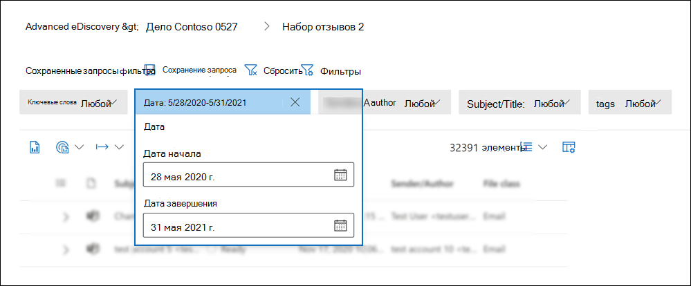
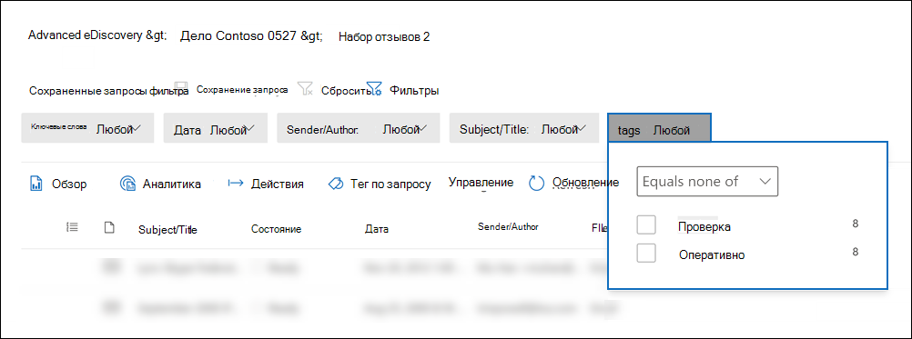

# Запрос и фильтрация контента в наборе обзоров

В большинстве случаев будет полезно углубиться в содержимое в наборе обзоров и организовать его, чтобы облегчить более эффективный обзор. Использование фильтров и запросов в наборе обзоров позволяет сосредоточиться на подмножество документов, которые соответствуют критериям проверки.

## Фильтры по умолчанию

В наборе обзоров есть пять фильтров по умолчанию, предварительно загруженных в наборе обзоров:

- Ключевые слова
- Дата
- Отправитель/автор
- Subject/Title
- Теги

Щелкните каждый фильтр, чтобы расширить его и назначить значение. Щелкните вне фильтра, чтобы автоматически применить фильтр к набору отзывов. На следующем скриншоте показан фильтр Date, настроенный для показа документов в диапазоне дат.

## Добавление или удаление фильтров

Чтобы добавить или удалить фильтры, отображаемые для набора отзывов, выберите **Фильтры** для открытия панели фильтров, которая отображается на странице вылетов. 

Доступные фильтры организованы в четырех разделах:

- **Поиск.** Фильтры, которые предоставляют различные возможности поиска.

- **Аналитика &** программирования: фильтры свойств, созданных и добавленных в документы  при запуске & задания аналитики электронной почты или использования моделей прогностического кодирования.

- **ID:** Фильтры для всех свойств документов.

- **Свойства элемента:** фильтры для свойств документов. 

Расширите каждый раздел и выберите или отфильтруйте фильтры, чтобы добавить или удалить их в наборе фильтров. При добавлении фильтра он отображается в наборе фильтров. 

> [!NOTE]
> При расширении раздела на панели фильтров вы заметите, что выбраны типы фильтров по умолчанию. Вы можете сохранить выбранные или отобрать их и удалить из набора фильтров. 

## Типы фильтров

Каждое поле для поиска в наборе обзоров имеет соответствующий фильтр, который можно использовать для элементов фильтрации на основе определенного поля.

Существует несколько типов фильтров:

- **Freetext:** фильтр freetext применяется к текстовым полям, таким как "Subject". Можно перечислить несколько терминов поиска, разделив их с запятой.

- **Дата.** Фильтр даты используется для полей дат, таких как "Последняя измененная дата".

- **Параметры** поиска. Фильтр параметров поиска предоставляет список возможных значений (каждое значение отображается с помощью выбранного вами почтового ящика) для определенных полей в обзоре. Этот фильтр используется для полей, таких как "Отправитель", где в наборе отзывов имеется конечное число возможных значений.

- **Ключевое** слово. Условие ключевого слова — это определенный экземпляр условия freetext, который можно использовать для поиска терминов. В этом типе фильтра можно также использовать язык запросов, похожий на KQL. Дополнительные сведения см. в разделах Язык запроса и Расширенный строитель запросов в этом разделе.

## Включить и исключить отношения фильтра

У вас есть возможность изменить включить и исключить связь для определенного фильтра. Например, в фильтре тегов можно исключить элементы, помеченные определенным тегом, выбрав **Equals none of** in the dropdown filter. 

## Сохранение фильтров в качестве запросов

После выполнения фильтров можно сохранить комбинацию фильтров в качестве запроса фильтра. Это позволяет применять фильтр в будущих сеансах проверки.

Чтобы сохранить фильтр, **выберите Сохранить запрос и** назовите его. Вы или другие рецензенты могут запускать ранее  сохраненные запросы фильтра, выбрав отсев сохраненных запросов фильтра и выбрав запрос фильтра, который будет применяться для проверки установленных документов. 

Чтобы удалить запрос фильтра, откройте панель фильтров и выберите значок корзины рядом с запросом.

## Язык запросов

В дополнение к использованию фильтров можно также использовать язык запросов, похожий на KQL, в фильтре "Ключевые слова", чтобы создать поисковый запрос набора отзывов. Язык запросов для запросов набора отзывов поддерживает стандартные операторы boolean, такие как **AND,** **OR,** **NOT** и **NEAR.** Он также поддерживает под диктовую карточку с одним и несколькими символами (*).

## Расширенный строитель запросов

Кроме того, можно создавать дополнительные запросы для поиска документов в наборе отзывов.

1. Откройте панель фильтров, **выберите Фильтры** и расширь раздел **Поиск.**

  

2. Выберите фильтр **KQL** и нажмите кнопку **Открыть строитель запросов.**

   На этой панели можно создавать сложные запросы KQL с помощью конструктора запросов. Можно добавить условия или добавить группы условий, которые состоит из нескольких условий, логически связанных **отношениями AND** или **OR.**

   
