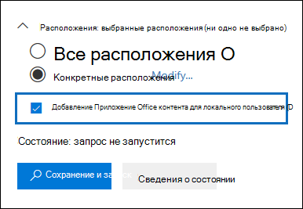

# <a name="search-for-teams-chat-data-for-on-premises-users"></a>Поиск данных чата локальных пользователей в Teams

Если в вашей организации выполнено гибридное развертывание Exchange (или в вашей организации локальная организация Exchange синхронизирована с Office 365) и работает Microsoft Teams, то для обмена мгновенными сообщениями пользователи могут пользоваться приложением чата Teams. У облачного пользователя данные чата Teams (также называемые *чатами 1x1 или 1хN*) сохраняются в его основной облачный почтовый ящик. Когда локальный пользователь использует приложение чата Teams, сообщения чата не могут сохраняться в его основной почтовый ящик, который является локальным. Чтобы обойти это ограничение, корпорация Майкрософт выпустила новую функцию, создающую облачную область хранения и позволяющую использовать инструменты обнаружения электронных данных для поиска и экспорта данных чата Teams локальных пользователей.
  
Здесь перечислены требования и ограничения, действующие при создании облачных хранилищ для локальных пользователей:
  
- Учетные записи пользователей в локальной службе каталогов (например, Active Directory) должны быть синхронизированы с Azure Active Directory, службой каталогов в Microsoft 365. Это означает, что учетная запись пользователя почты создается в Microsoft 365 и связана с пользователем, основной почтовый ящик которого находится в локальной организации.

- Пользователь, основной почтовый ящик которого находится в локальной организации, должен получить лицензию Microsoft Teams и минимум лицензию Exchange Online Plan 1.

- Если в вашей организации нет гибридного развертывания Exchange, вам необходимо синхронизировать локальную схему Exchange с Azure Active Directory. В противном случае вы рискуете создать дубликаты облачных почтовых ящиков в Exchange Online для пользователей, у которых есть почтовый ящик в вашей локальной организации.

- В облачной области хранения сохраняются только данные чата Teams, связанные с локальным пользователем. Локальный пользователь не имеет никакой возможности получить доступ к этой области хранения.

> [!NOTE]
> Беседы в каналах Teams всегда хранятся в облачном почтовом ящике, связанном с Командой, а значит, можно осуществлять поиск бесед Teams. Дополнительную информацию о поиске сообщений в каналах Teams см. в разделе [Поиск в Microsoft Teams и группах Microsoft 365](content-search.md#searching-microsoft-teams-and-microsoft-365-groups).
  
## <a name="how-it-works"></a>Принципы работы

Если у пользователя Microsoft Teams есть локальный почтовый ящик, а его учетная запись или идентификатор синхронизированы с облаком, Майкрософт создает облачное хранилище, связанное с данными чата 1xN локального пользователя в Teams. Данные чата Teams локальных пользователей индексируются для выполнения поиска. Это позволяет использовать Поиск контента (а также поиск, связанный с базовым и расширенным обнаружением электронных данных) для поиска, предварительного просмотра и экспорта данных чата Teams локальных пользователей. Вы также можете использовать командлеты **\*ComplianceSearch** в PowerShell центра & безопасности и соответствия требованиям для поиска данных в Teams для локальных пользователей.
  
На следующем рисунке показан рабочий процесс того, как данные чата Команд для локальных пользователей доступны для поиска, предварительного просмотра и экспорта.
  

  
В дополнение к этой новой возможности вы по-прежнему можете использовать поиск контента для поиска, предварительного просмотра и экспорта контента команд на облачном сайте SharePoint и в почтовом ящике Exchange, связанном с каждой командой Microsoft Team и данными чата команд 1xN в почтовом ящике Exchange Online для облака. основанные пользователи.


### <a name="what-happens-after-this-feature-is-enabled"></a>Что происходит после включения этой функции?

После развертывания этой функции в вашей организации в Поиск контента и в поисках, связанных с делом eDiscovery в Центре безопасности и соответствия требованиям, вносятся следующие изменения:
  
- **добавить контент приложения Office для локальных пользователей** флажок **в разделе расположения** будет добавлен в область поиск контента.

    
  
- Локальные пользователи отображаются в средстве выбора местоположений контента, которое используется для выбора пользовательских почтовых ящиков для поиска.

## <a name="searching-for-teams-chat-content-for-on-premises-users"></a>Поиск контента чата Teams локальных пользователей

После включения этой функции для поиска данных чата Teams локальных пользователей можно использовать Поиск контента в Центре безопасности и соответствия требованиям.
  
1. В центре безопасности и соответствия требованиям & Выберите **Поиск** \> **поиск контента**

2. На странице **Поиск** выберите  **новый поиск**.

    Как было сказано выше, в разделе **расположения** выводится **добавить контент приложения Office для локальных пользователей**. Он выбран по умолчанию.

3. Создайте запрос по ключевому слову и добавьте условия к поисковому запросу, если это необходимо. Чтобы выполнять поиск только в данных групповых чатов, вы можете добавить следующий запрос в поле **Ключевые слова**:

    ```text
    kind:im
    ```

4. На этом этапе вы можете выбрать один из следующих вариантов в разделе **Расположение**:

    - **Все местоположения:** выберите этот параметр для поиска в почтовых ящиках всех пользователей в вашей организации. Если этот флажок установлен, будут проверяться также все облачные хранилища данных чата Teams локальных пользователей.

    - **Определенные расположения:** выберите этот параметр, а затем нажмите **Изменить** и\> выберите пользователя, группы или команды, чтобы выполнить поиск в определенных почтовых ящиках. Как указывалось ранее, средство выбора расположений позволяет выполнять поиск данных чата Teams локальных пользователей.

5. Сохраните параметры поиска и запустите его. Предварительный просмотр для любых результатов поиска данных локальных пользователей возможен так же, как и для любых других результатов поиска. Вы также можете экспортировать результаты поиска (включая любые данные чата Команды) в файл PST. Дополнительные сведения см. в указанных ниже статьях.

    - [Создание поискового запроса](content-search.md#create-a-search)

    - [Предварительный просмотр результатов поиска](content-search.md#preview-search-results)

    - [Экспорт результатов поиска контента](export-search-results.md)

## <a name="using-powershell-to-search-for-teams-chat-data-for-on-premises-users"></a>Использование Windows PowerShell для поиска данных чата Teams локальных пользователей

Для поиска данных чата Teams локальных пользователей можно использовать командлеты **New-ComplianceSearch** и **Set-ComplianceSearch** в PowerShell Центра безопасности и соответствия требованиям. Как уже говорилось ранее, вам не нужно отправлять запрос в службу поддержки, чтобы использовать PowerShell для поиска данных чата команд для локальных пользователей.
  
1. [Подключение к интерфейсу PowerShell Центра безопасности и соответствия требованиям](/powershell/exchange/connect-to-scc-powershell).

2. Для создания поиска контента применительно к данным чата Teams локальных пользователей выполните следующую команду PowerShell.

    ```powershell
    New-ComplianceSearch <name of new search> -ContentMatchQuery <search query> -ExchangeLocation <on-premises user> -IncludeUserAppContent $true -AllowNotFoundExchangeLocationsEnabled $true  
    ```

    Параметр *IncludeUserAppContent*  используется для указания облачного хранилища пользователя или пользователей, которые определены параметром  *ExchangeLocation*. Параметром *AllowNotFoundExchangeLocationsEnabled* разрешается поиск в облачных хранилищах локальных пользователей. Когда для этого параметра используется значение `$true`, поиск перед запуском не выполняет проверку наличия почтового ящика. Это необходимо для поиска в облачных хранилищах локальных пользователей, поскольку облачное хранилище не соответствует обычному почтовому ящику.

    В следующем примере выполняется поиск чатов Teams (состоящих из мгновенных сообщений), содержащих ключевое слово "redstone" и находящихся в облачном хранилище Сары Дэвис, локального пользователя в организации Contoso.
  
    ```powershell
    New-ComplianceSearch "Redstone_Search" -ContentMatchQuery "redstone AND kind:im" -ExchangeLocation sarad@contoso.com -IncludeUserAppContent $true -AllowNotFoundExchangeLocationsEnabled $true  
    ```

   После создания поиска обязательно используйте командлет **Start-ComplianceSearch** для запуска поиска. 
  
Для получения дополнительной информации об использовании этих командлетов см:
  
- [New-ComplianceSearch](/powershell/module/exchange/new-compliancesearch)

- [Set-ComplianceSearch](/powershell/module/exchange/set-compliancesearch)

- [Start-ComplianceSearch](/powershell/module/exchange/start-compliancesearch)

## <a name="known-issues"></a>Известные проблемы

- В настоящее время можно искать, предварительно просматривать и экспортировать данные чатов Teams локальных пользователей. Вы также можете поместить данные чата Teams локального пользователя на удержание в связи с базовым или расширенным обнаружением электронных данных и применить политику хранения к сообщениям локальных пользователей в чатах или каналах Teams. Однако сейчас нельзя применять политики хранения к контенту локальных пользователей в других расположениях (например, почтовых ящиков Exchange и сайтов SharePoint).

## <a name="frequently-asked-questions"></a>Часто задаваемые вопросы

**Где расположено облачное хранилище информации локальных пользователей?**
  
Данные чата Teams хранятся в предпочтительном расположении данных (PDL) для локального пользователя. PDL используется в средах с поддержкой одного и нескольких регионов. Дополнительные сведения см. на странице [Microsoft 365 Multi-Geo](../enterprise/microsoft-365-multi-geo.md).
  
 **Существуют ли какие-либо другие требования, кроме отправки запроса в службу поддержки?**
  
Как указывалось ранее, идентификаторы пользователей с локальными почтовыми ящиками должны быть синхронизированы с вашей облачной организацией, чтобы соответствующая учетная запись пользователя почты создавалась для каждой локальной учетной записи пользователя в Office 365. Ваша организация также должна иметь корпоративную подписку Office 365, например, Office 365 Enterprise E1, E3 или E5.
  
 **Существует ли риск потери данных чата Teams, если локальный почтовый ящик пользователя перенесен в облако?**
  
Нет. При переносе основного почтового ящика локального пользователя в облако данные чата Teams для этого пользователя будут перенесены в новый облачный основной почтовый ящик.
  
 **Могу ли я применить политики хранения eDiscovery к локальным пользователям?**
  
Да. Вы можете применить удержание или политики хранения процесса обнаружения электронных данных к сообщениям локальных пользователей в чатах и каналах Teams.
  
 **Может ли Поиск контента найти данные старых чатов Teams локальных пользователей, которые велись до отправки организацией запроса на включение этой функции?**
  
Корпорация Майкрософт приступила к хранению данных чата Teams локальных пользователей 31 января 2018 г. Таким образом, если идентификатор локального пользователя Teams синхронизирован между Active Directory и Azure Active Directory после этой даты, то его данные чата Teams сохраняются в облаке и доступны для поиска с помощью Поиска контента. Кроме того, корпорация Майкрософт работает над хранением в облачном хранилище для локальных пользователей данных чатов Teams, которые велись до 31 января 2018 г. Более подробная информация об этом будет доступна в ближайшее время.

 **Нужна ли локальным пользователям лицензия для хранения данных чата Teams в облаке?**
  
Да. Чтобы хранить данные чата Teams локального пользователя в облачном хранилище, пользователю необходимо назначить лицензию Microsoft Teams и лицензию плана Exchange Online в Office 365 (или Microsoft 365).