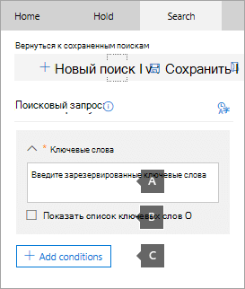
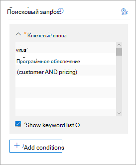
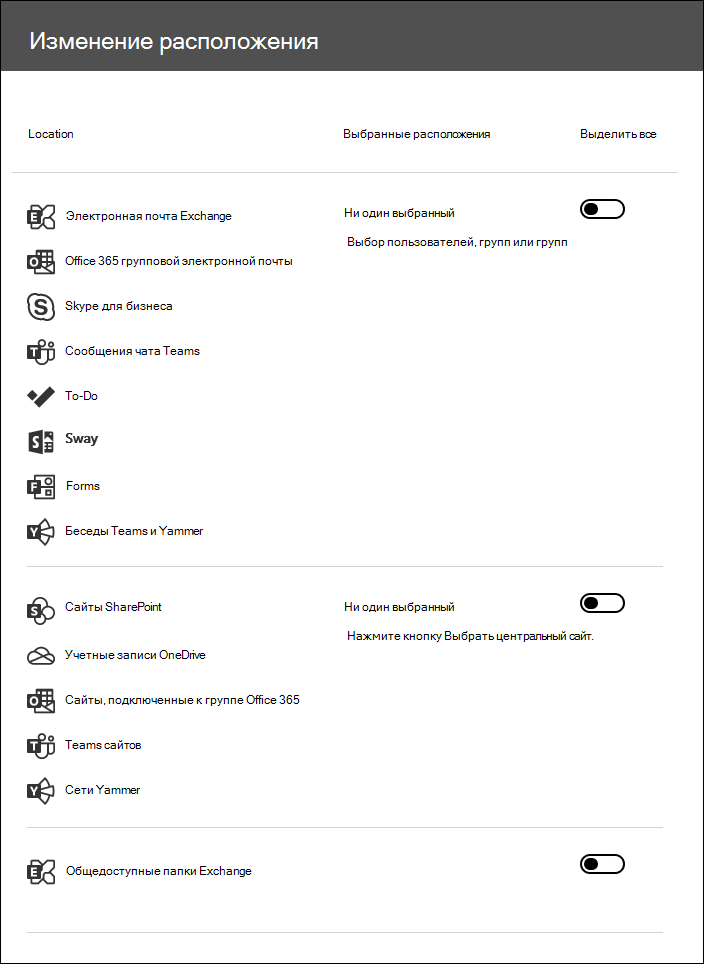

# Поиск контента в основном случае обнаружения электронных данныхSearch for content in a Core eDiscovery case

После создания основного случая обнаружения электронных данных и посторонних людей в случае помещается в удержание вы можете создать и выполнить один или несколько операций поиска для контента, относящегося к этому случаю.After a Core eDiscovery case is created and people of interest in the case are placed on hold, you can create and run one or more searches for content relevant to the case. Поиск, связанный с основным вариантом обнаружения электронных данных, отсутствует в списке на странице " **Поиск контента** " в центре соответствия требованиям Microsoft 365.Searches associated with a Core eDiscovery case aren't listed on the **Content search** page in the Microsoft 365 compliance center. Эти операции поиска перечислены на странице " **поиски** " основного случая едисковер, с которыми связаны операции поиска.These searches are listed on the **Searches** page of the Core eDiscover case the searches are associated with. Это также означает, что операции поиска, связанные с обращением, доступны только для элементов case.This also means that searches associated with a case can only be accessed by case members.

Чтобы создать основной поиск обнаружения электронных данных, выполните указанные ниже действия.To create a Core eDiscovery search:
  
1. Перейдите на страницу [https://compliance.microsoft.com](https://compliance.microsoft.com) и войдите, используя учетные данные для учетной записи пользователя, которой были назначены соответствующие разрешения на обнаружение электронных данных.Go to [https://compliance.microsoft.com](https://compliance.microsoft.com) and sign in using the credentials for user account that has been assigned the appropriate eDiscovery permissions.

2. В левой области навигации центра соответствия требованиям Microsoft 365 щелкните **Показать все**, а затем щелкните **ядро > обнаружения электронных**данных.In the left navigation pane of the Microsoft 365 compliance center, click **Show all**, and then click **eDiscovery > Core**.

3. На странице " **основные обнаружения электронных** данных" выберите случай, в котором необходимо создать сопоставленный Поиск, а затем щелкните **открыть обращение**.On the **Core eDiscovery** page, select the case that you want to create an associated search, and then click **Open case**.

4. На **домашней** странице для обращения перейдите на вкладку **поиски** .On the **Home** page for the case, click the **Searches** tab.
  
5. На странице **Поиск** нажмите кнопку **создать поиск**.On the **Search** page, click **New search**.

6. На странице **Новый поиск** можно добавить ключевые слова и условия для создания поискового запроса.On the **New search** page, you can add keywords and conditions to create the search query. 

    
  
   а)a. Вы можете указать ключевые слова, свойства сообщений, такие как даты отправки и получения, или свойства документа, такие как имена файлов или Дата последнего изменения документа.You can specify keywords, message properties, such as sent and received dates, or document properties, such as file names or the date that a document was last changed. Можно использовать более сложные запросы, использующие логические операторы, такие как **and**, **or**, **Not**и **NEAR**.You can use more complex queries that use a Boolean operator, such as **AND**, **OR**, **NOT**, or **NEAR**. Кроме того, возможен поиск конфиденциальной информации (например, номера социального страхования) в документах или поиск документов, доступ к которым получали внешние пользователи.You can also search for sensitive information (such as social security numbers) in documents, or search for documents that have been shared externally. Если оставить поле ключевое слово пустым, в результаты поиска будут включены все содержимое, расположенное в указанных расположениях контента.If you leave the keyword box empty, all content located in the specified content locations will be included in the search results.

   б)b. Можно щелкнуть флажок **Показать список ключевых слов** и ввести ключевое слово в каждой строке.You can click the **Show keyword list** check box and the type a keyword in each row. В этом случае ключевые слова в каждой строке будут соединены оператором **or** в созданном запросе поиска.If you do this, the keywords on each row are connected by the **OR** operator in the search query that's created. В список можно ввести не более 20 ключевых слов.You can enter a maximum of 20 keywords to the list.

    
  
    Зачем использовать список ключевых слов?Why use the keyword list? Вы можете получить статистические сведения о том, сколько элементов соответствует каждому ключевому слову.You can get statistics that show how many items match each keyword. Это поможет быстро определить, какие ключевые слова наиболее (и наименее) эффективны.This can help you quickly identify which keywords are the most (and least) effective. В строке можно также использовать ключевую фразу (в скобках).You can also use a keyword phrase (surrounded by parentheses) in a row. Дополнительные сведения о статистике поиска см. в статье [Просмотр статистики ключевых слов для результатов поиска контента](view-keyword-statistics-for-content-search.md).For more information about search statistics, see [View keyword statistics for Content Search results](view-keyword-statistics-for-content-search.md).

    Для получения дополнительных сведений об использовании списка "Ключевые слова", ознакомьтесь со статьей [Создание поискового запроса](content-search.md#building-a-search-query).For more information about using the keywords list, see [Building a search query](content-search.md#building-a-search-query).

   в.c. Вы можете щелкнуть **условия** и добавить условия в поисковый запрос, чтобы сузить поиск и получить более уточненный набор результатов.You can click **Conditions** and add conditions to a search query to narrow a search and return a more refined set of results. Каждое условие добавляет выражение к создаваемому поисковому запросу KQL, который запускается, когда вы начинаете поиск.Each condition adds a clause to the KQL search query that is created and run when you start the search. Условие логически связано с запросом по ключевым словам, указанном в поле для ввода ключевых слов, с помощью оператора **AND**.A condition is logically connected to the keyword query (specified in the keyword box) by the **AND** operator. Это означает, что элементы должны удовлетворять как запрос ключевых слов, так и все условия, включаемые в результаты.That means that items have to satisfy both the keyword query and each condition to be included in the results. Таким образом условия помогают сузить область результатов поиска.This is how conditions help to narrow your results.

    Дополнительные сведения о создании поисковых запросов и использовании условий см. в статье [Keyword queries for Content Search](keyword-queries-and-search-conditions.md).For more information about creating a search query and using conditions, see [Keyword queries for Content Search](keyword-queries-and-search-conditions.md).

7. В разделе **расположения: расположения на удержании**выберите расположения контента, которые требуется найти.Under **Locations: locations on hold**, choose the content locations that you want to search. Поиск можно выполнять в почтовых ящиках, сайтах и общедоступных папках.You can search mailboxes, sites, and public folders in the same search.

    
  
    - **Все расположения**.**All locations**. Выберите этот параметр для поиска всех расположений контента в Организации.Select this option to search all content locations in your organization. При выборе этого параметра можно выбрать поиск во всех почтовых ящиках Exchange (включая почтовые ящики для всех групп Microsoft Teams, Yammer и Office 365), всех сайтов SharePoint и OneDrive для бизнеса (включающих сайты для всех групп Microsoft Teams, Yammer и Office 365) и всех общедоступных папок.When you select this option, you can choose to search all Exchange mailboxes (which includes the mailboxes for all Microsoft Teams, Yammer Groups, and Office 365 Groups), all SharePoint and OneDrive for Business sites (which includes the sites for all Microsoft Teams, Yammer Groups, and Office 365 Groups), and all public folders.
    
    - **Все расположения на удержании**.**All locations on hold**. Выберите этот параметр, чтобы выполнить поиск по всем расположениям контента, включенных в удержание eDiscovery в случае обнаружения электронных данных.Select this option to search all the content locations that have been placed on eDiscovery hold in the case. Если регистр содержит несколько удержаний, будет выполнен поиск расположений контента из всех удержаний.If the case contains multiple holds, the content locations from all holds will be searched. Кроме того, если расположение содержимого было размещено на удержании на основе запроса, при выполнении поиска контента, созданного на этом этапе, будет выполняться поиск только элементов, находящихся на удержании.Additionally, if a content location was placed on a query-based hold, only the items that are on hold will be searched when you run the content search that you're creating in this step. Например, если пользователь поместился на удержание на основе запроса, в котором сохраняются элементы, отправленные или созданные до определенной даты, поиск будет выполнен только для этих элементов.For example, if a user was placed on query-based case hold that preserves items that were sent or created before a specific date, only those items would be searched. Это достигается путем подключения запроса на удержание дел и поискового запроса к содержимому с помощью оператора **и** .This is accomplished by connecting the case hold query and the content search query by an **AND** operator. Дополнительные сведения [см.](create-ediscovery-holds.md#search-locations-on-ediscovery-hold)For more information, see [Search locations on eDiscovery hold](create-ediscovery-holds.md#search-locations-on-ediscovery-hold).
    
    - **Определенных расположениях**.**Specific locations**. Выберите этот параметр, чтобы выбрать почтовые ящики и сайты, в которых вы хотите выполнить поиск.Select this option to select the mailboxes and sites that you want to search. При выборе этого параметра и нажатии кнопки **изменить**отображается список расположений.When you select this option and click **Modify**, a list of locations appears. Можно выбрать поиск всех или всех пользователей, групп, групп или расположений сайтов.You can choose to search any or all users, groups, teams, or site locations. Кроме того, можно искать в общедоступных папках в Организации.You can also search the public folders in your organization.
    
      
  
     При выборе этого параметра и поиске содержимого, расположенного на удержании, любой запрос из регистра на основе запроса не будет применен к поисковому запросу.If you select this option and search any content location that's on hold, any query from a query-based case hold won't be applied to the search query. Другими словами, выполняется поиск по всему содержимому, а не только к содержимому, которое сохраняется с учетом регистра на основе запроса.In other words, all content is searched, not just the content that's preserved by a query-based case hold.

8. Выбрав расположения контента для поиска, нажмите кнопку Done ( **Готово** ), а затем **сохранить**.After you select the content locations to search, click **Done** and then click **Save**.

9. На странице **Новый поиск** нажмите кнопку **сохранить & выполнить** , а затем введите имя для поиска.On the **New search** page, click **Save & run** and then type a name for the search. При поиске, связанном с основным вариантом обнаружения электронных данных, имена должны быть уникальными в пределах организации Office 365.Searches associated with a Core eDiscovery case must have names that are unique within your Office 365 organization.

10. Нажмите кнопку **сохранить** , чтобы сохранить параметры поиска и начать поиск.Click **Save** to save the search settings and start the search.

  После завершения поиска можно просмотреть его результаты.After the search is completed, you can preview the search results. При необходимости нажмите кнопку **Обновить** на странице " **поиски** ", чтобы отобразить Поиск, созданный в списке.If necessary, click **Refresh** on the **Searches** page to display the search you created in the list.

11. Щелкните Поиск, чтобы отобразить всплывающую страницу, содержащую статистику поиска и выполнения других задач, таких как просмотр статистики поиска и экспорт результатов поиска.Click the search to display the flyout page, which contains statistics about the search and to perform other tasks such as viewing search statistics and exporting the search results.

## Дополнительные сведения о поиске в расположениях контентаMore information about searching content locations

- Если нажать кнопку **выбрать пользователей, группы или Teams** , чтобы указать почтовые ящики для поиска, отображается пустое средство выбора почтовых ящиков.When you click **Choose users, groups, or teams** to specify mailboxes to search, the mailbox picker that's displayed is empty. Это вызвано мерами по повышению скорости работы.This is by design to enhance performance. Чтобы добавить получателей в этот список, щелкните **Выбор пользователей, групп или групп**, введите имя (не менее 3 символов) в поле поиска, установите флажок рядом с именем и нажмите кнопку **выбрать**.To add recipients to this list, click **Choose users, groups, or teams**, type a name (a minimum of 3 characters) in the search box, select the check box next to the name, and then click **Choose**.

- Можно добавить Неактивные почтовые ящики, Microsoft Teams, группы Yammer, группы Office 365 и группы рассылки в список почтовых ящиков, в которых выполняется поиск.You can add inactive mailboxes, Microsoft Teams, Yammer Groups, Office 365 Groups, and distribution groups to the list of mailboxes to search. Динамические группы рассылки не поддерживаются.Dynamic distribution groups aren't supported. Если вы добавляете Microsoft Teams, группы Yammer или группы Office 365, выполняется поиск группы или почтового ящика группы. не выполняется поиск почтовых ящиков членов группы.If you add Microsoft Teams, Yammer Groups, or Office 365 Groups, the group or team mailbox is searched; the mailboxes of the group members aren't searched.

- Чтобы добавить сайты, нажмите кнопку **выбрать сайты**, еще раз нажмите кнопку **выбрать сайты** , а затем введите URL-адрес для каждого сайта, который требуется найти.To add sites click **Choose sites**, click **Choose sites** again, and then type the URL for each site that you want to search. Вы также можете добавить URL-адрес сайта SharePoint для группы Майкрософт, группы Yammer или группы Office 365.You can also add the URL for the SharePoint site for a Microsoft Team, a Yammer Group, or an Office 365 Group.
