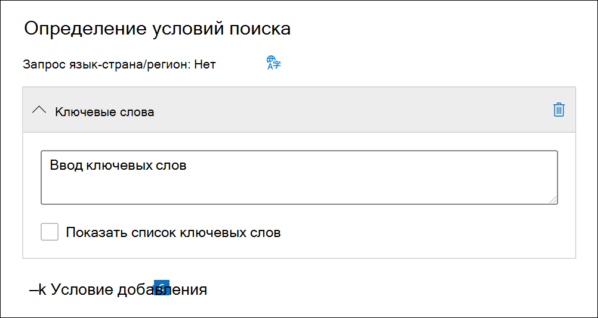

# Поиск контента в случае core eDiscoverySearch for content in a Core eDiscovery case

После создания дела core eDiscovery и удержания людей, интересу которых является этот случай, можно создать и запустить один или несколько поисков контента, соответствующего делу.After a Core eDiscovery case is created and people of interest in the case are placed on hold, you can create and run one or more searches for content relevant to the case. Поиски, связанные с делом об обнаружении  основных электронных данных, не перечислены на странице поиска контента в центре Microsoft 365 соответствия требованиям.Searches associated with a Core eDiscovery case aren't listed on the **Content search** page in the Microsoft 365 compliance center. Эти поиски перечислены на странице **Поиски** в случае core eDiscover, с чем связаны поиски.These searches are listed on the **Searches** page of the Core eDiscover case the searches are associated with. Это также означает, что к поискам, связанным с делом, можно получить доступ только к участникам дела.This also means that searches associated with a case can only be accessed by case members.

Чтобы создать поиск по обнаружению основных электронных обнаружений:To create a Core eDiscovery search:
  
1. Перейдите к учетным данным для учетной записи пользователя, которая получила соответствующие разрешения на открытие электронных данных и является участником <https://compliance.microsoft.com> дела.Go to <https://compliance.microsoft.com> and sign in using the credentials for user account that has been assigned the appropriate eDiscovery permissions and is a member of the case.

2. В левой области навигации центра Microsoft 365 нажмите кнопку **Показать** все, а затем нажмите **кнопку eDiscovery > Core**.In the left navigation pane of the Microsoft 365 compliance center, click **Show all**, and then click **eDiscovery > Core**.

3. На странице **Core eDiscovery** выберите случай, в который необходимо создать связанный поиск, а затем нажмите **кнопку Открыть дело**.On the **Core eDiscovery** page, select the case that you want to create an associated search, and then click **Open case**.

4. На **домашней странице** для дела нажмите вкладку **Поиск** и нажмите **кнопку Новый поиск**.On the **Home** page for the case, click the **Searches** tab, and then click **New search**.

   

   > [!NOTE]
   > Параметр **Поиск по списку идентификаторов** позволяет искать определенные сообщения электронной почты и другие элементы почтового ящика с помощью списка идентификаторов Exchange.The **Search by ID list** option lets you search for specific email messages and other mailbox items using a list of Exchange IDs. Чтобы создать поиск по списку идентификаторов, нужно отправить CSV-файл, в котором указаны конкретные элементы почтового ящика для поиска.To create an ID list search, you submit a comma-separated value (CSV) file that identifies the specific mailbox items to search for. Инструкции см. в статье [Подготовка CSV-файла для поиска контента по списку идентификаторов](csv-file-for-an-id-list-content-search.md).For instructions, see [Prepare a CSV file for an ID list search](csv-file-for-an-id-list-content-search.md).

5. В **мастере поиска New** введите имя для поиска и необязательное описание, которое поможет определить поиск.In the **New search** wizard, type a name for the search, and an optional description that helps identify the search. Название поискового запроса должно быть уникальным в пределах организации.The name of the search must be unique in your organization.

6. На странице **Расположения** выберите расположения контента, которые необходимо найти.On the **Locations** page, choose the content locations that you want to search. Можно выполнять поиск в почтовых ящиках и общедоступных папках.You can search mailboxes, sites, and public folders.

    
  
   1. **Почтовые ящики Exchange**: установите переключатель **Вкл.** и нажмите **Выбрать пользователей, группы или команды**, чтобы указать почтовые ящики для удержания.**Exchange mailboxes**: Set the toggle to **On** and then click **Choose users, groups, or teams** to specify the mailboxes to place on hold. Для поиска почтовых ящиков пользователей и групп рассылки, которые необходимо поставить на удержание (чтобы поставить почтовые ящики членов групп на удержание), воспользуйтесь полем поиска.Use the search box to find user mailboxes and distribution groups (to place a hold on the mailboxes of group members) to place on hold. Вы также можете искать в почтовом ящике, связанном с командой Microsoft (для сообщений канала), группой Office 365 и группой Yammer.You can also search the mailbox associated with a Microsoft Team (for channel messages), Office 365 Group, and Yammer Group. Дополнительные сведения о данных приложений, хранимых в почтовых ящиках, см. в разделе [Контент, хранимый в почтовых ящиках для обнаружения электронных данных](what-is-stored-in-exo-mailbox.md).For more information about the application data stored in mailboxes, see [Content stored in mailboxes for eDiscovery](what-is-stored-in-exo-mailbox.md).

   2. **Сайты SharePoint**: установите переключатель **Вкл.** и нажмите **Выбрать сайты**, чтобы указать сайты SharePoint и учетные записи OneDrive для удержания.**SharePoint sites**: Set the toggle to **On** and then click **Choose sites** to specify SharePoint sites and OneDrive accounts to place on hold. Укажите URL-адрес каждого сайта, который вы хотите поставить на удержание.Type the URL for each site that you want to place on hold. Вы также можете добавить URL-адрес сайта SharePoint для команды Microsoft, группы Office 365 или группы Yammer.You can also add the URL for the SharePoint site for a Microsoft Team, Office 365 Group, or Yammer Group.
  
   3. **Общедоступные папки Exchange**: установите переключатель **Вкл.**, чтобы поместить все общедоступные папки в организации Exchange Online на удержание.**Exchange public folders**: Set the toggle to **On** to put all public folders in your Exchange Online organization on hold. Вы не можете выбрать определенные общедоступные папки для удержания.You can't choose specific public folders to put on hold. Оставьте переключатель выключенным, если вы не хотите помещать на удержание общедоступные папки.Leave the toggle switch off if you don't want to put a hold on public folders.
  
   4. Чтобы найти контент Teams для локального пользователя, оставьте этот флажок.Keep this checkbox selected to search for Teams content for on-premises users. Например, если вы проводите поиск по всем почтовым ящикам Exchange в организации и у вас установлен этот параметр, облачное хранилище, используемое для хранения данных чата Teams для локальных пользователей, будет включено в область поиска.For example, if you search all Exchange mailboxes in the organization and this checkbox is selected, the cloud-based storage used to store Teams chat data for on-premises users will be included in the scope of the search. Дополнительные сведения см. в статье [Поиск данных в чате Teams для локальных пользователей](search-cloud-based-mailboxes-for-on-premises-users.md).For more information, see [Search for Teams chat data for on-premises users](search-cloud-based-mailboxes-for-on-premises-users.md).

7. На странице **Определить условия поиска** введите запрос по ключевым словам и при необходимости добавьте условия в поисковый запрос.On the **Define your search conditions** page, type a keyword query and add conditions to the search query if necessary.

   

   1. Укажите ключевые слова или свойства сообщений, например даты отправки и получения, или свойства документов, например имена файлов или дату последнего изменения.Specify keywords, message properties such as sent and received dates, or document properties such as file names or the date that a document was last changed. Можно создавать более сложные запросы, включающие логические операторы, например **AND**, **OR**, **NOT** и **NEAR**.You can use more complex queries that use a Boolean operator, such as **AND**, **OR**, **NOT**, and **NEAR**. Если оставить незаполненным поле для ввода ключевых слов, в результаты поиска будет включено все содержимое из указанных расположений контента.If you leave the keyword box empty, all content located in the specified content locations is included in the search results. Дополнительные сведения см. в статье [Запросы по ключевым словам и условия для обнаружения электронных данных](keyword-queries-and-search-conditions.md).For more information, see [Keyword queries and search conditions for eDiscovery](keyword-queries-and-search-conditions.md).

   2. Кроме того, вы можете установить флажок **Отобразить список ключевых слов** и вводить ключевые слова в каждой строке.Alternatively, you can click the **Show keyword list** checkbox and the type a keyword in each row. В этом случае в создаваемом поисковом запросе ключевые слова из каждой строки будут соединены логическим оператором (**c:s**), аналогичным по функциональности оператору **OR**.If you do this, the keywords on each row are connected by a logical operator (**c:s**) that is similar in functionality to the **OR** operator in the search query that's created.

      Зачем использовать список ключевых слов?Why use the keyword list? Вы можете получить статистические сведения о том, сколько элементов соответствует каждому ключевому слову.You can get statistics that show how many items match each keyword. Это поможет быстро определить, какие ключевые слова наиболее (и наименее) эффективны.This can help you quickly identify which keywords are the most (and least) effective. В строке можно также использовать ключевую фразу (в скобках).You can also use a keyword phrase (surrounded by parentheses) in a row. Дополнительные сведения о списках ключевых слов и статистике поиска см. в статье [Получение статистики ключевых слов для результатов поиска](view-keyword-statistics-for-content-search.md#get-keyword-statistics-for-searches).For more information about the keyword list and search statistics, see [Get keyword statistics for searches](view-keyword-statistics-for-content-search.md#get-keyword-statistics-for-searches).

      > [!NOTE]
      > Чтобы сократить ошибки, связанные с крупными списками ключевых слов, в списке ключевых слов можно указать не более 20 строк.To help reduce issues caused by large keyword lists, you're limited to a maximum of 20 rows in the keyword list.

   3. Вы можете добавить условия поиска, чтобы сузить область поиска и получить более точные результаты.You can add search conditions to narrow a search and return a more refined set of results. Каждое условие добавляет предложение к поисковому запросу, которое создается и запускается в начале поиска.Each condition adds a clause to the search query that is created and run when you start the search. Условие логически связано с запросом по ключевым словам, указанным в поле для ввода ключевых слов, с помощью логического оператора (**c:c**), аналогичного по функциональности оператору **AND**.A condition is logically connected to the keyword query (specified in the keyword box) by a logical operator (**c:c**) that is similar in functionality to the **AND** operator. Это означает, что элементы попадают в результаты поиска, если соответствуют как запросу по ключевому слову, так и одному или нескольким условиям.That means that items have to satisfy both the keyword query and one or more conditions to be included in the results. Таким образом условия помогают сузить область результатов поиска.This is how conditions help to narrow your results. Перечень и описание условий, которые можно использовать в поисковом запросе, см. в статье [условия поиска](keyword-queries-and-search-conditions.md#search-conditions).For a list and description of conditions that you can use in a search query, see [Search conditions](keyword-queries-and-search-conditions.md#search-conditions).

8. Просмотрите параметры поиска (и при необходимости отредактируете их), а затем отправьте запрос, чтобы начать поиск.Review the search settings (and edit if necessary), and then submit the search to start it.

После завершения поиска можно просмотреть его результаты.After the search is completed, you can preview the search results. При необходимости **щелкните Обновление** на странице **Поиски,** чтобы отобразить созданный поиск.If necessary, click **Refresh** on the **Searches** page to display the search you created.

## Дополнительные сведения о поиске местоположений контентаMore information about searching content locations

- При нажатии кнопки **Выберите пользователей, групп** или групп, чтобы указать почтовые ящики для поиска, отображаемая выборка почтовых ящиков пуста.When you click **Choose users, groups, or teams** to specify mailboxes to search, the mailbox picker that's displayed is empty. Это вызвано мерами по повышению скорости работы.This is by design to enhance performance. Чтобы добавить получателей в этот список, щелкните Выберите **пользователей,** групп или групп, введите имя (не менее трех символов) в поле поиска, выберите поле рядом с именем, а затем нажмите **кнопку Выберите**.To add recipients to this list, click **Choose users, groups, or teams**, type a name (a minimum of three characters) in the search box, select the check box next to the name, and then click **Choose**.

- В список почтовых ящиков для поиска можно добавить неактивные почтовые ящики, Microsoft Teams, Yammer группы, группы Office 365 и группы рассылки.You can add inactive mailboxes, Microsoft Teams, Yammer Groups, Office 365 Groups, and distribution groups to the list of mailboxes to search. Динамические группы рассылки не поддерживаются.Dynamic distribution groups aren't supported. Если вы добавляете Microsoft Teams, Yammer группы или Office 365 группы, группа или почтовый ящик группы будут искать; почтовые ящики участников группы не ищутся.If you add Microsoft Teams, Yammer Groups, or Office 365 Groups, the group or team mailbox is searched; the mailboxes of the group members aren't searched.

- Чтобы добавить сайты в поиск, включайте очки и нажмите **кнопку Выберите сайты.**To add sites to the search, turn on the toggle and then click **Choose sites**. Введите URL-адрес для каждого сайта, который необходимо искать.Type the URL for each site that you want to search. Вы также можете добавить URL SharePoint для microsoft Team, Yammer группы или Office 365 группы.You can also add the URL for the SharePoint site for a Microsoft Team, a Yammer Group, or an Office 365 Group.
