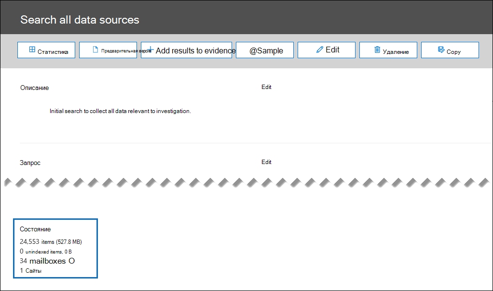
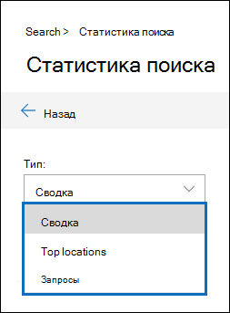

# Статистика поиска при расследовании данных (Предварительная версия)Search statistics in Data Investigations (preview)

Эффективный способ проверки результатов поиска при изучении инцидента данных — просмотреть статистику результатов поиска, чтобы убедиться в их соответствии ожиданиям.An effective way to validate your search results when investigation a data incident is to view the statistics about your search results to make sure they align with your expectations. При завершении поиска в разделе **Status (состояние** ) на всплывающей странице сведения о поиске отображается следующая высокоуровневая Статистика:When a search as finished running, the following high-level statistics are displayed under **Status** on the search details flyout page:

- Предполагаемое количество и размер элементов, которые удовлетворяют условиям поиска.The estimated number and size of items that matched the search criteria.

- Число и размер частично индексированных элементов (также называемых *неиндексированными элементами*), которые не поддерживаются для поиска, но обнаружены в расположениях контента, включенных в поиск.The number and size of partially indexed items (also called *unindexed items*) that aren't searchable but that were found in the content locations that were included in the search.

- Количество выполненных почтовых ящиков и сайтов.The number of mailboxes and sites that were searched.

Чтобы просмотреть более подробную статистику, нажмите кнопку **Статистика** на всплывающей странице сведений о поиске.To view more detailed statistics, click **Statistics** on the search details flyout page. На странице **Статистика поиска** вы можете просмотреть сводку поиска, верхнюю область, содержащую элементы, которые совпадают с результатами поиска, и подробную статистику поискового запроса.On the **Search statistics** page, you can view the search summary, the top location that contained items that matched the search results, and detailed statistics about the search query.

## АннотацияSummary

В представлении **сводки** можно просмотреть результаты поиска, разбитые по типу расположения (например, расположения включают почтовые ящики Exchange и сайты SharePoint).In the **Summary** view, you can see the search results broken down by location type (for example, locations include Exchange mailboxes and SharePoint sites). Для каждого типа местоположения отображается следующая информация:The following information is displayed for each location type:

- Количество местоположений, в которых были элементы, соответствующие условиям поиска.The number of locations that had items that matched the search criteria.

- Общее количество элементов из каждого типа расположения, которые удовлетворяют условиям поиска.The total number of items from each location type that matched the search criteria.

- Общий размер элементов из каждого типа, которые отвечают условиям поиска.The total size of items from each location type that matched the search criteria.

## Основные расположенияTop locations

В представлении " **верхние места** " отображаются отдельные расположения контента с большинством элементов, которые удовлетворяют условиям поиска.In the **Top locations** view, you see the individual content locations with the most items that matched the search criteria. Для каждого расположения содержимого отображаются следующие сведения:For each content location, the following information is displayed:

- Имя расположения; адрес электронной почты для почтовых ящиков и URL-адреса сайтов SharePointThe name of the location; the email address for mailboxes and the URL for SharePoint sites

- Тип расположенияThe location type

- Количество элементов, которые удовлетворяют условиям поискаNumber of items that matched the search criteria

- Общий размер всех элементов, которые удовлетворяют условиям поиска.The total size of all items that matched the search criteria.

## ЗапросыQueries

В представлении **запросы** можно просмотреть подробную статистику для каждого компонента поискового запроса.In the **Queries** view, you can see detailed statistics for each component of the search query. Если вы использовали список ключевых слов в поисковом запросе, вы можете просматривать расширенные статистические данные в представлении **запросы** , которые показывают, сколько элементов совпадают с ключевыми словами или ключевыми словами.If you used the keyword list in the search query, you can view enhanced statistics in the **Queries** view  that show how many items match each keyword or keyword phrase. Это поможет быстро определить, какие части запроса являются самыми эффективными (и, как минимум).This can help you quickly identify which parts of the query are the most (and least) effective. 

В представлении **запросы** отображаются следующие сведения:The following information is displayed in the **Queries** view:

 - **Тип расположения** — тип расположения содержимого для статистики, отображаемой в строке.**Location type** - The type of content location for the statistics displayed in the row.

- **Part** — в этом столбце отображается одно из следующих значений: **PRIMARY** или **ключевое слово**.**Part** - This column will display one of the following values: **Primary** or **Keyword**. **Основной** означает, что строка содержит статистику по всему запросу; **Ключевое слово** означает, что статистика в строке соответствует одному из компонентов запроса.**Primary** means the row presents statistics on the entire query; **Keyword** means the statistics in the row are for one of the query components.

- **Condition** — фактический компонент запроса запроса поиска, на который ссылается строка.**Condition** - The actual query component of the search query the row refers to. Если значение в столбце **части** является **основным**, отображаются статистические данные всего поискового запроса; Если задано **ключевое слово**value, отображаются статистические данные для компонента запроса, отображаемого в столбце **запрос** .If the value in the **Part** column is **Primary**, then the statistics for the entire search query are displayed; if the value is **Keyword**, then the statistics for the component of the query shown in the **Query** column are displayed. Например, если использовался список ключевых слов, отображается один из ключевых слов.For example, if the keyword list was used, then the statistics one of the keywords are displayed.

  Ниже приведены дополнительные сведения о статистике, отображаемой в столбце **запросы** .Here are some other things to know about the statistics displayed in the **Queries** column:
  
  - При поиске всего содержимого в почтовых ящиках (без указания ключевых слов) фактическим запросом является **(size >= 0)** , чтобы возвращались все элементы.When you search for all content in mailboxes (by not specifying any keywords), the actual query is **(size >= 0)** so that all items are returned
  
  - При поиске на сайтах SharePoint и OneDrive в поисковый запрос добавляются два следующих компонента:When you search SharePoint and OneDrive sites, the two following components are added to the search query:
    
    **Не IsExternalContent: 1** — исключает любой контент из локальной организации SharePoint**NOT IsExternalContent:1** - This excludes any content from an on-premises SharePoint organization
    
    **Не исоненотепаже: 1** — исключает все файлы OneNote, так как они будут дублировать любой документ, соответствующий поисковому запросу.**NOT isOneNotePage:1** - This excludes all OneNote files because these would be duplicates of any document that matches the search query.

- **Расположения в поиске** Количество расположений контента, в которых были элементы, соответствующие запросу поиска для части или условия, отображаемых в строке.**Locations in search** The number of content locations that had items that matched the search query for the part/condition displayed in the row. Обратите внимание, что архивные почтовые ящики подсчитываются как отдельное расположение, если они содержат элементы, которые отвечают условиям поиска.Note that archive mailboxes are counted as a separate location if they contain items that match the search criteria.

- **Items** — общее количество элементов, которые удовлетворяют критериям поиска для части или условия, отображаемых в строке.**Items** - The total number of items that matched the search criteria for the part/condition displayed in the row.

- **Size** — общее количество элементов, которые удовлетворяют критериям поиска для части или условия, отображаемых в строке.**Size** - The total number of items that matched the search criteria for the part/condition displayed in the row.

