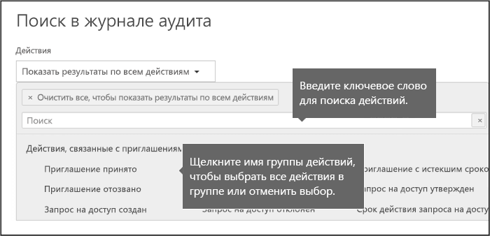
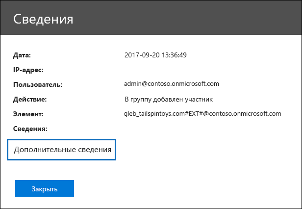
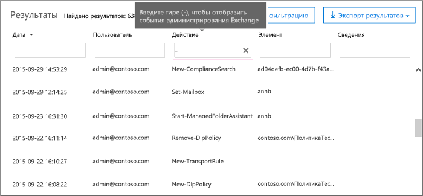

# <a name="search-the-audit-log-in-the-security--compliance-center"></a><span data-ttu-id="5d845-103">Поиск по журналу аудита в Центре безопасности и соответствия требованиям</span><span class="sxs-lookup"><span data-stu-id="5d845-103">Search the audit log in the Security & Compliance Center</span></span>

## <a name="introduction"></a><span data-ttu-id="5d845-104">Введение</span><span class="sxs-lookup"><span data-stu-id="5d845-104">Introduction</span></span>

<span data-ttu-id="5d845-105">Нужно узнать, просматривал ли пользователь определенный документ или удалял элемент из своего почтового ящика?</span><span class="sxs-lookup"><span data-stu-id="5d845-105">Need to find if a user viewed a specific document or purged an item from their mailbox?</span></span> <span data-ttu-id="5d845-106">В этом случае можно использовать Центр безопасности и соответствия требованиям Office 365 для поиска единого журнала аудита, чтобы просматривать активность пользователей и администраторов в организации в Office 365.</span><span class="sxs-lookup"><span data-stu-id="5d845-106">If so, you can use the Office 365 Security & Compliance Center to search the unified audit log to view user and administrator activity in your Office 365 organization.</span></span> <span data-ttu-id="5d845-107">Почему именно единый журнал аудита?</span><span class="sxs-lookup"><span data-stu-id="5d845-107">Why a unified audit log?</span></span> <span data-ttu-id="5d845-108">Потому что в этом журнале в Office 365 можно искать данные по следующим типам активности пользователей и администраторов:</span><span class="sxs-lookup"><span data-stu-id="5d845-108">Because you can search for the following types of user and admin activity in Office 365:</span></span>

- <span data-ttu-id="5d845-109">активность пользователей в SharePoint Online и OneDrive для бизнеса;</span><span class="sxs-lookup"><span data-stu-id="5d845-109">User activity in SharePoint Online and OneDrive for Business</span></span>

- <span data-ttu-id="5d845-110">активность пользователей в Exchange Online (журнал аудита почтовых ящиков Exchange);</span><span class="sxs-lookup"><span data-stu-id="5d845-110">User activity in Exchange Online (Exchange mailbox audit logging)</span></span>

- <span data-ttu-id="5d845-111">активность администраторов в SharePoint Online;</span><span class="sxs-lookup"><span data-stu-id="5d845-111">Admin activity in SharePoint Online</span></span>

- <span data-ttu-id="5d845-112">активность администраторов в Azure Active Directory (служба каталогов для Office 365);</span><span class="sxs-lookup"><span data-stu-id="5d845-112">Admin activity in Azure Active Directory (the directory service for Office 365)</span></span>

- <span data-ttu-id="5d845-113">активность администраторов в Exchange Online (журнал аудита действий администратора Exchange);</span><span class="sxs-lookup"><span data-stu-id="5d845-113">Admin activity in Exchange Online (Exchange admin audit logging)</span></span>

- <span data-ttu-id="5d845-114">активность пользователей и администраторов в Sway;</span><span class="sxs-lookup"><span data-stu-id="5d845-114">User and admin activity in Sway</span></span>

- <span data-ttu-id="5d845-115">активность по обнаружению электронных данных в Центре безопасности и соответствия требованиям;</span><span class="sxs-lookup"><span data-stu-id="5d845-115">eDiscovery activities in the security and compliance center</span></span>

- <span data-ttu-id="5d845-116">активность пользователей и администраторов в Power BI;</span><span class="sxs-lookup"><span data-stu-id="5d845-116">User and admin activity in Power BI</span></span>

- <span data-ttu-id="5d845-117">активность пользователей и администраторов в Microsoft Teams;</span><span class="sxs-lookup"><span data-stu-id="5d845-117">User and admin activity in Microsoft Teams</span></span>

- <span data-ttu-id="5d845-118">активность пользователей и администраторов в Dynamics 365;</span><span class="sxs-lookup"><span data-stu-id="5d845-118">User and admin activity in Dynamics 365</span></span>

- <span data-ttu-id="5d845-119">активность пользователей и администраторов в Yammer;</span><span class="sxs-lookup"><span data-stu-id="5d845-119">User and admin activity in Yammer</span></span>

- <span data-ttu-id="5d845-120">активность пользователей и администраторов в Microsoft Power Automate;</span><span class="sxs-lookup"><span data-stu-id="5d845-120">User and admin activity in Microsoft Power Automate</span></span>

- <span data-ttu-id="5d845-121">активность пользователей и администраторов в Microsoft Stream;</span><span class="sxs-lookup"><span data-stu-id="5d845-121">User and admin activity in Microsoft Stream</span></span>

- <span data-ttu-id="5d845-122">активность аналитиков и администраторов в Рабочей аналитике (Майкрософт);</span><span class="sxs-lookup"><span data-stu-id="5d845-122">Analyst and admin activity in Microsoft Workplace Analytics</span></span>

- <span data-ttu-id="5d845-123">активность пользователей и администраторов в Microsoft Power Apps;</span><span class="sxs-lookup"><span data-stu-id="5d845-123">User and admin activity in Microsoft Power Apps</span></span>

- <span data-ttu-id="5d845-124">активность пользователей и администраторов в Microsoft Forms.</span><span class="sxs-lookup"><span data-stu-id="5d845-124">User and admin activity in Microsoft Forms</span></span>

## <a name="before-you-begin"></a><span data-ttu-id="5d845-125">Перед началом работы</span><span class="sxs-lookup"><span data-stu-id="5d845-125">Before you begin</span></span>

<span data-ttu-id="5d845-126">Прежде чем выполнять поиск по журналу аудита Office 365, обязательно ознакомьтесь с информацией в этом разделе.</span><span class="sxs-lookup"><span data-stu-id="5d845-126">Be sure to read the following items before you start searching the Office 365 audit log.</span></span>

- <span data-ttu-id="5d845-127">Для поиска по журналу аудита Office 365 вы (или другой администратор) должны включить ведение журнала аудита.</span><span class="sxs-lookup"><span data-stu-id="5d845-127">You (or another admin) must first turn on audit logging before you can start searching the Office 365 audit log.</span></span> <span data-ttu-id="5d845-128">Для этого нажмите кнопку **Включить аудит** на странице **Поиск в журнале аудита** в Центре безопасности и соответствия требованиям.</span><span class="sxs-lookup"><span data-stu-id="5d845-128">To turn it on, click **Turn on auditing** on the **Audit log search** page in the Security & Compliance Center.</span></span> <span data-ttu-id="5d845-129">(Если ссылка не отображается, ведение аудита для вашей организации уже включено.) После этого появится сообщение о подготовке журнала аудита, и через пару часов, когда она будет завершена, вы сможете начать поиск.</span><span class="sxs-lookup"><span data-stu-id="5d845-129">(If you don't see this link, auditing has already been turned on for your organization.) After you turn it on, a message is displayed that says the audit log is being prepared and that you can run a search in a couple of hours after the preparation is complete.</span></span> <span data-ttu-id="5d845-130">Это потребуется сделать только один раз.</span><span class="sxs-lookup"><span data-stu-id="5d845-130">You only have to do this once.</span></span> <span data-ttu-id="5d845-131">Дополнительные сведения см. в статье [Включение и отключение поиска в журнале аудита](turn-audit-log-search-on-or-off.md).</span><span class="sxs-lookup"><span data-stu-id="5d845-131">For more information, see [Turn audit log search on or off](turn-audit-log-search-on-or-off.md).</span></span>

  > [!NOTE]
  > <span data-ttu-id="5d845-132">Мы работаем над тем, чтобы аудит включался по умолчанию.</span><span class="sxs-lookup"><span data-stu-id="5d845-132">We're in the process of turning on auditing by default.</span></span> <span data-ttu-id="5d845-133">Пока же вы можете включать его, как описано выше.</span><span class="sxs-lookup"><span data-stu-id="5d845-133">Until then, you can turn it on as previously described.</span></span>

- <span data-ttu-id="5d845-134">Для поиска по журналу аудита Office 365 вам должна быть назначена роль "Только просмотр журналов аудита" или "Журналы аудита" в Exchange Online.</span><span class="sxs-lookup"><span data-stu-id="5d845-134">You have to be assigned the View-Only Audit Logs or Audit Logs role in Exchange Online to search the Office 365 audit log.</span></span> <span data-ttu-id="5d845-135">Эти роли по умолчанию назначены группам ролей "Управление соответствием" и "Управление организацией" на странице **Разрешения** в Центре администрирования Exchange.</span><span class="sxs-lookup"><span data-stu-id="5d845-135">By default, these roles are assigned to the Compliance Management and Organization Management role groups on the **Permissions** page in the Exchange admin center.</span></span> <span data-ttu-id="5d845-136">Примечание. Глобальные администраторы в Office 365 и Microsoft 365 автоматически добавляются в качестве участников группы ролей управления организацией в Exchange Online.</span><span class="sxs-lookup"><span data-stu-id="5d845-136">Note Global administrators in Office 365 and Microsoft 365 are automatically added as members of the Organization Management role group in Exchange Online.</span></span> <span data-ttu-id="5d845-137">Чтобы предоставить пользователю возможность поиска по журналу аудита Office 365 с минимальным уровнем привилегий, можно создать в Exchange Online специальную группу ролей, добавить в нее роль "Только просмотр журналов аудита" или "Журналы аудита", а затем и самого пользователя в качестве участника.</span><span class="sxs-lookup"><span data-stu-id="5d845-137">To give a user the ability to search the Office 365 audit log with the minimum level of privileges, you can create a custom role group in Exchange Online, add the View-Only Audit Logs or Audit Logs role, and then add the user as a member of the new role group.</span></span> <span data-ttu-id="5d845-138">Дополнительные сведения см. в статье [Управление группами ролей в Exchange Online](https://go.microsoft.com/fwlink/p/?LinkID=730688).</span><span class="sxs-lookup"><span data-stu-id="5d845-138">For more information, see [Manage role groups in Exchange Online](https://go.microsoft.com/fwlink/p/?LinkID=730688).</span></span>

  > [!IMPORTANT]
  > <span data-ttu-id="5d845-139">Если назначить пользователю роль "Только просмотр журналов аудита" или "Журналы аудита" на странице **Разрешения** в Центре безопасности и соответствия требованиям, он не сможет выполнять поиск по журналу аудита Office 365.</span><span class="sxs-lookup"><span data-stu-id="5d845-139">If you assign a user the View-Only Audit Logs or Audit Logs role on the **Permissions** page in the Security & Compliance Center, they won't be able to search the Office 365 audit log.</span></span> <span data-ttu-id="5d845-140">Разрешения должны быть назначены в Exchange Online.</span><span class="sxs-lookup"><span data-stu-id="5d845-140">You have to assign the permissions in Exchange Online.</span></span> <span data-ttu-id="5d845-141">Это связано с тем, что для поиска в журнале аудита используется командлет Exchange Online.</span><span class="sxs-lookup"><span data-stu-id="5d845-141">This is because the underlying cmdlet used to search the audit log is an Exchange Online cmdlet.</span></span>

- <span data-ttu-id="5d845-142">Если пользователем или администратором выполняется подлежащее аудиту действие, запись аудита создается и сохраняется в журнале аудита Office 365 вашей организации.</span><span class="sxs-lookup"><span data-stu-id="5d845-142">When an audited activity is performed by a user or admin, an audit record is generated and stored in the Office 365 audit log for your organization.</span></span> <span data-ttu-id="5d845-143">Срок хранения записи аудита (и возможность поиска в журнале аудита) зависит от подписки на Office 365 или Microsoft 365, в частности от типа лицензии, присвоенной определенному пользователю.</span><span class="sxs-lookup"><span data-stu-id="5d845-143">The length of time that an audit record is retained (and searchable in the audit log) depends on your Office 365 or Microsoft 365 subscription, and specifically the type of the license that is assigned to a specific user.</span></span>

  - <span data-ttu-id="5d845-144">**Office 365 и Microsoft 365 E3.** Записи аудита хранятся 90 дней.</span><span class="sxs-lookup"><span data-stu-id="5d845-144">**Office 365 and Microsoft 365 E3:** Audit records are retained for 90 days.</span></span> <span data-ttu-id="5d845-145">Это означает, что в журнале аудита можно искать действия, выполнявшиеся в течение последних 90 дней.</span><span class="sxs-lookup"><span data-stu-id="5d845-145">That means you can search the audit log for activities that were performed within the last 90 days.</span></span>

    > [!NOTE]
    > <span data-ttu-id="5d845-146">Хотя аудит почтовых ящиков включен по умолчанию, вы можете заметить, что события аудита почтового ящика для некоторых пользователей не обнаруживаются при поиске в журнале аудита в Центре безопасности и соответствия требованиям или с помощью API действий управления Office 365.</span><span class="sxs-lookup"><span data-stu-id="5d845-146">Even when mailbox auditing on by default is turned on, you might notice that mailbox audit events for some users aren't found in audit log searches in the Security & Compliance Center or via the Office 365 Management Activity API.</span></span> <span data-ttu-id="5d845-147">Подробности см. в разделе [Дополнительные сведения о журнале аудита почтовых ящиков](enable-mailbox-auditing.md#more-information).</span><span class="sxs-lookup"><span data-stu-id="5d845-147">For more information, see [More information about mailbox audit logging](enable-mailbox-auditing.md#more-information).</span></span>

  - <span data-ttu-id="5d845-148">**Office 365 или Microsoft 365 E5 либо пользователи с дополнительной лицензией на решение "Соответствие требованиям Microsoft 365 E5".** Записи аудита для действий в Azure Active Directory, Exchange и SharePoint по умолчанию хранятся в течение одного года.</span><span class="sxs-lookup"><span data-stu-id="5d845-148">**Office 365 or Microsoft 365 E5 or users with a Microsoft 365 E5 Compliance add-on license:** Audit records for Azure Active Directory, Exchange, and SharePoint activity are retained for one year by default.</span></span> <span data-ttu-id="5d845-149">Организации также могут создавать политики хранения журнала аудита, позволяющие хранить записи аудита для действий в других службах до одного года.</span><span class="sxs-lookup"><span data-stu-id="5d845-149">Organizations can also create audit log retention policies to retain audit records for activity in other services for up to one year.</span></span> <span data-ttu-id="5d845-150">Дополнительные сведения см. в статье [Управление политиками хранения журнала аудита](audit-log-retention-policies.md).</span><span class="sxs-lookup"><span data-stu-id="5d845-150">For more information, see [Manage audit log retention policies](audit-log-retention-policies.md).</span></span>

    > [!NOTE]
    > <span data-ttu-id="5d845-151">Если ваша организация принимала участие в конфиденциальной программе по ознакомлению с предварительной версией записей аудита, хранящихся в течение одного года, срок хранения записей аудита, которые были созданы до даты выпуска общедоступной версии, не будет сброшен.</span><span class="sxs-lookup"><span data-stu-id="5d845-151">If your organization participated in the private preview program for the one-year retention of audit records, the retention duration for audit records that were generated before the general availability rollout date will not be reset.</span></span>

- <span data-ttu-id="5d845-152">Если вы хотите отключить поиск по журналу аудита в Office 365 для организации, выполните в удаленной оболочке PowerShell, подключенной к вашей организации Exchange Online, следующую команду:</span><span class="sxs-lookup"><span data-stu-id="5d845-152">If you want to turn off audit log search in Office 365 for your organization, you can run the following command in remote PowerShell connected to your Exchange Online organization:</span></span>

  ```powershell
  Set-AdminAuditLogConfig -UnifiedAuditLogIngestionEnabled $false
  ```

    <span data-ttu-id="5d845-153">Чтобы снова включить поиск в журнале аудита, можно выполнить в Exchange Online PowerShell следующую команду:</span><span class="sxs-lookup"><span data-stu-id="5d845-153">To turn on audit search again, you can run the following command in Exchange Online PowerShell:</span></span>

  ```powershell
  Set-AdminAuditLogConfig -UnifiedAuditLogIngestionEnabled $true
  ```

  <span data-ttu-id="5d845-154">Дополнительные сведения см. в статье [Отключение поиска в журнале аудита в Office 365](turn-audit-log-search-on-or-off.md).</span><span class="sxs-lookup"><span data-stu-id="5d845-154">For more information, see [Turn off audit log search in Office 365](turn-audit-log-search-on-or-off.md).</span></span>

- <span data-ttu-id="5d845-155">Как указано ранее, для поиска по журналу аудита в качестве базового используется командлет Exchange Online с именем **Search-UnifiedAuditLog**.</span><span class="sxs-lookup"><span data-stu-id="5d845-155">As previously stated, the underlying cmdlet used to search the audit log is an Exchange Online cmdlet, which is **Search-UnifiedAuditLog**.</span></span> <span data-ttu-id="5d845-156">Это означает, что его можно использовать для поиска по журналу аудита Office 365 вместо страницы **Поиск в журнале аудита** в Центре безопасности и соответствия требованиям.</span><span class="sxs-lookup"><span data-stu-id="5d845-156">That means you can use this cmdlet to search the Office 365 audit log instead of using the **Audit log search** page in the Security & Compliance Center.</span></span> <span data-ttu-id="5d845-157">Этот командлет необходимо запустить в удаленной оболочке PowerShell, подключенной к вашей организации в Exchange Online.</span><span class="sxs-lookup"><span data-stu-id="5d845-157">You have to run this cmdlet in remote PowerShell connected to your Exchange Online organization.</span></span> <span data-ttu-id="5d845-158">Дополнительные сведения см. в статье [Search-UnifiedAuditLog](https://go.microsoft.com/fwlink/p/?linkid=834776).</span><span class="sxs-lookup"><span data-stu-id="5d845-158">For more information, see [Search-UnifiedAuditLog](https://go.microsoft.com/fwlink/p/?linkid=834776).</span></span>

  <span data-ttu-id="5d845-159">Сведения об экспорте результатов поиска, возвращаемых командлетом **Search-UnifiedAuditLog** в CSV-файл, см. в разделе "Советы по экспорту и просмотру журнала аудита" статьи [Экспорт, настройка и просмотр записей журнала аудита](export-view-audit-log-records.md#tips-for-exporting-and-viewing-the-audit-log).</span><span class="sxs-lookup"><span data-stu-id="5d845-159">For information about exporting the search results returned by the **Search-UnifiedAuditLog** cmdlet to a CSV file, see the "Tips for exporting and viewing the audit log" section in [Export, configure, and view audit log records](export-view-audit-log-records.md#tips-for-exporting-and-viewing-the-audit-log).</span></span>

- <span data-ttu-id="5d845-160">Для скачивания данных из журнала аудита Office 365 программным путем вместо сценария PowerShell рекомендуется использовать API действий управления Office 365.</span><span class="sxs-lookup"><span data-stu-id="5d845-160">If you want to programmatically download data from the Office 365 audit log, we recommend that you use the Office 365 Management Activity API instead of using a PowerShell script.</span></span> <span data-ttu-id="5d845-161">API действий управления Office 365 — это веб-служба REST, используемая для разработки решений мониторинга операций, безопасности и соответствия требованиям в организации.</span><span class="sxs-lookup"><span data-stu-id="5d845-161">The Office 365 Management Activity API is a REST web service that you can use to develop operations, security, and compliance monitoring solutions for your organization.</span></span> <span data-ttu-id="5d845-162">Дополнительные сведения см. в статье [Справочник по API действий управления Office 365](https://docs.microsoft.com/office/office-365-management-api/office-365-management-activity-api-reference).</span><span class="sxs-lookup"><span data-stu-id="5d845-162">For more information, see [Office 365 Management Activity API reference](https://docs.microsoft.com/office/office-365-management-api/office-365-management-activity-api-reference).</span></span>

- <span data-ttu-id="5d845-163">Запись журнала аудита отображается в результатах поиска не позже чем через 30 минут или 24 часа после наступления соответствующего события.</span><span class="sxs-lookup"><span data-stu-id="5d845-163">It can take up to 30 minutes or up to 24 hours after an event occurs for the corresponding audit log entry to be displayed in the search results.</span></span> <span data-ttu-id="5d845-164">В таблице ниже показано время ее отображения для разных служб в Office 365.</span><span class="sxs-lookup"><span data-stu-id="5d845-164">The following table shows the time it takes for the different services in Office 365.</span></span>

  |<span data-ttu-id="5d845-165">**Служба Office 365**</span><span class="sxs-lookup"><span data-stu-id="5d845-165">**Office 365 service**</span></span>|<span data-ttu-id="5d845-166">**30 минут**</span><span class="sxs-lookup"><span data-stu-id="5d845-166">**30 minutes**</span></span>|<span data-ttu-id="5d845-167">**24 часа**</span><span class="sxs-lookup"><span data-stu-id="5d845-167">**24 hours**</span></span>|
  |:-----|:-----:|:-----:|
  |<span data-ttu-id="5d845-168">Advanced Threat Protection и Threat Intelligence</span><span class="sxs-lookup"><span data-stu-id="5d845-168">Advanced Threat Protection and Threat Intelligence</span></span>|||
  |<span data-ttu-id="5d845-170">Azure Active Directory (события входа пользователей)</span><span class="sxs-lookup"><span data-stu-id="5d845-170">Azure Active Directory (user login events)</span></span>|||
  |<span data-ttu-id="5d845-172">Azure Active Directory (события администрирования)</span><span class="sxs-lookup"><span data-stu-id="5d845-172">Azure Active Directory (admin events)</span></span>|||
  |<span data-ttu-id="5d845-174">Защита от потери данных</span><span class="sxs-lookup"><span data-stu-id="5d845-174">Data Loss Prevention</span></span>|||
  |<span data-ttu-id="5d845-176">Dynamics 365 CRM</span><span class="sxs-lookup"><span data-stu-id="5d845-176">Dynamics 365 CRM</span></span>|||
  |<span data-ttu-id="5d845-178">Обнаружение электронных данных</span><span class="sxs-lookup"><span data-stu-id="5d845-178">eDiscovery</span></span>|||
  |<span data-ttu-id="5d845-180">Exchange Online</span><span class="sxs-lookup"><span data-stu-id="5d845-180">Exchange Online</span></span>|||
  |<span data-ttu-id="5d845-182">Microsoft Power Automate</span><span class="sxs-lookup"><span data-stu-id="5d845-182">Microsoft Power Automate</span></span>|||
  |<span data-ttu-id="5d845-184">Microsoft Project</span><span class="sxs-lookup"><span data-stu-id="5d845-184">Microsoft Project</span></span>|||
  |<span data-ttu-id="5d845-186">Microsoft Stream</span><span class="sxs-lookup"><span data-stu-id="5d845-186">Microsoft Stream</span></span>|||
  |<span data-ttu-id="5d845-188">Microsoft Teams</span><span class="sxs-lookup"><span data-stu-id="5d845-188">Microsoft Teams</span></span>|||
  |<span data-ttu-id="5d845-190">Power Apps</span><span class="sxs-lookup"><span data-stu-id="5d845-190">Power Apps</span></span>|||
  |<span data-ttu-id="5d845-192">Power BI</span><span class="sxs-lookup"><span data-stu-id="5d845-192">Power BI</span></span>|||
  |<span data-ttu-id="5d845-194">Центр безопасности и соответствия требованиям</span><span class="sxs-lookup"><span data-stu-id="5d845-194">Security & Compliance Center</span></span>|||
  |<span data-ttu-id="5d845-196">SharePoint Online и OneDrive для бизнеса</span><span class="sxs-lookup"><span data-stu-id="5d845-196">SharePoint Online and OneDrive for Business</span></span>|||
  |<span data-ttu-id="5d845-198">Sway</span><span class="sxs-lookup"><span data-stu-id="5d845-198">Sway</span></span>|||
  |<span data-ttu-id="5d845-200">Рабочая аналитика</span><span class="sxs-lookup"><span data-stu-id="5d845-200">Workplace Analytics</span></span>|||
  |<span data-ttu-id="5d845-202">Yammer</span><span class="sxs-lookup"><span data-stu-id="5d845-202">Yammer</span></span>||||
  |<span data-ttu-id="5d845-204">Microsoft Forms</span><span class="sxs-lookup"><span data-stu-id="5d845-204">Microsoft Forms</span></span>||
  ||||

- <span data-ttu-id="5d845-206">Azure Active Directory (Azure AD) в службе каталогов для Office 365.</span><span class="sxs-lookup"><span data-stu-id="5d845-206">Azure Active Directory (Azure AD) is the directory service for Office 365.</span></span> <span data-ttu-id="5d845-207">Единый журнал аудита содержит сведения о действиях, выполненных с пользователями, группами, приложениями, доменами и каталогами в Центре администрирования Microsoft 365 или на портале управления Azure.</span><span class="sxs-lookup"><span data-stu-id="5d845-207">The unified audit log contains user, group, application, domain, and directory activities performed in the Microsoft 365 admin center or in the Azure management portal.</span></span> <span data-ttu-id="5d845-208">Полный список событий Azure AD см. в статье [События отчета аудита Azure Active Directory](https://go.microsoft.com/fwlink/p/?LinkID=616549).</span><span class="sxs-lookup"><span data-stu-id="5d845-208">For a complete list of Azure AD events, see [Azure Active Directory Audit Report Events](https://go.microsoft.com/fwlink/p/?LinkID=616549).</span></span>

- <span data-ttu-id="5d845-209">Ведение журнала аудита для Power BI по умолчанию отключено.</span><span class="sxs-lookup"><span data-stu-id="5d845-209">Audit logging for Power BI isn't enabled by default.</span></span> <span data-ttu-id="5d845-210">Чтобы в журнале аудита Office 365 можно было искать действия, связанные с Power BI, необходимо включить функцию аудита на портале администрирования Power BI.</span><span class="sxs-lookup"><span data-stu-id="5d845-210">To search for Power BI activities in the Office 365 audit log, you have to enable auditing in the Power BI admin portal.</span></span> <span data-ttu-id="5d845-211">Инструкции см. в разделе "Журналы аудита" статьи [Портал администрирования Power BI](https://docs.microsoft.com/power-bi/service-admin-portal#audit-logs).</span><span class="sxs-lookup"><span data-stu-id="5d845-211">For instructions, see the "Audit logs" section in [Power BI admin portal](https://docs.microsoft.com/power-bi/service-admin-portal#audit-logs).</span></span>

## <a name="search-the-audit-log"></a><span data-ttu-id="5d845-212">Поиск в журнале аудита</span><span class="sxs-lookup"><span data-stu-id="5d845-212">Search the audit log</span></span>

<span data-ttu-id="5d845-213">Процесс поиска по журналу аудита в Office 365 состоит из указанных ниже этапов.</span><span class="sxs-lookup"><span data-stu-id="5d845-213">Here's the process for searching the audit log in Office 365.</span></span>

[<span data-ttu-id="5d845-214">Шаг 1. Запуск поиска по журналу аудита</span><span class="sxs-lookup"><span data-stu-id="5d845-214">Step 1: Run an audit log search</span></span>](#step-1-run-an-audit-log-search)

[<span data-ttu-id="5d845-215">Шаг 2. Просмотр результатов поиска</span><span class="sxs-lookup"><span data-stu-id="5d845-215">Step 2: View the search results</span></span>](#step-2-view-the-search-results)

[<span data-ttu-id="5d845-216">Шаг 3. Фильтрация результатов поиска</span><span class="sxs-lookup"><span data-stu-id="5d845-216">Step 3: Filter the search results</span></span>](#step-3-filter-the-search-results)

[<span data-ttu-id="5d845-217">Шаг 4. Экспорт результатов поиска в файл</span><span class="sxs-lookup"><span data-stu-id="5d845-217">Step 4: Export the search results to a file</span></span>](#step-4-export-the-search-results-to-a-file)

### <a name="step-1-run-an-audit-log-search"></a><span data-ttu-id="5d845-218">Шаг 1. Выполнение поиска по журналу аудита</span><span class="sxs-lookup"><span data-stu-id="5d845-218">Step 1: Run an audit log search</span></span>

1. <span data-ttu-id="5d845-219">Перейдите по ссылке [https://protection.office.com](https://protection.office.com).</span><span class="sxs-lookup"><span data-stu-id="5d845-219">Go to [https://protection.office.com](https://protection.office.com).</span></span>

    > [!TIP]
    > <span data-ttu-id="5d845-220">Используйте в браузере конфиденциальный, а не обычный сеанс для доступа к Центру безопасности и соответствия требованиям, так как это предотвращает использование текущих учетных данных.</span><span class="sxs-lookup"><span data-stu-id="5d845-220">Use a private browsing session (not a regular session) to access the Security & Compliance Center because this will prevent the credential that you are currently logged on with from being used.</span></span> <span data-ttu-id="5d845-221">Чтобы открыть сеанс InPrivate в браузере Internet Explorer или Microsoft Edge, нажмите клавиши CTRL+SHIFT+P.</span><span class="sxs-lookup"><span data-stu-id="5d845-221">To open an InPrivate Browsing session in Internet Explorer or Microsoft Edge, just press CTRL+SHIFT+P.</span></span> <span data-ttu-id="5d845-222">Чтобы открыть конфиденциальный сеанс в Google Chrome (называемый окном инкогнито), нажмите клавиши CTRL+SHIFT+N.</span><span class="sxs-lookup"><span data-stu-id="5d845-222">To open a private browsing session in Google Chrome (called an incognito window), press CTRL+SHIFT+N.</span></span>

2. <span data-ttu-id="5d845-223">Войдите в Office 365 с помощью своей рабочей или учебной учетной записи.</span><span class="sxs-lookup"><span data-stu-id="5d845-223">Sign in to Office 365 using your work or school account.</span></span>

3. <span data-ttu-id="5d845-224">В расположенной слева области Центра безопасности и соответствия требованиям щелкните **Поиск** и выберите пункт **Поиск в журнале аудита**.</span><span class="sxs-lookup"><span data-stu-id="5d845-224">In the left pane of the Security & Compliance Center, click **Search**, and then click **Audit log search**.</span></span>

    <span data-ttu-id="5d845-225">Откроется страница **Поиск в журнале аудита**.</span><span class="sxs-lookup"><span data-stu-id="5d845-225">The **Audit log search** page is displayed.</span></span>

    

    > [!NOTE]
    > <span data-ttu-id="5d845-227">Для поиска по журналу аудита необходимо включить ведение этого журнала.</span><span class="sxs-lookup"><span data-stu-id="5d845-227">You have to first turn on audit logging before you can run an audit log search.</span></span> <span data-ttu-id="5d845-228">Если у вас отображается ссылка **Начать запись действий**, просто щелкните ее.</span><span class="sxs-lookup"><span data-stu-id="5d845-228">If the **Start recording user and admin activity** link is displayed, click it to turn on auditing.</span></span> <span data-ttu-id="5d845-229">Если ее нет, аудит для вашей организации уже включен.</span><span class="sxs-lookup"><span data-stu-id="5d845-229">If you don't see this link, auditing has already been turned on for your organization.</span></span>

4. <span data-ttu-id="5d845-230">Настройте указанные ниже условия. </span><span class="sxs-lookup"><span data-stu-id="5d845-230">Configure the following search criteria:</span></span>

    <span data-ttu-id="5d845-231">а.</span><span class="sxs-lookup"><span data-stu-id="5d845-231">a.</span></span> <span data-ttu-id="5d845-232">**Действия**. Щелкните раскрывающийся список, чтобы увидеть действия, которые можно найти.</span><span class="sxs-lookup"><span data-stu-id="5d845-232">**Activities**: Click the drop-down list to display the activities that you can search for.</span></span> <span data-ttu-id="5d845-233">Связанные действия пользователей и администраторов упорядочены по группам.</span><span class="sxs-lookup"><span data-stu-id="5d845-233">User and admin activities are organized in to groups of related activities.</span></span> <span data-ttu-id="5d845-234">Вы можете выбрать отдельные действия или щелкнуть название группы, чтобы выбрать все входящие в нее действия.</span><span class="sxs-lookup"><span data-stu-id="5d845-234">You can select specific activities or you can click the activity group name to select all activities in the group.</span></span> <span data-ttu-id="5d845-235">Также можно щелкнуть выбранное действие, чтобы отменить выбор.</span><span class="sxs-lookup"><span data-stu-id="5d845-235">You can also click a selected activity to clear the selection.</span></span> <span data-ttu-id="5d845-236">После запуска поиска будут показаны записи журнала аудита, относящиеся только к выбранным действиям.</span><span class="sxs-lookup"><span data-stu-id="5d845-236">After you run the search, only the audit log entries for the selected activities are displayed.</span></span> <span data-ttu-id="5d845-237">Если выбрать пункт **Показать результаты по всем действиям**, будут показаны результаты для всех действий, совершенных выбранным пользователем или группой пользователей.</span><span class="sxs-lookup"><span data-stu-id="5d845-237">Selecting **Show results for all activities** displays results for all activities performed by the selected user or group of users.</span></span>

    <span data-ttu-id="5d845-238">В журнал аудита Office 365 записываются более 100 действий пользователей и администраторов.</span><span class="sxs-lookup"><span data-stu-id="5d845-238">Over 100 user and admin activities are logged in the Office 365 audit log.</span></span> <span data-ttu-id="5d845-239">Чтобы просмотреть список с описаниями всех действий для различных служб Office 365, откройте в разделах этой статьи вкладку **Действия, подлежащие аудиту**.</span><span class="sxs-lookup"><span data-stu-id="5d845-239">Click the **Audited activities** tab at the topic of this article to see the descriptions of every activity in each of the different Office 365 services.</span></span>

    <span data-ttu-id="5d845-240">б.</span><span class="sxs-lookup"><span data-stu-id="5d845-240">b.</span></span> <span data-ttu-id="5d845-241">**Дата начала** и **Дата окончания**. По умолчанию выбраны последние семь дней.</span><span class="sxs-lookup"><span data-stu-id="5d845-241">**Start date** and **End date**: The last seven days are selected by default.</span></span> <span data-ttu-id="5d845-242">Выберите диапазон дат и времени, чтобы просмотреть события, которые произошли за этот период.</span><span class="sxs-lookup"><span data-stu-id="5d845-242">Select a date and time range to display the events that occurred within that period.</span></span> <span data-ttu-id="5d845-243">Даты и время представлены в формате UTC.</span><span class="sxs-lookup"><span data-stu-id="5d845-243">The date and time are presented in Coordinated Universal Time (UTC) format.</span></span> <span data-ttu-id="5d845-244">Максимальный диапазон дат, который можно указать, составляет 90 дней.</span><span class="sxs-lookup"><span data-stu-id="5d845-244">The maximum date range that you can specify is 90 days.</span></span> <span data-ttu-id="5d845-245">Если выбранный диапазон превышает 90 дней, выводится сообщение об ошибке.</span><span class="sxs-lookup"><span data-stu-id="5d845-245">An error is displayed if the selected date range is greater than 90 days.</span></span>

    > [!TIP]
    > <span data-ttu-id="5d845-246">Если вы используете максимальный диапазон, равный 90 дням, выберите для параметра **Дата начала** текущее время.</span><span class="sxs-lookup"><span data-stu-id="5d845-246">If you're using the maximum date range of 90 days, select the current time for the **Start date**.</span></span> <span data-ttu-id="5d845-247">В противном случае появится сообщение об ошибке из-за того, что дата начала раньше даты окончания.</span><span class="sxs-lookup"><span data-stu-id="5d845-247">Otherwise, you'll receive an error saying that the start date is earlier than the end date.</span></span> <span data-ttu-id="5d845-248">Если вы включили аудит в течение последних 90 дней, начальная дата максимального диапазона не может быть раньше даты включения аудита.</span><span class="sxs-lookup"><span data-stu-id="5d845-248">If you've turned on auditing within the last 90 days, the maximum date range can't start before the date that auditing was turned on.</span></span>

    <span data-ttu-id="5d845-249">в.</span><span class="sxs-lookup"><span data-stu-id="5d845-249">c.</span></span> <span data-ttu-id="5d845-250">**Пользователи**. Щелкните это поле, а затем выберите одного или нескольких пользователей, для которых нужно показать результаты.</span><span class="sxs-lookup"><span data-stu-id="5d845-250">**Users**: Click in this box and then select one or more users to display search results for.</span></span> <span data-ttu-id="5d845-251">В списке результатов приводятся записи журнала аудита для выбранного действия, выполненного выбранными в этом поле пользователями.</span><span class="sxs-lookup"><span data-stu-id="5d845-251">The audit log entries for the selected activity performed by the users you select in this box are displayed in the list of results.</span></span> <span data-ttu-id="5d845-252">Чтобы получить результаты для всех пользователей (и учетных записей служб) в организации, оставьте это поле пустым.</span><span class="sxs-lookup"><span data-stu-id="5d845-252">Leave this box blank to return entries for all users (and service accounts) in your organization.</span></span>

    <span data-ttu-id="5d845-253">г.</span><span class="sxs-lookup"><span data-stu-id="5d845-253">d.</span></span> <span data-ttu-id="5d845-254">**Файл, папка или сайт**. Введите полное имя файла или папки либо его часть, чтобы найти действие, связанное с этим файлом или папкой.</span><span class="sxs-lookup"><span data-stu-id="5d845-254">**File, folder, or site**: Type some or all of a file or folder name to search for activity related to the file of folder that contains the specified keyword.</span></span> <span data-ttu-id="5d845-255">Также можно указать URL-адрес файла или папки.</span><span class="sxs-lookup"><span data-stu-id="5d845-255">You can also specify a URL of a file or folder.</span></span> <span data-ttu-id="5d845-256">Если используется URL-адрес, введите его целиком. Если вы ввели часть URL-адреса, не указывайте в нем специальные знаки и пробелы.</span><span class="sxs-lookup"><span data-stu-id="5d845-256">If you use a URL, be sure the type the full URL path or if you type a portion of the URL, don't include any special characters or spaces.</span></span>

    <span data-ttu-id="5d845-257">Чтобы получить результаты для всех файлов и папок в организации, оставьте это поле пустым.</span><span class="sxs-lookup"><span data-stu-id="5d845-257">Leave this box blank to return entries for all files and folders in your organization.</span></span>

   <span data-ttu-id="5d845-258">**СОВЕТЫ**</span><span class="sxs-lookup"><span data-stu-id="5d845-258">**TIPS**</span></span>

   - <span data-ttu-id="5d845-259">Если вы ищете все действия, связанные с **сайтом**, добавьте подстановочный знак (\*) после URL-адреса, чтобы вернуть все записи для этого сайта. Например: **"https://contoso-my.sharepoint.com/personal/\*"**.</span><span class="sxs-lookup"><span data-stu-id="5d845-259">If you're looking for all activities related to a **site**, add the wildcard symbol (\*) after the URL to return all entries for that site; for example, **"https://contoso-my.sharepoint.com/personal/\*"**.</span></span>

   - <span data-ttu-id="5d845-260">Если вы ищете все действия, связанные с **файлом**, добавьте подстановочный знак (\*) перед именем файла, чтобы вернуть все записи для этого файла. Например: **"\*Пример_рентабельности_клиента.csv"**.</span><span class="sxs-lookup"><span data-stu-id="5d845-260">If you're looking for all activities related to a **file**, add the wildcard symbol (\*) before the file name to return all entries for that file; for example, **"\*Customer_Profitability_Sample.csv"**.</span></span>

5. <span data-ttu-id="5d845-261">Чтобы выполнить поиск по указанным условиям, нажмите кнопку **Поиск**. </span><span class="sxs-lookup"><span data-stu-id="5d845-261">Click **Search** to run the search using your search criteria.</span></span>

   <span data-ttu-id="5d845-262">Результаты поиска загружаются и через несколько секунд отображаются в области **Результаты**.</span><span class="sxs-lookup"><span data-stu-id="5d845-262">The search results are loaded, and after a few moments they are displayed under **Results**.</span></span> <span data-ttu-id="5d845-263">По завершении поиска отображается число найденных результатов.</span><span class="sxs-lookup"><span data-stu-id="5d845-263">When the search is finished, the number of results found is displayed.</span></span> <span data-ttu-id="5d845-264">В области **Результаты** отображается до 5 000 событий с шагом 150.</span><span class="sxs-lookup"><span data-stu-id="5d845-264">A maximum of 5,000 events will be displayed in the **Results** pane in increments of 150 events.</span></span> <span data-ttu-id="5d845-265">Если условиям поиска соответствует более 5 000 событий, отображаются самые последние 5 000 событий.</span><span class="sxs-lookup"><span data-stu-id="5d845-265">If more than 5,000 events meet the search criteria, the most recent 5,000 events are displayed.</span></span>

   

#### <a name="tips-for-searching-the-audit-log"></a><span data-ttu-id="5d845-267">Советы по поиску в журнале аудита</span><span class="sxs-lookup"><span data-stu-id="5d845-267">Tips for searching the audit log</span></span>

- <span data-ttu-id="5d845-268">Вы можете выбрать искомые события, щелкнув их имена.</span><span class="sxs-lookup"><span data-stu-id="5d845-268">You can select specific activities to search for by clicking the activity name.</span></span> <span data-ttu-id="5d845-269">Также можно выполнить поиск всех событий в группе (например, **Действия, связанные с файлами и папками**), щелкнув имя группы.</span><span class="sxs-lookup"><span data-stu-id="5d845-269">Or you can search for all activities in a group (such as **File and folder activities**) by clicking the group name.</span></span> <span data-ttu-id="5d845-270">Если выбрано действие, можно щелкнуть его, чтобы отменить выбор.</span><span class="sxs-lookup"><span data-stu-id="5d845-270">If an activity is selected, you can click it to cancel the selection.</span></span> <span data-ttu-id="5d845-271">В поле поиска также можно просмотреть действия, содержащие введенное ключевое слово.</span><span class="sxs-lookup"><span data-stu-id="5d845-271">You can also use the search box to display the activities that contain the keyword that you type.</span></span>

  

- <span data-ttu-id="5d845-273">Чтобы отобразить записи из журнала аудита действий администратора Exchange, нужно выбрать в списке **Действия** пункт **Показать результаты по всем действиям**.</span><span class="sxs-lookup"><span data-stu-id="5d845-273">You have to select **Show results for all activities** in the **Activities** list to display events from the Exchange admin audit log.</span></span> <span data-ttu-id="5d845-274">В результатах поиска события из этого журнала аудита содержат имена командлетов (например, **Set-Mailbox**) в столбце **Действие**.</span><span class="sxs-lookup"><span data-stu-id="5d845-274">Events from this audit log display a cmdlet name (for example, **Set-Mailbox**) in the **Activity** column in the results.</span></span> <span data-ttu-id="5d845-275">Чтобы получить дополнительные сведения, откройте в этой статье вкладку **Действия, подлежащие аудиту** и выберите пункт **Действия администратора Exchange**.</span><span class="sxs-lookup"><span data-stu-id="5d845-275">For more information, click the **Audited activities** tab in this topic and then click **Exchange admin activities**.</span></span>

  <span data-ttu-id="5d845-276">Для некоторых действий аудита нет соответствующих элементов в списке **Действия**.</span><span class="sxs-lookup"><span data-stu-id="5d845-276">Similarly, there are some auditing activities that don't have a corresponding item in the **Activities** list.</span></span> <span data-ttu-id="5d845-277">Если вам известно имя операции для этих действий, вы можете выполнить поиск всех действий, затем отфильтровать результаты, введя имя операции в поле для столбца **Действие**.</span><span class="sxs-lookup"><span data-stu-id="5d845-277">If you know the name of the operation for these activities, you can search for all activities, then filter the results by typing the name of the operation in the box for the **Activity** column.</span></span> <span data-ttu-id="5d845-278">Дополнительные сведения о фильтрации результатов см. в разделе [Шаг 3. Фильтрация результатов поиска](#step-3-filter-the-search-results).</span><span class="sxs-lookup"><span data-stu-id="5d845-278">See [Step 3: Filter the search results](#step-3-filter-the-search-results) for more information about filtering the results.</span></span>

- <span data-ttu-id="5d845-279">Чтобы удалить текущие условия поиска, нажмите кнопку **Очистить**.</span><span class="sxs-lookup"><span data-stu-id="5d845-279">Click **Clear** to clear the current search criteria.</span></span> <span data-ttu-id="5d845-280">Диапазон дат сбрасывается в значение по умолчанию (последние семь дней).</span><span class="sxs-lookup"><span data-stu-id="5d845-280">The date range returns to the default of the last seven days.</span></span> <span data-ttu-id="5d845-281">Чтобы отменить выбор всех действий, можно нажать кнопку **Снять выделение для просмотра результатов по всем действиям**.</span><span class="sxs-lookup"><span data-stu-id="5d845-281">You can also click **Clear all to show results for all activities** to cancel all selected activities.</span></span>

- <span data-ttu-id="5d845-282">Если найдено 5 000 результатов, можно предположить, что условиям поиска соответствует более 5 000 событий.</span><span class="sxs-lookup"><span data-stu-id="5d845-282">If 5,000 results are found, you can probably assume that there are more than 5,000 events that met the search criteria.</span></span> <span data-ttu-id="5d845-283">Вы можете уточнить условия и повторно выполнить поиск, чтобы получить меньше результатов, либо экспортировать все результаты поиска, выбрав пункт **Экспорт результатов** \> **Скачать все результаты**.</span><span class="sxs-lookup"><span data-stu-id="5d845-283">You can either refine the search criteria and rerun the search to return fewer results, or you can export all of the search results by selecting **Export results** \> **Download all results**.</span></span>

### <a name="step-2-view-the-search-results"></a><span data-ttu-id="5d845-284">Шаг 2. Просмотр результатов поиска</span><span class="sxs-lookup"><span data-stu-id="5d845-284">Step 2: View the search results</span></span>

<span data-ttu-id="5d845-285">Результаты поиска по журналу аудита выводятся в области **Результаты** на странице **Поиск в журнале аудита**.</span><span class="sxs-lookup"><span data-stu-id="5d845-285">The results of an audit log search are displayed under **Results** on the **Audit log search** page.</span></span> <span data-ttu-id="5d845-286">Как указано ранее, отображаются 5 000 самых последних событий с шагом 150.</span><span class="sxs-lookup"><span data-stu-id="5d845-286">As previously stated a maximum of 5,000 (newest) events are displayed in increments of 150 events.</span></span> <span data-ttu-id="5d845-287">Чтобы увидеть больше событий, воспользуйтесь полосой прокрутки в области **Результаты** или нажмите клавиши **SHIFT+END** для отображения следующих 150 событий.</span><span class="sxs-lookup"><span data-stu-id="5d845-287">To display more events you can use the scroll bar in the **Results** pane or you can press **Shift + End** to display the next 150 events.</span></span>

<span data-ttu-id="5d845-288">В результатах приводятся указанные ниже сведения о каждом событии, возвращенном поиском.</span><span class="sxs-lookup"><span data-stu-id="5d845-288">The results contain the following information about each event returned by the search:</span></span>

- <span data-ttu-id="5d845-289">**Дата**. Дата и время наступления события (в формате UTC).</span><span class="sxs-lookup"><span data-stu-id="5d845-289">**Date**: The date and time (in UTC format) when the event occurred.</span></span>

- <span data-ttu-id="5d845-290">**IP-адрес**. IP-адрес устройства, которое использовалось при регистрации действия в журнале.</span><span class="sxs-lookup"><span data-stu-id="5d845-290">**IP address**: The IP address of the device that was used when the activity was logged.</span></span> <span data-ttu-id="5d845-291">IP-адрес отображается в формате адреса IPv4 или IPv6.</span><span class="sxs-lookup"><span data-stu-id="5d845-291">The IP address is displayed in either an IPv4 or IPv6 address format.</span></span>

   > [!NOTE]
  > <span data-ttu-id="5d845-292">Для некоторых служб значение, отображаемое в этом поле, может быть IP-адресом доверенного приложения (например, веб-приложений Office), обращающегося в службу от имени пользователя, а не IP-адресом устройства пользователя, выполнившего действие.</span><span class="sxs-lookup"><span data-stu-id="5d845-292">For some services, the value displayed in this field might be the IP address for a trusted application (for example, Office on the web apps) calling into the service on behalf of a user and not the IP address of the device used by person who performed the activity.</span></span> <span data-ttu-id="5d845-293">Кроме того, для действий администратора (или действий, выполняемых системной учетной записью) при событиях, связанных с Azure Active Directory, IP-адрес не записывается в журнал, а в этом поле отображается значение `null`.</span><span class="sxs-lookup"><span data-stu-id="5d845-293">Also, for admin activity (or activity performed by a system account) for Azure Active Directory-related events, the IP address isn't logged and the value displayed in this field is `null`.</span></span>

- <span data-ttu-id="5d845-294">**Пользователь**. Пользователь (или учетная запись службы), который выполнил действие, вызвавшее событие.</span><span class="sxs-lookup"><span data-stu-id="5d845-294">**User**: The user (or service account) who performed the action that triggered the event.</span></span>

- <span data-ttu-id="5d845-295">**Действие**. Действие, выполненное пользователем.</span><span class="sxs-lookup"><span data-stu-id="5d845-295">**Activity**: The activity performed by the user.</span></span> <span data-ttu-id="5d845-296">Это значение соответствует действиям, выбранным в раскрывающемся списке **Действия**.</span><span class="sxs-lookup"><span data-stu-id="5d845-296">This value corresponds to the activities that you selected in the **Activities** drop down list.</span></span> <span data-ttu-id="5d845-297">Для события из журнала аудита действий администратора Exchange значение в этом столбце представляет собой командлет Exchange.</span><span class="sxs-lookup"><span data-stu-id="5d845-297">For an event from the Exchange admin audit log, the value in this column is an Exchange cmdlet.</span></span>

- <span data-ttu-id="5d845-298">**Элемент**. Объект, созданный или измененный в результате соответствующего действия.</span><span class="sxs-lookup"><span data-stu-id="5d845-298">**Item**: The object that was created or modified as a result of the corresponding activity.</span></span> <span data-ttu-id="5d845-299">Это может быть, например, просмотренный или измененный файл либо обновленная учетная запись пользователя.</span><span class="sxs-lookup"><span data-stu-id="5d845-299">For example, the file that was viewed or modified or the user account that was updated.</span></span> <span data-ttu-id="5d845-300">Значения в этом столбце отображаются не для всех действий.</span><span class="sxs-lookup"><span data-stu-id="5d845-300">Not all activities have a value in this column.</span></span>

- <span data-ttu-id="5d845-301">**Сведения**. Дополнительные сведения о действии.</span><span class="sxs-lookup"><span data-stu-id="5d845-301">**Detail**: Additional information about an activity.</span></span> <span data-ttu-id="5d845-302">Аналогичным образом значения в этом столбце отображаются не для всех действий.</span><span class="sxs-lookup"><span data-stu-id="5d845-302">Again, not all activities have a value.</span></span>

> [!TIP]
> <span data-ttu-id="5d845-303">Чтобы отсортировать результаты, щелкните заголовок столбца в области **Результаты**.</span><span class="sxs-lookup"><span data-stu-id="5d845-303">Click a column header under **Results** to sort the results.</span></span> <span data-ttu-id="5d845-304">Результаты можно отсортировать в алфавитном порядке по возрастанию или убыванию. Чтобы отсортировать результаты от самых старых к самым новым или наоборот, щелкните заголовок **Дата**.</span><span class="sxs-lookup"><span data-stu-id="5d845-304">You can sort the results from A to Z or Z to A. Click the **Date** header to sort the results from oldest to newest or newest to oldest.</span></span>

#### <a name="view-the-details-for-a-specific-event"></a><span data-ttu-id="5d845-305">Просмотр сведений об определенном событии</span><span class="sxs-lookup"><span data-stu-id="5d845-305">View the details for a specific event</span></span>

<span data-ttu-id="5d845-306">Чтобы просмотреть дополнительные сведения о событии, можно выбрать запись о нем в списке результатов поиска.</span><span class="sxs-lookup"><span data-stu-id="5d845-306">You can view more details about an event by clicking the event record in the list of search results.</span></span> <span data-ttu-id="5d845-307">Откроется страница **Сведения** со свойствами, содержащимися в записи о событии.</span><span class="sxs-lookup"><span data-stu-id="5d845-307">A **Details** page is displayed that contains the detailed properties from the event record.</span></span> <span data-ttu-id="5d845-308">Набор отображаемых свойств зависит от службы Office 365, в которой произошло событие.</span><span class="sxs-lookup"><span data-stu-id="5d845-308">The properties that are displayed depend on the Office 365 service in which the event occurs.</span></span> <span data-ttu-id="5d845-309">Чтобы посмотреть эти подробности, щелкните **Дополнительные сведения**.</span><span class="sxs-lookup"><span data-stu-id="5d845-309">To display these details, click **More information**.</span></span> <span data-ttu-id="5d845-310">Описания см. в статье [Подробные свойства в журнале аудита Office 365](detailed-properties-in-the-office-365-audit-log.md).</span><span class="sxs-lookup"><span data-stu-id="5d845-310">For descriptions, see [Detailed properties in the Office 365 audit log](detailed-properties-in-the-office-365-audit-log.md).</span></span>



### <a name="step-3-filter-the-search-results"></a><span data-ttu-id="5d845-312">Шаг 3. Фильтрация результатов поиска</span><span class="sxs-lookup"><span data-stu-id="5d845-312">Step 3: Filter the search results</span></span>

<span data-ttu-id="5d845-313">Помимо сортировки результатов поиска по журналу аудита, их также можно отфильтровать.</span><span class="sxs-lookup"><span data-stu-id="5d845-313">In addition to sorting, you can also filter the results of an audit log search.</span></span> <span data-ttu-id="5d845-314">Это отличная возможность, позволяющая быстро получить результаты, относящиеся к определенному пользователю или действию.</span><span class="sxs-lookup"><span data-stu-id="5d845-314">This is a great feature that can help you quickly filter the results for a specific user or activity.</span></span> <span data-ttu-id="5d845-315">Вы можете сначала создать более обширный запрос, а затем быстро отфильтровать результаты, чтобы увидеть определенные события.</span><span class="sxs-lookup"><span data-stu-id="5d845-315">You can initially create a wide search and then quickly filter the results to see specific events.</span></span> <span data-ttu-id="5d845-316">Затем вы можете сузить условия и выполнить поиск повторно, чтобы получить более конкретный набор результатов.</span><span class="sxs-lookup"><span data-stu-id="5d845-316">Then you can narrow the search criteria and rerun the search to return a smaller, more concise set of results.</span></span>

<span data-ttu-id="5d845-317">Чтобы отфильтровать результаты, выполните указанные ниже действия.</span><span class="sxs-lookup"><span data-stu-id="5d845-317">To filter the results:</span></span>

1. <span data-ttu-id="5d845-318">Запустите поиск по журналу аудита.</span><span class="sxs-lookup"><span data-stu-id="5d845-318">Run an audit log search.</span></span>

2. <span data-ttu-id="5d845-319">Когда появятся результаты, нажмите кнопку **Показать фильтрацию результатов**.</span><span class="sxs-lookup"><span data-stu-id="5d845-319">When the results are displayed, click **Filter results**.</span></span>

   <span data-ttu-id="5d845-320">Под заголовком каждого столбца приводятся поля ключевых слов.</span><span class="sxs-lookup"><span data-stu-id="5d845-320">Keyword boxes are displayed under each column header.</span></span>

3. <span data-ttu-id="5d845-321">Щелкните одно из полей под заголовком столбца и введите слово или фразу в зависимости от столбца, по которому осуществляется фильтрация.</span><span class="sxs-lookup"><span data-stu-id="5d845-321">Click one of the boxes under a column header and type a word or phrase, depending on the column you're filtering on.</span></span> <span data-ttu-id="5d845-322">Результаты автоматически изменятся в соответствии с условием фильтра.</span><span class="sxs-lookup"><span data-stu-id="5d845-322">The results will dynamically readjust to display the events that match your filter.</span></span>

   

4. <span data-ttu-id="5d845-324">Чтобы очистить фильтр, щелкните значок **X** в поле фильтра или нажмите кнопку **Скрыть фильтрацию**.</span><span class="sxs-lookup"><span data-stu-id="5d845-324">To clear a filter, click the **X** in the filter box or click **Hide filtering**.</span></span>

> [!TIP]
> <span data-ttu-id="5d845-325">Чтобы просмотреть события из журнала аудита действий администратора Exchange, введите тире (**-**) в поле фильтра **Действие**.</span><span class="sxs-lookup"><span data-stu-id="5d845-325">To display events from the Exchange admin audit log, type a **-** (dash) in the **Activity** filter box.</span></span> <span data-ttu-id="5d845-326">Будут показаны имена командлетов, отображаемые в столбце **Действие** для событий администрирования Exchange.</span><span class="sxs-lookup"><span data-stu-id="5d845-326">This will display cmdlet names, which are displayed in the **Activity** column for Exchange admin events.</span></span> <span data-ttu-id="5d845-327">Затем вы можете отсортировать имена командлетов в алфавитном порядке.</span><span class="sxs-lookup"><span data-stu-id="5d845-327">Then you can sort the cmdlet names in alphabetical order.</span></span>

### <a name="step-4-export-the-search-results-to-a-file"></a><span data-ttu-id="5d845-328">Шаг 4. Экспорт результатов поиска в файл</span><span class="sxs-lookup"><span data-stu-id="5d845-328">Step 4: Export the search results to a file</span></span>

<span data-ttu-id="5d845-329">Результаты поиска по журналу аудита можно экспортировать в файл данных с разделителями-запятыми (CSV) на компьютере.</span><span class="sxs-lookup"><span data-stu-id="5d845-329">You can export the results of an audit log search to a comma-separated value (CSV) file on your local computer.</span></span> <span data-ttu-id="5d845-330">Этот файл можно открыть в Microsoft Excel и использовать такие возможности, как поиск, сортировка, фильтрация и разделение одного столбца (содержащего несколько свойств) на несколько.</span><span class="sxs-lookup"><span data-stu-id="5d845-330">You can open this file in Microsoft Excel and use features such as search, sorting, filtering, and splitting a single column (that contains multiple properties) into multiple columns.</span></span>

1. <span data-ttu-id="5d845-331">Выполните поиск по журналу аудита, а затем изменяйте условия поиска, пока не получите нужные результаты.</span><span class="sxs-lookup"><span data-stu-id="5d845-331">Run an audit log search, and then revise the search criteria until you have the desired results.</span></span>

2. <span data-ttu-id="5d845-332">Нажмите кнопку **Экспорт результатов** и выберите один из указанных ниже вариантов.</span><span class="sxs-lookup"><span data-stu-id="5d845-332">Click **Export results** and select one of the following options:</span></span>

   - <span data-ttu-id="5d845-333">**Сохранить загруженные результаты**. Выберите этот вариант, чтобы экспортировать только те записи, которые отображаются в области **Результаты** на странице **Поиск в журнале аудита**.</span><span class="sxs-lookup"><span data-stu-id="5d845-333">**Save loaded results**: Choose this option to export only the entries that are displayed under **Results** on the **Audit log search** page.</span></span> <span data-ttu-id="5d845-334">Скачанный CSV-файл содержит те же столбцы (и данные), которые отображаются на странице ("Дата", "Пользователь", "Действие", "Элемент" и "Сведения").</span><span class="sxs-lookup"><span data-stu-id="5d845-334">The CSV file that is downloaded contains the same columns (and data) displayed on the page (Date, User, Activity, Item, and Details).</span></span> <span data-ttu-id="5d845-335">В CSV-файл также включается дополнительный столбец (с заголовком **Дополнительно**), содержащий дополнительную информацию из записи журнала аудита.</span><span class="sxs-lookup"><span data-stu-id="5d845-335">An extra column (named **More**) is included in the CSV file that contains more information from the audit log entry.</span></span> <span data-ttu-id="5d845-336">Так как вы экспортируете результаты, загруженные (и доступные для просмотра) на странице **Поиск в журнале аудита**, экспортируется не более 5000 записей.</span><span class="sxs-lookup"><span data-stu-id="5d845-336">Because you're exporting the same results that are loaded (and viewable) on the **Audit log search** page, a maximum of 5,000 entries are exported.</span></span>

   - <span data-ttu-id="5d845-337">**Скачать все результаты**. Выберите этот вариант, чтобы экспортировать все записи журнала аудита Office 365, отвечающие условиям поиска.</span><span class="sxs-lookup"><span data-stu-id="5d845-337">**Download all results**: Choose this option to export all entries from the Office 365 audit log that meet the search criteria.</span></span> <span data-ttu-id="5d845-338">Если количество записей аудита превышает 5000, выберите этот вариант, чтобы скачать все записи, помимо отображаемых на странице **Поиск в журнале аудита**.</span><span class="sxs-lookup"><span data-stu-id="5d845-338">For a large set of search results, choose this option to download all entries from the audit log in addition to the 5,000 audit records that can be displayed on the **Audit log search** page.</span></span> <span data-ttu-id="5d845-339">При этом в CSV-файл загружаются необработанные данные из журнала аудита, а в столбце **AuditData** будут содержаться дополнительные сведения из записи журнала аудита.</span><span class="sxs-lookup"><span data-stu-id="5d845-339">This option downloads the raw data from the audit log to a CSV file, and contains additional information from the audit log entry in a column named **AuditData**.</span></span> <span data-ttu-id="5d845-340">При выборе этого варианта экспорта скачивание файла может занять больше времени, так как файл может быть гораздо больше скачиваемого при выборе первого варианта.</span><span class="sxs-lookup"><span data-stu-id="5d845-340">It may take longer to download the file if you choose this export option because the file may be much larger than the one that's downloaded if you choose the other option.</span></span>

     > [!IMPORTANT]
     > <span data-ttu-id="5d845-341">В CSV-файл можно загрузить до 50 000 записей результатов одной операции поиска по журналу аудита.</span><span class="sxs-lookup"><span data-stu-id="5d845-341">You can download a maximum of 50,000 entries to a CSV file from a single audit log search.</span></span> <span data-ttu-id="5d845-342">Если в CSV-файл загружено 50 000 записей, можно предположить, что условиям поиска соответствует более 50 000 событий.</span><span class="sxs-lookup"><span data-stu-id="5d845-342">If 50,000 entries are downloaded to the CSV file, you can probably assume there are more than 50,000 events that met the search criteria.</span></span> <span data-ttu-id="5d845-343">Чтобы обойти это ограничение и экспортировать больше записей, попробуйте указать диапазон дат, позволяющий сократить количество записей из журнала.</span><span class="sxs-lookup"><span data-stu-id="5d845-343">To export more than this limit, try using a date range to reduce the number of audit log entries.</span></span> <span data-ttu-id="5d845-344">Чтобы экспортировать больше 50 000 записей, вы можете выполнить поиск несколько раз со смежными диапазонами дат.</span><span class="sxs-lookup"><span data-stu-id="5d845-344">You might have to run multiple searches with smaller date ranges to export more than 50,000 entries.</span></span>

3. <span data-ttu-id="5d845-345">После выбора варианта экспорта в нижней части окна появляется сообщение с запросом на открытие CSV-файла, сохранение его в папку "Загрузки" или сохранение в другую выбранную папку.</span><span class="sxs-lookup"><span data-stu-id="5d845-345">After you select an export option, a message is displayed at the bottom of the window that prompts you to open the CSV file, save it to the Downloads folder, or save it to a specific folder.</span></span>

#### <a name="more-information-about-exporting-and-viewing-audit-log-search-results"></a><span data-ttu-id="5d845-346">Дополнительные сведения об экспорте и просмотре результатов поиска по журналу аудита</span><span class="sxs-lookup"><span data-stu-id="5d845-346">More information about exporting and viewing audit log search results</span></span>

- <span data-ttu-id="5d845-347">Если вы скачали все результаты поиска, в CSV-файле имеется столбец с заголовком **AuditData**, содержащий дополнительные сведения о каждом событии.</span><span class="sxs-lookup"><span data-stu-id="5d845-347">If you download all search results, the CSV file contains a column named **AuditData**, which contains additional information about each event.</span></span> <span data-ttu-id="5d845-348">Данные в этом столбце состоят из объекта JSON, содержащего несколько свойств записи журнала аудита.</span><span class="sxs-lookup"><span data-stu-id="5d845-348">The data in this column consists of a JSON object that contains multiple properties from the audit log record.</span></span> <span data-ttu-id="5d845-349">Каждая пара *свойство:значение* в объекте JSON отделяется запятыми.</span><span class="sxs-lookup"><span data-stu-id="5d845-349">Each *property:value* pair in the JSON object is separated by a comma.</span></span> <span data-ttu-id="5d845-350">С помощью средства преобразования JSON в редакторе Power Query в Excel можно разделить столбец **AuditData** на несколько столбцов, чтобы для каждого свойства в объекте JSON использовался отдельный столбец.</span><span class="sxs-lookup"><span data-stu-id="5d845-350">You can use the JSON transform tool in the Power Query Editor in Excel to split **AuditData** column into multiple columns so that each property in the JSON object has its own column.</span></span> <span data-ttu-id="5d845-351">Это позволит выполнять сортировку и фильтрацию по одному или нескольким из этих свойств.</span><span class="sxs-lookup"><span data-stu-id="5d845-351">This lets you sort and filter on one or more of these properties.</span></span> <span data-ttu-id="5d845-352">Пошаговые инструкции по преобразованию объекта JSON с помощью редактора Power Query см. в статье [Экспорт, настройка и просмотр записей журнала аудита](export-view-audit-log-records.md).</span><span class="sxs-lookup"><span data-stu-id="5d845-352">For step-by-step instructions using the Power Query Editor to transform the JSON object, see [Export, configure, and view audit log records](export-view-audit-log-records.md).</span></span>

  <span data-ttu-id="5d845-353">После разделения столбца **AuditData** вы можете отфильтровать данные по столбцу **Operations**, чтобы увидеть подробную информацию для действий того или иного типа.</span><span class="sxs-lookup"><span data-stu-id="5d845-353">After you split the **AuditData** column, you can filter on the **Operations** column to display the detailed properties for a specific type of activity.</span></span>

- <span data-ttu-id="5d845-354">При выборе варианта **Скачать все результаты** в CSV-файл скачиваются необработанные данные из журнала аудита Office 365.</span><span class="sxs-lookup"><span data-stu-id="5d845-354">The **Download all results** option downloads the raw data from the Office 365 audit log to a CSV file.</span></span> <span data-ttu-id="5d845-355">Имена столбцов в этом файле (CreationDate, UserIds, Operation, AuditData) отличаются от имен в файле, скачиваемом при выборе варианта **Сохранить загруженные результаты**.</span><span class="sxs-lookup"><span data-stu-id="5d845-355">This file contains different column names (CreationDate, UserIds, Operation, AuditData) than the file that's downloaded if you select the **Save loaded results** option.</span></span> <span data-ttu-id="5d845-356">Значения для одного и того же действия в этих двух CSV-файлах также могут различаться.</span><span class="sxs-lookup"><span data-stu-id="5d845-356">The values in the two different CSV files for the same activity may also be different.</span></span> <span data-ttu-id="5d845-357">Например, значение в столбце **Действие** в CSV-файле может отличаться от более понятного названия действия в столбце **Действие** на странице **Поиск в журнале аудита**.</span><span class="sxs-lookup"><span data-stu-id="5d845-357">For example, the activity in the **Action** column in the CSV file and may have a different value than the "user-friendly" name that's displayed in the **Activity** column on the **Audit log search** page.</span></span> <span data-ttu-id="5d845-358">Например, MailboxLogin и "Пользователь, вошел в почтовый ящик".</span><span class="sxs-lookup"><span data-stu-id="5d845-358">For example, MailboxLogin vs. User signed in to mailbox.</span></span>

- <span data-ttu-id="5d845-359">Если вы скачали все результаты поискового запроса, которые содержат события из разных служб Office 365, столбец **AuditData** в CSV-файле содержит разные свойства в зависимости от того, в какой службе было выполнено действие.</span><span class="sxs-lookup"><span data-stu-id="5d845-359">When you download all results from a search query that contains events from different Office 365 services, the **AuditData** column in the CSV file contains different properties depending on which service the action was performed in.</span></span> <span data-ttu-id="5d845-360">Например, записи из журналов аудита Exchange и Azure AD включают свойство с именем **ResultStatus**, которое указывает, было ли действие выполнено успешно.</span><span class="sxs-lookup"><span data-stu-id="5d845-360">For example, entries from Exchange and Azure AD audit logs include a property named **ResultStatus** that indicates if the action was successful or not.</span></span> <span data-ttu-id="5d845-361">Это свойство отсутствует для событий в SharePoint.</span><span class="sxs-lookup"><span data-stu-id="5d845-361">This property isn't included for events in SharePoint.</span></span> <span data-ttu-id="5d845-362">Аналогичным образом, события SharePoint имеют свойство, в котором указывается URL-адрес сайта для действий, связанных с файлами и папками.</span><span class="sxs-lookup"><span data-stu-id="5d845-362">Similarly, SharePoint events have a property that identifies the site URL for file and folder-related activities.</span></span> <span data-ttu-id="5d845-363">Чтобы избежать этого, рекомендуем использовать разные поисковые запросы для экспорта результатов из отдельных служб.</span><span class="sxs-lookup"><span data-stu-id="5d845-363">To mitigate this behavior, consider using different searches to export the results for activities from a single service.</span></span>

  <span data-ttu-id="5d845-364">Описание многих свойств, содержащихся в столбце **AuditData** в CSV-файле при скачивании всех результатов, с указанием служб, к которым относится каждое из них, см. в статье [Подробные свойства в журнале аудита Office 365](detailed-properties-in-the-office-365-audit-log.md).</span><span class="sxs-lookup"><span data-stu-id="5d845-364">For a description of many of the properties that are listed in the **AuditData** column in the CSV file when you download all results, and the service each one applies to, see [Detailed properties in the Office 365 audit log](detailed-properties-in-the-office-365-audit-log.md).</span></span>

## <a name="audited-activities"></a><span data-ttu-id="5d845-365">Действия, подлежащие аудиту</span><span class="sxs-lookup"><span data-stu-id="5d845-365">Audited activities</span></span>

<span data-ttu-id="5d845-366">В таблицах ниже описаны действия, аудит которых проводится в Office 365.</span><span class="sxs-lookup"><span data-stu-id="5d845-366">The tables in this section describe the activities that are audited in Office 365.</span></span> <span data-ttu-id="5d845-367">Эти события можно найти, выполнив поиск по журналу аудита в Центре безопасности и соответствия требованиям.</span><span class="sxs-lookup"><span data-stu-id="5d845-367">You can search for these events by searching the audit log in the security and compliance center.</span></span>

<span data-ttu-id="5d845-368">В этих таблицах сгруппированы связанные действия, а также действия, относящиеся к одной службе Office 365.</span><span class="sxs-lookup"><span data-stu-id="5d845-368">These tables group related activities or the activities from a specific Office 365 service.</span></span> <span data-ttu-id="5d845-369">В таблицах указывается понятное имя в раскрывающемся списке **Действия**, а также название соответствующей операции, отображающееся в подробных сведениях записи аудита и в CSV-файле при экспорте результатов поиска.</span><span class="sxs-lookup"><span data-stu-id="5d845-369">The tables include the friendly name that's displayed in the **Activities** drop-down list and the name of the corresponding operation that appears in the detailed information of an audit record and in the CSV file when you export the search results.</span></span> <span data-ttu-id="5d845-370">Описание подробных сведений см. в статье [Подробные свойства в журнале аудита Office 365](detailed-properties-in-the-office-365-audit-log.md).</span><span class="sxs-lookup"><span data-stu-id="5d845-370">For descriptions of the detailed information, see [Detailed properties in the Office 365 audit log](detailed-properties-in-the-office-365-audit-log.md).</span></span>

<span data-ttu-id="5d845-371">Чтобы перейти к определенной таблице, щелкните одну из ссылок.</span><span class="sxs-lookup"><span data-stu-id="5d845-371">Click one of the following links to go to a specific table.</span></span>

||||
|:-----|:-----|:-----|
|[<span data-ttu-id="5d845-372">Действия, связанные с файлами и страницами</span><span class="sxs-lookup"><span data-stu-id="5d845-372">File and page activities</span></span>](#file-and-page-activities)|[<span data-ttu-id="5d845-373">Действия, связанные с папками</span><span class="sxs-lookup"><span data-stu-id="5d845-373">Folder activities</span></span>](#folder-activities)|[<span data-ttu-id="5d845-374">Действия, связанные со списками SharePoint</span><span class="sxs-lookup"><span data-stu-id="5d845-374">SharePoint list activities</span></span>](#sharepoint-list-activities)|
|[<span data-ttu-id="5d845-375">Действия, связанные с общим доступом и запросами на доступ</span><span class="sxs-lookup"><span data-stu-id="5d845-375">Sharing and access request activities</span></span>](#sharing-and-access-request-activities)|[<span data-ttu-id="5d845-376">Действия, связанные с синхронизацией</span><span class="sxs-lookup"><span data-stu-id="5d845-376">Synchronization activities</span></span>](#synchronization-activities)|[<span data-ttu-id="5d845-377">Действия, связанные с разрешениями для сайтов</span><span class="sxs-lookup"><span data-stu-id="5d845-377">Site permissions activities</span></span>](#site-permissions-activities)|
|[<span data-ttu-id="5d845-378">Действия, связанные с администрированием сайта</span><span class="sxs-lookup"><span data-stu-id="5d845-378">Site administration activities</span></span>](#site-administration-activities)|[<span data-ttu-id="5d845-379">Действия, связанные с почтовыми ящиками Exchange</span><span class="sxs-lookup"><span data-stu-id="5d845-379">Exchange mailbox activities</span></span>](#exchange-mailbox-activities)|[<span data-ttu-id="5d845-380">Действия, связанные со Sway</span><span class="sxs-lookup"><span data-stu-id="5d845-380">Sway activities</span></span>](#sway-activities)|
|[<span data-ttu-id="5d845-381">Действия, связанные с администрированием пользователей</span><span class="sxs-lookup"><span data-stu-id="5d845-381">User administration activities</span></span>](#user-administration-activities)|[<span data-ttu-id="5d845-382">Действия, связанные с администрированием групп Azure AD</span><span class="sxs-lookup"><span data-stu-id="5d845-382">Azure AD group administration activities</span></span>](#azure-ad-group-administration-activities)|[<span data-ttu-id="5d845-383">Действия, связанные с администрированием приложений</span><span class="sxs-lookup"><span data-stu-id="5d845-383">Application administration activities</span></span>](#application-administration-activities)|
|[<span data-ttu-id="5d845-384">Действия, связанные с администрированием ролей</span><span class="sxs-lookup"><span data-stu-id="5d845-384">Role administration activities</span></span>](#role-administration-activities)|[<span data-ttu-id="5d845-385">Действия, связанные с администрированием каталогов</span><span class="sxs-lookup"><span data-stu-id="5d845-385">Directory administration activities</span></span>](#directory-administration-activities)|[<span data-ttu-id="5d845-386">Действия, связанные с обнаружением электронных данных</span><span class="sxs-lookup"><span data-stu-id="5d845-386">eDiscovery activities</span></span>](#ediscovery-activities)|
|[<span data-ttu-id="5d845-387">Действия, связанные с Advanced eDiscovery</span><span class="sxs-lookup"><span data-stu-id="5d845-387">Advanced eDiscovery activities</span></span>](#advanced-ediscovery-activities)|[<span data-ttu-id="5d845-388">Действия, связанные с Power BI</span><span class="sxs-lookup"><span data-stu-id="5d845-388">Power BI activities</span></span>](#power-bi-activities)|[<span data-ttu-id="5d845-389">Рабочая аналитика (Майкрософт)</span><span class="sxs-lookup"><span data-stu-id="5d845-389">Microsoft Workplace Analytics</span></span>](#microsoft-workplace-analytics-activities)|
|[<span data-ttu-id="5d845-390">Действия, связанные с Microsoft Teams</span><span class="sxs-lookup"><span data-stu-id="5d845-390">Microsoft Teams activities</span></span>](#microsoft-teams-activities)|[<span data-ttu-id="5d845-391">Действия в сфере здравоохранения, связанные с Microsoft Teams</span><span class="sxs-lookup"><span data-stu-id="5d845-391">Microsoft Teams Healthcare activities</span></span>](#microsoft-teams-healthcare-activities)|[<span data-ttu-id="5d845-392">Действия, связанные с Yammer</span><span class="sxs-lookup"><span data-stu-id="5d845-392">Yammer activities</span></span>](#yammer-activities)|
|[<span data-ttu-id="5d845-393">Действия, связанные с Microsoft Power Automate</span><span class="sxs-lookup"><span data-stu-id="5d845-393">Microsoft Power Automate activities</span></span>](#microsoft-power-automate-activities)|[<span data-ttu-id="5d845-394">Действия, связанные с Microsoft Power Apps</span><span class="sxs-lookup"><span data-stu-id="5d845-394">Microsoft Power Apps activities</span></span>](#microsoft-power-apps-activities)|[<span data-ttu-id="5d845-395">Действия, связанные с Microsoft Stream</span><span class="sxs-lookup"><span data-stu-id="5d845-395">Microsoft Stream activities</span></span>](#microsoft-stream-activities)|
|[<span data-ttu-id="5d845-396">Действия Microsoft Forms</span><span class="sxs-lookup"><span data-stu-id="5d845-396">Microsoft Forms activities</span></span>](#microsoft-forms-activities)|[<span data-ttu-id="5d845-397">Действия администратора Exchange</span><span class="sxs-lookup"><span data-stu-id="5d845-397">Exchange admin activities</span></span>](#exchange-admin-audit-log)|||
||||

### <a name="file-and-page-activities"></a><span data-ttu-id="5d845-398">Действия, связанные с файлами и страницами</span><span class="sxs-lookup"><span data-stu-id="5d845-398">File and page activities</span></span>

<span data-ttu-id="5d845-399">В таблице ниже описаны действия, связанные с файлами и страницами в SharePoint Online и OneDrive для бизнеса.</span><span class="sxs-lookup"><span data-stu-id="5d845-399">The following table describes the file and page activities in SharePoint Online and OneDrive for Business.</span></span>

|<span data-ttu-id="5d845-400">**Понятное имя**</span><span class="sxs-lookup"><span data-stu-id="5d845-400">**Friendly name**</span></span>|<span data-ttu-id="5d845-401">**Операция**</span><span class="sxs-lookup"><span data-stu-id="5d845-401">**Operation**</span></span>|<span data-ttu-id="5d845-402">**Описание**</span><span class="sxs-lookup"><span data-stu-id="5d845-402">**Description**</span></span>|
|:-----|:-----|:-----|
|<span data-ttu-id="5d845-403">Получен доступ к файлу</span><span class="sxs-lookup"><span data-stu-id="5d845-403">Accessed file</span></span>|<span data-ttu-id="5d845-404">FileAccessed</span><span class="sxs-lookup"><span data-stu-id="5d845-404">FileAccessed</span></span>|<span data-ttu-id="5d845-405">Учетная запись пользователя или системы обращается к файлу.</span><span class="sxs-lookup"><span data-stu-id="5d845-405">User or system account accesses a file.</span></span>|
|<span data-ttu-id="5d845-406">(нет)</span><span class="sxs-lookup"><span data-stu-id="5d845-406">(none)</span></span>|<span data-ttu-id="5d845-407">FileAccessedExtended</span><span class="sxs-lookup"><span data-stu-id="5d845-407">FileAccessedExtended</span></span>|<span data-ttu-id="5d845-408">Эта операция связана с действием "Получен доступ к файлу" (FileAccessed).</span><span class="sxs-lookup"><span data-stu-id="5d845-408">This is related to the "Accessed file" (FileAccessed) activity.</span></span> <span data-ttu-id="5d845-409">Событие FileAccessedExtended регистрируется, когда один и тот же пользователь постоянно обращается к файлу в течение длительного периода (до 3 часов).</span><span class="sxs-lookup"><span data-stu-id="5d845-409">A FileAccessedExtended event is logged when the same person continually accesses a file for an extended period (up to 3 hours).</span></span> <br/><br/> <span data-ttu-id="5d845-410">События FileAccessedExtended позволяют уменьшить число событий FileAccessed, регистрируемых при постоянном обращении к файлу.</span><span class="sxs-lookup"><span data-stu-id="5d845-410">The purpose of logging FileAccessedExtended events is to reduce the number of FileAccessed events that are logged when a file is continually accessed.</span></span> <span data-ttu-id="5d845-411">Это помогает избавиться от эффекта, при котором одному фактическому действию пользователя соответствует множество записей FileAccessed, и обратить внимание на исходное (более важное) событие FileAccessed.</span><span class="sxs-lookup"><span data-stu-id="5d845-411">This helps reduce the noise of multiple FileAccessed records for what is essentially the same user activity, and lets you focus on the initial (and more important) FileAccessed event.</span></span>|
|<span data-ttu-id="5d845-412">Изменена метка политики соответствия требованиям</span><span class="sxs-lookup"><span data-stu-id="5d845-412">Changed compliance policy label</span></span>|<span data-ttu-id="5d845-413">ComplianceSettingChanged</span><span class="sxs-lookup"><span data-stu-id="5d845-413">ComplianceSettingChanged</span></span>|<span data-ttu-id="5d845-414">Метка хранения была применена к документу или удалена из него.</span><span class="sxs-lookup"><span data-stu-id="5d845-414">A retention label was applied to or removed from a document.</span></span> <span data-ttu-id="5d845-415">Это событие инициируется, когда метка хранения вручную или автоматически применяется к сообщению.</span><span class="sxs-lookup"><span data-stu-id="5d845-415">This event is triggered when a retention label is manually or automatically applied to a message.</span></span>|
|<span data-ttu-id="5d845-416">Для записи установлено новое состояние: "заблокирована"</span><span class="sxs-lookup"><span data-stu-id="5d845-416">Changed record status to locked</span></span>|<span data-ttu-id="5d845-417">LockRecord</span><span class="sxs-lookup"><span data-stu-id="5d845-417">LockRecord</span></span>|<span data-ttu-id="5d845-418">Состояние записи для метки хранения, классифицирующей документ как запись, было заблокировано.</span><span class="sxs-lookup"><span data-stu-id="5d845-418">The record status of a retention label that classifies a document as a record was locked.</span></span> <span data-ttu-id="5d845-419">Это означает, что документ невозможно изменить или удалить.</span><span class="sxs-lookup"><span data-stu-id="5d845-419">This means the document can't be modified or deleted.</span></span> <span data-ttu-id="5d845-420">Только пользователи, которым назначено разрешение участника (как минимум) для сайта, могут изменять состояние записи документа.</span><span class="sxs-lookup"><span data-stu-id="5d845-420">Only users assigned at least the contributor permission for a site can change the record status of a document.</span></span>|
|<span data-ttu-id="5d845-421">Для записи установлено новое состояние: "разблокирована"</span><span class="sxs-lookup"><span data-stu-id="5d845-421">Changed record status to unlocked</span></span>|<span data-ttu-id="5d845-422">UnlockRecord</span><span class="sxs-lookup"><span data-stu-id="5d845-422">UnlockRecord</span></span>|<span data-ttu-id="5d845-423">Состояние записи для метки хранения, классифицирующей документ как запись, было разблокировано.</span><span class="sxs-lookup"><span data-stu-id="5d845-423">The record status of a retention label that classifies a document as a record was unlocked.</span></span> <span data-ttu-id="5d845-424">Это означает, что документ можно изменить или удалить.</span><span class="sxs-lookup"><span data-stu-id="5d845-424">This means that the document can be modified or deleted.</span></span> <span data-ttu-id="5d845-425">Только пользователи, которым назначено разрешение участника (как минимум) для сайта, могут изменять состояние записи документа.</span><span class="sxs-lookup"><span data-stu-id="5d845-425">Only users assigned at least the contributor permission for a site can change the record status of a document.</span></span>|
|<span data-ttu-id="5d845-426">Файл записан после изменения</span><span class="sxs-lookup"><span data-stu-id="5d845-426">Checked in file</span></span>|<span data-ttu-id="5d845-427">FileCheckedIn</span><span class="sxs-lookup"><span data-stu-id="5d845-427">FileCheckedIn</span></span>|<span data-ttu-id="5d845-428">Пользователь записывает после изменения документ, извлеченный из библиотеки документов.</span><span class="sxs-lookup"><span data-stu-id="5d845-428">User checks in a document that they checked out from a document library.</span></span>|
|<span data-ttu-id="5d845-429">Извлечен файл</span><span class="sxs-lookup"><span data-stu-id="5d845-429">Checked out file</span></span>|<span data-ttu-id="5d845-430">FileCheckedOut</span><span class="sxs-lookup"><span data-stu-id="5d845-430">FileCheckedOut</span></span>|<span data-ttu-id="5d845-431">Пользователь получает для изменения документ, находящийся в библиотеке документов.</span><span class="sxs-lookup"><span data-stu-id="5d845-431">User checks out a document located in a document library.</span></span> <span data-ttu-id="5d845-432">Пользователи могут извлекать документы, к которым им предоставлен общий доступ, и вносить в них изменения.</span><span class="sxs-lookup"><span data-stu-id="5d845-432">Users can check out and make changes to documents that have been shared with them.</span></span>|
|<span data-ttu-id="5d845-433">Скопирован файл</span><span class="sxs-lookup"><span data-stu-id="5d845-433">Copied file</span></span>|<span data-ttu-id="5d845-434">FileCopied</span><span class="sxs-lookup"><span data-stu-id="5d845-434">FileCopied</span></span>|<span data-ttu-id="5d845-435">Пользователь копирует файл с сайта.</span><span class="sxs-lookup"><span data-stu-id="5d845-435">User copies a document from a site.</span></span> <span data-ttu-id="5d845-436">Скопированный файл можно сохранить в другой папке на сайте.</span><span class="sxs-lookup"><span data-stu-id="5d845-436">The copied file can be saved to another folder on the site.</span></span>|
|<span data-ttu-id="5d845-437">Удален файл</span><span class="sxs-lookup"><span data-stu-id="5d845-437">Deleted file</span></span>|<span data-ttu-id="5d845-438">FileDeleted</span><span class="sxs-lookup"><span data-stu-id="5d845-438">FileDeleted</span></span>|<span data-ttu-id="5d845-439">Пользователь удаляет документ с сайта.</span><span class="sxs-lookup"><span data-stu-id="5d845-439">User deletes a document from a site.</span></span>|
|<span data-ttu-id="5d845-440">Файл удален из корзины</span><span class="sxs-lookup"><span data-stu-id="5d845-440">Deleted file from recycle bin</span></span>|<span data-ttu-id="5d845-441">FileDeletedFirstStageRecycleBin</span><span class="sxs-lookup"><span data-stu-id="5d845-441">FileDeletedFirstStageRecycleBin</span></span>|<span data-ttu-id="5d845-442">Пользователь удаляет файл из корзины сайта.</span><span class="sxs-lookup"><span data-stu-id="5d845-442">User deletes a file from the recycle bin of a site.</span></span>|
|<span data-ttu-id="5d845-443">Файл удален из корзины второго уровня</span><span class="sxs-lookup"><span data-stu-id="5d845-443">Deleted file from second-stage recycle bin</span></span>|<span data-ttu-id="5d845-444">FileDeletedSecondStageRecycleBin</span><span class="sxs-lookup"><span data-stu-id="5d845-444">FileDeletedSecondStageRecycleBin</span></span>|<span data-ttu-id="5d845-445">Пользователь удаляет файл из корзины второго уровня на сайте.</span><span class="sxs-lookup"><span data-stu-id="5d845-445">User deletes a file from the second-stage recycle bin of a site.</span></span>|
|<span data-ttu-id="5d845-446">Удалена метка "Запись" политики соответствия требованиям</span><span class="sxs-lookup"><span data-stu-id="5d845-446">Deleted record compliance policy label</span></span>|<span data-ttu-id="5d845-447">ComplianceRecordDelete</span><span class="sxs-lookup"><span data-stu-id="5d845-447">ComplianceRecordDelete</span></span>|<span data-ttu-id="5d845-448">Документ, классифицированный как запись, был удален.</span><span class="sxs-lookup"><span data-stu-id="5d845-448">A document that was classified as a record was deleted.</span></span> <span data-ttu-id="5d845-449">Документ считается записью, если к нему применена метка хранения, классифицирующая содержимое как запись.</span><span class="sxs-lookup"><span data-stu-id="5d845-449">A document is considered a record when a retention label that classifies content as a record is applied to the document.</span></span>|
|<span data-ttu-id="5d845-450">Обнаружено несоответствие конфиденциальности документа</span><span class="sxs-lookup"><span data-stu-id="5d845-450">Detected document sensitivity mismatch</span></span>|<span data-ttu-id="5d845-451">DocumentSensitivityMismatchDetected</span><span class="sxs-lookup"><span data-stu-id="5d845-451">DocumentSensitivityMismatchDetected</span></span>|<span data-ttu-id="5d845-452">Пользователь отправляет документ, классифицированный с помощью метки конфиденциальности более высокого приоритета, чем метка конфиденциальности, примененная к сайту, на который отправляется документ.</span><span class="sxs-lookup"><span data-stu-id="5d845-452">User uploads a document classified with a sensitivity label that has a higher priority than the sensitivity label that's applied to the site the document is uploaded to.</span></span> <br/><br/> <span data-ttu-id="5d845-453">Это событие не инициируется, если метка конфиденциальности, примененная к сайту, имеет более высокий приоритет, чем метка конфиденциальности, примененная к документу, отправленному на сайт.</span><span class="sxs-lookup"><span data-stu-id="5d845-453">This event isn't triggered if the sensitivity label applied to a site has a higher priority than the sensitivity label applied to a document that's uploaded to the site.</span></span> <span data-ttu-id="5d845-454">Дополнительные сведения о приоритете меток конфиденциальности см. в разделе "Приоритет метки" статьи [Обзор меток конфиденциальности](sensitivity-labels.md#label-priority-order-matters).</span><span class="sxs-lookup"><span data-stu-id="5d845-454">For more information about sensitivity label priority, see the "Label priority" section in [Overview of sensitivity labels](sensitivity-labels.md#label-priority-order-matters).</span></span>|
|<span data-ttu-id="5d845-455">Обнаружена вредоносная программа в файле</span><span class="sxs-lookup"><span data-stu-id="5d845-455">Detected malware in file</span></span>|<span data-ttu-id="5d845-456">FileMalwareDetected</span><span class="sxs-lookup"><span data-stu-id="5d845-456">FileMalwareDetected</span></span>|<span data-ttu-id="5d845-457">Антивирусная подсистема SharePoint обнаружила вредоносную программу в файле.</span><span class="sxs-lookup"><span data-stu-id="5d845-457">SharePoint anti-virus engine detects malware in a file.</span></span>|
|<span data-ttu-id="5d845-458">Отменено извлечение файла</span><span class="sxs-lookup"><span data-stu-id="5d845-458">Discarded file checkout</span></span>|<span data-ttu-id="5d845-459">FileCheckOutDiscarded</span><span class="sxs-lookup"><span data-stu-id="5d845-459">FileCheckOutDiscarded</span></span>|<span data-ttu-id="5d845-460">Пользователь удаляет или отменяет файл, полученный для изменения.</span><span class="sxs-lookup"><span data-stu-id="5d845-460">User discards (or undos) a checked out file.</span></span> <span data-ttu-id="5d845-461">Это означает, что все изменения, внесенные в полученный файл, отменяются и не сохраняются в версии документа в библиотеке документов.</span><span class="sxs-lookup"><span data-stu-id="5d845-461">That means any changes they made to the file when it was checked out are discarded, and not saved to the version of the document in the document library.</span></span>|
|<span data-ttu-id="5d845-462">Скачан файл</span><span class="sxs-lookup"><span data-stu-id="5d845-462">Downloaded file</span></span>|<span data-ttu-id="5d845-463">FileDownloaded</span><span class="sxs-lookup"><span data-stu-id="5d845-463">FileDownloaded</span></span>|<span data-ttu-id="5d845-464">Пользователь скачивает документ с сайта.</span><span class="sxs-lookup"><span data-stu-id="5d845-464">User downloads a document from a site.</span></span>|
|<span data-ttu-id="5d845-465">Изменен файл</span><span class="sxs-lookup"><span data-stu-id="5d845-465">Modified file</span></span>|<span data-ttu-id="5d845-466">FileModified</span><span class="sxs-lookup"><span data-stu-id="5d845-466">FileModified</span></span>|<span data-ttu-id="5d845-467">Учетная запись пользователя или системы изменяет содержимое или свойства документа на сайте.</span><span class="sxs-lookup"><span data-stu-id="5d845-467">User or system account modifies the content or the properties of a document on a site.</span></span>|
|<span data-ttu-id="5d845-468">(нет)</span><span class="sxs-lookup"><span data-stu-id="5d845-468">(none)</span></span>|<span data-ttu-id="5d845-469">FileModifiedExtended</span><span class="sxs-lookup"><span data-stu-id="5d845-469">FileModifiedExtended</span></span>|<span data-ttu-id="5d845-470">Эта операция связана с действием "Изменен файл" (FileModified).</span><span class="sxs-lookup"><span data-stu-id="5d845-470">This is related to the "Modified file" (FileModified) activity.</span></span> <span data-ttu-id="5d845-471">Событие FileModifiedExtended регистрируется, когда один и тот же пользователь постоянно изменяет файл в течение длительного периода (до 3 часов).</span><span class="sxs-lookup"><span data-stu-id="5d845-471">A FileModifiedExtended event is logged when the same person continually modifies a file for an extended period (up to 3 hours).</span></span> <br/><br/> <span data-ttu-id="5d845-472">События FileModifiedExtended позволяют уменьшить число событий FileModified, регистрируемых при постоянном изменении файла.</span><span class="sxs-lookup"><span data-stu-id="5d845-472">The purpose of logging FileModifiedExtended events is to reduce the number of FileModified events that are logged when a file is continually modified.</span></span> <span data-ttu-id="5d845-473">Это помогает избавиться от эффекта, при котором одному фактическому действию пользователя соответствует множество записей FileModified, и обратить внимание на исходное (более важное) событие FileModified.</span><span class="sxs-lookup"><span data-stu-id="5d845-473">This helps reduce the noise of multiple FileModified records for what is essentially the same user activity, and lets you focus on the initial (and more important) FileModified event.</span></span>|
|<span data-ttu-id="5d845-474">Перемещен файл</span><span class="sxs-lookup"><span data-stu-id="5d845-474">Moved file</span></span>|<span data-ttu-id="5d845-475">FileMoved</span><span class="sxs-lookup"><span data-stu-id="5d845-475">FileMoved</span></span>|<span data-ttu-id="5d845-476">Пользователь перемещает документ из текущего места на сайте в новое.</span><span class="sxs-lookup"><span data-stu-id="5d845-476">User moves a document from its current location on a site to a new location.</span></span>|
|<span data-ttu-id="5d845-477">(нет)</span><span class="sxs-lookup"><span data-stu-id="5d845-477">(none)</span></span>|<span data-ttu-id="5d845-478">FilePreviewed</span><span class="sxs-lookup"><span data-stu-id="5d845-478">FilePreviewed</span></span>|<span data-ttu-id="5d845-479">Пользователь предварительно просматривает файл на сайте SharePoint или OneDrive для бизнеса.</span><span class="sxs-lookup"><span data-stu-id="5d845-479">User previews files on a SharePoint or OneDrive for Business site.</span></span> <span data-ttu-id="5d845-480">Такие события обычно происходят в больших количествах в на основе одного действия, например при просмотре коллекции изображений.</span><span class="sxs-lookup"><span data-stu-id="5d845-480">These events typically occur in high volumes based on a single activity, such as viewing an image gallery.</span></span>|
|<span data-ttu-id="5d845-481">Выполнен поисковый запрос</span><span class="sxs-lookup"><span data-stu-id="5d845-481">Performed search query</span></span>|<span data-ttu-id="5d845-482">SearchQueryPerformed</span><span class="sxs-lookup"><span data-stu-id="5d845-482">SearchQueryPerformed</span></span>|<span data-ttu-id="5d845-483">Пользователь или системная учетная запись выполняет поиск в SharePoint или OneDrive для бизнеса.</span><span class="sxs-lookup"><span data-stu-id="5d845-483">User or system account performs a search in SharePoint or OneDrive for Business.</span></span> <span data-ttu-id="5d845-484">К распространенным сценариям выполнения поискового запроса учетной записью службы относится применение удержания электронных данных или политики хранения к сайтам и учетным записям OneDrive, а также автоматическое применение меток хранения и конфиденциальности к содержимому сайта.</span><span class="sxs-lookup"><span data-stu-id="5d845-484">Some common scenarios where a service account performs a search query include applying an eDiscovery hold or retention policy to sites and OneDrive accounts, and when retention or sensitivity labels are auto-applied to site content.</span></span> <span data-ttu-id="5d845-485">Во многих случаях имя учетной записи службы, регистрируемой в поле "Пользователь" записи аудита, — **приложение\@SharePoint**.</span><span class="sxs-lookup"><span data-stu-id="5d845-485">In many of these cases, the name of the service account that's logged in the User field of the audit record is **app\@sharepoint**.</span></span> </br></br> <span data-ttu-id="5d845-486">**Совет.** Поля ApplicationDisplayName и EventData в записи аудита для выполненного поискового запроса могут помочь определить сценарий или службу, запустившую это событие.</span><span class="sxs-lookup"><span data-stu-id="5d845-486">**Tip:** The ApplicationDisplayName and EventData fields in the audit record for the Performed search query activity may help you identify the scenario or service that triggered this event.</span></span>|
|<span data-ttu-id="5d845-487">Помещены в корзину все промежуточные версии файла</span><span class="sxs-lookup"><span data-stu-id="5d845-487">Recycled all minor versions of file</span></span>|<span data-ttu-id="5d845-488">FileVersionsAllMinorsRecycled</span><span class="sxs-lookup"><span data-stu-id="5d845-488">FileVersionsAllMinorsRecycled</span></span>|<span data-ttu-id="5d845-489">Пользователь удаляет все промежуточные версии файла из журнала версий.</span><span class="sxs-lookup"><span data-stu-id="5d845-489">User deletes all minor versions from the version history of a file.</span></span> <span data-ttu-id="5d845-490">Удаленные версии перемещаются в корзину сайта.</span><span class="sxs-lookup"><span data-stu-id="5d845-490">The deleted versions are moved to the site's recycle bin.</span></span>|
|<span data-ttu-id="5d845-491">Помещены в корзину все версии файла</span><span class="sxs-lookup"><span data-stu-id="5d845-491">Recycled all versions of file</span></span>|<span data-ttu-id="5d845-492">FileVersionsAllRecycled</span><span class="sxs-lookup"><span data-stu-id="5d845-492">FileVersionsAllRecycled</span></span>|<span data-ttu-id="5d845-493">Пользователь удаляет все версии файла из журнала версий.</span><span class="sxs-lookup"><span data-stu-id="5d845-493">User deletes all versions from the version history of a file.</span></span> <span data-ttu-id="5d845-494">Удаленные версии перемещаются в корзину сайта.</span><span class="sxs-lookup"><span data-stu-id="5d845-494">The deleted versions are moved to the site's recycle bin.</span></span>|
|<span data-ttu-id="5d845-495">Помещена в корзину версия файла</span><span class="sxs-lookup"><span data-stu-id="5d845-495">Recycled version of file</span></span>|<span data-ttu-id="5d845-496">FileVersionRecycled</span><span class="sxs-lookup"><span data-stu-id="5d845-496">FileVersionRecycled</span></span>|<span data-ttu-id="5d845-497">Пользователь удаляет версию файла из журнала версий.</span><span class="sxs-lookup"><span data-stu-id="5d845-497">User deletes a version from the version history of a file.</span></span> <span data-ttu-id="5d845-498">Удаленная версия перемещается в корзину сайта.</span><span class="sxs-lookup"><span data-stu-id="5d845-498">The deleted version is moved to the site's recycle bin.</span></span>|
|<span data-ttu-id="5d845-499">Переименован файл</span><span class="sxs-lookup"><span data-stu-id="5d845-499">Renamed file</span></span>|<span data-ttu-id="5d845-500">FileRenamed</span><span class="sxs-lookup"><span data-stu-id="5d845-500">FileRenamed</span></span>|<span data-ttu-id="5d845-501">Пользователь переименовывает документ на сайте.</span><span class="sxs-lookup"><span data-stu-id="5d845-501">User renames a document on a site.</span></span>|
|<span data-ttu-id="5d845-502">Восстановлен файл</span><span class="sxs-lookup"><span data-stu-id="5d845-502">Restored file</span></span>|<span data-ttu-id="5d845-503">FileRestored</span><span class="sxs-lookup"><span data-stu-id="5d845-503">FileRestored</span></span>|<span data-ttu-id="5d845-504">Пользователь восстанавливает документ из корзины на сайте.</span><span class="sxs-lookup"><span data-stu-id="5d845-504">User restores a document from the recycle bin of a site.</span></span>|
|<span data-ttu-id="5d845-505">Выложен файл</span><span class="sxs-lookup"><span data-stu-id="5d845-505">Uploaded file</span></span>|<span data-ttu-id="5d845-506">FileUploaded</span><span class="sxs-lookup"><span data-stu-id="5d845-506">FileUploaded</span></span>|<span data-ttu-id="5d845-507">Пользователь отправляет документ в папку на сайте.</span><span class="sxs-lookup"><span data-stu-id="5d845-507">User uploads a document to a folder on a site.</span></span>|
|<span data-ttu-id="5d845-508">Просмотрена страница</span><span class="sxs-lookup"><span data-stu-id="5d845-508">Viewed page</span></span>|<span data-ttu-id="5d845-509">PageViewed</span><span class="sxs-lookup"><span data-stu-id="5d845-509">PageViewed</span></span>|<span data-ttu-id="5d845-510">Пользователь просматривает страницу на сайте.</span><span class="sxs-lookup"><span data-stu-id="5d845-510">User views a page on a site.</span></span> <span data-ttu-id="5d845-511">К этому не относится использование веб-браузера для просмотра файлов, размещенных в библиотеке документов.</span><span class="sxs-lookup"><span data-stu-id="5d845-511">This doesn't include using a Web browser to view files located in a document library.</span></span>|
|<span data-ttu-id="5d845-512">(нет)</span><span class="sxs-lookup"><span data-stu-id="5d845-512">(none)</span></span>|<span data-ttu-id="5d845-513">PageViewedExtended</span><span class="sxs-lookup"><span data-stu-id="5d845-513">PageViewedExtended</span></span>|<span data-ttu-id="5d845-514">Эта операция связана с действием "Просмотрена страница" (PageViewed).</span><span class="sxs-lookup"><span data-stu-id="5d845-514">This is related to the "Viewed page" (PageViewed) activity.</span></span> <span data-ttu-id="5d845-515">Событие PageViewedExtended регистрируется, когда один и тот же пользователь постоянно просматривает веб-страницу в течение длительного периода (до 3 часов).</span><span class="sxs-lookup"><span data-stu-id="5d845-515">A PageViewedExtended event is logged when the same person continually views a web page for an extended period (up to 3 hours).</span></span> <br/><br/> <span data-ttu-id="5d845-516">События PageViewedExtended позволяют уменьшить число событий PageViewed, регистрируемых при постоянном просмотре страницы.</span><span class="sxs-lookup"><span data-stu-id="5d845-516">The purpose of logging PageViewedExtended events is to reduce the number of PageViewed events that are logged when a page is continually viewed.</span></span> <span data-ttu-id="5d845-517">Это помогает избавиться от эффекта, при котором одному фактическому действию пользователя соответствует множество записей PageViewed, и обратить внимание на исходное (более важное) событие PageViewed.</span><span class="sxs-lookup"><span data-stu-id="5d845-517">This helps reduce the noise of multiple PageViewed records for what is essentially the same user activity, and lets you focus on the initial (and more important) PageViewed event.</span></span>|
|<span data-ttu-id="5d845-518">Клиент просигнализировал о просмотре</span><span class="sxs-lookup"><span data-stu-id="5d845-518">View signaled by client</span></span>|<span data-ttu-id="5d845-519">ClientViewSignaled</span><span class="sxs-lookup"><span data-stu-id="5d845-519">ClientViewSignaled</span></span>|<span data-ttu-id="5d845-520">Клиент пользователя (например, веб-сайт или мобильное приложение) просигнализировал, что указанная страница была просмотрена пользователем.</span><span class="sxs-lookup"><span data-stu-id="5d845-520">A user’s client (such as website or mobile app) has signaled that the indicated page has been viewed by the user.</span></span> <span data-ttu-id="5d845-521">Это действие часто записывается в журнал после события PagePrefetched для страницы.</span><span class="sxs-lookup"><span data-stu-id="5d845-521">This activity is often logged following a PagePrefetched event for a page.</span></span> <br/><br/><span data-ttu-id="5d845-522">**ПРИМЕЧАНИЕ**. Так как события ClientViewSignaled сигнализируются клиентом, а не сервером, событие может не регистрироваться сервером, поэтому оно может не отображаться в журнале аудита.</span><span class="sxs-lookup"><span data-stu-id="5d845-522">**NOTE**: Because ClientViewSignaled events are signaled by the client, rather than the server, it's possible the event may not be logged by the server and therefore may not appear in the audit log.</span></span> <span data-ttu-id="5d845-523">Также возможно, что информация в записи аудита недостоверна.</span><span class="sxs-lookup"><span data-stu-id="5d845-523">It's also possible that information in the audit record may not be trustworthy.</span></span> <span data-ttu-id="5d845-524">Но так как удостоверение пользователя проверяется с помощью маркера, использованного для создания сигнала, удостоверение пользователя, указанное в соответствующей записи аудита, является правильным.</span><span class="sxs-lookup"><span data-stu-id="5d845-524">However, because the user’s identity is validated by the token used to create the signal, the user’s identity listed in the corresponding audit record is accurate.</span></span> |
|<span data-ttu-id="5d845-525">(нет)</span><span class="sxs-lookup"><span data-stu-id="5d845-525">(none)</span></span>|<span data-ttu-id="5d845-526">PagePrefetched</span><span class="sxs-lookup"><span data-stu-id="5d845-526">PagePrefetched</span></span>|<span data-ttu-id="5d845-527">Клиент пользователя (например, веб-сайт или мобильное приложение) запросил указанную страницу, чтобы повысить производительность на случай ее просмотра пользователем.</span><span class="sxs-lookup"><span data-stu-id="5d845-527">A user’s client (such as website or mobile app) has requested the indicated page to help improve performance if the user browses to it.</span></span> <span data-ttu-id="5d845-528">Это событие записывается в журнал, чтобы указать, что содержимое страницы было предоставлено клиенту пользователя.</span><span class="sxs-lookup"><span data-stu-id="5d845-528">This event is logged to indicate that the page content has been served to the user’s client.</span></span> <span data-ttu-id="5d845-529">Это событие не является точным индикатором, что пользователь переходил на страницу.</span><span class="sxs-lookup"><span data-stu-id="5d845-529">This event isn't a definitive indication that the user navigated to the page.</span></span> <br/><br/> <span data-ttu-id="5d845-530">Когда содержимое страницы отображается клиентом (по запросу пользователя), должно создаваться событие ClientViewSignaled.</span><span class="sxs-lookup"><span data-stu-id="5d845-530">When the page content is rendered by the client (as per the user’s request) a ClientViewSignaled event should be generated.</span></span> <span data-ttu-id="5d845-531">Не все клиенты поддерживают указание предварительного извлечения, поэтому некоторые действия предварительного извлечения могут быть занесены в журнал в виде событий PageViewed.</span><span class="sxs-lookup"><span data-stu-id="5d845-531">Not all clients support indicating a pre-fetch, and therefore some pre-fetched activities might instead be logged as PageViewed events.</span></span>|
||||

### <a name="folder-activities"></a><span data-ttu-id="5d845-532">Действия, связанные с папками</span><span class="sxs-lookup"><span data-stu-id="5d845-532">Folder activities</span></span>

<span data-ttu-id="5d845-533">В таблице ниже описаны действия, связанные с папками в SharePoint Online и OneDrive для бизнеса.</span><span class="sxs-lookup"><span data-stu-id="5d845-533">The following table describes the folder activities in SharePoint Online and OneDrive for Business.</span></span>

|<span data-ttu-id="5d845-534">**Понятное имя**</span><span class="sxs-lookup"><span data-stu-id="5d845-534">**Friendly name**</span></span>|<span data-ttu-id="5d845-535">**Операция**</span><span class="sxs-lookup"><span data-stu-id="5d845-535">**Operation**</span></span>|<span data-ttu-id="5d845-536">**Описание**</span><span class="sxs-lookup"><span data-stu-id="5d845-536">**Description**</span></span>|
|:-----|:-----|:-----|
|<span data-ttu-id="5d845-537">Скопирована папка</span><span class="sxs-lookup"><span data-stu-id="5d845-537">Copied folder</span></span>|<span data-ttu-id="5d845-538">FolderCopied</span><span class="sxs-lookup"><span data-stu-id="5d845-538">FolderCopied</span></span>|<span data-ttu-id="5d845-539">Пользователь копирует папку из сайта в другое расположение в SharePoint или OneDrive для бизнеса.</span><span class="sxs-lookup"><span data-stu-id="5d845-539">User copies a folder from a site to another location in SharePoint or OneDrive for Business.</span></span>|
|<span data-ttu-id="5d845-540">Создана папка</span><span class="sxs-lookup"><span data-stu-id="5d845-540">Created folder</span></span>|<span data-ttu-id="5d845-541">FolderCreated</span><span class="sxs-lookup"><span data-stu-id="5d845-541">FolderCreated</span></span>|<span data-ttu-id="5d845-542">Пользователь создает папку на сайте.</span><span class="sxs-lookup"><span data-stu-id="5d845-542">User creates a folder on a site.</span></span>|
|<span data-ttu-id="5d845-543">Удалена папка</span><span class="sxs-lookup"><span data-stu-id="5d845-543">Deleted folder</span></span>|<span data-ttu-id="5d845-544">FolderDeleted</span><span class="sxs-lookup"><span data-stu-id="5d845-544">FolderDeleted</span></span>|<span data-ttu-id="5d845-545">Пользователь удаляет папку с сайта.</span><span class="sxs-lookup"><span data-stu-id="5d845-545">User deletes a folder from a site.</span></span>|
|<span data-ttu-id="5d845-546">Папка удалена из корзины</span><span class="sxs-lookup"><span data-stu-id="5d845-546">Deleted folder from recycle bin</span></span>|<span data-ttu-id="5d845-547">FolderDeletedFirstStageRecycleBin</span><span class="sxs-lookup"><span data-stu-id="5d845-547">FolderDeletedFirstStageRecycleBin</span></span>|<span data-ttu-id="5d845-548">Пользователь удаляет папку из корзины на сайте.</span><span class="sxs-lookup"><span data-stu-id="5d845-548">User deletes a folder from the recycle bin on a site.</span></span>|
|<span data-ttu-id="5d845-549">Папка удалена из корзины второго уровня</span><span class="sxs-lookup"><span data-stu-id="5d845-549">Deleted folder from second-stage recycle bin</span></span>|<span data-ttu-id="5d845-550">FolderDeletedSecondStageRecycleBin</span><span class="sxs-lookup"><span data-stu-id="5d845-550">FolderDeletedSecondStageRecycleBin</span></span>|<span data-ttu-id="5d845-551">Пользователь удаляет папку из корзины второго уровня на сайте.</span><span class="sxs-lookup"><span data-stu-id="5d845-551">User deletes a folder from the second-stage recycle bin on a site.</span></span>|
|<span data-ttu-id="5d845-552">Изменена папка</span><span class="sxs-lookup"><span data-stu-id="5d845-552">Modified folder</span></span>|<span data-ttu-id="5d845-553">FolderModified</span><span class="sxs-lookup"><span data-stu-id="5d845-553">FolderModified</span></span>|<span data-ttu-id="5d845-554">Пользователь изменяет папку на сайте.</span><span class="sxs-lookup"><span data-stu-id="5d845-554">User modifies a folder on a site.</span></span> <span data-ttu-id="5d845-555">Это включает изменение метаданных папки, например тегов и свойств.</span><span class="sxs-lookup"><span data-stu-id="5d845-555">This includes changing the folder metadata, such as changing tags and properties.</span></span>|
|<span data-ttu-id="5d845-556">Перемещена папка</span><span class="sxs-lookup"><span data-stu-id="5d845-556">Moved folder</span></span>|<span data-ttu-id="5d845-557">FolderMoved</span><span class="sxs-lookup"><span data-stu-id="5d845-557">FolderMoved</span></span>|<span data-ttu-id="5d845-558">Пользователь перемещает папку в другое расположение на сайте.</span><span class="sxs-lookup"><span data-stu-id="5d845-558">User moves a folder to a different location on a site.</span></span>|
|<span data-ttu-id="5d845-559">Переименована папка</span><span class="sxs-lookup"><span data-stu-id="5d845-559">Renamed folder</span></span>|<span data-ttu-id="5d845-560">FolderRenamed</span><span class="sxs-lookup"><span data-stu-id="5d845-560">FolderRenamed</span></span>|<span data-ttu-id="5d845-561">Пользователь переименовывает папку на сайте.</span><span class="sxs-lookup"><span data-stu-id="5d845-561">User renames a folder on a site.</span></span>|
|<span data-ttu-id="5d845-562">Восстановлена папка</span><span class="sxs-lookup"><span data-stu-id="5d845-562">Restored folder</span></span>|<span data-ttu-id="5d845-563">FolderRestored</span><span class="sxs-lookup"><span data-stu-id="5d845-563">FolderRestored</span></span>|<span data-ttu-id="5d845-564">Пользователь восстанавливает удаленную папку из корзины на сайте.</span><span class="sxs-lookup"><span data-stu-id="5d845-564">User restores a deleted folder from the recycle bin on a site.</span></span>|
||||

### <a name="sharepoint-list-activities"></a><span data-ttu-id="5d845-565">Действия, связанные со списками SharePoint</span><span class="sxs-lookup"><span data-stu-id="5d845-565">SharePoint list activities</span></span>

<span data-ttu-id="5d845-566">В таблице ниже описаны действия, относящиеся к взаимодействию пользователей со списками и элементами списков в SharePoint Online.</span><span class="sxs-lookup"><span data-stu-id="5d845-566">The following table describes activities related to when users interact with lists and list items in SharePoint Online.</span></span>

|<span data-ttu-id="5d845-567">**Понятное имя**</span><span class="sxs-lookup"><span data-stu-id="5d845-567">**Friendly name**</span></span>|<span data-ttu-id="5d845-568">**Операция**</span><span class="sxs-lookup"><span data-stu-id="5d845-568">**Operation**</span></span>|<span data-ttu-id="5d845-569">**Описание**</span><span class="sxs-lookup"><span data-stu-id="5d845-569">**Description**</span></span>|
|:-----|:-----|:-----|
|<span data-ttu-id="5d845-570">Создан список</span><span class="sxs-lookup"><span data-stu-id="5d845-570">Created list</span></span>|<span data-ttu-id="5d845-571">ListCreated</span><span class="sxs-lookup"><span data-stu-id="5d845-571">ListCreated</span></span>|<span data-ttu-id="5d845-572">Пользователь создал список SharePoint.</span><span class="sxs-lookup"><span data-stu-id="5d845-572">A user created a SharePoint list.</span></span>|
|<span data-ttu-id="5d845-573">Создан столбец списка</span><span class="sxs-lookup"><span data-stu-id="5d845-573">Created list column</span></span>|<span data-ttu-id="5d845-574">ListColumnCreated</span><span class="sxs-lookup"><span data-stu-id="5d845-574">ListColumnCreated</span></span>|<span data-ttu-id="5d845-575">Пользователь создал столбец списка SharePoint.</span><span class="sxs-lookup"><span data-stu-id="5d845-575">A user created a SharePoint list column.</span></span> <span data-ttu-id="5d845-576">Столбец списка — это столбец, прикрепленный к одному или нескольким спискам SharePoint.</span><span class="sxs-lookup"><span data-stu-id="5d845-576">A list column is a column that's attached to one or more SharePoint lists.</span></span>|
|<span data-ttu-id="5d845-577">Создан тип контента списка</span><span class="sxs-lookup"><span data-stu-id="5d845-577">Created list content type</span></span>|<span data-ttu-id="5d845-578">ListContentTypeCreated</span><span class="sxs-lookup"><span data-stu-id="5d845-578">ListContentTypeCreated</span></span>|<span data-ttu-id="5d845-579">Пользователь создал тип контента списка.</span><span class="sxs-lookup"><span data-stu-id="5d845-579">A user created a list content type.</span></span> <span data-ttu-id="5d845-580">Тип контента списка — это тип контента, прикрепленный к одному или нескольким спискам SharePoint.</span><span class="sxs-lookup"><span data-stu-id="5d845-580">A list content type is a content type that's attached to one or more SharePoint lists.</span></span>|
|<span data-ttu-id="5d845-581">Создан элемент списка</span><span class="sxs-lookup"><span data-stu-id="5d845-581">Created list item</span></span>|<span data-ttu-id="5d845-582">ListItemCreated</span><span class="sxs-lookup"><span data-stu-id="5d845-582">ListItemCreated</span></span>|<span data-ttu-id="5d845-583">Пользователь создал элемент в существующем списке SharePoint.</span><span class="sxs-lookup"><span data-stu-id="5d845-583">A user created an item in an existing SharePoint list.</span></span>|
|<span data-ttu-id="5d845-584">Создан столбец сайта</span><span class="sxs-lookup"><span data-stu-id="5d845-584">Created site column</span></span>|<span data-ttu-id="5d845-585">SiteColumnCreated</span><span class="sxs-lookup"><span data-stu-id="5d845-585">SiteColumnCreated</span></span>|<span data-ttu-id="5d845-586">Пользователь создал столбец сайта SharePoint.</span><span class="sxs-lookup"><span data-stu-id="5d845-586">A user created a SharePoint site column.</span></span> <span data-ttu-id="5d845-587">Столбец сайта — это столбец, не прикрепленный к списку.</span><span class="sxs-lookup"><span data-stu-id="5d845-587">A site column is a column that isn't attached to a list.</span></span> <span data-ttu-id="5d845-588">Столбец сайта также является структурой метаданных, которую можно использовать в любом списке на определенном веб-сайте.</span><span class="sxs-lookup"><span data-stu-id="5d845-588">A site column is also a metadata structure that can be used by any list in a given web.</span></span>|
|<span data-ttu-id="5d845-589">Создан тип контента сайта</span><span class="sxs-lookup"><span data-stu-id="5d845-589">Created site content type</span></span>|<span data-ttu-id="5d845-590">Создан объект ContentType сайта</span><span class="sxs-lookup"><span data-stu-id="5d845-590">Site ContentType Created</span></span>|<span data-ttu-id="5d845-591">Пользователь создал тип контента сайта.</span><span class="sxs-lookup"><span data-stu-id="5d845-591">A user created a site content type.</span></span> <span data-ttu-id="5d845-592">Тип контента сайта — это тип контента, прикрепленный к родительскому сайту.</span><span class="sxs-lookup"><span data-stu-id="5d845-592">A site content type is a content type that's attached to the parent site.</span></span>|
|<span data-ttu-id="5d845-593">Удален список</span><span class="sxs-lookup"><span data-stu-id="5d845-593">Deleted list</span></span>|<span data-ttu-id="5d845-594">ListDeleted</span><span class="sxs-lookup"><span data-stu-id="5d845-594">ListDeleted</span></span>|<span data-ttu-id="5d845-595">Пользователь удалил список SharePoint.</span><span class="sxs-lookup"><span data-stu-id="5d845-595">A user deleted a SharePoint list.</span></span>|
|<span data-ttu-id="5d845-596">Удален столбец списка</span><span class="sxs-lookup"><span data-stu-id="5d845-596">Deleted list column</span></span>|<span data-ttu-id="5d845-597">Столбец списка удален</span><span class="sxs-lookup"><span data-stu-id="5d845-597">List Column Deleted</span></span>|<span data-ttu-id="5d845-598">Пользователь удалил столбец списка SharePoint.</span><span class="sxs-lookup"><span data-stu-id="5d845-598">A user deleted a SharePoint list column.</span></span>|
|<span data-ttu-id="5d845-599">Удален тип контента списка</span><span class="sxs-lookup"><span data-stu-id="5d845-599">Deleted list content type</span></span>|<span data-ttu-id="5d845-600">ListContentTypeDeleted</span><span class="sxs-lookup"><span data-stu-id="5d845-600">ListContentTypeDeleted</span></span>|<span data-ttu-id="5d845-601">Пользователь удалил тип контента списка.</span><span class="sxs-lookup"><span data-stu-id="5d845-601">A user deleted a list content type.</span></span>|
|<span data-ttu-id="5d845-602">Удален элемент списка</span><span class="sxs-lookup"><span data-stu-id="5d845-602">Deleted list item</span></span>|<span data-ttu-id="5d845-603">Элемент списка удален</span><span class="sxs-lookup"><span data-stu-id="5d845-603">List Item Deleted</span></span>|<span data-ttu-id="5d845-604">Пользователь удалил элемент списка SharePoint.</span><span class="sxs-lookup"><span data-stu-id="5d845-604">A user deleted a SharePoint list item.</span></span>|
|<span data-ttu-id="5d845-605">Удален столбец сайта</span><span class="sxs-lookup"><span data-stu-id="5d845-605">Deleted site column</span></span>|<span data-ttu-id="5d845-606">SiteColumnDeleted</span><span class="sxs-lookup"><span data-stu-id="5d845-606">SiteColumnDeleted</span></span>|<span data-ttu-id="5d845-607">Пользователь удалил столбец сайта SharePoint.</span><span class="sxs-lookup"><span data-stu-id="5d845-607">A user deleted a SharePoint site column.</span></span>|
|<span data-ttu-id="5d845-608">Удален тип контента сайта</span><span class="sxs-lookup"><span data-stu-id="5d845-608">Deleted site content type</span></span>|<span data-ttu-id="5d845-609">SiteContentTypeDeleted</span><span class="sxs-lookup"><span data-stu-id="5d845-609">SiteContentTypeDeleted</span></span>|<span data-ttu-id="5d845-610">Пользователь удалил тип контента сайта.</span><span class="sxs-lookup"><span data-stu-id="5d845-610">A user deleted a site content type.</span></span>|
|<span data-ttu-id="5d845-611">Перемещен в корзину элемент списка</span><span class="sxs-lookup"><span data-stu-id="5d845-611">Recycled list item</span></span>|<span data-ttu-id="5d845-612">ListItemRecycled</span><span class="sxs-lookup"><span data-stu-id="5d845-612">ListItemRecycled</span></span>|<span data-ttu-id="5d845-613">Пользователь переместил элемент списка SharePoint в корзину.</span><span class="sxs-lookup"><span data-stu-id="5d845-613">A user moved a SharePoint list item to the Recycle Bin.</span></span>|
|<span data-ttu-id="5d845-614">Восстановлен список</span><span class="sxs-lookup"><span data-stu-id="5d845-614">Restored list</span></span>|<span data-ttu-id="5d845-615">ListRestored</span><span class="sxs-lookup"><span data-stu-id="5d845-615">ListRestored</span></span>|<span data-ttu-id="5d845-616">Пользователь восстановил список SharePoint из корзины.</span><span class="sxs-lookup"><span data-stu-id="5d845-616">A user restored a SharePoint list from the Recycle Bin.</span></span>|
|<span data-ttu-id="5d845-617">Восстановлен элемент списка</span><span class="sxs-lookup"><span data-stu-id="5d845-617">Restored list item</span></span>|<span data-ttu-id="5d845-618">ListItemRestored</span><span class="sxs-lookup"><span data-stu-id="5d845-618">ListItemRestored</span></span>|<span data-ttu-id="5d845-619">Пользователь восстановил элемент списка SharePoint из корзины.</span><span class="sxs-lookup"><span data-stu-id="5d845-619">A user restored a SharePoint list item from the Recycle Bin.</span></span>|
|<span data-ttu-id="5d845-620">Обновлен список</span><span class="sxs-lookup"><span data-stu-id="5d845-620">Updated list</span></span>|<span data-ttu-id="5d845-621">ListUpdated</span><span class="sxs-lookup"><span data-stu-id="5d845-621">ListUpdated</span></span>|<span data-ttu-id="5d845-622">Пользователь обновил список SharePoint, изменив одно или несколько свойств.</span><span class="sxs-lookup"><span data-stu-id="5d845-622">A user updated a SharePoint list by modifying one or more properties.</span></span>|
|<span data-ttu-id="5d845-623">Обновлен столбец списка</span><span class="sxs-lookup"><span data-stu-id="5d845-623">Updated list column</span></span>|<span data-ttu-id="5d845-624">ListColumnUpdated</span><span class="sxs-lookup"><span data-stu-id="5d845-624">ListColumnUpdated</span></span>|<span data-ttu-id="5d845-625">Пользователь обновил столбец списка SharePoint, изменив одно или несколько свойств.</span><span class="sxs-lookup"><span data-stu-id="5d845-625">A user updated a SharePoint list column by modifying one or more properties.</span></span>|
|<span data-ttu-id="5d845-626">Обновлен тип контента списка</span><span class="sxs-lookup"><span data-stu-id="5d845-626">Updated list content type</span></span>|<span data-ttu-id="5d845-627">ListContentTypeUpdated</span><span class="sxs-lookup"><span data-stu-id="5d845-627">ListContentTypeUpdated</span></span>|<span data-ttu-id="5d845-628">Пользователь обновил тип контента списка, изменив одно или несколько свойств.</span><span class="sxs-lookup"><span data-stu-id="5d845-628">A user updated a list content type by modifying one or more properties.</span></span>|
|<span data-ttu-id="5d845-629">Обновлен элемент списка</span><span class="sxs-lookup"><span data-stu-id="5d845-629">Updated list item</span></span>|<span data-ttu-id="5d845-630">ListItemUpdated</span><span class="sxs-lookup"><span data-stu-id="5d845-630">ListItemUpdated</span></span>|<span data-ttu-id="5d845-631">Пользователь обновил элемент списка SharePoint, изменив одно или несколько свойств.</span><span class="sxs-lookup"><span data-stu-id="5d845-631">A user updated a SharePoint list item by modifying one or more properties.</span></span>|
|<span data-ttu-id="5d845-632">Обновлен столбец сайта</span><span class="sxs-lookup"><span data-stu-id="5d845-632">Updated site column</span></span>|<span data-ttu-id="5d845-633">SiteColumnUpdated</span><span class="sxs-lookup"><span data-stu-id="5d845-633">SiteColumnUpdated</span></span>|<span data-ttu-id="5d845-634">Пользователь обновил столбец сайта SharePoint, изменив одно или несколько свойств.</span><span class="sxs-lookup"><span data-stu-id="5d845-634">A user updated a SharePoint site column by modifying one or more properties.</span></span>|
|<span data-ttu-id="5d845-635">Обновлен тип контента сайта</span><span class="sxs-lookup"><span data-stu-id="5d845-635">Updated site content type</span></span>|<span data-ttu-id="5d845-636">SiteContentTypeUpdated</span><span class="sxs-lookup"><span data-stu-id="5d845-636">SiteContentTypeUpdated</span></span>|<span data-ttu-id="5d845-637">Пользователь обновил тип контента сайта, изменив одно или несколько свойств.</span><span class="sxs-lookup"><span data-stu-id="5d845-637">A user updated a site content type by modifying one or more properties.</span></span>|
||||

### <a name="sharing-and-access-request-activities"></a><span data-ttu-id="5d845-638">Действия, связанные с общим доступом и запросами на доступ</span><span class="sxs-lookup"><span data-stu-id="5d845-638">Sharing and access request activities</span></span>

<span data-ttu-id="5d845-639">В таблице ниже описаны действия, связанные с общим доступом и запросами на доступ пользователей в SharePoint Online и OneDrive для бизнеса.</span><span class="sxs-lookup"><span data-stu-id="5d845-639">The following table describes the user sharing and access request activities in SharePoint Online and OneDrive for Business.</span></span> <span data-ttu-id="5d845-640">Для совместного доступа к событиям столбец **Сведения** в разделе **Результаты** определяет имя пользователя или группы, которым предоставлен общий доступ к элементу, а также их тип (участник или гость организации).</span><span class="sxs-lookup"><span data-stu-id="5d845-640">For sharing events, the **Detail** column under **Results** identifies the name of the user or group the item was shared with and whether that user or group is a member or guest in your organization.</span></span> <span data-ttu-id="5d845-641">Дополнительные сведения см. в статье [Аудит общего доступа с помощью журнала аудита Office 365](use-sharing-auditing.md).</span><span class="sxs-lookup"><span data-stu-id="5d845-641">For more information, see [Use sharing auditing in the Office 365 audit log](use-sharing-auditing.md).</span></span>

> [!NOTE]
> <span data-ttu-id="5d845-642">Пользователи могут быть *участниками* либо *гостями* в зависимости от свойства UserType объекта User.</span><span class="sxs-lookup"><span data-stu-id="5d845-642">Users can be either  *members*  or  *guests*  based on the UserType property of the user object.</span></span> <span data-ttu-id="5d845-643">Как правило, участник — это сотрудник, а гость — подрядчик за пределами организации.</span><span class="sxs-lookup"><span data-stu-id="5d845-643">A member is usually an employee, and a guest is usually a collaborator outside of your organization.</span></span> <span data-ttu-id="5d845-644">Когда пользователь принимает приглашение к общему доступу (и при этом еще не входит в состав организации), для него создается гостевая учетная запись в каталоге организации.</span><span class="sxs-lookup"><span data-stu-id="5d845-644">When a user accepts a sharing invitation (and isn't already part of your organization), a guest account is created for them in your organization's directory.</span></span> <span data-ttu-id="5d845-645">После того как для гостевого пользователя будет создана учетная запись в каталоге, ему можно будет напрямую предоставлять общий доступ к ресурсам (без приглашения).</span><span class="sxs-lookup"><span data-stu-id="5d845-645">Once the guest user has an account in your directory, resources may be shared directly with them (without requiring an invitation).</span></span>

|<span data-ttu-id="5d845-646">**Понятное имя**</span><span class="sxs-lookup"><span data-stu-id="5d845-646">**Friendly name**</span></span>|<span data-ttu-id="5d845-647">**Операция**</span><span class="sxs-lookup"><span data-stu-id="5d845-647">**Operation**</span></span>|<span data-ttu-id="5d845-648">**Описание**</span><span class="sxs-lookup"><span data-stu-id="5d845-648">**Description**</span></span>|
|:-----|:-----|:-----|
|<span data-ttu-id="5d845-649">Добавлен уровень разрешений для семейства веб-сайтов</span><span class="sxs-lookup"><span data-stu-id="5d845-649">Added permission level to site collection</span></span>|<span data-ttu-id="5d845-650">PermissionLevelAdded</span><span class="sxs-lookup"><span data-stu-id="5d845-650">PermissionLevelAdded</span></span>|<span data-ttu-id="5d845-651">Для семейства веб-сайтов добавлен уровень разрешений.</span><span class="sxs-lookup"><span data-stu-id="5d845-651">A permission level was added to a site collection.</span></span>|
|<span data-ttu-id="5d845-652">Запрос на доступ принят</span><span class="sxs-lookup"><span data-stu-id="5d845-652">Accepted access request</span></span>|<span data-ttu-id="5d845-653">AccessRequestAccepted</span><span class="sxs-lookup"><span data-stu-id="5d845-653">AccessRequestAccepted</span></span>|<span data-ttu-id="5d845-654">Запрос на доступ к сайту, папке или документу принят, и запросившему пользователю предоставлен доступ.</span><span class="sxs-lookup"><span data-stu-id="5d845-654">An access request to a site, folder, or document was accepted and the requesting user has been granted access.</span></span>|
|<span data-ttu-id="5d845-655">Приглашение к совместному использованию принято</span><span class="sxs-lookup"><span data-stu-id="5d845-655">Accepted sharing invitation</span></span>|<span data-ttu-id="5d845-656">SharingInvitationAccepted</span><span class="sxs-lookup"><span data-stu-id="5d845-656">SharingInvitationAccepted</span></span>|<span data-ttu-id="5d845-657">Пользователь (участник или гость) принял приглашение на общий доступ и получил доступ к ресурсу.</span><span class="sxs-lookup"><span data-stu-id="5d845-657">User (member or guest) accepted a sharing invitation and was granted access to a resource.</span></span> <span data-ttu-id="5d845-658">Это событие содержит сведения о пользователе, который был приглашен, и адресе электронной почты, который использовался для принятия приглашения (они могут различаться).</span><span class="sxs-lookup"><span data-stu-id="5d845-658">This event includes information about the user who was invited and the email address that was used to accept the invitation (they could be different).</span></span> <span data-ttu-id="5d845-659">Это действие зачастую сопровождается вторым событием, которое описывает способ предоставления пользователю доступа к ресурсу, например его добавление в группу, у которой есть такой доступ.</span><span class="sxs-lookup"><span data-stu-id="5d845-659">This activity is often accompanied by a second event that describes how the user was granted access to the resource, for example, adding the user to a group that has access to the resource.</span></span>|
|<span data-ttu-id="5d845-660">Заблокировано приглашение к совместному использованию</span><span class="sxs-lookup"><span data-stu-id="5d845-660">Blocked sharing invitation</span></span>|<span data-ttu-id="5d845-661">SharingInvitationBlocked</span><span class="sxs-lookup"><span data-stu-id="5d845-661">SharingInvitationBlocked</span></span>|<span data-ttu-id="5d845-662">Приглашение к общему доступу, отправленное пользователем вашей организации, заблокировано из-за политики внешнего общего доступа, которая разрешает или запрещает внешний доступ, исходя из домена целевого пользователя.</span><span class="sxs-lookup"><span data-stu-id="5d845-662">A sharing invitation sent by a user in your organization is blocked because of an external sharing policy that either allows or denies external sharing based on the domain of the target user.</span></span> <span data-ttu-id="5d845-663">В данном случае приглашение к общему доступу было заблокировано по одной из следующих причин:</span><span class="sxs-lookup"><span data-stu-id="5d845-663">In this case, the sharing invitation was blocked because:</span></span> <br/> <span data-ttu-id="5d845-664">Домен целевого пользователя не входит в список разрешенных доменов.</span><span class="sxs-lookup"><span data-stu-id="5d845-664">The target user's domain isn't included in the list of allowed domains.</span></span> <br/> <span data-ttu-id="5d845-665">ИЛИ</span><span class="sxs-lookup"><span data-stu-id="5d845-665">Or</span></span> <br/> <span data-ttu-id="5d845-666">Домен целевого пользователя включен в список блокируемых доменов.</span><span class="sxs-lookup"><span data-stu-id="5d845-666">The target user's domain is included in the list of blocked domains.</span></span> <br/> <span data-ttu-id="5d845-667">Дополнительные сведения о разрешении и блокировании внешнего общего доступа в зависимости от домена см. в статье [Ограничение общего доступа для доменов в SharePoint Online и OneDrive для бизнеса](https://support.office.com/article/5d7589cd-0997-4a00-a2ba-2320ec49c4e9).</span><span class="sxs-lookup"><span data-stu-id="5d845-667">For more information about allowing or blocking external sharing based on domains, see [Restricted domains sharing in SharePoint Online and OneDrive for Business](https://support.office.com/article/5d7589cd-0997-4a00-a2ba-2320ec49c4e9).</span></span>|
|<span data-ttu-id="5d845-668">Создан запрос на доступ</span><span class="sxs-lookup"><span data-stu-id="5d845-668">Created access request</span></span>|<span data-ttu-id="5d845-669">AccessRequestCreated</span><span class="sxs-lookup"><span data-stu-id="5d845-669">AccessRequestCreated</span></span>|<span data-ttu-id="5d845-670">Пользователь запрашивает доступ к сайту, папке или документу, на доступ к которым у него нет разрешений.</span><span class="sxs-lookup"><span data-stu-id="5d845-670">User requests access to a site, folder, or document they don't have permissions to access.</span></span>|
|<span data-ttu-id="5d845-671">Создана ссылка общего доступа для компании</span><span class="sxs-lookup"><span data-stu-id="5d845-671">Created a company shareable link</span></span>|<span data-ttu-id="5d845-672">CompanyLinkCreated</span><span class="sxs-lookup"><span data-stu-id="5d845-672">CompanyLinkCreated</span></span>|<span data-ttu-id="5d845-673">Пользователь создал на уровне организации ссылку на ресурс.</span><span class="sxs-lookup"><span data-stu-id="5d845-673">User created a company-wide link to a resource.</span></span> <span data-ttu-id="5d845-674">Ссылки на уровне организации могут использовать только участники вашей организации.</span><span class="sxs-lookup"><span data-stu-id="5d845-674">company-wide links can only be used by members in your organization.</span></span> <span data-ttu-id="5d845-675">Их не могут использовать гости.</span><span class="sxs-lookup"><span data-stu-id="5d845-675">They can't be used by guests.</span></span>|
|<span data-ttu-id="5d845-676">Создана анонимная ссылка</span><span class="sxs-lookup"><span data-stu-id="5d845-676">Created an anonymous link</span></span>|<span data-ttu-id="5d845-677">AnonymousLinkCreated</span><span class="sxs-lookup"><span data-stu-id="5d845-677">AnonymousLinkCreated</span></span>|<span data-ttu-id="5d845-678">Пользователь создал анонимную ссылку на ресурс.</span><span class="sxs-lookup"><span data-stu-id="5d845-678">User created an anonymous link to a resource.</span></span> <span data-ttu-id="5d845-679">По этой ссылке любой пользователь может получить доступ к ресурсу без проверки подлинности.</span><span class="sxs-lookup"><span data-stu-id="5d845-679">Anyone with this link can access the resource without having to be authenticated.</span></span>|
|<span data-ttu-id="5d845-680">Создана безопасная ссылка</span><span class="sxs-lookup"><span data-stu-id="5d845-680">Created secure link</span></span>|<span data-ttu-id="5d845-681">SecureLinkCreated</span><span class="sxs-lookup"><span data-stu-id="5d845-681">SecureLinkCreated</span></span>|<span data-ttu-id="5d845-682">Для элемента создана безопасная ссылка общего доступа.</span><span class="sxs-lookup"><span data-stu-id="5d845-682">A secure sharing link was created to this item.</span></span>|
|<span data-ttu-id="5d845-683">Приглашение к совместному использованию создано</span><span class="sxs-lookup"><span data-stu-id="5d845-683">Created sharing invitation</span></span>|<span data-ttu-id="5d845-684">SharingInvitationCreated</span><span class="sxs-lookup"><span data-stu-id="5d845-684">SharingInvitationCreated</span></span>|<span data-ttu-id="5d845-685">Пользователь предоставил общий доступ к ресурсу в SharePoint Online или OneDrive для бизнеса другому пользователю, отсутствующему в каталоге организации.</span><span class="sxs-lookup"><span data-stu-id="5d845-685">User shared a resource in SharePoint Online or OneDrive for Business with a user who isn't in your organization's directory.</span></span>|
|<span data-ttu-id="5d845-686">Удалена безопасная ссылка</span><span class="sxs-lookup"><span data-stu-id="5d845-686">Deleted secure link</span></span>|<span data-ttu-id="5d845-687">SecureLinkDeleted</span><span class="sxs-lookup"><span data-stu-id="5d845-687">SecureLinkDeleted</span></span>|<span data-ttu-id="5d845-688">Безопасная ссылка общего доступа была удалена.</span><span class="sxs-lookup"><span data-stu-id="5d845-688">A secure sharing link was deleted.</span></span>|
|<span data-ttu-id="5d845-689">Отклонен запрос на доступ </span><span class="sxs-lookup"><span data-stu-id="5d845-689">Denied access request</span></span>|<span data-ttu-id="5d845-690">AccessRequestDenied</span><span class="sxs-lookup"><span data-stu-id="5d845-690">AccessRequestDenied</span></span>|<span data-ttu-id="5d845-691">Запрос на доступ к сайту, папке или документу отклонен.</span><span class="sxs-lookup"><span data-stu-id="5d845-691">An access request to a site, folder, or document was denied.</span></span>|
|<span data-ttu-id="5d845-692">Удалена корпоративная ссылка для общего доступа</span><span class="sxs-lookup"><span data-stu-id="5d845-692">Removed a company shareable link</span></span>|<span data-ttu-id="5d845-693">CompanyLinkRemoved</span><span class="sxs-lookup"><span data-stu-id="5d845-693">CompanyLinkRemoved</span></span>|<span data-ttu-id="5d845-694">Пользователь удалил корпоративную ссылку на ресурс.</span><span class="sxs-lookup"><span data-stu-id="5d845-694">User removed a company-wide link to a resource.</span></span> <span data-ttu-id="5d845-695">Эту ссылку больше нельзя использовать для доступа к ресурсу.</span><span class="sxs-lookup"><span data-stu-id="5d845-695">The link can no longer be used to access the resource.</span></span>|
|<span data-ttu-id="5d845-696">Удалена анонимная ссылка</span><span class="sxs-lookup"><span data-stu-id="5d845-696">Removed an anonymous link</span></span>|<span data-ttu-id="5d845-697">AnonymousLinkRemoved</span><span class="sxs-lookup"><span data-stu-id="5d845-697">AnonymousLinkRemoved</span></span>|<span data-ttu-id="5d845-698">Пользователь удалил анонимную ссылку на ресурс.</span><span class="sxs-lookup"><span data-stu-id="5d845-698">User removed an anonymous link to a resource.</span></span> <span data-ttu-id="5d845-699">Эту ссылку больше нельзя использовать для доступа к ресурсу.</span><span class="sxs-lookup"><span data-stu-id="5d845-699">The link can no longer be used to access the resource.</span></span>|
|<span data-ttu-id="5d845-700">Предоставлен общий доступ к файлу, папке или сайту</span><span class="sxs-lookup"><span data-stu-id="5d845-700">Shared file, folder, or site</span></span>|<span data-ttu-id="5d845-701">SharingSet</span><span class="sxs-lookup"><span data-stu-id="5d845-701">SharingSet</span></span>|<span data-ttu-id="5d845-702">Пользователь (участник или гость) предоставил общий доступ к файлу, папке или сайту в SharePoint или OneDrive для бизнеса другому пользователю, присутствующему в каталоге организации.</span><span class="sxs-lookup"><span data-stu-id="5d845-702">User (member or guest) shared a file, folder, or site in SharePoint or OneDrive for Business with a user in your organization's directory.</span></span> <span data-ttu-id="5d845-703">Значение в столбце **Сведения** для этого действия определяет имя пользователя, которому был предоставлен общий доступ к ресурсу, и его тип (участник или гость).</span><span class="sxs-lookup"><span data-stu-id="5d845-703">The value in the **Detail** column for this activity identifies the name of the user the resource was shared with and whether this user is a member or a guest.</span></span> <br/><br/> <span data-ttu-id="5d845-704">Это действие зачастую сопровождается вторым событием, описывающим способ предоставления пользователю доступа к ресурсу.</span><span class="sxs-lookup"><span data-stu-id="5d845-704">This activity is often accompanied by a second event that describes how the user was granted access to the resource.</span></span> <span data-ttu-id="5d845-705">Например, его добавление в группу, у которой есть такой доступ.</span><span class="sxs-lookup"><span data-stu-id="5d845-705">For example, adding the user to a group that has access to the resource.</span></span>|
|<span data-ttu-id="5d845-706">Обновлен запрос на доступ</span><span class="sxs-lookup"><span data-stu-id="5d845-706">Updated access request</span></span>|<span data-ttu-id="5d845-707">AccessRequestUpdated</span><span class="sxs-lookup"><span data-stu-id="5d845-707">AccessRequestUpdated</span></span>|<span data-ttu-id="5d845-708">Запрос на доступ к элементу был обновлен.</span><span class="sxs-lookup"><span data-stu-id="5d845-708">An access request to an item was updated.</span></span>|
|<span data-ttu-id="5d845-709">Обновлена анонимная ссылка </span><span class="sxs-lookup"><span data-stu-id="5d845-709">Updated an anonymous link</span></span>|<span data-ttu-id="5d845-710">AnonymousLinkUpdated</span><span class="sxs-lookup"><span data-stu-id="5d845-710">AnonymousLinkUpdated</span></span>|<span data-ttu-id="5d845-711">Пользователь обновил анонимную ссылку на ресурс.</span><span class="sxs-lookup"><span data-stu-id="5d845-711">User updated an anonymous link to a resource.</span></span> <span data-ttu-id="5d845-712">При экспорте результатов поиска обновленное поле добавляется в свойство EventData.</span><span class="sxs-lookup"><span data-stu-id="5d845-712">The updated field is included in the EventData property when you export the search results.</span></span>|
|<span data-ttu-id="5d845-713">Обновлено приглашение к совместному использованию</span><span class="sxs-lookup"><span data-stu-id="5d845-713">Updated sharing invitation</span></span>|<span data-ttu-id="5d845-714">SharingInvitationUpdated</span><span class="sxs-lookup"><span data-stu-id="5d845-714">SharingInvitationUpdated</span></span>|<span data-ttu-id="5d845-715">Приглашение к внешнему общему доступу было обновлено.</span><span class="sxs-lookup"><span data-stu-id="5d845-715">An external sharing invitation was updated.</span></span>|
|<span data-ttu-id="5d845-716">Использована анонимная ссылка</span><span class="sxs-lookup"><span data-stu-id="5d845-716">Used an anonymous link</span></span>|<span data-ttu-id="5d845-717">AnonymousLinkUsed</span><span class="sxs-lookup"><span data-stu-id="5d845-717">AnonymousLinkUsed</span></span>|<span data-ttu-id="5d845-718">Анонимный пользователь обратился к ресурсу по анонимной ссылке.</span><span class="sxs-lookup"><span data-stu-id="5d845-718">An anonymous user accessed a resource by using an anonymous link.</span></span> <span data-ttu-id="5d845-719">Личность пользователя может быть неизвестна, однако можно получить другие сведения, такие как его IP-адрес.</span><span class="sxs-lookup"><span data-stu-id="5d845-719">The user's identity might be unknown, but you can get other details such as the user's IP address.</span></span>|
|<span data-ttu-id="5d845-720">Отменен общий доступ к файлу, папке или сайту</span><span class="sxs-lookup"><span data-stu-id="5d845-720">Unshared file, folder, or site</span></span>|<span data-ttu-id="5d845-721">SharingRevoked</span><span class="sxs-lookup"><span data-stu-id="5d845-721">SharingRevoked</span></span>|<span data-ttu-id="5d845-722">Пользователь (участник или гость) отменил общий доступ к файлу, папке или сайту, к которым ранее был предоставлен общий доступ другому пользователю.</span><span class="sxs-lookup"><span data-stu-id="5d845-722">User (member or guest) unshared a file, folder, or site that was previously shared with another user.</span></span>|
|<span data-ttu-id="5d845-723">Использована ссылка общего доступа для компании</span><span class="sxs-lookup"><span data-stu-id="5d845-723">Used a company shareable link</span></span>|<span data-ttu-id="5d845-724">CompanyLinkUsed</span><span class="sxs-lookup"><span data-stu-id="5d845-724">CompanyLinkUsed</span></span>|<span data-ttu-id="5d845-725">Пользователь обратился к ресурсу по ссылке на уровне организации.</span><span class="sxs-lookup"><span data-stu-id="5d845-725">User accessed a resource by using a company-wide link.</span></span>|
|<span data-ttu-id="5d845-726">Использована безопасная ссылка</span><span class="sxs-lookup"><span data-stu-id="5d845-726">Used secure link</span></span>|<span data-ttu-id="5d845-727">SecureLinkUsed</span><span class="sxs-lookup"><span data-stu-id="5d845-727">SecureLinkUsed</span></span>|<span data-ttu-id="5d845-728">Пользователь использовал безопасную ссылку.</span><span class="sxs-lookup"><span data-stu-id="5d845-728">A user used a secure link.</span></span>|
|<span data-ttu-id="5d845-729">Пользователь добавлен в безопасную ссылку</span><span class="sxs-lookup"><span data-stu-id="5d845-729">User added to secure link</span></span>|<span data-ttu-id="5d845-730">AddedToSecureLink</span><span class="sxs-lookup"><span data-stu-id="5d845-730">AddedToSecureLink</span></span>|<span data-ttu-id="5d845-731">Пользователь был добавлен в список объектов, которые могут использовать безопасную ссылку для общего доступа.</span><span class="sxs-lookup"><span data-stu-id="5d845-731">A user was added to the list of entities who can use a secure sharing link.</span></span>|
|<span data-ttu-id="5d845-732">Пользователь удален из безопасной ссылки</span><span class="sxs-lookup"><span data-stu-id="5d845-732">User removed from secure link</span></span>|<span data-ttu-id="5d845-733">RemovedFromSecureLink</span><span class="sxs-lookup"><span data-stu-id="5d845-733">RemovedFromSecureLink</span></span>|<span data-ttu-id="5d845-734">Пользователь был удален из списка объектов, которые могут использовать безопасную ссылку для общего доступа.</span><span class="sxs-lookup"><span data-stu-id="5d845-734">A user was removed from the list of entities who can use a secure sharing link.</span></span>|
|<span data-ttu-id="5d845-735">Приглашение к совместному использованию отозвано</span><span class="sxs-lookup"><span data-stu-id="5d845-735">Withdrew sharing invitation</span></span>|<span data-ttu-id="5d845-736">SharingInvitationRevoked</span><span class="sxs-lookup"><span data-stu-id="5d845-736">SharingInvitationRevoked</span></span>|<span data-ttu-id="5d845-737">Пользователь отозвал приглашение на общий доступ к ресурсу.</span><span class="sxs-lookup"><span data-stu-id="5d845-737">User withdrew a sharing invitation to a resource.</span></span>|
||||

### <a name="synchronization-activities"></a><span data-ttu-id="5d845-738">Действия, связанные с синхронизацией</span><span class="sxs-lookup"><span data-stu-id="5d845-738">Synchronization activities</span></span>

<span data-ttu-id="5d845-739">В таблице ниже перечислены действия, связанные с синхронизацией файлов в SharePoint Online и OneDrive для бизнеса.</span><span class="sxs-lookup"><span data-stu-id="5d845-739">The following table lists file synchronization activities in SharePoint Online and OneDrive for Business.</span></span>

|<span data-ttu-id="5d845-740">**Понятное имя**</span><span class="sxs-lookup"><span data-stu-id="5d845-740">**Friendly name**</span></span>|<span data-ttu-id="5d845-741">**Операция**</span><span class="sxs-lookup"><span data-stu-id="5d845-741">**Operation**</span></span>|<span data-ttu-id="5d845-742">**Описание**</span><span class="sxs-lookup"><span data-stu-id="5d845-742">**Description**</span></span>|
|:-----|:-----|:-----|
|<span data-ttu-id="5d845-743">Компьютеру разрешено синхронизировать файлы</span><span class="sxs-lookup"><span data-stu-id="5d845-743">Allowed computer to sync files</span></span>|<span data-ttu-id="5d845-744">ManagedSyncClientAllowed</span><span class="sxs-lookup"><span data-stu-id="5d845-744">ManagedSyncClientAllowed</span></span>|<span data-ttu-id="5d845-745">Пользователь успешно устанавливает отношение синхронизации с сайтом.</span><span class="sxs-lookup"><span data-stu-id="5d845-745">User successfully establishes a sync relationship with a site.</span></span> <span data-ttu-id="5d845-746">Отношение синхронизации установлено успешно, так как компьютер пользователя входит в домен, добавленный в список доменов (так называемый *список надежных получателей*) и позволяющий получить доступ к библиотекам документов в вашей организации.</span><span class="sxs-lookup"><span data-stu-id="5d845-746">The sync relationship is successful because the user's computer is a member of a domain that's been added to the list of domains (called the *safe recipients list*) that can access document libraries in your organization.</span></span> <br/><br/> <span data-ttu-id="5d845-747">Дополнительные сведения об этой функции см. в статье [Использование командлетов Windows PowerShell для обеспечения синхронизации OneDrive для доменов, включенных в список надежных получателей](https://go.microsoft.com/fwlink/p/?LinkID=534609).</span><span class="sxs-lookup"><span data-stu-id="5d845-747">For more information about this feature, see [Use Windows PowerShell cmdlets to enable OneDrive sync for domains that are on the safe recipients list](https://go.microsoft.com/fwlink/p/?LinkID=534609).</span></span>|
|<span data-ttu-id="5d845-748">На компьютере заблокирована синхронизация файлов</span><span class="sxs-lookup"><span data-stu-id="5d845-748">Blocked computer from syncing files</span></span>|<span data-ttu-id="5d845-749">UnmanagedSyncClientBlocked</span><span class="sxs-lookup"><span data-stu-id="5d845-749">UnmanagedSyncClientBlocked</span></span>|<span data-ttu-id="5d845-750">Пользователь пытается установить отношение синхронизации с сайтом с компьютера, который не входит в домен вашей организации или входит в домен, не добавленный в список доменов, которым разрешен доступ к библиотекам документов в вашей организации (*список надежных получателей*).</span><span class="sxs-lookup"><span data-stu-id="5d845-750">User tries to establish a sync relationship with a site from a computer that isn't a member of your organization's domain or is a member of a domain that hasn't been added to the list of domains (called the  *safe recipients list)*  that can access document libraries in your organization.</span></span> <span data-ttu-id="5d845-751">Отношение синхронизации запрещено, поэтому с компьютера пользователя не разрешается синхронизировать, скачивать или передавать файлы в библиотеке документов.</span><span class="sxs-lookup"><span data-stu-id="5d845-751">The sync relationship is not allowed, and the user's computer is blocked from syncing, downloading, or uploading files on a document library.</span></span> <br/><br/> <span data-ttu-id="5d845-752">Дополнительные сведения об этой функции см. в статье [Использование командлетов Windows PowerShell для включения синхронизации OneDrive для доменов, включенных в список надежных получателей](https://go.microsoft.com/fwlink/p/?LinkID=534609).</span><span class="sxs-lookup"><span data-stu-id="5d845-752">For information about this feature, see [Use Windows PowerShell cmdlets to enable OneDrive sync for domains that are on the safe recipients list](https://go.microsoft.com/fwlink/p/?LinkID=534609).</span></span>|
|<span data-ttu-id="5d845-753">На компьютер скачаны файлы</span><span class="sxs-lookup"><span data-stu-id="5d845-753">Downloaded files to computer</span></span>|<span data-ttu-id="5d845-754">FileSyncDownloadedFull</span><span class="sxs-lookup"><span data-stu-id="5d845-754">FileSyncDownloadedFull</span></span>|<span data-ttu-id="5d845-755">Пользователь устанавливает отношение синхронизации и успешно скачивает файлы в первый раз из библиотеки документов на свой компьютер.</span><span class="sxs-lookup"><span data-stu-id="5d845-755">User establishes a sync relationship and successfully downloads files for the first time to their computer from a document library.</span></span>|
|<span data-ttu-id="5d845-756">На компьютер скачаны изменения в файле</span><span class="sxs-lookup"><span data-stu-id="5d845-756">Downloaded file changes to computer</span></span>|<span data-ttu-id="5d845-757">FileSyncDownloadedPartial</span><span class="sxs-lookup"><span data-stu-id="5d845-757">FileSyncDownloadedPartial</span></span>|<span data-ttu-id="5d845-758">Пользователь успешно скачивает все изменения, внесенные в файлы, из библиотеки документов.</span><span class="sxs-lookup"><span data-stu-id="5d845-758">User successfully downloads any changes to files from a document library.</span></span> <span data-ttu-id="5d845-759">Это действие указывает, что все изменения, внесенные в файлы в библиотеке документов, были скачаны на компьютер пользователя.</span><span class="sxs-lookup"><span data-stu-id="5d845-759">This activity indicates that any changes that were made to files in the document library were downloaded to the user's computer.</span></span> <span data-ttu-id="5d845-760">Скачались только изменения, так как библиотека документов была ранее скачана пользователем (на что указывает действие **На компьютер скачаны файлы**).</span><span class="sxs-lookup"><span data-stu-id="5d845-760">Only changes were downloaded because the document library was previously downloaded by the user (as indicated by the **Downloaded files to computer** activity).</span></span>|
|<span data-ttu-id="5d845-761">Файлы выложены в библиотеку документов</span><span class="sxs-lookup"><span data-stu-id="5d845-761">Uploaded files to document library</span></span>|<span data-ttu-id="5d845-762">FileSyncUploadedFull</span><span class="sxs-lookup"><span data-stu-id="5d845-762">FileSyncUploadedFull</span></span>|<span data-ttu-id="5d845-763">Пользователь устанавливает отношение синхронизации и успешно отправляет файлы в первый раз со своего компьютера в библиотеку документов.</span><span class="sxs-lookup"><span data-stu-id="5d845-763">User establishes a sync relationship and successfully uploads files for the first time from their computer to a document library.</span></span>|
|<span data-ttu-id="5d845-764">Изменения в файле выложены в библиотеку документов</span><span class="sxs-lookup"><span data-stu-id="5d845-764">Uploaded file changes to document library</span></span>|<span data-ttu-id="5d845-765">FileSyncUploadedPartial</span><span class="sxs-lookup"><span data-stu-id="5d845-765">FileSyncUploadedPartial</span></span>|<span data-ttu-id="5d845-766">Пользователь успешно отправляет изменения, внесенные в файлы, в библиотеку документов.</span><span class="sxs-lookup"><span data-stu-id="5d845-766">User successfully uploads changes to files on a document library.</span></span> <span data-ttu-id="5d845-767">Это событие указывает на то, что все изменения, внесенные в локальную версию файла из библиотеки документов, успешно переданы в библиотеку документов.</span><span class="sxs-lookup"><span data-stu-id="5d845-767">This event indicates that any changes made to the local version of a file from a document library are successfully uploaded to the document library.</span></span> <span data-ttu-id="5d845-768">Отправляются только изменения, так как сами файлы были ранее отправлены пользователем (на что указывает действие **Файлы выложены в библиотеку документов**).</span><span class="sxs-lookup"><span data-stu-id="5d845-768">Only changes are uploaded because those files were previously uploaded by the user (as indicated by the **Uploaded files to document library** activity).</span></span>|
||||

### <a name="site-permissions-activities"></a><span data-ttu-id="5d845-769">Действия, связанные с разрешениями для сайтов</span><span class="sxs-lookup"><span data-stu-id="5d845-769">Site permissions activities</span></span>

<span data-ttu-id="5d845-770">В таблице ниже перечислены события, связанные с назначением разрешений в SharePoint и использованием групп для предоставления (и отзыва) доступа к сайтам.</span><span class="sxs-lookup"><span data-stu-id="5d845-770">The following table lists events related to assigning permissions in SharePoint and using groups to give (and revoke) access to sites.</span></span>

|<span data-ttu-id="5d845-771">**Понятное имя**</span><span class="sxs-lookup"><span data-stu-id="5d845-771">**Friendly name**</span></span>|<span data-ttu-id="5d845-772">**Операция**</span><span class="sxs-lookup"><span data-stu-id="5d845-772">**Operation**</span></span>|<span data-ttu-id="5d845-773">**Описание**</span><span class="sxs-lookup"><span data-stu-id="5d845-773">**Description**</span></span>|
|:-----|:-----|:-----|
|<span data-ttu-id="5d845-774">Добавлен администратор семейства веб-сайтов</span><span class="sxs-lookup"><span data-stu-id="5d845-774">Added site collection admin</span></span>|<span data-ttu-id="5d845-775">SiteCollectionAdminAdded</span><span class="sxs-lookup"><span data-stu-id="5d845-775">SiteCollectionAdminAdded</span></span>|<span data-ttu-id="5d845-776">Администратор или владелец семейства веб-сайтов добавляет пользователя в качестве администратора семейства веб-сайтов для сайта.</span><span class="sxs-lookup"><span data-stu-id="5d845-776">Site collection administrator or owner adds a person as a site collection administrator for a site.</span></span> <span data-ttu-id="5d845-777">Администраторы семейства веб-сайтов имеют разрешения на полный доступ к семейству веб-сайтов и всем дочерним сайтам.</span><span class="sxs-lookup"><span data-stu-id="5d845-777">Site collection administrators have full control permissions for the site collection and all subsites.</span></span> <span data-ttu-id="5d845-778">Это действие также записывается в журнал, когда администратор предоставляет себе доступ к учетной записи OneDrive пользователя (путем изменения профиля пользователя в Центре администрирования SharePoint или [с помощью Центра администрирования Microsoft 365](https://docs.microsoft.com/office365/admin/add-users/get-access-to-and-back-up-a-former-user-s-data)).</span><span class="sxs-lookup"><span data-stu-id="5d845-778">This activity is also logged when an admin gives themselves access to a user's OneDrive account (by editing the user profile in the SharePoint admin center or by [using the Microsoft 365 admin center](https://docs.microsoft.com/office365/admin/add-users/get-access-to-and-back-up-a-former-user-s-data)).</span></span>|
|<span data-ttu-id="5d845-779">В группу SharePoint добавлен пользователь или группа</span><span class="sxs-lookup"><span data-stu-id="5d845-779">Added user or group to SharePoint group</span></span>|<span data-ttu-id="5d845-780">AddedToGroup</span><span class="sxs-lookup"><span data-stu-id="5d845-780">AddedToGroup</span></span>|<span data-ttu-id="5d845-781">Пользователь добавил участника или гостя в группу SharePoint.</span><span class="sxs-lookup"><span data-stu-id="5d845-781">User added a member or guest to a SharePoint group.</span></span> <span data-ttu-id="5d845-782">Это может быть как намеренным действием, так и результатом другого действия, например события предоставления общего доступа.</span><span class="sxs-lookup"><span data-stu-id="5d845-782">This might have been an intentional action or the result of another activity, such as a sharing event.</span></span>|
|<span data-ttu-id="5d845-783">Нарушено наследование уровня разрешений</span><span class="sxs-lookup"><span data-stu-id="5d845-783">Broke permission level inheritance</span></span>|<span data-ttu-id="5d845-784">PermissionLevelsInheritanceBroken</span><span class="sxs-lookup"><span data-stu-id="5d845-784">PermissionLevelsInheritanceBroken</span></span>|<span data-ttu-id="5d845-785">В результате изменения элемент больше не наследует уровни разрешений от родительского элемента.</span><span class="sxs-lookup"><span data-stu-id="5d845-785">An item was changed so that it no longer inherits permission levels from its parent.</span></span>|
|<span data-ttu-id="5d845-786">Нарушено наследование общего доступа</span><span class="sxs-lookup"><span data-stu-id="5d845-786">Broke sharing inheritance</span></span>|<span data-ttu-id="5d845-787">SharingInheritanceBroken</span><span class="sxs-lookup"><span data-stu-id="5d845-787">SharingInheritanceBroken</span></span>|<span data-ttu-id="5d845-788">В результате изменения элемент больше не наследует разрешения на общий доступ от родительского элемента.</span><span class="sxs-lookup"><span data-stu-id="5d845-788">An item was changed so that it no longer inherits sharing permissions from its parent.</span></span>|
|<span data-ttu-id="5d845-789">Создана группа</span><span class="sxs-lookup"><span data-stu-id="5d845-789">Created group</span></span>|<span data-ttu-id="5d845-790">GroupAdded</span><span class="sxs-lookup"><span data-stu-id="5d845-790">GroupAdded</span></span>|<span data-ttu-id="5d845-791">Администратор или владелец сайта создает группу для сайта или выполняет задачу, приводящую к созданию группы.</span><span class="sxs-lookup"><span data-stu-id="5d845-791">Site administrator or owner creates a group for a site, or performs a task that results in a group being created.</span></span> <span data-ttu-id="5d845-792">Например, когда пользователь впервые создает ссылку на общий доступ к файлу, на сайт OneDrive для бизнеса этого пользователя добавляется системная группа.</span><span class="sxs-lookup"><span data-stu-id="5d845-792">For example, the first time a user creates a link to share a file, a system group is added to the user's OneDrive for Business site.</span></span> <span data-ttu-id="5d845-793">Это событие также может возникнуть, если пользователь создал ссылку с разрешениями на внесение изменений в общий файл.</span><span class="sxs-lookup"><span data-stu-id="5d845-793">This event can also be a result of a user creating a link with edit permissions to a shared file.</span></span>|
|<span data-ttu-id="5d845-794">Удалена группа</span><span class="sxs-lookup"><span data-stu-id="5d845-794">Deleted group</span></span>|<span data-ttu-id="5d845-795">GroupRemoved</span><span class="sxs-lookup"><span data-stu-id="5d845-795">GroupRemoved</span></span>|<span data-ttu-id="5d845-796">Пользователь удаляет группу с сайта.</span><span class="sxs-lookup"><span data-stu-id="5d845-796">User deletes a group from a site.</span></span>|
|<span data-ttu-id="5d845-797">Изменен параметр запроса доступа</span><span class="sxs-lookup"><span data-stu-id="5d845-797">Modified access request setting</span></span>|<span data-ttu-id="5d845-798">WebRequestAccessModified</span><span class="sxs-lookup"><span data-stu-id="5d845-798">WebRequestAccessModified</span></span>|<span data-ttu-id="5d845-799">Параметры запросов на доступ изменились на сайте.</span><span class="sxs-lookup"><span data-stu-id="5d845-799">The access request settings were modified on a site.</span></span>|
|<span data-ttu-id="5d845-800">Изменен параметр "Участники могут предоставлять доступ"</span><span class="sxs-lookup"><span data-stu-id="5d845-800">Modified 'Members Can Share' setting</span></span>|<span data-ttu-id="5d845-801">WebMembersCanShareModified</span><span class="sxs-lookup"><span data-stu-id="5d845-801">WebMembersCanShareModified</span></span>|<span data-ttu-id="5d845-802">Параметр **Участники могут предоставлять доступ** был изменен на сайте.</span><span class="sxs-lookup"><span data-stu-id="5d845-802">The **Members Can Share** setting was modified on a site.</span></span>|
|<span data-ttu-id="5d845-803">Изменен уровень разрешений для семейства веб-сайтов</span><span class="sxs-lookup"><span data-stu-id="5d845-803">Modified permission level on site collection</span></span>|<span data-ttu-id="5d845-804">PermissionLevelModified</span><span class="sxs-lookup"><span data-stu-id="5d845-804">PermissionLevelModified</span></span>|<span data-ttu-id="5d845-805">В семействе веб-сайтов изменен уровень разрешений.</span><span class="sxs-lookup"><span data-stu-id="5d845-805">A permission level was changed on a site collection.</span></span>|
|<span data-ttu-id="5d845-806">Изменены разрешения сайта</span><span class="sxs-lookup"><span data-stu-id="5d845-806">Modified site permissions</span></span>|<span data-ttu-id="5d845-807">SitePermissionsModified</span><span class="sxs-lookup"><span data-stu-id="5d845-807">SitePermissionsModified</span></span>|<span data-ttu-id="5d845-808">Администратор или владелец сайта (либо системная учетная запись) изменяет уровень разрешений, назначенный группе на сайте.</span><span class="sxs-lookup"><span data-stu-id="5d845-808">Site administrator or owner (or system account) changes the permission level that is assigned to a group on a site.</span></span> <span data-ttu-id="5d845-809">Это действие также записывается в журнал при удалении всех разрешений, назначенных группе.</span><span class="sxs-lookup"><span data-stu-id="5d845-809">This activity is also logged if all permissions are removed from a group.</span></span> <br/><br/> <span data-ttu-id="5d845-810">**ПРИМЕЧАНИЕ**. Эту операцию не рекомендуется использовать в SharePoint Online.</span><span class="sxs-lookup"><span data-stu-id="5d845-810">**NOTE**: This operation has been deprecated in SharePoint Online.</span></span> <span data-ttu-id="5d845-811">Чтобы обнаружить связанные события, можно найти другие действия, связанные с разрешениями, например **Добавлен администратор семейства веб-сайтов**, **В группу SharePoint добавлен пользователь или группа**, **Пользователю разрешено создавать группы**, **Создана группа** и **Удалена группа**.</span><span class="sxs-lookup"><span data-stu-id="5d845-811">To find related events, you can search for other permission-related activities such as **Added site collection admin**, **Added user or group to SharePoint group**, **Allowed user to create groups**, **Created group**, and **Deleted group.**</span></span>|
|<span data-ttu-id="5d845-812">Удален уровень разрешений для семейства веб-сайтов</span><span class="sxs-lookup"><span data-stu-id="5d845-812">Removed permission level from site collection</span></span>|<span data-ttu-id="5d845-813">PermissionLevelRemoved</span><span class="sxs-lookup"><span data-stu-id="5d845-813">PermissionLevelRemoved</span></span>|<span data-ttu-id="5d845-814">Из семейства веб-сайтов удален уровень разрешений.</span><span class="sxs-lookup"><span data-stu-id="5d845-814">A permission level was removed from a site collection.</span></span>|
|<span data-ttu-id="5d845-815">Удален администратор семейства веб-сайтов</span><span class="sxs-lookup"><span data-stu-id="5d845-815">Removed site collection admin</span></span>|<span data-ttu-id="5d845-816">SiteCollectionAdminRemoved</span><span class="sxs-lookup"><span data-stu-id="5d845-816">SiteCollectionAdminRemoved</span></span>|<span data-ttu-id="5d845-817">Администратор или владелец семейства веб-сайтов удаляет пользователя из роли администратора семейства веб-сайтов для сайта.</span><span class="sxs-lookup"><span data-stu-id="5d845-817">Site collection administrator or owner removes a person as a site collection administrator for a site.</span></span> <span data-ttu-id="5d845-818">Это действие также записывается в журнал, когда администратор удаляет себя из списка администраторов семейства веб-сайтов для учетной записи OneDrive пользователя (путем изменения профиля пользователя в Центре администрирования SharePoint).</span><span class="sxs-lookup"><span data-stu-id="5d845-818">This activity is also logged when an admin removes themselves from the list of site collection administrators for a user's OneDrive account (by editing the user profile in the SharePoint admin center).</span></span>  <span data-ttu-id="5d845-819">Чтобы вернуть это действие в результатах поиска по журналу аудита, необходимо выполнить поиск по всем действиям.</span><span class="sxs-lookup"><span data-stu-id="5d845-819">To return this activity in the audit log search results, you have to search for all activities.</span></span>|
|<span data-ttu-id="5d845-820">Из группы SharePoint удален пользователь или группа</span><span class="sxs-lookup"><span data-stu-id="5d845-820">Removed user or group from SharePoint group</span></span>|<span data-ttu-id="5d845-821">RemovedFromGroup</span><span class="sxs-lookup"><span data-stu-id="5d845-821">RemovedFromGroup</span></span>|<span data-ttu-id="5d845-822">Пользователь удалил участника или гостя из группы SharePoint.</span><span class="sxs-lookup"><span data-stu-id="5d845-822">User removed a member or guest from a SharePoint group.</span></span> <span data-ttu-id="5d845-823">Это может быть как намеренным действием, так и результатом другого действия, например события отмены общего доступа.</span><span class="sxs-lookup"><span data-stu-id="5d845-823">This might have been an intentional action or the result of another activity, such as an unsharing event.</span></span>|
|<span data-ttu-id="5d845-824">Запрошены разрешения администратора сайта</span><span class="sxs-lookup"><span data-stu-id="5d845-824">Requested site admin permissions</span></span>|<span data-ttu-id="5d845-825">SiteAdminChangeRequest</span><span class="sxs-lookup"><span data-stu-id="5d845-825">SiteAdminChangeRequest</span></span>|<span data-ttu-id="5d845-826">Пользователь отправил запрос на добавление себя в качестве администратора семейства веб-сайтов.</span><span class="sxs-lookup"><span data-stu-id="5d845-826">User requests to be added as a site collection administrator for a site collection.</span></span> <span data-ttu-id="5d845-827">Администраторы семейства веб-сайтов имеют разрешения на полный доступ к семейству веб-сайтов и всем дочерним сайтам.</span><span class="sxs-lookup"><span data-stu-id="5d845-827">Site collection administrators have full control permissions for the site collection and all subsites.</span></span>|
|<span data-ttu-id="5d845-828">Восстановлено наследование общего доступа</span><span class="sxs-lookup"><span data-stu-id="5d845-828">Restored sharing inheritance</span></span>|<span data-ttu-id="5d845-829">SharingInheritanceReset</span><span class="sxs-lookup"><span data-stu-id="5d845-829">SharingInheritanceReset</span></span>|<span data-ttu-id="5d845-830">Выполнено изменение, в результате которого элемент снова наследует разрешения общего доступа от родительского элемента.</span><span class="sxs-lookup"><span data-stu-id="5d845-830">A change was made so that an item inherits sharing permissions from its parent.</span></span>|
|<span data-ttu-id="5d845-831">Обновлена группа</span><span class="sxs-lookup"><span data-stu-id="5d845-831">Updated group</span></span>|<span data-ttu-id="5d845-832">GroupUpdated</span><span class="sxs-lookup"><span data-stu-id="5d845-832">GroupUpdated</span></span>|<span data-ttu-id="5d845-833">Администратор или владелец сайта изменяет параметры группы для сайта.</span><span class="sxs-lookup"><span data-stu-id="5d845-833">Site administrator or owner changes the settings of a group for a site.</span></span> <span data-ttu-id="5d845-834">Это может быть изменение имени группы, списка пользователей, которые могут просматривать или изменять состав группы, а также способа обработки запросов на вступление в группу.</span><span class="sxs-lookup"><span data-stu-id="5d845-834">This can include changing the group's name, who can view or edit the group membership, and how membership requests are handled.</span></span>|
||||

### <a name="site-administration-activities"></a><span data-ttu-id="5d845-835">Действия, связанные с администрированием сайта</span><span class="sxs-lookup"><span data-stu-id="5d845-835">Site administration activities</span></span>

<span data-ttu-id="5d845-836">В таблице ниже перечислены события, возникающие в результате действий по администрированию сайта в SharePoint Online.</span><span class="sxs-lookup"><span data-stu-id="5d845-836">The following table lists events that result from site administration tasks in SharePoint Online.</span></span>

|<span data-ttu-id="5d845-837">**Понятное имя**</span><span class="sxs-lookup"><span data-stu-id="5d845-837">**Friendly name**</span></span>|<span data-ttu-id="5d845-838">**Операция**</span><span class="sxs-lookup"><span data-stu-id="5d845-838">**Operation**</span></span>|<span data-ttu-id="5d845-839">**Описание**</span><span class="sxs-lookup"><span data-stu-id="5d845-839">**Description**</span></span>|
|:-----|:-----|:-----|
|<span data-ttu-id="5d845-840">Добавлено разрешенное расположение данных</span><span class="sxs-lookup"><span data-stu-id="5d845-840">Added allowed data location</span></span>|<span data-ttu-id="5d845-841">AllowedDataLocationAdded</span><span class="sxs-lookup"><span data-stu-id="5d845-841">AllowedDataLocationAdded</span></span>|<span data-ttu-id="5d845-842">Администратор SharePoint или глобальный администратор добавил разрешенное расположение данных в среду с поддержкой нескольких регионов.</span><span class="sxs-lookup"><span data-stu-id="5d845-842">A SharePoint or global administrator added an allowed data location in a multi-geo environment.</span></span>|
|<span data-ttu-id="5d845-843">Добавлен исключаемый агент пользователя</span><span class="sxs-lookup"><span data-stu-id="5d845-843">Added exempt user agent</span></span>|<span data-ttu-id="5d845-844">ExemptUserAgentSet</span><span class="sxs-lookup"><span data-stu-id="5d845-844">ExemptUserAgentSet</span></span>|<span data-ttu-id="5d845-845">Администратор SharePoint или глобальный администратор добавил агента пользователя в список исключаемых агентов пользователя в Центре администрирования SharePoint.</span><span class="sxs-lookup"><span data-stu-id="5d845-845">A SharePoint or global administrator added a user agent to the list of exempt user agents in the SharePoint admin center.</span></span>|
|<span data-ttu-id="5d845-846">Добавлен администратор географического расположения</span><span class="sxs-lookup"><span data-stu-id="5d845-846">Added geo location admin</span></span>|<span data-ttu-id="5d845-847">GeoAdminAdded</span><span class="sxs-lookup"><span data-stu-id="5d845-847">GeoAdminAdded</span></span>|<span data-ttu-id="5d845-848">Администратор SharePoint или глобальный администратор добавил пользователя в качестве администратора географического расположения.</span><span class="sxs-lookup"><span data-stu-id="5d845-848">A SharePoint or global administrator added a user as a geo admin of a location.</span></span>|
|<span data-ttu-id="5d845-849">Пользователю разрешено создавать группы</span><span class="sxs-lookup"><span data-stu-id="5d845-849">Allowed user to create groups</span></span>|<span data-ttu-id="5d845-850">AllowGroupCreationSet</span><span class="sxs-lookup"><span data-stu-id="5d845-850">AllowGroupCreationSet</span></span>|<span data-ttu-id="5d845-851">Администратор или владелец сайта добавляет уровень разрешений для сайта, позволяющий пользователю создавать группы на этом сайте.</span><span class="sxs-lookup"><span data-stu-id="5d845-851">Site administrator or owner adds a permission level to a site that allows a user assigned that permission to create a group for that site.</span></span>|
|<span data-ttu-id="5d845-852">Отменено географическое перемещение сайта</span><span class="sxs-lookup"><span data-stu-id="5d845-852">Cancelled site geo move</span></span>|<span data-ttu-id="5d845-853">SiteGeoMoveCancelled</span><span class="sxs-lookup"><span data-stu-id="5d845-853">SiteGeoMoveCancelled</span></span>|<span data-ttu-id="5d845-854">Администратор SharePoint или глобальный администратор успешно отменяет географические перемещения сайта SharePoint или OneDrive.</span><span class="sxs-lookup"><span data-stu-id="5d845-854">A SharePoint or global administrator successfully cancels a SharePoint or OneDrive site geo move.</span></span> <span data-ttu-id="5d845-855">Поддержка нескольких регионов позволяет организации Office 365 охватывать несколько регионов с центрами обработки данных Office 365, которые называются геообъектами.</span><span class="sxs-lookup"><span data-stu-id="5d845-855">The Multi-Geo capability lets an Office 365 organization span multiple Office 365 datacenter geographies, which are called geos.</span></span> <span data-ttu-id="5d845-856">Дополнительные сведения см. в статье [Поддержка нескольких регионов в OneDrive и SharePoint Online в Office 365](https://go.microsoft.com/fwlink/?linkid=860840).</span><span class="sxs-lookup"><span data-stu-id="5d845-856">For more information, see [Multi-Geo Capabilities in OneDrive and SharePoint Online in Office 365](https://go.microsoft.com/fwlink/?linkid=860840).</span></span>|
|<span data-ttu-id="5d845-857">Изменена политика общего доступа</span><span class="sxs-lookup"><span data-stu-id="5d845-857">Changed a sharing policy</span></span>|<span data-ttu-id="5d845-858">SharingPolicyChanged</span><span class="sxs-lookup"><span data-stu-id="5d845-858">SharingPolicyChanged</span></span>|<span data-ttu-id="5d845-859">Администратор SharePoint или глобальный администратор изменил политику общего доступа SharePoint, используя портал администрирования Office 365, портал администрирования SharePoint или командную консоль SharePoint Online.</span><span class="sxs-lookup"><span data-stu-id="5d845-859">A SharePoint or global administrator changed a SharePoint sharing policy by using the Office 365 admin portal, SharePoint admin portal, or SharePoint Online Management Shell.</span></span> <span data-ttu-id="5d845-860">Любое изменение параметров политики общего доступа в организации регистрируется в журнале.</span><span class="sxs-lookup"><span data-stu-id="5d845-860">Any change to the settings in the sharing policy in your organization will be logged.</span></span> <span data-ttu-id="5d845-861">Измененная политика указывается в поле **ModifiedProperties** подробных свойств записи о событии.</span><span class="sxs-lookup"><span data-stu-id="5d845-861">The policy that was changed is identified in the **ModifiedProperties** field in the detailed properties of the event record.</span></span>|
|<span data-ttu-id="5d845-862">Изменена политика доступа к устройству</span><span class="sxs-lookup"><span data-stu-id="5d845-862">Changed device access policy</span></span>|<span data-ttu-id="5d845-863">DeviceAccessPolicyChanged</span><span class="sxs-lookup"><span data-stu-id="5d845-863">DeviceAccessPolicyChanged</span></span>|<span data-ttu-id="5d845-864">Администратор SharePoint или глобальный администратор изменил политику неуправляемых устройств для организации.</span><span class="sxs-lookup"><span data-stu-id="5d845-864">A SharePoint or global administrator changed the unmanaged devices policy for your organization.</span></span> <span data-ttu-id="5d845-865">Эта политика регулирует доступ к SharePoint, OneDrive и Office 365 с устройств, не присоединенных к организации.</span><span class="sxs-lookup"><span data-stu-id="5d845-865">This policy controls access to SharePoint, OneDrive, and Office 365 from devices that aren't joined to your organization.</span></span> <span data-ttu-id="5d845-866">Для настройки этой политики необходима подписка на Enterprise Mobility + Security.</span><span class="sxs-lookup"><span data-stu-id="5d845-866">Configuring this policy requires an Enterprise Mobility + Security subscription.</span></span> <span data-ttu-id="5d845-867">Дополнительные сведения см. в статье [Управление доступом с неуправляемых устройств](https://support.office.com/article/5ae550c4-bd20-4257-847b-5c20fb053622).</span><span class="sxs-lookup"><span data-stu-id="5d845-867">For more information, see [Control access from unmanaged devices](https://support.office.com/article/5ae550c4-bd20-4257-847b-5c20fb053622).</span></span>|
|<span data-ttu-id="5d845-868">Изменены исключаемые агенты пользователя</span><span class="sxs-lookup"><span data-stu-id="5d845-868">Changed exempt user agents</span></span>|<span data-ttu-id="5d845-869">CustomizeExemptUsers</span><span class="sxs-lookup"><span data-stu-id="5d845-869">CustomizeExemptUsers</span></span>|<span data-ttu-id="5d845-870">Администратор SharePoint или глобальный администратор настроил список исключаемых агентов пользователя в Центре администрирования SharePoint.</span><span class="sxs-lookup"><span data-stu-id="5d845-870">A SharePoint or global administrator customized the list of exempt user agents in the SharePoint admin center.</span></span> <span data-ttu-id="5d845-871">Вы можете указать, какие агенты пользователя не должны получать веб-страницы полностью для индексации.</span><span class="sxs-lookup"><span data-stu-id="5d845-871">You can specify which user agents to exempt from receiving an entire web page to index.</span></span> <span data-ttu-id="5d845-872">Это значит, что если исключенный агент пользователя обнаружит форму InfoPath, она будет возвращена ему в виде XML-файла, а не полной веб-страницы.</span><span class="sxs-lookup"><span data-stu-id="5d845-872">This means when a user agent you've specified as exempt encounters an InfoPath form, the form will be returned as an XML file, instead of an entire web page.</span></span> <span data-ttu-id="5d845-873">Это позволяет ускорить индексацию форм InfoPath.</span><span class="sxs-lookup"><span data-stu-id="5d845-873">This makes indexing InfoPath forms faster.</span></span>|
|<span data-ttu-id="5d845-874">Изменена политика доступа к сети</span><span class="sxs-lookup"><span data-stu-id="5d845-874">Changed network access policy</span></span>|<span data-ttu-id="5d845-875">NetworkAccessPolicyChanged</span><span class="sxs-lookup"><span data-stu-id="5d845-875">NetworkAccessPolicyChanged</span></span>|<span data-ttu-id="5d845-876">Администратор SharePoint или глобальный администратор изменил политику доступа по расположению (также называемую границей надежной сети) в Центре администрирования SharePoint или с помощью SharePoint Online PowerShell.</span><span class="sxs-lookup"><span data-stu-id="5d845-876">A SharePoint or global administrator changed the location-based access policy (also called a trusted network boundary) in the SharePoint admin center or by using SharePoint Online PowerShell.</span></span> <span data-ttu-id="5d845-877">Политика этого типа регулирует доступ к ресурсам SharePoint и OneDrive в организации на основе указанных вами диапазонов авторизованных IP-адресов.</span><span class="sxs-lookup"><span data-stu-id="5d845-877">This type of policy controls who can access SharePoint and OneDrive resources in your organization based on authorized IP address ranges that you specify.</span></span> <span data-ttu-id="5d845-878">Дополнительные сведения см. в статье [Управление доступом к данным SharePoint Online и OneDrive на основе сетевых расположений](https://support.office.com/article/b5a5f1f1-1174-4c6b-91d0-9273a6b6971f).</span><span class="sxs-lookup"><span data-stu-id="5d845-878">For more information, see [Control access to SharePoint Online and OneDrive data based on network location](https://support.office.com/article/b5a5f1f1-1174-4c6b-91d0-9273a6b6971f).</span></span>|
|<span data-ttu-id="5d845-879">Завершено географическое перемещение сайта</span><span class="sxs-lookup"><span data-stu-id="5d845-879">Completed site geo move</span></span>|<span data-ttu-id="5d845-880">SiteGeoMoveCompleted</span><span class="sxs-lookup"><span data-stu-id="5d845-880">SiteGeoMoveCompleted</span></span>|<span data-ttu-id="5d845-881">Географическое перемещение сайта, запланированное глобальным администратором организации, успешно выполнено.</span><span class="sxs-lookup"><span data-stu-id="5d845-881">A site geo move that was scheduled by a global administrator in your organization was successfully completed.</span></span> <span data-ttu-id="5d845-882">Поддержка нескольких регионов позволяет организации Office 365 охватывать несколько регионов с центрами обработки данных Office 365, которые называются геообъектами.</span><span class="sxs-lookup"><span data-stu-id="5d845-882">The Multi-Geo capability lets an Office 365 organization span multiple Office 365 datacenter geographies, which are called geos.</span></span> <span data-ttu-id="5d845-883">Дополнительные сведения см. в статье [Поддержка нескольких регионов в OneDrive и SharePoint Online в Office 365](https://go.microsoft.com/fwlink/?linkid=860840).</span><span class="sxs-lookup"><span data-stu-id="5d845-883">For more information, see [Multi-Geo Capabilities in OneDrive and SharePoint Online in Office 365](https://go.microsoft.com/fwlink/?linkid=860840).</span></span>|
|<span data-ttu-id="5d845-884">Создано подключение "Отправить пользователю"</span><span class="sxs-lookup"><span data-stu-id="5d845-884">Created Sent To connection</span></span>|<span data-ttu-id="5d845-885">SendToConnectionAdded</span><span class="sxs-lookup"><span data-stu-id="5d845-885">SendToConnectionAdded</span></span>|<span data-ttu-id="5d845-886">Администратор SharePoint или глобальный администратор создает подключение для отправки на странице управления записями в Центре администрирования SharePoint.</span><span class="sxs-lookup"><span data-stu-id="5d845-886">A SharePoint or global administrator creates a new Send To connection on the Records management page in the SharePoint admin center.</span></span> <span data-ttu-id="5d845-887">Подключение для отправки определяет параметры для репозитория документов или центра записей.</span><span class="sxs-lookup"><span data-stu-id="5d845-887">A Send To connection specifies settings for a document repository or a records center.</span></span> <span data-ttu-id="5d845-888">После создания подключения отправки организатор контента может отправлять документы в указанное расположение.</span><span class="sxs-lookup"><span data-stu-id="5d845-888">When you create a Send To connection, a Content Organizer can submit documents to the specified location.</span></span>|
|<span data-ttu-id="5d845-889">Создано семейство веб-сайтов</span><span class="sxs-lookup"><span data-stu-id="5d845-889">Created site collection</span></span>|<span data-ttu-id="5d845-890">SiteCollectionCreated</span><span class="sxs-lookup"><span data-stu-id="5d845-890">SiteCollectionCreated</span></span>|<span data-ttu-id="5d845-891">Администратор SharePoint или глобальный администратор создает семейство веб-сайтов в организации SharePoint Online или пользователь подготавливает свой сайт OneDrive для бизнеса.</span><span class="sxs-lookup"><span data-stu-id="5d845-891">A SharePoint or global administrator creates a site collection in your SharePoint Online organization or a user provisions their OneDrive for Business site.</span></span>|
|<span data-ttu-id="5d845-892">Удален потерянный центральный сайт</span><span class="sxs-lookup"><span data-stu-id="5d845-892">Deleted orphaned hub site</span></span>|<span data-ttu-id="5d845-893">HubSiteOrphanHubDeleted</span><span class="sxs-lookup"><span data-stu-id="5d845-893">HubSiteOrphanHubDeleted</span></span>|<span data-ttu-id="5d845-894">Администратор SharePoint или глобальный администратор удалил потерянный центральный сайт, у которого отсутствуют связанные с ним сайты.</span><span class="sxs-lookup"><span data-stu-id="5d845-894">A SharePoint or global administrator deleted an orphan hub site, which is a hub site that doesn't have any sites associated with it.</span></span> <span data-ttu-id="5d845-895">Возникновение потерянного центрального сайта, скорее всего, вызвано удалением исходного центрального сайта.</span><span class="sxs-lookup"><span data-stu-id="5d845-895">An orphaned hub is likely caused by the deletion of the original hub site.</span></span>|
|<span data-ttu-id="5d845-896">Удалены подключения "Отправить пользователю"</span><span class="sxs-lookup"><span data-stu-id="5d845-896">Deleted Sent To connection</span></span>|<span data-ttu-id="5d845-897">SendToConnectionRemoved</span><span class="sxs-lookup"><span data-stu-id="5d845-897">SendToConnectionRemoved</span></span>|<span data-ttu-id="5d845-898">Администратор SharePoint или глобальный администратор удаляет подключение для отправки на странице управления записями в Центре администрирования SharePoint.</span><span class="sxs-lookup"><span data-stu-id="5d845-898">A SharePoint or global administrator deletes a Send To connection on the Records management page in the SharePoint admin center.</span></span>|
|<span data-ttu-id="5d845-899">Удален сайт</span><span class="sxs-lookup"><span data-stu-id="5d845-899">Deleted site</span></span>|<span data-ttu-id="5d845-900">SiteDeleted</span><span class="sxs-lookup"><span data-stu-id="5d845-900">SiteDeleted</span></span>|<span data-ttu-id="5d845-901">Администратор сайта удаляет сайт.</span><span class="sxs-lookup"><span data-stu-id="5d845-901">Site administrator deletes a site.</span></span>|
|<span data-ttu-id="5d845-902">Включен предварительный просмотр документов</span><span class="sxs-lookup"><span data-stu-id="5d845-902">Enabled document preview</span></span>|<span data-ttu-id="5d845-903">PreviewModeEnabledSet</span><span class="sxs-lookup"><span data-stu-id="5d845-903">PreviewModeEnabledSet</span></span>|<span data-ttu-id="5d845-904">Администратор сайта включает предварительный просмотр документов для сайта.</span><span class="sxs-lookup"><span data-stu-id="5d845-904">Site administrator enables document preview for a site.</span></span>|
|<span data-ttu-id="5d845-905">Включен устаревший рабочий процесс</span><span class="sxs-lookup"><span data-stu-id="5d845-905">Enabled legacy workflow</span></span>|<span data-ttu-id="5d845-906">LegacyWorkflowEnabledSet</span><span class="sxs-lookup"><span data-stu-id="5d845-906">LegacyWorkflowEnabledSet</span></span>|<span data-ttu-id="5d845-907">Администратор или владелец сайта добавляет тип контента задачи рабочего процесса SharePoint 2013 на сайт.</span><span class="sxs-lookup"><span data-stu-id="5d845-907">Site administrator or owner adds the SharePoint 2013 Workflow Task content type to the site.</span></span> <span data-ttu-id="5d845-908">Глобальные администраторы также могут включить рабочие процессы для всей организации в Центре администрирования SharePoint.</span><span class="sxs-lookup"><span data-stu-id="5d845-908">Global administrators can also enable work flows for the entire organization in the SharePoint admin center.</span></span>|
|<span data-ttu-id="5d845-909">Включен Office по запросу</span><span class="sxs-lookup"><span data-stu-id="5d845-909">Enabled Office on Demand</span></span>|<span data-ttu-id="5d845-910">OfficeOnDemandSet</span><span class="sxs-lookup"><span data-stu-id="5d845-910">OfficeOnDemandSet</span></span>|<span data-ttu-id="5d845-911">Администратор сайта включает функцию "Office по запросу", с помощью которой пользователи могут получать доступ к последней версии классических приложений Office.</span><span class="sxs-lookup"><span data-stu-id="5d845-911">Site administrator enables Office on Demand, which lets users access the latest version of Office desktop applications.</span></span> <span data-ttu-id="5d845-912">Функция "Office по запросу" включена в Центре администрирования SharePoint. Для ее использования требуется подписка на Office 365, включающая установленные полнофункциональные приложения Office.</span><span class="sxs-lookup"><span data-stu-id="5d845-912">Office on Demand is enabled in the SharePoint admin center and requires an Office 365 subscription that includes full, installed Office applications.</span></span>|
|<span data-ttu-id="5d845-913">Включен источник результатов для поиска людей</span><span class="sxs-lookup"><span data-stu-id="5d845-913">Enabled result source for People Searches</span></span>|<span data-ttu-id="5d845-914">PeopleResultsScopeSet</span><span class="sxs-lookup"><span data-stu-id="5d845-914">PeopleResultsScopeSet</span></span>|<span data-ttu-id="5d845-915">Администратор сайта создает источник результатов для функции "Поиск людей" на сайте.</span><span class="sxs-lookup"><span data-stu-id="5d845-915">Site administrator creates the result source for People Searches for a site.</span></span>|
|<span data-ttu-id="5d845-916">Включены RSS-каналы</span><span class="sxs-lookup"><span data-stu-id="5d845-916">Enabled RSS feeds</span></span>|<span data-ttu-id="5d845-917">NewsFeedEnabledSet</span><span class="sxs-lookup"><span data-stu-id="5d845-917">NewsFeedEnabledSet</span></span>|<span data-ttu-id="5d845-918">Администратор или владелец сайта включает RSS-каналы для сайта.</span><span class="sxs-lookup"><span data-stu-id="5d845-918">Site administrator or owner enables RSS feeds for a site.</span></span> <span data-ttu-id="5d845-919">Глобальные администраторы могут включить RSS-каналы для всей организации в Центре администрирования SharePoint.</span><span class="sxs-lookup"><span data-stu-id="5d845-919">Global administrators can enable RSS feeds for the entire organization in the SharePoint admin center.</span></span>|
|<span data-ttu-id="5d845-920">Сайт присоединен к центральному сайту</span><span class="sxs-lookup"><span data-stu-id="5d845-920">Joined site to hub site</span></span>|<span data-ttu-id="5d845-921">HubSiteJoined</span><span class="sxs-lookup"><span data-stu-id="5d845-921">HubSiteJoined</span></span>|<span data-ttu-id="5d845-922">Владелец сайта связывает свой сайт с центральным сайтом.</span><span class="sxs-lookup"><span data-stu-id="5d845-922">A site owner associates their site with a hub site.</span></span>|
|<span data-ttu-id="5d845-923">Зарегистрирован центральный сайт</span><span class="sxs-lookup"><span data-stu-id="5d845-923">Registered hub site</span></span>|<span data-ttu-id="5d845-924">HubSiteRegistered</span><span class="sxs-lookup"><span data-stu-id="5d845-924">HubSiteRegistered</span></span>|<span data-ttu-id="5d845-925">Администратор SharePoint или глобальный администратор создает центральный сайт.</span><span class="sxs-lookup"><span data-stu-id="5d845-925">A SharePoint or global administrator creates a hub site.</span></span> <span data-ttu-id="5d845-926">В результате сайт будет зарегистрирован как центральный сайт.</span><span class="sxs-lookup"><span data-stu-id="5d845-926">The results are that the site is registered to be a hub site.</span></span>|
|<span data-ttu-id="5d845-927">Удалено разрешенное расположение данных</span><span class="sxs-lookup"><span data-stu-id="5d845-927">Removed allowed data location</span></span>|<span data-ttu-id="5d845-928">AllowedDataLocationDeleted</span><span class="sxs-lookup"><span data-stu-id="5d845-928">AllowedDataLocationDeleted</span></span>|<span data-ttu-id="5d845-929">Администратор SharePoint или глобальный администратор удалил разрешенное расположение данных из среды с поддержкой нескольких регионов.</span><span class="sxs-lookup"><span data-stu-id="5d845-929">A SharePoint or global administrator removed an allowed data location in a multi-geo environment.</span></span>|
|<span data-ttu-id="5d845-930">Удален администратор географического расположения</span><span class="sxs-lookup"><span data-stu-id="5d845-930">Removed geo location admin</span></span>|<span data-ttu-id="5d845-931">GeoAdminDeleted</span><span class="sxs-lookup"><span data-stu-id="5d845-931">GeoAdminDeleted</span></span>|<span data-ttu-id="5d845-932">Администратор SharePoint или глобальный администратор удалил пользователя из роли администратора географического расположения.</span><span class="sxs-lookup"><span data-stu-id="5d845-932">A SharePoint or global administrator removed a user as a geo admin of a location.</span></span>|
|<span data-ttu-id="5d845-933">Переименован сайт</span><span class="sxs-lookup"><span data-stu-id="5d845-933">Renamed site</span></span>|<span data-ttu-id="5d845-934">SiteRenamed</span><span class="sxs-lookup"><span data-stu-id="5d845-934">SiteRenamed</span></span>|<span data-ttu-id="5d845-935">Администратор или владелец сайта переименовывает сайт.</span><span class="sxs-lookup"><span data-stu-id="5d845-935">Site administrator or owner renames a site</span></span>|
|<span data-ttu-id="5d845-936">Запланировано географическое перемещение сайта</span><span class="sxs-lookup"><span data-stu-id="5d845-936">Scheduled site geo move</span></span>|<span data-ttu-id="5d845-937">SiteGeoMoveScheduled</span><span class="sxs-lookup"><span data-stu-id="5d845-937">SiteGeoMoveScheduled</span></span>|<span data-ttu-id="5d845-938">Администратор SharePoint или глобальный администратор успешно планирует географическое перемещение сайта SharePoint или OneDrive.</span><span class="sxs-lookup"><span data-stu-id="5d845-938">A SharePoint or global administrator successfully schedules a SharePoint or OneDrive site geo move.</span></span> <span data-ttu-id="5d845-939">Поддержка нескольких регионов позволяет организации Office 365 охватывать несколько регионов с центрами обработки данных Office 365, которые называются геообъектами.</span><span class="sxs-lookup"><span data-stu-id="5d845-939">The Multi-Geo capability lets an Office 365 organization span multiple Office 365 datacenter geographies, which are called geos.</span></span> <span data-ttu-id="5d845-940">Дополнительные сведения см. в статье [Поддержка нескольких регионов в OneDrive и SharePoint Online в Office 365](https://go.microsoft.com/fwlink/?linkid=860840).</span><span class="sxs-lookup"><span data-stu-id="5d845-940">For more information, see [Multi-Geo Capabilities in OneDrive and SharePoint Online in Office 365](https://go.microsoft.com/fwlink/?linkid=860840).</span></span>|
|<span data-ttu-id="5d845-941">Настроен сайт узла</span><span class="sxs-lookup"><span data-stu-id="5d845-941">Set host site</span></span>|<span data-ttu-id="5d845-942">HostSiteSet</span><span class="sxs-lookup"><span data-stu-id="5d845-942">HostSiteSet</span></span>|<span data-ttu-id="5d845-943">Администратор SharePoint или глобальный администратор изменяет сайт, назначенный для размещения личных сайтов или сайтов OneDrive для бизнеса.</span><span class="sxs-lookup"><span data-stu-id="5d845-943">A SharePoint or global administrator changes the designated site to host personal or OneDrive for Business sites.</span></span>|
|<span data-ttu-id="5d845-944">Задана квота хранилища для географического расположения</span><span class="sxs-lookup"><span data-stu-id="5d845-944">Set storage quota for geo location</span></span>|<span data-ttu-id="5d845-945">GeoQuotaAllocated</span><span class="sxs-lookup"><span data-stu-id="5d845-945">GeoQuotaAllocated</span></span>|<span data-ttu-id="5d845-946">Администратор SharePoint или глобальный администратор настроил квоту хранилища для географического расположения в среде с поддержкой нескольких регионов.</span><span class="sxs-lookup"><span data-stu-id="5d845-946">A SharePoint or global administrator configured the storage quota for a geo location in a multi-geo environment.</span></span>|
|<span data-ttu-id="5d845-947">Сайт отсоединен от центрального сайта</span><span class="sxs-lookup"><span data-stu-id="5d845-947">Unjoined site from hub site</span></span>|<span data-ttu-id="5d845-948">HubSiteUnjoined</span><span class="sxs-lookup"><span data-stu-id="5d845-948">HubSiteUnjoined</span></span>|<span data-ttu-id="5d845-949">Владелец сайта отсоединяет свой сайт от центрального сайта.</span><span class="sxs-lookup"><span data-stu-id="5d845-949">A site owner disassociates their site from a hub site.</span></span>|
|<span data-ttu-id="5d845-950">Отменена регистрация центрального сайта</span><span class="sxs-lookup"><span data-stu-id="5d845-950">Unregistered hub site</span></span>|<span data-ttu-id="5d845-951">HubSiteUnregistered</span><span class="sxs-lookup"><span data-stu-id="5d845-951">HubSiteUnregistered</span></span>|<span data-ttu-id="5d845-952">Администратор SharePoint или глобальный администратор отменяет регистрацию сайта в качестве центрального сайта.</span><span class="sxs-lookup"><span data-stu-id="5d845-952">A SharePoint or global administrator unregisters a site as a hub site.</span></span> <span data-ttu-id="5d845-953">При отмене регистрации центрального сайта он перестает выполнять функции центрального сайта.</span><span class="sxs-lookup"><span data-stu-id="5d845-953">When a hub site is unregistered, it no longer functions as a hub site.</span></span>|
||||

### <a name="exchange-mailbox-activities"></a><span data-ttu-id="5d845-954">Действия, связанные с почтовыми ящиками Exchange</span><span class="sxs-lookup"><span data-stu-id="5d845-954">Exchange mailbox activities</span></span>

<span data-ttu-id="5d845-955">В приведенной ниже таблице перечислены действия, которые могут записываться в журнал аудита почтовых ящиков.</span><span class="sxs-lookup"><span data-stu-id="5d845-955">The following table lists the activities that can be logged by mailbox audit logging.</span></span> <span data-ttu-id="5d845-956">В журнал аудита Office 365 автоматически записываются действия с почтовыми ящиками, выполненные их владельцами, делегированными пользователями или администраторами за срок до 90 дней.</span><span class="sxs-lookup"><span data-stu-id="5d845-956">Mailbox activities performed by the mailbox owner, a delegated user, or an administrator are automatically logged in the Office 365 audit log for up to 90 days.</span></span> <span data-ttu-id="5d845-957">Администратор может отключить ведение журнала аудита почтовых ящиков для всех пользователей в организации.</span><span class="sxs-lookup"><span data-stu-id="5d845-957">It's possible for an admin to turn off mailbox audit logging for all users in your organization.</span></span> <span data-ttu-id="5d845-958">В этом случае в журнал не записываются никакие действия с почтовыми ящиками пользователей.</span><span class="sxs-lookup"><span data-stu-id="5d845-958">In this case, no mailbox actions for any user are logged.</span></span> <span data-ttu-id="5d845-959">Дополнительные сведения см. в статье [Управление аудитом почтовых ящиков](enable-mailbox-auditing.md).</span><span class="sxs-lookup"><span data-stu-id="5d845-959">For more information, see [Manage mailbox auditing](enable-mailbox-auditing.md).</span></span>

 <span data-ttu-id="5d845-960">Вы также можете искать действия с почтовыми ящиками с помощью командлета [Search-MailboxAuditLog](https://docs.microsoft.com/powershell/module/exchange/policy-and-compliance-audit/search-mailboxauditlog) в Exchange Online PowerShell.</span><span class="sxs-lookup"><span data-stu-id="5d845-960">You can also search for mailbox activities by using the [Search-MailboxAuditLog](https://docs.microsoft.com/powershell/module/exchange/policy-and-compliance-audit/search-mailboxauditlog) cmdlet in Exchange Online PowerShell.</span></span>

|<span data-ttu-id="5d845-961">**Понятное имя**</span><span class="sxs-lookup"><span data-stu-id="5d845-961">**Friendly name**</span></span>|<span data-ttu-id="5d845-962">**Операция**</span><span class="sxs-lookup"><span data-stu-id="5d845-962">**Operation**</span></span>|<span data-ttu-id="5d845-963">**Описание**</span><span class="sxs-lookup"><span data-stu-id="5d845-963">**Description**</span></span>|
|:-----|:-----|:-----|
|<span data-ttu-id="5d845-964">Добавлены разрешения почтового ящика-делегата</span><span class="sxs-lookup"><span data-stu-id="5d845-964">Added delegate mailbox permissions</span></span>|<span data-ttu-id="5d845-965">AddMailboxPermissions</span><span class="sxs-lookup"><span data-stu-id="5d845-965">AddMailboxPermissions</span></span>|<span data-ttu-id="5d845-966">Администратор назначил пользователю (называемому представителем) разрешение на полный доступ (FullAccess) к почтовому ящику другого пользователя.</span><span class="sxs-lookup"><span data-stu-id="5d845-966">An administrator assigned the FullAccess mailbox permission to a user (known as a delegate) to another person's mailbox.</span></span> <span data-ttu-id="5d845-967">Разрешение на полный доступ позволяет представителю открывать почтовый ящик другого пользователя, а также читать его содержимое и управлять им.</span><span class="sxs-lookup"><span data-stu-id="5d845-967">The FullAccess permission allows the delegate to open the other person's mailbox, and read and manage the contents of the mailbox.</span></span>|
|<span data-ttu-id="5d845-968">Добавлен или удален пользователь с делегированным доступом к папке календаря.</span><span class="sxs-lookup"><span data-stu-id="5d845-968">Added or removed user with delegate access to calendar folder</span></span>|<span data-ttu-id="5d845-969">UpdateCalendarDelegation</span><span class="sxs-lookup"><span data-stu-id="5d845-969">UpdateCalendarDelegation</span></span>|<span data-ttu-id="5d845-970">Пользователь был добавлен или удален в качестве представителя для календаря почтового ящика другого пользователя.</span><span class="sxs-lookup"><span data-stu-id="5d845-970">A user was added or removed as a delegate to the calendar of another user's mailbox.</span></span> <span data-ttu-id="5d845-971">Делегирование календаря означает, что другой пользователь из этой же организации предоставляет разрешения на управление календарем владельца почтового ящика.</span><span class="sxs-lookup"><span data-stu-id="5d845-971">Calendar delegation gives someone else in the same organization permissions to manage the mailbox owner's calendar.</span></span>|
|<span data-ttu-id="5d845-972">Добавлены разрешения для папки</span><span class="sxs-lookup"><span data-stu-id="5d845-972">Added permissions to folder</span></span>|<span data-ttu-id="5d845-973">AddFolderPermissions</span><span class="sxs-lookup"><span data-stu-id="5d845-973">AddFolderPermissions</span></span>|<span data-ttu-id="5d845-974">Были добавлены разрешения для папки.</span><span class="sxs-lookup"><span data-stu-id="5d845-974">A folder permission was added.</span></span> <span data-ttu-id="5d845-975">Разрешения для папки определяют, какие пользователи в организации имеют доступ к папкам почтовых ящиков и содержащимся в них сообщениям.</span><span class="sxs-lookup"><span data-stu-id="5d845-975">Folder permissions control which users in your organization can access folders in a mailbox and the messages located in those folders.</span></span>|
|<span data-ttu-id="5d845-976">Сообщения скопированы в другую папку</span><span class="sxs-lookup"><span data-stu-id="5d845-976">Copied messages to another folder</span></span>|<span data-ttu-id="5d845-977">Copy</span><span class="sxs-lookup"><span data-stu-id="5d845-977">Copy</span></span>|<span data-ttu-id="5d845-978">Сообщение было скопировано в другую папку.</span><span class="sxs-lookup"><span data-stu-id="5d845-978">A message was copied to another folder.</span></span>|
|<span data-ttu-id="5d845-979">Создан элемент почтового ящика</span><span class="sxs-lookup"><span data-stu-id="5d845-979">Created mailbox item</span></span>|<span data-ttu-id="5d845-980">Create</span><span class="sxs-lookup"><span data-stu-id="5d845-980">Create</span></span>|<span data-ttu-id="5d845-981">В папке "Календарь", "Контакты", "Заметки" или "Задачи" почтового ящика создан элемент.</span><span class="sxs-lookup"><span data-stu-id="5d845-981">An item is created in the Calendar, Contacts, Notes, or Tasks folder in the mailbox.</span></span> <span data-ttu-id="5d845-982">Например, создано новое приглашение на собрание.</span><span class="sxs-lookup"><span data-stu-id="5d845-982">For example, a new meeting request is created.</span></span> <span data-ttu-id="5d845-983">Создание, отправка и получение сообщений не подлежат аудиту.</span><span class="sxs-lookup"><span data-stu-id="5d845-983">Creating, sending, or receiving a message isn't audited.</span></span> <span data-ttu-id="5d845-984">Аудиту также не подлежит создание папки почтового ящика.</span><span class="sxs-lookup"><span data-stu-id="5d845-984">Also, creating a mailbox folder is not audited.</span></span>|
|<span data-ttu-id="5d845-985">Создано новое правило для папки "Входящие" в Outlook Web App</span><span class="sxs-lookup"><span data-stu-id="5d845-985">Created new inbox rule in Outlook web app</span></span>|<span data-ttu-id="5d845-986">New-InboxRule</span><span class="sxs-lookup"><span data-stu-id="5d845-986">New-InboxRule</span></span>|<span data-ttu-id="5d845-987">Владелец почтового ящика или другой пользователь, имеющий доступ к почтовому ящику, создал правило для папки "Входящие" в Outlook Web App.</span><span class="sxs-lookup"><span data-stu-id="5d845-987">A mailbox owner or other user with access to the mailbox created an inbox rule in the Outlook web app.</span></span>|
|<span data-ttu-id="5d845-988">Сообщения удалены из папки "Удаленные"</span><span class="sxs-lookup"><span data-stu-id="5d845-988">Deleted messages from Deleted Items folder</span></span>|<span data-ttu-id="5d845-989">SoftDelete</span><span class="sxs-lookup"><span data-stu-id="5d845-989">SoftDelete</span></span>|<span data-ttu-id="5d845-990">Сообщение было удалено окончательно или из папки "Удаленные".</span><span class="sxs-lookup"><span data-stu-id="5d845-990">A message was permanently deleted or deleted from the Deleted Items folder.</span></span> <span data-ttu-id="5d845-991">Такие элементы перемещаются в папку "Элементы с возможностью восстановления".</span><span class="sxs-lookup"><span data-stu-id="5d845-991">These items are moved to the Recoverable Items folder.</span></span> <span data-ttu-id="5d845-992">Сообщение также перемещается в папку "Элементы с возможностью восстановления", когда пользователь выбирает его и нажимает клавиши **SHIFT+DELETE**.</span><span class="sxs-lookup"><span data-stu-id="5d845-992">Messages are also moved to the Recoverable Items folder when a user selects it and presses **Shift+Delete**.</span></span>|
|<span data-ttu-id="5d845-993">Сообщение помечено как запись</span><span class="sxs-lookup"><span data-stu-id="5d845-993">Labeled message as a record</span></span>|<span data-ttu-id="5d845-994">ApplyRecordLabel</span><span class="sxs-lookup"><span data-stu-id="5d845-994">ApplyRecordLabel</span></span>|<span data-ttu-id="5d845-995">Сообщение было классифицировано как запись.</span><span class="sxs-lookup"><span data-stu-id="5d845-995">A message was classified as a record.</span></span> <span data-ttu-id="5d845-996">Это происходит, если метка хранения, классифицирующая содержимое как запись, вручную или автоматически применяется к сообщению.</span><span class="sxs-lookup"><span data-stu-id="5d845-996">This occurs when a retention label that classifies content as a record is manually or automatically applied to a message.</span></span>|
|<span data-ttu-id="5d845-997">Сообщения перемещены в другую папку</span><span class="sxs-lookup"><span data-stu-id="5d845-997">Moved messages to another folder</span></span>|<span data-ttu-id="5d845-998">Move</span><span class="sxs-lookup"><span data-stu-id="5d845-998">Move</span></span>|<span data-ttu-id="5d845-999">Сообщение было перемещено в другую папку.</span><span class="sxs-lookup"><span data-stu-id="5d845-999">A message was moved to another folder.</span></span>|
|<span data-ttu-id="5d845-1000">Сообщения перемещены в папку "Удаленные"</span><span class="sxs-lookup"><span data-stu-id="5d845-1000">Moved messages to Deleted Items folder</span></span>|<span data-ttu-id="5d845-1001">MoveToDeletedItems</span><span class="sxs-lookup"><span data-stu-id="5d845-1001">MoveToDeletedItems</span></span>|<span data-ttu-id="5d845-1002">Сообщение было удалено и перемещено в папку "Удаленные".</span><span class="sxs-lookup"><span data-stu-id="5d845-1002">A message was deleted and moved to the Deleted Items folder.</span></span>|
|<span data-ttu-id="5d845-1003">Изменены разрешения для папки</span><span class="sxs-lookup"><span data-stu-id="5d845-1003">Modified folder permission</span></span>|<span data-ttu-id="5d845-1004">UpdateFolderPermissions</span><span class="sxs-lookup"><span data-stu-id="5d845-1004">UpdateFolderPermissions</span></span>|<span data-ttu-id="5d845-1005">Изменены разрешения для папки.</span><span class="sxs-lookup"><span data-stu-id="5d845-1005">A folder permission was changed.</span></span> <span data-ttu-id="5d845-1006">Разрешения для папки определяют, какие пользователи в организации имеют доступ к папкам почтовых ящиков и содержащимся в них сообщениям.</span><span class="sxs-lookup"><span data-stu-id="5d845-1006">Folder permissions control which users in your organization can access mailbox folders and the messages in the folder.</span></span>|
|<span data-ttu-id="5d845-1007">Изменено правило для папки "Входящие" из Outlook Web App</span><span class="sxs-lookup"><span data-stu-id="5d845-1007">Modified inbox rule from Outlook web app</span></span>|<span data-ttu-id="5d845-1008">Set-InboxRule</span><span class="sxs-lookup"><span data-stu-id="5d845-1008">Set-InboxRule</span></span>|<span data-ttu-id="5d845-1009">Владелец почтового ящика или другой пользователь, имеющий доступ к почтовому ящику, изменил правило для папки "Входящие" с помощью Outlook Web App.</span><span class="sxs-lookup"><span data-stu-id="5d845-1009">A mailbox owner or other user with access to the mailbox modified an inbox rule using the Outlook web app.</span></span>|
|<span data-ttu-id="5d845-1010">Сообщения удалены из почтового ящика</span><span class="sxs-lookup"><span data-stu-id="5d845-1010">Purged messages from the mailbox</span></span>|<span data-ttu-id="5d845-1011">HardDelete</span><span class="sxs-lookup"><span data-stu-id="5d845-1011">HardDelete</span></span>|<span data-ttu-id="5d845-1012">Сообщение было очищено из папки "Элементы с возможностью восстановления" (удалено из почтового ящика безвозвратно).</span><span class="sxs-lookup"><span data-stu-id="5d845-1012">A message was purged from the Recoverable Items folder (permanently deleted from the mailbox).</span></span>|
|<span data-ttu-id="5d845-1013">Удалены разрешения почтового ящика с делегированным доступом</span><span class="sxs-lookup"><span data-stu-id="5d845-1013">Removed delegate mailbox permissions</span></span>|<span data-ttu-id="5d845-1014">Remove-MailboxPermission</span><span class="sxs-lookup"><span data-stu-id="5d845-1014">Remove-MailboxPermission</span></span>|<span data-ttu-id="5d845-1015">Администратор удалил разрешение на полный доступ (FullAccess) к почтовому ящику другого пользователя (которое было назначено представителю).</span><span class="sxs-lookup"><span data-stu-id="5d845-1015">An administrator removed the FullAccess permission (that was assigned to a delegate) from a person's mailbox.</span></span> <span data-ttu-id="5d845-1016">После удаления разрешения на полный доступ представитель не может открыть почтовый ящик другого пользователя или получить доступ к его содержимому.</span><span class="sxs-lookup"><span data-stu-id="5d845-1016">After the FullAccess permission is removed, the delegate can't open the other person's mailbox or access any content in it.</span></span>|
|<span data-ttu-id="5d845-1017">Удалены разрешения для папки</span><span class="sxs-lookup"><span data-stu-id="5d845-1017">Removed permissions from folder</span></span>|<span data-ttu-id="5d845-1018">RemoveFolderPermissions</span><span class="sxs-lookup"><span data-stu-id="5d845-1018">RemoveFolderPermissions</span></span>|<span data-ttu-id="5d845-1019">Были удалены разрешения для папки.</span><span class="sxs-lookup"><span data-stu-id="5d845-1019">A folder permission was removed.</span></span> <span data-ttu-id="5d845-1020">Разрешения для папки определяют, какие пользователи в организации имеют доступ к папкам почтовых ящиков и содержащимся в них сообщениям.</span><span class="sxs-lookup"><span data-stu-id="5d845-1020">Folder permissions control which users in your organization can access folders in a mailbox and the messages located in those folders.</span></span>|
|<span data-ttu-id="5d845-1021">Отправить сообщение с использованием разрешений "Отправить как"</span><span class="sxs-lookup"><span data-stu-id="5d845-1021">Sent message using Send As permissions</span></span>|<span data-ttu-id="5d845-1022">SendAs</span><span class="sxs-lookup"><span data-stu-id="5d845-1022">SendAs</span></span>|<span data-ttu-id="5d845-1023">Сообщение было отправлено с использованием разрешения SendAs.</span><span class="sxs-lookup"><span data-stu-id="5d845-1023">A message was sent using the SendAs permission.</span></span> <span data-ttu-id="5d845-1024">Это означает, что другой пользователь отправил сообщение от лица владельца почтового ящика.</span><span class="sxs-lookup"><span data-stu-id="5d845-1024">This means that another user sent the message as though it came from the mailbox owner.</span></span>|
|<span data-ttu-id="5d845-1025">Отправлено сообщение с разрешениями "Отправить от имени"</span><span class="sxs-lookup"><span data-stu-id="5d845-1025">Sent message using Send On Behalf permissions</span></span>|<span data-ttu-id="5d845-1026">SendOnBehalf</span><span class="sxs-lookup"><span data-stu-id="5d845-1026">SendOnBehalf</span></span>|<span data-ttu-id="5d845-1027">Сообщение было отправлено с использованием разрешения SendOnBehalf.</span><span class="sxs-lookup"><span data-stu-id="5d845-1027">A message was sent using the SendOnBehalf permission.</span></span> <span data-ttu-id="5d845-1028">Это означает, что другой пользователь отправил сообщение от имени владельца почтового ящика.</span><span class="sxs-lookup"><span data-stu-id="5d845-1028">This means that another user sent the message on behalf of the mailbox owner.</span></span> <span data-ttu-id="5d845-1029">Для получателя в сообщении указывается, от имени кого было отправлено сообщение и кто отправил его на самом деле.</span><span class="sxs-lookup"><span data-stu-id="5d845-1029">The message indicates to the recipient who the message was sent on behalf of and who actually sent the message.</span></span>|
|<span data-ttu-id="5d845-1030">Обновлены правила для папки "Входящие" из клиента Outlook</span><span class="sxs-lookup"><span data-stu-id="5d845-1030">Updated inbox rules from Outlook client</span></span>|<span data-ttu-id="5d845-1031">UpdateInboxRules</span><span class="sxs-lookup"><span data-stu-id="5d845-1031">UpdateInboxRules</span></span>|<span data-ttu-id="5d845-1032">Владелец почтового ящика или другой пользователь, имеющий доступ к почтовому ящику, изменил правило для папки "Входящие" в клиенте Outlook.</span><span class="sxs-lookup"><span data-stu-id="5d845-1032">A mailbox owner or other user with access to the mailbox modified an inbox rule in the Outlook client.</span></span>|
|<span data-ttu-id="5d845-1033">Обновлено сообщение</span><span class="sxs-lookup"><span data-stu-id="5d845-1033">Updated message</span></span>|<span data-ttu-id="5d845-1034">Update</span><span class="sxs-lookup"><span data-stu-id="5d845-1034">Update</span></span>|<span data-ttu-id="5d845-1035">Сообщение или его свойства были изменены.</span><span class="sxs-lookup"><span data-stu-id="5d845-1035">A message or its properties was changed.</span></span>|
|<span data-ttu-id="5d845-1036">Пользователь вошел в почтовый ящик</span><span class="sxs-lookup"><span data-stu-id="5d845-1036">User signed in to mailbox</span></span>|<span data-ttu-id="5d845-1037">MailboxLogin</span><span class="sxs-lookup"><span data-stu-id="5d845-1037">MailboxLogin</span></span>|<span data-ttu-id="5d845-1038">Пользователь выполнил вход в свой почтовый ящик.</span><span class="sxs-lookup"><span data-stu-id="5d845-1038">The user signed in to their mailbox.</span></span>|
||||

### <a name="sway-activities"></a><span data-ttu-id="5d845-1039">Действия, связанные со Sway</span><span class="sxs-lookup"><span data-stu-id="5d845-1039">Sway activities</span></span>

<span data-ttu-id="5d845-1040">В таблице ниже перечислены действия пользователей и администраторов в Sway.</span><span class="sxs-lookup"><span data-stu-id="5d845-1040">The following table lists user and admin activities in Sway.</span></span> <span data-ttu-id="5d845-1041">Sway — это приложение Office 365, позволяющее пользователям фиксировать идеи, создавать истории и презентации, оформлять их и делиться с другими — и все это на интерактивном веб-полотне.</span><span class="sxs-lookup"><span data-stu-id="5d845-1041">Sway is an Office 365 app that helps users gather, format, and share ideas, stories, and presentations on an interactive, web-based canvas.</span></span> <span data-ttu-id="5d845-1042">Дополнительные сведения см. в статье [Вопросы и ответы о Sway — справка для администраторов](https://support.office.com/article/446380fa-25bf-47b2-996c-e12cb2f9d075).</span><span class="sxs-lookup"><span data-stu-id="5d845-1042">For more information, see [Frequently asked questions about Sway - Admin Help](https://support.office.com/article/446380fa-25bf-47b2-996c-e12cb2f9d075).</span></span>

|<span data-ttu-id="5d845-1043">**Понятное имя**</span><span class="sxs-lookup"><span data-stu-id="5d845-1043">**Friendly name**</span></span>|<span data-ttu-id="5d845-1044">**Операция**</span><span class="sxs-lookup"><span data-stu-id="5d845-1044">**Operation**</span></span>|<span data-ttu-id="5d845-1045">**Описание**</span><span class="sxs-lookup"><span data-stu-id="5d845-1045">**Description**</span></span>|
|:-----|:-----|:-----|
|<span data-ttu-id="5d845-1046">Изменен уровень общего доступа к Sway</span><span class="sxs-lookup"><span data-stu-id="5d845-1046">Changed Sway share level</span></span>|<span data-ttu-id="5d845-1047">SwayChangeShareLevel</span><span class="sxs-lookup"><span data-stu-id="5d845-1047">SwayChangeShareLevel</span></span>|<span data-ttu-id="5d845-1048">Пользователь изменяет уровень общего доступа к Sway.</span><span class="sxs-lookup"><span data-stu-id="5d845-1048">User changes the share level of a Sway.</span></span> <span data-ttu-id="5d845-1049">Это событие фиксирует изменение пользователем области общего доступа, связанной с презентацией Sway, например, она может стать общедоступной или корпоративной.</span><span class="sxs-lookup"><span data-stu-id="5d845-1049">This event captures the user changing the scope of sharing associated with a Sway; for example, public versus inside the organization.</span></span>|
|<span data-ttu-id="5d845-1050">Создан Sway</span><span class="sxs-lookup"><span data-stu-id="5d845-1050">Created Sway</span></span>|<span data-ttu-id="5d845-1051">SwayCreate</span><span class="sxs-lookup"><span data-stu-id="5d845-1051">SwayCreate</span></span>|<span data-ttu-id="5d845-1052">Пользователь создает Sway.</span><span class="sxs-lookup"><span data-stu-id="5d845-1052">User creates a Sway.</span></span>|
|<span data-ttu-id="5d845-1053">Удален Sway</span><span class="sxs-lookup"><span data-stu-id="5d845-1053">Deleted Sway</span></span>|<span data-ttu-id="5d845-1054">SwayDelete</span><span class="sxs-lookup"><span data-stu-id="5d845-1054">SwayDelete</span></span>|<span data-ttu-id="5d845-1055">Пользователь удаляет Sway.</span><span class="sxs-lookup"><span data-stu-id="5d845-1055">User deletes a Sway.</span></span>|
|<span data-ttu-id="5d845-1056">Дублирование Sway отключено</span><span class="sxs-lookup"><span data-stu-id="5d845-1056">Disabled Sway duplication</span></span>|<span data-ttu-id="5d845-1057">SwayDisableDuplication</span><span class="sxs-lookup"><span data-stu-id="5d845-1057">SwayDisableDuplication</span></span>|<span data-ttu-id="5d845-1058">Пользователь отключает дублирование Sway.</span><span class="sxs-lookup"><span data-stu-id="5d845-1058">User disables duplication of a Sway.</span></span>|
|<span data-ttu-id="5d845-1059">Sway продублирован</span><span class="sxs-lookup"><span data-stu-id="5d845-1059">Duplicated Sway</span></span>|<span data-ttu-id="5d845-1060">SwayDuplicate</span><span class="sxs-lookup"><span data-stu-id="5d845-1060">SwayDuplicate</span></span>|<span data-ttu-id="5d845-1061">Пользователь дублирует Sway.</span><span class="sxs-lookup"><span data-stu-id="5d845-1061">User duplicates a Sway.</span></span>|
|<span data-ttu-id="5d845-1062">Sway изменен</span><span class="sxs-lookup"><span data-stu-id="5d845-1062">Edited Sway</span></span>|<span data-ttu-id="5d845-1063">SwayEdit</span><span class="sxs-lookup"><span data-stu-id="5d845-1063">SwayEdit</span></span>|<span data-ttu-id="5d845-1064">Пользователь изменяет Sway.</span><span class="sxs-lookup"><span data-stu-id="5d845-1064">User edits a Sway.</span></span>|
|<span data-ttu-id="5d845-1065">Дублирование Sway включено</span><span class="sxs-lookup"><span data-stu-id="5d845-1065">Enabled Sway duplication</span></span>|<span data-ttu-id="5d845-1066">EnableDuplication</span><span class="sxs-lookup"><span data-stu-id="5d845-1066">EnableDuplication</span></span>|<span data-ttu-id="5d845-1067">Пользователь включает дублирование Sway.</span><span class="sxs-lookup"><span data-stu-id="5d845-1067">User enables duplication of a Sway.</span></span> <span data-ttu-id="5d845-1068">Возможность включения пользователем дублирования презентации Sway поддерживается по умолчанию.</span><span class="sxs-lookup"><span data-stu-id="5d845-1068">The ability for a user to enable duplication of a Sway is enabled by default.</span></span>|
|<span data-ttu-id="5d845-1069">Общий доступ к Sway отменен</span><span class="sxs-lookup"><span data-stu-id="5d845-1069">Revoked Sway sharing</span></span>|<span data-ttu-id="5d845-1070">SwayRevokeShare</span><span class="sxs-lookup"><span data-stu-id="5d845-1070">SwayRevokeShare</span></span>|<span data-ttu-id="5d845-1071">Пользователь отменяет общий доступ к Sway.</span><span class="sxs-lookup"><span data-stu-id="5d845-1071">User stops sharing a Sway by revoking access to it.</span></span> <span data-ttu-id="5d845-1072">При этом изменяются ссылки, связанные со Sway.</span><span class="sxs-lookup"><span data-stu-id="5d845-1072">Revoking access changes the links associated with a Sway.</span></span>|
|<span data-ttu-id="5d845-1073">Предоставлен общий доступ к Sway</span><span class="sxs-lookup"><span data-stu-id="5d845-1073">Shared Sway</span></span>|<span data-ttu-id="5d845-1074">SwayShare</span><span class="sxs-lookup"><span data-stu-id="5d845-1074">SwayShare</span></span>|<span data-ttu-id="5d845-1075">Пользователь собирается предоставить общий доступ к Sway.</span><span class="sxs-lookup"><span data-stu-id="5d845-1075">User intends to share a Sway.</span></span> <span data-ttu-id="5d845-1076">Это событие фиксирует действие пользователя по выбору определенного общего назначения в меню общего доступа Sway.</span><span class="sxs-lookup"><span data-stu-id="5d845-1076">This event captures the user action of clicking a specific share destination within the Sway share menu.</span></span> <span data-ttu-id="5d845-1077">Это событие не указывает, завершил ли пользователь действие по предоставлению общего доступа.</span><span class="sxs-lookup"><span data-stu-id="5d845-1077">The event doesn't indicate whether the user completed the share action.</span></span>|
|<span data-ttu-id="5d845-1078">Внешний общий доступ к Sway выключен</span><span class="sxs-lookup"><span data-stu-id="5d845-1078">Turned off external sharing of Sway</span></span>|<span data-ttu-id="5d845-1079">SwayExternalSharingOff</span><span class="sxs-lookup"><span data-stu-id="5d845-1079">SwayExternalSharingOff</span></span>|<span data-ttu-id="5d845-1080">Администратор отключает внешний общий доступ к Sway для всей организации с помощью Центра администрирования Microsoft 365.</span><span class="sxs-lookup"><span data-stu-id="5d845-1080">Administrator disables external Sway sharing for the entire organization by using the Microsoft 365 admin center.</span></span>|
|<span data-ttu-id="5d845-1081">Включен внешний общий доступ к Sway</span><span class="sxs-lookup"><span data-stu-id="5d845-1081">Turned on external sharing of Sway</span></span>|<span data-ttu-id="5d845-1082">SwayExternalSharingOn</span><span class="sxs-lookup"><span data-stu-id="5d845-1082">SwayExternalSharingOn</span></span>|<span data-ttu-id="5d845-1083">Администратор включает внешний общий доступ к Sway для всей организации с помощью Центра администрирования Microsoft 365.</span><span class="sxs-lookup"><span data-stu-id="5d845-1083">Administrator enables external Sway sharing for the entire organization by using the Microsoft 365 admin center.</span></span>|
|<span data-ttu-id="5d845-1084">Служба Sway выключена</span><span class="sxs-lookup"><span data-stu-id="5d845-1084">Turned off Sway service</span></span>|<span data-ttu-id="5d845-1085">SwayServiceOff</span><span class="sxs-lookup"><span data-stu-id="5d845-1085">SwayServiceOff</span></span>|<span data-ttu-id="5d845-1086">Администратор отключает Sway для всей организации с помощью Центра администрирования Microsoft 365.</span><span class="sxs-lookup"><span data-stu-id="5d845-1086">Administrator disables Sway for the entire organization by using the Microsoft 365 admin center.</span></span>|
|<span data-ttu-id="5d845-1087">Служба Sway включена</span><span class="sxs-lookup"><span data-stu-id="5d845-1087">Turned on Sway service</span></span>|<span data-ttu-id="5d845-1088">SwayServiceOn</span><span class="sxs-lookup"><span data-stu-id="5d845-1088">SwayServiceOn</span></span>|<span data-ttu-id="5d845-1089">Администратор включает Sway для всей организации с помощью Центра администрирования Microsoft 365 (по умолчанию служба Sway включена).</span><span class="sxs-lookup"><span data-stu-id="5d845-1089">Administrator enables Sway for the entire organization by using the Microsoft 365 admin center (Sway service is enabled by default).</span></span>|
|<span data-ttu-id="5d845-1090">Sway просмотрен</span><span class="sxs-lookup"><span data-stu-id="5d845-1090">Viewed Sway</span></span>|<span data-ttu-id="5d845-1091">SwayView</span><span class="sxs-lookup"><span data-stu-id="5d845-1091">SwayView</span></span>|<span data-ttu-id="5d845-1092">Пользователь просматривает Sway.</span><span class="sxs-lookup"><span data-stu-id="5d845-1092">User views a Sway.</span></span>|
||||

### <a name="user-administration-activities"></a><span data-ttu-id="5d845-1093">Действия, связанные с администрированием пользователей</span><span class="sxs-lookup"><span data-stu-id="5d845-1093">User administration activities</span></span>

<span data-ttu-id="5d845-1094">В таблице ниже перечислены действия по администрированию пользователей, которые записываются в журнал, когда администратор добавляет или изменяет учетную запись пользователя в Центре администрирования Microsoft 365 или на портале управления Azure.</span><span class="sxs-lookup"><span data-stu-id="5d845-1094">The following table lists user administration activities that are logged when an admin adds or changes a user account by using the Microsoft 365 admin center or the Azure management portal.</span></span>

|<span data-ttu-id="5d845-1095">**Действие**</span><span class="sxs-lookup"><span data-stu-id="5d845-1095">**Activity**</span></span>|<span data-ttu-id="5d845-1096">**Операция**</span><span class="sxs-lookup"><span data-stu-id="5d845-1096">**Operation**</span></span>|<span data-ttu-id="5d845-1097">**Описание**</span><span class="sxs-lookup"><span data-stu-id="5d845-1097">**Description**</span></span>|
|:-----|:-----|:-----|
|<span data-ttu-id="5d845-1098">Добавлен пользователь</span><span class="sxs-lookup"><span data-stu-id="5d845-1098">Added user</span></span>|<span data-ttu-id="5d845-1099">Добавление пользователя</span><span class="sxs-lookup"><span data-stu-id="5d845-1099">Add user</span></span>|<span data-ttu-id="5d845-1100">Создана учетная запись пользователя Office 365.</span><span class="sxs-lookup"><span data-stu-id="5d845-1100">An Office 365 user account was created.</span></span>|
|<span data-ttu-id="5d845-1101">Изменена лицензия пользователя</span><span class="sxs-lookup"><span data-stu-id="5d845-1101">Changed user license</span></span>|<span data-ttu-id="5d845-1102">Изменение лицензии пользователя</span><span class="sxs-lookup"><span data-stu-id="5d845-1102">Change user license</span></span>|<span data-ttu-id="5d845-1103">Лицензия, назначенная пользователю, изменилась.</span><span class="sxs-lookup"><span data-stu-id="5d845-1103">The license assigned to a user what changed.</span></span> <span data-ttu-id="5d845-1104">Чтобы узнать, какие лицензии изменились, просмотрите соответствующее действие **Обновлен пользователь**.</span><span class="sxs-lookup"><span data-stu-id="5d845-1104">To see what licenses were changes, see the corresponding **Updated user** activity.</span></span>|
|<span data-ttu-id="5d845-1105">Изменен пароль пользователя</span><span class="sxs-lookup"><span data-stu-id="5d845-1105">Changed user password</span></span>|<span data-ttu-id="5d845-1106">Смена пароля пользователя</span><span class="sxs-lookup"><span data-stu-id="5d845-1106">Change user password</span></span>|<span data-ttu-id="5d845-1107">Администратор изменил пароль пользователя.</span><span class="sxs-lookup"><span data-stu-id="5d845-1107">Administrator changed the password for a user.</span></span>|
|<span data-ttu-id="5d845-1108">Удален пользователь</span><span class="sxs-lookup"><span data-stu-id="5d845-1108">Deleted user</span></span>|<span data-ttu-id="5d845-1109">Удаление пользователя</span><span class="sxs-lookup"><span data-stu-id="5d845-1109">Delete user</span></span>|<span data-ttu-id="5d845-1110">Удалена учетная запись пользователя Office 365.</span><span class="sxs-lookup"><span data-stu-id="5d845-1110">An Office 365 user account was deleted.</span></span>|
|<span data-ttu-id="5d845-1111">Сброшен пароль пользователя</span><span class="sxs-lookup"><span data-stu-id="5d845-1111">Reset user password</span></span>|<span data-ttu-id="5d845-1112">Сброс пароля пользователя</span><span class="sxs-lookup"><span data-stu-id="5d845-1112">Reset user password</span></span>|<span data-ttu-id="5d845-1113">Администратор сбросил пароль пользователя.</span><span class="sxs-lookup"><span data-stu-id="5d845-1113">Administrator reset the password for a user.</span></span>|
|<span data-ttu-id="5d845-1114">Назначено свойство, которое заставляет пользователей изменить пароль</span><span class="sxs-lookup"><span data-stu-id="5d845-1114">Set property that forces user to change password</span></span>|<span data-ttu-id="5d845-1115">Установка принудительной смены пароля пользователя</span><span class="sxs-lookup"><span data-stu-id="5d845-1115">Set force change user password</span></span>|<span data-ttu-id="5d845-1116">Администратор установил свойство, предписывающее пользователю сменить пароль при следующем входе в Office 365.</span><span class="sxs-lookup"><span data-stu-id="5d845-1116">Administrator set the property that forces a user to change their password the next time the user sign in to Office 365.</span></span>|
|<span data-ttu-id="5d845-1117">Настроить свойства лицензии</span><span class="sxs-lookup"><span data-stu-id="5d845-1117">Set license properties</span></span>|<span data-ttu-id="5d845-1118">Настройка свойств лицензии</span><span class="sxs-lookup"><span data-stu-id="5d845-1118">Set license properties</span></span>|<span data-ttu-id="5d845-1119">Администратор изменяет свойства лицензии, назначенной пользователю.</span><span class="sxs-lookup"><span data-stu-id="5d845-1119">Administrator modifies the properties of a licensed assigned to a user.</span></span>|
|<span data-ttu-id="5d845-1120">Обновлен пользователь</span><span class="sxs-lookup"><span data-stu-id="5d845-1120">Updated user</span></span>|<span data-ttu-id="5d845-1121">Обновление пользователя</span><span class="sxs-lookup"><span data-stu-id="5d845-1121">Update user</span></span>|<span data-ttu-id="5d845-1122">Администратор изменяет одно или несколько свойств учетной записи пользователя.</span><span class="sxs-lookup"><span data-stu-id="5d845-1122">Administrator changes one or more properties of a user account.</span></span> <span data-ttu-id="5d845-1123">Список свойств пользователя, которые можно изменить, приведен в разделе "Обновление атрибутов пользователя" статьи [События отчета аудита Azure Active Directory](https://go.microsoft.com/fwlink/p/?LinkID=616549).</span><span class="sxs-lookup"><span data-stu-id="5d845-1123">For a list of the user properties that can be updated, see the "Update user attributes" section in [Azure Active Directory Audit Report Events](https://go.microsoft.com/fwlink/p/?LinkID=616549).</span></span>|
||||

### <a name="azure-ad-group-administration-activities"></a><span data-ttu-id="5d845-1124">Действия, связанные с администрированием групп Azure AD</span><span class="sxs-lookup"><span data-stu-id="5d845-1124">Azure AD group administration activities</span></span>

<span data-ttu-id="5d845-1125">В таблице ниже перечислены действия по администрированию групп, которые записываются, когда администратор или пользователь создает или изменяет группу Office 365 или когда администратор создает группу безопасности с помощью Центра администрирования Microsoft 365 или портала управления Azure.</span><span class="sxs-lookup"><span data-stu-id="5d845-1125">The following table lists group administration activities that are logged when an admin or a user creates or changes an Office 365 group or when an admin creates a security group by using the Microsoft 365 admin center or the Azure management portal.</span></span> <span data-ttu-id="5d845-1126">Дополнительную информацию о группах в Office 365 см. в статье [Просмотр, создание и удаление групп в Центре администрирования Microsoft 365](https://support.office.com/article/a6360120-2fc4-46af-b105-6a04dc5461c7).</span><span class="sxs-lookup"><span data-stu-id="5d845-1126">For more information about groups in Office 365, see [View, create, and delete Groups in the Microsoft 365 admin center](https://support.office.com/article/a6360120-2fc4-46af-b105-6a04dc5461c7).</span></span>

|<span data-ttu-id="5d845-1127">**Понятное имя**</span><span class="sxs-lookup"><span data-stu-id="5d845-1127">**Friendly name**</span></span>|<span data-ttu-id="5d845-1128">**Операция**</span><span class="sxs-lookup"><span data-stu-id="5d845-1128">**Operation**</span></span>|<span data-ttu-id="5d845-1129">**Описание**</span><span class="sxs-lookup"><span data-stu-id="5d845-1129">**Description**</span></span>|
|:-----|:-----|:-----|
|<span data-ttu-id="5d845-1130">Добавлена группа</span><span class="sxs-lookup"><span data-stu-id="5d845-1130">Added group</span></span>|<span data-ttu-id="5d845-1131">Add group</span><span class="sxs-lookup"><span data-stu-id="5d845-1131">Add group</span></span>|<span data-ttu-id="5d845-1132">Создана группа.</span><span class="sxs-lookup"><span data-stu-id="5d845-1132">A group was created.</span></span>|
|<span data-ttu-id="5d845-1133">В группу добавлен участник</span><span class="sxs-lookup"><span data-stu-id="5d845-1133">Added member to group</span></span>|<span data-ttu-id="5d845-1134">Add member to group</span><span class="sxs-lookup"><span data-stu-id="5d845-1134">Add member to group</span></span>|<span data-ttu-id="5d845-1135">В группу был добавлен участник.</span><span class="sxs-lookup"><span data-stu-id="5d845-1135">A member was added to a group.</span></span>|
|<span data-ttu-id="5d845-1136">Удалена группа</span><span class="sxs-lookup"><span data-stu-id="5d845-1136">Deleted group</span></span>|<span data-ttu-id="5d845-1137">Delete group</span><span class="sxs-lookup"><span data-stu-id="5d845-1137">Delete group</span></span>|<span data-ttu-id="5d845-1138">Группа была удалена.</span><span class="sxs-lookup"><span data-stu-id="5d845-1138">A group was deleted.</span></span>|
|<span data-ttu-id="5d845-1139">Участник удален из группы</span><span class="sxs-lookup"><span data-stu-id="5d845-1139">Removed member from group</span></span>|<span data-ttu-id="5d845-1140">Remove member from group</span><span class="sxs-lookup"><span data-stu-id="5d845-1140">Remove member from group</span></span>|<span data-ttu-id="5d845-1141">Из группы удален участник.</span><span class="sxs-lookup"><span data-stu-id="5d845-1141">A member was removed from a group.</span></span>|
|<span data-ttu-id="5d845-1142">Обновлена группа</span><span class="sxs-lookup"><span data-stu-id="5d845-1142">Updated group</span></span>|<span data-ttu-id="5d845-1143">Update group</span><span class="sxs-lookup"><span data-stu-id="5d845-1143">Update group</span></span>|<span data-ttu-id="5d845-1144">Свойство группы изменилось.</span><span class="sxs-lookup"><span data-stu-id="5d845-1144">A property of a group was changed.</span></span>|
||||

### <a name="application-administration-activities"></a><span data-ttu-id="5d845-1145">Действия, связанные с администрированием приложений</span><span class="sxs-lookup"><span data-stu-id="5d845-1145">Application administration activities</span></span>

<span data-ttu-id="5d845-1146">В приведенной ниже таблице перечислены действия по администрированию приложений, которые записываются, когда администратор добавляет или изменяет приложение, зарегистрированное в Azure AD.</span><span class="sxs-lookup"><span data-stu-id="5d845-1146">The following table lists application admin activities that are logged when an admin adds or changes an application that's registered in Azure AD.</span></span> <span data-ttu-id="5d845-1147">Любое приложение, использующее Azure AD для проверки подлинности, должно быть зарегистрировано в каталоге.</span><span class="sxs-lookup"><span data-stu-id="5d845-1147">Any application that relies on Azure AD for authentication must be registered in the directory.</span></span>

|<span data-ttu-id="5d845-1148">**Понятное имя**</span><span class="sxs-lookup"><span data-stu-id="5d845-1148">**Friendly name**</span></span>|<span data-ttu-id="5d845-1149">**Операция**</span><span class="sxs-lookup"><span data-stu-id="5d845-1149">**Operation**</span></span>|<span data-ttu-id="5d845-1150">**Описание**</span><span class="sxs-lookup"><span data-stu-id="5d845-1150">**Description**</span></span>|
|:-----|:-----|:-----|
|<span data-ttu-id="5d845-1151">Добавлена запись делегирования</span><span class="sxs-lookup"><span data-stu-id="5d845-1151">Added delegation entry</span></span>|<span data-ttu-id="5d845-1152">Добавление записи делегирования</span><span class="sxs-lookup"><span data-stu-id="5d845-1152">Add delegation entry</span></span>|<span data-ttu-id="5d845-1153">Разрешение проверки подлинности было создано или предоставлено приложению в Azure AD.</span><span class="sxs-lookup"><span data-stu-id="5d845-1153">An authentication permission was created/granted to an application in Azure AD.</span></span>|
|<span data-ttu-id="5d845-1154">Добавлен субъект-служба</span><span class="sxs-lookup"><span data-stu-id="5d845-1154">Added service principal</span></span>|<span data-ttu-id="5d845-1155">Добавление субъекта-службы</span><span class="sxs-lookup"><span data-stu-id="5d845-1155">Add service principal</span></span>|<span data-ttu-id="5d845-1156">Приложение было зарегистрировано в Azure AD.</span><span class="sxs-lookup"><span data-stu-id="5d845-1156">An application was registered in Azure AD.</span></span> <span data-ttu-id="5d845-1157">Приложение представлено в каталоге субъектом-службой.</span><span class="sxs-lookup"><span data-stu-id="5d845-1157">An application is represented by a service principal in the directory.</span></span>|
|<span data-ttu-id="5d845-1158">Добавлены учетные данные для субъекта-службы </span><span class="sxs-lookup"><span data-stu-id="5d845-1158">Added credentials to a service principal</span></span>|<span data-ttu-id="5d845-1159">Добавление учетных данных субъекта-службы</span><span class="sxs-lookup"><span data-stu-id="5d845-1159">Add service principal credentials</span></span>|<span data-ttu-id="5d845-1160">Учетные данные были добавлены для субъекта-службы в Azure AD.</span><span class="sxs-lookup"><span data-stu-id="5d845-1160">Credentials were added to a service principal in Azure AD.</span></span> <span data-ttu-id="5d845-1161">Приложение представлено в каталоге субъектом-службой.</span><span class="sxs-lookup"><span data-stu-id="5d845-1161">A service principle represents an application in the directory.</span></span>|
|<span data-ttu-id="5d845-1162">Удалена запись делегирования</span><span class="sxs-lookup"><span data-stu-id="5d845-1162">Removed delegation entry</span></span>|<span data-ttu-id="5d845-1163">Удаление записи делегирования</span><span class="sxs-lookup"><span data-stu-id="5d845-1163">Remove delegation entry</span></span>|<span data-ttu-id="5d845-1164">Разрешение проверки подлинности было удалено из приложения в Azure AD.</span><span class="sxs-lookup"><span data-stu-id="5d845-1164">An authentication permission was removed from an application in Azure AD.</span></span>|
|<span data-ttu-id="5d845-1165">Из каталога удален субъект-служба</span><span class="sxs-lookup"><span data-stu-id="5d845-1165">Removed a service principal from the directory</span></span>|<span data-ttu-id="5d845-1166">Удаление субъекта-службы</span><span class="sxs-lookup"><span data-stu-id="5d845-1166">Remove service principal</span></span>|<span data-ttu-id="5d845-1167">Произведено удаление или отмена регистрации приложения в Azure AD.</span><span class="sxs-lookup"><span data-stu-id="5d845-1167">An application was deleted/unregistered from Azure AD.</span></span> <span data-ttu-id="5d845-1168">Приложение представлено в каталоге субъектом-службой.</span><span class="sxs-lookup"><span data-stu-id="5d845-1168">An application is represented by a service principal in the directory.</span></span>|
|<span data-ttu-id="5d845-1169">Учетные данные удалены из субъекта-службы </span><span class="sxs-lookup"><span data-stu-id="5d845-1169">Removed credentials from a service principal</span></span>|<span data-ttu-id="5d845-1170">Удаление учетных данных субъекта-службы</span><span class="sxs-lookup"><span data-stu-id="5d845-1170">Remove service principal credentials</span></span>|<span data-ttu-id="5d845-1171">Учетные данные были удалены из субъекта-службы в Azure AD.</span><span class="sxs-lookup"><span data-stu-id="5d845-1171">Credentials were removed from a service principal in Azure AD.</span></span> <span data-ttu-id="5d845-1172">Приложение представлено в каталоге субъектом-службой.</span><span class="sxs-lookup"><span data-stu-id="5d845-1172">A service principle represents an application in the directory.</span></span>|
|<span data-ttu-id="5d845-1173">Задана запись делегирования</span><span class="sxs-lookup"><span data-stu-id="5d845-1173">Set delegation entry</span></span>|<span data-ttu-id="5d845-1174">Установка записи делегирования</span><span class="sxs-lookup"><span data-stu-id="5d845-1174">Set delegation entry</span></span>|<span data-ttu-id="5d845-1175">Разрешение проверки подлинности было обновлено для приложения в Azure AD.</span><span class="sxs-lookup"><span data-stu-id="5d845-1175">An authentication permission was updated for an application in Azure AD.</span></span>|
||||

### <a name="role-administration-activities"></a><span data-ttu-id="5d845-1176">Действия, связанные с администрированием ролей</span><span class="sxs-lookup"><span data-stu-id="5d845-1176">Role administration activities</span></span>

<span data-ttu-id="5d845-1177">В таблице ниже перечислены действия по администрированию ролей Azure AD, записываемые в журнал, когда администратор управляет ролями администраторов в Центре администрирования Microsoft 365 или на портале управления Azure.</span><span class="sxs-lookup"><span data-stu-id="5d845-1177">The following table lists Azure AD role administration activities that are logged when an admin manages admin roles in the Microsoft 365 admin center or in the Azure management portal.</span></span>

|<span data-ttu-id="5d845-1178">**Понятное имя**</span><span class="sxs-lookup"><span data-stu-id="5d845-1178">**Friendly name**</span></span>|<span data-ttu-id="5d845-1179">**Операция**</span><span class="sxs-lookup"><span data-stu-id="5d845-1179">**Operation**</span></span>|<span data-ttu-id="5d845-1180">**Описание**</span><span class="sxs-lookup"><span data-stu-id="5d845-1180">**Description**</span></span>|
|:-----|:-----|:-----|
|<span data-ttu-id="5d845-1181">В роль добавлен участник</span><span class="sxs-lookup"><span data-stu-id="5d845-1181">Add member to Role</span></span>|<span data-ttu-id="5d845-1182">Добавление участника в роль</span><span class="sxs-lookup"><span data-stu-id="5d845-1182">Add role member to role</span></span>|<span data-ttu-id="5d845-1183">К роли администратора в Office 365 добавлен пользователь.</span><span class="sxs-lookup"><span data-stu-id="5d845-1183">Added a user to an admin role in Office 365.</span></span>|
|<span data-ttu-id="5d845-1184">Из роли каталога удален пользователь</span><span class="sxs-lookup"><span data-stu-id="5d845-1184">Removed a user from a directory role</span></span>|<span data-ttu-id="5d845-1185">Удаление участника из роли</span><span class="sxs-lookup"><span data-stu-id="5d845-1185">Remove role member from role</span></span>|<span data-ttu-id="5d845-1186">Из роли администратора в Office 365 удален пользователь.</span><span class="sxs-lookup"><span data-stu-id="5d845-1186">Removed a user to from an admin role in Office 365.</span></span>|
|<span data-ttu-id="5d845-1187">Заданы контактные данные компании</span><span class="sxs-lookup"><span data-stu-id="5d845-1187">Set company contact information</span></span>|<span data-ttu-id="5d845-1188">Настройка контактных данных компании</span><span class="sxs-lookup"><span data-stu-id="5d845-1188">Set company contact information</span></span>|<span data-ttu-id="5d845-1189">Обновлена контактная информация для вашей организации Office 365.</span><span class="sxs-lookup"><span data-stu-id="5d845-1189">Updated the company-level contact preferences for your Office 365 organization.</span></span> <span data-ttu-id="5d845-1190">Сюда относятся адреса электронной почты для отправки службой Office 365 сообщений, касающихся подписки, а также для отправки технических уведомлений, касающихся работы служб Office 365.</span><span class="sxs-lookup"><span data-stu-id="5d845-1190">This includes email addresses for subscription-related email sent by Office 365, and technical notifications about Office 365 services.</span></span>|
||||

### <a name="directory-administration-activities"></a><span data-ttu-id="5d845-1191">Действия, связанные с администрированием каталогов</span><span class="sxs-lookup"><span data-stu-id="5d845-1191">Directory administration activities</span></span>

<span data-ttu-id="5d845-1192">В таблице ниже перечислены связанные с каталогами и доменами Azure AD действия, записываемые в журнал, когда администратор управляет организацией Office 365 в Центре администрирования Microsoft 365 или на портале управления Azure.</span><span class="sxs-lookup"><span data-stu-id="5d845-1192">The following table lists Azure AD directory and domain-related activities that are logged when an administrator manages their Office 365 organization in the Microsoft 365 admin center or in the Azure management portal.</span></span>

|<span data-ttu-id="5d845-1193">**Понятное имя**</span><span class="sxs-lookup"><span data-stu-id="5d845-1193">**Friendly name**</span></span>|<span data-ttu-id="5d845-1194">**Операция**</span><span class="sxs-lookup"><span data-stu-id="5d845-1194">**Operation**</span></span>|<span data-ttu-id="5d845-1195">**Описание**</span><span class="sxs-lookup"><span data-stu-id="5d845-1195">**Description**</span></span>|
|:-----|:-----|:-----|
|<span data-ttu-id="5d845-1196">В компанию добавлен домен</span><span class="sxs-lookup"><span data-stu-id="5d845-1196">Added domain to company</span></span>|<span data-ttu-id="5d845-1197">Добавление домена в компанию</span><span class="sxs-lookup"><span data-stu-id="5d845-1197">Add domain to company</span></span>|<span data-ttu-id="5d845-1198">В вашу организацию Office 365 добавлен домен.</span><span class="sxs-lookup"><span data-stu-id="5d845-1198">Added a domain to your Office 365 organization.</span></span>|
|<span data-ttu-id="5d845-1199">В каталог добавлен партнер</span><span class="sxs-lookup"><span data-stu-id="5d845-1199">Added a partner to the directory</span></span>|<span data-ttu-id="5d845-1200">Добавление партнера для компании</span><span class="sxs-lookup"><span data-stu-id="5d845-1200">Add partner to company</span></span>|<span data-ttu-id="5d845-1201">В вашу организацию Office 365 добавлен партнер (полномочный администратор).</span><span class="sxs-lookup"><span data-stu-id="5d845-1201">Added a partner (delegated administrator) to your Office 365 organization.</span></span>|
|<span data-ttu-id="5d845-1202">Домен удален из компании</span><span class="sxs-lookup"><span data-stu-id="5d845-1202">Removed domain from company</span></span>|<span data-ttu-id="5d845-1203">Удаление домена из компании</span><span class="sxs-lookup"><span data-stu-id="5d845-1203">Remove domain from company</span></span>|<span data-ttu-id="5d845-1204">Из вашей организации Office 365 удален домен.</span><span class="sxs-lookup"><span data-stu-id="5d845-1204">Removed a domain from your Office 365 organization.</span></span>|
|<span data-ttu-id="5d845-1205">Партнер удален из каталога</span><span class="sxs-lookup"><span data-stu-id="5d845-1205">Removed a partner from the directory</span></span>|<span data-ttu-id="5d845-1206">Удаление партнера из компании</span><span class="sxs-lookup"><span data-stu-id="5d845-1206">Remove partner from company</span></span>|<span data-ttu-id="5d845-1207">Из вашей организации Office 365 удален партнер (полномочный администратор).</span><span class="sxs-lookup"><span data-stu-id="5d845-1207">Removed a partner (delegated administrator) from your Office 365 organization.</span></span>|
|<span data-ttu-id="5d845-1208">Введены сведения о компании</span><span class="sxs-lookup"><span data-stu-id="5d845-1208">Set company information</span></span>|<span data-ttu-id="5d845-1209">Настройка сведений о компании</span><span class="sxs-lookup"><span data-stu-id="5d845-1209">Set company information</span></span>|<span data-ttu-id="5d845-1210">Сведения о вашей организации Office 365 обновлены.</span><span class="sxs-lookup"><span data-stu-id="5d845-1210">Updated the company information for your Office 365 organization.</span></span> <span data-ttu-id="5d845-1211">Сюда относятся адреса электронной почты для отправки службой Office 365 сообщений, касающихся подписки, а также для отправки технических уведомлений, касающихся работы служб Office 365.</span><span class="sxs-lookup"><span data-stu-id="5d845-1211">This includes email addresses for subscription-related email sent by Office 365, and technical notifications about Office 365 services.</span></span>|
|<span data-ttu-id="5d845-1212">Настроена проверка подлинности домена</span><span class="sxs-lookup"><span data-stu-id="5d845-1212">Set domain authentication</span></span>|<span data-ttu-id="5d845-1213">Установка проверки подлинности домена</span><span class="sxs-lookup"><span data-stu-id="5d845-1213">Set domain authentication</span></span>|<span data-ttu-id="5d845-1214">Изменен параметр проверки подлинности домена для вашей организации Office 365.</span><span class="sxs-lookup"><span data-stu-id="5d845-1214">Changed the domain authentication setting for your Office 365 organization.</span></span>|
|<span data-ttu-id="5d845-1215">Обновлены параметры федерации для домена</span><span class="sxs-lookup"><span data-stu-id="5d845-1215">Updated the federation settings for a domain</span></span>|<span data-ttu-id="5d845-1216">Установка параметров федерации для домена</span><span class="sxs-lookup"><span data-stu-id="5d845-1216">Set federation settings on domain</span></span>|<span data-ttu-id="5d845-1217">Параметры федерации (внешнего общего доступа) для вашей организации Office 365 изменены.</span><span class="sxs-lookup"><span data-stu-id="5d845-1217">Changed the federation (external sharing) settings for your Office 365 organization.</span></span>|
|<span data-ttu-id="5d845-1218">Настроена политика паролей</span><span class="sxs-lookup"><span data-stu-id="5d845-1218">Set password policy</span></span>|<span data-ttu-id="5d845-1219">Настройка политики паролей</span><span class="sxs-lookup"><span data-stu-id="5d845-1219">Set password policy</span></span>|<span data-ttu-id="5d845-1220">Изменены ограничения на длину паролей пользователей и используемые в них символы в вашей организации Office 365.</span><span class="sxs-lookup"><span data-stu-id="5d845-1220">Changed the length and character constraints for user passwords in your Office 365 organization.</span></span>|
|<span data-ttu-id="5d845-1221">Включена синхронизация Azure AD</span><span class="sxs-lookup"><span data-stu-id="5d845-1221">Turned on Azure AD sync</span></span>|<span data-ttu-id="5d845-1222">Установка флага DirSyncEnabled для компании</span><span class="sxs-lookup"><span data-stu-id="5d845-1222">Set DirSyncEnabled flag on company</span></span>|<span data-ttu-id="5d845-1223">Настроено свойство, включающее синхронизацию Azure AD для каталога.</span><span class="sxs-lookup"><span data-stu-id="5d845-1223">Set the property that enables a directory for Azure AD Sync.</span></span>|
|<span data-ttu-id="5d845-1224">Обновлен домен</span><span class="sxs-lookup"><span data-stu-id="5d845-1224">Updated domain</span></span>|<span data-ttu-id="5d845-1225">Обновление домена</span><span class="sxs-lookup"><span data-stu-id="5d845-1225">Update domain</span></span>|<span data-ttu-id="5d845-1226">Обновлены параметры домена в вашей организации Office 365.</span><span class="sxs-lookup"><span data-stu-id="5d845-1226">Updated the settings of a domain in your Office 365 organization.</span></span>|
|<span data-ttu-id="5d845-1227">Проверен домен</span><span class="sxs-lookup"><span data-stu-id="5d845-1227">Verified domain</span></span>|<span data-ttu-id="5d845-1228">Verify domain</span><span class="sxs-lookup"><span data-stu-id="5d845-1228">Verify domain</span></span>|<span data-ttu-id="5d845-1229">Выполнена проверка того, является ли ваша организация владельцем домена.</span><span class="sxs-lookup"><span data-stu-id="5d845-1229">Verified that your organization is the owner of a domain.</span></span>|
|<span data-ttu-id="5d845-1230">Проверены почта и домен</span><span class="sxs-lookup"><span data-stu-id="5d845-1230">Verified email verified domain</span></span>|<span data-ttu-id="5d845-1231">Verify email verified domain</span><span class="sxs-lookup"><span data-stu-id="5d845-1231">Verify email verified domain</span></span>|<span data-ttu-id="5d845-1232">Выполнена проверка по электронной почте, чтобы выяснить, является ли ваша организация владельцем домена.</span><span class="sxs-lookup"><span data-stu-id="5d845-1232">Used email verification to verify that your organization is the owner of a domain.</span></span>|
||||

### <a name="ediscovery-activities"></a><span data-ttu-id="5d845-1233">Действия, связанные с обнаружением электронных данных</span><span class="sxs-lookup"><span data-stu-id="5d845-1233">eDiscovery activities</span></span>

<span data-ttu-id="5d845-1234">Действия, связанные с поиском контента и обнаружением электронных данных, которые выполняются в Центре безопасности и соответствия требованиям или путем запуска соответствующих командлетов PowerShell, записываются в журнал аудита.</span><span class="sxs-lookup"><span data-stu-id="5d845-1234">Content Search and eDiscovery-related activities that are performed in the security and compliance center or by running the corresponding PowerShell cmdlets are logged in the audit log.</span></span> <span data-ttu-id="5d845-1235">К ним относятся следующие операции:</span><span class="sxs-lookup"><span data-stu-id="5d845-1235">This includes the following activities:</span></span>

- <span data-ttu-id="5d845-1236">создание дел обнаружения электронных данных и управление ими;</span><span class="sxs-lookup"><span data-stu-id="5d845-1236">Creating and managing eDiscovery cases</span></span>

- <span data-ttu-id="5d845-1237">создание, запуск и редактирование операций поиска контента;</span><span class="sxs-lookup"><span data-stu-id="5d845-1237">Creating, starting, and editing Content Searches</span></span>

- <span data-ttu-id="5d845-1238">выполнение действий поиска контента, таких как предварительный просмотр, экспорт и удаление результатов поиска;</span><span class="sxs-lookup"><span data-stu-id="5d845-1238">Performing Content Search actions, such as previewing, exporting, and deleting search results</span></span>

- <span data-ttu-id="5d845-1239">настройка фильтрации разрешений для поиска контента;</span><span class="sxs-lookup"><span data-stu-id="5d845-1239">Configuring permissions filtering for Content Search</span></span>

- <span data-ttu-id="5d845-1240">управление ролью администратора обнаружения электронных данных.</span><span class="sxs-lookup"><span data-stu-id="5d845-1240">Managing the eDiscovery Administrator role</span></span>

<span data-ttu-id="5d845-1241">Список и подробное описание записываемых действий обнаружения электронных данных см. в статье [Поиск действий обнаружения электронных данных в журнале аудита Office 365](search-for-ediscovery-activities-in-the-audit-log.md).</span><span class="sxs-lookup"><span data-stu-id="5d845-1241">For a list and detailed description of the eDiscovery activities that are logged, see [Search for eDiscovery activities in the Office 365 audit log](search-for-ediscovery-activities-in-the-audit-log.md).</span></span>

> [!NOTE]
> <span data-ttu-id="5d845-1242">События, связанные с действиями из раздела **Действия eDiscovery** в раскрывающемся списке **Действия**, отображаются в результатах поиска в течение 30 минут.</span><span class="sxs-lookup"><span data-stu-id="5d845-1242">It takes up to 30 minutes for events that result from the activities listed under **eDiscovery activities** in the **Activities** drop-down list to be displayed in the search results.</span></span> <span data-ttu-id="5d845-1243">В то же время для отображения в результатах поиска соответствующих событий из действий командлета eDiscovery требуется 24 часа.</span><span class="sxs-lookup"><span data-stu-id="5d845-1243">Conversely, it takes up to 24 hours for the corresponding events from eDiscovery cmdlet activities to appear in the search results.</span></span>

### <a name="advanced-ediscovery-activities"></a><span data-ttu-id="5d845-1244">Действия, связанные с Advanced eDiscovery</span><span class="sxs-lookup"><span data-stu-id="5d845-1244">Advanced eDiscovery activities</span></span>

<span data-ttu-id="5d845-1245">В таблице ниже перечислены действия, возникающие при выполнении ИТ-сотрудниками и юридическими специалистами задач в службе Advanced eDiscovery в Microsoft 365.</span><span class="sxs-lookup"><span data-stu-id="5d845-1245">The following table lists activities that result from IT and legal professionals performing tasks in Advanced eDiscovery in Microsoft 365.</span></span> <span data-ttu-id="5d845-1246">Дополнительные сведения см. в статье [Обзор решения Advanced eDiscovery в Microsoft 365](overview-ediscovery-20.md).</span><span class="sxs-lookup"><span data-stu-id="5d845-1246">For more information, see [Overview of the Advanced eDiscovery solution in Microsoft 365](overview-ediscovery-20.md).</span></span>

|<span data-ttu-id="5d845-1247">**Понятное имя**</span><span class="sxs-lookup"><span data-stu-id="5d845-1247">**Friendly name**</span></span>|<span data-ttu-id="5d845-1248">**Операция**</span><span class="sxs-lookup"><span data-stu-id="5d845-1248">**Operation**</span></span>|<span data-ttu-id="5d845-1249">**Описание**</span><span class="sxs-lookup"><span data-stu-id="5d845-1249">**Description**</span></span>|
|:-----|:-----|:-----|
|<span data-ttu-id="5d845-1250">Добавлены данные в другой набор для проверки</span><span class="sxs-lookup"><span data-stu-id="5d845-1250">Added data to another review set</span></span>|<span data-ttu-id="5d845-1251">AddWorkingSetQueryToWorkingSet</span><span class="sxs-lookup"><span data-stu-id="5d845-1251">AddWorkingSetQueryToWorkingSet</span></span>|<span data-ttu-id="5d845-1252">Пользователь добавил документы из одного набора для проверки в другой.</span><span class="sxs-lookup"><span data-stu-id="5d845-1252">User added documents from one review set to a different review set.</span></span>|
|<span data-ttu-id="5d845-1253">Добавлены данные в набор для проверки</span><span class="sxs-lookup"><span data-stu-id="5d845-1253">Added data to review set</span></span>|<span data-ttu-id="5d845-1254">AddQueryToWorkingSet</span><span class="sxs-lookup"><span data-stu-id="5d845-1254">AddQueryToWorkingSet</span></span>|<span data-ttu-id="5d845-1255">Пользователь добавил результаты поиска из средства поиска контента, связанные с делом Advanced eDiscovery, в набор для проверки.</span><span class="sxs-lookup"><span data-stu-id="5d845-1255">User added the search results from a content search associated with an Advanced eDiscovery case to a review set.</span></span>|
|<span data-ttu-id="5d845-1256">Добавлены в набор для проверки данные не из Office 365</span><span class="sxs-lookup"><span data-stu-id="5d845-1256">Added non-Office 365 data to review set</span></span>|<span data-ttu-id="5d845-1257">AddNonOffice365DataToWorkingSet</span><span class="sxs-lookup"><span data-stu-id="5d845-1257">AddNonOffice365DataToWorkingSet</span></span>|<span data-ttu-id="5d845-1258">Пользователь добавил в набор для проверки данные не из Office 365.</span><span class="sxs-lookup"><span data-stu-id="5d845-1258">User added non-Office 365 data to a review set.</span></span>|
|<span data-ttu-id="5d845-1259">Добавлены исправленные документы в набор для проверки</span><span class="sxs-lookup"><span data-stu-id="5d845-1259">Added remediated documents to review set</span></span>|<span data-ttu-id="5d845-1260">AddRemediatedData</span><span class="sxs-lookup"><span data-stu-id="5d845-1260">AddRemediatedData</span></span>|<span data-ttu-id="5d845-1261">Пользователь отправляет документы с ошибками индексирования, исправленными для набора проверки.</span><span class="sxs-lookup"><span data-stu-id="5d845-1261">User uploads documents that had indexing errors that were fixed to a review set.</span></span>|
|<span data-ttu-id="5d845-1262">Проанализированы данные в наборе для проверки</span><span class="sxs-lookup"><span data-stu-id="5d845-1262">Analyzed data in review set</span></span>|<span data-ttu-id="5d845-1263">RunAlgo</span><span class="sxs-lookup"><span data-stu-id="5d845-1263">RunAlgo</span></span>|<span data-ttu-id="5d845-1264">Пользователь провел анализ документов в наборе для проверки.</span><span class="sxs-lookup"><span data-stu-id="5d845-1264">User ran  analytics on the  documents in a review set.</span></span>|
|<span data-ttu-id="5d845-1265">К документу в наборе для проверки добавлены заметки</span><span class="sxs-lookup"><span data-stu-id="5d845-1265">Annotated document in review set</span></span>|<span data-ttu-id="5d845-1266">AnnotateDocument</span><span class="sxs-lookup"><span data-stu-id="5d845-1266">AnnotateDocument</span></span>|<span data-ttu-id="5d845-1267">Пользователь добавил заметки к документу в наборе для проверки.</span><span class="sxs-lookup"><span data-stu-id="5d845-1267">User annotated a document in a review set.</span></span> <span data-ttu-id="5d845-1268">Добавление заметок включает правку содержимого в документе.</span><span class="sxs-lookup"><span data-stu-id="5d845-1268">Annotation includes redacting content in a document.</span></span>|
|<span data-ttu-id="5d845-1269">Сравнены загруженные наборы</span><span class="sxs-lookup"><span data-stu-id="5d845-1269">Compared load sets</span></span>|<span data-ttu-id="5d845-1270">LoadComparisonJob</span><span class="sxs-lookup"><span data-stu-id="5d845-1270">LoadComparisonJob</span></span>|<span data-ttu-id="5d845-1271">Пользователь сравнил два разных загруженных набора в наборе для проверки.</span><span class="sxs-lookup"><span data-stu-id="5d845-1271">User compared two different load sets in a review set.</span></span> <span data-ttu-id="5d845-1272">Загруженный набор — это добавление в набор для проверки данных из средства поиска контента, связанных с делом.</span><span class="sxs-lookup"><span data-stu-id="5d845-1272">A load set is when data from a content search that associated with the case is added to a review set.</span></span>|
|<span data-ttu-id="5d845-1273">Преобразованы документы со сделанными купюрами в PDF</span><span class="sxs-lookup"><span data-stu-id="5d845-1273">Converted redacted documents to PDF</span></span>|<span data-ttu-id="5d845-1274">BurnJob</span><span class="sxs-lookup"><span data-stu-id="5d845-1274">BurnJob</span></span>|<span data-ttu-id="5d845-1275">Пользователь преобразует все документы с купюрами в наборе для проверки в PDF-файлы.</span><span class="sxs-lookup"><span data-stu-id="5d845-1275">User converted all the redacted documents in a review set to PDF files.</span></span>|
|<span data-ttu-id="5d845-1276">Создан набор для проверки</span><span class="sxs-lookup"><span data-stu-id="5d845-1276">Created review set</span></span>|<span data-ttu-id="5d845-1277">CreateWorkingSet</span><span class="sxs-lookup"><span data-stu-id="5d845-1277">CreateWorkingSet</span></span>|<span data-ttu-id="5d845-1278">Пользователь создал набор для проверки.</span><span class="sxs-lookup"><span data-stu-id="5d845-1278">User created a review set.</span></span>|
|<span data-ttu-id="5d845-1279">Создан поиск в наборе для проверки</span><span class="sxs-lookup"><span data-stu-id="5d845-1279">Created review set search</span></span>|<span data-ttu-id="5d845-1280">CreateWorkingSetSearch</span><span class="sxs-lookup"><span data-stu-id="5d845-1280">CreateWorkingSetSearch</span></span>|<span data-ttu-id="5d845-1281">Пользователь создал поисковый запрос, выполняющий поиск документов в наборе для проверки.</span><span class="sxs-lookup"><span data-stu-id="5d845-1281">User created a search query that searches the documents in a review set.</span></span>|
|<span data-ttu-id="5d845-1282">Создан тег</span><span class="sxs-lookup"><span data-stu-id="5d845-1282">Created tag</span></span>|<span data-ttu-id="5d845-1283">CreateTag</span><span class="sxs-lookup"><span data-stu-id="5d845-1283">CreateTag</span></span>|<span data-ttu-id="5d845-1284">Пользователь создал группу тегов в наборе для проверки.</span><span class="sxs-lookup"><span data-stu-id="5d845-1284">User created a tag group in a review set.</span></span> <span data-ttu-id="5d845-1285">Группа тегов может содержать один или несколько дочерних тегов.</span><span class="sxs-lookup"><span data-stu-id="5d845-1285">A tag group can contain one or more child tags.</span></span> <span data-ttu-id="5d845-1286">Эти теги затем используются для пометки документов в наборе для проверки.</span><span class="sxs-lookup"><span data-stu-id="5d845-1286">These tags are then used to tag documents in the review set.</span></span>|
|<span data-ttu-id="5d845-1287">Удален поиск в наборе для проверки</span><span class="sxs-lookup"><span data-stu-id="5d845-1287">Deleted review set search</span></span>|<span data-ttu-id="5d845-1288">DeleteWorkingSetSearch</span><span class="sxs-lookup"><span data-stu-id="5d845-1288">DeleteWorkingSetSearch</span></span>|<span data-ttu-id="5d845-1289">Пользователь удалил поисковый запрос в наборе для проверки.</span><span class="sxs-lookup"><span data-stu-id="5d845-1289">User deleted a search query in a review set.</span></span>|
|<span data-ttu-id="5d845-1290">Удален тег</span><span class="sxs-lookup"><span data-stu-id="5d845-1290">Deleted tag</span></span>|<span data-ttu-id="5d845-1291">DeleteTag</span><span class="sxs-lookup"><span data-stu-id="5d845-1291">DeleteTag</span></span>|<span data-ttu-id="5d845-1292">Пользователь удалил тег или группу тегов в наборе для проверки.</span><span class="sxs-lookup"><span data-stu-id="5d845-1292">User deleted a tag or a tag group in a review set.</span></span>|
|<span data-ttu-id="5d845-1293">Скачан документ</span><span class="sxs-lookup"><span data-stu-id="5d845-1293">Downloaded document</span></span>|<span data-ttu-id="5d845-1294">DownloadDocument</span><span class="sxs-lookup"><span data-stu-id="5d845-1294">DownloadDocument</span></span>|<span data-ttu-id="5d845-1295">Пользователь скачал документ из набора для проверки.</span><span class="sxs-lookup"><span data-stu-id="5d845-1295">User downloaded a document from a review set.</span></span>|
|<span data-ttu-id="5d845-1296">Изменен тег</span><span class="sxs-lookup"><span data-stu-id="5d845-1296">Edited tag</span></span>|<span data-ttu-id="5d845-1297">DownloadDocument</span><span class="sxs-lookup"><span data-stu-id="5d845-1297">DownloadDocument</span></span>|<span data-ttu-id="5d845-1298">Пользователь изменил тег в наборе для проверки.</span><span class="sxs-lookup"><span data-stu-id="5d845-1298">User changed a tag in a review set.</span></span>|
|<span data-ttu-id="5d845-1299">Экспортированы документы из набора для проверки</span><span class="sxs-lookup"><span data-stu-id="5d845-1299">Exported documents from review set</span></span>|<span data-ttu-id="5d845-1300">ExportJob</span><span class="sxs-lookup"><span data-stu-id="5d845-1300">ExportJob</span></span>|<span data-ttu-id="5d845-1301">Пользователь экспортировал документы из набора для проверки.</span><span class="sxs-lookup"><span data-stu-id="5d845-1301">User exported documents from a review set.</span></span>|
|<span data-ttu-id="5d845-1302">Изменены параметры дела</span><span class="sxs-lookup"><span data-stu-id="5d845-1302">Modified case setting</span></span>|<span data-ttu-id="5d845-1303">UpdateCaseSettings</span><span class="sxs-lookup"><span data-stu-id="5d845-1303">UpdateCaseSettings</span></span>|<span data-ttu-id="5d845-1304">Пользователь изменил параметры дела.</span><span class="sxs-lookup"><span data-stu-id="5d845-1304">User modified the settings for a case.</span></span> <span data-ttu-id="5d845-1305">Параметры дела включают сведения о деле, разрешения на доступ и параметры, управляющие поведением поиска и анализа.</span><span class="sxs-lookup"><span data-stu-id="5d845-1305">Case settings include case information, access permissions, and settings that control search and analytics behavior.</span></span>|
|<span data-ttu-id="5d845-1306">Изменен поиск в наборе для проверки</span><span class="sxs-lookup"><span data-stu-id="5d845-1306">Modified review set search</span></span>|<span data-ttu-id="5d845-1307">UpdateWorkingSetSearch</span><span class="sxs-lookup"><span data-stu-id="5d845-1307">UpdateWorkingSetSearch</span></span>|<span data-ttu-id="5d845-1308">Пользователь изменил поисковый запрос в наборе для проверки.</span><span class="sxs-lookup"><span data-stu-id="5d845-1308">User edited a search query in a review set.</span></span>|
|<span data-ttu-id="5d845-1309">Предварительно просмотрен поиск в наборе для проверки</span><span class="sxs-lookup"><span data-stu-id="5d845-1309">Previewed review set search</span></span>|<span data-ttu-id="5d845-1310">PreviewWorkingSetSearch</span><span class="sxs-lookup"><span data-stu-id="5d845-1310">PreviewWorkingSetSearch</span></span>|<span data-ttu-id="5d845-1311">Пользователь предварительно просмотрел результаты поискового запроса в наборе для проверки.</span><span class="sxs-lookup"><span data-stu-id="5d845-1311">User previewed the results of a search query in a review set.</span></span>|
|<span data-ttu-id="5d845-1312">Исправлены документы с ошибками</span><span class="sxs-lookup"><span data-stu-id="5d845-1312">Remediated error documents</span></span>|<span data-ttu-id="5d845-1313">ErrorRemediationJob</span><span class="sxs-lookup"><span data-stu-id="5d845-1313">ErrorRemediationJob</span></span>|<span data-ttu-id="5d845-1314">Пользователь исправляет файлы, содержащие ошибки индексирования.</span><span class="sxs-lookup"><span data-stu-id="5d845-1314">User fixes files that contained indexing errors.</span></span>|
|<span data-ttu-id="5d845-1315">Документ помечен тегом</span><span class="sxs-lookup"><span data-stu-id="5d845-1315">Tagged document</span></span>|<span data-ttu-id="5d845-1316">TagFiles</span><span class="sxs-lookup"><span data-stu-id="5d845-1316">TagFiles</span></span>|<span data-ttu-id="5d845-1317">Пользователь пометил тегом документ в наборе для проверки.</span><span class="sxs-lookup"><span data-stu-id="5d845-1317">User tags a document in a review set.</span></span>|
|<span data-ttu-id="5d845-1318">Результаты запроса помечены тегом</span><span class="sxs-lookup"><span data-stu-id="5d845-1318">Tagged results of a query</span></span>|<span data-ttu-id="5d845-1319">TagJob</span><span class="sxs-lookup"><span data-stu-id="5d845-1319">TagJob</span></span>|<span data-ttu-id="5d845-1320">Пользователь помечает все документы, удовлетворяющие условиям поискового запроса в наборе для проверки.</span><span class="sxs-lookup"><span data-stu-id="5d845-1320">User tags all of the documents that match the criteria of search query in a review set.</span></span>|
|<span data-ttu-id="5d845-1321">Просмотрен документ в наборе для проверки</span><span class="sxs-lookup"><span data-stu-id="5d845-1321">Viewed document in review set</span></span>|<span data-ttu-id="5d845-1322">ViewDocument</span><span class="sxs-lookup"><span data-stu-id="5d845-1322">ViewDocument</span></span>|<span data-ttu-id="5d845-1323">Пользователь просмотрел документ в наборе для проверки.</span><span class="sxs-lookup"><span data-stu-id="5d845-1323">User viewed a document in a review set.</span></span>|
|||

### <a name="power-bi-activities"></a><span data-ttu-id="5d845-1324">Действия, связанные с Power BI</span><span class="sxs-lookup"><span data-stu-id="5d845-1324">Power BI activities</span></span>

<span data-ttu-id="5d845-1325">В журнале аудита можно искать действия, выполненные в Power BI.</span><span class="sxs-lookup"><span data-stu-id="5d845-1325">You can search the audit log for activities in Power BI.</span></span> <span data-ttu-id="5d845-1326">Дополнительные сведения о действиях в Power BI см. в разделе "Действия, подлежащие аудиту, при использовании Power BI" статьи [Использование аудита в организации](https://docs.microsoft.com/power-bi/service-admin-auditing#activities-audited-by-power-bi).</span><span class="sxs-lookup"><span data-stu-id="5d845-1326">For information about Power BI activities, see the "Activities audited by Power BI" section in [Using auditing within your organization](https://docs.microsoft.com/power-bi/service-admin-auditing#activities-audited-by-power-bi).</span></span>

<span data-ttu-id="5d845-1327">Ведение журнала аудита для Power BI по умолчанию отключено.</span><span class="sxs-lookup"><span data-stu-id="5d845-1327">Audit logging for Power BI isn't enabled by default.</span></span> <span data-ttu-id="5d845-1328">Чтобы в журнале аудита Office 365 можно было искать действия, связанные с Power BI, необходимо включить функцию аудита на портале администрирования Power BI.</span><span class="sxs-lookup"><span data-stu-id="5d845-1328">To search for Power BI activities in the Office 365 audit log, you have to enable auditing in the Power BI admin portal.</span></span> <span data-ttu-id="5d845-1329">Инструкции см. в разделе "Журналы аудита" статьи [Портал администрирования Power BI](https://docs.microsoft.com/power-bi/service-admin-portal#audit-logs).</span><span class="sxs-lookup"><span data-stu-id="5d845-1329">For instructions, see the "Audit logs" section in [Power BI admin portal](https://docs.microsoft.com/power-bi/service-admin-portal#audit-logs).</span></span>

### <a name="microsoft-workplace-analytics-activities"></a><span data-ttu-id="5d845-1330">Действия, связанные с Рабочей аналитикой (Майкрософт)</span><span class="sxs-lookup"><span data-stu-id="5d845-1330">Microsoft Workplace Analytics activities</span></span>

<span data-ttu-id="5d845-1331">Рабочая аналитика предоставляет сведения о том, как группы взаимодействую в организации Office 365.</span><span class="sxs-lookup"><span data-stu-id="5d845-1331">Workplace Analytics provides insight into how groups collaborate across your Office 365 organization.</span></span> <span data-ttu-id="5d845-1332">В таблице ниже перечислены действия, выполняемые пользователями, которым назначена роль администратора или роли аналитиков в Рабочей аналитике.</span><span class="sxs-lookup"><span data-stu-id="5d845-1332">The following table lists activities performed by users that are assigned the Administrator role or the Analyst roles in Workplace Analytics.</span></span> <span data-ttu-id="5d845-1333">Пользователям с назначенной ролью аналитика полностью доступны все функции службы и возможность применения продукта для выполнения анализа.</span><span class="sxs-lookup"><span data-stu-id="5d845-1333">Users assigned the Analyst role have full access to all service features and use the product to do analysis.</span></span> <span data-ttu-id="5d845-1334">Пользователи с назначенной ролью администратора могут настраивать параметры конфиденциальности и системные параметры по умолчанию, а также подготавливать, отправлять и проверять данные организации в Рабочей аналитике.</span><span class="sxs-lookup"><span data-stu-id="5d845-1334">Users assigned the Administrator role can configure privacy settings and system defaults, and can prepare, upload, and verify organizational data in Workplace Analytics.</span></span> <span data-ttu-id="5d845-1335">Дополнительные сведения см. в статье [Рабочая аналитика](https://docs.microsoft.com/workplace-analytics/index-orig).</span><span class="sxs-lookup"><span data-stu-id="5d845-1335">For more information, see [Workplace Analytics](https://docs.microsoft.com/workplace-analytics/index-orig).</span></span>

|<span data-ttu-id="5d845-1336">**Понятное имя**</span><span class="sxs-lookup"><span data-stu-id="5d845-1336">**Friendly name**</span></span>|<span data-ttu-id="5d845-1337">**Операция**</span><span class="sxs-lookup"><span data-stu-id="5d845-1337">**Operation**</span></span>|<span data-ttu-id="5d845-1338">**Описание**</span><span class="sxs-lookup"><span data-stu-id="5d845-1338">**Description**</span></span>|
|:-----|:-----|:-----|
|<span data-ttu-id="5d845-1339">Посещена ссылка OData</span><span class="sxs-lookup"><span data-stu-id="5d845-1339">Accessed OData link</span></span>|<span data-ttu-id="5d845-1340">AccessedOdataLink</span><span class="sxs-lookup"><span data-stu-id="5d845-1340">AccessedOdataLink</span></span>|<span data-ttu-id="5d845-1341">Аналитик посетил ссылку OData для запроса.</span><span class="sxs-lookup"><span data-stu-id="5d845-1341">Analyst accessed the OData link for a query.</span></span>|
|<span data-ttu-id="5d845-1342">Отменен запрос</span><span class="sxs-lookup"><span data-stu-id="5d845-1342">Canceled query</span></span>|<span data-ttu-id="5d845-1343">CanceledQuery</span><span class="sxs-lookup"><span data-stu-id="5d845-1343">CanceledQuery</span></span>|<span data-ttu-id="5d845-1344">Аналитик отменил выполняемый запрос.</span><span class="sxs-lookup"><span data-stu-id="5d845-1344">Analyst canceled a running query.</span></span>|
|<span data-ttu-id="5d845-1345">Создано исключение из собрания</span><span class="sxs-lookup"><span data-stu-id="5d845-1345">Created meeting exclusion</span></span>|<span data-ttu-id="5d845-1346">MeetingExclusionCreated</span><span class="sxs-lookup"><span data-stu-id="5d845-1346">MeetingExclusionCreated</span></span>|<span data-ttu-id="5d845-1347">Аналитик создал правило исключения из собрания.</span><span class="sxs-lookup"><span data-stu-id="5d845-1347">Analyst created a meeting exclusion rule.</span></span>|
|<span data-ttu-id="5d845-1348">Удален результат</span><span class="sxs-lookup"><span data-stu-id="5d845-1348">Deleted result</span></span>|<span data-ttu-id="5d845-1349">DeletedResult</span><span class="sxs-lookup"><span data-stu-id="5d845-1349">DeletedResult</span></span>|<span data-ttu-id="5d845-1350">Аналитик удалил результат запроса.</span><span class="sxs-lookup"><span data-stu-id="5d845-1350">Analyst deleted a query result.</span></span>|
|<span data-ttu-id="5d845-1351">Скачан отчет</span><span class="sxs-lookup"><span data-stu-id="5d845-1351">Downloaded report</span></span>|<span data-ttu-id="5d845-1352">DownloadedReport</span><span class="sxs-lookup"><span data-stu-id="5d845-1352">DownloadedReport</span></span>|<span data-ttu-id="5d845-1353">Аналитик скачал файл результата запроса.</span><span class="sxs-lookup"><span data-stu-id="5d845-1353">Analyst downloaded a query result file.</span></span>|
|<span data-ttu-id="5d845-1354">Выполнен запрос</span><span class="sxs-lookup"><span data-stu-id="5d845-1354">Executed query</span></span>|<span data-ttu-id="5d845-1355">ExecutedQuery</span><span class="sxs-lookup"><span data-stu-id="5d845-1355">ExecutedQuery</span></span>|<span data-ttu-id="5d845-1356">Аналитик выполнил запрос.</span><span class="sxs-lookup"><span data-stu-id="5d845-1356">Analyst ran a query.</span></span>|
|<span data-ttu-id="5d845-1357">Изменен параметр доступа к данным</span><span class="sxs-lookup"><span data-stu-id="5d845-1357">Updated data access setting</span></span>|<span data-ttu-id="5d845-1358">UpdatedDataAccessSetting</span><span class="sxs-lookup"><span data-stu-id="5d845-1358">UpdatedDataAccessSetting</span></span>|<span data-ttu-id="5d845-1359">Администратор обновил параметры доступа к данным.</span><span class="sxs-lookup"><span data-stu-id="5d845-1359">Admin updated data access settings.</span></span>|
|<span data-ttu-id="5d845-1360">Изменен параметр конфиденциальности</span><span class="sxs-lookup"><span data-stu-id="5d845-1360">Updated privacy setting</span></span>|<span data-ttu-id="5d845-1361">UpdatedPrivacySetting</span><span class="sxs-lookup"><span data-stu-id="5d845-1361">UpdatedPrivacySetting</span></span>|<span data-ttu-id="5d845-1362">Администратор обновил параметры конфиденциальности, например минимальный размер группы.</span><span class="sxs-lookup"><span data-stu-id="5d845-1362">Admin updated privacy settings; for example,  minimum group size.</span></span>|
|<span data-ttu-id="5d845-1363">Отправлены данные организации</span><span class="sxs-lookup"><span data-stu-id="5d845-1363">Uploaded organization data</span></span>|<span data-ttu-id="5d845-1364">UploadedOrgData</span><span class="sxs-lookup"><span data-stu-id="5d845-1364">UploadedOrgData</span></span>|<span data-ttu-id="5d845-1365">Администратор отправил файл данных организации.</span><span class="sxs-lookup"><span data-stu-id="5d845-1365">Admin uploaded organizational data file.</span></span>|
|<span data-ttu-id="5d845-1366">Просмотрено</span><span class="sxs-lookup"><span data-stu-id="5d845-1366">Viewed Explore</span></span>|<span data-ttu-id="5d845-1367">ViewedExplore</span><span class="sxs-lookup"><span data-stu-id="5d845-1367">ViewedExplore</span></span>|<span data-ttu-id="5d845-1368">Аналитик просмотрел визуализации на одной или нескольких вкладках страницы просмотра.</span><span class="sxs-lookup"><span data-stu-id="5d845-1368">Analyst viewed visualizations in one or more Explore page tabs.</span></span>|
||||

### <a name="microsoft-teams-activities"></a><span data-ttu-id="5d845-1369">Действия, связанные с Microsoft Teams</span><span class="sxs-lookup"><span data-stu-id="5d845-1369">Microsoft Teams activities</span></span>

<span data-ttu-id="5d845-1370">В таблице ниже перечислены действия пользователей и администраторов в Microsoft Teams, записываемые в журнал аудита Office 365.</span><span class="sxs-lookup"><span data-stu-id="5d845-1370">The following table lists the user and admin activities in Microsoft Teams that are logged in the Office 365 audit log.</span></span> <span data-ttu-id="5d845-1371">Microsoft Teams — это рабочее пространство на основе чата в Office 365.</span><span class="sxs-lookup"><span data-stu-id="5d845-1371">Microsoft Teams is a chat-centered workspace in Office 365.</span></span> <span data-ttu-id="5d845-1372">Это место, в котором собраны все беседы, собрания, файлы и заметки команды.</span><span class="sxs-lookup"><span data-stu-id="5d845-1372">It brings a team's conversations, meetings, files, and notes together into a single place.</span></span> <span data-ttu-id="5d845-1373">Дополнительные сведения и справку см. по следующим ссылкам:</span><span class="sxs-lookup"><span data-stu-id="5d845-1373">For more information and links to help topics, see:</span></span>

- [<span data-ttu-id="5d845-1374">Вопросы и ответы о Microsoft Teams — справка для администраторов</span><span class="sxs-lookup"><span data-stu-id="5d845-1374">Frequently asked questions about Microsoft Teams - Admin Help</span></span>](https://support.office.com/article/05cbe533-2181-4e95-a4b0-52cd7695fafc)

- [<span data-ttu-id="5d845-1375">Справка по Microsoft Teams</span><span class="sxs-lookup"><span data-stu-id="5d845-1375">Microsoft Teams help</span></span>](https://support.office.com/article/23156c0c-2c6e-49dd-8b7b-7c564b76508c)

|<span data-ttu-id="5d845-1376">**Понятное имя**</span><span class="sxs-lookup"><span data-stu-id="5d845-1376">**Friendly name**</span></span>|<span data-ttu-id="5d845-1377">**Операция**</span><span class="sxs-lookup"><span data-stu-id="5d845-1377">**Operation**</span></span>|<span data-ttu-id="5d845-1378">**Описание**</span><span class="sxs-lookup"><span data-stu-id="5d845-1378">**Description**</span></span>|
|:-----|:-----|:-----|
|<span data-ttu-id="5d845-1379">Бот добавлен в группу</span><span class="sxs-lookup"><span data-stu-id="5d845-1379">Added bot to team</span></span>|<span data-ttu-id="5d845-1380">BotAddedToTeam</span><span class="sxs-lookup"><span data-stu-id="5d845-1380">BotAddedToTeam</span></span>|<span data-ttu-id="5d845-1381">Пользователь добавляет бот в группу.</span><span class="sxs-lookup"><span data-stu-id="5d845-1381">A user adds a bot to a team.</span></span>|
|<span data-ttu-id="5d845-1382">Добавлен канал</span><span class="sxs-lookup"><span data-stu-id="5d845-1382">Added channel</span></span>|<span data-ttu-id="5d845-1383">ChannelAdded</span><span class="sxs-lookup"><span data-stu-id="5d845-1383">ChannelAdded</span></span>|<span data-ttu-id="5d845-1384">Пользователь добавляет канал в группу.</span><span class="sxs-lookup"><span data-stu-id="5d845-1384">A user adds a channel to a team.</span></span>|
|<span data-ttu-id="5d845-1385">Соединитель добавлен</span><span class="sxs-lookup"><span data-stu-id="5d845-1385">Added connector</span></span>|<span data-ttu-id="5d845-1386">ConnectorAdded</span><span class="sxs-lookup"><span data-stu-id="5d845-1386">ConnectorAdded</span></span>|<span data-ttu-id="5d845-1387">Пользователь добавляет соединитель в канал.</span><span class="sxs-lookup"><span data-stu-id="5d845-1387">A user adds a connector to a channel.</span></span>|
|<span data-ttu-id="5d845-1388">Добавлены участники в группу</span><span class="sxs-lookup"><span data-stu-id="5d845-1388">Added members to team</span></span>|<span data-ttu-id="5d845-1389">MemberAdded</span><span class="sxs-lookup"><span data-stu-id="5d845-1389">MemberAdded</span></span>|<span data-ttu-id="5d845-1390">Владелец команды добавляет участников в команду.</span><span class="sxs-lookup"><span data-stu-id="5d845-1390">A team owner adds members to a team.</span></span>|
|<span data-ttu-id="5d845-1391">Вкладка добавлена</span><span class="sxs-lookup"><span data-stu-id="5d845-1391">Added tab</span></span>|<span data-ttu-id="5d845-1392">TabAdded</span><span class="sxs-lookup"><span data-stu-id="5d845-1392">TabAdded</span></span>|<span data-ttu-id="5d845-1393">Пользователь добавляет вкладку в канал.</span><span class="sxs-lookup"><span data-stu-id="5d845-1393">A user adds a tab to a channel.</span></span>|
|<span data-ttu-id="5d845-1394">Изменен параметр канала</span><span class="sxs-lookup"><span data-stu-id="5d845-1394">Changed channel setting</span></span>|<span data-ttu-id="5d845-1395">ChannelSettingChanged</span><span class="sxs-lookup"><span data-stu-id="5d845-1395">ChannelSettingChanged</span></span>|<span data-ttu-id="5d845-1396">Операция ChannelSettingChanged записывается в журнал при выполнении участником команды следующих действий.</span><span class="sxs-lookup"><span data-stu-id="5d845-1396">The ChannelSettingChanged operation is logged when the following activities are performed by a team member.</span></span> <span data-ttu-id="5d845-1397">Для каждого из этих действий в столбце **Элемент** в результатах поиска по журналу аудита отображается описание измененного параметра (они указаны ниже в скобках).</span><span class="sxs-lookup"><span data-stu-id="5d845-1397">For each of these activities, a description of the setting that was changed (shown in parentheses below) is displayed in the **Item** column in the audit log search results.</span></span> <br/><br/><span data-ttu-id="5d845-1398">• Изменение названия канала команды (**Название канала**).</span><span class="sxs-lookup"><span data-stu-id="5d845-1398">• Changes the name of a team channel (**Channel name**).</span></span> <br/><br/><span data-ttu-id="5d845-1399">• Изменение описания канала команды (**Описание канала**).</span><span class="sxs-lookup"><span data-stu-id="5d845-1399">• Changes the description of a team channel (**Channel description**).</span></span>|
|<span data-ttu-id="5d845-1400">Изменен параметр организации</span><span class="sxs-lookup"><span data-stu-id="5d845-1400">Changed organization setting</span></span>|<span data-ttu-id="5d845-1401">TeamsTenantSettingChanged</span><span class="sxs-lookup"><span data-stu-id="5d845-1401">TeamsTenantSettingChanged</span></span>|<span data-ttu-id="5d845-1402">Операция TeamsTenantSettingChanged записывается в журнал при выполнении глобальным администратором (с помощью Центра администрирования Microsoft 365) указанных ниже действий. Имейте в виду, что эти действия влияют на параметры Microsoft Teams для всей организации.</span><span class="sxs-lookup"><span data-stu-id="5d845-1402">The TeamsTenantSettingChanged operation is logged when the following activities are performed by a global admin (using the Microsoft 365 admin center); note that these activities affect organization-wide Microsoft Teams settings.</span></span> <span data-ttu-id="5d845-1403">Дополнительные сведения см. в статье [Параметры администратора для Microsoft Teams](https://support.office.com/article/3966a3f5-7e0f-4ea9-a402-41888f455ba2).</span><span class="sxs-lookup"><span data-stu-id="5d845-1403">For more information, see [Administrator settings for Microsoft Teams](https://support.office.com/article/3966a3f5-7e0f-4ea9-a402-41888f455ba2).</span></span> <br/> <span data-ttu-id="5d845-1404">Для каждого из этих действий в столбце **Элемент** в результатах поиска по журналу аудита отображается описание измененного параметра (они указаны ниже в скобках).</span><span class="sxs-lookup"><span data-stu-id="5d845-1404">For each of these activities, a description of the setting that was changed (shown in parentheses below) is displayed in the **Item** column in the audit log search results.</span></span> <br/><br/><span data-ttu-id="5d845-1405">• Включение или отключение Microsoft Teams для организации (**Microsoft Teams**).</span><span class="sxs-lookup"><span data-stu-id="5d845-1405">• Enables or disables Microsoft Teams for the organization (**Microsoft Teams**).</span></span> <br/><br/><span data-ttu-id="5d845-1406">• Включение или отключение взаимодействия между Microsoft Teams и Skype для бизнеса в организации (**Взаимодействие со Skype для бизнеса**).</span><span class="sxs-lookup"><span data-stu-id="5d845-1406">• Enables or disables interoperability between Microsoft Teams and Skype for Business for the organization (**Skype for Business interoperability**).</span></span> <br/><br/><span data-ttu-id="5d845-1407">• Включение или отключение представления организационной диаграммы в клиентах Microsoft Teams (Представление организационной диаграммы **). <br/><br/>• Включение или отключение возможности планирования частных собраний для участников команды (** Планирование частных собраний **). <br/><br/>• Включение или отключение возможности планирования собраний канала для участников команды (Планирование собраний канала**).</span><span class="sxs-lookup"><span data-stu-id="5d845-1407">• Enables or disables the organizational chart view in Microsoft Teams clients (Org chart view **). <br/><br/>• Enables or disables the ability for team members to schedule private meetings (** Private meeting scheduling **). <br/><br/>• Enables or disables the ability for team members to schedule channel meetings (Channel meeting scheduling**).</span></span> <br/><br/><span data-ttu-id="5d845-1408">• Включение или отключение видеозвонков во время собраний Teams (Видео для собраний в Skype **). <br/><br/>• Включение или отключение демонстрации экрана во время собраний Microsoft Teams для организации (** Демонстрация экрана для собраний Skype **). <br/><br/>• Включение или отключение возможности добавления анимированных изображений (называемых Giphy) в беседы Teams (Анимированные изображения**).</span><span class="sxs-lookup"><span data-stu-id="5d845-1408">• Enables or disables video calling in Teams meetings (Video for Skype meetings **). <br/><br/>• Enables or disables screen sharing in Microsoft Teams meetups for the organization (** Screen sharing for Skype meetings **). <br/><br/>• Enables or disables that ability to add animated images (called Giphys) to Teams conversations (Animated images**).</span></span> <br/><br/><span data-ttu-id="5d845-1409">• Изменение параметра оценки содержимого для организации (**Оценка содержимого**).</span><span class="sxs-lookup"><span data-stu-id="5d845-1409">• Changes the content rating setting for the organization (**Content rating**).</span></span> <span data-ttu-id="5d845-1410">Оценка содержимого ограничивает типы анимированных изображений, которые могут отображаться в беседах.</span><span class="sxs-lookup"><span data-stu-id="5d845-1410">The content rating restricts the type of animated image that can be displayed in conversations.</span></span> <br/><br/><span data-ttu-id="5d845-1411">• Включение или отключение возможности добавления настраиваемых изображений (называемых пользовательскими мемами) из Интернета в беседы команды для ее участников (Настраиваемые изображения из Интернета **). <br/><br/>• Включение или отключение возможности добавления редактируемых изображений (называемых стикерами) в беседы команды для ее участников (** Редактируемые изображения **).<br/><br/>• Включение или отключение возможности использования программ-роботов в чатах и каналах Microsoft Teams для участников команды (Использование программ-роботов во всей организации**).</span><span class="sxs-lookup"><span data-stu-id="5d845-1411">• Enables or disables the ability for team members to add customizable images (called custom memes) from the Internet to team conversations (Customizable images from the Internet **). <br/><br/>• Enables or disables the ability for team members to add editable images (called stickers) to team conversations (** Editable images **).<br/><br/>• Enables or disables that ability for team members to use bots in Microsoft Teams chats and channels (Org-wide bots**).</span></span> <br/><br/><span data-ttu-id="5d845-1412">• Включение отдельных программ-роботов для Microsoft Teams.</span><span class="sxs-lookup"><span data-stu-id="5d845-1412">• Enables specific bots for Microsoft Teams.</span></span> <span data-ttu-id="5d845-1413">К этим программам не относится T-Bot — программа-робот для предоставления справки по Teams, которая доступна, когда для организации включена возможность использования программ-роботов (**Отдельные программы-роботы**).</span><span class="sxs-lookup"><span data-stu-id="5d845-1413">This doesn't include the T-Bot, which is Teams help bot that's available when bots are enabled for the organization (**Individual bots**).</span></span> <br/><br/><span data-ttu-id="5d845-1414">• Включение или отключение возможности добавления расширений или вкладок для участников команды (**Расширения или вкладки**).</span><span class="sxs-lookup"><span data-stu-id="5d845-1414">• Enables or disables the ability for team members to add extensions or tabs (**Extensions or tabs**).</span></span> <br/><br/><span data-ttu-id="5d845-1415">• Включение или отключение загрузки внешних специальных программ-роботов для Microsoft Teams (**Загрузка внешних программ-роботов**).</span><span class="sxs-lookup"><span data-stu-id="5d845-1415">• Enables or disables the side-loading of proprietary Bots for Microsoft Teams (**Side loading of Bots**).</span></span> <br/><br/><span data-ttu-id="5d845-1416">• Включение или отключение возможности отправки сообщений электронной почты в канал Microsoft Teams для пользователей (**Отправка электронной почты в каналы**).</span><span class="sxs-lookup"><span data-stu-id="5d845-1416">• Enables or disables the ability for users to send email messages to a Microsoft Teams channel (**Channel email**).</span></span>|
|<span data-ttu-id="5d845-1417">Изменена роль участников в команде</span><span class="sxs-lookup"><span data-stu-id="5d845-1417">Changed role of members in team</span></span>|<span data-ttu-id="5d845-1418">MemberRoleChanged</span><span class="sxs-lookup"><span data-stu-id="5d845-1418">MemberRoleChanged</span></span>|<span data-ttu-id="5d845-1419">Владелец команды изменяет роль участников в команде.</span><span class="sxs-lookup"><span data-stu-id="5d845-1419">A team owner changes the role of members in a team.</span></span> <span data-ttu-id="5d845-1420">Перечисленные ниже значения указывают на тип роли, назначенной пользователю.</span><span class="sxs-lookup"><span data-stu-id="5d845-1420">The following values indicate the Role type assigned to the user.</span></span> <br/><br/> <span data-ttu-id="5d845-1421">**1** — указывает на роль "Владелец".</span><span class="sxs-lookup"><span data-stu-id="5d845-1421">**1** - Indicates the Owner role.</span></span><br/><span data-ttu-id="5d845-1422">**2** — указывает на роль "Участник".</span><span class="sxs-lookup"><span data-stu-id="5d845-1422">**2** - Indicates the Member role.</span></span> <br/><span data-ttu-id="5d845-1423">**3** — указывает на роль "Гость".</span><span class="sxs-lookup"><span data-stu-id="5d845-1423">**3** - Indicates the Guest role.</span></span> <br/><br/> <span data-ttu-id="5d845-1424">Свойство Members также включает название организации и адрес электронной почты участника.</span><span class="sxs-lookup"><span data-stu-id="5d845-1424">The Members property also includes the name of your organization, and the member's email address.</span></span>|
|<span data-ttu-id="5d845-1425">Изменен параметр группы</span><span class="sxs-lookup"><span data-stu-id="5d845-1425">Changed team setting</span></span>|<span data-ttu-id="5d845-1426">TeamSettingChanged</span><span class="sxs-lookup"><span data-stu-id="5d845-1426">TeamSettingChanged</span></span>|<span data-ttu-id="5d845-1427">Операция TeamSettingChanged записывается в журнал при выполнении владельцем команды следующих действий.</span><span class="sxs-lookup"><span data-stu-id="5d845-1427">The TeamSettingChanged operation is logged when the following activities are performed by a team owner.</span></span> <span data-ttu-id="5d845-1428">Для каждого из этих действий в столбце **Элемент** в результатах поиска по журналу аудита отображается описание измененного параметра (они указаны ниже в скобках).</span><span class="sxs-lookup"><span data-stu-id="5d845-1428">For each of these activities, a description of the setting that was changed (shown in parentheses below) is displayed in the **Item** column in the audit log search results.</span></span> <br/><br/><span data-ttu-id="5d845-1429">• Изменение типа доступа к команде.</span><span class="sxs-lookup"><span data-stu-id="5d845-1429">• Changes the access type for a team.</span></span> <span data-ttu-id="5d845-1430">Команду можно сделать закрытой или общедоступной (**Тип доступа команды**).</span><span class="sxs-lookup"><span data-stu-id="5d845-1430">Teams can be set as Private or Public (**Team access type**).</span></span> <span data-ttu-id="5d845-1431">Если команда закрытая (параметр по умолчанию), пользователи могут получить доступ к ней только по приглашению.</span><span class="sxs-lookup"><span data-stu-id="5d845-1431">When a team is private (the default setting), users can access the team only by invitation.</span></span> <span data-ttu-id="5d845-1432">Общедоступная команда открыта для всех.</span><span class="sxs-lookup"><span data-stu-id="5d845-1432">When a team is public, it's discoverable by anyone.</span></span> <br/><br/><span data-ttu-id="5d845-1433">• Изменение классификации данных команды (**Классификация команды**).</span><span class="sxs-lookup"><span data-stu-id="5d845-1433">• Changes the information classification of a team (**Team classification**).</span></span> <br/> <span data-ttu-id="5d845-1434">Например, можно классифицировать данные команды как имеющие высокое, среднее или низкое влияние на бизнес.</span><span class="sxs-lookup"><span data-stu-id="5d845-1434">For example, team data can be classified as high business impact, medium business impact, or low business impact.</span></span><br/><br/><span data-ttu-id="5d845-1435">• Изменение названия команды (**Название команды**).</span><span class="sxs-lookup"><span data-stu-id="5d845-1435">• Changes the name of a team (**Team name**).</span></span> <br/><br/><span data-ttu-id="5d845-1436">• Изменение описания команды (Описание команды\*\*).</span><span class="sxs-lookup"><span data-stu-id="5d845-1436">• Changes the team description (Team description\*\*).</span></span> <br/><br/><span data-ttu-id="5d845-1437">• Изменение настроек команды.</span><span class="sxs-lookup"><span data-stu-id="5d845-1437">• Changes made to any of the team settings.</span></span> <span data-ttu-id="5d845-1438">Для доступа к этим настройкам в клиенте Teams владельцу команды нужно щелкнуть правой кнопкой мыши команду, выбрать элемент **Управление командой** и открыть вкладку **Настройки**. Для каждого из этих действий в столбце **Элемент** в результатах поиска по журналу аудита отображается название измененного параметра.</span><span class="sxs-lookup"><span data-stu-id="5d845-1438">A team owner can access these settings in a Teams client by right-clicking a team, clicking **Manage team**, and then clicking the **Settings** tab. For these activities, the name of the setting that was changed is displayed in the **Item** column in the audit log search results.</span></span>|
|<span data-ttu-id="5d845-1439">Создана группа</span><span class="sxs-lookup"><span data-stu-id="5d845-1439">Created team</span></span>|<span data-ttu-id="5d845-1440">TeamCreated</span><span class="sxs-lookup"><span data-stu-id="5d845-1440">TeamCreated</span></span>|<span data-ttu-id="5d845-1441">Пользователь создает команду.</span><span class="sxs-lookup"><span data-stu-id="5d845-1441">A user creates a team.</span></span>|
|<span data-ttu-id="5d845-1442">Удален канал</span><span class="sxs-lookup"><span data-stu-id="5d845-1442">Deleted channel</span></span>|<span data-ttu-id="5d845-1443">ChannelDeleted</span><span class="sxs-lookup"><span data-stu-id="5d845-1443">ChannelDeleted</span></span>|<span data-ttu-id="5d845-1444">Пользователь удаляет канал из группы.</span><span class="sxs-lookup"><span data-stu-id="5d845-1444">A user deletes a channel from a team.</span></span>|
|<span data-ttu-id="5d845-1445">Удалена группа</span><span class="sxs-lookup"><span data-stu-id="5d845-1445">Deleted team</span></span>|<span data-ttu-id="5d845-1446">TeamDeleted</span><span class="sxs-lookup"><span data-stu-id="5d845-1446">TeamDeleted</span></span>|<span data-ttu-id="5d845-1447">Владелец команды удаляет ее.</span><span class="sxs-lookup"><span data-stu-id="5d845-1447">A team owner deletes a team.</span></span>|
|<span data-ttu-id="5d845-1448">Бот удален из группы</span><span class="sxs-lookup"><span data-stu-id="5d845-1448">Removed bot from team</span></span>|<span data-ttu-id="5d845-1449">BotRemovedFromTeam</span><span class="sxs-lookup"><span data-stu-id="5d845-1449">BotRemovedFromTeam</span></span>|<span data-ttu-id="5d845-1450">Пользователь удаляет бот из группы.</span><span class="sxs-lookup"><span data-stu-id="5d845-1450">A user removes a bot from a team.</span></span>|
|<span data-ttu-id="5d845-1451">Соединитель удален</span><span class="sxs-lookup"><span data-stu-id="5d845-1451">Removed connector</span></span>|<span data-ttu-id="5d845-1452">ConnectorRemoved</span><span class="sxs-lookup"><span data-stu-id="5d845-1452">ConnectorRemoved</span></span>|<span data-ttu-id="5d845-1453">Пользователь удаляет соединитель из канала.</span><span class="sxs-lookup"><span data-stu-id="5d845-1453">A user removes connector from a channel.</span></span>|
|<span data-ttu-id="5d845-1454">Удалены участники из группы</span><span class="sxs-lookup"><span data-stu-id="5d845-1454">Removed members from team</span></span>|<span data-ttu-id="5d845-1455">MemberRemoved</span><span class="sxs-lookup"><span data-stu-id="5d845-1455">MemberRemoved</span></span>|<span data-ttu-id="5d845-1456">Владелец команды удаляет участников из нее.</span><span class="sxs-lookup"><span data-stu-id="5d845-1456">A team owner removes members from a team.</span></span>|
|<span data-ttu-id="5d845-1457">Вкладка удалена</span><span class="sxs-lookup"><span data-stu-id="5d845-1457">Removed tab</span></span>|<span data-ttu-id="5d845-1458">TabRemoved</span><span class="sxs-lookup"><span data-stu-id="5d845-1458">TabRemoved</span></span>|<span data-ttu-id="5d845-1459">Пользователь удаляет вкладку из канала.</span><span class="sxs-lookup"><span data-stu-id="5d845-1459">A user removes a tab from a channel.</span></span>|
|<span data-ttu-id="5d845-1460">Обновлен соединитель</span><span class="sxs-lookup"><span data-stu-id="5d845-1460">Updated connector</span></span>|<span data-ttu-id="5d845-1461">ConnectorUpdated</span><span class="sxs-lookup"><span data-stu-id="5d845-1461">ConnectorUpdated</span></span>|<span data-ttu-id="5d845-1462">Пользователь изменил соединитель в канале.</span><span class="sxs-lookup"><span data-stu-id="5d845-1462">A user modified a connector in a channel.</span></span>|
|<span data-ttu-id="5d845-1463">Вкладка обновлена</span><span class="sxs-lookup"><span data-stu-id="5d845-1463">Updated tab</span></span>|<span data-ttu-id="5d845-1464">TabUpdated</span><span class="sxs-lookup"><span data-stu-id="5d845-1464">TabUpdated</span></span>|<span data-ttu-id="5d845-1465">Пользователь изменил вкладку в канале.</span><span class="sxs-lookup"><span data-stu-id="5d845-1465">A user modified a tab in a channel.</span></span>|
|<span data-ttu-id="5d845-1466">Пользователь вошел в Teams</span><span class="sxs-lookup"><span data-stu-id="5d845-1466">User signed in to Teams</span></span>|<span data-ttu-id="5d845-1467">TeamsSessionStarted</span><span class="sxs-lookup"><span data-stu-id="5d845-1467">TeamsSessionStarted</span></span>|<span data-ttu-id="5d845-1468">Пользователь входит в клиент Microsoft Teams.</span><span class="sxs-lookup"><span data-stu-id="5d845-1468">A user signs in to a Microsoft Teams client.</span></span> <span data-ttu-id="5d845-1469">Это событие не фиксирует действия по обновлению маркера.</span><span class="sxs-lookup"><span data-stu-id="5d845-1469">This event doesn't capture token refresh activities.</span></span>|
||||

### <a name="microsoft-teams-healthcare-activities"></a><span data-ttu-id="5d845-1470">Действия в сфере здравоохранения, связанные с Microsoft Teams</span><span class="sxs-lookup"><span data-stu-id="5d845-1470">Microsoft Teams Healthcare activities</span></span>

<span data-ttu-id="5d845-1471">Если в вашей организации используется [приложение "Пациенты"](https://docs.microsoft.com/MicrosoftTeams/expand-teams-across-your-org/healthcare/patients-app-overview) в Microsoft Teams, вы можете выполнять в журнале аудита поиск действий, связанных с использованием приложения "Пациенты".</span><span class="sxs-lookup"><span data-stu-id="5d845-1471">If your organization is using the [Patients application](https://docs.microsoft.com/MicrosoftTeams/expand-teams-across-your-org/healthcare/patients-app-overview) in Microsoft Teams, you can search the audit log for activities related to the using the Patients app.</span></span> <span data-ttu-id="5d845-1472">Если ваша среда настроена для поддержки приложения "Пациенты", в списке выбора **Действия** доступна дополнительная группа действий.</span><span class="sxs-lookup"><span data-stu-id="5d845-1472">If your environment is configured to support Patients app, an additional activity group for these activities is available in the **Activities** picker list.</span></span>


<span data-ttu-id="5d845-1474">Описания действий приложения "Пациенты" см. в статье [Журналы аудита приложения "Пациенты"](https://docs.microsoft.com/MicrosoftTeams/expand-teams-across-your-org/healthcare/patients-audit).</span><span class="sxs-lookup"><span data-stu-id="5d845-1474">For a description of the Patients app activities, see [Audit logs for Patients app](https://docs.microsoft.com/MicrosoftTeams/expand-teams-across-your-org/healthcare/patients-audit).</span></span>

### <a name="yammer-activities"></a><span data-ttu-id="5d845-1475">Действия, связанные с Yammer</span><span class="sxs-lookup"><span data-stu-id="5d845-1475">Yammer activities</span></span>

<span data-ttu-id="5d845-1476">В таблице ниже перечислены действия пользователей и администраторов в Yammer, записываемые в журнал аудита Office 365.</span><span class="sxs-lookup"><span data-stu-id="5d845-1476">The following table lists the user and admin activities in Yammer that are logged in the Office 365 audit log.</span></span> <span data-ttu-id="5d845-1477">Чтобы получить записи действий, связанных с Yammer, из журнала аудита Office 365, нужно выбрать в списке **Действия** пункт **Показать результаты по всем действиям**.</span><span class="sxs-lookup"><span data-stu-id="5d845-1477">To return Yammer-related activities from the Office 365 audit log, you have to select **Show results for all activities** in the **Activities** list.</span></span> <span data-ttu-id="5d845-1478">Уточнить результаты поиска можно с помощью полей диапазона дат и списка **Пользователи**.</span><span class="sxs-lookup"><span data-stu-id="5d845-1478">Use the date range boxes and the **Users** list to narrow the search results.</span></span>

|<span data-ttu-id="5d845-1479">**Понятное имя**</span><span class="sxs-lookup"><span data-stu-id="5d845-1479">**Friendly name**</span></span>|<span data-ttu-id="5d845-1480">**Операция**</span><span class="sxs-lookup"><span data-stu-id="5d845-1480">**Operation**</span></span>|<span data-ttu-id="5d845-1481">**Описание**</span><span class="sxs-lookup"><span data-stu-id="5d845-1481">**Description**</span></span>|
|:-----|:-----|:-----|
|<span data-ttu-id="5d845-1482">Изменена политика хранения данных</span><span class="sxs-lookup"><span data-stu-id="5d845-1482">Changed data retention policy</span></span>|<span data-ttu-id="5d845-1483">SoftDeleteSettingsUpdated</span><span class="sxs-lookup"><span data-stu-id="5d845-1483">SoftDeleteSettingsUpdated</span></span>|<span data-ttu-id="5d845-1484">Проверенный администратор изменяет значение параметра сетевой политики хранения данных — задает необратимое или обратимое удаление.</span><span class="sxs-lookup"><span data-stu-id="5d845-1484">Verified admin updates the setting for the network data retention policy to either Hard Delete or Soft Delete.</span></span> <span data-ttu-id="5d845-1485">Это действие могут выполнять только проверенные администраторы.</span><span class="sxs-lookup"><span data-stu-id="5d845-1485">Only verified admins can perform this operation.</span></span>|
|<span data-ttu-id="5d845-1486">Изменена конфигурация сети</span><span class="sxs-lookup"><span data-stu-id="5d845-1486">Changed network configuration</span></span>|<span data-ttu-id="5d845-1487">NetworkConfigurationUpdated</span><span class="sxs-lookup"><span data-stu-id="5d845-1487">NetworkConfigurationUpdated</span></span>|<span data-ttu-id="5d845-1488">Администратор сети или проверенный администратор изменяет конфигурацию сети Yammer.</span><span class="sxs-lookup"><span data-stu-id="5d845-1488">Network or verified admin changes the Yammer network's configuration.</span></span> <span data-ttu-id="5d845-1489">Операция включает настройку интервала для экспорта данных и включение чата.</span><span class="sxs-lookup"><span data-stu-id="5d845-1489">This includes setting the interval for exporting data and enabling chat.</span></span>|
|<span data-ttu-id="5d845-1490">Изменены параметры сетевого профиля</span><span class="sxs-lookup"><span data-stu-id="5d845-1490">Changed network profile settings</span></span>|<span data-ttu-id="5d845-1491">ProcessProfileFields</span><span class="sxs-lookup"><span data-stu-id="5d845-1491">ProcessProfileFields</span></span>|<span data-ttu-id="5d845-1492">Администратор сети или проверенный администратор изменяет информацию, отображаемую в профилях участников для сетевых пользователей.</span><span class="sxs-lookup"><span data-stu-id="5d845-1492">Network or verified admin changes the information that appears on member profiles for network users network.</span></span>|
|<span data-ttu-id="5d845-1493">Changed private content mode (Изменен режим личного содержимого)</span><span class="sxs-lookup"><span data-stu-id="5d845-1493">Changed private content mode</span></span>|<span data-ttu-id="5d845-1494">SupervisorAdminToggled</span><span class="sxs-lookup"><span data-stu-id="5d845-1494">SupervisorAdminToggled</span></span>|<span data-ttu-id="5d845-1495">Проверенный администратор включает или отключает *режим личного содержимого*.</span><span class="sxs-lookup"><span data-stu-id="5d845-1495">Verified admin turns  *Private Content Mode*  on or off.</span></span> <span data-ttu-id="5d845-1496">Этот режим позволяет администратору просматривать записи в закрытых группах и личную переписку между отдельными пользователями (или группами пользователей).</span><span class="sxs-lookup"><span data-stu-id="5d845-1496">This mode lets an admin view the posts in private groups and view private messages between individual users (or groups of users).</span></span> <span data-ttu-id="5d845-1497">Это действие могут выполнять только проверенные администраторы.</span><span class="sxs-lookup"><span data-stu-id="5d845-1497">Only verified admins only can perform this operation.</span></span>|
|<span data-ttu-id="5d845-1498">Changed security configuration (Изменена конфигурация безопасности)</span><span class="sxs-lookup"><span data-stu-id="5d845-1498">Changed security configuration</span></span>|<span data-ttu-id="5d845-1499">NetworkSecurityConfigurationUpdated</span><span class="sxs-lookup"><span data-stu-id="5d845-1499">NetworkSecurityConfigurationUpdated</span></span>|<span data-ttu-id="5d845-1500">Проверенный администратор обновляет конфигурацию системы безопасности сети Yammer.</span><span class="sxs-lookup"><span data-stu-id="5d845-1500">Verified admin updates the Yammer network's security configuration.</span></span> <span data-ttu-id="5d845-1501">Операция включает настройку политик времени прекращения действия и ограничений для IP-адресов.</span><span class="sxs-lookup"><span data-stu-id="5d845-1501">This includes setting password expiration policies and restrictions on IP addresses.</span></span> <span data-ttu-id="5d845-1502">Это действие могут выполнять только проверенные администраторы.</span><span class="sxs-lookup"><span data-stu-id="5d845-1502">Only verified admins can perform this operation.</span></span>|
|<span data-ttu-id="5d845-1503">Created file (Создан файл)</span><span class="sxs-lookup"><span data-stu-id="5d845-1503">Created file</span></span>|<span data-ttu-id="5d845-1504">FileCreated</span><span class="sxs-lookup"><span data-stu-id="5d845-1504">FileCreated</span></span>|<span data-ttu-id="5d845-1505">Пользователь добавляет файл.</span><span class="sxs-lookup"><span data-stu-id="5d845-1505">User uploads a file.</span></span>|
|<span data-ttu-id="5d845-1506">Создана группа</span><span class="sxs-lookup"><span data-stu-id="5d845-1506">Created group</span></span>|<span data-ttu-id="5d845-1507">GroupCreation</span><span class="sxs-lookup"><span data-stu-id="5d845-1507">GroupCreation</span></span>|<span data-ttu-id="5d845-1508">Пользователь создает группу.</span><span class="sxs-lookup"><span data-stu-id="5d845-1508">User creates a group.</span></span>|
|<span data-ttu-id="5d845-1509">Удалена группа</span><span class="sxs-lookup"><span data-stu-id="5d845-1509">Deleted group</span></span>|<span data-ttu-id="5d845-1510">GroupDeletion</span><span class="sxs-lookup"><span data-stu-id="5d845-1510">GroupDeletion</span></span>|<span data-ttu-id="5d845-1511">Группа удалена из Yammer.</span><span class="sxs-lookup"><span data-stu-id="5d845-1511">A group is deleted from Yammer.</span></span>|
|<span data-ttu-id="5d845-1512">Deleted message (Удалено сообщение)</span><span class="sxs-lookup"><span data-stu-id="5d845-1512">Deleted message</span></span>|<span data-ttu-id="5d845-1513">MessageDeleted</span><span class="sxs-lookup"><span data-stu-id="5d845-1513">MessageDeleted</span></span>|<span data-ttu-id="5d845-1514">Пользователь удаляет сообщение.</span><span class="sxs-lookup"><span data-stu-id="5d845-1514">User deletes a message.</span></span>|
|<span data-ttu-id="5d845-1515">Скачан файл</span><span class="sxs-lookup"><span data-stu-id="5d845-1515">Downloaded file</span></span>|<span data-ttu-id="5d845-1516">FileDownloaded</span><span class="sxs-lookup"><span data-stu-id="5d845-1516">FileDownloaded</span></span>|<span data-ttu-id="5d845-1517">Пользователь скачивает файл.</span><span class="sxs-lookup"><span data-stu-id="5d845-1517">User downloads a file.</span></span>|
|<span data-ttu-id="5d845-1518">Exported data (Экспортированы данные)</span><span class="sxs-lookup"><span data-stu-id="5d845-1518">Exported data</span></span>|<span data-ttu-id="5d845-1519">DataExport</span><span class="sxs-lookup"><span data-stu-id="5d845-1519">DataExport</span></span>|<span data-ttu-id="5d845-1520">Проверенный администратор экспортирует данные сети Yammer.</span><span class="sxs-lookup"><span data-stu-id="5d845-1520">Verified admin exports Yammer network data.</span></span> <span data-ttu-id="5d845-1521">Это действие могут выполнять только проверенные администраторы.</span><span class="sxs-lookup"><span data-stu-id="5d845-1521">Only verified admins can perform this operation.</span></span>|
|<span data-ttu-id="5d845-1522">Пользователь поделился файлом</span><span class="sxs-lookup"><span data-stu-id="5d845-1522">Shared file</span></span>|<span data-ttu-id="5d845-1523">FileShared</span><span class="sxs-lookup"><span data-stu-id="5d845-1523">FileShared</span></span>|<span data-ttu-id="5d845-1524">Пользователь делится файлом с другим пользователем.</span><span class="sxs-lookup"><span data-stu-id="5d845-1524">User shares a file with another user.</span></span>|
|<span data-ttu-id="5d845-1525">Suspended network user (Приостановлен пользователь сети)</span><span class="sxs-lookup"><span data-stu-id="5d845-1525">Suspended network user</span></span>|<span data-ttu-id="5d845-1526">NetworkUserSuspended</span><span class="sxs-lookup"><span data-stu-id="5d845-1526">NetworkUserSuspended</span></span>|<span data-ttu-id="5d845-1527">Администратор сети или проверенный администратор приостанавливает активность (деактивирует) пользователя в Yammer.</span><span class="sxs-lookup"><span data-stu-id="5d845-1527">Network or verified admin suspends (deactivates) a user from Yammer.</span></span>|
|<span data-ttu-id="5d845-1528">Suspended user (Приостановлен пользователь)</span><span class="sxs-lookup"><span data-stu-id="5d845-1528">Suspended user</span></span>|<span data-ttu-id="5d845-1529">UserSuspension</span><span class="sxs-lookup"><span data-stu-id="5d845-1529">UserSuspension</span></span>|<span data-ttu-id="5d845-1530">Активность учетной записи пользователя приостановлена (деактивирована).</span><span class="sxs-lookup"><span data-stu-id="5d845-1530">User account is suspended (deactivated).</span></span>|
|<span data-ttu-id="5d845-1531">Updated file description (Обновлено описание файла)</span><span class="sxs-lookup"><span data-stu-id="5d845-1531">Updated file description</span></span>|<span data-ttu-id="5d845-1532">FileUpdateDescription</span><span class="sxs-lookup"><span data-stu-id="5d845-1532">FileUpdateDescription</span></span>|<span data-ttu-id="5d845-1533">Пользователь изменяет описание файла.</span><span class="sxs-lookup"><span data-stu-id="5d845-1533">User changes the description of a file.</span></span>|
|<span data-ttu-id="5d845-1534">Updated file name (Обновлено имя файла)</span><span class="sxs-lookup"><span data-stu-id="5d845-1534">Updated file name</span></span>|<span data-ttu-id="5d845-1535">FileUpdateName</span><span class="sxs-lookup"><span data-stu-id="5d845-1535">FileUpdateName</span></span>|<span data-ttu-id="5d845-1536">Пользователь изменяет имя файла.</span><span class="sxs-lookup"><span data-stu-id="5d845-1536">User changes the name of a file.</span></span>|
|<span data-ttu-id="5d845-1537">Viewed file (Просмотрен файл)</span><span class="sxs-lookup"><span data-stu-id="5d845-1537">Viewed file</span></span>|<span data-ttu-id="5d845-1538">FileVisited</span><span class="sxs-lookup"><span data-stu-id="5d845-1538">FileVisited</span></span>|<span data-ttu-id="5d845-1539">Пользователь просматривает файл.</span><span class="sxs-lookup"><span data-stu-id="5d845-1539">User views a file.</span></span>|
||||

### <a name="microsoft-power-automate-activities"></a><span data-ttu-id="5d845-1540">Действия, связанные с Microsoft Power Automate</span><span class="sxs-lookup"><span data-stu-id="5d845-1540">Microsoft Power Automate activities</span></span>

<span data-ttu-id="5d845-1541">В журнале аудита можно искать действия, выполненные в Power Automate (прежнее название — Microsoft Flow).</span><span class="sxs-lookup"><span data-stu-id="5d845-1541">You can search the audit log for activities in Power Automate (formerly called Microsoft Flow).</span></span> <span data-ttu-id="5d845-1542">К таким действиям относятся создание, изменение и удаление потоков, а также изменение разрешений потока.</span><span class="sxs-lookup"><span data-stu-id="5d845-1542">These activities include creating, editing, and deleting flows, and changing flow permissions.</span></span> <span data-ttu-id="5d845-1543">Сведения об аудите действий, связанных с Power Automate, см. в блоге [События аудита Microsoft Flow теперь доступны в Центре безопасности и соответствия требованиям](https://flow.microsoft.com/blog/security-and-compliance-center).</span><span class="sxs-lookup"><span data-stu-id="5d845-1543">For information about auditing for Power Automate activities, see the blog  [Microsoft Flow audit events now available in Security & Compliance Center](https://flow.microsoft.com/blog/security-and-compliance-center).</span></span>

### <a name="microsoft-power-apps-activities"></a><span data-ttu-id="5d845-1544">Действия, связанные с Microsoft Power Apps</span><span class="sxs-lookup"><span data-stu-id="5d845-1544">Microsoft Power Apps activities</span></span>

<span data-ttu-id="5d845-1545">В журнале аудита можно искать связанные с приложениями действия, выполненные в Power Apps.</span><span class="sxs-lookup"><span data-stu-id="5d845-1545">You can search the audit log for app-related activities in Power Apps.</span></span> <span data-ttu-id="5d845-1546">К таким действиям относятся создание, запуск и публикация приложений.</span><span class="sxs-lookup"><span data-stu-id="5d845-1546">These activities include creating, launching, and publishing an app.</span></span> <span data-ttu-id="5d845-1547">Назначение разрешений для приложений также подлежит аудиту.</span><span class="sxs-lookup"><span data-stu-id="5d845-1547">Assigning permissions to apps is also audited.</span></span> <span data-ttu-id="5d845-1548">Описание всех действий в Power Apps см. в статье [Ведение журнала действий для Power Apps](https://docs.microsoft.com/power-platform/admin/logging-powerapps#what-events-are-audited).</span><span class="sxs-lookup"><span data-stu-id="5d845-1548">For a description of all Power Apps activities, see [Activity logging for Power Apps](https://docs.microsoft.com/power-platform/admin/logging-powerapps#what-events-are-audited).</span></span>

### <a name="microsoft-stream-activities"></a><span data-ttu-id="5d845-1549">Действия, связанные с Microsoft Stream</span><span class="sxs-lookup"><span data-stu-id="5d845-1549">Microsoft Stream activities</span></span>

<span data-ttu-id="5d845-1550">В журнале аудита можно искать действия, выполненные в Microsoft Stream.</span><span class="sxs-lookup"><span data-stu-id="5d845-1550">You can search the audit log for activities in Microsoft Stream.</span></span> <span data-ttu-id="5d845-1551">К этим действиям относятся связанные с видео действия, выполняемые пользователями, действия в канале группы и действия администраторов, такие как управление пользователями, управление параметрами организации и экспорт отчетов.</span><span class="sxs-lookup"><span data-stu-id="5d845-1551">These activities include video activities performed by users, group channel activities, and admin activities such as managing users, managing organization settings, and exporting reports.</span></span> <span data-ttu-id="5d845-1552">Описание этих действий см. в разделе "Действия, регистрируемые в Microsoft Stream" статьи [Журналы аудита в Microsoft Stream](https://docs.microsoft.com/stream/audit-logs).</span><span class="sxs-lookup"><span data-stu-id="5d845-1552">For a description of these activities, see the "Activities logged in Microsoft Stream" section in [Audit Logs in Microsoft Stream](https://docs.microsoft.com/stream/audit-logs).</span></span>

### <a name="microsoft-forms-activities"></a><span data-ttu-id="5d845-1553">Действия Microsoft Forms</span><span class="sxs-lookup"><span data-stu-id="5d845-1553">Microsoft Forms activities</span></span>

<span data-ttu-id="5d845-1554">В таблице ниже перечислены действия пользователей и администраторов в Microsoft Forms, записываемые в журнал аудита Office 365.</span><span class="sxs-lookup"><span data-stu-id="5d845-1554">The following table lists the user and admin activities in Microsoft Forms that are logged in the Office 365 audit log.</span></span> <span data-ttu-id="5d845-1555">Microsoft Forms — это средство для работы с формами, тестами и опросами, используемое для сбора данных с целью анализа.</span><span class="sxs-lookup"><span data-stu-id="5d845-1555">Microsoft Forms is a forms/quiz/survey tool used to collect data for anlaysis.</span></span> 

<span data-ttu-id="5d845-1556">Некоторые операции содержат дополнительные параметры действий, если это указано в описаниях ниже.</span><span class="sxs-lookup"><span data-stu-id="5d845-1556">Where noted below in the descriptions, some operations contain additional activity parameters.</span></span>

|<span data-ttu-id="5d845-1557">**Понятное имя**</span><span class="sxs-lookup"><span data-stu-id="5d845-1557">**Friendly name**</span></span>|<span data-ttu-id="5d845-1558">**Операция**</span><span class="sxs-lookup"><span data-stu-id="5d845-1558">**Operation**</span></span>|<span data-ttu-id="5d845-1559">**Описание**</span><span class="sxs-lookup"><span data-stu-id="5d845-1559">**Description**</span></span>|
|:-----|:-----|:-----|
|<span data-ttu-id="5d845-1560">Создан комментарий</span><span class="sxs-lookup"><span data-stu-id="5d845-1560">Created comment</span></span>|<span data-ttu-id="5d845-1561">CreateComment</span><span class="sxs-lookup"><span data-stu-id="5d845-1561">CreateComment</span></span>|<span data-ttu-id="5d845-1562">Владелец формы добавляет к тесту комментарий или оценку.</span><span class="sxs-lookup"><span data-stu-id="5d845-1562">Form owner adds comment or score to a quiz.</span></span>|
|<span data-ttu-id="5d845-1563">Создана форма</span><span class="sxs-lookup"><span data-stu-id="5d845-1563">Created form</span></span>|<span data-ttu-id="5d845-1564">CreateForm</span><span class="sxs-lookup"><span data-stu-id="5d845-1564">CreateForm</span></span>|<span data-ttu-id="5d845-1565">Владелец формы создает форму.</span><span class="sxs-lookup"><span data-stu-id="5d845-1565">Form owner creates a new form.</span></span>|
|<span data-ttu-id="5d845-1566">Изменена форма</span><span class="sxs-lookup"><span data-stu-id="5d845-1566">Edited form</span></span>|<span data-ttu-id="5d845-1567">EditForm</span><span class="sxs-lookup"><span data-stu-id="5d845-1567">EditForm</span></span>|<span data-ttu-id="5d845-1568">Владелец формы изменяет форму, например создает, удаляет или редактирует вопрос.</span><span class="sxs-lookup"><span data-stu-id="5d845-1568">Form owner edits a form such, as creating, removing, or editing a question.</span></span> <br><br><span data-ttu-id="5d845-1569">Свойство EditOperation:string указывает название операции изменения.</span><span class="sxs-lookup"><span data-stu-id="5d845-1569">Property EditOperation:string indicates the edit operation name.</span></span> <span data-ttu-id="5d845-1570">Возможные операции: CreateQuestion, CreateQuestionChoice, DeleteQuestion, DeleteQuestionChoice, DeleteFormImage, DeleteQuestionImage, UpdateQuestion, UpdateQuestionChoice, UploadFormImage/Bing/Onedrive, UploadQuestionImage и ChangeTheme.</span><span class="sxs-lookup"><span data-stu-id="5d845-1570">Possible operations are: CreateQuestion, CreateQuestionChoice, DeleteQuestion, DeleteQuestionChoice, DeleteFormImage, DeleteQuestionImage, UpdateQuestion, UpdateQuestionChoice, UploadFormImage/Bing/Onedrive, UploadQuestionImage, and ChangeTheme.</span></span>  <br><br><span data-ttu-id="5d845-1571">Большинство названий операций понятны без пояснений.</span><span class="sxs-lookup"><span data-stu-id="5d845-1571">Most operation names are self-explanatory.</span></span> <br><br><span data-ttu-id="5d845-1572">FormImage включает любое место в Forms, куда пользователь может добавить изображение, например в запрос или в качестве фона.</span><span class="sxs-lookup"><span data-stu-id="5d845-1572">FormImage includes any place within Forms that user can upload an image, such as in a query or as a background theme.</span></span>|
|<span data-ttu-id="5d845-1573">Перемещена форма</span><span class="sxs-lookup"><span data-stu-id="5d845-1573">Moved form</span></span>|<span data-ttu-id="5d845-1574">MoveForm</span><span class="sxs-lookup"><span data-stu-id="5d845-1574">MoveForm</span></span>|<span data-ttu-id="5d845-1575">Владелец формы перемещает форму.</span><span class="sxs-lookup"><span data-stu-id="5d845-1575">Form owner moves a form.</span></span> <br><br><span data-ttu-id="5d845-1576">Свойство DestinationUserId:string указывает идентификатор пользователя, переместившего форму.</span><span class="sxs-lookup"><span data-stu-id="5d845-1576">Property DestinationUserId:string indicates the user ID of the person who moved the form.</span></span> <span data-ttu-id="5d845-1577">Свойство NewFormId:string — это новый идентификатор скопированной формы.</span><span class="sxs-lookup"><span data-stu-id="5d845-1577">Property NewFormId:string is the new ID for the newly copied form.</span></span>|
|<span data-ttu-id="5d845-1578">Удалена форма</span><span class="sxs-lookup"><span data-stu-id="5d845-1578">Deleted form</span></span>|<span data-ttu-id="5d845-1579">DeleteForm</span><span class="sxs-lookup"><span data-stu-id="5d845-1579">DeleteForm</span></span>|<span data-ttu-id="5d845-1580">Владелец формы удаляет ее.</span><span class="sxs-lookup"><span data-stu-id="5d845-1580">Form owner deletes a form.</span></span> <span data-ttu-id="5d845-1581">Включает операцию SoftDelete (использован параметр удаления, и форма перемещена в корзину) и HardDelete (корзина очищена).</span><span class="sxs-lookup"><span data-stu-id="5d845-1581">This includes SoftDelete (delete option used and form moved to recycle bin) and HardDelete (Recycle bin is emptied).</span></span>|
|<span data-ttu-id="5d845-1582">Просмотрена форма (время разработки)</span><span class="sxs-lookup"><span data-stu-id="5d845-1582">Viewed form (design time)</span></span>|<span data-ttu-id="5d845-1583">ViewForm</span><span class="sxs-lookup"><span data-stu-id="5d845-1583">ViewForm</span></span>|<span data-ttu-id="5d845-1584">Владелец формы открывает существующую форму для изменения.</span><span class="sxs-lookup"><span data-stu-id="5d845-1584">Form owner opens an existing form for editing.</span></span>|
|<span data-ttu-id="5d845-1585">Выполнен предварительный просмотр формы</span><span class="sxs-lookup"><span data-stu-id="5d845-1585">Previewed form</span></span>|<span data-ttu-id="5d845-1586">PreviewForm</span><span class="sxs-lookup"><span data-stu-id="5d845-1586">PreviewForm</span></span>|<span data-ttu-id="5d845-1587">Владелец формы предварительно просматривает форму с помощью функции предварительного просмотра.</span><span class="sxs-lookup"><span data-stu-id="5d845-1587">Form owner previews a form using the Preview function.</span></span>|
|<span data-ttu-id="5d845-1588">Экспортирована форма</span><span class="sxs-lookup"><span data-stu-id="5d845-1588">Exported form</span></span>|<span data-ttu-id="5d845-1589">ExportForm</span><span class="sxs-lookup"><span data-stu-id="5d845-1589">ExportForm</span></span>|<span data-ttu-id="5d845-1590">Владелец формы экспортирует результаты в Excel.</span><span class="sxs-lookup"><span data-stu-id="5d845-1590">Form owner exports results to Excel.</span></span> <br><br><span data-ttu-id="5d845-1591">Свойство ExportFormat:string указывает, скачивается ли файл Excel или располагается в Интернете.</span><span class="sxs-lookup"><span data-stu-id="5d845-1591">Property ExportFormat:string indicates if the Excel file is Download or Online.</span></span>|
|<span data-ttu-id="5d845-1592">Разрешен общий доступ к форме для копирования</span><span class="sxs-lookup"><span data-stu-id="5d845-1592">Allowed share form for copy</span></span>|<span data-ttu-id="5d845-1593">AllowShareFormForCopy</span><span class="sxs-lookup"><span data-stu-id="5d845-1593">AllowShareFormForCopy</span></span>|<span data-ttu-id="5d845-1594">Владелец формы создает ссылку на шаблон, чтобы поделиться формой с другими пользователями.</span><span class="sxs-lookup"><span data-stu-id="5d845-1594">Form owner creates a template link to share the form with other users.</span></span> <span data-ttu-id="5d845-1595">Это событие записывается в журнал, когда владелец формы нажимает кнопку создания URL-адреса шаблона.</span><span class="sxs-lookup"><span data-stu-id="5d845-1595">This event is logged when the form owner clicks to generate template URL.</span></span>|
|<span data-ttu-id="5d845-1596">Запрещен общий доступ к форме для копирования</span><span class="sxs-lookup"><span data-stu-id="5d845-1596">Disallowed share form for copy</span></span>|<span data-ttu-id="5d845-1597">DisallowShareFormForCopy</span><span class="sxs-lookup"><span data-stu-id="5d845-1597">DisallowShareFormForCopy</span></span>|<span data-ttu-id="5d845-1598">Владелец формы удаляет ссылку на шаблон.</span><span class="sxs-lookup"><span data-stu-id="5d845-1598">Form owner deletes template link.</span></span>|
|<span data-ttu-id="5d845-1599">Добавлен соавтор формы</span><span class="sxs-lookup"><span data-stu-id="5d845-1599">Added form co-author</span></span>|<span data-ttu-id="5d845-1600">AddFormCoauthor</span><span class="sxs-lookup"><span data-stu-id="5d845-1600">AddFormCoauthor</span></span>|<span data-ttu-id="5d845-1601">Пользователь использует ссылку для совместной работы, чтобы помочь в создании или просмотре ответов.</span><span class="sxs-lookup"><span data-stu-id="5d845-1601">A user uses a collaboration link to help design for/view responses.</span></span> <span data-ttu-id="5d845-1602">Это событие записывается в журнал, когда пользователь использует URL-адрес для совместной работы (а не при первом создании URL-адреса для совместной работы).</span><span class="sxs-lookup"><span data-stu-id="5d845-1602">This event is logged when a user uses a collab URL (not when collab URL is first generated).</span></span>|
|<span data-ttu-id="5d845-1603">Удален соавтор формы</span><span class="sxs-lookup"><span data-stu-id="5d845-1603">Removed form co-author</span></span>|<span data-ttu-id="5d845-1604">RemoveFormCoauthor</span><span class="sxs-lookup"><span data-stu-id="5d845-1604">RemoveFormCoauthor</span></span>|<span data-ttu-id="5d845-1605">Владелец формы удаляет ссылку для совместной работы.</span><span class="sxs-lookup"><span data-stu-id="5d845-1605">Form owner deletes a collaboration link.</span></span>|
|<span data-ttu-id="5d845-1606">Просмотрена страница ответов</span><span class="sxs-lookup"><span data-stu-id="5d845-1606">Viewed response page</span></span>|<span data-ttu-id="5d845-1607">ViewRuntimeForm</span><span class="sxs-lookup"><span data-stu-id="5d845-1607">ViewRuntimeForm</span></span>|<span data-ttu-id="5d845-1608">Пользователь открыл страницу ответов для просмотра.</span><span class="sxs-lookup"><span data-stu-id="5d845-1608">User has opened a response page to view.</span></span> <span data-ttu-id="5d845-1609">Это событие записывается в журнал независимо от того, отправляет ли пользователь ответ или нет.</span><span class="sxs-lookup"><span data-stu-id="5d845-1609">This event is logged regardless of whether the user submits a response or not.</span></span>|
|<span data-ttu-id="5d845-1610">Создан ответ</span><span class="sxs-lookup"><span data-stu-id="5d845-1610">Created response</span></span>|<span data-ttu-id="5d845-1611">CreateResponse</span><span class="sxs-lookup"><span data-stu-id="5d845-1611">CreateResponse</span></span>|<span data-ttu-id="5d845-1612">Аналогично получению нового ответа.</span><span class="sxs-lookup"><span data-stu-id="5d845-1612">Similar to receiving a new response.</span></span>  <span data-ttu-id="5d845-1613">Пользователь отправил ответ в форму.</span><span class="sxs-lookup"><span data-stu-id="5d845-1613">A user has submitted a response to a form.</span></span> <br><br><span data-ttu-id="5d845-1614">Свойство ResponseId:string и ResponderId:string указывает, какой результат просматривается.</span><span class="sxs-lookup"><span data-stu-id="5d845-1614">Property ResponseId:string and Property ResponderId:string indicates which result is being viewed.</span></span> <br><br><span data-ttu-id="5d845-1615">Для анонимного отвечающего свойство ResponderId будет иметь значение NULL.</span><span class="sxs-lookup"><span data-stu-id="5d845-1615">For an anonymous responder, the ResponderId property will be null.</span></span>|
|<span data-ttu-id="5d845-1616">Обновлен ответ</span><span class="sxs-lookup"><span data-stu-id="5d845-1616">Updated response</span></span>|<span data-ttu-id="5d845-1617">UpdateResponse</span><span class="sxs-lookup"><span data-stu-id="5d845-1617">UpdateResponse</span></span>|<span data-ttu-id="5d845-1618">Владелец формы обновил комментарий или оценку в тесте.</span><span class="sxs-lookup"><span data-stu-id="5d845-1618">Form owner has updated a comment or score on a quiz.</span></span> <br><br><span data-ttu-id="5d845-1619">Свойство ResponseId:string и ResponderId:string указывает, какой результат просматривается.</span><span class="sxs-lookup"><span data-stu-id="5d845-1619">Property ResponseId:string and Property ResponderId:string indicates which result is being viewed.</span></span> <br><br><span data-ttu-id="5d845-1620">Для анонимного отвечающего свойство ResponderId будет иметь значение NULL.</span><span class="sxs-lookup"><span data-stu-id="5d845-1620">For an anonymous responder, the ResponderId property will be null.</span></span>|
|<span data-ttu-id="5d845-1621">Удалены все ответы</span><span class="sxs-lookup"><span data-stu-id="5d845-1621">Deleted all responses</span></span>|<span data-ttu-id="5d845-1622">DeleteAllResponses</span><span class="sxs-lookup"><span data-stu-id="5d845-1622">DeleteAllResponses</span></span>|<span data-ttu-id="5d845-1623">Владелец формы удаляет все данные ответов.</span><span class="sxs-lookup"><span data-stu-id="5d845-1623">Form owner deletes all response data.</span></span>|
|<span data-ttu-id="5d845-1624">Удален ответ</span><span class="sxs-lookup"><span data-stu-id="5d845-1624">Deleted Response</span></span>|<span data-ttu-id="5d845-1625">DeleteResponse</span><span class="sxs-lookup"><span data-stu-id="5d845-1625">DeleteResponse</span></span>|<span data-ttu-id="5d845-1626">Владелец формы удаляет один ответ.</span><span class="sxs-lookup"><span data-stu-id="5d845-1626">Form owner deletes one response.</span></span> <br><br><span data-ttu-id="5d845-1627">Свойство ResponseId:string указывает удаляемый ответ.</span><span class="sxs-lookup"><span data-stu-id="5d845-1627">Property ResponseId:string indicates the response being deleted.</span></span>|
|<span data-ttu-id="5d845-1628">Просмотрены ответы</span><span class="sxs-lookup"><span data-stu-id="5d845-1628">Viewed responses</span></span>|<span data-ttu-id="5d845-1629">ViewResponses</span><span class="sxs-lookup"><span data-stu-id="5d845-1629">ViewResponses</span></span>|<span data-ttu-id="5d845-1630">Владелец формы просматривает обобщенный список ответов.</span><span class="sxs-lookup"><span data-stu-id="5d845-1630">Form owner views the aggregated list of responses.</span></span> <br><br><span data-ttu-id="5d845-1631">Свойство ViewType:string указывает, какое представление просматривает владелец формы: подробное или обобщенное</span><span class="sxs-lookup"><span data-stu-id="5d845-1631">Property ViewType:string indicates whether form owner is viewing Detail or Aggregate</span></span>|
|<span data-ttu-id="5d845-1632">Просмотрен ответ</span><span class="sxs-lookup"><span data-stu-id="5d845-1632">Viewed response</span></span>|<span data-ttu-id="5d845-1633">ViewResponse</span><span class="sxs-lookup"><span data-stu-id="5d845-1633">ViewResponse</span></span>|<span data-ttu-id="5d845-1634">Владелец формы просматривает определенный ответ.</span><span class="sxs-lookup"><span data-stu-id="5d845-1634">Form owner views a particular response.</span></span> <br><br><span data-ttu-id="5d845-1635">Свойство ResponseId:string и ResponderId:string указывает, какой результат просматривается.</span><span class="sxs-lookup"><span data-stu-id="5d845-1635">Property ResponseId:string and Property ResponderId:string indicates which result is being viewed.</span></span> <br><br><span data-ttu-id="5d845-1636">Для анонимного отвечающего свойство ResponderId будет иметь значение NULL.</span><span class="sxs-lookup"><span data-stu-id="5d845-1636">For an anonymous responder, the ResponderId property will be null.</span></span>|
|<span data-ttu-id="5d845-1637">Создана ссылка на сводку</span><span class="sxs-lookup"><span data-stu-id="5d845-1637">Created summary link</span></span>|<span data-ttu-id="5d845-1638">GetSummaryLink</span><span class="sxs-lookup"><span data-stu-id="5d845-1638">GetSummaryLink</span></span>|<span data-ttu-id="5d845-1639">Владелец формы создает ссылку на сводку результатов для предоставления к ним общего доступа.</span><span class="sxs-lookup"><span data-stu-id="5d845-1639">Form owner creates summary results link to share results.</span></span>|
|<span data-ttu-id="5d845-1640">Удалена ссылка на сводку</span><span class="sxs-lookup"><span data-stu-id="5d845-1640">Deleted summary link</span></span>|<span data-ttu-id="5d845-1641">DeleteSummaryLink</span><span class="sxs-lookup"><span data-stu-id="5d845-1641">DeleteSummaryLink</span></span>|<span data-ttu-id="5d845-1642">Владелец формы удаляет ссылку на сводку результатов.</span><span class="sxs-lookup"><span data-stu-id="5d845-1642">Form owner deletes summary results link.</span></span>|
|<span data-ttu-id="5d845-1643">Обновлено состояние фишинга формы</span><span class="sxs-lookup"><span data-stu-id="5d845-1643">Updated form phishing status</span></span>|<span data-ttu-id="5d845-1644">UpdatePhishingStatus</span><span class="sxs-lookup"><span data-stu-id="5d845-1644">UpdatePhishingStatus</span></span>|<span data-ttu-id="5d845-1645">Это событие записывается в журнал при каждом изменении подробного значения состояния внутренней безопасности, независимо от того, изменяется ли итоговое состояние защиты (например, форма стала закрытой или открытой).</span><span class="sxs-lookup"><span data-stu-id="5d845-1645">This event is logged whenever the internal security status detailed value has changed, regardless of whether this changed the final Security State (for example, form is now Closed or Opened).</span></span> <span data-ttu-id="5d845-1646">Это означает, что могут отображаться дубликаты событий без изменения итогового состояния защиты.</span><span class="sxs-lookup"><span data-stu-id="5d845-1646">This means you may see duplicate events without a final Security State change.</span></span>|
|<span data-ttu-id="5d845-1647">Отправлено приглашение в Forms Pro</span><span class="sxs-lookup"><span data-stu-id="5d845-1647">Sent Forms Pro invitation</span></span>|<span data-ttu-id="5d845-1648">ProInvitation</span><span class="sxs-lookup"><span data-stu-id="5d845-1648">ProInvitation</span></span>|<span data-ttu-id="5d845-1649">Пользователь нажимает кнопку, чтобы активировать пробную версию Pro.</span><span class="sxs-lookup"><span data-stu-id="5d845-1649">User clicks to activate a Pro trial.</span></span>|
|<span data-ttu-id="5d845-1650">Обновлен параметр формы</span><span class="sxs-lookup"><span data-stu-id="5d845-1650">Updated form setting</span></span>|<span data-ttu-id="5d845-1651">UpdateFormSetting</span><span class="sxs-lookup"><span data-stu-id="5d845-1651">UpdateFormSetting</span></span>|<span data-ttu-id="5d845-1652">Владелец формы обновляет параметр формы.</span><span class="sxs-lookup"><span data-stu-id="5d845-1652">Form owner updates a form setting.</span></span> <br><br><span data-ttu-id="5d845-1653">Свойство FormSettingName:string указывает название и новое значение параметра.</span><span class="sxs-lookup"><span data-stu-id="5d845-1653">Property FormSettingName:string indicates the setting's name and new value.</span></span>|
|<span data-ttu-id="5d845-1654">Обновлен параметр пользователя</span><span class="sxs-lookup"><span data-stu-id="5d845-1654">Updated user setting</span></span>|<span data-ttu-id="5d845-1655">UpdateUserSetting</span><span class="sxs-lookup"><span data-stu-id="5d845-1655">UpdateUserSetting</span></span>|<span data-ttu-id="5d845-1656">Владелец формы обновляет параметр пользователя.</span><span class="sxs-lookup"><span data-stu-id="5d845-1656">Form owner updates a user setting.</span></span> <br><br><span data-ttu-id="5d845-1657">Свойство UserSettingName:string указывает название и новое значение параметра</span><span class="sxs-lookup"><span data-stu-id="5d845-1657">Property UserSettingName:string indicates the setting's name and new value</span></span>|
|<span data-ttu-id="5d845-1658">Получен список форм</span><span class="sxs-lookup"><span data-stu-id="5d845-1658">Listed forms</span></span>|<span data-ttu-id="5d845-1659">ListForms</span><span class="sxs-lookup"><span data-stu-id="5d845-1659">ListForms</span></span>|<span data-ttu-id="5d845-1660">Владелец формы просматривает список форм.</span><span class="sxs-lookup"><span data-stu-id="5d845-1660">Form owner is viewing a list of forms.</span></span> <br><br><span data-ttu-id="5d845-1661">Свойство ViewType:string указывает, какое представление просматривает владелец формы: "Все формы", "Мне представлен доступ" или "Формы группы"</span><span class="sxs-lookup"><span data-stu-id="5d845-1661">Property ViewType:string indicates which view the form owner is looking at: All Forms, Shared with Me, or Group Forms</span></span>|
|<span data-ttu-id="5d845-1662">Отправлен ответ</span><span class="sxs-lookup"><span data-stu-id="5d845-1662">Submitted response</span></span>|<span data-ttu-id="5d845-1663">SubmitResponse</span><span class="sxs-lookup"><span data-stu-id="5d845-1663">SubmitResponse</span></span>|<span data-ttu-id="5d845-1664">Пользователь отправляет ответ в форму.</span><span class="sxs-lookup"><span data-stu-id="5d845-1664">A user submits a response to a form.</span></span> <br><br><span data-ttu-id="5d845-1665">Свойство IsInternalForm:boolean указывает, находится ли отвечающий в той же организации, что и владелец формы.</span><span class="sxs-lookup"><span data-stu-id="5d845-1665">Property IsInternalForm:boolean indicates if the responder is within the same organization as the form owner.</span></span>|
||||

### <a name="exchange-admin-audit-log"></a><span data-ttu-id="5d845-1666">Журнал аудита действий администратора Exchange</span><span class="sxs-lookup"><span data-stu-id="5d845-1666">Exchange admin audit log</span></span>

<span data-ttu-id="5d845-1667">При ведении журнала аудита действий администратора Exchange (которое включено по умолчанию в Office 365) в журнал аудита Office 365 записывается событие, когда администратор (или пользователь, которому предоставлены разрешения администратора) вносит изменение в организации Exchange Online.</span><span class="sxs-lookup"><span data-stu-id="5d845-1667">Exchange administrator audit logging (which is enabled by default in Office 365) logs an event in the Office 365 audit log when an administrator (or a user who has been assigned administrative permissions) makes a change in your Exchange Online organization.</span></span> <span data-ttu-id="5d845-1668">Изменения, вносимые с помощью Центра администрирования Exchange или командлета в Exchange Online PowerShell, записываются в журнал аудита действий администратора Exchange.</span><span class="sxs-lookup"><span data-stu-id="5d845-1668">Changes made by using the Exchange admin center or by running a cmdlet in Exchange Online PowerShell are logged in the Exchange admin audit log.</span></span> <span data-ttu-id="5d845-1669">Командлеты, названия которых начинаются со слов **Get-**, **Search-** или **Test-**, не заносятся в журнал аудита Office 365.</span><span class="sxs-lookup"><span data-stu-id="5d845-1669">Cmdlets that begin with the verbs **Get-**, **Search-**, or **Test-** are not logged in the Office 365 audit log.</span></span> <span data-ttu-id="5d845-1670">Более подробную информацию о ведении журнала аудита действий администратора в Exchange см. в статье [Ведение журнала аудита действий администратора](https://go.microsoft.com/fwlink/p/?LinkID=619225).</span><span class="sxs-lookup"><span data-stu-id="5d845-1670">For more detailed information about admin audit logging in Exchange, see [Administrator audit logging](https://go.microsoft.com/fwlink/p/?LinkID=619225).</span></span>

> [!IMPORTANT]
> <span data-ttu-id="5d845-1671">Некоторые командлеты Exchange Online не регистрируются в журнале аудита действий администратора Exchange (или в журнале аудита Office 365).</span><span class="sxs-lookup"><span data-stu-id="5d845-1671">Some Exchange Online cmdlets that aren't logged in the Exchange admin audit log (or in the Office 365 audit log).</span></span> <span data-ttu-id="5d845-1672">Многие из этих командлетов связаны с работой службы Exchange Online и выполняются сотрудниками центра обработки данных Майкрософт или учетными записями служб.</span><span class="sxs-lookup"><span data-stu-id="5d845-1672">Many of these cmdlets are related to maintaining the Exchange Online service and are run by Microsoft datacenter personnel or service accounts.</span></span> <span data-ttu-id="5d845-1673">Эти командлеты не регистрируются в журнале, потому что это привело бы к большому числу "шумных" событий аудита.</span><span class="sxs-lookup"><span data-stu-id="5d845-1673">These cmdlets aren't logged because they would result in a large number of "noisy" auditing events.</span></span> <span data-ttu-id="5d845-1674">Если есть командлет Exchange Online, который не подвергается аудиту, отправьте предложение на [форум User Voice по безопасности и соответствию требованиям Office 365](https://office365.uservoice.com/forums/289138-office-365-security-compliance) и запросите его включение в аудит.</span><span class="sxs-lookup"><span data-stu-id="5d845-1674">If there's an Exchange Online cmdlet that isn't being audited, please submit a suggestion to the [Office 365 Security & Compliance User Voice forum](https://office365.uservoice.com/forums/289138-office-365-security-compliance) and request that it is enabled for auditing.</span></span> <span data-ttu-id="5d845-1675">Вы также можете отправить запрос на изменение дизайна (DCR) в службу поддержки Майкрософт.</span><span class="sxs-lookup"><span data-stu-id="5d845-1675">You can also submit a design change request (DCR) to Microsoft Support.</span></span>

<span data-ttu-id="5d845-1676">Вот некоторые советы по поиску действий администратора Exchange в журнале аудита Office 365:</span><span class="sxs-lookup"><span data-stu-id="5d845-1676">Here are some tips for searching for Exchange admin activities when searching the Office 365 audit log:</span></span>

- <span data-ttu-id="5d845-1677">Чтобы получить записи из журнала аудита действий администратора Exchange, нужно выбрать в списке **Действия** пункт **Показать результаты по всем действиям**.</span><span class="sxs-lookup"><span data-stu-id="5d845-1677">To return entries from the Exchange admin audit log, you have to select **Show results for all activities** in the **Activities** list.</span></span> <span data-ttu-id="5d845-1678">Используйте поля дат и список **Пользователи**, чтобы ограничить результаты поиска командлетами, выполнявшимися определенным администратором Exchange в указанный период времени.</span><span class="sxs-lookup"><span data-stu-id="5d845-1678">Use the date range boxes and the **Users** list to narrow the search results for cmdlets run by a specific Exchange administrator within a specific date range.</span></span>

- <span data-ttu-id="5d845-1679">Чтобы просмотреть события из журнала аудита действий администратора Exchange, отфильтруйте результаты поиска и введите тире (**-**) в поле фильтра **Действие**.</span><span class="sxs-lookup"><span data-stu-id="5d845-1679">To display events from the Exchange admin audit log, filter the search results and type a **-** (dash) in the **Activity** filter box.</span></span> <span data-ttu-id="5d845-1680">Будут показаны имена командлетов, отображаемые в столбце **Действие** для событий администрирования Exchange.</span><span class="sxs-lookup"><span data-stu-id="5d845-1680">This displays cmdlet names, which are displayed in the **Activity** column for Exchange admin events.</span></span> <span data-ttu-id="5d845-1681">Затем вы можете отсортировать имена командлетов в алфавитном порядке.</span><span class="sxs-lookup"><span data-stu-id="5d845-1681">Then you can sort the cmdlet names in alphabetical order.</span></span>

  

- <span data-ttu-id="5d845-1683">Чтобы узнать, какой командлет был выполнен, какие параметры и значения параметров использовались и какие объекты были затронуты, вы можете экспортировать результаты поиска, выбрав вариант **Скачать все результаты**.</span><span class="sxs-lookup"><span data-stu-id="5d845-1683">To get information about what cmdlet was run, which parameters and parameter values were used, and what objects were affected, you can export the search results by selecting the **Download all results** option.</span></span> <span data-ttu-id="5d845-1684">Дополнительные сведения см. в статье [Экспорт, настройка и просмотр записей журнала аудита](export-view-audit-log-records.md).</span><span class="sxs-lookup"><span data-stu-id="5d845-1684">For more information, see [Export, configure, and view audit log records](export-view-audit-log-records.md).</span></span>

- <span data-ttu-id="5d845-1685">Кроме того, вы можете использовать команду `Search-UnifiedAuditLog -RecordType ExchangeAdmin` в Exchange Online PowerShell, чтобы вернуть только записи аудита из журнала аудита действий администратора Exchange.</span><span class="sxs-lookup"><span data-stu-id="5d845-1685">You can also use the `Search-UnifiedAuditLog -RecordType ExchangeAdmin` command in Exchange Online PowerShell to return only audit records from the Exchange admin audit log.</span></span> <span data-ttu-id="5d845-1686">После выполнения командлета Exchange может потребоваться до 30 минут, чтобы соответствующая запись журнала аудита возвращалась в результатах поиска.</span><span class="sxs-lookup"><span data-stu-id="5d845-1686">It may take up to 30 minutes after an Exchange cmdlet is run for the corresponding audit log entry to be returned in the search results.</span></span> <span data-ttu-id="5d845-1687">Дополнительные сведения см. в статье [Search-UnifiedAuditLog](https://docs.microsoft.com/powershell/module/exchange/policy-and-compliance-audit/search-unifiedauditlog).</span><span class="sxs-lookup"><span data-stu-id="5d845-1687">For more information, see [Search-UnifiedAuditLog](https://docs.microsoft.com/powershell/module/exchange/policy-and-compliance-audit/search-unifiedauditlog).</span></span> <span data-ttu-id="5d845-1688">Сведения об экспорте результатов поиска, возвращаемых командлетом **Search-UnifiedAuditLog** в CSV-файл, см. в разделе "Советы по экспорту и просмотру журнала аудита" статьи [Экспорт, настройка и просмотр записей журнала аудита](export-view-audit-log-records.md#tips-for-exporting-and-viewing-the-audit-log).</span><span class="sxs-lookup"><span data-stu-id="5d845-1688">For information about exporting the search results returned by the **Search-UnifiedAuditLog** cmdlet to a CSV file, see the "Tips for exporting and viewing the audit log" section in [Export, configure, and view audit log records](export-view-audit-log-records.md#tips-for-exporting-and-viewing-the-audit-log).</span></span>

- <span data-ttu-id="5d845-1689">Вы также можете просматривать события в журнале аудита действий администратора Exchange с помощью Центра администрирования Exchange или командлета **Search-AdminAuditLog** в Exchange Online PowerShell.</span><span class="sxs-lookup"><span data-stu-id="5d845-1689">You can also view events in the Exchange admin audit log by using the Exchange admin center or running the **Search-AdminAuditLog** in Exchange Online PowerShell.</span></span> <span data-ttu-id="5d845-1690">Это отличный способ для конкретного поиска действий, выполняемых администраторами Exchange Online.</span><span class="sxs-lookup"><span data-stu-id="5d845-1690">This is a good way to specifically search for activity performed by Exchange Online administrators.</span></span> <span data-ttu-id="5d845-1691">Инструкции см. в следующих статьях:</span><span class="sxs-lookup"><span data-stu-id="5d845-1691">For instructions, see:</span></span>

  - [<span data-ttu-id="5d845-1692">Просмотр журнала аудита действий администратора</span><span class="sxs-lookup"><span data-stu-id="5d845-1692">View the administrator audit log</span></span>](https://technet.microsoft.com/library/dn342832%28v=exchg.150%29.aspx)

  - [<span data-ttu-id="5d845-1693">Search-AdminAuditLog</span><span class="sxs-lookup"><span data-stu-id="5d845-1693">Search-AdminAuditLog</span></span>](https://docs.microsoft.com/powershell/module/exchange/policy-and-compliance-audit/search-adminauditlog)

   <span data-ttu-id="5d845-1694">Обратите внимание, что в журнале аудита действий администратора Exchange и в журнале аудита Office 365 будут регистрироваться одинаковые действия администратора Exchange.</span><span class="sxs-lookup"><span data-stu-id="5d845-1694">Keep in mind that the same Exchange admin activities are logged in both the Exchange admin audit log and Office 365 audit log.</span></span>

## <a name="frequently-asked-questions"></a><span data-ttu-id="5d845-1695">Вопросы и ответы</span><span class="sxs-lookup"><span data-stu-id="5d845-1695">Frequently asked questions</span></span>

<span data-ttu-id="5d845-1696">**Какие службы Office 365 в настоящее время подлежат аудиту?**</span><span class="sxs-lookup"><span data-stu-id="5d845-1696">**What are different Office 365 services that are currently audited?**</span></span>

<span data-ttu-id="5d845-1697">Аудиту подлежат самые популярные службы Office 365, такие как Exchange Online, SharePoint Online, OneDrive для бизнеса, Azure Active Directory, Microsoft Teams, Dynamics 365, Advanced Threat Protection и Power BI.</span><span class="sxs-lookup"><span data-stu-id="5d845-1697">The most used Office 365 services like Exchange Online, SharePoint Online, OneDrive for Business, Azure Active Directory, Microsoft Teams, Dynamics 365, Advanced Threat Protection, and Power BI are audited.</span></span> <span data-ttu-id="5d845-1698">Список служб, подлежащих аудиту, см. в [начале этой статьи](search-the-audit-log-in-security-and-compliance.md).</span><span class="sxs-lookup"><span data-stu-id="5d845-1698">See the [beginning of this article](search-the-audit-log-in-security-and-compliance.md) for a list of services that are audited.</span></span>

<span data-ttu-id="5d845-1699">**Какие действия, подлежат аудиту с помощью службы аудита в Office 365?**</span><span class="sxs-lookup"><span data-stu-id="5d845-1699">**What activities are audited by auditing service in Office 365?**</span></span>

<span data-ttu-id="5d845-1700">Список и описание действий, подлежащих аудиту в Office 365, см. в этой статье в разделе [Действия подлежащие аудиту](#audited-activities).</span><span class="sxs-lookup"><span data-stu-id="5d845-1700">See the [Audited activities](#audited-activities) section in this article for a list and description of the activities that are audited in Office 365.</span></span>

<span data-ttu-id="5d845-1701">**Сколько времени требуется, чтобы запись аудита стала доступной после выполнения события?**</span><span class="sxs-lookup"><span data-stu-id="5d845-1701">**How long does it take for an auditing record to be available after an event has occurred?**</span></span>

<span data-ttu-id="5d845-1702">Запись журнала аудита отображается в результатах поиска для большинства данных аудита в течение 30 минут, но иногда может требоваться до 24 часов после наступления соответствующего события.</span><span class="sxs-lookup"><span data-stu-id="5d845-1702">Most auditing data is available within 30 minutes but it may take up to 24 hours after an event occurs for the corresponding audit log entry to be displayed in the search results.</span></span> <span data-ttu-id="5d845-1703">См. таблицу в разделе [Подготовка](#before-you-begin) в этой статье, в которой показано, какое время требуется для отображения событий в различных службах Office 365.</span><span class="sxs-lookup"><span data-stu-id="5d845-1703">See the table in the [Before you begin](#before-you-begin) section of this article that shows the time it takes for events in the different Office 365 services to be available.</span></span>

<span data-ttu-id="5d845-1704">**Сколько хранятся записи аудита?**</span><span class="sxs-lookup"><span data-stu-id="5d845-1704">**How long are the audit records retained for?**</span></span>

<span data-ttu-id="5d845-1705">Как указано ранее, срок хранения записей аудита зависит от подписки на Office 365 или Microsoft в вашей организации.</span><span class="sxs-lookup"><span data-stu-id="5d845-1705">As previously explained, the retention period for audit records depends on your organization's Office 365 or Microsoft subscription.</span></span>

  - <span data-ttu-id="5d845-1706">**Office 365 и Microsoft 365 E3.** Записи аудита хранятся 90 дней.</span><span class="sxs-lookup"><span data-stu-id="5d845-1706">**Office 365 and Microsoft 365 E3:** Audit records are retained for 90 days.</span></span> <span data-ttu-id="5d845-1707">Это означает, что в журнале аудита можно искать действия, которые выполнялись в течение последних 90 дней.</span><span class="sxs-lookup"><span data-stu-id="5d845-1707">That means you can search the audit log for activities that were performed within the last 90 days.</span></span>

  - <span data-ttu-id="5d845-1708">**Office 365 или Microsoft 365 E5 либо пользователи с дополнительной лицензией на решение "Соответствие требованиям Microsoft 365 E5".** Записи аудита для действий в Azure Active Directory, Exchange и SharePoint по умолчанию хранятся в течение одного года.</span><span class="sxs-lookup"><span data-stu-id="5d845-1708">**Office 365 or Microsoft 365 E5 or users with a Microsoft 365 E5 Compliance add-on license:** Audit records for Azure Active Directory, Exchange, and SharePoint activity are retained for one year by default.</span></span> <span data-ttu-id="5d845-1709">Организации также могут создавать политики хранения журнала аудита, позволяющие хранить записи аудита для действий в других службах до одного года.</span><span class="sxs-lookup"><span data-stu-id="5d845-1709">Organizations can also create audit log retention policies to retain audit records for activity in other services for up to one year.</span></span> <span data-ttu-id="5d845-1710">Дополнительные сведения см. в статье [Управление политиками хранения журнала аудита](audit-log-retention-policies.md).</span><span class="sxs-lookup"><span data-stu-id="5d845-1710">For more information, see [Manage audit log retention policies](audit-log-retention-policies.md).</span></span>

<span data-ttu-id="5d845-1711">Также обратите внимание, что срок хранения записей аудита зависит от лицензии каждого пользователя.</span><span class="sxs-lookup"><span data-stu-id="5d845-1711">Also note that the duration of the retention duration for audit records is based on per-user licensing.</span></span> <span data-ttu-id="5d845-1712">Например, если пользователю в вашей организации назначена лицензия Office 365 E3, записи аудита для действий, выполняемых этим пользователем, сохраняются в течение 90 дней.</span><span class="sxs-lookup"><span data-stu-id="5d845-1712">For example, if a user in your organization is assigned an Office 365 E3 license, then the audit records for activities performed by that user are retained for 90 days.</span></span>

<span data-ttu-id="5d845-1713">**Можно ли получить доступ к данным аудита программным способом?**</span><span class="sxs-lookup"><span data-stu-id="5d845-1713">**Can I access the auditing data programmatically?**</span></span>

<span data-ttu-id="5d845-1714">Да.</span><span class="sxs-lookup"><span data-stu-id="5d845-1714">Yes.</span></span> <span data-ttu-id="5d845-1715">Для получения журналов аудита программным способом используется API действий управления Office 365.</span><span class="sxs-lookup"><span data-stu-id="5d845-1715">The Office 365 Management Activity API is used to fetch the audit logs programmatically.</span></span>  <span data-ttu-id="5d845-1716">Сведения о начале работы см. в статье [Начало работы с API управления Office 365](https://docs.microsoft.com/office/office-365-management-api/get-started-with-office-365-management-apis).</span><span class="sxs-lookup"><span data-stu-id="5d845-1716">To get started, see [Get started with Office 365 Management APIs](https://docs.microsoft.com/office/office-365-management-api/get-started-with-office-365-management-apis).</span></span>

<span data-ttu-id="5d845-1717">**Существуют ли другие способы получения журналов аудита, кроме использования Центра безопасности и соответствия требованиям или API действий управления Office 365?**</span><span class="sxs-lookup"><span data-stu-id="5d845-1717">**Are there other ways to get auditing logs other than using the security and compliance center or the Office 365 Management Activity API?**</span></span>

<span data-ttu-id="5d845-1718">Нет.</span><span class="sxs-lookup"><span data-stu-id="5d845-1718">No.</span></span> <span data-ttu-id="5d845-1719">Вы можете получить данные из службы аудита Office 365 только двумя способами.</span><span class="sxs-lookup"><span data-stu-id="5d845-1719">These are the only two ways to get data from the Office 365 auditing service.</span></span>

<span data-ttu-id="5d845-1720">**Нужно ли включать аудит отдельно в каждой службе, для которой нужно создать журналы аудита?**</span><span class="sxs-lookup"><span data-stu-id="5d845-1720">**Do I need to individually enable auditing in each service that I want to capture audit logs for?**</span></span>

<span data-ttu-id="5d845-1721">В большинстве служб Office 365 аудит включается по умолчанию аудит, после того как вы изначально включите аудит для своей организации Office 365 (как описано в разделе [Подготовка](#before-you-begin) в этой статье).</span><span class="sxs-lookup"><span data-stu-id="5d845-1721">In most Office 365 services, auditing is enabled by default after you initially turn on auditing for your Office 365 organization (as described in the [Before you begin](#before-you-begin) section in this article).</span></span>

<span data-ttu-id="5d845-1722">**Поддерживает ли служба аудита Office 365 дедупликацию записей?**</span><span class="sxs-lookup"><span data-stu-id="5d845-1722">**Does the Office 365 auditing service support de-duplication of records?**</span></span>

<span data-ttu-id="5d845-1723">Нет.</span><span class="sxs-lookup"><span data-stu-id="5d845-1723">No.</span></span> <span data-ttu-id="5d845-1724">Конвейер службы аудита работает практически в режиме реального времени и поэтому не поддерживает дедупликацию.</span><span class="sxs-lookup"><span data-stu-id="5d845-1724">The auditing service pipeline is near real time, and therefore can't support de-duplication.</span></span>

<span data-ttu-id="5d845-1725">**Пересылаются ли данные аудита Office 365 между регионами?**</span><span class="sxs-lookup"><span data-stu-id="5d845-1725">**Does Office 365 auditing data flow across geographies?**</span></span>

<span data-ttu-id="5d845-1726">Нет.</span><span class="sxs-lookup"><span data-stu-id="5d845-1726">No.</span></span> <span data-ttu-id="5d845-1727">В настоящее время существуют развертывания конвейеров аудита в регионах NA (Северная Америка), EMEA (Европа, Ближний Восток и Африка) и APAC (Азиатско-Тихоокеанский регион).</span><span class="sxs-lookup"><span data-stu-id="5d845-1727">We currently have auditing pipeline deployments in the NA (North America), EMEA (Europe, Middle East, and Africa) and APAC (Asia Pacific) regions.</span></span> <span data-ttu-id="5d845-1728">Однако вы можем направлять потоки данных между этими регионами для балансировки нагрузки и только при проблемах на активном сайте.</span><span class="sxs-lookup"><span data-stu-id="5d845-1728">However, we may flow the data across these regions for load-balancing and only during live-site issues.</span></span> <span data-ttu-id="5d845-1729">При выполнении этих действий передаваемые данные зашифрованы.</span><span class="sxs-lookup"><span data-stu-id="5d845-1729">When we do perform these activities, the data in transit is encrypted.</span></span>

<span data-ttu-id="5d845-1730">**Зашифрованы ли данные аудита?**</span><span class="sxs-lookup"><span data-stu-id="5d845-1730">**Is auditing data encrypted?**</span></span>

<span data-ttu-id="5d845-1731">Данные аудита хранятся в почтовых ящиках Exchange (неактивные данные) в том же регионе, из которого разворачивается единый конвейер аудита.</span><span class="sxs-lookup"><span data-stu-id="5d845-1731">Auditing data is stored in Exchange mailboxes (data at rest) in the same region where the unified auditing pipeline is deployed.</span></span> <span data-ttu-id="5d845-1732">Неактивные данные почтовых ящиков не шифруются в Exchange.</span><span class="sxs-lookup"><span data-stu-id="5d845-1732">Mailbox data at rest is not encrypted by Exchange.</span></span> <span data-ttu-id="5d845-1733">Однако при шифровании на уровне обслуживания шифруются все данные почтовых ящиков, так как серверы Exchange в центрах обработки данных корпорации Майкрософт зашифрованы с помощью BitLocker.</span><span class="sxs-lookup"><span data-stu-id="5d845-1733">However, service-level encryption encrypts all mailbox data because Exchange servers in Microsoft datacenters are encrypted via BitLocker.</span></span> <span data-ttu-id="5d845-1734">Дополнительные сведения см. в статье [Шифрование в Office 365 для Skype для бизнеса, OneDrive для бизнеса, SharePoint Online и Exchange Online](office-365-encryption-for-skype-onedrive-sharepoint-and-exchange.md).</span><span class="sxs-lookup"><span data-stu-id="5d845-1734">For more information, see [Office 365 Encryption for Skype for Business, OneDrive for Business, SharePoint Online, and Exchange Online](office-365-encryption-for-skype-onedrive-sharepoint-and-exchange.md).</span></span>

<span data-ttu-id="5d845-1735">Данные почты при передаче всегда шифруются.</span><span class="sxs-lookup"><span data-stu-id="5d845-1735">Mail data in transit is always encrypted.</span></span>
