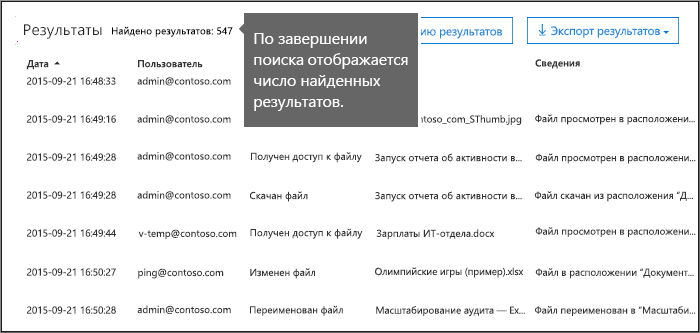
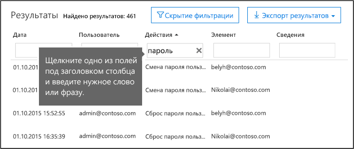
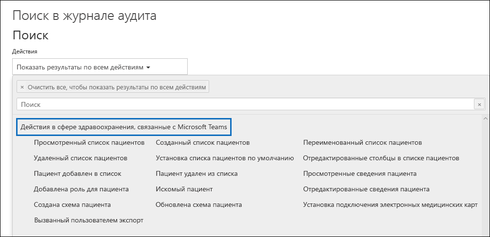

# <a name="search-the-audit-log-in-the-compliance-center"></a>Поиск в журнале аудита в Центре соответствия требованиям

Хотите узнать, просматривал ли пользователь определенный документ или удалил ли он какой-либо элемент из своего почтового ящика? В этом случае можно выполнить поиск по единому журналу аудита в Центре соответствия требованиям Microsoft 365, чтобы просмотреть действия пользователей и администраторов в организации. Единый журнал аудита удобен тем, что в нем можно искать данные по следующим типам [действий пользователей и администраторов](#audited-activities) в Microsoft 365:

- действия пользователей в SharePoint Online и OneDrive для бизнеса;

- активность пользователей в Exchange Online (журнал аудита почтовых ящиков Exchange);

- активность администраторов в SharePoint Online;

- активность администраторов в Azure Active Directory (служба каталогов для Microsoft 365);

- активность администраторов в Exchange Online (журнал аудита действий администратора Exchange);

- активность по обнаружению электронных данных в Центре безопасности и соответствия требованиям;

- активность пользователей и администраторов в Power BI;

- активность пользователей и администраторов в Microsoft Teams;

- активность пользователей и администраторов в Dynamics 365;

- активность пользователей и администраторов в Yammer;

- активность пользователей и администраторов в Microsoft Power Automate;

- активность пользователей и администраторов в Microsoft Stream;

- активность аналитиков и администраторов в Рабочей аналитике (Майкрософт);

- активность пользователей и администраторов в Microsoft Power Apps;

- активность пользователей и администраторов в Microsoft Forms;

- активность пользователей и администраторов, связанная с метками конфиденциальности для сайтов, использующих SharePoint Online или Microsoft Teams.

## <a name="requirements-to-search-the-audit-log"></a>Требования для поиска в журнале аудита

Обязательно ознакомьтесь со следующими пунктами, прежде чем начать поиск в журнале аудита.

- Для поиска в журнале аудита вам (или другому администратору) необходимо сначала включить ведение этого журнала. Для этого щелкните ссылку **Включить ведение журнала аудита** на странице **Поиск в журнале аудита** в Центре безопасности и соответствия требованиям. (Если ее нет, это означает, что аудит для вашей организации уже включен.) После этого появится сообщение о том, что ведется подготовка журнала аудита и через несколько часов, когда она будет завершена, вы сможете начать поиск. Это потребуется сделать только один раз. Подробнее см. раздел [Включение и выключение поиска в журнале аудита](turn-audit-log-search-on-or-off.md).

  > [!NOTE]
  > Мы работаем над тем, чтобы аудит включался по умолчанию. Пока же вы можете включать его, как описано выше.

- Выполнять поиск в журнале аудита могут только те, кому назначена роль "Только просмотр журналов аудита" или "Журналы аудита". По умолчанию эти роли назначаются группам ролей "Управление соответствием требованиям" и "Управление организацией" на странице **Разрешения** в центре администрирования Exchange. Обратите внимание: глобальные администраторы Office 365 и Microsoft 365 автоматически добавляются в качестве участников в группу ролей "Управление организацией" в Exchange Online. Чтобы предоставить пользователю возможность поиска в журнале аудита с минимальным уровнем привилегий, можно создать в Exchange Online специальную группу ролей, добавить роль "Только просмотр журналов аудита" или "Журналы аудита", а затем и самого пользователя в качестве участника. Дополнительные сведения см. в статье [Управление группами ролей в Exchange Online](https://go.microsoft.com/fwlink/p/?LinkID=730688).

  > [!IMPORTANT]
  > Если назначить пользователю роль "Только просмотр журналов аудита" или "Журналы аудита" на странице **Разрешения** в Центре безопасности и соответствия требованиям, он не сможет выполнять поиск в журнале аудита. Разрешения должны быть назначены в Exchange Online. Это связано с тем, что базовый командлет, используемый для поиска в журнале аудита, является командлетом Exchange Online.

- Когда пользователь или администратор выполняет действие, подлежащее аудиту, в журнале аудита вашей организации создается и сохраняется запись аудита. Срок хранения записи аудита (и возможность ее поиска в журнале аудита) зависит от вашей подписки на Office 365 или Microsoft 365 корпоративный, и, в частности, от типа лицензии, назначенной определенным пользователям.

  - Для пользователей, которым назначена лицензия на Office 365 E5 или Microsoft 365 E5 (или лицензия на Соответствие требованиям Microsoft 365 E5 или Обнаружение электронных данных Microsoft 365 E5 и надстройку "Аудит"), записи аудита о действиях в Azure Active Directory, Exchange и SharePoint по умолчанию хранятся один год. Организации могут также создавать политики хранения журнала аудита, чтобы хранить записи аудита о действиях в других службах до одного года. Дополнительные сведения см. в статье [Управление политиками хранения журнала аудита](audit-log-retention-policies.md).

    > [!NOTE]
    > Если ваша организация принимала участие в конфиденциальной ознакомительной программе хранения записей аудита в течение одного года, срок хранения записей аудита, которые были созданы до даты выпуска общедоступной версии, не будет сброшен.

  - Для пользователей, которым назначена какая-либо другая (не E5) лицензия на Office 365 или Microsoft 365, записи аудита хранятся в течение 90 дней. Список подписок на Office 365 и Microsoft 365, поддерживающих ведение журнала аудита, размещен в [описании работы центра безопасности и соответствия требованиям](https://docs.microsoft.com/office365/servicedescriptions/office-365-platform-service-description/office-365-securitycompliance-center).

    > [!NOTE]
    > Даже в тех случаях, когда аудит почтовых ящиков включен по умолчанию, вы можете заметить, что события аудита почтового ящика для некоторых пользователей не обнаруживаются при поиске в журнале аудита в Центре безопасности и соответствия требованиям или с помощью API действий управления Office 365. Подробнее об этом см. в разделе [Дополнительные сведения о журнале аудита почтовых ящиков](enable-mailbox-auditing.md#more-information).

- Если вы хотите отключить поиск в журнале аудита для своей организации, вы можете запустить следующую команду в оболочке для удаленного сеанса PowerShell, подключенной к вашей организации в Exchange Online:

  ```powershell
  Set-AdminAuditLogConfig -UnifiedAuditLogIngestionEnabled $false
  ```

    Чтобы снова включить поиск в журнале аудита, можно выполнить в Exchange Online PowerShell следующую команду:

  ```powershell
  Set-AdminAuditLogConfig -UnifiedAuditLogIngestionEnabled $true
  ```

  Для получения дополнительной информации см. [Отключение поиска в журнале аудита](turn-audit-log-search-on-or-off.md).

- Как говорилось выше, для поиска в журнале аудита в качестве базового используется командлет Exchange Online **Search-UnifiedAuditLog**. Это означает, что его можно использовать для поиска в журнале аудита вместо страницы **Поиск в журнале аудита** в Центре безопасности и соответствия требованиям. Этот командлет необходимо запустить в оболочке для удаленного сеанса PowerShell, подключенной к вашей организации в Exchange Online. Дополнительные сведения см. в разделе [Search-UnifiedAuditLog](https://go.microsoft.com/fwlink/p/?linkid=834776).

  Сведения об экспорте результатов поиска, возвращаемых командлетом **Search-UnifiedAuditLog**, в CSV-файл см. в разделе "Советы по экспорту и просмотру журнала аудита" статьи [Экспорт, настройка и просмотр записей журнала аудита](export-view-audit-log-records.md#tips-for-exporting-and-viewing-the-audit-log).

- Для скачивания данных из журнала аудита программным путем рекомендуем воспользоваться API действий управления Office 365, а не сценарий PowerShell. API действий управления Office 365 — это веб-служба REST, с помощью которой можно разрабатывать решения по мониторингу работоспособности, безопасности и соответствия требованиям в вашей организации. Дополнительные сведения см. в статье [Справочник по API действий управления Office 365](https://docs.microsoft.com/office/office-365-management-api/office-365-management-activity-api-reference).

- Запись журнала аудита отображается в результатах поиска в журнале не позже чем через 30 минут или 24 после наступления соответствующего события. В таблице ниже показано время ее отображения для разных служб в Office 365.

  |Служба или компонент Microsoft 365|30 минут|24 часа|
  |:-----|:-----:|:-----:|
  |Defender для Office 365 и Threat Intelligence|||
  |Azure Active Directory (события входа пользователей)|||
  |Azure Active Directory (события администрирования)|||
  |Защита от потери данных|||
  |Dynamics 365 CRM|||
  |Обнаружение электронных данных|||
  |Exchange Online|||
  |Microsoft Power Automate|||
  |Microsoft Project|||
  |Microsoft Stream|||
  |Microsoft Teams|||
  |Power Apps|||
  |Power BI|||
  |Центр безопасности и соответствия требованиям|||
  |Метки конфиденциальности|||
  |SharePoint Online и OneDrive для бизнеса|||
  |Рабочая аналитика|||
  |Yammer||||
  |Microsoft Forms||
  ||||

- Azure Active Directory (Azure AD) — это служба каталогов для Office 365. Единый журнал аудита содержит информацию о действиях, связанных с пользователями, группами, приложениями, доменами и каталогами в Центре администрирования Microsoft 365 или на портале управления Azure. Полный список событий Azure AD см. в статье [События в отчете об аудите Azure Active Directory](https://go.microsoft.com/fwlink/p/?LinkID=616549).

- Ведение журнала аудита для Power BI по умолчанию не включено. Чтобы в журнале аудита можно было искать действия, связанные с Power BI, необходимо включить ведение аудита на портале администрирования Power BI. Инструкции см. в разделе "Журналы аудита" [портала администрирования Power BI](https://docs.microsoft.com/power-bi/service-admin-portal#audit-logs).

## <a name="search-the-audit-log"></a>Поиск в журнале аудита

> [!NOTE]
> С 22 октября по 6 ноября 2020 г. существовала проблема с недоступностью действий, связанных с Azure AD, для средства поиска в журнале аудита. В их число входят действия по управлению пользователями Azure AD, группами, приложениями, ролями и каталогами. Отсутствующие события за указанный период станут доступны в ближайшие дни, завершение ожидается не позднее 20 ноября 2020 г. В некоторых случаях возможно дублирование данных о событии, созданных в период с 26 октября по 5 ноября 2020 г.
    
Для поиска в журнале аудита в Office 365 необходимо выполнить следующие шаги.

[Шаг 1. Запуск поиска по журналу аудита](#step-1-run-an-audit-log-search)

[Шаг 2. Просмотр результатов поиска](#step-2-view-the-search-results)

[Шаг 3. Фильтрация результатов поиска](#step-3-filter-the-search-results)

[Шаг 4. Экспорт результатов поиска в файл](#step-4-export-the-search-results-to-a-file)

### <a name="step-1-run-an-audit-log-search"></a>Шаг 1. Выполнение поиска по журналу аудита

1. Перейдите по ссылке [https://protection.office.com](https://protection.office.com).

    > [!TIP]
    > Используйте конфиденциальный, а не обычный, сеанс доступа к Центру безопасности и соблюдения требований, так как в этом случае не будут использованы учетные данные, с которыми вы вошли в систему. Чтобы открыть сеанс в режиме просмотра InPrivate в Internet Explorer или Microsoft Edge, нажмите клавиши CTRL+SHIFT+P. Чтобы открыть конфиденциальный сеанс в Google Chrome (окно в режиме инкогнито), нажмите CTRL+SHIFT+N.

2. Выполните вход с помощью своей рабочей или учебной учетной записи.

3. В расположенной слева области Центра безопасности и соответствия требованиям щелкните **Поиск** и выберите пункт **Поиск в журнале аудита**.

    Откроется страница **Поиск в журнале аудита**.

    

    > [!NOTE]
    > Для поиска в журнале аудита сначала нужно включить ведение этого журнала. Если отображается ссылка **Начать запись действий пользователя и администратора**, просто щелкните ее. Если ее нет, это означает, что аудит для вашей организации уже включен.

4. Настройте указанные ниже условия поиска.

   1. **Действия**. Щелкните раскрывающийся список, чтобы увидеть действия, по которым можно выполнять поиск. Действия пользователей и администраторов упорядочены по группам схожих действий. Вы можете выбрать отдельные действия или щелкнуть имя группы действий, чтобы выбрать все входящие в нее элементы. Можно также щелкнуть выбранное действие, чтобы отменить выбор. После завершения поиска в результатах будут показаны только записи журнала аудита, относящиеся к выбранным действиям. Если выбрать пункт **Показать результаты по всем действиям**, будут показаны результаты для всех действий, совершенных выбранным пользователем или группой пользователей.

      В журнал аудита вносятся более 100 действий пользователей и администраторов. Чтобы просмотреть список описаний всех действий для каждой службы, щелкните вкладку **Действия, подлежащие аудиту** в начале этой статьи.

   1. **Дата начала** и **Дата окончания**. По умолчанию выбраны последние семь дней. Выберите диапазон дат и времени, чтобы просмотреть события, которые произошли за этот период. Даты и время представлены в формате UTC. Максимальный диапазон дат, который можно указать, составляет 90 дней. Если выбранный диапазон превышает 90 дней, выводится сообщение об ошибке.

      > [!TIP]
      > Если вы используете максимальный диапазон, равный 90 дням, выберите для параметра **Дата начала** текущее время. В противном случае появится сообщение об ошибке из-за того, что дата начала предшествует дате окончания. Если вы включили аудит в течение последних 90 дней, начальная дата максимального диапазона не может предшествовать дате включения аудита.

   1. **Пользователи**. Щелкните это поле, а затем выберите одного или нескольких пользователей, для которых нужно показать результаты. В списке результатов приводятся записи журнала аудита для выбранного действия, выполненного пользователями, выбранными в этом поле. Чтобы получить результаты для всех пользователей (и учетных записей служб) в организации, оставьте это поле пустым.

   1. **Файл, папка или сайт**. Введите имя файла или папки либо его часть, чтобы найти действия, связанные с этим файлом или папкой, содержащие указанное ключевое слово. Вы также можете указать URL-адрес файла или папки. Если вы вводите URL-адрес, убедитесь в том, что путь URL введен полностью, а если вы вводите только часть URL-адреса, не указывайте в нем специальные знаки и пробелы.

      Чтобы получить результаты для всех файлов и папок в организации, оставьте это поле пустым.

      > [!TIP]
      >
      > - Если вы ищете все действия, связанные с **сайтом**, добавьте подстановочный знак (\*) после URL-адреса, чтобы вернуть все записи для этого сайта. Например: `"https://contoso-my.sharepoint.com/personal*"`.
      >
      > - Если вы ищете все действия, связанные с **файлом**, добавьте подстановочный знак (\*) перед именем файла, чтобы вернуть все записи для этого файла. Например: `"*Customer_Profitability_Sample.csv"`.

5. Чтобы выполнить поиск по указанным условиям, нажмите кнопку **Поиск**. 

   Результаты поиска загружаются и через несколько секунд отображаются в области **Результаты**. По завершении поиска отображается число найденных результатов. В области **Результаты** выводится не более 5000 событий с шагом 150. Если условиям поиска соответствует большее число результатов, отображаются только последние 5000 событий.

   

#### <a name="tips-for-searching-the-audit-log"></a>Советы по выполнению поиска в журнале аудита

- Вы можете выбрать искомые действия, щелкнув их имена. Также можно выполнить поиск всех действий, входящих в группу (например, **Действия с файлами и папками**), щелкнув ее имя. Если действие выбрано, можно щелкнуть его, чтобы отменить выбор. В поле поиска также можно просмотреть действия, содержащие введенное ключевое слово.

  

- Чтобы увидеть события из журнала аудита действий администратора Exchange, нужно выбрать в списке **Действия** пункт **Показать результаты по всем действиям**. В результатах поиска для событий из этого журнала аудита в столбце **Действие** указываются имена командлетов (например, **Set-Mailbox**). Для получения дополнительных сведений откройте в этой статье вкладку **Действия, подлежащие аудиту** и щелкните ссылку **Действия администратора Exchange**.

  Для некоторых действий аудита нет соответствующих элементов в списке **Действия**. Если вам известно имя операции для этих действий, вы можете выполнить поиск всех действий, затем отфильтровать результаты, введя имя операции в поле для столбца **Действие**. Дополнительные сведения о фильтрации результатов см. в разделе [Шаг 3. Фильтрация результатов поиска](#step-3-filter-the-search-results).

- Чтобы удалить текущие условия поиска, нажмите кнопку **Очистить**. Диапазон дат сбрасывается на значение по умолчанию (последние семь дней). Чтобы отменить выбор всех действий, можно нажать кнопку **Снять выделение для просмотра результатов по всем действиям**.

- Если найдено 5000 результатов, возможно, условиям поиска соответствует более 5000 событий. Вы можете уточнить условия и повторно выполнить поиск, чтобы получить меньше результатов, или экспортировать все результаты поиска, выбрав **Экспорт результатов** \> **Скачать все результаты**.

### <a name="step-2-view-the-search-results"></a>Шаг 2. Просмотр результатов поиска

Результаты поиска в журнале аудита выводятся в области **Результаты** на странице **Поиск в журнале аудита**. Как уже было сказано, отображаются 5000 самых последних событий с шагом 150. Чтобы увидеть больше событий, воспользуйтесь полосой прокрутки в области **Результаты** или нажмите клавиши **SHIFT+END** для отображения следующих 150 событий.

В результатах приводятся указанные ниже сведения о каждом событии, возвращенном поиском.

- **Дата**. Дата и время наступления события (в формате UTC).

- **IP-адрес**. IP-адрес устройства, которое использовалось во время записи действия в журнал. IP-адрес отображается в формате IPv4 или IPv6.

   > [!NOTE]
  > Для некоторых служб значение, отображаемое в этом поле, может быть IP-адресом доверенного приложения (например, веб-приложений Office), обращающегося в службу от имени пользователя, а не IP-адресом устройства пользователя, выполнившего действие. Кроме того, для действий администратора (или действий, выполняемых системной учетной записью) при событиях, связанных с Azure Active Directory, IP-адрес не записывается в журнал, а в этом поле отображается значение `null`.

- **Пользователь**. Пользователь (или учетная запись службы), который выполнил действие, вызвавшее событие.

- **Действие**. Действие, выполненное пользователем. Это значение соответствует действиям, выбранным в раскрывающемся списке **Действия**. Для события из журнала аудита действий администратора Exchange значение в этом столбце представляет собой командлет Exchange.

- **Элемент**. Объект, созданный или измененный в результате соответствующего действия. Это может быть, например, просмотренный или измененный файл либо обновленная учетная запись пользователя. Не для всех действий в этом столбце содержится значение.

- **Сведения**. Дополнительные сведения о действии. И в этом случае не для всех действий имеется значение.

> [!TIP]
> Чтобы отсортировать результаты, щелкните заголовок столбца в области **Результаты**. Результаты можно отсортировать в алфавитном порядке по возрастанию или убыванию. Чтобы отсортировать результаты от самых старых к самым новым или наоборот, щелкните заголовок **Дата**.

#### <a name="view-the-details-for-a-specific-event"></a>Просмотр сведений об определенном событии

Чтобы просмотреть дополнительные сведения о событии, можно щелкнуть запись о нем в списке результатов поиска. Откроется страница **Сведения** с подробными свойствами, содержащимися в записи о событии. Набор отображаемых свойств зависит от службы, в которой произошло событие. Чтобы просмотреть эту информацию, щелкните **Дополнительные сведения**. Описания см. в статье [Подробные свойства в журнале аудита](detailed-properties-in-the-office-365-audit-log.md).


### <a name="step-3-filter-the-search-results"></a>Шаг 3. Фильтрация результатов поиска

Помимо сортировки результатов поиска в журнале аудита их также можно отфильтровать. Это отличная возможность, позволяющая быстро получить результаты, которые относятся к определенному пользователю или действию. Вы можете сначала создать более обширный запрос, а затем быстро отфильтровать результаты, чтобы увидеть определенные события. Затем вы можете сузить условия и выполнить поиск повторно, чтобы получить более конкретный набор результатов.

Чтобы отфильтровать результаты, выполните указанные ниже действия.

1. Запустите поиск по журналу аудита.

2. Когда появятся результаты, нажмите кнопку **Показать фильтрацию результатов**.

   Под заголовком каждого столбца приводятся поля ключевых слов.

3. Щелкните одно из полей под заголовком столбца и введите слово или фразу в зависимости от столбца, по которому осуществляется фильтрация. Результаты автоматически изменятся в соответствии с условием фильтра.

   

4. Чтобы очистить фильтр, щелкните значок **X** в поле фильтра или нажмите кнопку **Скрыть фильтрацию**.

> [!TIP]
> Чтобы просмотреть события из журнала аудита действий администратора Exchange, введите **-** (тире) в поле фильтра **Действие**. Будут показаны имена командлетов, отображаемые в столбце **Действие** для действий администратора Exchange. Затем можно отсортировать имена командлетов по алфавиту.

### <a name="step-4-export-the-search-results-to-a-file"></a>Шаг 4. Экспорт результатов поиска в файл

Результаты поиска по журналу аудита можно экспортировать в файл с разделителями-запятыми (CSV) на компьютере. Этот файл можно открыть в Microsoft Excel и использовать такие возможности, как поиск, сортировка, фильтрация и разделение одного столбца (содержащего ячейки с несколькими свойствами) на несколько.

1. Выполните поиск в журнале аудита, а затем изменяйте условия поиска, пока не получите нужные результаты.

2. Нажмите кнопку **Экспорт результатов** и выберите один из указанных ниже вариантов.

   - **Сохранить загруженные результаты**. Выберите этот вариант, чтобы экспортировать только те записи, которые отображаются на странице **Поиск в журнале аудита** в области **Результаты**. Скачанный CSV-файл содержит те же столбцы (и данные), которые отображаются на странице ("Дата", "Пользователь", "Действие", "Элемент" и "Сведения"). В CSV-файл также включается дополнительный столбец (с заголовком **Дополнительно**), который содержит дополнительную информацию из записи журнала аудита. Поскольку вы экспортируете результаты, загруженные (и отображаемые) на странице **Поиск в журнале аудита**, файл содержит не более 5000 записей.

   - **Скачать все результаты**. Выберите этот вариант, чтобы экспортировать все записи журнала аудита, отвечающие условиям поиска. Если количество результатов поиска превышает 5000, выберите этот вариант, чтобы скачать все записи, а не только отображаемые на странице **Поиск в журнале аудита**. При этом в CSV-файл загружаются необработанные данные из журнала аудита, а в столбце **AuditData** будут содержаться дополнительные сведения из записей журнала аудита. Если выбрать этот вариант экспорта, скачивание может занять много времени, так как файл может быть гораздо больше, чем в первом случае.

     > [!IMPORTANT]
     > В CSV-файл можно загрузить до 50 000 записей результатов одной операции поиска в журнале аудита. Если в CSV-файл загружено 50 000 записей, можно предположить, что условиям поиска соответствует более 50 000 событий. Чтобы обойти это ограничение и экспортировать больше записей, попробуйте указать диапазон дат, позволяющий сократить количество записей из журнала. Чтобы экспортировать больше 50 000 записей, вы можете выполнить поиск несколько раз со смежными диапазонами дат.

3. После выбора варианта экспорта в нижней части окна появляется сообщение с запросом на открытие CSV-файла, сохранение его в папку "Загрузки" или сохранение в другую выбранную папку.

#### <a name="more-information-about-exporting-and-viewing-audit-log-search-results"></a>Дополнительные сведения об экспорте и просмотре результатов поиска в журнале аудита

- Если вы скачали все результаты поиска, CSV-файл содержит столбец под названием **AuditData**, содержащий дополнительные сведения о каждом событии. Данные в этом столбце представляют собой объект JSON, содержащий несколько свойств из записи в журнале аудита. Каждая пара *свойство:значение* в этом объекте JSON отделяется запятой. Вы можете воспользоваться инструментом преобразования JSON в редакторе Power Query для Excel, чтобы разбить столбец **AuditData** на несколько столбцов так, чтобы каждому свойству в объекте JSON соответствовал свой столбец. Это позволит выполнять сортировку и фильтрацию по одному или нескольким из этих свойств. Пошаговые инструкции по преобразованию объекта JSON с помощью редактора Power Query см. в [Экспорт, настройка и просмотр записей журнала аудита](export-view-audit-log-records.md).

  После разделения столбца **AuditData** вы можете отфильтровать данные по столбцу **Operations**, чтобы увидеть подробную информацию для действий того или иного типа.

- При выборе варианта **Скачать все результаты** в CSV-файле сохраняются необработанные данные из журнала аудита. Имена столбцов в этом файле (CreationDate, UserIds, Operation, AuditData) отличаются от имен в файле, скачиваемом при выборе варианта **Сохранить загруженные результаты**. Значения для одного и того же действия в этих двух CSV-файлах также могут различаться. Так, значение в столбце **Действие** в CSV-файле (например, MailboxLogin) может отличаться от более понятного названия действия в столбце **Действие** на странице **Поиск в журнале аудита** (например, "Пользователь открыл почтовый ящик").

- Если вы скачали все результаты поискового запроса, в которых содержатся события из разных служб, то столбец **AuditData** в CSV-файле содержит разные свойства в зависимости от того, в какой службе было выполнено действие. Например, записи из журналов аудита Exchange и Azure AD включают свойство с именем **ResultStatus**, которое указывает, было ли действие выполнено успешно. Этого свойства нет у событий в SharePoint. В свою очередь, события SharePoint имеют свойство, в котором указывается URL-адрес сайта для действий, связанных с файлами и папками. Чтобы избежать этого, рекомендуем для экспорта результатов по каждой отдельной службе выполнять поиск снова.

  Описание многих свойств, перечисленных в столбце **AuditData** в файле CSV при загрузке всех результатов и службы, к которой относится каждый из них, см. в разделе [Подробные свойства в журнале аудита](detailed-properties-in-the-office-365-audit-log.md).

## <a name="audited-activities"></a>Действия, подлежащие аудиту

В таблицах этого раздела описаны действия, подлежащие аудиту в Office 365. Эти события можно найти, выполнив поиск в журнале аудита в центре безопасности и соблюдения требований.

В каждой таблице собраны схожие действия и действия в определенной службе. В таблицах указаны понятное имя, которое отображается в раскрывающемся списке **Действия**, и имя соответствующей операции, которое отображается в подробных данных записи аудита и в CSV-файле при экспорте результатов поиска. Описание подробных данных см. в статье [Подробные сведения о свойствах в журнале аудита](detailed-properties-in-the-office-365-audit-log.md).

Чтобы перейти к определенной таблице, щелкните одну из ссылок.

:::row:::
    :::column:::
        [Действия, связанные с файлами и страницами](#file-and-page-activities)
    :::column-end:::
    :::column:::
        [Действия, связанные с папками](#folder-activities)
    :::column-end:::
    :::column:::
        [Действия, связанные со списками SharePoint](#sharepoint-list-activities)
    :::column-end:::
:::row-end:::

:::row:::
    :::column:::
        [Действия, связанные с общим доступом и запросами на доступ](#sharing-and-access-request-activities)
    :::column-end:::
    :::column:::
        [Действия, связанные с синхронизацией](#synchronization-activities)
    :::column-end:::
    :::column:::
        [Действия, связанные с разрешениями для сайтов](#site-permissions-activities)
    :::column-end:::
:::row-end:::

:::row:::
    :::column:::
        [Действия, связанные с администрированием сайта](#site-administration-activities)
    :::column-end:::
    :::column:::
        [Действия, связанные с почтовыми ящиками Exchange](#exchange-mailbox-activities)
    :::column-end:::
    :::column:::
        [Действия, связанные с администрированием пользователей](#user-administration-activities)
    :::column-end:::
:::row-end:::

:::row:::
    :::column:::
        [Действия, связанные с администрированием групп Azure AD](#azure-ad-group-administration-activities)
    :::column-end:::
    :::column:::
        [Действия, связанные с администрированием приложений](#application-administration-activities)
    :::column-end:::
    :::column:::
        [Действия, связанные с администрированием ролей](#role-administration-activities)
    :::column-end:::
:::row-end:::

:::row:::
    :::column:::
        [Действия, связанные с администрированием каталогов](#directory-administration-activities)
    :::column-end:::
    :::column:::
        [Действия, связанные с обнаружением электронных данных](#ediscovery-activities)
    :::column-end:::
    :::column:::
        [Действия, связанные с Advanced eDiscovery](#advanced-ediscovery-activities)
    :::column-end:::
:::row-end:::

:::row:::
    :::column:::
        [Действия, связанные с Power BI](#power-bi-activities)
    :::column-end:::
    :::column:::
        [Рабочая аналитика (Майкрософт)](#microsoft-workplace-analytics-activities)
    :::column-end:::
    :::column:::
        [Действия, связанные с Microsoft Teams](#microsoft-teams-activities)
    :::column-end:::
:::row-end:::

:::row:::
    :::column:::
        [Действия в сфере здравоохранения, связанные с Microsoft Teams](#microsoft-teams-healthcare-activities)
    :::column-end:::
    :::column:::
        [Действия, связанные с приложением "Смены" в Microsoft Teams](#microsoft-teams-shifts-activities)
    :::column-end:::
    :::column:::
        [Действия, связанные с Yammer](#yammer-activities)
    :::column-end:::
:::row-end:::

:::row:::
    :::column:::
        [Действия, связанные с Microsoft Power Automate](#microsoft-power-automate-activities)
    :::column-end:::
    :::column:::
        [Действия, связанные с Microsoft Power Apps](#microsoft-power-apps-activities)
    :::column-end:::
    :::column:::
        [Действия, связанные с Microsoft Stream](#microsoft-stream-activities)
    :::column-end:::
:::row-end:::

:::row:::
    :::column:::
        [Действия, связанные с обозревателем содержимого](#content-explorer-activities)
    :::column-end:::
    :::column:::
        [Карантинная деятельность](#quarantine-activities)
    :::column-end:::
    :::column:::
        [Действия Microsoft Forms](#microsoft-forms-activities)
    :::column-end:::
:::row-end:::

:::row:::
    :::column:::
        [Действия с метками конфиденциальности](#sensitivity-label-activities)
    :::column-end:::
    :::column:::
        [Действия, связанные с политикой хранения и метками хранения](#retention-policy-and-retention-label-activities)
    :::column-end:::
    :::column:::
        [Действия администратора Exchange](#exchange-admin-audit-log)
    :::column-end:::
:::row-end:::

### <a name="file-and-page-activities"></a>Действия, связанные с файлами и страницами

В таблице ниже описаны действия, связанные с файлами и страницами в SharePoint Online и OneDrive для бизнеса.

|Понятное имя|Операция|Описание|
|:-----|:-----|:-----|
|Получен доступ к файлу|FileAccessed|Учетная запись пользователя или системы обращается к файлу.|
|(нет)|FileAccessedExtended|Эта операция связана с действием "Получен доступ к файлу" (FileAccessed). Событие FileAccessedExtended регистрируется, когда один и тот же пользователь постоянно обращается к файлу в течение длительного периода (до 3 часов). <br/><br/> События FileAccessedExtended позволяют уменьшить число событий FileAccessed, регистрируемых при постоянном обращении к файлу. Это помогает избавиться от эффекта, при котором одному фактическому действию пользователя соответствует множество записей FileAccessed, и обратить внимание на исходное (более важное) событие FileAccessed.|
|Изменена метка хранения файла|ComplianceSettingChanged|Метка хранения была применена к документу или удалена из него. Это событие инициируется, когда метка хранения вручную или автоматически применяется к сообщению.|
|Статусу записи присвоено новое значение: "заблокирована"|LockRecord|Статус записи, посредством которого метка хранения определяет документ как запись, был заблокирован. Это означает, что документ нельзя изменить или удалить. Изменить статус записи, присвоенный документу, могут только пользователи, у которых есть разрешение как минимум на уровне участника сайта.|
|Статусу записи присвоено новое значение: "разблокирована"|UnlockRecord|Статус записи, посредством которого метка хранения определяет документ как запись, был разблокирован. Это означает, что документ можно изменить или удалить. Изменить статус записи, присвоенный документу, могут только пользователи, у которых есть разрешение как минимум на уровне участника сайта.|
|Файл записан после изменения|FileCheckedIn|Пользователь записывает после изменения документ, извлеченный из библиотеки документов.|
|Извлечен файл|FileCheckedOut|Пользователь получает для изменения документ, находящийся в библиотеке документов. Пользователи могут извлекать и изменять документы, к которым им предоставлен доступ.|
|Скопирован файл|FileCopied|Пользователь копирует документ с сайта. Скопированный файл можно сохранить в другой папке на сайте.|
|Удален файл|FileDeleted|Пользователь удаляет документ с сайта.|
|Файл удален из корзины|FileDeletedFirstStageRecycleBin|Пользователь удаляет файл из корзины сайта.|
|Файл удален из корзины второго уровня|FileDeletedSecondStageRecycleBin|Пользователь удаляет файл из корзины второго уровня на сайте.|
|Удаленный файл, помеченный как запись|RecordDelete|Документ или сообщение, помеченное как запись, было удалено. Элемент считается записью, если к его содержимому применена метка хранения, которая помечает элемент как запись.|
|Обнаружено несоответствие меток конфиденциальности документа|DocumentSensitivityMismatchDetected|Пользователь отправляет документ на сайт, защищенный с помощью метки конфиденциальности, и метка конфиденциальности документа имеет более высокий приоритет, чем метка конфиденциальности, примененная к сайту. Например, документ с меткой "Конфиденциально" отправляется на сайт с меткой "Общее".<br/><br/> Это событие не инициируется, если метка конфиденциальности документа имеет более низкий приоритет, чем метка конфиденциальности, примененная к сайту. Например, документ с меткой "Общее" отправляется на сайт с меткой "Конфиденциально". Дополнительные сведения о приоритете меток конфиденциальности см. в разделе [Приоритет метки (порядок важен)](sensitivity-labels.md#label-priority-order-matters).|
|Обнаружена вредоносная программа в файле|FileMalwareDetected|Антивирусная подсистема SharePoint обнаружила вредоносную программу в файле.|
|Отменено извлечение файла|FileCheckOutDiscarded|Пользователь отменяет получение файла для изменения. Это означает, что все изменения, внесенные в полученный файл, отменяются и не сохраняются в версии документа в библиотеке документов.|
|Скачан файл|FileDownloaded|Пользователь скачивает документ с сайта.|
|Изменен файл|FileModified|Учетная запись пользователя или системы изменяет содержимое или свойства документа на сайте.|
|(нет)|FileModifiedExtended|Эта операция связана с действием "Изменен файл" (FileModified). Событие FileModifiedExtended регистрируется, когда один и тот же пользователь постоянно изменяет файл в течение длительного периода (до 3 часов). <br/><br/> События FileModifiedExtended позволяют уменьшить число событий FileModified, регистрируемых при постоянном изменении файла. Это помогает избавиться от эффекта, при котором одному фактическому действию пользователя соответствует множество записей FileModified, и обратить внимание на исходное (более важное) событие FileModified.|
|Перемещен файл|FileMoved|Пользователь перемещает документ из текущего места на сайте в новое.|
|(нет)|FilePreviewed|Пользователь предварительно просматривает файл на сайте SharePoint или OneDrive для бизнеса. Такие события обычно происходят в больших количествах в на основе одного действия, например при просмотре коллекции изображений.|
|Выполнен поисковый запрос|SearchQueryPerformed|Пользователь или системная учетная запись выполняет поиск в SharePoint или OneDrive для бизнеса. К распространенным сценариям выполнения поискового запроса учетной записью службы относится применение удержания электронных данных и политики хранения к сайтам и учетным записям OneDrive, а также автоматическое применение меток хранения и конфиденциальности к содержимому сайта.|
|Помещены в корзину все промежуточные версии файла|FileVersionsAllMinorsRecycled|Пользователь удаляет все промежуточные версии файла из журнала версий. Удаленные версии перемещаются в корзину сайта.|
|Помещены в корзину все версии файла|FileVersionsAllRecycled|Пользователь удаляет все версии файла из журнала версий. Удаленные версии перемещаются в корзину сайта.|
|Помещена в корзину версия файла|FileVersionRecycled|Пользователь удаляет версию файла из журнала версий. Удаленная версия перемещается в корзину сайта.|
|Переименован файл|FileRenamed|Пользователь переименовывает документ на сайте.|
|Восстановлен файл|FileRestored|Пользователь восстанавливает документ из корзины на сайте.|
|Выложен файл|FileUploaded|Пользователь отправляет документ в папку на сайте.|
|Просмотрена страница|PageViewed|Пользователь просматривает страницу на сайте. К этому не относится использование веб-браузера для просмотра файлов, размещенных в библиотеке документов.|
|(нет)|PageViewedExtended|Эта операция связана с действием "Просмотрена страница" (PageViewed). Событие PageViewedExtended регистрируется, когда один и тот же пользователь постоянно просматривает веб-страницу в течение длительного периода (до 3 часов). <br/><br/> События PageViewedExtended позволяют уменьшить число событий PageViewed, регистрируемых при постоянном просмотре страницы. Это помогает избавиться от эффекта, при котором одному фактическому действию пользователя соответствует множество записей PageViewed, и обратить внимание на исходное (более важное) событие PageViewed.|
|Клиент просигнализировал о просмотре|ClientViewSignaled|Клиент пользователя (например, веб-сайт или мобильное приложение) просигнализировал, что указанная страница была просмотрена пользователем. Это действие часто записывается в журнал после события PagePrefetched для страницы.<br/><br/>**ПРИМЕЧАНИЕ**. Так как сигнал о событиях ClientViewSignaled подается клиентом, а не сервером, событие может не регистрироваться сервером, поэтому оно может не отображаться в журнале аудита. Также возможно, что информация в записи аудита недостоверна. Но так как удостоверение пользователя проверяется с помощью маркера, использованного для создания сигнала, удостоверение пользователя, указанное в соответствующей записи аудита, является правильным. |
|(нет)|PagePrefetched|Клиент пользователя (например, веб-сайт или мобильное приложение) запросил указанную страницу, чтобы повысить производительность на случай ее просмотра пользователем. Это событие записывается в журнал, чтобы указать, что содержимое страницы было предоставлено клиенту пользователя. Это событие не является точным индикатором, что пользователь переходил на страницу. <br/><br/> Когда содержимое страницы отображается клиентом (по запросу пользователя), должно создаваться событие ClientViewSignaled. Не все клиенты поддерживают указание предварительного извлечения, поэтому некоторые действия предварительной загрузки могут быть занесены в журнал в виде событий PageViewed.|
||||

#### <a name="frequently-asked-questions-about-fileaccessed-and-filepreviewed-events"></a>Часто задаваемые вопросы о событиях FileAccessed и FilePreviewed

**Могут ли какие-либо действия, не связанные с пользователем, запустить записи аудита FilePreviewed, содержащие агент пользователя типа "OneDriveMpc-Transform_Thumbnail"?**

Нам не известны сценарии, в которых действия, не связанные с пользователем, вызывают такие события. Действия пользователей, такие как открытие карточки профиля пользователя (нажатием имени или адреса электронной почты в сообщении в Outlook в Интернете), могут вызывать похожие события.

**Всегда ли вызовы OneDriveMpc-Transform_Thumbnail намеренно выполняются пользователем?**

Нет. Но похожие события могут фиксироваться в журнале в результате предварительной загрузки браузера.

**Если событие FilePreviewed происходит из IP-адреса, зарегистрированного корпорацией Майкрософт, означает ли это, что имел место предварительный просмотр на экране устройства пользователя?**

Нет. Это событие могло быть записано в журнал в результате предварительной загрузки браузера.

**Существуют ли сценарии, в которых предварительный просмотр документа пользователем вызывает события FileAccessed?**

Оба события FilePreviewed и FileAccessed указывают на то, что результатом пользовательского вызова стало считывание файла (или эскиза этого файла). Хотя эти события должны соответствовать намерению предварительного просмотра и намерению доступа, различение событий не гарантирует определение намерения пользователя.

#### <a name="the-appsharepoint-user-in-audit-records"></a>Пользователь app\@sharepoint в записях аудита

В записях аудита для некоторых действий с файлами (и других действий, связанных с SharePoint) вы можете заметить, что пользователем, выполнившим действие (указывается в полях User и UserId), является app@sharepoint. Это означает, что "пользователем", выполнившим действие, было приложение. В этом случае приложению были предоставлены разрешения в SharePoint для выполнения действий на уровне организации (например, поиск сайта SharePoint или учетной записи OneDrive) от имени пользователя, администратора или службы. Этот процесс предоставления разрешений приложению называется доступом *с помощью контекста приложения SharePoint*. Это означает, что проверка подлинности, представленная для SharePoint с целью выполнения действия, была осуществлена приложением, а не пользователем. Дополнительные сведения см. в статье [Предоставление доступа к SharePoint с использованием контекста приложения](https://docs.microsoft.com/sharepoint/dev/solution-guidance/security-apponly-azureacs).

Например, app@sharepoint часто указывается в качестве пользователя для событий "Выполнен поисковый запрос" и "Получен доступ к файлу". Это связано с тем, что приложение, имеющее в вашей организации доступ в контексте приложения SharePoint, выполняет поисковые запросы и обращается к файлам при применении политик хранения к сайтам и учетным записям OneDrive.

Ниже представлено несколько других сценариев, в которых app@sharepoint может быть идентифицирован в записи аудита в качестве пользователя, выполнившего действие.

- Группы Microsoft 365. Когда пользователь или администратор создает группу, создаются записи аудита для создания семейства веб-сайтов, обновления списков и добавления участников в группу SharePoint. Эти задачи выполняются приложением от имени пользователя, создавшего группу.

- Microsoft Teams. Подобно группам Microsoft 365, записи аудита создаются для создания семейства сайтов, обновления списков и добавления участников в группу SharePoint при создании группы.

- Функции обеспечения соответствия требованиям. Когда администратор реализует функции обеспечения соответствия требованиям, такие как политики хранения, удержания электронных данных и автоматическое применение меток конфиденциальности.

В этих и других сценариях вы также заметите, что в течение короткого промежутка времени (часто с интервалом в несколько секунд) создается несколько записей аудита с указанием app@sharepoint в качестве пользователя. Это также означает, что они, вероятно, были инициированы той же задачей, созданной пользователем. Кроме того, поля ApplicationDisplayName и EventData в записи аудита могут помочь определить сценарий или приложение, запустившее событие.

### <a name="folder-activities"></a>Действия, связанные с папками

В таблице ниже описаны действия, связанные с папками в SharePoint Online и OneDrive для бизнеса. Как говорилось выше, в записях аудита для некоторых действий SharePoint указывается "пользователь" app@sharepoint, выполнивший действие от имени пользователя или администратора, инициировавшего действие. Дополнительные сведения см. в разделе [Пользователь app\@sharepoint в записях аудита](#the-appsharepoint-user-in-audit-records).

|Понятное имя|Операция|Описание|
|:-----|:-----|:-----|
|Скопирована папка|FolderCopied|Пользователь копирует папку из сайта в другое расположение в SharePoint или OneDrive для бизнеса.|
|Создана папка|FolderCreated|Пользователь создает папку на сайте.|
|Удалена папка|FolderDeleted|Пользователь удаляет папку с сайта.|
|Папка удалена из корзины|FolderDeletedFirstStageRecycleBin|Пользователь удаляет папку из корзины на сайте.|
|Папка удалена из корзины второго уровня|FolderDeletedSecondStageRecycleBin|Пользователь удаляет папку из корзины второго уровня на сайте.|
|Изменена папка|FolderModified|Пользователь изменяет папку на сайте. Это включает изменение метаданных папки, например тегов и свойств.|
|Перемещена папка|FolderMoved|Пользователь перемещает папку в другое расположение на сайте.|
|Переименована папка|FolderRenamed|Пользователь переименовывает папку на сайте.|
|Восстановлена папка|FolderRestored|Пользователь восстанавливает удаленную папку из корзины на сайте.|
||||

### <a name="sharepoint-list-activities"></a>Действия, связанные со списками SharePoint

В таблице ниже описаны действия, связанные с взаимодействием пользователей со списками и элементами списков в SharePoint Online. Как говорилось выше, в записях аудита для некоторых действий SharePoint указывается "пользователь" app@sharepoint, выполнивший действие от имени пользователя или администратора, инициировавшего действие. Дополнительные сведения см. в разделе [Пользователь app\@sharepoint в записях аудита](#the-appsharepoint-user-in-audit-records).

|Понятное имя|Операция|Описание|
|:-----|:-----|:-----|
|Создан список|ListCreated|Пользователь создал список SharePoint.|
|Создан столбец списка|ListColumnCreated|Пользователь создал столбец списка SharePoint. Столбец списка — это столбец, прикрепленный к одному или нескольким спискам SharePoint.|
|Создан тип контента списка|ListContentTypeCreated|Пользователь создал тип контента списка. Тип контента списка — это тип контента, прикрепленный к одному или нескольким спискам SharePoint.|
|Создан элемент списка|ListItemCreated|Пользователь создал элемент в существующем списке SharePoint.|
|Создан столбец сайта|SiteColumnCreated|Пользователь создал столбец сайта SharePoint. Столбец сайта — это столбец, не прикрепленный к списку. Столбец сайта также является структурой метаданных, которую можно использовать в любом списке на определенном веб-сайте.|
|Создан тип контента сайта|Создан объект ContentType сайта|Пользователь создал тип контента сайта. Тип контента сайта — это тип контента, прикрепленный к родительскому сайту.|
|Удален список|ListDeleted|Пользователь удалил список SharePoint.|
|Удален столбец списка|Столбец списка удален|Пользователь удалил столбец списка SharePoint.|
|Удален тип контента списка|ListContentTypeDeleted|Пользователь удалил тип контента списка.|
|Удален элемент списка|Элемент списка удален|Пользователь удалил элемент списка SharePoint.|
|Удален столбец сайта|SiteColumnDeleted|Пользователь удалил столбец сайта SharePoint.|
|Удален тип контента сайта|SiteContentTypeDeleted|Пользователь удалил тип контента сайта.|
|Перемещен в корзину элемент списка|ListItemRecycled|Пользователь переместил элемент списка SharePoint в корзину.|
|Восстановлен список|ListRestored|Пользователь восстановил список SharePoint из корзины.|
|Восстановлен элемент списка|ListItemRestored|Пользователь восстановил элемент списка SharePoint из корзины.|
|Обновлен список|ListUpdated|Пользователь обновил список SharePoint, изменив одно или несколько свойств.|
|Обновлен столбец списка|ListColumnUpdated|Пользователь обновил столбец списка SharePoint, изменив одно или несколько свойств.|
|Обновлен тип контента списка|ListContentTypeUpdated|Пользователь обновил тип контента списка, изменив одно или несколько свойств.|
|Обновлен элемент списка|ListItemUpdated|Пользователь обновил элемент списка SharePoint, изменив одно или несколько свойств.|
|Обновлен столбец сайта|SiteColumnUpdated|Пользователь обновил столбец сайта SharePoint, изменив одно или несколько свойств.|
|Обновлен тип контента сайта|SiteContentTypeUpdated|Пользователь обновил тип контента сайта, изменив одно или несколько свойств.|
||||

### <a name="sharing-and-access-request-activities"></a>Действия, связанные с общим доступом и запросами на доступ

В таблице ниже описаны действия пользователя, связанные с общим доступом и запросами на доступ в SharePoint Online и OneDrive для бизнеса. Для совместного доступа к событиям столбец **Сведения** в разделе **Результаты** определяет имя пользователя или группы, которым предоставлен общий доступ к элементу, а также их тип (участник или гость организации). Дополнительные сведения см. в статье [Аудит общего доступа с помощью журнала аудита](use-sharing-auditing.md).

> [!NOTE]
> Пользователи могут быть  *участниками*  либо  *гостями*  в зависимости от свойства UserType объекта User. Как правило, участник — это сотрудник, а гость — подрядчик за пределами организации. Когда пользователь принимает приглашение на общий доступ (и при этом еще не входит в состав организации), для него создается гостевая учетная запись в каталоге организации. После того как для пользователя-гостя будет создана учетная запись в каталоге, ему можно будет напрямую предоставлять общий доступ к ресурсам (без приглашения).

|Понятное имя|Операция|Описание|
|:-----|:-----|:-----|
|Добавлен уровень разрешений для семейства веб-сайтов|PermissionLevelAdded|Для семейства веб-сайтов добавлен уровень разрешений.|
|Запрос на доступ принят|AccessRequestAccepted|Запрос на доступ к сайту, папке или документу принят, и запросившему пользователю предоставлен доступ.|
|Приглашение к совместному использованию принято|SharingInvitationAccepted|Пользователь (участник или гость) принял приглашение на общий доступ и получил доступ к ресурсу. Это событие содержит сведения о пользователе, который был приглашен, и адресе электронной почты, который использовался для принятия приглашения (они могут различаться). Это действие зачастую сопровождается вторым событием, которое описывает способ предоставления пользователю доступа к ресурсу, например его добавление в группу, у которой есть такой доступ. |
|Заблокировано приглашение на общий доступ|SharingInvitationBlocked|Приглашение к общему доступу, отправленное пользователем из вашей организации, заблокировано из-за политики внешнего общего доступа, которая разрешает или запрещает внешний доступ в зависимости от домена целевого пользователя. В данном случае приглашение к общему доступу заблокировано по одной из следующих причин: <br/> Домен целевого пользователя не входит в список разрешенных доменов. <br/> ИЛИ <br/> Домен целевого пользователя включен в список блокируемых доменов. <br/> Дополнительные сведения о разрешении и блокировании внешнего общего доступа в зависимости от домена см. в статье [Ограничение общего доступа для доменов в SharePoint Online и OneDrive для бизнеса](https://docs.microsoft.com/sharepoint/restricted-domains-sharing).|
|Создан запрос на доступ|AccessRequestCreated|Пользователь запрашивает доступ к сайту, папке или документу, на доступ к которым у него нет разрешений.|
|Создана ссылка общего доступа для компании|CompanyLinkCreated|Пользователь создал корпоративную ссылку на ресурс. Корпоративные ссылки могут использовать только участники организации. Их не могут использовать гости.|
|Создана анонимная ссылка|AnonymousLinkCreated|Пользователь создал анонимную ссылку на ресурс. По этой ссылке любой пользователь может получить доступ к ресурсу без проверки подлинности.|
|Создана безопасная ссылка|SecureLinkCreated|Для элемента создана безопасная ссылка общего доступа.|
|Приглашение к совместному использованию создано|SharingInvitationCreated|Пользователь предоставил общий доступ к ресурсу в SharePoint Online или OneDrive для бизнеса другому пользователю, отсутствующему в каталоге организации.|
|Удалена безопасная ссылка|SecureLinkDeleted|Безопасная ссылка общего доступа была удалена.|
|Отклонен запрос на доступ |AccessRequestDenied|Запрос на доступ к сайту, папке или документу отклонен.|
|Удалена корпоративная ссылка для общего доступа|CompanyLinkRemoved|Пользователь удалил корпоративную ссылку на ресурс. Эту ссылку больше нельзя использовать для доступа к ресурсу.|
|Удалена анонимная ссылка|AnonymousLinkRemoved|Пользователь удалил анонимную ссылку на ресурс. Эту ссылку больше нельзя использовать для доступа к ресурсу.|
|Общедоступный файл, папка или сайт|SharingSet|Пользователь (участник или гость) предоставил общий доступ к файлу, папке или сайту в SharePoint или OneDrive для бизнеса другому пользователю, присутствующему в каталоге организации. Значение в столбце **Сведения** для этого действия определяет имя пользователя, которому был предоставлен общий доступ к ресурсу, и его тип (участник или гость).<br/><br/> Это действие зачастую сопровождается вторым событием, которое описывает способ предоставления пользователю доступа к ресурсу, например его добавление в группу, у которой есть такой доступ.|
|Обновлен запрос на доступ|AccessRequestUpdated|Запрос на доступ к элементу был обновлен.|
|Обновлена анонимная ссылка |AnonymousLinkUpdated|Пользователь обновил анонимную ссылку на ресурс. При экспорте результатов поиска обновленное поле добавляется в свойство EventData.|
|Обновлено приглашение к совместному использованию|SharingInvitationUpdated|Приглашение к внешнему общему доступу было обновлено.|
|Использована анонимная ссылка|AnonymousLinkUsed|Анонимный пользователь обратился к ресурсу по анонимной ссылке. Личность пользователя может быть неизвестна, однако можно получить другие сведения, такие как его IP-адрес.|
|Отменен общий доступ к файлу, папке или сайту|SharingRevoked|Пользователь (участник или гость) отменил общий доступ к файлу, папке или сайту, к которым ранее был предоставлен общий доступ другому пользователю.|
|Использована ссылка общего доступа для компании|CompanyLinkUsed|Пользователь обратился к ресурсу по ссылке на уровне организации.|
|Использована безопасная ссылка|SecureLinkUsed|Пользователь использовал безопасную ссылку.|
|Пользователь добавлен в безопасную ссылку|AddedToSecureLink|Пользователь был добавлен в список объектов, которые могут использовать безопасную ссылку для общего доступа.|
|Пользователь удален из безопасной ссылки|RemovedFromSecureLink|Пользователь был удален из списка объектов, которые могут использовать безопасную ссылку для общего доступа.|
|Приглашение к совместному использованию отозвано|SharingInvitationRevoked|Пользователь отозвал приглашение на общий доступ к ресурсу.|
||||

### <a name="synchronization-activities"></a>Действия, связанные с синхронизацией

В таблице ниже перечислены действия, связанные с синхронизацией файлов в SharePoint Online и OneDrive для бизнеса.

|Понятное имя|Операция|Описание|
|:-----|:-----|:-----|
|Компьютеру разрешено синхронизировать файлы|ManagedSyncClientAllowed|Пользователь успешно устанавливает отношение синхронизации с сайтом. Отношение синхронизации установлено успешно, так как компьютер пользователя входит в домен, добавленный в список доменов, которым разрешен доступ к библиотекам документов в организации (*список надежных получателей*). <br/><br/> Дополнительные сведения об этой функции см. в статье [Использование командлетов Windows PowerShell для обеспечения синхронизации OneDrive для доменов, включенных в список надежных получателей](https://go.microsoft.com/fwlink/p/?LinkID=534609).|
|На компьютере заблокирована синхронизация файлов|UnmanagedSyncClientBlocked|Пользователь пытается установить отношение синхронизации с сайтом с компьютера, который не входит в домен организации или входит в домен, не добавленный в список доменов, которым разрешен доступ к библиотекам документов в организации (*список надежных получателей*). Отношение синхронизации блокируется, а компьютеру пользователя запрещается синхронизировать файлы с библиотекой документов, скачивать файлы из нее или отправлять в нее.<br/><br/> Дополнительные сведения об этой функции см. в статье [Использование командлетов Windows PowerShell для включения синхронизации OneDrive для доменов из списка надежных получателей](https://go.microsoft.com/fwlink/p/?LinkID=534609).|
|На компьютер скачаны файлы|FileSyncDownloadedFull|Пользователь устанавливает отношение синхронизации и успешно скачивает файлы в первый раз из библиотеки документов на свой компьютер.|
|На компьютер скачаны изменения в файле|FileSyncDownloadedPartial|Пользователь успешно скачивает все изменения, внесенные в файлы, из библиотеки документов. Это действие указывает на то, что все изменения, внесенные в файлы в библиотеке документов, были скачаны на компьютер пользователя. Скачаны только изменения, так как библиотека документов была ранее скачана пользователем (на что указывает действие **На компьютер скачаны файлы**).|
|Файлы выложены в библиотеку документов|FileSyncUploadedFull|Пользователь устанавливает отношение синхронизации и успешно отправляет файлы в первый раз со своего компьютера в библиотеку документов.|
|Изменения в файле выложены в библиотеку документов|FileSyncUploadedPartial|Пользователь успешно отправляет изменения, внесенные в файлы, в библиотеку документов. Это событие указывает на то, что все изменения, внесенные в локальную версию файла из библиотеки документов, успешно отправлены в библиотеку документов. Отправляются только изменения, так как сами файлы были ранее отправлены пользователем (на что указывает действие **Файлы выложены в библиотеку документов**).|
||||

### <a name="site-permissions-activities"></a>Действия, связанные с разрешениями для сайтов

В таблице ниже перечислены события, связанные с назначением разрешений в SharePoint и использованием групп для предоставления (и отзыва) доступа к сайтам. Как говорилось выше, в записях аудита для некоторых действий SharePoint указывается "пользователь" app@sharepoint, выполнивший действие от имени пользователя или администратора, инициировавшего действие. Дополнительные сведения см. в разделе [Пользователь app\@sharepoint в записях аудита](#the-appsharepoint-user-in-audit-records).

|Понятное имя|Операция|Описание|
|:-----|:-----|:-----|
|Добавлен администратор семейства веб-сайтов|SiteCollectionAdminAdded|Администратор или владелец семейства веб-сайтов добавляет пользователя в качестве администратора семейства веб-сайтов для сайта. Администраторы семейства веб-сайтов имеют разрешения на полный доступ к семейству веб-сайтов и всем его дочерним сайтам. Это действие также записывается в журнал, когда администратор предоставляет себе доступ к учетной записи OneDrive пользователя (путем изменения профиля пользователя в Центре администрирования SharePoint или [с помощью Центра администрирования Microsoft 365](https://docs.microsoft.com/office365/admin/add-users/get-access-to-and-back-up-a-former-user-s-data)).|
|В группу SharePoint добавлен пользователь или группа|AddedToGroup|Пользователь добавил участника или гостя в группу SharePoint. Это может быть как намеренным действием, так и результатом другого действия, например события предоставления общего доступа.|
|Нарушено наследование уровня разрешений|PermissionLevelsInheritanceBroken|В результате изменения элемент больше не наследует уровни разрешений от родительского элемента.|
|Нарушено наследование общего доступа|SharingInheritanceBroken|В результате изменения элемент больше не наследует разрешения на общий доступ от родительского элемента.|
|Создана группа|GroupAdded|Администратор или владелец сайта создает группу для сайта или выполняет задачу, которая приводит к созданию группы. Например, когда пользователь впервые создает ссылку для предоставления общего доступа к файлу, на сайт OneDrive для бизнеса пользователя добавляется системная группа. Это событие также может быть результатом того, что пользователь создал ссылку для общего доступа к файлу с разрешениями на изменение.|
|Удалена группа|GroupRemoved|Пользователь удаляет группу с сайта.|
|Изменен параметр запроса доступа|WebRequestAccessModified|Параметры запросов на доступ изменились на сайте.|
|Изменен параметр "Участники могут предоставлять доступ"|WebMembersCanShareModified|Параметр **Участники могут предоставлять доступ** был изменен на сайте.|
|Изменен уровень разрешений для семейства веб-сайтов|PermissionLevelModified|В семействе веб-сайтов изменен уровень разрешений.|
|Изменены разрешения сайта|SitePermissionsModified|Администратор или владелец сайта (либо системная учетная запись) изменяет уровень разрешений, назначенный группе на сайте. Это действие также записывается в журнал при удалении всех разрешений, назначенных группе. <br/><br/> **ПРИМЕЧАНИЕ**. Эту операцию не рекомендуется использовать в SharePoint Online. Чтобы найти связанные события, можно найти другие действия, связанные с разрешениями, например **Добавлен администратор семейства веб-сайтов**, **В группу SharePoint добавлен пользователь или группа**, **Пользователю разрешено создавать группы**, **Создана группа** и **Удалена группа**.|
|Удален уровень разрешений для семейства веб-сайтов|PermissionLevelRemoved|Из семейства веб-сайтов удален уровень разрешений.|
|Удален администратор семейства веб-сайтов|SiteCollectionAdminRemoved|Администратор или владелец семейства веб-сайтов удаляет пользователя из роли администратора семейства веб-сайтов для сайта. Это действие также записывается в журнал, когда администратор удаляет себя из списка администраторов семейства веб-сайтов для учетной записи OneDrive пользователя (путем изменения профиля пользователя в Центре администрирования SharePoint). Чтобы вернуть это действие в результатах поиска по журналу аудита, необходимо выполнить поиск по всем действиям.|
|Из группы SharePoint удален пользователь или группа|RemovedFromGroup|Пользователь удалил участника или гостя из группы SharePoint. Это может быть как намеренным действием, так и результатом другого действия, например события отмены общего доступа.|
|Запрошены разрешения администратора сайта|SiteAdminChangeRequest|Пользователь отправил запрос на добавление себя в качестве администратора семейства веб-сайтов. Администраторы семейства веб-сайтов имеют разрешения на полный доступ к семейству веб-сайтов и всем его дочерним сайтам.|
|Восстановлено наследование общего доступа|SharingInheritanceReset|Выполнено изменение, в результате которого элемент снова наследует разрешения общего доступа от родительского элемента.|
|Обновлена группа|GroupUpdated|Администратор или владелец сайта изменяет параметры группы для сайта. Это может быть изменение имени группы, списка пользователей, которые могут просматривать или изменять состав группы, а также способа обработки запросов на вступление в группу.|
||||

### <a name="site-administration-activities"></a>Действия, связанные с администрированием сайта

В таблице ниже перечислены события, возникающие в результате действий по администрированию сайта в SharePoint Online. Как говорилось выше, в записях аудита для некоторых действий SharePoint указывается "пользователь" app@sharepoint, выполнивший действие от имени пользователя или администратора, инициировавшего действие. Дополнительные сведения см. в разделе [Пользователь app\@sharepoint в записях аудита](#the-appsharepoint-user-in-audit-records).

|Понятное имя|Операция|Описание|
|:-----|:-----|:-----|
|Добавлено разрешенное расположение данных|AllowedDataLocationAdded|Администратор SharePoint или глобальный администратор добавил разрешенное расположение данных в среду с поддержкой нескольких регионов.|
|Добавлен исключаемый агент пользователя|ExemptUserAgentSet|Администратор SharePoint или глобальный администратор добавил агента пользователя в список исключаемых агентов пользователя в Центре администрирования SharePoint.|
|Добавлен администратор географического расположения|GeoAdminAdded|Администратор SharePoint или глобальный администратор добавил пользователя в качестве администратора географического расположения.|
|Пользователю разрешено создавать группы|AllowGroupCreationSet|Администратор или владелец сайта добавляет уровень разрешений для сайта, позволяющий пользователю создавать группы на этом сайте.|
|Отменено географическое перемещение сайта|SiteGeoMoveCancelled|Администратор SharePoint или глобальный администратор отменил перемещение в другой регион сайта SharePoint или OneDrive. Возможность поддержки нескольких регионов позволяет вашей организации использовать несколько расположений центров данных корпорации Майкрософт, которые называются региональными. Дополнительные сведения см. в разделе [Возможности поддержки нескольких регионов в OneDrive и SharePoint Online](https://go.microsoft.com/fwlink/?linkid=860840).|
|Изменена политика общего доступа|SharingPolicyChanged|Администратор SharePoint или глобальный администратор изменил политику общего доступа SharePoint, используя портал администрирования Microsoft 365 или SharePoint либо командную консоль SharePoint Online. Любое изменение параметров политики общего доступа в организации регистрируется в журнале. Политика, в которую были внесены изменения, указывается в поле **ModifiedProperties** в подробных свойствах записи события.|
|Изменена политика доступа к устройству|DeviceAccessPolicyChanged|Администратор SharePoint или глобальный администратор изменил политику неуправляемых устройств для организации. Эта политика регулирует доступ к SharePoint, OneDrive и Microsoft 365 с устройств, не присоединенных к организации. Для настройки этой политики необходима подписка на Enterprise Mobility + Security. Дополнительные сведения см. в статье [Управление доступом с неуправляемых устройств](https://docs.microsoft.com/sharepoint/control-access-from-unmanaged-devices).|
|Изменены исключаемые агенты пользователя|CustomizeExemptUsers|Администратор SharePoint или глобальный администратор настраивает список исключаемых агентов пользователя в Центре администрирования SharePoint. Вы можете указать, какие агенты пользователя не должны получать целые веб-страницы для индексации. Это означает, что если агент пользователя, указанный как исключаемый, обнаруживает форму InfoPath, эта форма возвращается как XML-файл, а не как целая веб-страница. Это позволяет ускорить индексацию форм InfoPath.|
|Изменена политика доступа к сети|NetworkAccessPolicyChanged|Администратор SharePoint или глобальный администратор изменил политику доступа к сети на основе расположения (также называемую границей надежной сети) в Центре администрирования SharePoint или воспользовался для этого PowerShell в SharePoint Online. Политика этого типа определяет, кто в вашей организации имеет доступ к ресурсам SharePoint и OneDrive на основе указанных вами диапазонов авторизованных IP-адресов. Дополнительные сведения см. в статье [Управление доступом к данным SharePoint Online и OneDrive на основе расположения в сети](https://docs.microsoft.com/sharepoint/control-access-based-on-network-location).|
|Выполнено перемещение сайта в другой регион|SiteGeoMoveCompleted|Перемещение сайта в другой регион, запланированное глобальным администратором в вашей организации, было выполнено. Возможность поддержки нескольких регионов позволяет вашей организации использовать несколько расположений центров данных корпорации Майкрософт, которые называются региональными. Дополнительные сведения см. в разделе [Возможности поддержки нескольких регионов в OneDrive и SharePoint Online в Office 365](https://go.microsoft.com/fwlink/?linkid=860840).|
|Создано подключение "Отправить в"|SendToConnectionAdded|Администратор SharePoint или глобальный администратор создал новое подключение "Отправить в" на странице управления записями в Центре администрирования SharePoint. Подключение "Отправить в" определяет параметры репозитория документов или центра хранения записей. При создании подключения "Отправить в" организатор контента может отправлять документы в указанное расположение.|
|Создано семейство веб-сайтов|SiteCollectionCreated|Администратор SharePoint или глобальный администратор создает семейство веб-сайтов в организации SharePoint Online или пользователь подготавливает свой сайт OneDrive для бизнеса.|
|Удален потерянный центральный сайт|HubSiteOrphanHubDeleted|Администратор SharePoint или глобальный администратор удалил потерянный центральный сайт, то есть центральный сайт, у которого нет связанных с ним сайтов. Возникновение потерянного центрального сайта, скорее всего, вызвано удалением исходного центрального сайта.|
|Удалено подключение "Отправить в"|SendToConnectionRemoved|Администратор SharePoint или глобальный администратор удаляет подключение для отправки на странице управления записями в Центре администрирования SharePoint.|
|Удален сайт|SiteDeleted|Администратор сайта удаляет сайт.|
|Включен предварительный просмотр документов|PreviewModeEnabledSet|Администратор сайта включает предварительный просмотр документов для сайта.|
|Включен устаревший рабочий процесс|LegacyWorkflowEnabledSet|Администратор или владелец сайта добавил на сайт тип контента "Задача рабочего процесса SharePoint 2013". Глобальные администраторы также могут включать рабочие процессы для всей организации в Центре администрирования SharePoint.|
|Включена функция "Office по запросу"|OfficeOnDemandSet|Администратор сайта включил функцию "Office по запросу", которая открывает пользователям доступ к последней версии классических приложений Office. Функция "Office по запросу" включается в Центре администрирования SharePoint при наличии подписки на Microsoft 365, включающей полные версии установленных приложений Office.|
|Включен источник результатов для функции "Поиск людей"|PeopleResultsScopeSet|Администратор сайта создает источник результатов для функции "Поиск людей" на сайте.|
|Включены RSS-каналы|NewsFeedEnabledSet|Администратор или владелец сайта включил каналы RSS для сайта. Глобальные администраторы могут включать каналы RSS для всей организации в Центре администрирования SharePoint.|
|Сайт присоединен к центральному сайту|HubSiteJoined|Владелец сайта связывает свой сайт с центральным сайтом.|
|Зарегистрирован центральный сайт|HubSiteRegistered|Администратор SharePoint или глобальный администратор создал центральный сайт. В результате этот сайт зарегистрирован в качестве центрального сайта.|
|Удалено разрешенное расположение данных|AllowedDataLocationDeleted|Администратор SharePoint или глобальный администратор удалил разрешенное расположение данных из среды с поддержкой нескольких регионов.|
|Удален администратор географического расположения|GeoAdminDeleted|Администратор SharePoint или глобальный администратор удалил пользователя из роли администратора географического расположения.|
|Переименован сайт|SiteRenamed|Администратор или владелец сайта переименовывает сайт.|
|Запланировано географическое перемещение сайта|SiteGeoMoveScheduled|Администратор SharePoint или глобальный администратор запланировал перемещение в другой регион сайта SharePoint или OneDrive. Возможность поддержки нескольких регионов позволяет вашей организации использовать несколько расположений центров данных корпорации Майкрософт, которые называются региональными. Дополнительные сведения см. в разделе [Возможности поддержки нескольких регионов в OneDrive и SharePoint Online в Office 365](https://go.microsoft.com/fwlink/?linkid=860840).|
|Настроен центральный сайт|HostSiteSet|Администратор SharePoint или глобальный администратор изменяет сайт, назначенный для размещения личных сайтов или сайтов OneDrive для бизнеса.|
|Задана квота хранилища для географического расположения|GeoQuotaAllocated|Администратор SharePoint или глобальный администратор настроил квоту хранилища для географического расположения в среде с поддержкой нескольких регионов.|
|Сайт отсоединен от центрального сайта|HubSiteUnjoined|Владелец сайта отсоединяет свой сайт от центрального сайта.|
|Отменена регистрация центрального сайта|HubSiteUnregistered|Администратор SharePoint или глобальный администратор отменил регистрацию сайта в качестве центрального сайта. При отмене регистрации сайта как центрального он перестает выполнять функции центрального сайта.|
||||

### <a name="exchange-mailbox-activities"></a>Действия, связанные с почтовыми ящиками Exchange

В приведенной ниже таблице перечислены действия, которые могут записываться в журнал аудита почтовых ящиков. Действия, выполненные с почтовым ящиком его владельцем, делегированным пользователем или администратором, автоматически записываются в журнал аудита на срок до 90 дней. Администратор может отключить ведение журнала аудита почтовых ящиков для всех пользователей в организации. В этом случае никакие действия с почтовым ящиком любых пользователей не регистрируются. Дополнительные сведения см. в разделе [Управление аудитом почтового ящика](enable-mailbox-auditing.md).

 Вы также можете выполнять поиск действий, связанных с почтовыми ящиками, с помощью командлета [Search-MailboxAuditLog](https://docs.microsoft.com/powershell/module/exchange/search-mailboxauditlog) в PowerShell Exchange Online.

|Понятное имя|Операция|Описание|
|:-----|:-----|:-----|
|Получен доступ к элементам почтового ящика|MailItemsAccessed|Сообщения в почтовом ящике были прочитаны или оценены. Записи аудита для этого действия инициируются одним из двух способов: когда почтовый клиент (например, Outlook) выполняет привязку к сообщениям или когда почтовые протоколы (например, Exchange ActiveSync или IMAP) синхронизируют элементы в почтовой папке. Такие действия регистрируются только для пользователей, имеющих лицензию Office 365 или Microsoft 365 E5. Анализ записей аудита в отношении этого действия полезен при расследовании случаев скомпрометированных учетных записей электронной почты. Дополнительные сведения см. в разделе "Доступ к важным событиям для расследований" статьи [Расширенный аудит](advanced-audit.md#access-to-crucial-events-for-investigations). |
|Добавлены разрешения на использование почтового ящика для представителей|AddMailboxPermissions|Администратор назначил разрешение на полный доступ (FullAccess) для пользователя (называемого представителем) к почтовому ящику другого пользователя. Разрешение FullAccess позволяет представителю открывать почтовый ящик другого пользователя, а также читать его содержимое и управлять им.|
|Добавлен или удален пользователь с делегированным доступом к папке календаря.|UpdateCalendarDelegation|Пользователь был добавлен или удален в качестве представителя для доступа к календарю почтового ящика другого пользователя. Предоставление представителю доступа к календарю дает право другому пользователю в той же организации управлять календарем почтового ящика его владельца.|
|Добавлены разрешения для папки|AddFolderPermissions|Было добавлено разрешение для папки. Разрешения для папки определяют, какие пользователи в организации имеют доступ к папкам в почтовом ящике и содержащимся в них сообщениям.|
|Сообщения скопированы в другую папку|Copy|Сообщение было скопировано в другую папку.|
|Создан элемент почтового ящика|Создание|В папке "Календарь", "Контакты", "Заметки" или "Задачи" почтового ящика создан элемент, например новое приглашение на собрание. Создание, отправка и получение сообщений не подлежат аудиту. Аудиту также не подлежит создание папки почтового ящика.|
|Создано новое правило для папки "Входящие" в веб-приложении Outlook|New-InboxRule|Владелец почтового ящика или другой пользователь, имеющий доступ к почтовому ящику, создал правило для папки "Входящие" в Outlook Web App.|
|Сообщения удалены из папки "Удаленные"|SoftDelete|Сообщение было удалено безвозвратно или удалено из папки "Удаленные". Такие элементы перемещаются в папку "Элементы с возможностью восстановления". Сообщение также перемещается в папку "Элементы с возможностью восстановления", когда пользователь выбирает его и нажимает клавиши **SHIFT+DELETE**.|
|Сообщение помечено как запись|ApplyRecordLabel|Сообщение было помечено как запись. Это происходит, когда метка хранения, определяющая контент в качестве записи, вручную или автоматически применяется к сообщению.|
|Сообщения перемещены в другую папку|Move|Сообщение было перемещено в другую папку.|
|Сообщения перемещены в папку "Удаленные"|MoveToDeletedItems|Сообщение было удалено и перемещено в папку "Удаленные".|
|Изменены разрешения для папки|UpdateFolderPermissions|Были изменены разрешения для папки. Разрешения для папки определяют, какие пользователи в организации имеют доступ к папкам почтовых ящиков и содержащимся в них сообщениям.|
|Изменено правило для папки "Входящие" из веб-приложения Outlook|Set-InboxRule|Владелец почтового ящика или другой пользователь, имеющий доступ к почтовому ящику, изменил правило для папки "Входящие" с помощью Outlook Web App.|
|Сообщения удалены из почтового ящика|HardDelete|Сообщение было очищено из папки "Элементы с возможностью восстановления" (удалено из почтового ящика безвозвратно).|
|Удалены разрешения почтового ящика с делегированным доступом|Remove-MailboxPermission|Администратор удалил разрешение на полный доступ (FullAccess) к почтовому ящику пользователя (которое было назначено представителю). После удаления разрешения FullAccess представитель не может открывать почтовый ящик другого пользователя или получать доступ к его содержимому.|
|Удалены разрешения для папки|RemoveFolderPermissions|Было удалено разрешение для папки. Разрешения для папки определяют, какие пользователи в организации имеют доступ к папкам в почтовом ящике и содержащимся в них сообщениям.|
|Отправлено сообщение|Отправить|Сообщение было отправлено, перенаправлено или на него был дан ответ. Это действие регистрируется только для пользователей, имеющих лицензию Office 365 или Microsoft 365 E5. Дополнительные сведения см. в разделе "Доступ к важным событиям для расследований" статьи [Расширенный аудит](advanced-audit.md#access-to-crucial-events-for-investigations).|
|Отправлено сообщение с использованием разрешений "Отправить как"|SendAs|Сообщение было отправлено с использованием разрешения SendAs. Это значит, что другой пользователь отправил сообщение так, как будто оно было отправлено владельцем почтового ящика.|
|Отправлено сообщение с использованием разрешений "Отправить от имени"|SendOnBehalf|Сообщение было отправлено с использованием разрешения SendOnBehalf. Это означает, что сообщение было отправлено другим пользователем от имени владельца почтового ящика. В сообщении указано для получателя, от чьего имени и кем в действительности было отправлено сообщение.|
|Обновлены правила для папки "Входящие" из клиента Outlook|UpdateInboxRules|Владелец почтового ящика или другой пользователь, имеющий доступ к почтовому ящику, изменил правило для папки "Входящие" в клиенте Outlook.|
|Обновлено сообщение|Update|Сообщение или его свойства были изменены.|
|Пользователь вошел в почтовый ящик|MailboxLogin|Пользователь выполнил вход в свой почтовый ящик.|
|Пометка сообщения как записи||Пользователь применил к сообщению электронной почты метку хранения, которая настроена, чтобы пометить элемент как запись. |
||||

### <a name="user-administration-activities"></a>Действия, связанные с администрированием пользователей

В таблице ниже перечислены действия по администрированию пользователей, которые записываются в журнал, когда администратор добавляет или изменяет учетную запись пользователя в Центре администрирования Microsoft 365 или на портале управления Azure.

|Действие|Операция|Описание|
|:-----|:-----|:-----|
|Добавлен пользователь|Добавление пользователя|Учетная запись пользователя была создана.|
|Изменена лицензия пользователя|Change user license|Лицензия, назначенная пользователю, изменилась. Чтобы узнать, какие лицензии изменились, просмотрите соответствующее действие **Обновлен пользователь**.|
|Изменен пароль пользователя|Изменение пароля пользователя|Пользователь изменил свой пароль. Для того, чтобы пользователи могли самостоятельно выполнять сброс своего пароля, в вашей организации (для всех или некоторых пользователей) должна быть включена служба самостоятельного сброса пароля. Вы также можете отслеживать действия по самостоятельному сбросу пароля в Azure Active Directory. Дополнительные сведения см. в статье [Параметры отчетов для управления паролями в Azure AD](https://docs.microsoft.com/azure/active-directory/authentication/howto-sspr-reporting).
|Удален пользователь|Удаление пользователя|Учетная запись пользователя была удалена.|
|Сброшен пароль пользователя|Сброс пароля пользователя|Администратор сбрасывает пароль пользователя.|
|Назначено свойство, которое заставляет пользователей изменить пароль|Установка принудительной смены пароля пользователя|Администратор установил свойство, предписывающее пользователю сменить пароль при следующем входе в Office 365.|
|Настроить свойства лицензии|Настройка свойств лицензии|Администратор изменяет свойства лицензии, назначенной пользователю.|
|Обновлен пользователь|Обновлен пользователь|Администратор изменил одно или несколько свойств учетной записи пользователя. Список обновляемых свойств пользователя см. в разделе "Обновление атрибутов пользователя" статьи [События в отчете об аудите Azure Active Directory](https://go.microsoft.com/fwlink/p/?LinkID=616549).|
||||

### <a name="azure-ad-group-administration-activities"></a>Действия, связанные с администрированием групп в Azure AD

В таблице ниже перечислены действия по администрированию группы, которые регистрируются, когда администратор или пользователь создает или изменяет группу Microsoft 365 или когда администратор создает группу безопасности в Центре администрирования Microsoft 365 или на портале управления Azure.Дополнительные сведения о группах в Office 365 см. в статье [Просмотр, создание и удаление групп в Центре администрирования Microsoft 365](https://docs.microsoft.com/microsoft-365/admin/create-groups/create-groups)..

|Понятное имя|Операция|Описание|
|:-----|:-----|:-----|
|Добавлена группа|Add group|Создана группа.|
|В группу добавлен участник|Add member to group|В группу был добавлен участник.|
|Удалена группа|Delete group|Группа была удалена.|
|Участник удален из группы|Remove member from group|Из группы удален участник.|
|Обновлена группа|Update group|Свойство группы изменилось.|
||||

### <a name="application-administration-activities"></a>Действия по администрированию приложений

В таблице ниже перечислены действия по администрированию приложений, которые регистрируются при добавлении или изменении администратором приложения, зарегистрированного в Azure AD. Любое приложение, выполняющее проверку подлинности через Azure AD, должно быть зарегистрировано в этой службе.

|Понятное имя|Операция|Описание|
|:-----|:-----|:-----|
|Добавлена запись делегирования|Добавление записи делегирования|Разрешение проверки подлинности было создано или предоставлено приложению в Azure AD.|
|Добавлен субъект-служба|Добавление субъекта-службы|В Azure AD было зарегистрировано приложение. Приложение представлено в Azure AD субъектом-службой.|
|Добавлены учетные данные для субъекта-службы|Добавление учетных данных субъекта-службы|В субъект-службу в Azure AD были добавлены учетные данные. Субъект-служба представляет приложение в Azure AD.|
|Удалена запись делегирования|Удаление записи делегирования|Разрешение проверки подлинности было удалено из приложения в Azure AD.|
|Из каталога удален субъект-служба|Удаление субъекта-службы|Приложение было удалено или его регистрация в Azure AD была отменена. Приложение представлено в Azure AD субъектом-службой.|
|Учетные данные удалены из субъекта-службы|Удаление учетных данных субъекта-службы|Учетные записи были удалены из субъекта-службы в Azure AD. Субъект-служба представляет приложение в Azure AD.|
|Введена запись делегирования|Установка записи делегирования|Разрешение проверки подлинности было обновлено для приложения в Azure AD.|
||||

### <a name="role-administration-activities"></a>Действия, связанные с администрированием ролей

В таблице ниже перечислены действия по администрированию ролей Azure AD, записываемые в журнал, когда администратор управляет ролями администраторов в Центре администрирования Microsoft 365 или на портале управления Azure.

|Понятное имя|Операция|Описание|
|:-----|:-----|:-----|
|В роль добавлен участник|Добавление участника в роль|Добавил пользователя к роли администратора в Microsoft 365.|
|Из роли каталога удален пользователь|Удаление участника из роли|Удален пользователь из роли администратора в Microsoft 365.|
|Настройка контактных данных компании|Ввод контактных данных компании|Обновлены корпоративные контактные данные вашей организации. Сюда входят адреса электронной почты для связанных с подпиской сообщений, отправленных Microsoft 365, и технические уведомления о службах.|
||||

### <a name="directory-administration-activities"></a>Действия по администрированию каталогов

В следующей таблице перечислены действия, связанные с каталогом Azure AD и доменом, которые регистрируются, когда администратор управляет своей организацией в центре администрирования Microsoft 365 или на портале управления Azure.

|Понятное имя|Операция|Описание|
|:-----|:-----|:-----|
|В компанию добавлен домен|Добавление домена в компанию|Добавлен домен в вашу организацию.|
|В каталог добавлен партнер|Добавление партнера для компании|Добавил партнера (делегированного администратора) в вашу организацию.|
|Домен удален из компании|Удаление домена из компании|Удален домен из вашей организации.|
|Партнер удален из каталога|Удаление партнера из компании|Удален партнер (делегированный администратор) из вашей организации.|
|Настройка сведений о компании|Ввод сведений о компании|Обновлена корпоративная информация о вашей организации. Сюда входят адреса электронной почты для связанных с подпиской сообщений, отправленных Microsoft 365, и технические уведомления о службах Microsoft 365.|
|Установка проверки подлинности домена|Установка проверки подлинности домена|Изменены настройки проверки подлинности домена для вашей организации.|
|Обновлены параметры федерации для домена|Установка параметров федерации для домена|Изменены параметры федерации (внешнего обмена) для вашей организации.|
|Настройка политики паролей|Настройка политики паролей|Изменены ограничения длины и символов для пользовательских паролей в вашей организации.|
|Включена синхронизация Azure AD|Установка флага DirSyncEnabled для компании|Настроено свойство, включающее синхронизацию Azure AD для каталога.|
|Обновлен домен|Обновление домена|Обновлены настройки домена в вашей организации.|
|Проверен домен|Verify domain|Выполнена проверка того, является ли ваша организация владельцем домена.|
|Проверены почта и домен|Verify email verified domain|Выполнена проверка по электронной почте, чтобы выяснить, является ли ваша организация владельцем домена.|
||||

### <a name="ediscovery-activities"></a>Действия по обнаружению электронных данных

Действия, связанные с поиском контента и обнаружением электронных данных, выполняемые в Центре безопасности и соответствия требованиям или путем запуска соответствующих командлетов PowerShell, регистрируются в журнале аудита. Сюда относятся следующие действия:

- создание дел по обнаружению электронных данных и управление ими;

- создание, запуск и редактирование операций поиска контента;

- выполнение действий поиска контента, таких как предварительный просмотр, экспорт и удаление результатов поиска;

- настройка фильтрации разрешений для поиска контента;

- управление ролью администратора обнаружения электронных данных.

Список и подробное описание регистрируемых действий по обнаружению электронных данных см. в разделе [Поиск действий по обнаружению электронных данных в журнале аудита](search-for-ediscovery-activities-in-the-audit-log.md).

> [!NOTE]
> События, являющиеся результатом действий, перечисленных в разделах **Действия по обнаружению электронных данных** и **Действия Advanced eDiscovery** в раскрывающемся списке **Действия**, отображаются в результатах поиска в течение 30 минут. При этом соответствующие события, вызванные действиями командлета обнаружения электронных данных, отображаются в результатах поиска в течение 24 часов.

### <a name="advanced-ediscovery-activities"></a>Действия, связанные с Advanced eDiscovery

В журнале аудита можно также выполнять поиск действий, связанных с Advanced eDiscovery. Описание этих действий см. в разделе "Действия, связанные с Advanced eDiscovery" статьи [Поиск действий по обнаружению электронных данных в журнале аудита](search-for-ediscovery-activities-in-the-audit-log.md#advanced-ediscovery-activities).

### <a name="power-bi-activities"></a>Действия, связанные с Power BI

В журнале аудита можно искать действия, выполненные в Power BI. Сведения о действиях в Power BI см. в разделе "Действия, регистрируемые в Power BI" статьи [Использование аудита в вашей организации](https://docs.microsoft.com/power-bi/service-admin-auditing#activities-audited-by-power-bi).

Ведение журнала аудита для Power BI по умолчанию не включено. Чтобы в журнале аудита можно было искать действия, связанные с Power BI, необходимо включить ведение аудита на портале администрирования Power BI. Инструкции см. в разделе "Журналы аудита" [портала администрирования Power BI](https://docs.microsoft.com/power-bi/service-admin-portal#audit-logs).

### <a name="microsoft-workplace-analytics-activities"></a>Действия, связанные с Рабочей аналитикой (Майкрософт)

Рабочая аналитика дает представление о том, как группы взаимодействуют в вашей организации. В таблице ниже перечислены действия пользователей, которым назначена роль администратора или аналитика в Рабочей аналитике. Пользователи, которым назначена роль аналитика, имеют полный доступ ко всем функциям службы и используют продукт для выполнения анализа. Пользователи, которым назначена роль администратора, могут настраивать параметры конфиденциальности и системные параметры по умолчанию, а также готовить, загружать и проверять данные организации в Рабочей аналитике. Дополнительные сведения см. в разделе [Рабочая аналитика](https://docs.microsoft.com/workplace-analytics/index-orig).

|Понятное имя|Операция|Описание|
|:-----|:-----|:-----|
|Посещена ссылка OData|AccessedOdataLink|Аналитик посетил ссылку OData для запроса.|
|Отменен запрос|CanceledQuery|Аналитик отменил выполняемый запрос.|
|Создано исключение из собрания|MeetingExclusionCreated|Аналитик создал правило исключения из собрания.|
|Удален результат|DeletedResult|Аналитик удалил результат запроса.|
|Скачан отчет|DownloadedReport|Аналитик скачал файл результата запроса.|
|Выполнен запрос|ExecutedQuery|Аналитик выполнил запрос.|
|Изменен параметр доступа к данным|UpdatedDataAccessSetting|Администратор обновил параметры доступа к данным.|
|Изменен параметр конфиденциальности|UpdatedPrivacySetting|Администратор обновил параметры конфиденциальности, например минимальный размер группы.|
|Отправлены данные организации|UploadedOrgData|Администратор отправил файл данных организации.|
|Просмотрено|ViewedExplore|Аналитик просмотрел визуализации на одной или нескольких вкладках страницы просмотра.|
||||

### <a name="microsoft-teams-activities"></a>Действия, связанные с Microsoft Teams

В журнале аудита можно выполнять поиск действий пользователей и администраторов в Microsoft Teams. Teams — это рабочее пространство на основе чата в Office 365. Здесь собраны все беседы, собрания, файлы и заметки команды. Описание подлежащих аудиту действий в Teams см. в разделе [Поиск событий Microsoft Teams в журнале аудита](https://docs.microsoft.com/microsoftteams/audit-log-events#teams-activities).

### <a name="microsoft-teams-healthcare-activities"></a>Действия, связанные с Microsoft Teams для здравоохранения

Если в вашей организации используется [приложение "Пациенты"](https://docs.microsoft.com/MicrosoftTeams/expand-teams-across-your-org/healthcare/patients-app-overview) в Microsoft Teams, то в журнале аудита можно искать действия, связанные с использованием этого приложения. Если в вашей среде настроена поддержка приложения "Пациенты", то в списке **Действия** есть дополнительные группы, связанные с соответствующими действиями.



Описания действий приложения "Пациенты" см. в статье [Журналы аудита приложения "Пациенты"](https://docs.microsoft.com/MicrosoftTeams/expand-teams-across-your-org/healthcare/patients-audit).

### <a name="microsoft-teams-shifts-activities"></a>Действия, связанные с приложением "Смены" в Microsoft Teams

Если в организации используется приложение "Смены"в Microsoft Teams, то в журнале аудита можно искать действия, связанные с использованием этого приложения. Если в вашей среде настроена поддержка приложения "Смены", то в списке **Действия** есть дополнительные группы, связанные с соответствующими действиями.

Описание действий приложения "Смены" см. в статье [Поиск событий Microsoft Teams в журнале аудита](https://docs.microsoft.com/microsoftteams/audit-log-events#shifts-in-teams-activities).

### <a name="yammer-activities"></a>Действия, связанные с Yammer

В таблице ниже перечислены регистрируемые в журнале аудита действия пользователей и администраторов в Yammer. Чтобы извлечь из журнала аудита действия, связанные с Yammer, нужно выбрать пункт **Показать результаты всех действий** в списке **Действия**. Затем уточните результаты поиска с помощью полей диапазона дат и списка **Пользователи**.

|Понятное имя|Операция|Описание|
|:-----|:-----|:-----|
|Changed data retention policy (Изменена политика хранения данных)|SoftDeleteSettingsUpdated|Проверенный администратор изменяет параметр сетевой политики хранения данных, а именно задает необратимое или обратимое удаление. Это действие могут выполнять только проверенные администраторы.|
|Changed network configuration (Изменена конфигурация сети)|NetworkConfigurationUpdated|Администратор сети или проверенный администратор изменяет конфигурацию сети Yammer. Операция включает в себя настройку интервала для экспорта данных и включение чата.|
|Changed network profile settings (Изменены параметры сетевого профиля)|ProcessProfileFields|Администратор сети или проверенный администратор изменяет информацию, отображаемую в профилях участников для сетевых пользователей.|
|Changed private content mode (Изменен режим личного содержимого)|SupervisorAdminToggled|Проверенный администратор включает или отключает *Режим личного контента*. Этот режим позволяет администратору просматривать записи в закрытых группах и личную переписку между отдельными пользователями (или группами пользователей). Такое действие могут выполнять только проверенные администраторы.|
|Изменена конфигурация системы безопасности|NetworkSecurityConfigurationUpdated|Проверенный администратор обновляет конфигурацию системы безопасности сети Yammer. Операция включает настройку политик времени прекращения действия и ограничений для IP-адресов. Это действие могут выполнять только проверенные администраторы.|
|Created file (Создан файл)|FileCreated|Пользователь добавляет файл.|
|Создана группа|GroupCreation|Пользователь создает группу.|
|Удалена группа|GroupDeletion|Группа удалена из Yammer.|
|Deleted message (Удалено сообщение)|MessageDeleted|Пользователь удаляет сообщение.|
|Скачан файл|FileDownloaded|Пользователь скачивает файл.|
|Exported data (Экспортированы данные)|DataExport|Проверенный администратор экспортирует данные сети Yammer. Это действие могут выполнять только проверенные администраторы.|
|Shared file (Общий доступ к файлу)|FileShared|Пользователь делится файлом с другим пользователем.|
|Suspended network user (Приостановлен пользователь сети)|NetworkUserSuspended|Администратор сети или проверенный администратор приостанавливает активность (деактивирует) пользователя в Yammer.|
|Suspended user (Приостановлен пользователь)|UserSuspension|Активность учетной записи пользователя приостановлена (деактивирована).|
|Updated file description (Обновлено описание файла)|FileUpdateDescription|Пользователь изменяет описание файла.|
|Updated file name (Обновлено имя файла)|FileUpdateName|Пользователь изменяет имя файла.|
|Viewed file (Просмотрен файл)|FileVisited|Пользователь просматривает файл.|
||||

### <a name="microsoft-power-automate-activities"></a>Действия, связанные с Microsoft Power Automate

В журнале аудита можно искать действия, связанные с приложением Power Automate (ранее называвшимся Microsoft Flow). К таким действиям относится создание, изменение и удаление потоков, а также изменение разрешений для потоков.  Сведения об аудите действий, связанных с приложением Power Automate, см. в блоге [События аудита Microsoft Flow теперь доступен в Центре безопасности и соответствия требованиям.](https://flow.microsoft.com/blog/security-and-compliance-center).

### <a name="microsoft-power-apps-activities"></a>Действия, связанные с Microsoft Power Apps

В журнале аудита можно искать выполненные в Power Apps действия, связанные с приложениями. К таким действиям относится создание, запуск и публикация приложений. Назначение разрешений приложениям также подлежит аудиту. Описание всех действий в Power Apps см. в разделе [Ведение журнала действий для Power Apps](https://docs.microsoft.com/power-platform/admin/logging-powerapps#what-events-are-audited).

### <a name="microsoft-stream-activities"></a>Действия, связанные с Microsoft Stream

В журнале аудита можно искать действия, выполненные в Microsoft Stream. В их число входят связанные с видео действия пользователей, действия в каналах групп, а также действия администраторов, такие как управление пользователями, управление параметрами организации и экспорт отчетов. Описание этих действий см. в разделе "Регистрируемые действия в Stream" статьи [Журналы аудита в Microsoft Stream](https://docs.microsoft.com/stream/audit-logs#actions-logged-in-stream).

### <a name="content-explorer-activities"></a>Действия, связанные с обозревателем содержимого

В таблице ниже приведены связанные с обозревателем содержимого действия, которые регистрируются в журнале аудита. Доступ к обозревателю содержимого осуществляется через Инструмент классификации данных в Центре соответствия требованиям Microsoft 365. Дополнительные сведения см. в статье [Использование обозревателя содержимого с классификацией данных](data-classification-content-explorer.md)

|Понятное имя|Операция|Описание|
|:-----|:-----|:-----|
|Получен доступ к элементу|LabelContentExplorerAccessedItem|Администратор (или пользователь, который является участником группы с ролью Читателя содержимого в обозревателе содержимого) использует обозреватель содержимого для просмотра сообщения электронной почты или документа SharePoint/OneDrive.|
||||

### <a name="quarantine-activities"></a>Действия, связанные с карантином

В таблице ниже перечислены связанные с карантином действия, которые можно найти в журнале аудита. Дополнительную информацию о карантине см. в статье [Карантин сообщений электронной почты в Office 365](../security/office-365-security/quarantine-email-messages.md).

|Понятное имя|Операция|Описание|
|:-----|:-----|:-----|
|Удаленное карантинное сообщение|QuarantineDelete|Пользователь удалил сообщение электронной почты, которое было сочтено вредным.|
|Экспортированное сообщение карантина|QuarantineExport|Пользователь экспортировал сообщение электронной почты, которое было сочтено вредным.|
|Предварительно просмотренное сообщение на карантине|QuarantinePreview|Пользователь предварительно просмотрел сообщение электронной почты, которое было сочтено вредным.|
|Выпущенное карантинное сообщение|QuarantineRelease|Пользователь выпустил сообщение электронной почты из карантина, которое было сочтено вредным.|
|Просмотренный заголовок сообщения карантина|QuarantineViewHeader|Пользователь просмотрел заголовок сообщения электронной почты, которое было сочтено вредным.|
||||

### <a name="microsoft-forms-activities"></a>Действия, связанные с Microsoft Forms

В таблице ниже перечислены действия пользователя и администратора, связанные с Microsoft Forms и регистрируемые в журнале аудита. Microsoft Forms — это средство для работы с формами, тестами и опросами, используемое для сбора данных с целью их анализа. 

Некоторые операции содержат дополнительные параметры действий, что указано в следующих описаниях.

> [!NOTE]
> Если действие в Forms выполнено соавтором или анонимным респондентом, оно будет зарегистрировано немного иначе. Дополнительные сведения см. в разделе [Действия в Forms, выполненные соавторами или анонимными респондентами](#forms-activities-performed-by-coauthors-and-anonymous-responders).

|Понятное имя|Операция|Описание|
|:-----|:-----|:-----|
|Создан комментарий|CreateComment|Владелец формы добавляет к тесту комментарий или оценку.|
|Создана форма|CreateForm|Владелец формы создает форму.|
|Изменена форма|EditForm|Владелец формы изменяет форму, например создает, удаляет или редактирует вопрос. Свойство *EditOperation:string* указывает название операции изменения. Возможны следующие операции:<br/>- CreateQuestion<br/>- CreateQuestionChoice <br/>- DeleteQuestion <br/>- DeleteQuestionChoice <br/>-DeleteFormImage <br/>- DeleteQuestionImage <br/>- UpdateQuestion <br/>- UpdateQuestionChoice <br/>- UploadFormImage/Bing/Onedrive <br/>- UploadQuestionImage <br/>- ChangeTheme <br><br>FormImage включает любое место в Forms, куда пользователь может добавить изображение, например в запрос или в качестве фона.|
|Перемещена форма|MoveForm|Владелец формы перемещает ее. <br><br>Свойство DestinationUserId:string указывает идентификатор пользователя, переместившего форму. Свойство NewFormId:string — это новый идентификатор скопированной формы.|
|Удалена форма|DeleteForm|Владелец формы удаляет ее. Сюда относится операция SoftDelete (использован вариант удаления с перемещением формы в корзину) и операция HardDelete (с очисткой корзины).|
|Просмотрена форма (время разработки)|ViewForm|Владелец формы открывает существующую форму для изменения.|
|Выполнен предварительный просмотр формы|PreviewForm|Владелец формы предварительно просматривает форму с помощью функции предварительного просмотра.|
|Экспортирована форма|ExportForm|Владелец формы экспортирует результаты в Excel. <br><br>Свойство ExportFormat:string указывает, скачивается ли файл Excel или располагается в Интернете.|
|Разрешен общий доступ к форме для копирования|AllowShareFormForCopy|Владелец формы создает ссылку на шаблон, чтобы поделиться формой с другими пользователями. Это событие регистрируется в журнале, когда владелец формы нажимает кнопку создания URL-адреса шаблона.|
|Запрещен общий доступ к форме для копирования|DisallowShareFormForCopy|Владелец формы удаляет ссылку на шаблон.|
|Добавлен соавтор формы|AddFormCoauthor|Пользователь использует ссылку для совместной работы, чтобы помочь в создании или просмотре ответов. Это событие регистрируется в журнале, когда пользователь использует URL-адрес для совместной работы (а не при первом создании URL-адреса для совместной работы).|
|Удален соавтор формы|RemoveFormCoauthor|Владелец формы удаляет ссылку для совместной работы.|
|Просмотрена страница ответов|ViewRuntimeForm|Пользователь открыл страницу ответов для просмотра. Это событие регистрируется вне зависимости от того, отправил ли пользователь ответ или нет.|
|Создан ответ|CreateResponse|Аналогично получению нового ответа. Пользователь отправил ответ в форму. <br><br>Свойство ResponseId:string и свойство ResponderId:string указывают, какой результат просматривается. <br><br>Для анонимного отвечающего свойство ResponderId будет иметь значение NULL.|
|Обновлен ответ|UpdateResponse|Владелец формы обновил комментарий или оценку в тесте. <br><br>Свойство ResponseId:string и ResponderId:string указывает, какой результат просматривается. <br><br>Для анонимного отвечающего свойство ResponderId будет иметь значение NULL.|
|Удалены все ответы|DeleteAllResponses|Владелец формы удаляет все данные ответов.|
|Удален ответ|DeleteResponse|Владелец формы удаляет один ответ. <br><br>Свойство ResponseId:string указывает удаляемый ответ.|
|Просмотрены ответы|ViewResponses|Владелец формы просматривает обобщенный список ответов. <br><br>Свойство ViewType:string указывает, какое представление просматривает владелец формы: подробное или обобщенное|
|Просмотрен ответ|ViewResponse|Владелец формы просматривает определенный ответ. <br><br>Свойство ResponseId:string и ResponderId:string указывает, какой результат просматривается. <br><br>Для анонимного отвечающего свойство ResponderId будет иметь значение NULL.|
|Создана ссылка на сводку|GetSummaryLink|Владелец формы создает ссылку на сводку результатов для предоставления к ним общего доступа.|
|Удалена ссылка на сводку|DeleteSummaryLink|Владелец формы удаляет ссылку на сводку результатов.|
|Обновлено состояние фишинга формы|UpdatePhishingStatus|Это событие регистрируется в журнале при каждом изменении подробного значения состояния внутренней безопасности, независимо от того, изменяется ли итоговое состояние защиты (например, форма стала закрытой или открытой). Это означает, что могут отображаться дубликаты событий без изменения итогового состояния защиты. Ниже перечислены возможные значения состояния этого события.<br/>- Зафиксировать <br/>- Зафиксировать администратором <br/>- Администратор разблокировал <br/>- Заблокировано автоматически <br/>- Разблокировано автоматически <br/>- Сообщено клиентом <br/>- Сброс сообщенных клиентом|
|Обновлено состояние фишинга пользователя|UpdateUserPhishingStatus|Это событие регистрируется в журнале при каждом изменении значения состояния безопасности пользователя. Состоянию пользователя в записи аудита присваивается значение **Подтвержден как фишер**, если пользователь создал форму фишинга, которая была зафиксирована группой безопасности в Интернете корпорации Майкрософт. Если администратор снимает блокировку пользователя, состояние пользователя принимает значение **Восстановлен как обычный пользователь**.|
|Отправлено приглашение в Forms Pro|ProInvitation|Пользователь нажимает кнопку, чтобы активировать пробную версию Pro.|
|Обновлен параметр формы|UpdateFormSetting|Владелец формы обновляет параметр формы. <br><br>Свойство FormSettingName:string указывает название и новое значение параметра.|
|Обновлен параметр пользователя|UpdateUserSetting|Владелец формы обновляет параметр пользователя. <br><br>Свойство UserSettingName:string указывает название и новое значение параметра|
|Получен список форм|ListForms|Владелец формы просматривает список форм. <br><br>Свойство ViewType:string указывает, какое представление просматривает владелец формы: "Все формы", "Мне представлен доступ" или "Формы группы"|
|Отправлен ответ|SubmitResponse|Пользователь отправляет ответ в форму. <br><br>Свойство IsInternalForm:boolean указывает, находится ли отвечающий в той же организации, что и владелец формы.|
||||

#### <a name="forms-activities-performed-by-coauthors-and-anonymous-responders"></a>Действия в Forms, выполняемые соавторами и анонимными респондентами

Приложение Forms поддерживает совместную работу при создании форм и анализе ответов. Участник совместной работы по созданию форм называется *соавтором*. Соавторы могут выполнять те же действия, что и владелец формы, за исключением ее удаления и перемещения. Кроме того, Forms позволяет создать форму, на которую можно ответить анонимно. Это означает, что респонденту не нужно выполнять вход в организацию, чтобы ответить на вопросы формы.

В таблице ниже описаны действия по аудиту и сведения в записи аудита в отношении действий, выполняемых соавторами и анонимными респондентами.

|Тип действия|Внутренний или внешний пользователь|ИД пользователя, который выполнил вход|Организация, в которую выполнен вход|Тип пользователя Forms|
|:-----|:-----|:-----|:-----|:-----|
|Совместное редактирование|Внутренний|Имя участника-пользователя|Организация владельца формы|Соавтор|
|Совместное редактирование|Внешний|Имя участника-пользователя<br>|Организация соавтора<br>|Соавтор|
|Совместное редактирование|Внешний|`urn:forms:coauthor#a0b1c2d3@forms.office.com`<br>(Вторая часть идентификатора — это хэш-код, уникальный для каждого пользователя)|Организация владельца формы<br>|Соавтор|
|Действия ответа|Внешний|Имя участника-пользователя<br>|Организация респондента<br>|Респондент|
|Действия ответа|Внешний|`urn:forms:external#a0b1c2d3@forms.office.com`<br>(Вторая часть ИД пользователя — это хэш-код, уникальный для каждого пользователя)|Организация владельца формы|Респондент|
|Действия ответа|Анонимный|`urn:forms:anonymous#a0b1c2d3@forms.office.com`<br>(Вторая часть ИД пользователя — это хэш-код, уникальный для каждого пользователя)|Организация владельца формы|Респондент|
||||

### <a name="sensitivity-label-activities"></a>Действия с метками конфиденциальности

В таблице ниже перечислены события, возникающие в результате действий с метками для сайтов SharePoint Online и Teams.

|Понятное имя|Операция|Описание|
|:-----|:-----|:-----|
|Метка конфиденциальности применена к сайту|SensitivityLabelApplied|К сайту SharePoint или Teams была применена метка конфиденциальности.|
|Метка конфиденциальности, примененная к сайту, удалена|SensitivityLabelRemoved|Метка конфиденциальности удалена с сайта SharePoint или Teams.|
|Метка конфиденциальности применена к файлу|FileSensitivityLabelApplied|Метка чувствительности была применена к документу с помощью Office в Интернете или политики автоматической маркировки.|
|Метка конфиденциальности, примененная к файлу, изменена|FileSensitivityLabelChanged|Для документа была применена другая метка чувствительности с помощью Office в Интернете или политики автоматической маркировки.|
|Метка конфиденциальности, примененная к файлу, удалена|FileSensitivityLabelRemoved|Метка конфиденциальности была удалена из документа с помощью Office в Интернете, политики автоматической маркировки или командлета [Unlock-SPOSensitivityLabelEncryptedFile](https://docs.microsoft.com/powershell/module/sharepoint-online/unlock-sposensitivitylabelencryptedFile).|
||||

### <a name="retention-policy-and-retention-label-activities"></a>Действия, связанные с политикой хранения и метками хранения

|Понятное имя|Операция|Описание|
|:-----|:-----|:-----|
| Настроены параметры политики хранения |NewRetentionComplianceRule |Администратор настроил параметры хранения для новой политики хранения. Параметры хранения включают срок хранения элементов и действия с ними по истечении срока хранения (например, удаление, хранение или хранение с последующим удалением). Это действие также соответствует выполнению командлета [New-RetentionComplianceRule](https://docs.microsoft.com/powershell/module/exchange/new-retentioncompliancerule).|
| Создана метка хранения |NewComplianceTag |Администратор создал новую метку хранения.|
| Создана политика хранения |NewRetentionCompliancePolicy|Администратор создал новую политику хранения.|
| Удалены параметры из политики хранения| RemoveRetentionComplianceRule<br/>| Администратор удалил параметры конфигурации политики хранения. Наиболее вероятна регистрация этого действия при удалении администратором политики хранения или запуске командлета [Remove-RetentionComplianceRule](https://docs.microsoft.com/powershell/module/exchange/Remove-RetentionComplianceRule).|
| Удалена метка хранения |RemoveComplianceTag | Администратор удалил метку хранения.|
| Удалена политика хранения |RemoveRetentionCompliancePolicy<br/> |Администратор удалил политику хранения. |
| Включен параметр записи, отвечающей нормативным требованиям, для меток хранения<br/> |SetRestrictiveRetentionUI |Администратор запустил командлет [Set-RegulatoryComplianceUI](https://docs.microsoft.com/powershell/module/exchange/set-regulatorycomplianceui), чтобы иметь возможность выбрать параметр конфигурации пользовательского интерфейса, позволяющий пометить содержимое как запись, отвечающую нормативным требованиям, с помощью метки хранения.|
| Обновлены параметры политики хранения | SetRetentionComplianceRule | Администратор изменил параметры хранения для существующей политики хранения. Параметры хранения включают срок хранения элементов и действия с ними по истечении срока хранения (например, удаление, хранение или хранение с последующим удалением). Это действие также соответствует выполнению командлета [Set-RetentionComplianceRule](https://docs.microsoft.com/powershell/module/exchange/set-retentioncompliancerule). |
| Обновлена метка хранения |SetComplianceTag  | Администратор обновил существующую метку хранения.|
| Обновлена политика хранения |SetRetentionCompliancePolicy |Администратор обновил существующую политику хранения. К обновлениям, инициирующим это событие, относятся добавление и исключение расположений контента, к которым применяется политика хранения.|

### <a name="exchange-admin-audit-log"></a>Журнал аудита действий администратора Exchange

При ведении журнала аудита действий администратора (которое в Office 365 включено по умолчанию) в журнале аудита регистрируются события, когда администратор (или пользователь с правами администратора) вносит изменения в организацию Exchange Online. Изменения, вносимые в Центре администрирования Exchange или с помощью командлета в Windows PowerShell Exchange Online, регистрируются в журнале аудита действий администратора Exchange. Действия командлетов, которые начинаются со слов **Get-**, **Search-** или **Test-**, в журнал аудита не вносятся. Дополнительные сведения о ведении журнала действий администратора см. в разделе [Ведение журнала действий администратора](https://go.microsoft.com/fwlink/p/?LinkID=619225).

> [!IMPORTANT]
> Некоторые командлеты Exchange Online, которые не зарегистрированы в журнале аудита действий администратора Exchange (или в журнале аудита). Многие из этих командлетов связаны с работой службы Exchange Online и выполняются сотрудниками центра обработки данных Майкрософт или учетными записями служб. Эти командлеты не регистрируются в журнале, потому что это привело бы к большому числу "создающих шум" событий аудита. Если есть командлет Exchange Online, который не подвергается аудиту, отправьте предложение на [форум User Voice по безопасности и соответствию требованиям](https://office365.uservoice.com/forums/289138-office-365-security-compliance) и запросите его включение в аудит. Вы также можете отправить запрос на изменение дизайна (DCR) в службу поддержки Майкрософт.

Вот несколько советов по поиску действий администратора Exchange при выполнении поиска в журнале аудита:

- Чтобы получить записи из журнала аудита действий администратора Exchange, нужно выбрать в списке **Действия** пункт **Показать результаты по всем действиям**. Используйте поля дат и список **Пользователи**, чтобы ограничить результаты поиска командлетами, выполнявшимися определенным администратором в указанный период.

- Чтобы найти события из журнала аудита действий администратора Exchange, отфильтруйте результаты поиска и введите **-** (тире) в поле фильтра **Действие**. Будут показаны имена командлетов, отображаемые в столбце **Действие** для событий, вызванных действиями администратора Exchange. Затем вы можете отсортировать имена командлетов по алфавиту.

  

- Чтобы узнать, какой командлет был выполнен, какие параметры и значения параметров использовались и какие объекты были затронуты, вы можете экспортировать результаты поиска, выбрав вариант **Скачать все результаты**. Подробнее см. в статье [Экспорт, настройка и просмотр записей журнала аудита](export-view-audit-log-records.md).

- Кроме того, вы можете использовать команду `Search-UnifiedAuditLog -RecordType ExchangeAdmin` в Exchange Online PowerShell, чтобы вернуть только записи аудита из журнала аудита действий администратора Exchange. После выполнения командлета Exchange может пройти до 30 минут перед тем, как соответствующая запись журнала аудита отобразится в результатах поиска. Подробнее см. [Search-UnifiedAuditLog](https://docs.microsoft.com/powershell/module/exchange/search-unifiedauditlog). Об экспорте результатов поиска, возвращенных командлетом **Search-UnifiedAuditLog**, в CSV-файл см. раздел "Советы по экспорту и просмотру журнала аудита" статьи [Экспорт, настройка и просмотр записей журнала аудита](export-view-audit-log-records.md#tips-for-exporting-and-viewing-the-audit-log).

- Кроме того, вы можете просматривать события в журнале аудита действий администратора Exchange в Центре администрирования Exchange или командлета **Search-AdminAuditLog** в Exchange Online PowerShell. Это отличный способ для поиска конкретных действий, выполненных администраторами Exchange Online. Инструкции см. в статье

  - [Просмотр журнала аудита действий администратора](https://technet.microsoft.com/library/dn342832%28v=exchg.150%29.aspx)

  - [Search-AdminAuditLog](https://docs.microsoft.com/powershell/module/exchange/search-adminauditlog)

   Помните, что одни и те же действия администратора Exchange регистрируются как в журнале аудита администратора Exchange, так и в журнале аудита.

## <a name="frequently-asked-questions"></a>Вопросы и ответы

**Какие службы Microsoft 365 в настоящее время подлежат аудиту?**

Аудиту подлежат самые популярные службы, такие как Exchange Online, SharePoint Online, OneDrive для бизнеса, Azure Active Directory, Microsoft Teams, Dynamics 365, Defender для Office 365 и Power BI. Список служб, подлежащих аудиту, см. в [начале этой статьи](search-the-audit-log-in-security-and-compliance.md).

**Какие действия проверяются с помощью службы аудита в Office 365?**

См. раздел [Проверенные действия](#audited-activities) в этой статье, где приведен список и описание проверяемых действий.

**Сколько времени требуется, чтобы запись аудита стала доступной после наступления события?**

Для большинства данных аудита запись журнала аудита отображается в результатах поиска в течение 30 минут после наступления события, но иногда для этого может потребоваться до 24 часов. См. таблицу в разделе [Требования для поиска в журнале аудита](#requirements-to-search-the-audit-log) этой статьи, в которой показано, какое время требуется для отображения событий в различных службах.

**Сколько хранятся записи аудита?**

Как говорилось выше, записи аудита, связанные с действиями пользователей, которым назначена лицензия Office 365 E5 или Microsoft E5 (или пользователей с дополнительной лицензией на надстройку Microsoft 365 E5) хранятся в течение одного года. Для всех остальных подписок с поддержкой ведения единого журнала аудита записи аудита хранятся в течение 90 дней.

**Можно ли получить доступ к данным аудита программным способом?**

Да. Для получения журналов аудита программным способом используется API действий управления Office 365. Инструкции см. в статье [Начало работы с API управления Office 365](https://docs.microsoft.com/office/office-365-management-api/get-started-with-office-365-management-apis).

**Существуют ли другие способы получения журналов аудита, кроме использования Центра безопасности и соответствия требованиям или API действий управления Office 365?**

Нет. Это единственные два способа получения данных из службы аудита.

**Нужно ли включать аудит отдельно в каждой службе, для которой нужно создать журналы аудита?**

В большинстве служб аудит включен по умолчанию после того, как вы изначально включили аудит для своей организации (как описано в разделе [Требования для поиска в журнале аудита](#requirements-to-search-the-audit-log) в этой статье).

**Поддерживает ли служба аудита дедупликацию записей?**

Нет. Конвейер службы аудита работает практически в режиме реального времени и поэтому не поддерживает дедупликацию.

**Пересылаются ли данные аудита между регионами?**

Нет. Сейчас ведутся развертывания конвейеров аудита в регионах NA (Северная Америка), EMEA (Европа, Ближний Восток и Африка) и APAC (Азиатско-Тихоокеанский регион). Однако направлять потоки данных между этими регионами мы можем для балансировки нагрузки и только при возникновении проблем на активном сайте. В этих случаях данные при передаче шифруются.

**Шифруются ли данные аудита?**

Данные аудита хранятся в почтовых ящиках Exchange (неактивные данные) в том же регионе, из которого разворачивается единый конвейер аудита. Неактивные данные почтовых ящиков не шифруются в Exchange. Однако при шифровании на уровне служб шифруются все данные почтовых ящиков, так как серверы Exchange в центрах обработки данных корпорации Майкрософт зашифрованы с помощью BitLocker. Дополнительные сведения см. в статье [Шифрование в Office 365 для Skype для бизнеса, OneDrive для бизнеса, SharePoint Online и Exchange Online](office-365-encryption-for-skype-onedrive-sharepoint-and-exchange.md).

Данные почты при передаче всегда шифруются.
