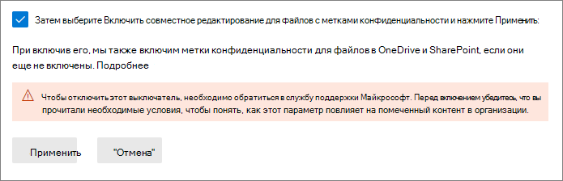
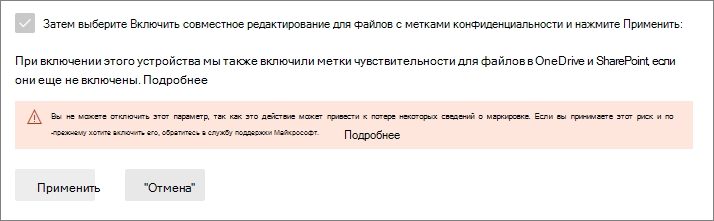

# <a name="enable-co-authoring-for-files-encrypted-with-sensitivity-labels"></a>Включение совместного редактирования для файлов, зашифрованных с помощью меток конфиденциальности

>*[Руководство по лицензированию Microsoft 365 для обеспечения безопасности и соответствия требованиям](https://aka.ms/ComplianceSD).*

> [!NOTE]
> Эта функция в настоящее время находится на этапе тестирования и может быть изменена. 
>
> Включите эту функцию в тестовом клиенте, а не в производственном клиенте, так как:
> - Эта функция вносит изменения в метаданные меток, и не все приложения на всех платформах в настоящее время поддерживают это изменение
> - Нельзя самостоятельно отключить эту функцию после ее включения

Включите параметр для поддержки [совместного редактирования](https://support.office.com/article/ee1509b4-1f6e-401e-b04a-782d26f564a4) для классических приложений Office, чтобы, когда документы будут помечены и зашифрованы [метками конфиденциальности](sensitivity-labels.md), несколько пользователей смогут редактировать эти документы одновременно.

Если этот параметр не включен для вашего клиента, пользователи должны проверять зашифрованный документ, хранящийся в SharePoint или OneDrive при использовании классических приложений Office. В результате они не могут совместно работать в режиме реального времени. Или они должны использовать Office в Интернете, если [метки конфиденциальности включены для файлов Office в SharePoint и OneDrive](sensitivity-labels-sharepoint-onedrive-files.md).

Кроме того, включение этой функции разрешает [автосохранение](https://support.office.com/article/what-is-autosave-6d6bd723-ebfd-4e40-b5f6-ae6e8088f7a5) для этих помеченных и зашифрованных файлов.

Чтобы ознакомиться с объявлением о выпуске, см. запись блога [Объявление об обновлениях меток и совместного редактирования в документах, зашифрованных с помощью Microsoft Information Protection](https://techcommunity.microsoft.com/t5/microsoft-security-and/announcing-co-authoring-on-microsoft-information-protection/ba-p/2164162).

## <a name="metadata-changes-for-sensitivity-labels"></a>Изменения метаданных для меток конфиденциальности

> [!IMPORTANT]
> После включения параметра совместного редактирования сведения о метке для незашифрованных файлов больше не сохраняются в настраиваемых свойствах.
> 
> Не включайте этот параметр, если вы используете приложения, службы, сценарии или инструменты, которые считывают или записывают метаданные меток в старое расположение.

Перед включением параметра для поддержки совместного редактирования для классических приложений Office, важно понимать, что это действие вносит изменения в метаданные меток, которые сохраняются в файлах Office и считываются из них.

Метаданные меток включают сведения, идентифицирующие клиента и примененную метку конфиденциальности. Изменение, которое вносит этот параметр, — это формат метаданных и расположение метаданных для незашифрованных файлов для Word, Excel и PowerPoint. Изменения метаданных меток для зашифрованных файлов или электронных писем не применяются.

Это изменение затрагивает как файлы с новыми метками, так и уже помеченные файлы. При использовании приложений и служб, поддерживающих параметр совместного редактирования:
- Для файлов с новыми метками метаданные меток используются только в новом формате и новом расположении.
- Для уже помеченных файлов, при следующем открытии и сохранении файла, при наличии у файла метаданных в старом формате и расположении, он будет скопирован в новый формат и расположение.

Дополнительные сведения об изменении метаданных можно найти в следующих ресурсах:

- Запись блога: [Предстоящие изменения хранилища метаданных Microsoft Information Protection](https://techcommunity.microsoft.com/t5/microsoft-security-and/upcoming-changes-to-microsoft-information-protection-metadata/ba-p/1904418)

- Открытые спецификации: [2.6.3 LabelInfo и настраиваемые свойства документа](https://docs.microsoft.com/openspecs/office_file_formats/ms-offcrypto/13939de6-c833-44ab-b213-e0088bf02341)

В силу данных изменений, не включайте этот параметр при наличии в вашей организации приложений, служб, сценариев или инструментов, которые считывают или записывают метаданные меток в старое расположение. В этом случае возможен ряд последствий:

- Помеченный документ будет виден пользователям без метки

- Документ будет отображать устаревшую метку для пользователей

- Функции совместного редактирования и автосохранения не будут работать для помеченного и зашифрованного документа при его открытии другим пользователем в классическом приложении Office, которое не поддерживает новые метаданные меток

- Правило потока почты Exchange Online, которое [определяет метки как настраиваемые свойства во вложениях Office](https://docs.microsoft.com/azure/information-protection/configure-exo-rules#example-2-rule-that-applies-the-encrypt-only-option-to-emails-when-they-have-attachments-that-are-labeled-confidential--partners-and-these-emails-are-sent-outside-the-organization), не может зашифровать электронную почту и вложения или неправильно их зашифровывает.

В следующем разделе вы можете найти список приложений и служб, которые поддерживают этот параметр, а также изменения метаданных меток.

## <a name="prerequisites"></a>Предварительные требования

Перед включением этой функции убедитесь, что вам понятны следующие предварительные требования.

- Для этой предварительной версии необходимо использовать тестовый клиент.

- Для включения этой функции необходимо быть глобальным администратором.

- Метки конфиденциальности должны быть [включены для файлов Office в SharePoint и OneDrive](sensitivity-labels-sharepoint-onedrive-files.md) клиента. Если эта функция еще не включена, она будет автоматически включена при выборе параметра для включения совместного редактирования для файлов с метками конфиденциальности.

- Приложения Microsoft 365 для предприятий:
    - **Windows**: [Актуальный канал (предварительная версия)](https://office.com/insider) с минимальной сборкой 16.0.13801.20182 или [Бета-канал](https://office.com/insider) с минимальной сборкой 16.0.13819.20006
    - **macOS**: [Бета-канал](https://office.com/insider) с минимальной сборкой 16.47.218.0
    - **IOS**: пока не поддерживается
    - **Android**: пока не поддерживается

- Все приложения, службы и операционные инструменты в клиенте должны поддерживать новые [метаданные меток](#metadata-changes-for-sensitivity-labels): Если вы используете любой из следующих вариантов, проверьте необходимую минимальную версию:
    
    - **Клиент и сканер унифицированных меток Azure Information Protection:**
        - Общедоступная предварительная версия (имя установки AzInfoProtection_2.10.46_CoAuthoring_PublicPreview.exe), которую можно установить из [Центра загрузки Майкрософт](https://www.microsoft.com/en-us/download/details.aspx?id=53018)
    
    - **Приложение синхронизации Microsoft OneDrive для Windows или macOS:**
        - Минимальная версия — 19.002.0121.0008
    
    - **Защита от потери данных в конечной точке (Политики защиты от потери данных конечной точки):**
        - Windows 10 1809 с базой данных 4601383
        - Windows 10 1903 и 1909 с базой данных 4601380
        - Windows 10 2004 с базой данных 4601382
    
    - **Приложения и службы, использующие пакет SDK Microsoft Information Protection:** 
        - Минимальная версия — 1.7 

При включении этой функции службы Microsoft 365 автоматически поддерживают новые метаданные меток. Например:

- [Политики автоматического применения меток](apply-sensitivity-label-automatically.md#how-to-configure-auto-labeling-policies-for-sharepoint-onedrive-and-exchange)
- [Использование меток конфиденциальности в качестве условия в политиках защиты от потери данных](dlp-sensitivity-label-as-condition.md)
- [Microsoft Cloud App Security настроено для применения меток конфиденциальности](https://docs.microsoft.com/cloud-app-security/best-practices#discover-classify-label-and-protect-regulated-and-sensitive-data-stored-in-the-cloud)

## <a name="limitations"></a>Ограничения

Перед включением параметра клиента для совместного редактирования файлов, зашифрованных с помощью меток конфиденциальности, убедитесь, что вам понятны следующие ограничения этой функции.

- В силу [изменений метаданных меток](#metadata-changes-for-sensitivity-labels) все приложения, службы и операционные инструменты в клиенте должны поддерживать новые метаданные меток для единообразного и надежного процесса применения меток.
    
    Специально для Excel: метаданные для метки конфиденциальности, не применяющей шифрование, могут быть удалены из файла, если какой-либо пользователь редактирует и сохраняет этот файл с помощью версии Excel, которая не поддерживает изменения метаданных для меток конфиденциальности.

- Совместное редактирование и автосохранение не поддерживаются и не работают для помеченных и зашифрованных документов Office, которые используют любую из следующих [конфигураций для шифрования](encryption-sensitivity-labels.md#configure-encryption-settings):
    - **Разрешить пользователям назначать разрешения при применении метки** и если выбран флажок **предлагать пользователям указать разрешения в Word, PowerPoint и Excel**. Эту конфигурацию иногда называют "пользовательскими разрешениями".
    - Для параметра **Срок действия доступа пользователей к содержимому истекает** установлено значение, отличное от **никогда**.
    - Выбрано: **Шифрование с двойным ключом**.
    
    Метки с любой из этих конфигураций шифрования отображаются в приложениях Office. Однако, когда пользователи выбирают эти метки и другие пользователи не редактируют документ, они получают предупреждение о том, что совместное редактирование и автосохранение будут недоступны. Если другой пользователь редактирует документ, пользователи увидят сообщение о том, что метки не могут быть применены.

- Если вы используете клиент унифицированного применения меток Azure Information Protection: ознакомьтесь с документацией для этого клиента применения меток, включающей [дополнительные требования или ограничения](https://docs.microsoft.com/azure/information-protection/known-issues#known-issues-for-co-authoring-public-preview).

## <a name="known-issues-for-this-preview"></a>Известные проблемы в этой предварительной версии

Эта предварительная версия совместного редактирования для файлов, зашифрованных с помощью меток конфиденциальности, имеет следующие известные проблемы:

- Пользователи не смогут применять метки в Office в Интернете к файлам Word, Excel и PowerPoint, размер которых превышает 300 МБ. Для этих файлов можно использовать классические приложения Office для применения метки, но вы должны быть единственным пользователем, у которого открыт файл.

- При использовании [меток конфиденциальности в качестве условия в политиках защиты от потери данных](dlp-sensitivity-label-as-condition.md), незашифрованные вложения для сообщений электронной почты не поддерживаются.

- Приложения Office для iOS и Android не поддерживаются.

## <a name="how-to-enable-co-authoring-for-files-with-sensitivity-labels"></a>Как включить совместное редактирование для файлов с метками конфиденциальности

> [!CAUTION]
> Включение этого параметра является односторонним действием. Пока функция представлена в предварительной версии, протестировать ее можно только в непроизводительной среде и только после прочтения и осознания сути изменений метаданных, предварительных требований, ограничений и известных проблем, описанных на этой странице.

Во время предварительного просмотра необходимо использовать определенный URL-адрес для доступа к этому параметру в Центре соответствия требованиям Microsoft 365.

1. Войдите в Центр соответствия требованиям Microsoft 365 в качестве глобального администратора для тестового клиента, используя следующую ссылку:
    
    ```http
    https://compliance.microsoft.com/co-authoring_for_files_with_sensitivity_labels
    ```
    По этой ссылке вы можете перейти непосредственно к параметру клиента, **Совместное редактирование файлов с метками конфиденциальности**.

    > [!IMPORTANT]
    > Прежде чем продолжить, убедитесь, что вы выполнили вход в тестовый клиент, который не повлияет на ваших пользователей: 
    >
    > Выберите кружок с инициалами вашей учетной записи в правом верхнем углу Центра соответствия требованиям и убедитесь, что в имени клиента действительно отображается предполагаемый тестовый клиент.
    
2. Ознакомьтесь со сводным описанием, предварительными требованиями, сведениями о том, чего ожидать, и предупреждением о том, что вы не сможете отключить этот параметр после его включения. Затем выберите **Включить совместное редактирование для файлов с метками конфиденциальности** и нажмите **Применить**:
    
    

3. Подождите 24 часа, пока этот параметр будет реплицирован в вашей среде, прежде чем протестировать эту новую функцию для совместного редактирования.

## <a name="contact-support-if-you-need-to-disable-this-feature"></a>Если вам нужно отключить эту функцию, обратитесь в службу поддержки

> [!IMPORTANT]
> Если вам действительно нужно отключить эту функцию, помните, что сведения о метке могут быть потеряны.

После включения функции совместного редактирования файлов с метками конфиденциальности для клиента, вы не сможете отключить этот параметр самостоятельно. Именно поэтому так важно проверить и понять предварительные требования, последствия и ограничения перед включением этого параметра. Именно поэтому мы рекомендуем протестировать эту функцию с помощью тестового клиента, а не производственного клиента.



Как видно на снимке экрана, когда этот параметр включен, вы можете обратиться в [службу поддержки Майкрософт](https://docs.microsoft.com/office365/admin/contact-support-for-business-products) и запросить отключение этого параметра. Этот запрос может занять несколько дней, и вам потребуется подтвердить, что вы являетесь глобальным администратором клиента. Ожидайте, что может быть применена обычная плата за поддержку. 

Если инженер службы поддержки отключает этот параметр для вашего клиента:

- Приложения и службы, которые поддерживают новые метаданные меток, вернутся к исходному формату и расположению метаданных при чтении или сохранении меток.

- Новый формат и расположение метаданных для документов Office, которые использовались при включенном параметре, не будут скопированы в исходный формат и расположение. В результате эти сведения о метке для незашифрованных файлов Word, Excel и PowerPoint будут потеряны.

- Совместное редактирование и автосохранение больше не будут работать в вашем клиенте.

- Метки конфиденциальности остаются включенными для файлов Office в OneDrive и SharePoint.
